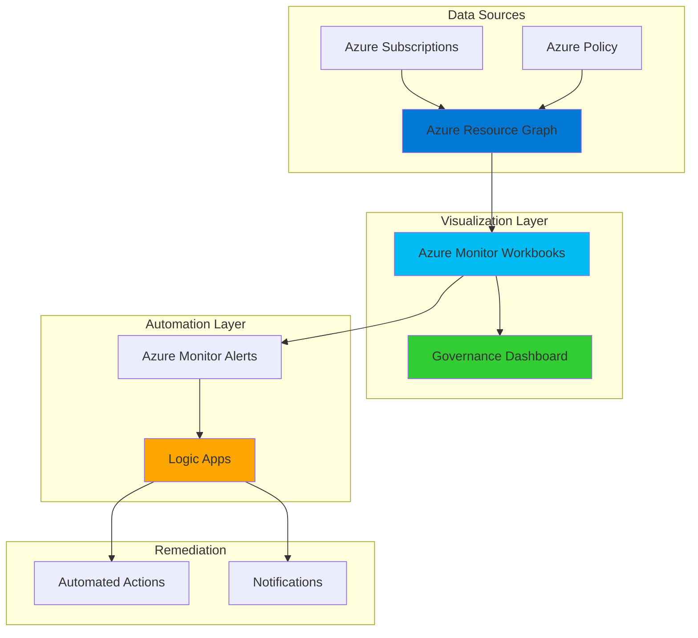

# Governance Dashboard Automation with Resource Graph and Monitor Workbooks

## Problem

Organizations struggle with maintaining visibility into their Azure resource governance and compliance posture across multiple subscriptions and resource groups. Traditional manual approaches to governance reporting are time-consuming, error-prone, and often provide outdated information. IT teams need real-time insights into resource compliance, policy violations, and security posture to make informed decisions and ensure adherence to organizational standards.

## Solution

Azure Resource Graph combined with Azure Monitor Workbooks provides a powerful solution for automated governance dashboards that continuously monitor resource compliance and generate visual reports. This architecture leverages Resource Graph's powerful query capabilities to extract governance data across Azure subscriptions, presents it through interactive workbooks, and triggers automated remediation workflows via Logic Apps when policy violations are detected.

## Architecture Diagram



## Prerequisites

1. Azure subscription with appropriate permissions for Resource Graph, Monitor Workbooks, Policy, and Logic Apps
2. Azure CLI v2.60.0 or later installed and configured (or Azure CloudShell)
3. Understanding of Azure Resource Graph query language (KQL)
4. Knowledge of Azure Policy and governance concepts
5. Estimated cost: $5-15 per month for Logic Apps execution and monitoring

> **Note**: This recipe requires Reader permissions across all subscriptions you want to monitor, plus Contributor permissions for Logic Apps automation.

## Preparation

Azure Resource Graph provides enterprise-scale resource discovery and governance across Azure subscriptions. By combining it with Azure Monitor Workbooks, organizations can create comprehensive governance dashboards that provide real-time visibility into compliance posture, resource utilization, and policy adherence. This foundation enables proactive governance management and automated remediation workflows.

```bash
# Set environment variables for Azure resources
export RESOURCE_GROUP="rg-governance-dashboard"
export LOCATION="eastus"
export SUBSCRIPTION_ID=$(az account show --query id --output tsv)

# Generate unique suffix for resource names
RANDOM_SUFFIX=$(openssl rand -hex 3)
export WORKBOOK_NAME="governance-dashboard-${RANDOM_SUFFIX}"
export LOGIC_APP_NAME="governance-automation-${RANDOM_SUFFIX}"

# Create resource group for governance components
az group create \
    --name ${RESOURCE_GROUP} \
    --location ${LOCATION} \
    --tags purpose=governance environment=production

echo "✅ Resource group created: ${RESOURCE_GROUP}"

# Verify Resource Graph provider registration
az provider register --namespace Microsoft.ResourceGraph
az provider show --namespace Microsoft.ResourceGraph --query "registrationState"

echo "✅ Azure Resource Graph provider registered"
```

## Steps

1. **Create Sample Resource Graph Queries for Governance**:

   Azure Resource Graph enables powerful querying across Azure subscriptions using KQL (Kusto Query Language). These queries form the foundation of our governance dashboard by extracting critical compliance and resource information. Resource Graph maintains a near real-time view of Azure resources, making it ideal for governance monitoring that requires current data.

   ```bash
   # Create a file with sample Resource Graph queries
   cat > governance-queries.kql << 'EOF'
   // Query 1: Resources without required tags
   resources
   | where tags !has "Environment" or tags !has "Owner" or tags !has "CostCenter"
   | project name, type, resourceGroup, subscriptionId, location, tags
   | limit 1000
   
   // Query 2: Non-compliant resource locations
   resources
   | where location !in ("eastus", "westus", "centralus")
   | project name, type, resourceGroup, location, subscriptionId
   | limit 1000
   
   // Query 3: Resources by compliance state
   policyresources
   | where type == "microsoft.policyinsights/policystates"
   | project resourceId, policyAssignmentName, policyDefinitionName, complianceState, timestamp
   | summarize count() by complianceState
   
   // Query 4: Security center recommendations
   securityresources
   | where type == "microsoft.security/assessments"
   | project resourceId, displayName, status, severity
   | summarize count() by status.code
   
   // Query 5: Resource count by type and location
   resources
   | summarize count() by type, location
   | order by count_ desc
   EOF
   
   echo "✅ Sample governance queries created"
   ```

2. **Test Resource Graph Queries**:

   Before implementing the dashboard, it's essential to validate that our Resource Graph queries return meaningful data. Azure Resource Graph provides immediate feedback on query syntax and performance, allowing us to optimize queries for dashboard responsiveness. This testing phase ensures our governance metrics are accurate and comprehensive.

   ```bash
   # Test basic resource query
   az graph query \
       --graph-query "resources | summarize count() by type | top 10 by count_" \
       --subscriptions ${SUBSCRIPTION_ID}
   
   # Test policy compliance query
   az graph query \
       --graph-query "policyresources | where type == 'microsoft.policyinsights/policystates' | summarize count() by complianceState" \
       --subscriptions ${SUBSCRIPTION_ID}
   
   # Test resources without required tags
   az graph query \
       --graph-query "resources | where tags !has 'Environment' | project name, type, resourceGroup | limit 5" \
       --subscriptions ${SUBSCRIPTION_ID}
   
   echo "✅ Resource Graph queries tested successfully"
   ```

3. **Create Azure Monitor Workbook Template**:

   Azure Monitor Workbooks provide rich visualization capabilities for governance data through interactive dashboards. Creating a workbook template establishes the foundation for our governance dashboard with predefined visualizations, parameter controls, and query structures. This template-based approach ensures consistency across different environments and simplifies deployment.

   ```bash
   # Create workbook template JSON
   cat > governance-workbook-template.json << 'EOF'
   {
     "version": "Notebook/1.0",
     "items": [
       {
         "type": 1,
         "content": {
           "json": "# Azure Governance Dashboard\n\nThis dashboard provides comprehensive visibility into Azure resource governance, compliance, and security posture across your organization."
         },
         "name": "Dashboard Title"
       },
       {
         "type": 9,
         "content": {
           "version": "KqlParameterItem/1.0",
           "parameters": [
             {
               "id": "subscription-param",
               "version": "KqlParameterItem/1.0",
               "name": "Subscription",
               "type": 6,
               "description": "Select subscription(s) to monitor",
               "isRequired": true,
               "multiSelect": true,
               "quote": "'",
               "delimiter": ",",
               "value": []
             }
           ],
           "style": "pills",
           "queryType": 1,
           "resourceType": "microsoft.resourcegraph/resources"
         },
         "name": "Subscription Parameters"
       },
       {
         "type": 3,
         "content": {
           "version": "KqlItem/1.0",
           "query": "resources | summarize ResourceCount=count() by Type=type | top 10 by ResourceCount desc",
           "size": 0,
           "title": "Top Resource Types",
           "queryType": 1,
           "resourceType": "microsoft.resourcegraph/resources",
           "visualization": "piechart"
         },
         "name": "Resource Types Chart"
       },
       {
         "type": 3,
         "content": {
           "version": "KqlItem/1.0",
           "query": "resources | where tags !has 'Environment' or tags !has 'Owner' | summarize NonCompliantResources=count() by ResourceGroup=resourceGroup | top 10 by NonCompliantResources desc",
           "size": 0,
           "title": "Resources Missing Required Tags",
           "queryType": 1,
           "resourceType": "microsoft.resourcegraph/resources",
           "visualization": "table"
         },
         "name": "Compliance Table"
       }
     ],
     "fallbackResourceIds": [],
     "fromTemplateId": "governance-dashboard-template"
   }
   EOF
   
   echo "✅ Workbook template created"
   ```

4. **Deploy Azure Monitor Workbook**:

   Deploying the workbook template creates our governance dashboard in Azure Monitor. This step establishes the interactive visualization layer that will display our governance metrics, compliance data, and security insights. The workbook deployment enables stakeholders to access real-time governance information through an intuitive web interface.

   ```bash
   # Deploy the workbook using Azure CLI
   az monitor app-insights workbook create \
       --resource-group ${RESOURCE_GROUP} \
       --name ${WORKBOOK_NAME} \
       --display-name "Governance Dashboard" \
       --description "Automated governance and compliance dashboard" \
       --category "governance" \
       --serialized-data @governance-workbook-template.json \
       --location ${LOCATION}
   
   # Get the workbook resource ID
   WORKBOOK_ID=$(az monitor app-insights workbook show \
       --resource-group ${RESOURCE_GROUP} \
       --name ${WORKBOOK_NAME} \
       --query id --output tsv)
   
   echo "✅ Governance workbook deployed: ${WORKBOOK_ID}"
   ```

5. **Create Logic App for Automated Governance Actions**:

   Azure Logic Apps enables automated responses to governance violations and compliance issues. By creating a Logic App workflow, we establish the automation layer that can trigger remediation actions, send notifications, and execute governance policies automatically. This automation reduces manual intervention and ensures consistent governance enforcement.

   ```bash
   # Create Logic App for governance automation
   az logic workflow create \
       --resource-group ${RESOURCE_GROUP} \
       --name ${LOGIC_APP_NAME} \
       --location ${LOCATION} \
       --definition '{
         "$schema": "https://schema.management.azure.com/providers/Microsoft.Logic/schemas/2016-06-01/workflowdefinition.json#",
         "contentVersion": "1.0.0.0",
         "parameters": {},
         "triggers": {
           "manual": {
             "type": "Request",
             "kind": "Http",
             "inputs": {
               "schema": {
                 "properties": {
                   "alertType": { "type": "string" },
                   "resourceId": { "type": "string" },
                   "severity": { "type": "string" }
                 },
                 "type": "object"
               }
             }
           }
         },
         "actions": {
           "Send_notification": {
             "type": "Http",
             "inputs": {
               "method": "POST",
               "uri": "https://hooks.slack.com/services/YOUR/SLACK/WEBHOOK",
               "body": {
                 "text": "Governance Alert: @{triggerBody()?[\"alertType\"]} for resource @{triggerBody()?[\"resourceId\"]}"
               }
             }
           }
         }
       }'
   
   # Get the Logic App trigger URL
   LOGIC_APP_URL=$(az logic workflow show \
       --resource-group ${RESOURCE_GROUP} \
       --name ${LOGIC_APP_NAME} \
       --query "accessEndpoint" --output tsv)
   
   echo "✅ Logic App created: ${LOGIC_APP_URL}"
   ```

6. **Configure Azure Monitor Alerts for Governance Violations**:

   Azure Monitor alerts provide real-time notifications when governance violations occur. By configuring alert rules based on Resource Graph queries, we create a proactive monitoring system that detects compliance issues immediately. These alerts trigger our Logic App workflows to enable automated remediation and stakeholder notifications.

   ```bash
   # Create action group for governance alerts
   az monitor action-group create \
       --resource-group ${RESOURCE_GROUP} \
       --name "governance-alerts" \
       --short-name "gov-alerts" \
       --action webhook governance-webhook ${LOGIC_APP_URL}
   
   # Create alert rule for non-compliant resources
   az monitor metrics alert create \
       --name "governance-compliance-alert" \
       --resource-group ${RESOURCE_GROUP} \
       --scopes "/subscriptions/${SUBSCRIPTION_ID}" \
       --condition "avg ActivityLog.Category == 'Policy' and ActivityLog.Level == 'Error'" \
       --description "Alert for policy compliance violations" \
       --evaluation-frequency 5m \
       --window-size 5m \
       --severity 2 \
       --action "governance-alerts"
   
   echo "✅ Governance alerts configured"
   ```

7. **Create Scheduled Query for Automated Reporting**:

   Scheduled queries enable automatic execution of governance assessments at regular intervals. This automation ensures continuous monitoring of compliance posture without manual intervention. The scheduled queries feed data into our workbook dashboard and trigger alerts when governance thresholds are exceeded.

   ```bash
   # Create Log Analytics workspace for governance data
   az monitor log-analytics workspace create \
       --resource-group ${RESOURCE_GROUP} \
       --workspace-name "governance-workspace-${RANDOM_SUFFIX}" \
       --location ${LOCATION}
   
   # Get workspace ID
   WORKSPACE_ID=$(az monitor log-analytics workspace show \
       --resource-group ${RESOURCE_GROUP} \
       --workspace-name "governance-workspace-${RANDOM_SUFFIX}" \
       --query customerId --output tsv)
   
   # Create scheduled query rule
   az monitor scheduled-query create \
       --name "governance-compliance-check" \
       --resource-group ${RESOURCE_GROUP} \
       --scopes "/subscriptions/${SUBSCRIPTION_ID}" \
       --condition "count 'Heartbeat | where TimeGenerated > ago(5m)' > 0" \
       --description "Scheduled governance compliance check" \
       --evaluation-frequency 15m \
       --window-size 15m \
       --severity 3 \
       --action-groups "governance-alerts"
   
   echo "✅ Scheduled governance queries configured"
   ```

8. **Test End-to-End Governance Workflow**:

   Testing the complete governance workflow validates that all components work together seamlessly. This comprehensive test ensures that governance violations are detected, alerts are triggered, and automated remediation actions execute correctly. End-to-end testing confirms that our governance dashboard provides actionable insights and automated responses.

   ```bash
   # Test Resource Graph connectivity
   az graph query \
       --graph-query "resources | limit 1" \
       --subscriptions ${SUBSCRIPTION_ID}
   
   # Test Logic App trigger
   curl -X POST \
       -H "Content-Type: application/json" \
       -d '{"alertType": "test", "resourceId": "test-resource", "severity": "high"}' \
       ${LOGIC_APP_URL}
   
   # Verify workbook accessibility
   echo "Access your governance dashboard at:"
   echo "https://portal.azure.com/#blade/Microsoft_Azure_Monitoring/WorkbooksMenuBlade/workbook/${WORKBOOK_ID}"
   
   echo "✅ End-to-end governance workflow tested"
   ```

## Validation & Testing

1. **Verify Resource Graph Query Performance**:

   ```bash
   # Test query performance and results
   az graph query \
       --graph-query "resources | summarize count() by type" \
       --subscriptions ${SUBSCRIPTION_ID} \
       --output table
   ```

   Expected output: Table showing resource counts by type across your subscription.

2. **Test Workbook Dashboard Functionality**:

   ```bash
   # Verify workbook deployment
   az monitor app-insights workbook show \
       --resource-group ${RESOURCE_GROUP} \
       --name ${WORKBOOK_NAME} \
       --query "displayName" --output tsv
   ```

   Expected output: "Governance Dashboard"

3. **Validate Logic App Automation**:

   ```bash
   # Check Logic App status
   az logic workflow show \
       --resource-group ${RESOURCE_GROUP} \
       --name ${LOGIC_APP_NAME} \
       --query "state" --output tsv
   ```

   Expected output: "Enabled"

4. **Test Alert Configuration**:

   ```bash
   # Verify alert rules
   az monitor metrics alert show \
       --name "governance-compliance-alert" \
       --resource-group ${RESOURCE_GROUP} \
       --query "enabled" --output tsv
   ```

   Expected output: "True"

## Cleanup

1. **Remove Alert Rules and Action Groups**:

   ```bash
   # Delete alert rules
   az monitor metrics alert delete \
       --name "governance-compliance-alert" \
       --resource-group ${RESOURCE_GROUP}
   
   # Delete action groups
   az monitor action-group delete \
       --name "governance-alerts" \
       --resource-group ${RESOURCE_GROUP}
   
   echo "✅ Alert rules and action groups removed"
   ```

2. **Delete Logic App Workflow**:

   ```bash
   # Delete Logic App
   az logic workflow delete \
       --resource-group ${RESOURCE_GROUP} \
       --name ${LOGIC_APP_NAME}
   
   echo "✅ Logic App deleted"
   ```

3. **Remove Workbook and Log Analytics Workspace**:

   ```bash
   # Delete workbook
   az monitor app-insights workbook delete \
       --resource-group ${RESOURCE_GROUP} \
       --name ${WORKBOOK_NAME}
   
   # Delete Log Analytics workspace
   az monitor log-analytics workspace delete \
       --resource-group ${RESOURCE_GROUP} \
       --workspace-name "governance-workspace-${RANDOM_SUFFIX}" \
       --force true
   
   echo "✅ Workbook and Log Analytics workspace deleted"
   ```

4. **Delete Resource Group**:

   ```bash
   # Delete resource group and all contained resources
   az group delete \
       --name ${RESOURCE_GROUP} \
       --yes \
       --no-wait
   
   echo "✅ Resource group deletion initiated: ${RESOURCE_GROUP}"
   echo "Note: Deletion may take several minutes to complete"
   ```

## Discussion

Azure Resource Graph combined with Azure Monitor Workbooks creates a powerful governance platform that provides comprehensive visibility into Azure resource compliance and security posture. This solution leverages Resource Graph's ability to query across multiple subscriptions at scale, providing near real-time insights into resource configurations, policy compliance, and security assessments. The integration with Azure Monitor Workbooks enables rich visualizations and interactive dashboards that make governance data accessible to stakeholders across the organization. For comprehensive guidance on Azure governance, see the [Azure governance documentation](https://docs.microsoft.com/en-us/azure/governance/) and [Resource Graph best practices](https://docs.microsoft.com/en-us/azure/governance/resource-graph/overview).

The automated workflow capabilities provided by Azure Logic Apps transform static governance reporting into proactive compliance management. When governance violations are detected through Resource Graph queries, the system can automatically trigger remediation actions, send notifications to responsible teams, and create audit trails for compliance reporting. This automation reduces the time between violation detection and remediation, improving overall security posture and compliance adherence. The solution follows Azure Well-Architected Framework principles by implementing automated monitoring, proactive alerting, and efficient resource management practices.

From a cost perspective, this solution provides significant value by preventing governance violations before they become costly security incidents or compliance failures. Azure Resource Graph queries are free for the first 1,000 requests per month, and Azure Monitor Workbooks have no additional charges beyond the underlying data storage. Logic Apps pricing is based on execution frequency, making it cost-effective for governance automation scenarios. For detailed cost optimization strategies, review the [Azure Monitor pricing guide](https://docs.microsoft.com/en-us/azure/azure-monitor/usage-estimated-costs) and [Logic Apps pricing documentation](https://docs.microsoft.com/en-us/azure/logic-apps/logic-apps-pricing).

> **Tip**: Use Azure Policy integration with Resource Graph to create policy-driven governance dashboards that automatically update based on your organization's compliance requirements. The [Azure Policy documentation](https://docs.microsoft.com/en-us/azure/governance/policy/) provides comprehensive guidance on implementing governance policies and monitoring compliance across your Azure environment.

## Challenge

Extend this governance solution by implementing these enhancements:

1. **Multi-Tenant Governance**: Configure Resource Graph queries to monitor resources across multiple Azure tenants using Azure Lighthouse delegation for comprehensive governance visibility.

2. **Custom Compliance Frameworks**: Create specialized workbook templates that align with industry-specific compliance requirements (SOX, HIPAA, PCI-DSS) using targeted Resource Graph queries.

3. **Automated Remediation**: Enhance the Logic App workflows to automatically remediate common governance violations such as applying missing tags, adjusting resource configurations, or triggering Azure Policy deployments.

4. **Advanced Analytics**: Integrate Azure Synapse Analytics or Power BI with Resource Graph data to create predictive governance analytics and trend analysis for proactive compliance management.

5. **Integration with Third-Party Tools**: Extend the Logic App workflows to integrate with external ITSM systems, security orchestration platforms, or governance risk and compliance (GRC) tools for comprehensive organizational governance.

## Infrastructure Code

*Infrastructure code will be generated after recipe approval.*