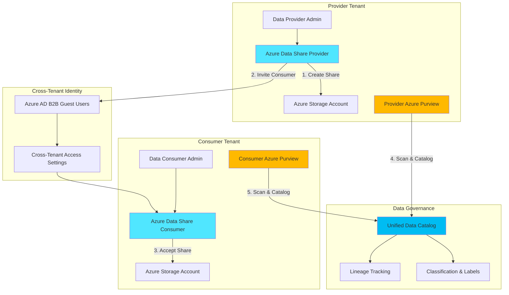

# Governed Cross-Tenant Data Collaboration with Data Share and Purview

## Problem

Organizations increasingly need to share datasets across business boundaries while maintaining strict governance, compliance, and visibility requirements. Traditional file-sharing methods lack proper access controls, audit trails, and data lineage tracking, creating security risks and making it difficult to demonstrate compliance with data regulations when collaborating with external partners or subsidiaries.

## Solution

Azure Data Share combined with Azure Purview creates a secure, governed data collaboration platform that enables organizations to share datasets across Azure tenants with full lineage tracking, access control, and unified data cataloging. This architecture provides snapshot-based or in-place sharing capabilities while maintaining complete visibility of data flows through Purview's data governance features.

## Architecture Diagram



## Prerequisites

1. Two Azure subscriptions (one for provider, one for consumer) with Owner or Contributor permissions
2. Azure CLI version 2.50.0 or later installed and configured
3. Azure AD permissions to configure B2B collaboration and cross-tenant access
4. Basic understanding of Azure storage services and data governance concepts
5. Estimated cost: ~$50-100/month for Purview instances plus storage and Data Share costs

> **Note**: Azure Purview requires a minimum of 1 capacity unit (CU) which incurs hourly charges. Plan your deployment schedule to minimize costs during testing.

## Preparation

```bash
# Set environment variables for Provider Tenant
export PROVIDER_SUBSCRIPTION_ID="your-provider-subscription-id"
export CONSUMER_SUBSCRIPTION_ID="your-consumer-subscription-id"
export LOCATION="eastus"
export PROVIDER_RG="rg-datashare-provider"
export CONSUMER_RG="rg-datashare-consumer"

# Generate unique suffix for resource names
RANDOM_SUFFIX=$(openssl rand -hex 3)
export PROVIDER_STORAGE="stprovider${RANDOM_SUFFIX}"
export CONSUMER_STORAGE="stconsumer${RANDOM_SUFFIX}"
export PROVIDER_SHARE="share-provider-${RANDOM_SUFFIX}"
export CONSUMER_SHARE="share-consumer-${RANDOM_SUFFIX}"
export PROVIDER_PURVIEW="purview-provider-${RANDOM_SUFFIX}"
export CONSUMER_PURVIEW="purview-consumer-${RANDOM_SUFFIX}"

# Login to Azure and set provider subscription
az login
az account set --subscription ${PROVIDER_SUBSCRIPTION_ID}

# Create provider resource group
az group create \
    --name ${PROVIDER_RG} \
    --location ${LOCATION} \
    --tags purpose=datashare-demo environment=provider

echo "✅ Provider resource group created: ${PROVIDER_RG}"
```

## Steps

1. **Create Provider Infrastructure**:

   Azure Data Share requires a storage account to host the datasets that will be shared. The provider maintains full control over access permissions and can revoke sharing at any time. Creating the storage infrastructure first establishes the foundation for secure data collaboration across tenant boundaries.

   ```bash
   # Create provider storage account
   az storage account create \
       --name ${PROVIDER_STORAGE} \
       --resource-group ${PROVIDER_RG} \
       --location ${LOCATION} \
       --sku Standard_LRS \
       --kind StorageV2 \
       --hierarchical-namespace true
   
   # Create container for shared data
   az storage container create \
       --name shared-datasets \
       --account-name ${PROVIDER_STORAGE} \
       --auth-mode login
   
   # Create Azure Data Share account
   az datashare account create \
       --name ${PROVIDER_SHARE} \
       --resource-group ${PROVIDER_RG} \
       --location ${LOCATION}
   
   echo "✅ Provider infrastructure created successfully"
   ```

   The provider infrastructure is now ready to host and share datasets. The hierarchical namespace enables Azure Data Lake Storage Gen2 features, providing better performance and access control for large-scale data sharing scenarios.

2. **Deploy Provider Azure Purview Instance**:

   Azure Purview provides comprehensive data governance capabilities including automated discovery, classification, and lineage tracking. Deploying Purview in the provider tenant enables centralized visibility of all shared datasets while maintaining compliance with data regulations through built-in classification and sensitivity labeling.

   ```bash
   # Create Purview account (this may take 5-10 minutes)
   az purview account create \
       --name ${PROVIDER_PURVIEW} \
       --resource-group ${PROVIDER_RG} \
       --location ${LOCATION} \
       --sku Standard_4
   
   # Get Purview managed identity
   PROVIDER_PURVIEW_IDENTITY=$(az purview account show \
       --name ${PROVIDER_PURVIEW} \
       --resource-group ${PROVIDER_RG} \
       --query identity.principalId -o tsv)
   
   # Grant Purview access to storage account
   az role assignment create \
       --role "Storage Blob Data Reader" \
       --assignee ${PROVIDER_PURVIEW_IDENTITY} \
       --scope /subscriptions/${PROVIDER_SUBSCRIPTION_ID}/resourceGroups/${PROVIDER_RG}/providers/Microsoft.Storage/storageAccounts/${PROVIDER_STORAGE}
   
   echo "✅ Provider Purview instance deployed"
   ```

3. **Configure Consumer Infrastructure**:

   The consumer tenant requires its own storage and Data Share infrastructure to receive shared datasets. This separation ensures data sovereignty and allows each organization to maintain independent control over their data infrastructure while still enabling secure collaboration through Azure's managed services.

   ```bash
   # Switch to consumer subscription
   az account set --subscription ${CONSUMER_SUBSCRIPTION_ID}
   
   # Create consumer resource group
   az group create \
       --name ${CONSUMER_RG} \
       --location ${LOCATION} \
       --tags purpose=datashare-demo environment=consumer
   
   # Create consumer storage account
   az storage account create \
       --name ${CONSUMER_STORAGE} \
       --resource-group ${CONSUMER_RG} \
       --location ${LOCATION} \
       --sku Standard_LRS \
       --kind StorageV2 \
       --hierarchical-namespace true
   
   # Create consumer Data Share account
   az datashare account create \
       --name ${CONSUMER_SHARE} \
       --resource-group ${CONSUMER_RG} \
       --location ${LOCATION}
   
   echo "✅ Consumer infrastructure created successfully"
   ```

4. **Deploy Consumer Azure Purview Instance**:

   Deploying Purview in the consumer tenant enables the receiving organization to maintain their own data governance policies while participating in cross-tenant collaboration. This dual-Purview architecture supports federated governance models where each organization maintains autonomy while sharing common data assets.

   ```bash
   # Create consumer Purview account
   az purview account create \
       --name ${CONSUMER_PURVIEW} \
       --resource-group ${CONSUMER_RG} \
       --location ${LOCATION} \
       --sku Standard_4
   
   # Get consumer Purview managed identity
   CONSUMER_PURVIEW_IDENTITY=$(az purview account show \
       --name ${CONSUMER_PURVIEW} \
       --resource-group ${CONSUMER_RG} \
       --query identity.principalId -o tsv)
   
   # Grant Purview access to consumer storage
   az role assignment create \
       --role "Storage Blob Data Reader" \
       --assignee ${CONSUMER_PURVIEW_IDENTITY} \
       --scope /subscriptions/${CONSUMER_SUBSCRIPTION_ID}/resourceGroups/${CONSUMER_RG}/providers/Microsoft.Storage/storageAccounts/${CONSUMER_STORAGE}
   
   echo "✅ Consumer Purview instance deployed"
   ```

5. **Configure Cross-Tenant B2B Collaboration**:

   Azure AD B2B collaboration enables secure guest user access across tenant boundaries. Configuring cross-tenant access settings establishes the trust relationship required for Data Share invitations while maintaining security through conditional access policies and multi-factor authentication requirements.

   ```bash
   # Switch back to provider subscription
   az account set --subscription ${PROVIDER_SUBSCRIPTION_ID}
   
   # Get provider tenant ID
   PROVIDER_TENANT_ID=$(az account show --query tenantId -o tsv)
   
   # Get consumer tenant ID
   az account set --subscription ${CONSUMER_SUBSCRIPTION_ID}
   CONSUMER_TENANT_ID=$(az account show --query tenantId -o tsv)
   
   # Note: Cross-tenant access settings must be configured in Azure Portal
   echo "Provider Tenant ID: ${PROVIDER_TENANT_ID}"
   echo "Consumer Tenant ID: ${CONSUMER_TENANT_ID}"
   echo ""
   echo "⚠️  Manual step required:"
   echo "1. Navigate to Azure Portal > Azure AD > External Identities"
   echo "2. Configure Cross-tenant access settings"
   echo "3. Add ${CONSUMER_TENANT_ID} as allowed tenant"
   echo "4. Enable B2B collaboration for Data Share service"
   ```

6. **Create and Configure Data Share**:

   Creating a data share establishes the sharing relationship and defines which datasets will be made available to consumers. The provider maintains full control over the share lifecycle, including the ability to add or remove datasets, set synchronization schedules, and revoke access when needed.

   ```bash
   # Switch to provider subscription
   az account set --subscription ${PROVIDER_SUBSCRIPTION_ID}
   
   # Create a share in provider account
   az datashare create \
       --account-name ${PROVIDER_SHARE} \
       --resource-group ${PROVIDER_RG} \
       --name "cross-tenant-dataset" \
       --description "Cross-tenant collaborative dataset" \
       --terms "Standard data sharing terms apply"
   
   # Create dataset in the share (pointing to blob container)
   az datashare dataset blob-container create \
       --account-name ${PROVIDER_SHARE} \
       --resource-group ${PROVIDER_RG} \
       --share-name "cross-tenant-dataset" \
       --name "shared-container-dataset" \
       --container-name "shared-datasets" \
       --storage-account-name ${PROVIDER_STORAGE} \
       --resource-group ${PROVIDER_RG}
   
   echo "✅ Data share created and configured"
   ```

7. **Configure Purview Data Scanning**:

   Purview's automated scanning capabilities discover and catalog data assets across your storage infrastructure. Configuring regular scans ensures that shared datasets are automatically discovered, classified, and tracked for lineage, providing complete visibility into data movement across tenant boundaries.

   ```bash
   # Create scan definition for provider storage
   # Note: This requires using Purview Studio UI or REST API
   echo "Manual configuration required in Purview Studio:"
   echo "1. Open Purview Studio for ${PROVIDER_PURVIEW}"
   echo "2. Navigate to Data Map > Sources"
   echo "3. Register ${PROVIDER_STORAGE} as a data source"
   echo "4. Create a scan with weekly schedule"
   echo "5. Enable automatic classification"
   echo ""
   echo "Provider Purview URL: https://${PROVIDER_PURVIEW}.purview.azure.com"
   
   # Store Purview endpoints for later use
   PROVIDER_PURVIEW_ENDPOINT="https://${PROVIDER_PURVIEW}.purview.azure.com"
   CONSUMER_PURVIEW_ENDPOINT="https://${CONSUMER_PURVIEW}.purview.azure.com"
   ```

8. **Set Up Data Lineage Tracking**:

   Data lineage tracking provides end-to-end visibility of data movement from source to destination across tenant boundaries. This capability is essential for regulatory compliance and helps organizations understand the complete lifecycle of their shared data assets.

   ```bash
   # Configure lineage tracking (requires Purview REST API)
   echo "Configuring data lineage tracking..."
   echo ""
   echo "To enable lineage tracking:"
   echo "1. In Provider Purview: Create lineage for source datasets"
   echo "2. In Consumer Purview: Create lineage for received datasets"
   echo "3. Use Purview REST API to link cross-tenant lineage"
   echo ""
   echo "REST API endpoint for lineage:"
   echo "Provider: ${PROVIDER_PURVIEW_ENDPOINT}/catalog/api/atlas/v2/lineage"
   echo "Consumer: ${CONSUMER_PURVIEW_ENDPOINT}/catalog/api/atlas/v2/lineage"
   ```

## Validation & Testing

1. Verify Data Share account creation:

   ```bash
   # Check provider Data Share account
   az account set --subscription ${PROVIDER_SUBSCRIPTION_ID}
   az datashare account show \
       --name ${PROVIDER_SHARE} \
       --resource-group ${PROVIDER_RG} \
       --output table
   
   # Check consumer Data Share account  
   az account set --subscription ${CONSUMER_SUBSCRIPTION_ID}
   az datashare account show \
       --name ${CONSUMER_SHARE} \
       --resource-group ${CONSUMER_RG} \
       --output table
   ```

   Expected output: Both Data Share accounts should show "Succeeded" provisioning state.

2. Test Purview connectivity:

   ```bash
   # Test provider Purview endpoint
   curl -s -o /dev/null -w "%{http_code}" \
       ${PROVIDER_PURVIEW_ENDPOINT}/catalog/api/atlas/v2/types/typedefs
   
   # Test consumer Purview endpoint
   curl -s -o /dev/null -w "%{http_code}" \
       ${CONSUMER_PURVIEW_ENDPOINT}/catalog/api/atlas/v2/types/typedefs
   ```

   Expected output: HTTP 401 (requires authentication but confirms endpoint is accessible)

3. Validate cross-tenant permissions:

   ```bash
   # List role assignments for Data Share accounts
   az role assignment list \
       --scope /subscriptions/${PROVIDER_SUBSCRIPTION_ID}/resourceGroups/${PROVIDER_RG}/providers/Microsoft.DataShare/accounts/${PROVIDER_SHARE} \
       --output table
   ```

## Cleanup

1. Remove consumer resources:

   ```bash
   # Switch to consumer subscription
   az account set --subscription ${CONSUMER_SUBSCRIPTION_ID}
   
   # Delete consumer resource group
   az group delete \
       --name ${CONSUMER_RG} \
       --yes \
       --no-wait
   
   echo "✅ Consumer resource group deletion initiated"
   ```

2. Remove provider resources:

   ```bash
   # Switch to provider subscription
   az account set --subscription ${PROVIDER_SUBSCRIPTION_ID}
   
   # Delete provider resource group
   az group delete \
       --name ${PROVIDER_RG} \
       --yes \
       --no-wait
   
   echo "✅ Provider resource group deletion initiated"
   echo "Note: Purview deletion may take 10-15 minutes to complete"
   ```

3. Clean up cross-tenant access settings:

   ```bash
   echo "Manual cleanup required:"
   echo "1. Navigate to Azure AD > External Identities > Cross-tenant access"
   echo "2. Remove the configured tenant access settings"
   echo "3. Review and remove any guest users created during testing"
   ```

## Discussion

Azure Data Share combined with Azure Purview creates a comprehensive data collaboration platform that addresses the complex requirements of cross-organizational data sharing. This architecture leverages Azure's native B2B collaboration capabilities to enable secure data exchange while maintaining complete governance oversight. For detailed guidance on cross-tenant collaboration patterns, see the [Azure External Identities documentation](https://docs.microsoft.com/en-us/azure/active-directory/external-identities/cross-tenant-access-overview).

The dual-Purview deployment model supports federated governance scenarios where each organization maintains autonomous control over their data assets while participating in collaborative data sharing. This approach aligns with the [Microsoft Purview unified data governance principles](https://docs.microsoft.com/en-us/azure/purview/overview) by providing centralized visibility without compromising organizational boundaries. The snapshot-based sharing mechanism ensures data consistency and provides point-in-time recovery capabilities essential for regulatory compliance.

From a security perspective, this solution implements defense-in-depth through multiple layers including Azure AD conditional access, storage-level encryption, and Purview's sensitivity labeling. The [Azure Well-Architected Framework security pillar](https://docs.microsoft.com/en-us/azure/architecture/framework/security/overview) principles are embedded throughout, ensuring that data remains protected both at rest and in transit. Organizations can further enhance security by implementing Azure Private Endpoints for Purview and Data Share services.

Cost optimization is achieved through Purview's consumption-based pricing model and Data Share's pay-per-snapshot approach. Organizations should carefully plan their scanning schedules and share synchronization frequencies to balance data freshness requirements with operational costs. For comprehensive cost management strategies, refer to the [Azure cost optimization documentation](https://docs.microsoft.com/en-us/azure/cost-management-billing/costs/cost-mgt-best-practices) and consider implementing Azure Cost Management alerts for budget control.

> **Tip**: Use Azure Purview's business glossary feature to establish common data terminology across organizations, improving collaboration effectiveness and reducing miscommunication in cross-tenant scenarios.

## Challenge

Extend this solution by implementing these enhancements:

1. Implement automated data quality validation using Azure Purview's data quality rules before sharing datasets across tenants
2. Create a Power BI dashboard that visualizes cross-tenant data lineage and sharing patterns using Purview's REST APIs
3. Add Azure Key Vault integration to manage encryption keys for sensitive datasets with customer-managed key (CMK) support
4. Implement event-driven notifications using Azure Event Grid when new datasets are shared or lineage is updated
5. Build a custom approval workflow using Azure Logic Apps that requires management sign-off before sensitive data can be shared externally

## Infrastructure Code

*Infrastructure code will be generated after recipe approval.*