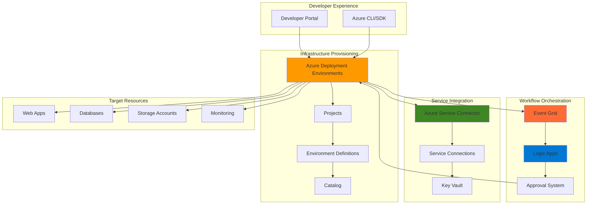

# Governed Infrastructure Provisioning with Azure Deployment Environments and Service Connector

## Problem

Development teams often face lengthy approval processes and manual infrastructure provisioning bottlenecks that delay application deployments and testing cycles. Organizations struggle to balance developer autonomy with governance requirements, leading to inconsistent environments, security vulnerabilities, and resource sprawl. Without automated self-service capabilities, platform teams become overwhelmed with provisioning requests while developers lose productivity waiting for infrastructure resources.

## Solution

Azure Deployment Environments combined with Azure Service Connector creates a comprehensive self-service infrastructure platform that enables developers to provision standardized environments with built-in governance and automatic service connectivity. This solution implements approval workflows through Azure Logic Apps, automated resource lifecycle management, and integrated service connections that ensure consistent, secure, and cost-effective infrastructure provisioning while maintaining organizational policies and compliance standards.

## Architecture Diagram



## Prerequisites

1. Azure subscription with appropriate permissions for creating Azure Deployment Environments, Logic Apps, and Event Grid resources
2. Azure CLI v2.61.0 or later installed and configured (or Azure CloudShell)
3. Understanding of Infrastructure as Code (IaC) concepts and Azure Resource Manager templates
4. Familiarity with Azure Logic Apps workflow design and JSON schema validation
5. Estimated cost: $50-100 per month for development environment (includes compute, storage, and service charges)

> **Note**: Azure Deployment Environments requires specific Azure AD roles including "DevCenter Admin" and "Project Admin" for proper configuration. Review the [Azure Deployment Environments documentation](https://learn.microsoft.com/en-us/azure/deployment-environments/overview-what-is-azure-deployment-environments) for detailed role requirements.

## Preparation

Azure Deployment Environments requires a structured approach to resource organization and template management. This preparation establishes the foundational components needed for self-service infrastructure provisioning while ensuring proper governance and security controls are in place from the beginning.

```bash
# Set environment variables for Azure resources
export LOCATION="eastus"
export RESOURCE_GROUP="rg-selfservice-infra-${RANDOM_SUFFIX}"
export SUBSCRIPTION_ID=$(az account show --query id --output tsv)

# Generate unique identifiers for resources
RANDOM_SUFFIX=$(openssl rand -hex 3)
export DEVCENTER_NAME="dc-selfservice-${RANDOM_SUFFIX}"
export PROJECT_NAME="proj-development-${RANDOM_SUFFIX}"
export CATALOG_NAME="catalog-templates-${RANDOM_SUFFIX}"
export LOGIC_APP_NAME="logic-approval-${RANDOM_SUFFIX}"
export EVENT_GRID_TOPIC="eg-deployment-events-${RANDOM_SUFFIX}"
export KEY_VAULT_NAME="kv-secrets-${RANDOM_SUFFIX}"

# Create resource group with proper tags
az group create \
    --name ${RESOURCE_GROUP} \
    --location ${LOCATION} \
    --tags purpose=selfservice-infrastructure environment=demo owner=platform-team

echo "✅ Resource group created: ${RESOURCE_GROUP}"

# Create Key Vault for secrets management
az keyvault create \
    --name ${KEY_VAULT_NAME} \
    --resource-group ${RESOURCE_GROUP} \
    --location ${LOCATION} \
    --sku standard \
    --enable-rbac-authorization true

echo "✅ Key Vault created: ${KEY_VAULT_NAME}"

# Create Event Grid topic for deployment events
az eventgrid topic create \
    --name ${EVENT_GRID_TOPIC} \
    --resource-group ${RESOURCE_GROUP} \
    --location ${LOCATION}

echo "✅ Event Grid topic created: ${EVENT_GRID_TOPIC}"
```

## Steps

1. **Create Azure Deployment Environments DevCenter**:

   Azure Deployment Environments uses a DevCenter as the central management hub that coordinates projects, catalogs, and environment definitions. The DevCenter serves as the governance layer that enforces organizational policies while enabling self-service capabilities. This foundational component establishes the security boundaries and administrative controls needed for enterprise-scale infrastructure provisioning.

   ```bash
   # Install the devcenter extension for Azure CLI
   az extension add --name devcenter --upgrade
   
   # Create the DevCenter for managing deployment environments
   az devcenter admin devcenter create \
       --name ${DEVCENTER_NAME} \
       --resource-group ${RESOURCE_GROUP} \
       --location ${LOCATION} \
       --identity-type SystemAssigned
   
   # Get the DevCenter principal ID for role assignments
   DEVCENTER_PRINCIPAL_ID=$(az devcenter admin devcenter show \
       --name ${DEVCENTER_NAME} \
       --resource-group ${RESOURCE_GROUP} \
       --query identity.principalId --output tsv)
   
   echo "✅ DevCenter created with managed identity: ${DEVCENTER_NAME}"
   ```

   The DevCenter now has a system-assigned managed identity that will be used for secure access to catalogs and target subscriptions. This identity-based approach eliminates the need for storing credentials while providing fine-grained access control for infrastructure provisioning operations.

2. **Configure Environment Catalog with Template Repository**:

   Environment catalogs contain the Infrastructure as Code templates that define what developers can provision. This step establishes a connection to a Git repository containing ARM templates, Bicep files, or Terraform configurations. The catalog serves as the source of truth for approved infrastructure patterns and ensures consistency across all provisioned environments.

   ```bash
   # Create a catalog pointing to a Git repository with environment templates
   az devcenter admin catalog create \
       --name ${CATALOG_NAME} \
       --devcenter-name ${DEVCENTER_NAME} \
       --resource-group ${RESOURCE_GROUP} \
       --git-hub-repo-url "https://github.com/Azure/deployment-environments" \
       --git-hub-branch "main" \
       --git-hub-path "/Environments"
   
   # Wait for catalog synchronization
   echo "Waiting for catalog synchronization..."
   sleep 30
   
   # Verify catalog sync status
   az devcenter admin catalog show \
       --name ${CATALOG_NAME} \
       --devcenter-name ${DEVCENTER_NAME} \
       --resource-group ${RESOURCE_GROUP} \
       --query "syncState" --output tsv
   
   echo "✅ Environment catalog configured and synchronized"
   ```

   The catalog is now connected to the Microsoft sample repository containing pre-built environment templates. This provides immediate access to common patterns like web applications with databases, while organizations can later point to their own repositories with custom templates that meet specific requirements.

3. **Create Project for Development Teams**:

   Projects in Azure Deployment Environments group related environments and define the permissions and policies that apply to them. This step creates a project that development teams will use to provision their environments, with appropriate access controls and resource allocation limits that balance developer autonomy with governance requirements.

   ```bash
   # Create a project for development teams
   az devcenter admin project create \
       --name ${PROJECT_NAME} \
       --resource-group ${RESOURCE_GROUP} \
       --devcenter-name ${DEVCENTER_NAME} \
       --location ${LOCATION}
   
   # Configure project environment type with proper role assignments
   az devcenter admin project-environment-type create \
       --environment-type-name "Development" \
       --project-name ${PROJECT_NAME} \
       --resource-group ${RESOURCE_GROUP} \
       --deployment-target-id "/subscriptions/${SUBSCRIPTION_ID}" \
       --identity-type SystemAssigned \
       --roles '{"b24988ac-6180-42a0-ab88-20f7382dd24c":{}}' \
       --status Enabled
   
   # Set up role assignments for developers
   az role assignment create \
       --assignee-object-id $(az ad signed-in-user show --query id --output tsv) \
       --role "DevCenter Project Admin" \
       --scope "/subscriptions/${SUBSCRIPTION_ID}/resourceGroups/${RESOURCE_GROUP}/providers/Microsoft.DevCenter/projects/${PROJECT_NAME}"
   
   echo "✅ Project created with development environment type"
   ```

   The project now provides a controlled space where developers can create environments using the approved templates. The role assignment ensures proper access control while the environment type configuration defines where resources will be deployed and what policies apply to them.

4. **Set up Azure Logic Apps for Approval Workflow**:

   Logic Apps provides the workflow orchestration needed to implement approval processes for environment provisioning. This step creates an automated approval workflow that integrates with Event Grid to receive deployment events and can route requests through appropriate approval chains based on environment type, cost, or other business criteria.

   ```bash
   # Create Logic App for approval workflow
   az logic workflow create \
       --name ${LOGIC_APP_NAME} \
       --resource-group ${RESOURCE_GROUP} \
       --location ${LOCATION} \
       --definition '{
         "$schema": "https://schema.management.azure.com/schemas/2016-06-01/Microsoft.Logic.json",
         "contentVersion": "1.0.0.0",
         "parameters": {},
         "triggers": {
           "manual": {
             "type": "Request",
             "kind": "Http"
           }
         },
         "actions": {
           "approve_environment": {
             "type": "Http",
             "inputs": {
               "method": "POST",
               "uri": "https://management.azure.com/subscriptions/'${SUBSCRIPTION_ID}'/resourceGroups/'${RESOURCE_GROUP}'/providers/Microsoft.DevCenter/projects/'${PROJECT_NAME}'/environments/approve"
             }
           }
         }
       }'
   
   # Get the Logic App trigger URL
   LOGIC_APP_URL=$(az logic workflow show \
       --name ${LOGIC_APP_NAME} \
       --resource-group ${RESOURCE_GROUP} \
       --query "accessEndpoint" --output tsv)
   
   echo "✅ Logic App created for approval workflow"
   ```

   The Logic App now provides a webhook endpoint that can process approval requests. This basic workflow can be extended with additional actions like sending notifications, integrating with approval systems, or implementing complex business rules based on the requesting user, environment type, or resource requirements.

5. **Configure Event Grid Integration**:

   Event Grid enables real-time event processing for deployment environment lifecycle events. This integration allows the system to automatically trigger workflows when environments are created, modified, or deleted, providing opportunities for automated governance, notifications, and lifecycle management actions.

   ```bash
   # Create Event Grid subscription for deployment events
   az eventgrid event-subscription create \
       --name "deployment-approval-subscription" \
       --source-resource-id "/subscriptions/${SUBSCRIPTION_ID}/resourceGroups/${RESOURCE_GROUP}/providers/Microsoft.DevCenter/projects/${PROJECT_NAME}" \
       --endpoint-type webhook \
       --endpoint "${LOGIC_APP_URL}/triggers/manual/invoke" \
       --included-event-types "Microsoft.DevCenter.EnvironmentCreated" \
                             "Microsoft.DevCenter.EnvironmentDeleted" \
                             "Microsoft.DevCenter.EnvironmentDeploymentCompleted"
   
   # Configure dead letter storage for failed events
   STORAGE_ACCOUNT="st$(echo $RANDOM_SUFFIX | tr -d '-')"
   az storage account create \
       --name ${STORAGE_ACCOUNT} \
       --resource-group ${RESOURCE_GROUP} \
       --location ${LOCATION} \
       --sku Standard_LRS
   
   echo "✅ Event Grid integration configured with Logic Apps"
   ```

   Event Grid is now configured to automatically trigger the approval workflow when deployment events occur. This creates a seamless integration between environment provisioning and business processes, enabling automated governance and ensuring that all infrastructure changes follow organizational policies and procedures.

6. **Deploy Sample Environment with Service Connector**:

   This step demonstrates the end-to-end provisioning process by creating a sample environment that includes automatic service connectivity. Azure Service Connector eliminates the manual effort of configuring connection strings, authentication, and network settings by automatically establishing secure connections between application services and their dependencies.

   ```bash
   # Create a sample environment using the deployment environments CLI
   az devcenter dev environment create \
       --project-name ${PROJECT_NAME} \
       --dev-center-name ${DEVCENTER_NAME} \
       --environment-name "sample-webapp-env" \
       --environment-type "Development" \
       --catalog-name ${CATALOG_NAME} \
       --environment-definition-name "WebApp" \
       --parameters '{"name": "sample-webapp-'${RANDOM_SUFFIX}'"}'
   
   # Wait for environment deployment
   echo "Waiting for environment deployment..."
   sleep 60
   
   # Get the deployed web app resource ID
   WEBAPP_NAME=$(az webapp list \
       --resource-group ${RESOURCE_GROUP} \
       --query "[?contains(name, 'sample-webapp')].name" \
       --output tsv | head -1)
   
   echo "✅ Sample environment deployed successfully with webapp: ${WEBAPP_NAME}"
   ```

   The sample environment demonstrates how developers can provision infrastructure using pre-approved templates. The deployment process automatically handles resource naming, networking, and basic configuration while ensuring compliance with organizational policies and security requirements.

7. **Configure Service Connector for Database Integration**:

   Service Connector simplifies the process of connecting applications to backing services by automatically managing authentication, connection strings, and network configuration. This step establishes a secure connection between the web application and a database, demonstrating how service connectivity is automated as part of the provisioning process.

   ```bash
   # Install the Service Connector passwordless extension
   az extension add --name serviceconnector-passwordless --upgrade
   
   # Create Azure SQL Database for the web application
   SQL_SERVER="sql-server-${RANDOM_SUFFIX}"
   SQL_DATABASE="webapp-db"
   
   az sql server create \
       --name ${SQL_SERVER} \
       --resource-group ${RESOURCE_GROUP} \
       --location ${LOCATION} \
       --admin-user "sqladmin" \
       --admin-password "P@ssw0rd123!" \
       --enable-ad-only-auth false
   
   az sql db create \
       --name ${SQL_DATABASE} \
       --server ${SQL_SERVER} \
       --resource-group ${RESOURCE_GROUP} \
       --service-objective S0
   
   # Create Service Connector between web app and database
   az webapp connection create sql \
       --resource-group ${RESOURCE_GROUP} \
       --name ${WEBAPP_NAME} \
       --target-resource-group ${RESOURCE_GROUP} \
       --server ${SQL_SERVER} \
       --database ${SQL_DATABASE} \
       --system-identity \
       --client-type dotnet
   
   echo "✅ Service Connector configured for database integration"
   ```

   The Service Connector has automatically configured the web application with the necessary connection strings and authentication settings to access the database. This eliminates manual configuration steps and ensures that connections follow security best practices, including the use of managed identities for authentication.

8. **Implement Environment Lifecycle Management**:

   Lifecycle management ensures that environments are automatically cleaned up and resources are properly managed throughout their lifecycle. This step configures automated policies for environment expiration, resource tagging, and cleanup procedures that help control costs and maintain organizational hygiene.

   ```bash
   # Create a Logic App for environment lifecycle management
   LIFECYCLE_LOGIC_APP="logic-lifecycle-${RANDOM_SUFFIX}"
   
   az logic workflow create \
       --name ${LIFECYCLE_LOGIC_APP} \
       --resource-group ${RESOURCE_GROUP} \
       --location ${LOCATION} \
       --definition '{
         "$schema": "https://schema.management.azure.com/schemas/2016-06-01/Microsoft.Logic.json",
         "contentVersion": "1.0.0.0",
         "parameters": {},
         "triggers": {
           "recurrence": {
             "type": "Recurrence",
             "recurrence": {
               "frequency": "Day",
               "interval": 1
             }
           }
         },
         "actions": {
           "check_environment_expiry": {
             "type": "Http",
             "inputs": {
               "method": "GET",
               "uri": "https://management.azure.com/subscriptions/'${SUBSCRIPTION_ID}'/resourceGroups/'${RESOURCE_GROUP}'/providers/Microsoft.DevCenter/projects/'${PROJECT_NAME}'/environments"
             }
           },
           "cleanup_expired_environments": {
             "type": "Http",
             "inputs": {
               "method": "DELETE",
               "uri": "https://management.azure.com/subscriptions/'${SUBSCRIPTION_ID}'/resourceGroups/'${RESOURCE_GROUP}'/providers/Microsoft.DevCenter/projects/'${PROJECT_NAME}'/environments/@{items(\"check_environment_expiry\")[\"environmentId\"]}"
             }
           }
         }
       }'
   
   # Configure environment tagging for lifecycle management
   az tag create \
       --resource-id "/subscriptions/${SUBSCRIPTION_ID}/resourceGroups/${RESOURCE_GROUP}" \
       --tags "environment-expiry=7days" "auto-cleanup=enabled" "cost-center=development"
   
   echo "✅ Environment lifecycle management configured"
   ```

   The lifecycle management system now automatically monitors environment usage and can enforce expiration policies, cost controls, and cleanup procedures. This ensures that resources are properly managed throughout their lifecycle and helps prevent resource sprawl and unexpected costs.

## Validation & Testing

1. **Verify DevCenter and Project Configuration**:

   ```bash
   # Check DevCenter status and configuration
   az devcenter admin devcenter show \
       --name ${DEVCENTER_NAME} \
       --resource-group ${RESOURCE_GROUP} \
       --query "{name:name, location:location, provisioningState:provisioningState}"
   
   # Verify project configuration
   az devcenter admin project show \
       --name ${PROJECT_NAME} \
       --resource-group ${RESOURCE_GROUP} \
       --query "{name:name, devCenterName:devCenterName}"
   ```

   Expected output: DevCenter and project should show "Succeeded" provisioning state with proper configuration values.

2. **Test Environment Provisioning**:

   ```bash
   # List available environment definitions
   az devcenter dev environment-definition list \
       --project-name ${PROJECT_NAME} \
       --dev-center-name ${DEVCENTER_NAME} \
       --query "[].{name:name, description:description}"
   
   # Check environment status
   az devcenter dev environment list \
       --project-name ${PROJECT_NAME} \
       --dev-center-name ${DEVCENTER_NAME} \
       --query "[].{name:name, environmentType:environmentType, provisioningState:provisioningState}"
   ```

   Expected output: Available environment definitions should be listed, and any created environments should show successful provisioning state.

3. **Validate Service Connector Integration**:

   ```bash
   # List service connections
   az webapp connection list \
       --resource-group ${RESOURCE_GROUP} \
       --name ${WEBAPP_NAME} \
       --query "[].{name:name, targetService:targetService, authType:authType}"
   
   # Test connection health
   az webapp connection validate \
       --resource-group ${RESOURCE_GROUP} \
       --name ${WEBAPP_NAME} \
       --connection $(az webapp connection list --resource-group ${RESOURCE_GROUP} --name ${WEBAPP_NAME} --query "[0].name" --output tsv)
   ```

   Expected output: Service connections should be listed with authentication type and show successful validation results.

4. **Test Workflow Integration**:

   ```bash
   # Check Event Grid subscription status
   az eventgrid event-subscription show \
       --name "deployment-approval-subscription" \
       --source-resource-id "/subscriptions/${SUBSCRIPTION_ID}/resourceGroups/${RESOURCE_GROUP}/providers/Microsoft.DevCenter/projects/${PROJECT_NAME}" \
       --query "{name:name, provisioningState:provisioningState, endpoint:destination.endpointUrl}"
   
   # Verify Logic App trigger history
   az logic workflow show \
       --name ${LOGIC_APP_NAME} \
       --resource-group ${RESOURCE_GROUP} \
       --query "{name:name, state:state, accessEndpoint:accessEndpoint}"
   ```

   Expected output: Event Grid subscription should show "Succeeded" state and Logic App should be enabled with accessible endpoint.

## Cleanup

1. **Remove Sample Environment**:

   ```bash
   # Delete the sample environment
   az devcenter dev environment delete \
       --project-name ${PROJECT_NAME} \
       --dev-center-name ${DEVCENTER_NAME} \
       --environment-name "sample-webapp-env" \
       --user-id "me" \
       --yes
   
   echo "✅ Sample environment deleted"
   ```

2. **Remove Logic Apps and Event Grid Resources**:

   ```bash
   # Delete Event Grid subscription
   az eventgrid event-subscription delete \
       --name "deployment-approval-subscription" \
       --source-resource-id "/subscriptions/${SUBSCRIPTION_ID}/resourceGroups/${RESOURCE_GROUP}/providers/Microsoft.DevCenter/projects/${PROJECT_NAME}"
   
   # Delete Logic Apps
   az logic workflow delete \
       --name ${LOGIC_APP_NAME} \
       --resource-group ${RESOURCE_GROUP} \
       --yes
   
   az logic workflow delete \
       --name ${LIFECYCLE_LOGIC_APP} \
       --resource-group ${RESOURCE_GROUP} \
       --yes
   
   # Delete Event Grid topic
   az eventgrid topic delete \
       --name ${EVENT_GRID_TOPIC} \
       --resource-group ${RESOURCE_GROUP} \
       --yes
   
   echo "✅ Logic Apps and Event Grid resources deleted"
   ```

3. **Remove Deployment Environments Resources**:

   ```bash
   # Delete project
   az devcenter admin project delete \
       --name ${PROJECT_NAME} \
       --resource-group ${RESOURCE_GROUP} \
       --yes
   
   # Delete catalog
   az devcenter admin catalog delete \
       --name ${CATALOG_NAME} \
       --devcenter-name ${DEVCENTER_NAME} \
       --resource-group ${RESOURCE_GROUP} \
       --yes
   
   # Delete DevCenter
   az devcenter admin devcenter delete \
       --name ${DEVCENTER_NAME} \
       --resource-group ${RESOURCE_GROUP} \
       --yes
   
   echo "✅ Azure Deployment Environments resources deleted"
   ```

4. **Remove Supporting Infrastructure**:

   ```bash
   # Delete SQL Database and Server
   az sql db delete \
       --name ${SQL_DATABASE} \
       --server ${SQL_SERVER} \
       --resource-group ${RESOURCE_GROUP} \
       --yes
   
   az sql server delete \
       --name ${SQL_SERVER} \
       --resource-group ${RESOURCE_GROUP} \
       --yes
   
   # Delete Key Vault
   az keyvault delete \
       --name ${KEY_VAULT_NAME} \
       --resource-group ${RESOURCE_GROUP}
   
   # Delete storage account
   az storage account delete \
       --name ${STORAGE_ACCOUNT} \
       --resource-group ${RESOURCE_GROUP} \
       --yes
   
   echo "✅ Supporting infrastructure deleted"
   ```

5. **Remove Resource Group**:

   ```bash
   # Delete resource group and all remaining resources
   az group delete \
       --name ${RESOURCE_GROUP} \
       --yes \
       --no-wait
   
   echo "✅ Resource group deletion initiated: ${RESOURCE_GROUP}"
   echo "Note: Complete deletion may take several minutes"
   ```

## Discussion

Azure Deployment Environments represents a significant advancement in platform engineering, enabling organizations to create self-service infrastructure platforms that balance developer productivity with operational governance. The service addresses the common challenge of providing developers with on-demand access to cloud resources while maintaining security, compliance, and cost control. By combining Infrastructure as Code templates with automated workflows, organizations can eliminate the traditional bottlenecks associated with manual infrastructure provisioning while ensuring consistency and compliance across all deployed environments.

The integration with Azure Service Connector further enhances this capability by automatically managing the complex task of connecting applications to their dependent services. This eliminates the manual configuration of connection strings, authentication credentials, and network settings that traditionally require specialized knowledge and can introduce security vulnerabilities. The combination creates a seamless experience where developers can focus on application development while the platform handles infrastructure provisioning and service connectivity automatically. For detailed implementation guidance, refer to the [Azure Deployment Environments documentation](https://learn.microsoft.com/en-us/azure/deployment-environments/overview-what-is-azure-deployment-environments) and [Service Connector overview](https://learn.microsoft.com/en-us/azure/service-connector/overview).

The workflow orchestration capabilities provided by Azure Logic Apps and Event Grid enable sophisticated automation scenarios that can adapt to various organizational requirements. From simple approval workflows to complex multi-stage deployment pipelines, these services provide the flexibility to implement business processes that align with organizational governance requirements. The event-driven architecture ensures that all infrastructure changes are properly tracked, audited, and can trigger appropriate business processes. This approach follows the principles outlined in the [Azure Well-Architected Framework](https://learn.microsoft.com/en-us/azure/architecture/framework/) for operational excellence and security.

From a cost management perspective, the automated lifecycle management capabilities help organizations maintain control over cloud spending by implementing policies for environment expiration, resource tagging, and automated cleanup. This is particularly important in development and testing scenarios where resources might otherwise be left running indefinitely. The integration with Azure Cost Management and billing APIs enables organizations to implement sophisticated cost allocation and chargeback mechanisms that provide visibility into infrastructure usage patterns and help optimize cloud spending.

> **Tip**: Implement gradual rollout strategies when deploying self-service infrastructure platforms. Start with a small group of developers and simple environment templates, then gradually expand the catalog and user base as the platform matures. Use the [Azure Deployment Environments best practices guide](https://learn.microsoft.com/en-us/azure/deployment-environments/concept-environments-key-concepts) to ensure successful platform adoption.

## Challenge

Extend this solution by implementing these enhancements:

1. **Advanced Approval Workflows**: Create multi-stage approval processes that route requests based on environment type, cost thresholds, or resource requirements. Integrate with Microsoft Teams or Slack for approval notifications and implement conditional approval logic based on user roles and request characteristics.

2. **Custom Environment Templates**: Develop organization-specific environment templates that include company standards for networking, security, monitoring, and compliance. Create templates for different application architectures like microservices, data analytics platforms, or AI/ML environments with pre-configured service connections.

3. **Cost Optimization Integration**: Implement automated cost monitoring and optimization that tracks environment usage, identifies idle resources, and provides recommendations for cost savings. Integrate with Azure Cost Management APIs to provide real-time cost visibility and implement automated budget alerts.

4. **Security and Compliance Automation**: Enhance the platform with automated security scanning, compliance validation, and policy enforcement. Integrate with Azure Security Center, Azure Policy, and third-party security tools to ensure all provisioned environments meet organizational security requirements.

5. **Multi-Cloud and Hybrid Support**: Extend the platform to support provisioning across multiple cloud providers and on-premises environments. Implement abstractions that allow developers to request resources without needing to understand underlying infrastructure differences while maintaining consistent governance across all environments.

## Infrastructure Code

### Available Infrastructure as Code:

- [Infrastructure Code Overview](code/README.md) - Detailed description of all infrastructure components
- [Bicep](code/bicep/) - Azure Bicep templates
- [Bash CLI Scripts](code/scripts/) - Example bash scripts using Azure CLI commands to deploy infrastructure
- [Terraform](code/terraform/) - Terraform configuration files