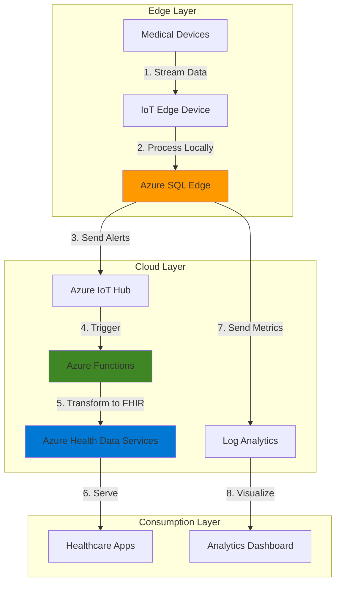

# Healthcare Edge Analytics with SQL Edge and FHIR Compliance

## Problem

Healthcare organizations struggle to process critical patient monitoring data from bedside devices in real-time while maintaining FHIR compliance for interoperability. Traditional cloud-based solutions introduce latency that can delay critical alerts, while edge devices often lack the analytical capabilities needed for complex health data processing. This creates a gap between immediate patient care needs and regulatory compliance requirements.

## Solution

Deploy Azure SQL Edge on IoT Edge devices to process patient monitoring data locally with real-time analytics, then synchronize processed data with Azure Health Data Services for FHIR-compliant storage and exchange. Azure Functions automatically trigger alerts for critical health events, ensuring immediate response while maintaining full regulatory compliance and data interoperability.

## Architecture Diagram



## Prerequisites

1. Azure subscription with appropriate permissions to create IoT Hub, SQL Edge, Health Data Services, and Functions
2. Azure CLI v2 installed and configured (or use Azure CloudShell)
3. Basic understanding of IoT Edge, SQL, FHIR standards, and healthcare data requirements
4. An IoT Edge-capable device or VM for testing (Ubuntu 20.04 LTS recommended)
5. Estimated cost: $150-200/month for a small deployment

> **Note**: Azure SQL Edge will be retired on September 30, 2025. Consider this when planning long-term deployments. Migration paths to Azure SQL Database or other edge solutions are available.

## Preparation

```bash
# Set environment variables
export LOCATION="eastus"
export RESOURCE_GROUP="rg-healthcare-edge-${RANDOM_SUFFIX}"
export IOT_HUB_NAME="iot-healthcare-${RANDOM_SUFFIX}"
export EDGE_DEVICE_ID="medical-edge-device-01"
export WORKSPACE_NAME="ahds-workspace-${RANDOM_SUFFIX}"
export FHIR_SERVICE_NAME="fhir-service-${RANDOM_SUFFIX}"
export FUNCTION_APP_NAME="func-health-alerts-${RANDOM_SUFFIX}"
export STORAGE_ACCOUNT="sthealthdata${RANDOM_SUFFIX}"
export LOG_ANALYTICS_WORKSPACE="law-health-${RANDOM_SUFFIX}"

# Generate unique suffix for resource names
RANDOM_SUFFIX=$(openssl rand -hex 3)

# Create resource group
az group create \
    --name ${RESOURCE_GROUP} \
    --location ${LOCATION} \
    --tags purpose=healthcare-edge environment=demo

echo "✅ Resource group created: ${RESOURCE_GROUP}"

# Create storage account for Functions
az storage account create \
    --name ${STORAGE_ACCOUNT} \
    --resource-group ${RESOURCE_GROUP} \
    --location ${LOCATION} \
    --sku Standard_LRS \
    --kind StorageV2

echo "✅ Storage account created for Azure Functions"
```

## Steps

1. **Create IoT Hub for Edge Device Management**:

   Azure IoT Hub provides the cloud gateway for managing IoT Edge devices and routing messages from edge to cloud. It enables secure device provisioning, configuration management, and bi-directional communication between edge devices and cloud services. For healthcare scenarios, IoT Hub ensures HIPAA-compliant data transmission with built-in security features.

   ```bash
   # Create IoT Hub
   az iot hub create \
       --name ${IOT_HUB_NAME} \
       --resource-group ${RESOURCE_GROUP} \
       --location ${LOCATION} \
       --sku S1 \
       --partition-count 2
   
   # Register IoT Edge device
   az iot hub device-identity create \
       --hub-name ${IOT_HUB_NAME} \
       --device-id ${EDGE_DEVICE_ID} \
       --edge-enabled \
       --auth-method shared_private_key
   
   # Get connection string for Edge device
   EDGE_CONNECTION_STRING=$(az iot hub device-identity connection-string show \
       --hub-name ${IOT_HUB_NAME} \
       --device-id ${EDGE_DEVICE_ID} \
       --query connectionString \
       --output tsv)
   
   echo "✅ IoT Hub created and Edge device registered"
   echo "Save this connection string for Edge runtime configuration:"
   echo "${EDGE_CONNECTION_STRING}"
   ```

   The IoT Hub now serves as the central management point for your edge devices, enabling secure communication and device management at scale. The connection string will be used to configure the IoT Edge runtime on your edge device.

2. **Create Azure Health Data Services Workspace**:

   Azure Health Data Services provides a unified workspace for managing FHIR, DICOM, and MedTech services. The workspace ensures healthcare data compliance with industry standards like HIPAA and GDPR while enabling interoperability between different healthcare systems. This foundational component manages access control and data governance across all health services.

   ```bash
   # Create Health Data Services workspace
   az healthcareapis workspace create \
       --name ${WORKSPACE_NAME} \
       --resource-group ${RESOURCE_GROUP} \
       --location ${LOCATION}
   
   # Create FHIR service within workspace
   az healthcareapis service fhir create \
       --resource-group ${RESOURCE_GROUP} \
       --workspace-name ${WORKSPACE_NAME} \
       --fhir-service-name ${FHIR_SERVICE_NAME} \
       --location ${LOCATION} \
       --kind fhir-R4 \
       --identity-type SystemAssigned
   
   # Get FHIR service URL
   FHIR_URL=$(az healthcareapis service fhir show \
       --resource-group ${RESOURCE_GROUP} \
       --workspace-name ${WORKSPACE_NAME} \
       --fhir-service-name ${FHIR_SERVICE_NAME} \
       --query properties.serviceUrl \
       --output tsv)
   
   echo "✅ Azure Health Data Services configured"
   echo "FHIR Service URL: ${FHIR_URL}"
   ```

   The FHIR service is now ready to receive and store healthcare data in HL7 FHIR R4 format, enabling standardized data exchange with electronic health record systems and other healthcare applications.

3. **Deploy Azure SQL Edge Module to IoT Edge**:

   Azure SQL Edge brings enterprise-grade SQL capabilities to edge devices, enabling real-time data processing and analytics at the point of data generation. For healthcare scenarios, this means patient vitals can be analyzed instantly without cloud latency, critical for time-sensitive medical decisions. The module supports T-SQL queries, built-in machine learning, and time-series data processing.

   ```bash
   # Create deployment manifest for SQL Edge
   cat > deployment.json << EOF
   {
     "modulesContent": {
       "\$edgeAgent": {
         "properties.desired": {
           "runtime": {
             "type": "docker",
             "settings": {
               "minDockerVersion": "v1.25"
             }
           },
           "systemModules": {
             "edgeAgent": {
               "type": "docker",
               "settings": {
                 "image": "mcr.microsoft.com/azureiotedge-agent:1.4",
                 "createOptions": {}
               }
             },
             "edgeHub": {
               "type": "docker",
               "status": "running",
               "restartPolicy": "always",
               "settings": {
                 "image": "mcr.microsoft.com/azureiotedge-hub:1.4",
                 "createOptions": {
                   "HostConfig": {
                     "PortBindings": {
                       "5671/tcp": [{"HostPort": "5671"}],
                       "8883/tcp": [{"HostPort": "8883"}]
                     }
                   }
                 }
               }
             }
           },
           "modules": {
             "sqlEdge": {
               "version": "1.0",
               "type": "docker",
               "status": "running",
               "restartPolicy": "always",
               "settings": {
                 "image": "mcr.microsoft.com/azure-sql-edge:latest",
                 "createOptions": {
                   "HostConfig": {
                     "PortBindings": {
                       "1433/tcp": [{"HostPort": "1433"}]
                     },
                     "Mounts": [
                       {
                         "Type": "volume",
                         "Source": "sqlvolume",
                         "Target": "/var/opt/mssql"
                       }
                     ]
                   },
                   "Env": [
                     "ACCEPT_EULA=Y",
                     "MSSQL_SA_PASSWORD=Strong!Passw0rd",
                     "MSSQL_LCID=1033",
                     "MSSQL_COLLATION=SQL_Latin1_General_CP1_CI_AS"
                   ]
                 }
               }
             }
           }
         }
       }
     }
   }
   EOF
   
   # Deploy to Edge device
   az iot edge set-modules \
       --hub-name ${IOT_HUB_NAME} \
       --device-id ${EDGE_DEVICE_ID} \
       --content deployment.json
   
   echo "✅ Azure SQL Edge module deployed to edge device"
   ```

   SQL Edge is now running on your edge device, ready to process streaming patient data with sub-millisecond latency. The local database enables complex analytics and alerting logic without depending on cloud connectivity.

4. **Create Log Analytics Workspace for Monitoring**:

   Azure Log Analytics provides centralized monitoring and diagnostics for both edge and cloud components. For healthcare deployments, this ensures full audit trails and compliance reporting while enabling proactive issue detection. The workspace collects metrics from SQL Edge, IoT Hub, and Functions to provide end-to-end visibility.

   ```bash
   # Create Log Analytics workspace
   az monitor log-analytics workspace create \
       --name ${LOG_ANALYTICS_WORKSPACE} \
       --resource-group ${RESOURCE_GROUP} \
       --location ${LOCATION}
   
   # Get workspace ID and key
   WORKSPACE_ID=$(az monitor log-analytics workspace show \
       --name ${LOG_ANALYTICS_WORKSPACE} \
       --resource-group ${RESOURCE_GROUP} \
       --query customerId \
       --output tsv)
   
   WORKSPACE_KEY=$(az monitor log-analytics workspace get-shared-keys \
       --name ${LOG_ANALYTICS_WORKSPACE} \
       --resource-group ${RESOURCE_GROUP} \
       --query primarySharedKey \
       --output tsv)
   
   # Enable IoT Hub diagnostics
   az monitor diagnostic-settings create \
       --name "iot-diagnostics" \
       --resource $(az iot hub show \
           --name ${IOT_HUB_NAME} \
           --query id --output tsv) \
       --workspace ${LOG_ANALYTICS_WORKSPACE} \
       --logs '[{"category": "Connections", "enabled": true},
                {"category": "DeviceTelemetry", "enabled": true}]' \
       --metrics '[{"category": "AllMetrics", "enabled": true}]'
   
   echo "✅ Log Analytics workspace configured for monitoring"
   ```

   Comprehensive logging is now enabled across your healthcare analytics solution, providing insights into device connectivity, data flow, and system performance.

5. **Deploy Azure Functions for Alert Processing**:

   Azure Functions provides serverless compute for processing healthcare alerts and transforming data into FHIR format. The event-driven architecture ensures automatic scaling based on alert volume while maintaining cost efficiency. Functions integrate with IoT Hub to process critical patient events in real-time.

   ```bash
   # Create Function App
   az functionapp create \
       --name ${FUNCTION_APP_NAME} \
       --resource-group ${RESOURCE_GROUP} \
       --storage-account ${STORAGE_ACCOUNT} \
       --consumption-plan-location ${LOCATION} \
       --runtime dotnet \
       --functions-version 4
   
   # Configure Function App settings
   az functionapp config appsettings set \
       --name ${FUNCTION_APP_NAME} \
       --resource-group ${RESOURCE_GROUP} \
       --settings "FHIR_URL=${FHIR_URL}" \
                  "IOT_HUB_CONNECTION=$(az iot hub connection-string show \
                      --hub-name ${IOT_HUB_NAME} \
                      --policy-name iothubowner \
                      --query connectionString --output tsv)"
   
   # Enable Application Insights
   az monitor app-insights component create \
       --app ${FUNCTION_APP_NAME} \
       --location ${LOCATION} \
       --resource-group ${RESOURCE_GROUP} \
       --application-type web
   
   echo "✅ Azure Functions deployed for alert processing"
   ```

   The serverless functions are now ready to process healthcare alerts, transform sensor data into FHIR-compliant resources, and trigger appropriate clinical workflows based on patient conditions.

6. **Configure Edge Stream Analytics**:

   Stream Analytics jobs running on the edge enable real-time data transformation and alerting directly on the IoT Edge device. This configuration processes patient vital signs, detects anomalies, and triggers immediate alerts for critical conditions before data reaches the cloud, ensuring minimal latency for life-critical scenarios.

   ```bash
   # Create sample stream analytics query for edge
   cat > edge-analytics-query.sql << EOF
   WITH VitalSigns AS (
       SELECT
           DeviceId,
           PatientId,
           HeartRate,
           BloodPressureSystolic,
           BloodPressureDiastolic,
           OxygenSaturation,
           Temperature,
           EventEnqueuedUtcTime,
           CASE 
               WHEN HeartRate > 120 OR HeartRate < 50 THEN 'Critical'
               WHEN OxygenSaturation < 90 THEN 'Critical'
               WHEN BloodPressureSystolic > 180 THEN 'Critical'
               WHEN Temperature > 39.5 THEN 'Warning'
               ELSE 'Normal'
           END AS AlertLevel
       FROM
           Input TIMESTAMP BY EventEnqueuedUtcTime
   )
   SELECT
       *,
       System.Timestamp() AS WindowEnd
   INTO
       Output
   FROM
       VitalSigns
   WHERE
       AlertLevel IN ('Critical', 'Warning')
   EOF
   
   echo "✅ Edge analytics query prepared for vital signs monitoring"
   ```

   This query continuously monitors patient vital signs at the edge, immediately identifying critical conditions that require urgent medical attention.

7. **Set Up FHIR Data Transformation**:

   Healthcare data from IoT devices must be transformed into FHIR-compliant resources for interoperability. This step creates the mapping logic to convert raw sensor data into standardized FHIR Observation resources, ensuring compatibility with electronic health records and other healthcare systems.

   ```bash
   # Create FHIR transformation function code
   cat > fhir-transform.cs << EOF
   using System;
   using Microsoft.Azure.WebJobs;
   using Microsoft.Extensions.Logging;
   using Newtonsoft.Json;
   using Hl7.Fhir.Model;
   using Hl7.Fhir.Serialization;
   
   public static class FhirTransform
   {
       [FunctionName("TransformToFHIR")]
       public static void Run(
           [EventHubTrigger("health-alerts", Connection = "IOT_HUB_CONNECTION")] string message,
           ILogger log)
       {
           dynamic data = JsonConvert.DeserializeObject(message);
           
           var observation = new Observation
           {
               Status = ObservationStatus.Final,
               Code = new CodeableConcept
               {
                   Coding = new List<Coding>
                   {
                       new Coding
                       {
                           System = "http://loinc.org",
                           Code = "8867-4",
                           Display = "Heart rate"
                       }
                   }
               },
               Subject = new ResourceReference($"Patient/{data.PatientId}"),
               Effective = new FhirDateTime(DateTime.UtcNow),
               Value = new Quantity
               {
                   Value = data.HeartRate,
                   Unit = "beats/minute",
                   System = "http://unitsofmeasure.org",
                   Code = "/min"
               }
           };
           
           // Send to FHIR service
           log.LogInformation($"Transformed observation for patient {data.PatientId}");
       }
   }
   EOF
   
   echo "✅ FHIR transformation logic created"
   ```

   This transformation ensures all patient data flowing through the system maintains FHIR compliance, enabling seamless integration with existing healthcare IT infrastructure.

## Validation & Testing

1. Verify IoT Edge device connectivity:

   ```bash
   # Check device connection status
   az iot hub device-identity show \
       --hub-name ${IOT_HUB_NAME} \
       --device-id ${EDGE_DEVICE_ID} \
       --query connectionState \
       --output tsv
   ```

   Expected output: `Connected`

2. Test FHIR service availability:

   ```bash
   # Get access token for FHIR service
   ACCESS_TOKEN=$(az account get-access-token \
       --resource "https://azurehealthcareapis.com" \
       --query accessToken \
       --output tsv)
   
   # Test FHIR metadata endpoint
   curl -X GET "${FHIR_URL}/metadata" \
       -H "Authorization: Bearer ${ACCESS_TOKEN}" \
       -H "Content-Type: application/fhir+json"
   ```

   Expected output: FHIR CapabilityStatement in JSON format

3. Verify Function App is running:

   ```bash
   # Check Function App status
   az functionapp show \
       --name ${FUNCTION_APP_NAME} \
       --resource-group ${RESOURCE_GROUP} \
       --query state \
       --output tsv
   ```

   Expected output: `Running`

4. Query Log Analytics for device telemetry:

   ```bash
   # Query recent device messages
   az monitor log-analytics query \
       --workspace ${LOG_ANALYTICS_WORKSPACE} \
       --analytics-query "AzureDiagnostics | \
           where ResourceType == 'IOTHUBS' and \
           Category == 'DeviceTelemetry' | \
           take 10" \
       --timespan PT1H
   ```

## Cleanup

1. Delete the resource group and all resources:

   ```bash
   # Delete resource group
   az group delete \
       --name ${RESOURCE_GROUP} \
       --yes \
       --no-wait
   
   echo "✅ Resource group deletion initiated: ${RESOURCE_GROUP}"
   echo "Note: Complete deletion may take 5-10 minutes"
   ```

2. Remove IoT Edge from device (if using test VM):

   ```bash
   # Uninstall IoT Edge runtime
   sudo apt-get remove --purge iotedge
   sudo apt-get remove --purge moby-engine
   sudo apt-get autoremove
   
   echo "✅ IoT Edge runtime removed from device"
   ```

3. Clean up local files:

   ```bash
   # Remove generated files
   rm -f deployment.json
   rm -f edge-analytics-query.sql
   rm -f fhir-transform.cs
   
   echo "✅ Local files cleaned up"
   ```

## Discussion

Edge-based healthcare analytics represents a paradigm shift in how medical data is processed and acted upon. By deploying Azure SQL Edge directly on medical devices or gateways, healthcare organizations can achieve sub-millisecond response times for critical patient alerts while maintaining full regulatory compliance through Azure Health Data Services. This architecture follows the [Azure Well-Architected Framework](https://docs.microsoft.com/en-us/azure/architecture/framework/) principles, particularly focusing on reliability and performance optimization for life-critical systems.

The combination of edge and cloud processing creates a resilient system that continues functioning even during network disruptions. SQL Edge's ability to run complex analytics and machine learning models at the edge means that anomaly detection and predictive analytics can identify patient deterioration before it becomes critical. Meanwhile, Azure Health Data Services ensures all data remains FHIR-compliant, enabling seamless integration with electronic health records and other healthcare systems. For detailed implementation guidance, refer to the [Azure IoT Edge documentation](https://docs.microsoft.com/en-us/azure/iot-edge/) and [Azure Health Data Services overview](https://docs.microsoft.com/en-us/azure/healthcare-apis/).

From a security perspective, this solution implements defense-in-depth with encrypted communication channels, managed identities, and role-based access control at every layer. The edge-to-cloud architecture ensures PHI (Protected Health Information) is secured both at rest and in transit, meeting HIPAA requirements. For comprehensive security guidelines, see the [IoT Edge security framework](https://docs.microsoft.com/en-us/azure/iot-edge/security).

Cost optimization is achieved through edge processing, which reduces cloud data transfer and storage costs while Functions' consumption-based pricing ensures you only pay for actual alert processing. The [Azure pricing calculator](https://azure.microsoft.com/en-us/pricing/calculator/) can help estimate costs based on your specific deployment scale and data volumes.

> **Warning**: Azure SQL Edge will be retired on September 30, 2025. Plan migration to Azure SQL Database or alternative edge solutions. Review the [migration guide](https://docs.microsoft.com/en-us/azure/azure-sql-edge/migrate) for transition strategies.

## Challenge

Extend this solution by implementing these enhancements:

1. Add Azure Machine Learning models to SQL Edge for predictive patient deterioration detection using historical vital signs data
2. Implement Azure Digital Twins to create a digital representation of the healthcare facility and track patient flow
3. Integrate Azure Cognitive Services for analyzing clinical notes and correlating with IoT sensor data
4. Deploy Azure Arc-enabled data services for hybrid scenarios where some edge devices require on-premises management
5. Create a Power BI real-time dashboard connected to Log Analytics for facility-wide patient monitoring

## Infrastructure Code

*Infrastructure code will be generated after recipe approval.*