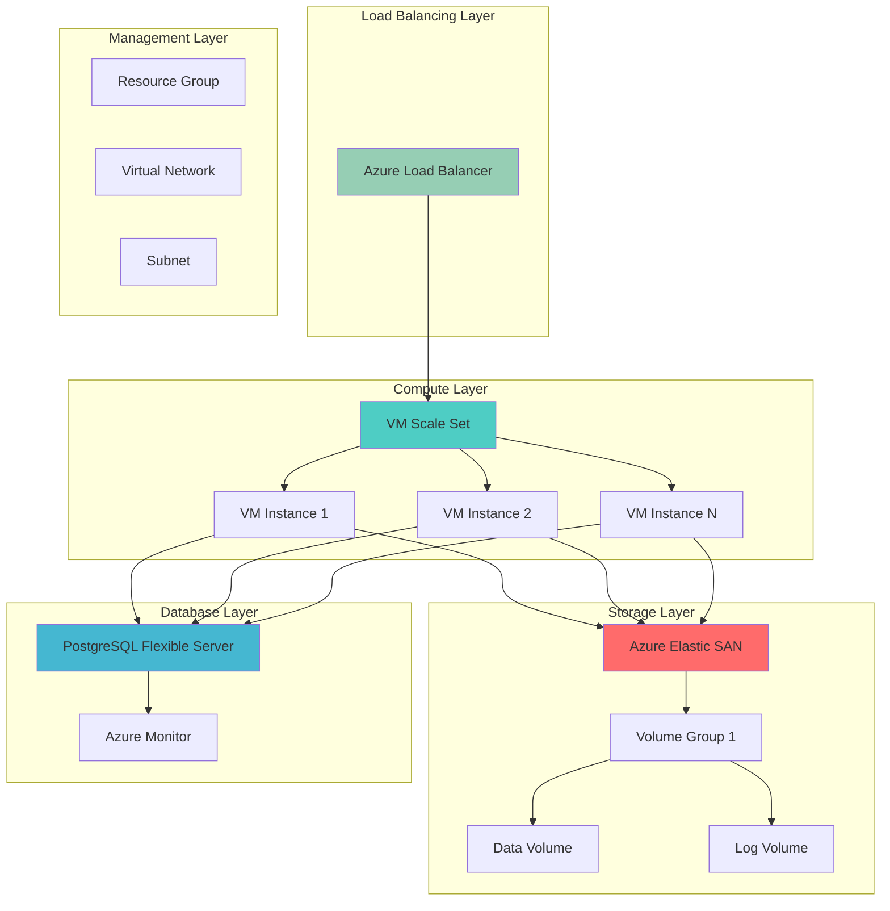

# High-Performance Database Workloads with Elastic SAN and VMSS

## Problem

Enterprise organizations running mission-critical database workloads face significant challenges in delivering consistent high-performance storage while managing costs and operational complexity. Traditional storage solutions often struggle with elastic scaling, unpredictable IOPS requirements, and the overhead of managing separate storage infrastructure across multiple database instances, leading to performance bottlenecks and increased operational burden.

## Solution

This solution combines Azure Elastic SAN's cloud-native storage area network capabilities with Azure Virtual Machine Scale Sets for automated compute scaling, creating a high-performance, cost-effective database infrastructure. Azure Elastic SAN provides centralized, scalable block storage with enterprise-grade performance, while VMSS enables automatic scaling of database compute resources based on demand, ensuring optimal resource utilization and cost efficiency.

## Architecture Diagram



## Prerequisites

1. Azure subscription with appropriate permissions for creating Elastic SAN, VMSS, and PostgreSQL resources
2. Azure CLI v2.61.0 or later installed and configured (or Azure Cloud Shell)
3. Basic understanding of Azure networking, storage concepts, and database administration
4. Familiarity with PostgreSQL database management and performance tuning
5. Estimated cost: $200-400 per month for moderate workloads (varies based on storage size, compute instances, and data transfer)

> **Note**: Azure Elastic SAN is available in select Azure regions. Verify availability in your target region before proceeding. Check the [Azure Elastic SAN documentation](https://learn.microsoft.com/en-us/azure/storage/elastic-san/) for current regional availability.

## Preparation

```bash
# Set environment variables for Azure resources
export RESOURCE_GROUP="rg-elastic-san-demo-${RANDOM_SUFFIX}"
export LOCATION="eastus"
export SUBSCRIPTION_ID=$(az account show --query id --output tsv)

# Generate unique suffix for resource names
RANDOM_SUFFIX=$(openssl rand -hex 3)
export ELASTIC_SAN_NAME="esan-db-${RANDOM_SUFFIX}"
export VMSS_NAME="vmss-db-${RANDOM_SUFFIX}"
export VNET_NAME="vnet-db-${RANDOM_SUFFIX}"
export SUBNET_NAME="subnet-db-${RANDOM_SUFFIX}"
export LB_NAME="lb-db-${RANDOM_SUFFIX}"
export PG_SERVER_NAME="pg-db-${RANDOM_SUFFIX}"

# Create resource group
az group create \
    --name ${RESOURCE_GROUP} \
    --location ${LOCATION} \
    --tags purpose=recipe environment=elastic-san-demo

echo "✅ Resource group created: ${RESOURCE_GROUP}"

# Create virtual network and subnet
az network vnet create \
    --name ${VNET_NAME} \
    --resource-group ${RESOURCE_GROUP} \
    --location ${LOCATION} \
    --address-prefixes 10.0.0.0/16 \
    --subnet-name ${SUBNET_NAME} \
    --subnet-prefixes 10.0.1.0/24

echo "✅ Virtual network and subnet created"
```

## Steps

1. **Create Azure Elastic SAN for High-Performance Storage**:

   Azure Elastic SAN provides enterprise-grade storage area network capabilities with automatic scaling and high IOPS performance. This cloud-native solution eliminates the complexity of traditional SAN management while delivering consistent, low-latency storage performance crucial for database workloads. The service supports up to 400,000 IOPS per Elastic SAN instance and can scale storage capacity dynamically based on demand.

   ```bash
   # Create Elastic SAN instance
   az elastic-san create \
       --name ${ELASTIC_SAN_NAME} \
       --resource-group ${RESOURCE_GROUP} \
       --location ${LOCATION} \
       --base-size-tib 1 \
       --extended-capacity-size-tib 2 \
       --sku '{name:Premium_LRS,tier:Premium}' \
       --tags workload=database performance=high

   echo "✅ Elastic SAN created: ${ELASTIC_SAN_NAME}"
   ```

   The Elastic SAN instance is now provisioned with 3 TiB of total capacity and premium SSD performance. This configuration provides the foundation for high-performance database storage with built-in redundancy and automatic scaling capabilities, ensuring consistent performance under varying workload demands.

2. **Configure Volume Groups for Database Storage**:

   Volume Groups in Azure Elastic SAN provide logical organization and management of storage volumes, enabling fine-grained access control and performance optimization. Each volume group can contain multiple volumes with different performance characteristics, allowing you to optimize storage allocation based on specific database workload requirements such as transaction logs, data files, and backup storage.

   ```bash
   # Create volume group for database storage
   az elastic-san volume-group create \
       --name "vg-database-storage" \
       --elastic-san-name ${ELASTIC_SAN_NAME} \
       --resource-group ${RESOURCE_GROUP} \
       --protocol-type iSCSI \
       --network-acls '{virtualNetworkRules:[{id:"/subscriptions/'${SUBSCRIPTION_ID}'/resourceGroups/'${RESOURCE_GROUP}'/providers/Microsoft.Network/virtualNetworks/'${VNET_NAME}'/subnets/'${SUBNET_NAME}'",action:"Allow"}]}'

   echo "✅ Volume group created with network access controls"
   ```

   The volume group is configured with iSCSI protocol and network access controls, ensuring secure connectivity from your Virtual Machine Scale Set instances. This setup provides the necessary isolation and security for production database workloads while maintaining high-performance access patterns.

3. **Create High-Performance Storage Volumes**:

   Individual volumes within the volume group provide dedicated storage spaces with specific performance characteristics. Creating separate volumes for different database components (data, logs, temp) enables optimal I/O distribution and performance tuning. Each volume can be configured with specific size and performance requirements to match your database workload patterns.

   ```bash
   # Create data volume for PostgreSQL data files
   az elastic-san volume create \
       --name "vol-pg-data" \
       --volume-group-name "vg-database-storage" \
       --elastic-san-name ${ELASTIC_SAN_NAME} \
       --resource-group ${RESOURCE_GROUP} \
       --size-gib 500 \
       --creation-data '{createSource:None}'

   # Create log volume for PostgreSQL transaction logs
   az elastic-san volume create \
       --name "vol-pg-logs" \
       --volume-group-name "vg-database-storage" \
       --elastic-san-name ${ELASTIC_SAN_NAME} \
       --resource-group ${RESOURCE_GROUP} \
       --size-gib 200 \
       --creation-data '{createSource:None}'

   echo "✅ Storage volumes created for data and logs"
   ```

   The dedicated volumes are now ready for database use with optimized sizing for typical PostgreSQL workloads. This separation enables independent scaling and performance tuning of different database components, following storage best practices for enterprise database deployments.

4. **Deploy Virtual Machine Scale Set with Database Configuration**:

   Azure Virtual Machine Scale Sets provide automated scaling capabilities for compute resources, enabling your database infrastructure to respond dynamically to workload changes. The scale set configuration includes custom script extensions for PostgreSQL installation and Elastic SAN volume mounting, ensuring consistent database environment across all instances.

   ```bash
   # Create custom script for PostgreSQL setup
   cat << 'EOF' > setup-postgres.sh
   #!/bin/bash
   
   # Update system packages
   sudo apt-get update
   
   # Install PostgreSQL and utilities
   sudo apt-get install -y postgresql postgresql-contrib
   
   # Install iSCSI utilities for Elastic SAN
   sudo apt-get install -y open-iscsi
   
   # Configure PostgreSQL for high performance
   sudo systemctl enable postgresql
   sudo systemctl start postgresql
   
   # Create database user and database
   sudo -u postgres psql -c "CREATE USER dbadmin WITH PASSWORD 'SecurePass123!';"
   sudo -u postgres psql -c "CREATE DATABASE appdb OWNER dbadmin;"
   
   echo "PostgreSQL setup completed"
   EOF

   # Create Virtual Machine Scale Set
   az vmss create \
       --name ${VMSS_NAME} \
       --resource-group ${RESOURCE_GROUP} \
       --location ${LOCATION} \
       --image Ubuntu2204 \
       --admin-username azureuser \
       --generate-ssh-keys \
       --instance-count 2 \
       --vm-sku Standard_D4s_v3 \
       --vnet-name ${VNET_NAME} \
       --subnet ${SUBNET_NAME} \
       --lb ${LB_NAME} \
       --upgrade-policy-mode Manual \
       --custom-data setup-postgres.sh \
       --orchestration-mode Flexible

   echo "✅ Virtual Machine Scale Set created with PostgreSQL configuration"
   ```

   The VMSS is now deployed with PostgreSQL pre-configured on each instance. This setup enables horizontal scaling of database compute resources while maintaining consistent configuration across all instances, supporting high-availability database architectures.

5. **Configure Load Balancer for Database Access**:

   Azure Load Balancer provides high availability and distributes incoming database connections across multiple VMSS instances. The load balancer configuration includes health probes to ensure traffic is only directed to healthy database instances, maintaining service availability during scaling operations or instance failures.

   ```bash
   # Get load balancer resource ID
   LB_ID=$(az network lb show \
       --name ${LB_NAME} \
       --resource-group ${RESOURCE_GROUP} \
       --query id --output tsv)

   # Create backend pool for database instances
   az network lb address-pool create \
       --lb-name ${LB_NAME} \
       --resource-group ${RESOURCE_GROUP} \
       --name "db-backend-pool"

   # Create health probe for PostgreSQL
   az network lb probe create \
       --lb-name ${LB_NAME} \
       --resource-group ${RESOURCE_GROUP} \
       --name "postgresql-health-probe" \
       --protocol tcp \
       --port 5432 \
       --interval 15 \
       --threshold 2

   # Create load balancer rule for PostgreSQL
   az network lb rule create \
       --lb-name ${LB_NAME} \
       --resource-group ${RESOURCE_GROUP} \
       --name "postgresql-rule" \
       --protocol tcp \
       --frontend-port 5432 \
       --backend-port 5432 \
       --frontend-ip-name "LoadBalancerFrontEnd" \
       --backend-pool-name "db-backend-pool" \
       --probe-name "postgresql-health-probe"

   echo "✅ Load balancer configured for PostgreSQL access"
   ```

   The load balancer is now configured with proper health monitoring and traffic distribution for PostgreSQL connections. This setup ensures high availability and enables seamless scaling of database instances without impacting client connections.

6. **Create Azure Database for PostgreSQL Flexible Server**:

   Azure Database for PostgreSQL Flexible Server provides a fully managed PostgreSQL service with enterprise-grade features including automated backups, high availability, and built-in security. This managed service complements the VMSS-based approach by providing additional database instances for read replicas or specialized workloads while integrating with the same network infrastructure.

   ```bash
   # Create PostgreSQL Flexible Server
   az postgres flexible-server create \
       --name ${PG_SERVER_NAME} \
       --resource-group ${RESOURCE_GROUP} \
       --location ${LOCATION} \
       --admin-user pgadmin \
       --admin-password "SecurePassword123!" \
       --sku-name Standard_D2s_v3 \
       --tier GeneralPurpose \
       --storage-size 128 \
       --storage-type Premium_LRS \
       --version 16 \
       --vnet ${VNET_NAME} \
       --subnet ${SUBNET_NAME} \
       --high-availability ZoneRedundant \
       --zone 1 \
       --standby-zone 2

   echo "✅ PostgreSQL Flexible Server created with high availability"
   ```

   The managed PostgreSQL instance is now available with high availability configuration and premium storage. This provides a robust foundation for production database workloads with automatic failover capabilities and integrated monitoring.

7. **Configure Auto-Scaling Policies**:

   Auto-scaling policies enable the VMSS to automatically adjust the number of instances based on performance metrics such as CPU utilization, memory usage, or custom database metrics. This ensures optimal resource utilization while maintaining performance during peak loads, following cloud-native cost optimization principles.

   ```bash
   # Create autoscale profile for VMSS
   az monitor autoscale create \
       --resource-group ${RESOURCE_GROUP} \
       --name "vmss-autoscale-profile" \
       --resource "/subscriptions/${SUBSCRIPTION_ID}/resourceGroups/${RESOURCE_GROUP}/providers/Microsoft.Compute/virtualMachineScaleSets/${VMSS_NAME}" \
       --min-count 2 \
       --max-count 10 \
       --count 2

   # Create scale-out rule based on CPU usage
   az monitor autoscale rule create \
       --resource-group ${RESOURCE_GROUP} \
       --autoscale-name "vmss-autoscale-profile" \
       --scale-out 1 \
       --condition "Percentage CPU > 70 avg 5m" \
       --cooldown 5

   # Create scale-in rule based on CPU usage
   az monitor autoscale rule create \
       --resource-group ${RESOURCE_GROUP} \
       --autoscale-name "vmss-autoscale-profile" \
       --scale-in 1 \
       --condition "Percentage CPU < 30 avg 5m" \
       --cooldown 5

   echo "✅ Auto-scaling policies configured for VMSS"
   ```

   The auto-scaling configuration is now active and will automatically adjust the number of database instances based on CPU utilization. This ensures your database infrastructure can handle varying workloads while optimizing costs during low-demand periods.

8. **Configure Monitoring and Alerting**:

   Azure Monitor provides comprehensive observability for your database infrastructure, including performance metrics, health status, and custom alerts. This monitoring setup enables proactive identification of performance issues and automated responses to maintain optimal database performance across your scaled infrastructure.

   ```bash
   # Create Log Analytics workspace
   az monitor log-analytics workspace create \
       --resource-group ${RESOURCE_GROUP} \
       --workspace-name "law-db-monitoring-${RANDOM_SUFFIX}" \
       --location ${LOCATION} \
       --sku PerGB2018

   # Get workspace ID
   WORKSPACE_ID=$(az monitor log-analytics workspace show \
       --resource-group ${RESOURCE_GROUP} \
       --workspace-name "law-db-monitoring-${RANDOM_SUFFIX}" \
       --query id --output tsv)

   # Create action group for alerts
   az monitor action-group create \
       --resource-group ${RESOURCE_GROUP} \
       --name "db-alert-actions" \
       --short-name "DBAlerts"

   # Create alert rule for high CPU usage
   az monitor metrics alert create \
       --name "high-cpu-usage" \
       --resource-group ${RESOURCE_GROUP} \
       --scopes "/subscriptions/${SUBSCRIPTION_ID}/resourceGroups/${RESOURCE_GROUP}/providers/Microsoft.Compute/virtualMachineScaleSets/${VMSS_NAME}" \
       --condition "avg Percentage CPU > 80" \
       --window-size 5m \
       --evaluation-frequency 1m \
       --action "db-alert-actions" \
       --description "Alert when CPU usage exceeds 80%"

   echo "✅ Monitoring and alerting configured"
   ```

   The monitoring infrastructure is now in place with automated alerting for performance issues. This setup provides visibility into your database infrastructure performance and enables proactive management of resource utilization and potential issues.

## Validation & Testing

1. **Verify Elastic SAN deployment and volume accessibility**:

   ```bash
   # Check Elastic SAN status
   az elastic-san show \
       --name ${ELASTIC_SAN_NAME} \
       --resource-group ${RESOURCE_GROUP} \
       --query "{name:name,provisioningState:provisioningState,totalSizeTiB:totalSizeTiB}"

   # List volume groups
   az elastic-san volume-group list \
       --elastic-san-name ${ELASTIC_SAN_NAME} \
       --resource-group ${RESOURCE_GROUP} \
       --query "[].{name:name,protocolType:protocolType}"
   ```

   Expected output: Elastic SAN shows "Succeeded" provisioning state and volume groups are listed with iSCSI protocol.

2. **Test VMSS scaling and PostgreSQL connectivity**:

   ```bash
   # Check VMSS instance status
   az vmss list-instances \
       --name ${VMSS_NAME} \
       --resource-group ${RESOURCE_GROUP} \
       --query "[].{name:name,provisioningState:provisioningState,powerState:instanceView.statuses[1].displayStatus}"

   # Test PostgreSQL connectivity through load balancer
   LB_IP=$(az network public-ip show \
       --resource-group ${RESOURCE_GROUP} \
       --name "${LB_NAME}PublicIP" \
       --query ipAddress --output tsv)

   echo "Load balancer IP: ${LB_IP}"
   echo "Test PostgreSQL connectivity: psql -h ${LB_IP} -U pgadmin -d postgres"
   ```

3. **Verify auto-scaling configuration**:

   ```bash
   # Check autoscale profile status
   az monitor autoscale show \
       --resource-group ${RESOURCE_GROUP} \
       --name "vmss-autoscale-profile" \
       --query "{enabled:enabled,minCount:profiles[0].capacity.minimum,maxCount:profiles[0].capacity.maximum}"
   ```

4. **Test storage performance**:

   ```bash
   # Connect to a VMSS instance to test storage performance
   VMSS_INSTANCE_IP=$(az vmss list-instance-public-ips \
       --resource-group ${RESOURCE_GROUP} \
       --name ${VMSS_NAME} \
       --query "[0].ipAddress" --output tsv)

   echo "Connect to VMSS instance: ssh azureuser@${VMSS_INSTANCE_IP}"
   echo "Run storage performance test: sudo fio --name=test --size=1G --bs=4k --ioengine=libaio --direct=1 --rw=randread --numjobs=1"
   ```

## Cleanup

1. **Remove monitoring and alerting resources**:

   ```bash
   # Delete alert rules
   az monitor metrics alert delete \
       --name "high-cpu-usage" \
       --resource-group ${RESOURCE_GROUP}

   # Delete action group
   az monitor action-group delete \
       --name "db-alert-actions" \
       --resource-group ${RESOURCE_GROUP}

   # Delete Log Analytics workspace
   az monitor log-analytics workspace delete \
       --resource-group ${RESOURCE_GROUP} \
       --workspace-name "law-db-monitoring-${RANDOM_SUFFIX}" \
       --force true

   echo "✅ Monitoring resources deleted"
   ```

2. **Remove auto-scaling configuration**:

   ```bash
   # Delete autoscale profile
   az monitor autoscale delete \
       --resource-group ${RESOURCE_GROUP} \
       --name "vmss-autoscale-profile"

   echo "✅ Auto-scaling configuration removed"
   ```

3. **Delete PostgreSQL Flexible Server**:

   ```bash
   # Delete PostgreSQL Flexible Server
   az postgres flexible-server delete \
       --name ${PG_SERVER_NAME} \
       --resource-group ${RESOURCE_GROUP} \
       --yes

   echo "✅ PostgreSQL Flexible Server deleted"
   ```

4. **Remove Virtual Machine Scale Set and Load Balancer**:

   ```bash
   # Delete VMSS
   az vmss delete \
       --name ${VMSS_NAME} \
       --resource-group ${RESOURCE_GROUP}

   # Delete load balancer
   az network lb delete \
       --name ${LB_NAME} \
       --resource-group ${RESOURCE_GROUP}

   echo "✅ VMSS and load balancer deleted"
   ```

5. **Remove Elastic SAN and storage resources**:

   ```bash
   # Delete Elastic SAN volumes
   az elastic-san volume delete \
       --name "vol-pg-data" \
       --volume-group-name "vg-database-storage" \
       --elastic-san-name ${ELASTIC_SAN_NAME} \
       --resource-group ${RESOURCE_GROUP} \
       --yes

   az elastic-san volume delete \
       --name "vol-pg-logs" \
       --volume-group-name "vg-database-storage" \
       --elastic-san-name ${ELASTIC_SAN_NAME} \
       --resource-group ${RESOURCE_GROUP} \
       --yes

   # Delete volume group
   az elastic-san volume-group delete \
       --name "vg-database-storage" \
       --elastic-san-name ${ELASTIC_SAN_NAME} \
       --resource-group ${RESOURCE_GROUP} \
       --yes

   # Delete Elastic SAN
   az elastic-san delete \
       --name ${ELASTIC_SAN_NAME} \
       --resource-group ${RESOURCE_GROUP} \
       --yes

   echo "✅ Elastic SAN and storage resources deleted"
   ```

6. **Remove resource group and all remaining resources**:

   ```bash
   # Delete resource group and all contained resources
   az group delete \
       --name ${RESOURCE_GROUP} \
       --yes \
       --no-wait

   echo "✅ Resource group deletion initiated: ${RESOURCE_GROUP}"
   echo "Note: Deletion may take several minutes to complete"
   ```

## Discussion

Azure Elastic SAN represents a significant advancement in cloud-native storage solutions, providing enterprise-grade storage area network capabilities without the complexity of traditional SAN infrastructure. When combined with Azure Virtual Machine Scale Sets, this architecture creates a powerful foundation for high-performance database workloads that can scale dynamically based on demand. The integration of these services enables organizations to achieve consistent storage performance while optimizing costs through automated scaling and centralized storage management. For comprehensive guidance on storage optimization, see the [Azure Elastic SAN documentation](https://learn.microsoft.com/en-us/azure/storage/elastic-san/) and [Azure Well-Architected Framework storage guidance](https://learn.microsoft.com/en-us/azure/architecture/framework/services/storage/storage-area-network).

The architectural pattern demonstrated here follows cloud-native principles by leveraging managed services for critical components while maintaining flexibility for application-specific requirements. Azure Database for PostgreSQL Flexible Server provides additional managed database capabilities that can complement the VMSS-based approach, offering options for read replicas, point-in-time recovery, and automated maintenance. This hybrid approach allows organizations to optimize their database architecture based on specific workload requirements while maintaining operational simplicity. The [Azure Database for PostgreSQL documentation](https://learn.microsoft.com/en-us/azure/postgresql/flexible-server/) provides detailed guidance on performance optimization and scaling strategies.

From a cost optimization perspective, the combination of Elastic SAN's usage-based pricing with VMSS auto-scaling ensures that organizations only pay for the resources they actually consume. The ability to automatically scale both compute and storage resources based on real-time demand patterns enables significant cost savings compared to traditional over-provisioned infrastructure. Azure Monitor and Azure Advisor provide ongoing recommendations for further optimization, helping organizations continuously improve their cost efficiency while maintaining performance requirements.

> **Tip**: Enable Azure Elastic SAN auto-scaling (currently in preview) to automatically adjust storage capacity based on usage patterns. This feature further reduces operational overhead and ensures optimal storage allocation. Review the [Azure Elastic SAN auto-scaling documentation](https://learn.microsoft.com/en-us/azure/storage/elastic-san/elastic-san-planning#autoscaling-preview) for configuration guidance and best practices.

The monitoring and alerting configuration provides comprehensive visibility into both storage and compute performance, enabling proactive management of database workloads. Integration with Azure Monitor enables custom metrics and dashboards that can track database-specific performance indicators, helping database administrators optimize query performance and resource utilization. For production deployments, consider implementing additional monitoring through [Azure Application Insights](https://learn.microsoft.com/en-us/azure/azure-monitor/app/app-insights-overview) for application-level telemetry and performance tracking.

## Challenge

Extend this solution by implementing these enhancements:

1. **Implement Azure Site Recovery for disaster recovery** - Configure cross-region replication of your VMSS instances and Elastic SAN volumes to ensure business continuity during regional outages.

2. **Add Azure Key Vault integration** - Implement secure credential management for PostgreSQL connections and encryption keys, following zero-trust security principles.

3. **Configure Azure Private Link** - Establish private connectivity between your VMSS instances and Azure Database for PostgreSQL to enhance security and reduce network latency.

4. **Implement custom metrics for database performance** - Create Application Insights custom metrics to track database-specific performance indicators such as query response times, connection pool utilization, and transaction throughput.

5. **Deploy Azure Container Instances for database maintenance tasks** - Set up automated backup, maintenance, and monitoring jobs using containerized workloads that can access your Elastic SAN volumes.

## Infrastructure Code

*Infrastructure code will be generated after recipe approval.*