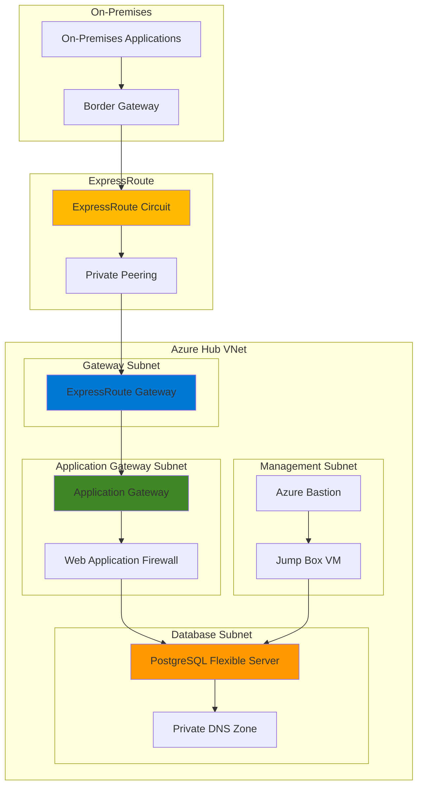

# High-Performance Hybrid Database Connectivity with ExpressRoute

## Problem

Organizations operating hybrid cloud environments face significant challenges when connecting on-premises applications to Azure databases while maintaining enterprise-grade security, performance, and compliance requirements. Traditional VPN connections often introduce latency bottlenecks, bandwidth limitations, and security vulnerabilities that impact critical database workloads. Companies require predictable, high-performance connectivity with robust SSL termination and load balancing capabilities to ensure seamless hybrid database operations.

## Solution

This solution creates a secure, high-performance hybrid architecture using Azure ExpressRoute for private connectivity between on-premises networks and Azure Database for PostgreSQL Flexible Server, with Azure Application Gateway providing SSL termination, load balancing, and web application firewall capabilities. This architecture ensures consistent network performance, enhanced security through private connectivity, and scalable database access patterns while maintaining compliance with enterprise security policies.

## Architecture Diagram



## Prerequisites

1. Azure subscription with appropriate permissions for ExpressRoute, Application Gateway, and PostgreSQL services
2. Azure CLI v2.61.0 or later installed and configured (or Azure Cloud Shell)
3. ExpressRoute circuit provisioned by your connectivity provider
4. On-premises BGP routing configuration capability
5. SSL certificate for Application Gateway (can be self-signed for testing)
6. Basic understanding of Azure networking, BGP routing, and database connectivity
7. Estimated cost: $800-1,200 per month for ExpressRoute circuit, Application Gateway, and PostgreSQL Flexible Server

> **Note**: ExpressRoute circuits require coordination with your connectivity provider and may take 2-4 weeks to provision. This recipe assumes you have an active ExpressRoute circuit or are using ExpressRoute Direct.

## Preparation

```bash
# Set environment variables for Azure resources
export RESOURCE_GROUP="rg-hybrid-db-connectivity"
export LOCATION="eastus"
export SUBSCRIPTION_ID=$(az account show --query id --output tsv)

# Generate unique suffix for resource names
RANDOM_SUFFIX=$(openssl rand -hex 3)
export VNET_NAME="vnet-hub-${RANDOM_SUFFIX}"
export APPGW_NAME="appgw-db-${RANDOM_SUFFIX}"
export POSTGRES_NAME="postgres-hybrid-${RANDOM_SUFFIX}"
export ERGW_NAME="ergw-hub-${RANDOM_SUFFIX}"

# Create resource group
az group create \
    --name ${RESOURCE_GROUP} \
    --location ${LOCATION} \
    --tags purpose=hybrid-database-connectivity environment=production

# Create hub virtual network with appropriate subnets
az network vnet create \
    --name ${VNET_NAME} \
    --resource-group ${RESOURCE_GROUP} \
    --location ${LOCATION} \
    --address-prefixes 10.1.0.0/16 \
    --subnet-name GatewaySubnet \
    --subnet-prefixes 10.1.1.0/27

# Create Application Gateway subnet
az network vnet subnet create \
    --name ApplicationGatewaySubnet \
    --resource-group ${RESOURCE_GROUP} \
    --vnet-name ${VNET_NAME} \
    --address-prefixes 10.1.2.0/24

# Create database subnet with service endpoints
az network vnet subnet create \
    --name DatabaseSubnet \
    --resource-group ${RESOURCE_GROUP} \
    --vnet-name ${VNET_NAME} \
    --address-prefixes 10.1.3.0/24 \
    --service-endpoints Microsoft.Storage

# Create management subnet for bastion and jump box
az network vnet subnet create \
    --name ManagementSubnet \
    --resource-group ${RESOURCE_GROUP} \
    --vnet-name ${VNET_NAME} \
    --address-prefixes 10.1.4.0/24

echo "✅ Resource group and virtual network infrastructure created successfully"
```

## Steps

1. **Create ExpressRoute Gateway for Private Connectivity**:

   Azure ExpressRoute Gateway provides high-performance, private connectivity between on-premises networks and Azure virtual networks. Unlike VPN gateways that encrypt traffic over the public internet, ExpressRoute gateways enable direct private peering with your connectivity provider's network infrastructure. This creates a dedicated, high-bandwidth connection that bypasses the public internet entirely, ensuring predictable performance and enhanced security for database workloads.

   ```bash
   # Create public IP for ExpressRoute Gateway
   az network public-ip create \
       --name pip-${ERGW_NAME} \
       --resource-group ${RESOURCE_GROUP} \
       --location ${LOCATION} \
       --allocation-method Static \
       --sku Standard \
       --zone 1 2 3

   # Create ExpressRoute Gateway (this takes 15-20 minutes)
   az network vnet-gateway create \
       --name ${ERGW_NAME} \
       --resource-group ${RESOURCE_GROUP} \
       --location ${LOCATION} \
       --vnet ${VNET_NAME} \
       --gateway-type ExpressRoute \
       --sku Standard \
       --public-ip-addresses pip-${ERGW_NAME} \
       --no-wait

   echo "✅ ExpressRoute Gateway deployment initiated"
   ```

   The ExpressRoute Gateway now provides the foundational connectivity layer for your hybrid architecture. This gateway will establish BGP peering with your ExpressRoute circuit, enabling dynamic route advertisement and high-availability connectivity patterns that are essential for production database workloads.

2. **Deploy Azure Database for PostgreSQL Flexible Server with Private Access**:

   Azure Database for PostgreSQL Flexible Server with private access provides enterprise-grade database capabilities within your virtual network, ensuring all database traffic remains within your private network boundaries. This configuration integrates seamlessly with ExpressRoute connectivity, enabling on-premises applications to access PostgreSQL databases through private IP addresses without traversing the public internet.

   ```bash
   # Create PostgreSQL Flexible Server with private access
   az postgres flexible-server create \
       --name ${POSTGRES_NAME} \
       --resource-group ${RESOURCE_GROUP} \
       --location ${LOCATION} \
       --admin-user dbadmin \
       --admin-password 'ComplexPassword123!' \
       --sku-name Standard_D2s_v3 \
       --tier GeneralPurpose \
       --version 17 \
       --storage-size 128 \
       --vnet ${VNET_NAME} \
       --subnet DatabaseSubnet \
       --private-dns-zone ${POSTGRES_NAME}.private.postgres.database.azure.com \
       --yes

   # Configure database parameters for optimal performance
   az postgres flexible-server parameter set \
       --name ${POSTGRES_NAME} \
       --resource-group ${RESOURCE_GROUP} \
       --parameter-name max_connections \
       --value 200

   az postgres flexible-server parameter set \
       --name ${POSTGRES_NAME} \
       --resource-group ${RESOURCE_GROUP} \
       --parameter-name shared_preload_libraries \
       --value 'pg_stat_statements'

   echo "✅ PostgreSQL Flexible Server deployed with private access"
   ```

   The PostgreSQL Flexible Server is now configured with private access, integrated into your virtual network's database subnet. This ensures all database communications occur through private IP addresses, providing the security and performance benefits required for hybrid database architectures while maintaining compatibility with ExpressRoute connectivity.

3. **Create Application Gateway with SSL Termination**:

   Azure Application Gateway provides layer 7 load balancing and SSL termination capabilities that are essential for securing database connections in hybrid environments. By handling SSL/TLS termination at the Application Gateway, you offload cryptographic processing from database servers while maintaining end-to-end encryption for sensitive data transmission between on-premises applications and Azure databases.

   ```bash
   # Create public IP for Application Gateway
   az network public-ip create \
       --name pip-${APPGW_NAME} \
       --resource-group ${RESOURCE_GROUP} \
       --location ${LOCATION} \
       --allocation-method Static \
       --sku Standard \
       --zone 1 2 3

   # Create Application Gateway with WAF enabled
   az network application-gateway create \
       --name ${APPGW_NAME} \
       --resource-group ${RESOURCE_GROUP} \
       --location ${LOCATION} \
       --vnet-name ${VNET_NAME} \
       --subnet ApplicationGatewaySubnet \
       --public-ip-address pip-${APPGW_NAME} \
       --sku WAF_v2 \
       --capacity 2 \
       --http-settings-cookie-based-affinity Enabled \
       --frontend-port 443 \
       --http-settings-port 5432 \
       --http-settings-protocol Http \
       --priority 1000

   # Configure backend address pool for PostgreSQL
   az network application-gateway address-pool create \
       --resource-group ${RESOURCE_GROUP} \
       --gateway-name ${APPGW_NAME} \
       --name PostgreSQLBackendPool \
       --servers $(az postgres flexible-server show \
           --name ${POSTGRES_NAME} \
           --resource-group ${RESOURCE_GROUP} \
           --query "fullyQualifiedDomainName" \
           --output tsv)

   echo "✅ Application Gateway deployed with SSL termination capabilities"
   ```

   The Application Gateway now provides a secure, scalable entry point for database connections, with Web Application Firewall (WAF) protection and SSL termination capabilities. This configuration ensures that all database traffic is inspected and secured before reaching the PostgreSQL server, while providing the performance benefits of SSL offloading.

4. **Configure ExpressRoute Circuit Connection**:

   Connecting your ExpressRoute circuit to the ExpressRoute Gateway establishes the private connectivity path between your on-premises network and Azure resources. This connection enables BGP route advertisement and creates redundant connectivity paths that ensure high availability for your hybrid database architecture.

   ```bash
   # Wait for ExpressRoute Gateway to complete deployment
   echo "Waiting for ExpressRoute Gateway deployment to complete..."
   az network vnet-gateway wait \
       --name ${ERGW_NAME} \
       --resource-group ${RESOURCE_GROUP} \
       --created

   # Create connection to ExpressRoute circuit (replace with your circuit ID)
   # Note: Replace the circuit ID with your actual ExpressRoute circuit resource ID
   CIRCUIT_ID="/subscriptions/${SUBSCRIPTION_ID}/resourceGroups/rg-expressroute/providers/Microsoft.Network/expressRouteCircuits/er-circuit-example"
   
   az network vpn-connection create \
       --name connection-${ERGW_NAME} \
       --resource-group ${RESOURCE_GROUP} \
       --location ${LOCATION} \
       --vnet-gateway1 ${ERGW_NAME} \
       --express-route-circuit2 ${CIRCUIT_ID} \
       --connection-type ExpressRoute

   echo "✅ ExpressRoute circuit connection configured"
   ```

   The ExpressRoute connection now provides dedicated, private connectivity between your on-premises network and Azure, eliminating internet-based routing for database traffic. This ensures consistent performance, enhanced security, and compliance with enterprise network policies.

5. **Configure Private DNS Resolution**:

   Private DNS resolution ensures that database connection strings resolve to private IP addresses within your virtual network, maintaining the security benefits of private connectivity. This configuration is essential for applications that use fully qualified domain names (FQDNs) to connect to PostgreSQL databases.

   ```bash
   # Create private DNS zone for PostgreSQL
   az network private-dns zone create \
       --name ${POSTGRES_NAME}.private.postgres.database.azure.com \
       --resource-group ${RESOURCE_GROUP}

   # Link private DNS zone to virtual network
   az network private-dns link vnet create \
       --name link-${VNET_NAME} \
       --resource-group ${RESOURCE_GROUP} \
       --zone-name ${POSTGRES_NAME}.private.postgres.database.azure.com \
       --virtual-network ${VNET_NAME} \
       --registration-enabled false

   # Get PostgreSQL server private IP address for DNS record
   POSTGRES_PRIVATE_IP=$(az postgres flexible-server show \
       --name ${POSTGRES_NAME} \
       --resource-group ${RESOURCE_GROUP} \
       --query "network.privateEndpointConnections[0].privateEndpoint.networkInterfaces[0].ipConfigurations[0].privateIPAddress" \
       --output tsv)

   # Create A record for PostgreSQL server
   az network private-dns record-set a create \
       --name ${POSTGRES_NAME} \
       --resource-group ${RESOURCE_GROUP} \
       --zone-name ${POSTGRES_NAME}.private.postgres.database.azure.com

   az network private-dns record-set a add-record \
       --resource-group ${RESOURCE_GROUP} \
       --zone-name ${POSTGRES_NAME}.private.postgres.database.azure.com \
       --record-set-name ${POSTGRES_NAME} \
       --ipv4-address ${POSTGRES_PRIVATE_IP}

   echo "✅ Private DNS resolution configured for PostgreSQL"
   ```

   Private DNS resolution now ensures that database connections from on-premises applications automatically resolve to private IP addresses, maintaining the security and performance benefits of your ExpressRoute connectivity while providing seamless name resolution for database services.

6. **Configure Application Gateway Health Probes and SSL Policies**:

   Application Gateway health probes ensure that traffic is only routed to healthy database instances, while SSL policies enforce security standards for encrypted communications. These configurations are essential for maintaining high availability and security in production database environments.

   ```bash
   # Create custom health probe for PostgreSQL
   az network application-gateway probe create \
       --resource-group ${RESOURCE_GROUP} \
       --gateway-name ${APPGW_NAME} \
       --name PostgreSQLHealthProbe \
       --protocol Http \
       --port 5432 \
       --path /health \
       --interval 30 \
       --timeout 30 \
       --threshold 3

   # Configure SSL policy for enhanced security
   az network application-gateway ssl-policy set \
       --resource-group ${RESOURCE_GROUP} \
       --gateway-name ${APPGW_NAME} \
       --policy-type Custom \
       --cipher-suites TLS_ECDHE_RSA_WITH_AES_256_GCM_SHA384 \
       --min-protocol-version TLSv1_2

   # Configure WAF policy for database protection
   az network application-gateway waf-policy create \
       --name waf-policy-db \
       --resource-group ${RESOURCE_GROUP} \
       --location ${LOCATION} \
       --type OWASP \
       --version 3.2

   echo "✅ Application Gateway health probes and SSL policies configured"
   ```

   The Application Gateway now provides comprehensive health monitoring and advanced SSL security policies that ensure only healthy database instances receive traffic while maintaining the highest security standards for encrypted database communications.

7. **Implement Network Security Groups and Route Tables**:

   Network Security Groups (NSGs) and User-Defined Routes (UDRs) provide granular network access control and traffic steering for your hybrid database architecture. These configurations ensure that database traffic follows secure, optimized paths while preventing unauthorized access to sensitive database resources.

   ```bash
   # Create NSG for database subnet
   az network nsg create \
       --name nsg-database-subnet \
       --resource-group ${RESOURCE_GROUP} \
       --location ${LOCATION}

   # Configure NSG rules for database access
   az network nsg rule create \
       --name AllowApplicationGatewayToPostgreSQL \
       --resource-group ${RESOURCE_GROUP} \
       --nsg-name nsg-database-subnet \
       --priority 1000 \
       --source-address-prefixes 10.1.2.0/24 \
       --destination-port-ranges 5432 \
       --access Allow \
       --protocol Tcp \
       --direction Inbound

   az network nsg rule create \
       --name AllowExpressRouteToPostgreSQL \
       --resource-group ${RESOURCE_GROUP} \
       --nsg-name nsg-database-subnet \
       --priority 1100 \
       --source-address-prefixes 10.0.0.0/8 \
       --destination-port-ranges 5432 \
       --access Allow \
       --protocol Tcp \
       --direction Inbound

   # Associate NSG with database subnet
   az network vnet subnet update \
       --name DatabaseSubnet \
       --resource-group ${RESOURCE_GROUP} \
       --vnet-name ${VNET_NAME} \
       --network-security-group nsg-database-subnet

   # Create route table for database subnet
   az network route-table create \
       --name rt-database-subnet \
       --resource-group ${RESOURCE_GROUP} \
       --location ${LOCATION}

   # Create route for on-premises traffic via ExpressRoute
   az network route-table route create \
       --name route-onpremises \
       --resource-group ${RESOURCE_GROUP} \
       --route-table-name rt-database-subnet \
       --address-prefix 10.0.0.0/8 \
       --next-hop-type VnetLocal

   # Associate route table with database subnet
   az network vnet subnet update \
       --name DatabaseSubnet \
       --resource-group ${RESOURCE_GROUP} \
       --vnet-name ${VNET_NAME} \
       --route-table rt-database-subnet

   echo "✅ Network security groups and route tables configured"
   ```

   The network security configuration now provides comprehensive access control and traffic steering for your hybrid database architecture, ensuring that database communications follow secure, optimized paths while preventing unauthorized access to sensitive resources.

## Validation & Testing

1. **Verify ExpressRoute Gateway Connection Status**:

   ```bash
   # Check ExpressRoute Gateway provisioning state
   az network vnet-gateway show \
       --name ${ERGW_NAME} \
       --resource-group ${RESOURCE_GROUP} \
       --query "provisioningState" \
       --output table
   
   # Verify ExpressRoute circuit connection
   az network vpn-connection show \
       --name connection-${ERGW_NAME} \
       --resource-group ${RESOURCE_GROUP} \
       --query "connectionStatus" \
       --output table
   ```

   Expected output: `Succeeded` for provisioning state and `Connected` for connection status

2. **Test PostgreSQL Database Connectivity**:

   ```bash
   # Verify PostgreSQL server is running and accessible
   az postgres flexible-server show \
       --name ${POSTGRES_NAME} \
       --resource-group ${RESOURCE_GROUP} \
       --query "state" \
       --output table
   
   # Test database connectivity through private endpoint
   POSTGRES_FQDN=$(az postgres flexible-server show \
       --name ${POSTGRES_NAME} \
       --resource-group ${RESOURCE_GROUP} \
       --query "fullyQualifiedDomainName" \
       --output tsv)
   
   echo "PostgreSQL FQDN: ${POSTGRES_FQDN}"
   ```

   Expected output: `Ready` for server state and successful FQDN resolution

3. **Validate Application Gateway Configuration**:

   ```bash
   # Check Application Gateway operational state
   az network application-gateway show \
       --name ${APPGW_NAME} \
       --resource-group ${RESOURCE_GROUP} \
       --query "operationalState" \
       --output table
   
   # Verify backend pool health
   az network application-gateway show-backend-health \
       --name ${APPGW_NAME} \
       --resource-group ${RESOURCE_GROUP} \
       --query "backendAddressPools[0].backendHttpSettingsCollection[0].servers[0].health" \
       --output table
   ```

   Expected output: `Running` for operational state and `Healthy` for backend health

4. **Test End-to-End Connectivity**:

   ```bash
   # Create test VM in management subnet for connectivity testing
   az vm create \
       --name vm-test-connectivity \
       --resource-group ${RESOURCE_GROUP} \
       --image Ubuntu2204 \
       --subnet ManagementSubnet \
       --vnet-name ${VNET_NAME} \
       --admin-username azureuser \
       --generate-ssh-keys \
       --size Standard_B2s \
       --no-wait
   
   echo "Test VM created for connectivity validation"
   ```

## Cleanup

1. **Remove Application Gateway and associated resources**:

   ```bash
   # Delete Application Gateway
   az network application-gateway delete \
       --name ${APPGW_NAME} \
       --resource-group ${RESOURCE_GROUP}
   
   # Delete Application Gateway public IP
   az network public-ip delete \
       --name pip-${APPGW_NAME} \
       --resource-group ${RESOURCE_GROUP}
   
   echo "✅ Application Gateway resources deleted"
   ```

2. **Remove ExpressRoute Gateway and connection**:

   ```bash
   # Delete ExpressRoute connection
   az network vpn-connection delete \
       --name connection-${ERGW_NAME} \
       --resource-group ${RESOURCE_GROUP}
   
   # Delete ExpressRoute Gateway
   az network vnet-gateway delete \
       --name ${ERGW_NAME} \
       --resource-group ${RESOURCE_GROUP}
   
   # Delete ExpressRoute Gateway public IP
   az network public-ip delete \
       --name pip-${ERGW_NAME} \
       --resource-group ${RESOURCE_GROUP}
   
   echo "✅ ExpressRoute Gateway resources deleted"
   ```

3. **Remove PostgreSQL server and private DNS resources**:

   ```bash
   # Delete PostgreSQL Flexible Server
   az postgres flexible-server delete \
       --name ${POSTGRES_NAME} \
       --resource-group ${RESOURCE_GROUP} \
       --yes
   
   # Delete private DNS zone
   az network private-dns zone delete \
       --name ${POSTGRES_NAME}.private.postgres.database.azure.com \
       --resource-group ${RESOURCE_GROUP} \
       --yes
   
   echo "✅ PostgreSQL and DNS resources deleted"
   ```

4. **Remove resource group and all remaining resources**:

   ```bash
   # Delete resource group and all contained resources
   az group delete \
       --name ${RESOURCE_GROUP} \
       --yes \
       --no-wait
   
   echo "✅ Resource group deletion initiated: ${RESOURCE_GROUP}"
   echo "Note: Resource deletion may take several minutes to complete"
   
   # Clean up environment variables
   unset RESOURCE_GROUP LOCATION VNET_NAME APPGW_NAME POSTGRES_NAME ERGW_NAME
   ```

## Discussion

This hybrid database connectivity architecture demonstrates how Azure ExpressRoute and Application Gateway work together to create secure, high-performance connections between on-premises applications and Azure Database for PostgreSQL. The ExpressRoute private peering connection eliminates internet latency and provides predictable bandwidth, while Application Gateway adds layer 7 load balancing, SSL termination, and Web Application Firewall protection. This combination is particularly valuable for enterprises requiring consistent database performance and stringent security controls.

The architecture follows Azure Well-Architected Framework principles by implementing defense-in-depth security through multiple layers including network security groups, private DNS resolution, and WAF policies. The ExpressRoute connection provides the reliability pillar benefits through redundant connectivity paths and SLA-backed performance guarantees. For detailed ExpressRoute design guidance, see the [Azure ExpressRoute documentation](https://docs.microsoft.com/en-us/azure/expressroute/) and [Application Gateway best practices](https://docs.microsoft.com/en-us/azure/application-gateway/application-gateway-best-practices).

From a cost optimization perspective, this architecture balances performance requirements with operational expenses by using ExpressRoute Standard SKU and Application Gateway v2 with autoscaling capabilities. The PostgreSQL Flexible Server provides right-sized compute resources with the ability to scale based on workload demands. Organizations should monitor ExpressRoute bandwidth utilization and Application Gateway request patterns to optimize costs while maintaining performance. The [Azure Cost Management documentation](https://docs.microsoft.com/en-us/azure/cost-management-billing/) provides comprehensive guidance for monitoring and optimizing hybrid architecture costs.

Performance considerations include ExpressRoute bandwidth selection, Application Gateway instance sizing, and PostgreSQL server configuration optimization. The architecture supports high availability through ExpressRoute circuit redundancy and Application Gateway zone distribution. For production deployments, consider implementing [Azure Monitor](https://docs.microsoft.com/en-us/azure/azure-monitor/) for comprehensive observability and [Azure Backup](https://docs.microsoft.com/en-us/azure/backup/) for PostgreSQL database protection.

> **Tip**: Use Azure Network Watcher to monitor ExpressRoute and Application Gateway performance metrics, and configure Azure Monitor alerts for proactive monitoring of database connectivity and performance thresholds.

## Challenge

Extend this solution by implementing these advanced enhancements:

1. **Multi-Region High Availability**: Deploy PostgreSQL read replicas in secondary Azure regions connected through ExpressRoute Global Reach for disaster recovery and global read scaling capabilities.

2. **Advanced Security Integration**: Implement Azure Key Vault for SSL certificate management, Azure AD authentication for PostgreSQL, and Azure Security Center for comprehensive threat detection across the hybrid infrastructure.

3. **Performance Optimization**: Configure Application Gateway autoscaling rules, implement connection pooling with PgBouncer, and optimize PostgreSQL configuration parameters for your specific workload patterns.

4. **Monitoring and Alerting**: Deploy Azure Monitor Workbooks for hybrid connectivity dashboards, implement Log Analytics for centralized logging, and configure automated alerting for ExpressRoute and database performance metrics.

5. **Compliance and Governance**: Implement Azure Policy for network security compliance, configure Azure Blueprints for consistent hybrid deployments, and integrate with Azure Arc for unified management of hybrid resources.

## Infrastructure Code

*Infrastructure code will be generated after recipe approval.*