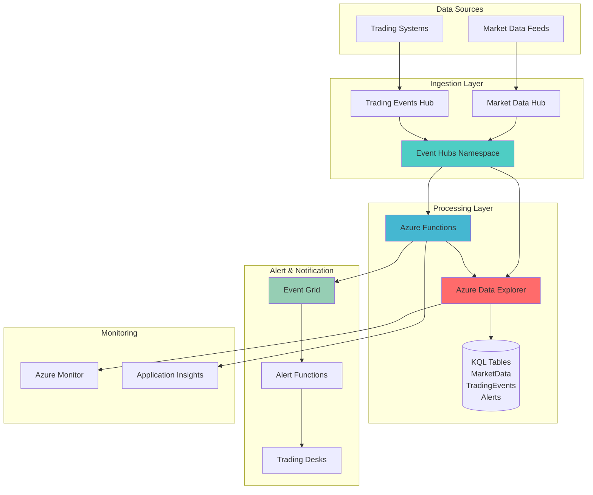

# High-Velocity Financial Analytics with Azure Data Explorer and Event Hubs

## Problem

Financial trading firms need to process millions of market data events per second to make split-second trading decisions, but traditional database solutions cannot handle the high-velocity, high-volume time-series data required for real-time market analysis. The challenge is compounded by the need for complex pattern recognition, anomaly detection, and automated alert generation that can trigger trading strategies within milliseconds of market events.

## Solution

This solution leverages Azure Data Explorer as the primary analytics engine combined with Azure Event Hubs for high-throughput data ingestion, Azure Functions for real-time processing, and Azure Event Grid for automated trading alerts. Azure Data Explorer provides the fast analytical capabilities needed for time-series analysis, while Event Hubs handles the massive ingestion requirements of financial market data streams.

## Architecture Diagram



## Prerequisites

1. Azure account with subscription contributor permissions
2. Azure CLI version 2.50.0 or later installed and configured
3. Basic understanding of financial market data structures (OHLCV, tick data)
4. Knowledge of KQL (Kusto Query Language) for data analysis
5. Understanding of time-series analysis concepts
6. Estimated cost: $150-300 per day for testing (production costs vary by volume)

> **Note**: This recipe uses Azure Data Explorer as the primary analytics engine, replacing the retired Azure Time Series Insights service. For migration guidance, see [Azure Time Series Insights retirement documentation](https://learn.microsoft.com/en-us/azure/time-series-insights/retirement-migration-guide).

## Preparation

```bash
# Set environment variables for Azure resources
export RESOURCE_GROUP="rg-financial-market-data-${RANDOM_SUFFIX}"
export LOCATION="eastus"
export SUBSCRIPTION_ID=$(az account show --query id --output tsv)

# Generate unique suffix for resource names
RANDOM_SUFFIX=$(openssl rand -hex 3)

# Set specific resource names
export ADX_CLUSTER_NAME="adx-market-${RANDOM_SUFFIX}"
export EVENT_HUB_NAMESPACE="evhns-market-${RANDOM_SUFFIX}"
export FUNCTION_APP_NAME="func-market-${RANDOM_SUFFIX}"
export STORAGE_ACCOUNT_NAME="stmarket${RANDOM_SUFFIX}"
export EVENT_GRID_TOPIC="egt-market-alerts-${RANDOM_SUFFIX}"

# Create resource group
az group create \
    --name ${RESOURCE_GROUP} \
    --location ${LOCATION} \
    --tags purpose=financial-market-data environment=demo

echo "✅ Resource group created: ${RESOURCE_GROUP}"

# Create storage account for Azure Functions
az storage account create \
    --name ${STORAGE_ACCOUNT_NAME} \
    --resource-group ${RESOURCE_GROUP} \
    --location ${LOCATION} \
    --sku Standard_LRS \
    --kind StorageV2

echo "✅ Storage account created: ${STORAGE_ACCOUNT_NAME}"
```

## Steps

1. **Create Azure Data Explorer Cluster**:

   Azure Data Explorer provides a fast, fully managed analytics service optimized for time-series data analysis. For financial market data, ADX offers sub-second query performance on billions of records with built-in scaling and compression. The cluster serves as the analytical backbone for processing high-frequency trading data and performing complex pattern recognition.

   ```bash
   # Create Azure Data Explorer cluster
   az kusto cluster create \
       --cluster-name ${ADX_CLUSTER_NAME} \
       --resource-group ${RESOURCE_GROUP} \
       --location ${LOCATION} \
       --sku name="Dev(No SLA)_Standard_D11_v2" tier="Basic"
   
   echo "✅ Azure Data Explorer cluster created: ${ADX_CLUSTER_NAME}"
   
   # Wait for cluster to be ready
   az kusto cluster wait \
       --cluster-name ${ADX_CLUSTER_NAME} \
       --resource-group ${RESOURCE_GROUP} \
       --created
   ```

   The ADX cluster is now provisioned and ready for database creation. This foundational component provides the analytical horsepower needed for real-time financial data processing with automatic scaling and built-in time-series optimization.

2. **Create Database and Tables in Azure Data Explorer**:

   Financial market data requires specialized table structures optimized for time-series workloads. ADX databases support columnar storage with automatic partitioning and compression, making them ideal for high-velocity market data ingestion while maintaining fast query performance for trading analysis.

   ```bash
   # Create database in ADX cluster
   az kusto database create \
       --cluster-name ${ADX_CLUSTER_NAME} \
       --database-name MarketData \
       --resource-group ${RESOURCE_GROUP} \
       --read-write-database location=${LOCATION} \
           soft-delete-period=P30D \
           hot-cache-period=P7D
   
   echo "✅ MarketData database created in ADX cluster"
   
   # Get ADX cluster URI for table creation
   ADX_URI=$(az kusto cluster show \
       --cluster-name ${ADX_CLUSTER_NAME} \
       --resource-group ${RESOURCE_GROUP} \
       --query uri --output tsv)
   
   echo "ADX URI: ${ADX_URI}"
   ```

   The database is configured with optimal retention policies for financial data: 30 days total retention with 7 days in hot cache for fast access to recent market data. This configuration balances performance with cost-effectiveness for typical trading scenarios.

3. **Create Event Hubs Namespace and Hubs**:

   Azure Event Hubs provides the high-throughput ingestion capabilities required for financial market data streams. With support for millions of events per second, Event Hubs acts as the front door for market data feeds, trading events, and real-time transaction data while ensuring ordered delivery within partitions.

   ```bash
   # Create Event Hubs namespace
   az eventhubs namespace create \
       --resource-group ${RESOURCE_GROUP} \
       --name ${EVENT_HUB_NAMESPACE} \
       --location ${LOCATION} \
       --sku Standard \
       --throughput-units 2 \
       --enable-auto-inflate \
       --maximum-throughput-units 10
   
   echo "✅ Event Hubs namespace created: ${EVENT_HUB_NAMESPACE}"
   
   # Create Event Hub for market data
   az eventhubs eventhub create \
       --resource-group ${RESOURCE_GROUP} \
       --namespace-name ${EVENT_HUB_NAMESPACE} \
       --name market-data-hub \
       --partition-count 8 \
       --message-retention 1
   
   # Create Event Hub for trading events
   az eventhubs eventhub create \
       --resource-group ${RESOURCE_GROUP} \
       --namespace-name ${EVENT_HUB_NAMESPACE} \
       --name trading-events-hub \
       --partition-count 4 \
       --message-retention 1
   
   echo "✅ Event Hubs created for market data and trading events"
   ```

   The Event Hubs are configured with multiple partitions to support parallel processing and auto-inflate capabilities to handle traffic spikes during market volatility. This configuration ensures reliable ingestion even during peak trading periods.

4. **Configure Data Connection from Event Hubs to Azure Data Explorer**:

   The data connection establishes a direct pipeline from Event Hubs to Azure Data Explorer, enabling real-time ingestion of market data with automatic schema inference and data transformation. This connection supports both JSON and Avro formats commonly used in financial data feeds.

   ```bash
   # Create data connection from Event Hubs to ADX
   az kusto data-connection event-hub create \
       --cluster-name ${ADX_CLUSTER_NAME} \
       --database-name MarketData \
       --resource-group ${RESOURCE_GROUP} \
       --data-connection-name market-data-connection \
       --event-hub-resource-id "/subscriptions/${SUBSCRIPTION_ID}/resourceGroups/${RESOURCE_GROUP}/providers/Microsoft.EventHub/namespaces/${EVENT_HUB_NAMESPACE}/eventhubs/market-data-hub" \
       --consumer-group '$Default' \
       --table-name MarketDataRaw \
       --data-format JSON \
       --mapping-rule-name MarketDataMapping
   
   echo "✅ Data connection created from Event Hubs to ADX"
   
   # Create consumer group for trading events
   az eventhubs eventhub consumer-group create \
       --resource-group ${RESOURCE_GROUP} \
       --namespace-name ${EVENT_HUB_NAMESPACE} \
       --eventhub-name trading-events-hub \
       --name trading-consumer-group
   
   echo "✅ Consumer group created for trading events"
   ```

   The data connection now streams market data directly into Azure Data Explorer with automatic JSON parsing and schema detection. This eliminates the need for custom ETL processes while ensuring data consistency and real-time availability.

5. **Create Azure Functions for Data Processing**:

   Azure Functions provides serverless compute for processing market data events, calculating technical indicators, and detecting trading patterns. Functions scale automatically based on Event Hub throughput and can process millions of events with minimal latency, making them ideal for real-time trading systems.

   ```bash
   # Create Function App
   az functionapp create \
       --name ${FUNCTION_APP_NAME} \
       --resource-group ${RESOURCE_GROUP} \
       --storage-account ${STORAGE_ACCOUNT_NAME} \
       --consumption-plan-location ${LOCATION} \
       --runtime python \
       --runtime-version 3.12 \
       --functions-version 4 \
       --os-type Linux
   
   echo "✅ Function App created: ${FUNCTION_APP_NAME}"
   
   # Get Event Hub connection string
   EVENT_HUB_CONNECTION=$(az eventhubs namespace authorization-rule keys list \
       --resource-group ${RESOURCE_GROUP} \
       --namespace-name ${EVENT_HUB_NAMESPACE} \
       --name RootManageSharedAccessKey \
       --query primaryConnectionString --output tsv)
   
   # Configure Function App settings
   az functionapp config appsettings set \
       --name ${FUNCTION_APP_NAME} \
       --resource-group ${RESOURCE_GROUP} \
       --settings "EventHubConnectionString=${EVENT_HUB_CONNECTION}" \
                  "ADX_CLUSTER_URI=${ADX_URI}" \
                  "ADX_DATABASE=MarketData"
   
   echo "✅ Function App configured with Event Hub and ADX connections"
   ```

   The Function App is now configured with the necessary connection strings and environment variables. This serverless architecture ensures cost-effective processing that scales automatically with market activity while maintaining low latency for real-time trading scenarios.

6. **Create Event Grid Topic for Trading Alerts**:

   Azure Event Grid provides event-driven messaging for triggering automated trading alerts based on market conditions. Event Grid's publisher-subscriber model enables decoupled architecture where multiple trading systems can react to market events without direct coupling to the analytics engine.

   ```bash
   # Create Event Grid topic
   az eventgrid topic create \
       --resource-group ${RESOURCE_GROUP} \
       --name ${EVENT_GRID_TOPIC} \
       --location ${LOCATION} \
       --input-schema EventGridSchema
   
   echo "✅ Event Grid topic created: ${EVENT_GRID_TOPIC}"
   
   # Get Event Grid topic endpoint and key
   EVENT_GRID_ENDPOINT=$(az eventgrid topic show \
       --resource-group ${RESOURCE_GROUP} \
       --name ${EVENT_GRID_TOPIC} \
       --query endpoint --output tsv)
   
   EVENT_GRID_KEY=$(az eventgrid topic key list \
       --resource-group ${RESOURCE_GROUP} \
       --name ${EVENT_GRID_TOPIC} \
       --query key1 --output tsv)
   
   # Update Function App with Event Grid settings
   az functionapp config appsettings set \
       --name ${FUNCTION_APP_NAME} \
       --resource-group ${RESOURCE_GROUP} \
       --settings "EventGridEndpoint=${EVENT_GRID_ENDPOINT}" \
                  "EventGridKey=${EVENT_GRID_KEY}"
   
   echo "✅ Event Grid configured for trading alerts"
   ```

   The Event Grid topic enables real-time alert distribution to trading desks, risk management systems, and automated trading algorithms. This event-driven approach ensures rapid response to market conditions while maintaining system reliability.

7. **Configure Monitoring and Logging**:

   Comprehensive monitoring is crucial for financial systems to ensure data integrity, track performance, and meet regulatory requirements. Azure Monitor provides telemetry collection while Application Insights offers detailed performance analytics and error tracking for trading applications.

   ```bash
   # Create Application Insights instance
   az monitor app-insights component create \
       --app ${FUNCTION_APP_NAME}-insights \
       --location ${LOCATION} \
       --resource-group ${RESOURCE_GROUP} \
       --application-type web \
       --kind web
   
   # Get Application Insights connection string
   INSIGHTS_CONNECTION=$(az monitor app-insights component show \
       --app ${FUNCTION_APP_NAME}-insights \
       --resource-group ${RESOURCE_GROUP} \
       --query connectionString --output tsv)
   
   # Configure Function App with Application Insights
   az functionapp config appsettings set \
       --name ${FUNCTION_APP_NAME} \
       --resource-group ${RESOURCE_GROUP} \
       --settings "APPLICATIONINSIGHTS_CONNECTION_STRING=${INSIGHTS_CONNECTION}"
   
   echo "✅ Application Insights configured for monitoring"
   
   # Create Log Analytics workspace
   az monitor log-analytics workspace create \
       --resource-group ${RESOURCE_GROUP} \
       --workspace-name law-market-data-${RANDOM_SUFFIX} \
       --location ${LOCATION} \
       --sku PerGB2018
   
   echo "✅ Log Analytics workspace created for centralized logging"
   ```

   The monitoring infrastructure now provides comprehensive observability across all components of the financial data processing pipeline. This enables proactive issue detection, performance optimization, and compliance reporting required in financial trading environments.

8. **Create Sample Data Tables and Ingestion Mappings**:

   Proper data modeling is essential for financial market data to ensure efficient storage, fast queries, and accurate analysis. ADX table structures must be optimized for time-series workloads with appropriate partitioning and indexing strategies.

   ```bash
   # Create KQL script for table creation
   cat > market_data_schema.kql << 'EOF'
   .create table MarketDataRaw (
       timestamp: datetime,
       symbol: string,
       price: decimal,
       volume: long,
       high: decimal,
       low: decimal,
       open: decimal,
       close: decimal,
       bid: decimal,
       ask: decimal,
       exchange: string,
       eventType: string
   )
   
   .create table TradingEvents (
       timestamp: datetime,
       symbol: string,
       action: string,
       quantity: long,
       price: decimal,
       traderId: string,
       orderId: string,
       executionId: string
   )
   
   .create table MarketAlerts (
       timestamp: datetime,
       symbol: string,
       alertType: string,
       condition: string,
       currentPrice: decimal,
       threshold: decimal,
       severity: string
   )
   
   .create-or-alter table MarketDataRaw ingestion json mapping "MarketDataMapping"
   '[
       {"column": "timestamp", "path": "$.timestamp", "datatype": "datetime"},
       {"column": "symbol", "path": "$.symbol", "datatype": "string"},
       {"column": "price", "path": "$.price", "datatype": "decimal"},
       {"column": "volume", "path": "$.volume", "datatype": "long"},
       {"column": "high", "path": "$.high", "datatype": "decimal"},
       {"column": "low", "path": "$.low", "datatype": "decimal"},
       {"column": "open", "path": "$.open", "datatype": "decimal"},
       {"column": "close", "path": "$.close", "datatype": "decimal"},
       {"column": "bid", "path": "$.bid", "datatype": "decimal"},
       {"column": "ask", "path": "$.ask", "datatype": "decimal"},
       {"column": "exchange", "path": "$.exchange", "datatype": "string"},
       {"column": "eventType", "path": "$.eventType", "datatype": "string"}
   ]'
   EOF
   
   echo "✅ KQL schema script created for market data tables"
   ```

   The table schemas are optimized for financial market data with proper data types for prices (decimal), volumes (long), and timestamps (datetime). The JSON mapping ensures efficient ingestion from Event Hubs while maintaining data integrity.

## Validation & Testing

1. **Verify Azure Data Explorer Cluster Status**:

   ```bash
   # Check ADX cluster state
   az kusto cluster show \
       --cluster-name ${ADX_CLUSTER_NAME} \
       --resource-group ${RESOURCE_GROUP} \
       --query "{name:name,state:state,uri:uri}" --output table
   
   # Verify database exists
   az kusto database show \
       --cluster-name ${ADX_CLUSTER_NAME} \
       --database-name MarketData \
       --resource-group ${RESOURCE_GROUP} \
       --query "{name:name,location:location,state:properties.provisioningState}" --output table
   ```

   Expected output: ADX cluster should show "Running" state with valid URI endpoint.

2. **Test Event Hubs Configuration**:

   ```bash
   # Check Event Hubs namespace status
   az eventhubs namespace show \
       --resource-group ${RESOURCE_GROUP} \
       --name ${EVENT_HUB_NAMESPACE} \
       --query "{name:name,status:status,throughputUnits:sku.capacity}" --output table
   
   # Verify Event Hubs are active
   az eventhubs eventhub list \
       --resource-group ${RESOURCE_GROUP} \
       --namespace-name ${EVENT_HUB_NAMESPACE} \
       --query "[].{name:name,partitionCount:partitionCount,status:status}" --output table
   ```

   Expected output: Both Event Hubs should show active status with configured partition counts.

3. **Test Data Connection**:

   ```bash
   # Verify data connection status
   az kusto data-connection show \
       --cluster-name ${ADX_CLUSTER_NAME} \
       --database-name MarketData \
       --resource-group ${RESOURCE_GROUP} \
       --data-connection-name market-data-connection \
       --query "{name:name,state:properties.provisioningState}" --output table
   ```

   Expected output: Data connection should show "Succeeded" provisioning state.

4. **Test Function App Configuration**:

   ```bash
   # Check Function App status
   az functionapp show \
       --name ${FUNCTION_APP_NAME} \
       --resource-group ${RESOURCE_GROUP} \
       --query "{name:name,state:state,hostNames:hostNames}" --output table
   
   # Verify application settings
   az functionapp config appsettings list \
       --name ${FUNCTION_APP_NAME} \
       --resource-group ${RESOURCE_GROUP} \
       --query "[?name=='EventHubConnectionString' || name=='ADX_CLUSTER_URI'].{name:name,value:value}" --output table
   ```

   Expected output: Function App should be running with proper Event Hub and ADX connection strings configured.

5. **Test Event Grid Topic**:

   ```bash
   # Verify Event Grid topic status
   az eventgrid topic show \
       --resource-group ${RESOURCE_GROUP} \
       --name ${EVENT_GRID_TOPIC} \
       --query "{name:name,provisioningState:provisioningState,endpoint:endpoint}" --output table
   ```

   Expected output: Event Grid topic should show "Succeeded" provisioning state with valid endpoint.

## Cleanup

1. **Remove Event Grid Topic**:

   ```bash
   # Delete Event Grid topic
   az eventgrid topic delete \
       --resource-group ${RESOURCE_GROUP} \
       --name ${EVENT_GRID_TOPIC} \
       --yes
   
   echo "✅ Event Grid topic deleted"
   ```

2. **Remove Function App**:

   ```bash
   # Delete Function App
   az functionapp delete \
       --name ${FUNCTION_APP_NAME} \
       --resource-group ${RESOURCE_GROUP}
   
   echo "✅ Function App deleted"
   ```

3. **Remove Event Hubs Namespace**:

   ```bash
   # Delete Event Hubs namespace (includes all hubs)
   az eventhubs namespace delete \
       --resource-group ${RESOURCE_GROUP} \
       --name ${EVENT_HUB_NAMESPACE}
   
   echo "✅ Event Hubs namespace deleted"
   ```

4. **Remove Azure Data Explorer Cluster**:

   ```bash
   # Delete ADX cluster
   az kusto cluster delete \
       --cluster-name ${ADX_CLUSTER_NAME} \
       --resource-group ${RESOURCE_GROUP} \
       --yes
   
   echo "✅ Azure Data Explorer cluster deleted"
   ```

5. **Remove Supporting Resources**:

   ```bash
   # Delete storage account
   az storage account delete \
       --name ${STORAGE_ACCOUNT_NAME} \
       --resource-group ${RESOURCE_GROUP} \
       --yes
   
   # Delete resource group and all remaining resources
   az group delete \
       --name ${RESOURCE_GROUP} \
       --yes \
       --no-wait
   
   echo "✅ All resources deleted successfully"
   ```

## Discussion

This solution demonstrates a modern approach to financial market data processing using Azure's native analytics services. Azure Data Explorer serves as the analytical engine, replacing the retired Azure Time Series Insights with superior performance and scalability. The architecture supports millions of market events per second while maintaining sub-second query performance essential for algorithmic trading systems. For detailed guidance on ADX optimization, see the [Azure Data Explorer documentation](https://learn.microsoft.com/en-us/azure/data-explorer/) and [performance tuning guide](https://learn.microsoft.com/en-us/azure/data-explorer/kusto/query/best-practices).

The event-driven architecture using Event Hubs and Event Grid provides natural decoupling between data ingestion, processing, and alerting components. This design follows the [Azure Well-Architected Framework](https://learn.microsoft.com/en-us/azure/architecture/framework/) principles of reliability and performance efficiency. Event Hubs' partition-based scaling ensures ordered message processing within each partition while supporting massive parallel throughput across partitions, critical for maintaining data consistency in financial applications.

From a cost perspective, the serverless Functions and consumption-based pricing model for Event Hubs and ADX ensures you only pay for actual usage, making this solution cost-effective for both small trading firms and large financial institutions. The auto-scaling capabilities handle market volatility spikes automatically without manual intervention. For comprehensive cost optimization strategies, review the [Azure Data Explorer pricing documentation](https://learn.microsoft.com/en-us/azure/data-explorer/pricing) and [Event Hubs cost management guide](https://learn.microsoft.com/en-us/azure/event-hubs/event-hubs-faq#pricing).

The solution provides enterprise-grade security through Azure AD integration, private endpoints, and encryption at rest and in transit. Compliance with financial regulations is supported through comprehensive auditing, data retention policies, and monitoring capabilities. For security best practices in financial services, consult the [Azure Security Center documentation](https://learn.microsoft.com/en-us/azure/security-center/) and [financial services compliance guide](https://learn.microsoft.com/en-us/azure/architecture/industries/finance/compliance).

> **Tip**: Use ADX materialized views for frequently queried aggregations like OHLCV data and moving averages to improve query performance. Configure continuous export to Azure Storage for long-term archival and regulatory compliance. Monitor ingestion latency and throughput using Azure Monitor metrics to ensure optimal performance during peak trading hours.

## Challenge

Extend this solution by implementing these advanced financial market data processing capabilities:

1. **Real-time Technical Indicators**: Implement streaming calculations for moving averages, RSI, MACD, and Bollinger Bands using Azure Stream Analytics or ADX update policies for continuous indicator updates.

2. **Machine Learning Price Prediction**: Integrate Azure Machine Learning to build predictive models for price movements using historical market data and real-time features generated from the ADX cluster.

3. **Multi-Asset Portfolio Risk**: Expand the system to calculate real-time portfolio risk metrics, Value at Risk (VaR), and correlation analysis across multiple asset classes using ADX's advanced analytics capabilities.

4. **Blockchain Integration**: Add cryptocurrency market data ingestion from blockchain networks and DeFi protocols, storing both traditional and digital asset data in the same analytical pipeline.

5. **Compliance and Audit Trail**: Implement a comprehensive audit trail system using Azure Data Lake Storage and Azure Synapse Analytics for regulatory reporting and trade reconstruction capabilities.

## Infrastructure Code

### Available Infrastructure as Code:

- [Infrastructure Code Overview](code/README.md) - Detailed description of all infrastructure components
- [Bicep](code/bicep/) - Azure Bicep templates
- [Bash CLI Scripts](code/scripts/) - Example bash scripts using Azure CLI commands to deploy infrastructure
- [Terraform](code/terraform/) - Terraform configuration files