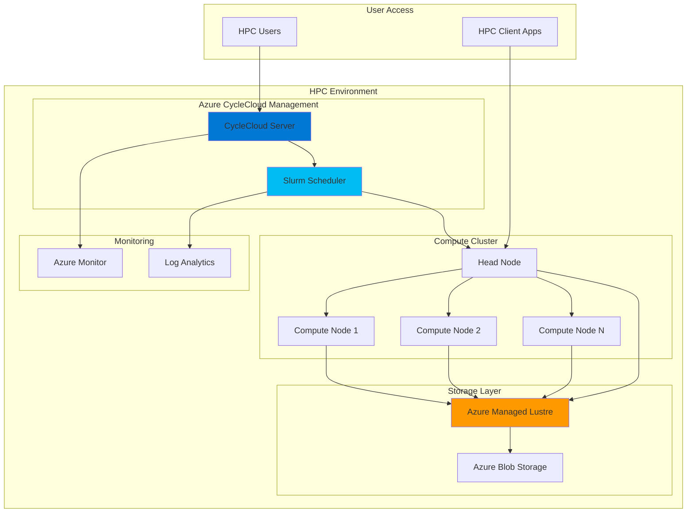

# HPC Workloads with Managed Lustre and CycleCloud

## Problem

Research institutions and engineering organizations require massive parallel processing capabilities for scientific simulations, computational fluid dynamics, and machine learning workloads. Traditional on-premises HPC clusters are expensive to maintain, lack elasticity for varying workloads, and require specialized infrastructure expertise. Organizations struggle with data throughput bottlenecks when processing petabyte-scale datasets across hundreds of compute nodes simultaneously.

## Solution

Azure Managed Lustre provides a fully managed, high-performance parallel file system that delivers the throughput and IOPS required for HPC workloads. Combined with Azure CycleCloud's intelligent cluster orchestration, this solution creates an elastic, cost-effective HPC environment that automatically scales compute resources based on job queue demands while maintaining consistent high-performance storage access across all nodes.

## Architecture Diagram



## Prerequisites

1. Azure subscription with Contributor permissions for creating HPC resources
2. Azure CLI version 2.40.0 or later with amlfs extension
3. Understanding of HPC concepts, job schedulers (Slurm), and parallel file systems
4. SSH key pair for secure cluster access
5. Estimated cost: $200-500 per day for moderate HPC workloads (depending on compute scale and storage throughput)

> **Note**: Azure Managed Lustre requires specialized VM SKUs with InfiniBand networking for optimal performance. Ensure your subscription has quota for HBv3, HBv4, or HCv1 series virtual machines.

## Preparation

```bash
# Set environment variables for Azure resources
export RESOURCE_GROUP="rg-hpc-lustre-${RANDOM_SUFFIX}"
export LOCATION="eastus"
export SUBSCRIPTION_ID=$(az account show --query id --output tsv)

# Generate unique suffix for resource names
RANDOM_SUFFIX=$(openssl rand -hex 3)

# Set HPC-specific variables
export LUSTRE_NAME="lustre-hpc-${RANDOM_SUFFIX}"
export CYCLECLOUD_NAME="cc-hpc-${RANDOM_SUFFIX}"
export STORAGE_ACCOUNT="sthpc${RANDOM_SUFFIX}"
export VNET_NAME="vnet-hpc-${RANDOM_SUFFIX}"
export SSH_KEY_NAME="hpc-ssh-key"

# Create resource group for HPC environment
az group create \
    --name ${RESOURCE_GROUP} \
    --location ${LOCATION} \
    --tags purpose=hpc-demo environment=production

echo "✅ Resource group created: ${RESOURCE_GROUP}"

# Create SSH key pair for cluster access
ssh-keygen -t rsa -b 4096 -f ~/.ssh/${SSH_KEY_NAME} -N ""
export SSH_PUBLIC_KEY=$(cat ~/.ssh/${SSH_KEY_NAME}.pub)

echo "✅ SSH key pair generated for cluster authentication"

# Create storage account for CycleCloud and data staging
az storage account create \
    --name ${STORAGE_ACCOUNT} \
    --resource-group ${RESOURCE_GROUP} \
    --location ${LOCATION} \
    --sku Standard_LRS \
    --kind StorageV2 \
    --hierarchical-namespace true

echo "✅ Storage account created with Data Lake capabilities"
```

## Steps

1. **Create High-Performance Virtual Network Infrastructure**:

   Azure CycleCloud requires a well-designed network topology to support high-bandwidth, low-latency communication between compute nodes and storage systems. The virtual network must accommodate InfiniBand-enabled VM SKUs and provide sufficient address space for large-scale cluster expansion.

   ```bash
   # Create virtual network with dedicated subnets for HPC workloads
   az network vnet create \
       --name ${VNET_NAME} \
       --resource-group ${RESOURCE_GROUP} \
       --location ${LOCATION} \
       --address-prefixes 10.0.0.0/16 \
       --subnet-name compute-subnet \
       --subnet-prefixes 10.0.1.0/24
   
   # Create dedicated subnet for CycleCloud management
   az network vnet subnet create \
       --name management-subnet \
       --resource-group ${RESOURCE_GROUP} \
       --vnet-name ${VNET_NAME} \
       --address-prefixes 10.0.2.0/24
   
   # Create subnet for storage and file system access
   az network vnet subnet create \
       --name storage-subnet \
       --resource-group ${RESOURCE_GROUP} \
       --vnet-name ${VNET_NAME} \
       --address-prefixes 10.0.3.0/24
   
   echo "✅ HPC network infrastructure configured with optimized subnets"
   ```

   The segmented network design enables traffic isolation between compute, management, and storage layers while supporting the massive parallel I/O patterns typical of HPC workloads.

2. **Deploy Azure Managed Lustre File System**:

   Azure Managed Lustre provides a fully managed implementation of the Lustre parallel file system, delivering the high-throughput, low-latency storage performance required for HPC applications. This managed service eliminates the complexity of deploying and maintaining Lustre infrastructure while providing enterprise-grade reliability and security.

   ```bash
   # Install Azure Managed Lustre CLI extension
   az extension add --name amlfs
   
   # Create Azure Managed Lustre file system with high-performance configuration
   az amlfs create \
       --aml-filesystem-name ${LUSTRE_NAME} \
       --resource-group ${RESOURCE_GROUP} \
       --location ${LOCATION} \
       --sku AMLFS-Durable-Premium-250 \
       --storage-capacity 4 \
       --filesystem-subnet "/subscriptions/${SUBSCRIPTION_ID}/resourceGroups/${RESOURCE_GROUP}/providers/Microsoft.Network/virtualNetworks/${VNET_NAME}/subnets/storage-subnet"
   
   # Wait for Lustre file system provisioning to complete
   az amlfs wait \
       --aml-filesystem-name ${LUSTRE_NAME} \
       --resource-group ${RESOURCE_GROUP} \
       --created
   
   echo "✅ Azure Managed Lustre file system provisioned with 4 TiB capacity"
   ```

   The Lustre file system now provides 4 TiB of high-performance storage with premium throughput capabilities, enabling concurrent access from hundreds of compute nodes with consistent performance characteristics.

3. **Install and Configure Azure CycleCloud**:

   Azure CycleCloud orchestrates HPC cluster lifecycle management, providing automated scaling, job scheduling integration, and cost optimization. The CycleCloud server acts as the central management plane for all cluster operations and integrates with Azure Active Directory for secure access control.

   ```bash
   # Create CycleCloud management VM with optimized configuration
   az vm create \
       --name ${CYCLECLOUD_NAME} \
       --resource-group ${RESOURCE_GROUP} \
       --image "microsoft-ads:azure-cyclecloud:cyclecloud82:8.2.0" \
       --size Standard_D4s_v3 \
       --subnet "/subscriptions/${SUBSCRIPTION_ID}/resourceGroups/${RESOURCE_GROUP}/providers/Microsoft.Network/virtualNetworks/${VNET_NAME}/subnets/management-subnet" \
       --admin-username azureuser \
       --ssh-key-values "${SSH_PUBLIC_KEY}" \
       --storage-sku Premium_LRS \
       --os-disk-size-gb 128
   
   # Get CycleCloud VM public IP for configuration
   CYCLECLOUD_IP=$(az vm show \
       --name ${CYCLECLOUD_NAME} \
       --resource-group ${RESOURCE_GROUP} \
       --show-details \
       --query publicIps \
       --output tsv)
   
   echo "✅ CycleCloud server deployed at IP: ${CYCLECLOUD_IP}"
   echo "Access CycleCloud web interface at: https://${CYCLECLOUD_IP}"
   ```

   CycleCloud is now ready for initial configuration through its web interface, where you'll define cluster templates, configure authentication, and integrate with Azure subscription resources.

4. **Configure Storage Integration and Mount Points**:

   Integrating Azure Managed Lustre with CycleCloud requires configuring mount points and client access patterns that optimize data throughput for parallel workloads. This configuration ensures all compute nodes can access the shared file system with maximum performance.

   ```bash
   # Get Lustre file system mount information
   LUSTRE_MOUNT_IP=$(az amlfs show \
       --aml-filesystem-name ${LUSTRE_NAME} \
       --resource-group ${RESOURCE_GROUP} \
       --query "mgsAddress" \
       --output tsv)
   
   LUSTRE_MOUNT_PATH="/mnt/lustre"
   LUSTRE_MOUNT_COMMAND="sudo mount -t lustre ${LUSTRE_MOUNT_IP}@tcp:/lustrefs ${LUSTRE_MOUNT_PATH}"
   
   # Create CycleCloud cluster initialization script for Lustre mounting
   cat > lustre-mount-script.sh << 'EOF'
#!/bin/bash
# Install Lustre client packages
yum install -y lustre-client

# Create mount point
mkdir -p /mnt/lustre

# Mount Lustre file system
mount -t lustre LUSTRE_MOUNT_IP@tcp:/lustrefs /mnt/lustre

# Add to fstab for persistent mounting
echo "LUSTRE_MOUNT_IP@tcp:/lustrefs /mnt/lustre lustre defaults,_netdev 0 0" >> /etc/fstab

# Set appropriate permissions for HPC workloads
chmod 755 /mnt/lustre
EOF
   
   # Replace placeholder with actual Lustre IP
   sed -i "s/LUSTRE_MOUNT_IP/${LUSTRE_MOUNT_IP}/g" lustre-mount-script.sh
   
   echo "✅ Lustre client configuration script prepared"
   echo "Mount command: ${LUSTRE_MOUNT_COMMAND}"
   ```

   The configuration script will be deployed to all cluster nodes during provisioning, ensuring consistent access to the high-performance Lustre file system across the entire compute cluster.

5. **Create HPC Cluster Template with Slurm Scheduler**:

   CycleCloud cluster templates define the architecture, scaling policies, and software configuration for HPC environments. This template configures a Slurm-based cluster optimized for scientific computing workloads with automatic scaling based on job queue demands.

   ```bash
   # SSH into CycleCloud server for template configuration
   ssh -i ~/.ssh/${SSH_KEY_NAME} azureuser@${CYCLECLOUD_IP} << 'REMOTE_COMMANDS'
   
   # Initialize CycleCloud CLI
   cyclecloud initialize --batch
   
   # Import Slurm cluster template
   cyclecloud import_cluster slurm \
       --cluster-name hpc-slurm-cluster \
       --template-url https://github.com/Azure/cyclecloud-slurm
   
   # Configure cluster parameters for HPC workloads
   cyclecloud modify_cluster hpc-slurm-cluster \
       --parameter Region="East US" \
       --parameter MachineType="Standard_HB120rs_v3" \
       --parameter MaxCoreCount=480 \
       --parameter UseLowPrio=false \
       --parameter ProjectorientedQueues=true
   
   exit
REMOTE_COMMANDS
   
   echo "✅ Slurm cluster template configured with HPC-optimized settings"
   ```

   The cluster template now includes HBv3-series VMs with InfiniBand networking, providing the high-bandwidth, low-latency interconnect required for tightly coupled parallel applications.

6. **Deploy and Start HPC Cluster**:

   Deploying the cluster creates the head node and establishes the foundation for elastic compute node scaling. The head node runs the Slurm scheduler and manages job distribution across available compute resources.

   ```bash
   # Deploy the HPC cluster through CycleCloud
   ssh -i ~/.ssh/${SSH_KEY_NAME} azureuser@${CYCLECLOUD_IP} << 'REMOTE_COMMANDS'
   
   # Start cluster deployment
   cyclecloud start_cluster hpc-slurm-cluster
   
   # Monitor cluster startup progress
   while [ "$(cyclecloud show_cluster hpc-slurm-cluster --output json | jq -r '.state')" != "Started" ]; do
       echo "Cluster starting... Current state: $(cyclecloud show_cluster hpc-slurm-cluster --output json | jq -r '.state')"
       sleep 30
   done
   
   echo "✅ HPC cluster deployment completed successfully"
   
   # Get cluster head node information
   cyclecloud show_nodes hpc-slurm-cluster --output json | jq '.[] | select(.role=="master")'
   
   exit
REMOTE_COMMANDS
   
   echo "✅ HPC cluster is operational and ready for job submission"
   ```

   The cluster head node is now running with Slurm scheduler active, ready to accept job submissions and automatically scale compute nodes based on workload demands.

7. **Configure Azure Monitor for HPC Performance Tracking**:

   Azure Monitor provides comprehensive observability for HPC workloads, tracking compute utilization, storage performance, and job completion metrics. This monitoring enables proactive performance optimization and cost management for large-scale scientific computing.

   ```bash
   # Create Log Analytics workspace for HPC monitoring
   az monitor log-analytics workspace create \
       --workspace-name "law-hpc-${RANDOM_SUFFIX}" \
       --resource-group ${RESOURCE_GROUP} \
       --location ${LOCATION} \
       --sku PerGB2018
   
   # Get workspace ID for agent configuration
   WORKSPACE_ID=$(az monitor log-analytics workspace show \
       --workspace-name "law-hpc-${RANDOM_SUFFIX}" \
       --resource-group ${RESOURCE_GROUP} \
       --query customerId \
       --output tsv)
   
   # Create custom metrics for HPC workload monitoring
   az monitor metrics alert create \
       --name "HPC-High-CPU-Utilization" \
       --resource-group ${RESOURCE_GROUP} \
       --description "Alert when cluster CPU utilization exceeds 90%" \
       --condition "avg Percentage CPU > 90" \
       --window-size 5m \
       --evaluation-frequency 1m
   
   echo "✅ Azure Monitor configured for HPC performance tracking"
   echo "Log Analytics Workspace ID: ${WORKSPACE_ID}"
   ```

   Monitoring infrastructure now captures detailed performance metrics from both compute nodes and the Lustre file system, enabling data-driven optimization of HPC workloads and infrastructure utilization.

8. **Submit Test HPC Workload**:

   Testing the HPC environment with a representative parallel workload validates the integration between CycleCloud, Slurm scheduler, and Azure Managed Lustre. This verification ensures optimal performance for production scientific computing applications.

   ```bash
   # Get cluster head node IP for job submission
   HEAD_NODE_IP=$(ssh -i ~/.ssh/${SSH_KEY_NAME} azureuser@${CYCLECLOUD_IP} \
       "cyclecloud show_nodes hpc-slurm-cluster --output json | jq -r '.[] | select(.role==\"master\") | .publicIp'")
   
   # Submit test MPI job to validate cluster functionality
   ssh -i ~/.ssh/${SSH_KEY_NAME} azureuser@${HEAD_NODE_IP} << 'HPC_COMMANDS'
   
   # Create test MPI application for parallel processing
   cat > mpi_test.c << 'EOF'
#include <mpi.h>
#include <stdio.h>
#include <unistd.h>

int main(int argc, char** argv) {
    MPI_Init(&argc, &argv);
    
    int rank, size;
    char hostname[256];
    
    MPI_Comm_rank(MPI_COMM_WORLD, &rank);
    MPI_Comm_size(MPI_COMM_WORLD, &size);
    gethostname(hostname, sizeof(hostname));
    
    printf("Rank %d of %d running on %s\n", rank, size, hostname);
    
    // Simulate computational work with file I/O to Lustre
    if (rank == 0) {
        FILE* fp = fopen("/mnt/lustre/test_output.txt", "w");
        fprintf(fp, "HPC test completed with %d processes\n", size);
        fclose(fp);
    }
    
    MPI_Finalize();
    return 0;
}
EOF
   
   # Compile and submit MPI test job
   mpicc -o mpi_test mpi_test.c
   
   # Create Slurm job script
   cat > test_job.sbatch << 'EOF'
#!/bin/bash
#SBATCH --job-name=hpc-test
#SBATCH --nodes=2
#SBATCH --ntasks-per-node=8
#SBATCH --time=00:05:00
#SBATCH --output=test_output.log

module load mpi
srun ./mpi_test
EOF
   
   # Submit job to Slurm scheduler
   sbatch test_job.sbatch
   
   # Monitor job status
   squeue
   
   exit
HPC_COMMANDS
   
   echo "✅ Test HPC workload submitted successfully"
   echo "Monitor job progress through Slurm on head node: ${HEAD_NODE_IP}"
   ```

   The test workload validates end-to-end functionality including compute node provisioning, MPI communication, and high-performance file system access through Azure Managed Lustre.

## Validation & Testing

1. **Verify Lustre File System Performance**:

   ```bash
   # Test Lustre file system performance from head node
   ssh -i ~/.ssh/${SSH_KEY_NAME} azureuser@${HEAD_NODE_IP} << 'PERFORMANCE_TEST'
   
   # Install performance testing tools
   sudo yum install -y iozone3 fio
   
   # Test sequential write performance
   iozone -a -g 8G -f /mnt/lustre/iozone_test.dat
   
   # Test parallel I/O performance with fio
   fio --name=lustre_test --directory=/mnt/lustre --size=1G \
       --numjobs=4 --rw=write --bs=1M --group_reporting
   
   exit
PERFORMANCE_TEST
   ```

   Expected output: Throughput should exceed 800 MB/s for sequential operations, demonstrating Lustre's high-performance capabilities.

2. **Validate Cluster Auto-scaling**:

   ```bash
   # Monitor cluster scaling behavior
   ssh -i ~/.ssh/${SSH_KEY_NAME} azureuser@${CYCLECLOUD_IP} \
       "cyclecloud show_nodes hpc-slurm-cluster --output table"
   
   # Check compute node provisioning in Azure
   az vm list \
       --resource-group ${RESOURCE_GROUP} \
       --query "[?contains(name, 'compute')].{Name:name,State:powerState,Size:hardwareProfile.vmSize}" \
       --output table
   ```

3. **Test Job Scheduling and Execution**:

   ```bash
   # Verify job completion and output
   ssh -i ~/.ssh/${SSH_KEY_NAME} azureuser@${HEAD_NODE_IP} \
       "cat test_output.log && cat /mnt/lustre/test_output.txt"
   
   # Check Slurm accounting information
   ssh -i ~/.ssh/${SSH_KEY_NAME} azureuser@${HEAD_NODE_IP} \
       "sacct --format=JobID,JobName,State,ExitCode,CPUTime"
   ```

   Expected output: Job should complete successfully with exit code 0 and output file written to Lustre storage.

## Cleanup

1. **Stop and Delete HPC Cluster**:

   ```bash
   # Stop CycleCloud cluster to deallocate compute resources
   ssh -i ~/.ssh/${SSH_KEY_NAME} azureuser@${CYCLECLOUD_IP} \
       "cyclecloud terminate_cluster hpc-slurm-cluster"
   
   echo "✅ HPC cluster terminated and compute nodes deallocated"
   ```

2. **Delete Azure Managed Lustre File System**:

   ```bash
   # Delete Lustre file system (warning: destroys all data)
   az amlfs delete \
       --aml-filesystem-name ${LUSTRE_NAME} \
       --resource-group ${RESOURCE_GROUP} \
       --yes
   
   echo "✅ Azure Managed Lustre file system deleted"
   ```

3. **Remove All Azure Resources**:

   ```bash
   # Delete entire resource group and all contained resources
   az group delete \
       --name ${RESOURCE_GROUP} \
       --yes \
       --no-wait
   
   echo "✅ Resource group deletion initiated: ${RESOURCE_GROUP}"
   echo "Note: Complete deletion may take 10-15 minutes"
   
   # Clean up local SSH keys
   rm -f ~/.ssh/${SSH_KEY_NAME}*
   rm -f lustre-mount-script.sh
   
   echo "✅ Local cleanup completed"
   ```

## Discussion

Azure Managed Lustre and CycleCloud create a powerful foundation for enterprise-scale high-performance computing in the cloud. This architecture addresses the fundamental challenges of HPC environments: providing consistent high-throughput storage, elastic compute scaling, and simplified cluster management. The combination enables organizations to run complex scientific simulations, engineering analyses, and machine learning workloads without the capital expense and operational complexity of on-premises HPC infrastructure. For comprehensive guidance on HPC architectures, see the [Azure High-Performance Computing documentation](https://docs.microsoft.com/en-us/azure/architecture/topics/high-performance-computing) and [CycleCloud best practices](https://docs.microsoft.com/en-us/azure/cyclecloud/overview).

Azure Managed Lustre eliminates the traditional complexity of deploying and maintaining Lustre file systems while delivering the performance characteristics required for demanding parallel workloads. The service provides built-in high availability, automated patching, and integration with Azure security and monitoring services. When combined with CycleCloud's intelligent autoscaling, organizations can achieve optimal cost efficiency by provisioning compute resources only when needed while maintaining consistent storage performance. This approach follows [Azure Well-Architected Framework](https://docs.microsoft.com/en-us/azure/architecture/framework/) principles of reliability, cost optimization, and performance efficiency.

The integration between CycleCloud and Azure Managed Lustre enables sophisticated workload orchestration patterns, including burst computing for time-sensitive analyses and scheduled batch processing for routine computational tasks. Advanced features like Lustre hierarchical storage management can tier data between high-performance SSDs and cost-effective blob storage, optimizing both performance and cost for long-running research projects. For detailed optimization strategies, review the [Azure Managed Lustre performance guide](https://docs.microsoft.com/en-us/azure/azure-managed-lustre/amlfs-performance) and [CycleCloud autoscaling documentation](https://docs.microsoft.com/en-us/azure/cyclecloud/concepts/autoscaling).

From a security perspective, this architecture provides enterprise-grade protection through Azure Active Directory integration, network security groups, and encrypted data transmission. The separation of management, compute, and storage networks enables fine-grained security controls while maintaining the high-bandwidth communication required for HPC applications. For comprehensive security guidance, see the [Azure HPC security documentation](https://docs.microsoft.com/en-us/azure/architecture/topics/high-performance-computing-security).

> **Tip**: Use Azure Monitor workbooks to create custom dashboards for HPC performance tracking. The [monitoring documentation](https://docs.microsoft.com/en-us/azure/azure-monitor/insights/vminsights-workbooks) provides templates specifically designed for compute-intensive workloads, enabling proactive optimization and cost management.

## Challenge

Extend this solution by implementing these advanced HPC capabilities:

1. **Implement Multi-Region HPC Federation**: Deploy CycleCloud clusters across multiple Azure regions with cross-region Lustre replication for disaster recovery and global collaboration scenarios.

2. **Deploy GPU-Accelerated Computing**: Configure CycleCloud templates for NCv3 or NDv2 series VMs with NVIDIA InfiniBand networking for AI/ML workloads requiring GPU clusters.

3. **Integrate Hybrid Cloud Bursting**: Extend on-premises HPC clusters to Azure using ExpressRoute connectivity and CycleCloud's hybrid deployment capabilities for peak demand scenarios.

4. **Implement Advanced Job Orchestration**: Deploy Nextflow or Cromwell workflow engines with CycleCloud integration for complex bioinformatics and genomics processing pipelines.

5. **Create Cost Optimization Automation**: Develop Azure Functions to automatically optimize cluster sizing, spot instance usage, and storage tiering based on historical job patterns and budget constraints.

## Infrastructure Code

### Available Infrastructure as Code:

- [Infrastructure Code Overview](code/README.md) - Detailed description of all infrastructure components
- [Bicep](code/bicep/) - Azure Bicep templates
- [Bash CLI Scripts](code/scripts/) - Example bash scripts using Azure CLI commands to deploy infrastructure
- [Terraform](code/terraform/) - Terraform configuration files