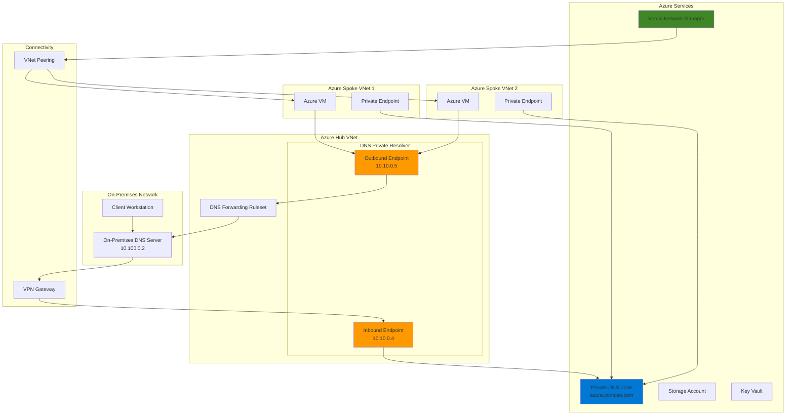

# Hybrid DNS Resolution with Private Resolver and Network Manager

## Problem

Organizations with hybrid cloud architectures face significant challenges in establishing seamless DNS resolution between on-premises environments and Azure private endpoints. Traditional solutions require complex custom DNS infrastructure, manual configuration across multiple virtual networks, and ongoing maintenance of VM-based DNS resolvers. This creates operational overhead, increases security risks, and limits the scalability of enterprise networking solutions.

## Solution

Deploy Azure DNS Private Resolver to enable bidirectional DNS resolution between on-premises and Azure environments while leveraging Azure Virtual Network Manager to orchestrate connectivity configurations at scale. This solution provides a fully managed, highly available DNS service that integrates with existing infrastructure and eliminates the need for custom DNS resolvers, while ensuring consistent network policies across multiple subscriptions and regions.

## Architecture Diagram



## Prerequisites

1. Azure subscription with appropriate permissions to create DNS Private Resolver, Virtual Network Manager, and networking resources
2. Azure CLI v2.50.0 or later installed and configured (or Azure Cloud Shell)
3. On-premises network connectivity to Azure via VPN Gateway or ExpressRoute
4. Basic understanding of DNS concepts, Azure networking, and hybrid cloud architectures
5. Estimated cost: $50-100/month for DNS Private Resolver, VNet Manager, and supporting infrastructure

> **Note**: This recipe assumes you have an existing on-premises DNS server and network connectivity to Azure. If you don't have these prerequisites, you can simulate the on-premises environment using an Azure VM with DNS server role installed.

## Preparation

```bash
# Set environment variables for Azure resources
export RESOURCE_GROUP="rg-hybrid-dns-${RANDOM_SUFFIX}"
export LOCATION="eastus"
export SUBSCRIPTION_ID=$(az account show --query id --output tsv)

# Generate unique suffix for resource names
RANDOM_SUFFIX=$(openssl rand -hex 3)

# Set resource names with consistent naming convention
export HUB_VNET_NAME="vnet-hub-${RANDOM_SUFFIX}"
export SPOKE1_VNET_NAME="vnet-spoke1-${RANDOM_SUFFIX}"
export SPOKE2_VNET_NAME="vnet-spoke2-${RANDOM_SUFFIX}"
export DNS_RESOLVER_NAME="dns-resolver-${RANDOM_SUFFIX}"
export NETWORK_MANAGER_NAME="avnm-${RANDOM_SUFFIX}"
export PRIVATE_ZONE_NAME="azure.contoso.com"
export STORAGE_ACCOUNT_NAME="st${RANDOM_SUFFIX}"

# Create resource group
az group create \
    --name ${RESOURCE_GROUP} \
    --location ${LOCATION} \
    --tags purpose=hybrid-dns environment=demo

echo "✅ Resource group created: ${RESOURCE_GROUP}"

# Create hub virtual network with DNS resolver subnets
az network vnet create \
    --resource-group ${RESOURCE_GROUP} \
    --name ${HUB_VNET_NAME} \
    --address-prefix 10.10.0.0/16 \
    --subnet-name dns-inbound-subnet \
    --subnet-prefix 10.10.0.0/24 \
    --location ${LOCATION}

# Create outbound subnet for DNS resolver
az network vnet subnet create \
    --resource-group ${RESOURCE_GROUP} \
    --vnet-name ${HUB_VNET_NAME} \
    --name dns-outbound-subnet \
    --address-prefix 10.10.1.0/24

echo "✅ Hub virtual network created with DNS resolver subnets"
```

## Steps

1. **Create Azure Virtual Network Manager for Centralized Connectivity**:

   Azure Virtual Network Manager provides centralized management of virtual network connectivity across subscriptions and regions. This managed service eliminates the complexity of manually configuring peering relationships and enables consistent network policies at scale. By creating a network manager with connectivity configuration capabilities, you establish the foundation for automated network topology management that supports hybrid DNS resolution scenarios.

   ```bash
   # Create Azure Virtual Network Manager
   az network manager create \
       --name ${NETWORK_MANAGER_NAME} \
       --resource-group ${RESOURCE_GROUP} \
       --location ${LOCATION} \
       --description "Centralized network management for hybrid DNS" \
       --network-manager-scopes subscriptions=${SUBSCRIPTION_ID}

   echo "✅ Azure Virtual Network Manager created: ${NETWORK_MANAGER_NAME}"

   # Create spoke virtual networks
   az network vnet create \
       --resource-group ${RESOURCE_GROUP} \
       --name ${SPOKE1_VNET_NAME} \
       --address-prefix 10.20.0.0/16 \
       --subnet-name default \
       --subnet-prefix 10.20.0.0/24 \
       --location ${LOCATION}

   az network vnet create \
       --resource-group ${RESOURCE_GROUP} \
       --name ${SPOKE2_VNET_NAME} \
       --address-prefix 10.30.0.0/16 \
       --subnet-name default \
       --subnet-prefix 10.30.0.0/24 \
       --location ${LOCATION}

   echo "✅ Spoke virtual networks created for connectivity testing"
   ```

   The Virtual Network Manager now provides centralized control over network connectivity, enabling you to define and deploy consistent networking policies across your hybrid environment. This foundation supports the DNS Private Resolver by ensuring reliable network paths between on-premises and Azure resources.

2. **Create Private DNS Zone for Azure Resources**:

   Azure Private DNS zones provide authoritative DNS resolution for Azure resources within virtual networks. This zone will contain DNS records for private endpoints and Azure services that need to be resolved from on-premises environments. The private zone integrates seamlessly with Azure DNS Private Resolver to enable hybrid DNS resolution without exposing internal DNS records to the public internet.

   ```bash
   # Create private DNS zone
   az network private-dns zone create \
       --resource-group ${RESOURCE_GROUP} \
       --name ${PRIVATE_ZONE_NAME}

   # Create virtual network links to enable DNS resolution
   az network private-dns link vnet create \
       --resource-group ${RESOURCE_GROUP} \
       --zone-name ${PRIVATE_ZONE_NAME} \
       --name hub-vnet-link \
       --virtual-network ${HUB_VNET_NAME} \
       --registration-enabled false

   az network private-dns link vnet create \
       --resource-group ${RESOURCE_GROUP} \
       --zone-name ${PRIVATE_ZONE_NAME} \
       --name spoke1-vnet-link \
       --virtual-network ${SPOKE1_VNET_NAME} \
       --registration-enabled false

   az network private-dns link vnet create \
       --resource-group ${RESOURCE_GROUP} \
       --zone-name ${PRIVATE_ZONE_NAME} \
       --name spoke2-vnet-link \
       --virtual-network ${SPOKE2_VNET_NAME} \
       --registration-enabled false

   echo "✅ Private DNS zone created and linked to virtual networks"
   ```

   The private DNS zone is now configured to provide DNS resolution for Azure resources across your virtual networks. This establishes the DNS namespace that will be accessible from on-premises environments through the DNS Private Resolver.

3. **Deploy Azure DNS Private Resolver with Inbound and Outbound Endpoints**:

   Azure DNS Private Resolver is a fully managed service that bridges DNS resolution between Azure and on-premises environments. The inbound endpoint receives DNS queries from on-premises DNS servers, while the outbound endpoint forwards queries from Azure resources to on-premises DNS servers. This bidirectional capability eliminates the need for custom DNS infrastructure and provides enterprise-grade reliability with built-in high availability.

   ```bash
   # Create DNS Private Resolver
   az dns-resolver create \
       --name ${DNS_RESOLVER_NAME} \
       --resource-group ${RESOURCE_GROUP} \
       --location ${LOCATION} \
       --virtual-network ${HUB_VNET_NAME}

   # Create inbound endpoint for on-premises to Azure queries
   az dns-resolver inbound-endpoint create \
       --dns-resolver-name ${DNS_RESOLVER_NAME} \
       --resource-group ${RESOURCE_GROUP} \
       --name inbound-endpoint \
       --location ${LOCATION} \
       --subnet /subscriptions/${SUBSCRIPTION_ID}/resourceGroups/${RESOURCE_GROUP}/providers/Microsoft.Network/virtualNetworks/${HUB_VNET_NAME}/subnets/dns-inbound-subnet

   # Create outbound endpoint for Azure to on-premises queries
   az dns-resolver outbound-endpoint create \
       --dns-resolver-name ${DNS_RESOLVER_NAME} \
       --resource-group ${RESOURCE_GROUP} \
       --name outbound-endpoint \
       --location ${LOCATION} \
       --subnet /subscriptions/${SUBSCRIPTION_ID}/resourceGroups/${RESOURCE_GROUP}/providers/Microsoft.Network/virtualNetworks/${HUB_VNET_NAME}/subnets/dns-outbound-subnet

   echo "✅ DNS Private Resolver deployed with inbound and outbound endpoints"
   ```

   The DNS Private Resolver is now operational and ready to handle bidirectional DNS queries. This managed service provides the critical DNS infrastructure component that enables seamless name resolution between your on-premises and Azure environments.

4. **Configure DNS Forwarding Ruleset for On-Premises Resolution**:

   DNS forwarding rulesets define how DNS queries for specific domains are handled by the outbound endpoint. This configuration enables Azure resources to resolve on-premises domain names by forwarding queries to your on-premises DNS servers. The ruleset supports conditional forwarding based on domain names, allowing for granular control over DNS resolution paths.

   ```bash
   # Create DNS forwarding ruleset
   az dns-resolver forwarding-ruleset create \
       --name "onprem-forwarding-ruleset" \
       --resource-group ${RESOURCE_GROUP} \
       --location ${LOCATION} \
       --outbound-endpoints /subscriptions/${SUBSCRIPTION_ID}/resourceGroups/${RESOURCE_GROUP}/providers/Microsoft.Network/dnsResolvers/${DNS_RESOLVER_NAME}/outboundEndpoints/outbound-endpoint

   # Create forwarding rule for on-premises domain
   az dns-resolver forwarding-rule create \
       --name "contoso-com-rule" \
       --resource-group ${RESOURCE_GROUP} \
       --ruleset-name "onprem-forwarding-ruleset" \
       --domain-name "contoso.com" \
       --forwarding-rule-state "Enabled" \
       --target-dns-servers '[{"ipAddress":"10.100.0.2","port":53}]'

   # Link the ruleset to virtual networks
   az dns-resolver forwarding-ruleset virtual-network-link create \
       --name "hub-vnet-link" \
       --resource-group ${RESOURCE_GROUP} \
       --ruleset-name "onprem-forwarding-ruleset" \
       --virtual-network ${HUB_VNET_NAME}

   az dns-resolver forwarding-ruleset virtual-network-link create \
       --name "spoke1-vnet-link" \
       --resource-group ${RESOURCE_GROUP} \
       --ruleset-name "onprem-forwarding-ruleset" \
       --virtual-network ${SPOKE1_VNET_NAME}

   echo "✅ DNS forwarding ruleset configured for on-premises resolution"
   ```

   The forwarding ruleset now enables Azure resources to resolve on-premises domain names by routing DNS queries through the DNS Private Resolver to your on-premises DNS infrastructure. This completes the Azure-to-on-premises DNS resolution path.

5. **Create Network Groups and Connectivity Configuration**:

   Network groups in Azure Virtual Network Manager provide logical containers for organizing virtual networks based on business requirements. Connectivity configurations define how networks within groups communicate with each other. By creating a hub-and-spoke topology, you establish efficient network paths that support DNS resolution while maintaining security boundaries and optimizing network performance.

   ```bash
   # Create network group for hub-spoke topology
   az network manager group create \
       --name "hub-spoke-group" \
       --resource-group ${RESOURCE_GROUP} \
       --network-manager-name ${NETWORK_MANAGER_NAME} \
       --description "Network group for hub-spoke DNS topology"

   # Add virtual networks to the network group
   az network manager group static-member create \
       --resource-group ${RESOURCE_GROUP} \
       --network-manager-name ${NETWORK_MANAGER_NAME} \
       --network-group-name "hub-spoke-group" \
       --name "hub-member" \
       --resource-id /subscriptions/${SUBSCRIPTION_ID}/resourceGroups/${RESOURCE_GROUP}/providers/Microsoft.Network/virtualNetworks/${HUB_VNET_NAME}

   az network manager group static-member create \
       --resource-group ${RESOURCE_GROUP} \
       --network-manager-name ${NETWORK_MANAGER_NAME} \
       --network-group-name "hub-spoke-group" \
       --name "spoke1-member" \
       --resource-id /subscriptions/${SUBSCRIPTION_ID}/resourceGroups/${RESOURCE_GROUP}/providers/Microsoft.Network/virtualNetworks/${SPOKE1_VNET_NAME}

   az network manager group static-member create \
       --resource-group ${RESOURCE_GROUP} \
       --network-manager-name ${NETWORK_MANAGER_NAME} \
       --network-group-name "hub-spoke-group" \
       --name "spoke2-member" \
       --resource-id /subscriptions/${SUBSCRIPTION_ID}/resourceGroups/${RESOURCE_GROUP}/providers/Microsoft.Network/virtualNetworks/${SPOKE2_VNET_NAME}

   echo "✅ Network group created and populated with virtual networks"
   ```

   The network group now contains all virtual networks that participate in the hybrid DNS solution, providing a centralized way to manage connectivity and apply consistent policies across your network infrastructure.

6. **Create and Deploy Connectivity Configuration**:

   Connectivity configurations in Azure Virtual Network Manager define network topologies and communication patterns between virtual networks. The hub-and-spoke configuration ensures that all spoke networks can communicate with the hub (where DNS Private Resolver is deployed) while providing direct connectivity between spokes when needed. This topology optimizes DNS query paths and reduces latency.

   ```bash
   # Create connectivity configuration
   az network manager connect-config create \
       --name "hub-spoke-connectivity" \
       --resource-group ${RESOURCE_GROUP} \
       --network-manager-name ${NETWORK_MANAGER_NAME} \
       --description "Hub-spoke connectivity for DNS resolution" \
       --applies-to-groups '[{"networkGroupId":"/subscriptions/'${SUBSCRIPTION_ID}'/resourceGroups/'${RESOURCE_GROUP}'/providers/Microsoft.Network/networkManagers/'${NETWORK_MANAGER_NAME}'/networkGroups/hub-spoke-group","useHubGateway":"False","isGlobal":"False","groupConnectivity":"None"}]' \
       --connectivity-topology "HubAndSpoke" \
       --hub-resource-id /subscriptions/${SUBSCRIPTION_ID}/resourceGroups/${RESOURCE_GROUP}/providers/Microsoft.Network/virtualNetworks/${HUB_VNET_NAME}

   # Deploy the connectivity configuration
   az network manager post-commit \
       --resource-group ${RESOURCE_GROUP} \
       --network-manager-name ${NETWORK_MANAGER_NAME} \
       --commit-type "Connectivity" \
       --configuration-ids /subscriptions/${SUBSCRIPTION_ID}/resourceGroups/${RESOURCE_GROUP}/providers/Microsoft.Network/networkManagers/${NETWORK_MANAGER_NAME}/connectivityConfigurations/hub-spoke-connectivity \
       --target-locations ${LOCATION}

   echo "✅ Connectivity configuration deployed successfully"
   ```

   The hub-and-spoke connectivity configuration is now active, establishing the network topology that enables efficient DNS resolution paths between all virtual networks and the DNS Private Resolver in the hub.

7. **Create Azure Resources with Private Endpoints**:

   Private endpoints provide secure, private connectivity to Azure services by creating network interfaces within your virtual network. These endpoints automatically register DNS records in the private DNS zone, enabling name resolution from both Azure and on-premises environments. This demonstrates the practical application of hybrid DNS resolution for accessing Azure services securely.

   ```bash
   # Create storage account for private endpoint demonstration
   az storage account create \
       --name ${STORAGE_ACCOUNT_NAME} \
       --resource-group ${RESOURCE_GROUP} \
       --location ${LOCATION} \
       --sku Standard_LRS \
       --kind StorageV2 \
       --public-network-access Disabled

   # Create private endpoint for storage account
   az network private-endpoint create \
       --name "pe-storage-${RANDOM_SUFFIX}" \
       --resource-group ${RESOURCE_GROUP} \
       --vnet-name ${SPOKE1_VNET_NAME} \
       --subnet default \
       --connection-name "storage-connection" \
       --private-connection-resource-id /subscriptions/${SUBSCRIPTION_ID}/resourceGroups/${RESOURCE_GROUP}/providers/Microsoft.Storage/storageAccounts/${STORAGE_ACCOUNT_NAME} \
       --group-id blob

   # Create private DNS zone group for automatic registration
   az network private-endpoint dns-zone-group create \
       --resource-group ${RESOURCE_GROUP} \
       --endpoint-name "pe-storage-${RANDOM_SUFFIX}" \
       --name "storage-zone-group" \
       --private-dns-zone /subscriptions/${SUBSCRIPTION_ID}/resourceGroups/${RESOURCE_GROUP}/providers/Microsoft.Network/privateDnsZones/privatelink.blob.core.windows.net \
       --zone-name privatelink.blob.core.windows.net

   echo "✅ Azure resources with private endpoints created"
   ```

   The private endpoint is now configured and registered in the private DNS zone, enabling secure access to the storage account from both Azure and on-premises environments through the hybrid DNS solution.

8. **Add Test DNS Records**:

   Test DNS records validate the hybrid DNS resolution functionality by providing known hostnames that can be resolved from both Azure and on-premises environments. These records demonstrate the bidirectional nature of the DNS solution and provide targets for connectivity testing.

   ```bash
   # Add test A record to private DNS zone
   az network private-dns record-set a create \
       --resource-group ${RESOURCE_GROUP} \
       --zone-name ${PRIVATE_ZONE_NAME} \
       --name test-vm

   az network private-dns record-set a add-record \
       --resource-group ${RESOURCE_GROUP} \
       --zone-name ${PRIVATE_ZONE_NAME} \
       --record-set-name test-vm \
       --ipv4-address 10.20.0.100

   # Add additional test record
   az network private-dns record-set a create \
       --resource-group ${RESOURCE_GROUP} \
       --zone-name ${PRIVATE_ZONE_NAME} \
       --name app-server

   az network private-dns record-set a add-record \
       --resource-group ${RESOURCE_GROUP} \
       --zone-name ${PRIVATE_ZONE_NAME} \
       --record-set-name app-server \
       --ipv4-address 10.30.0.50

   echo "✅ Test DNS records added to private DNS zone"
   ```

   The test DNS records are now available for resolution through the hybrid DNS infrastructure, providing concrete targets for validating the end-to-end DNS resolution functionality.

## Validation & Testing

1. **Verify DNS Private Resolver deployment status**:

   ```bash
   # Check DNS Private Resolver status
   az dns-resolver show \
       --name ${DNS_RESOLVER_NAME} \
       --resource-group ${RESOURCE_GROUP} \
       --query "provisioningState" \
       --output table
   ```

   Expected output: `Succeeded`

2. **Verify inbound endpoint configuration**:

   ```bash
   # Get inbound endpoint IP address
   INBOUND_IP=$(az dns-resolver inbound-endpoint show \
       --dns-resolver-name ${DNS_RESOLVER_NAME} \
       --resource-group ${RESOURCE_GROUP} \
       --name inbound-endpoint \
       --query "ipConfigurations[0].privateIpAddress" \
       --output tsv)

   echo "Inbound endpoint IP: ${INBOUND_IP}"
   ```

   Expected output: IP address from the inbound subnet range (10.10.0.x)

3. **Test DNS resolution from Azure resources**:

   ```bash
   # Create test VM in spoke network
   az vm create \
       --resource-group ${RESOURCE_GROUP} \
       --name test-vm \
       --vnet-name ${SPOKE1_VNET_NAME} \
       --subnet default \
       --image Ubuntu2204 \
       --admin-username azureuser \
       --generate-ssh-keys \
       --size Standard_B1s

   # Test DNS resolution (after VM is created)
   az vm run-command invoke \
       --resource-group ${RESOURCE_GROUP} \
       --name test-vm \
       --command-id RunShellScript \
       --scripts "nslookup test-vm.${PRIVATE_ZONE_NAME}"
   ```

   Expected output: DNS resolution success with IP address 10.20.0.100

4. **Verify network connectivity configuration**:

   ```bash
   # Check Virtual Network Manager deployment status
   az network manager list-active-connectivity-config \
       --resource-group ${RESOURCE_GROUP} \
       --network-manager-name ${NETWORK_MANAGER_NAME} \
       --regions ${LOCATION}
   ```

   Expected output: Active connectivity configuration with hub-spoke topology

## Cleanup

1. **Remove Virtual Network Manager configurations**:

   ```bash
   # Remove connectivity configuration deployment
   az network manager post-commit \
       --resource-group ${RESOURCE_GROUP} \
       --network-manager-name ${NETWORK_MANAGER_NAME} \
       --commit-type "Connectivity" \
       --configuration-ids /subscriptions/${SUBSCRIPTION_ID}/resourceGroups/${RESOURCE_GROUP}/providers/Microsoft.Network/networkManagers/${NETWORK_MANAGER_NAME}/connectivityConfigurations/hub-spoke-connectivity \
       --target-locations ${LOCATION} \
       --is-removal true

   echo "✅ Virtual Network Manager configurations removed"
   ```

2. **Delete DNS Private Resolver components**:

   ```bash
   # Delete DNS forwarding ruleset
   az dns-resolver forwarding-ruleset delete \
       --name "onprem-forwarding-ruleset" \
       --resource-group ${RESOURCE_GROUP} \
       --yes

   # Delete DNS Private Resolver
   az dns-resolver delete \
       --name ${DNS_RESOLVER_NAME} \
       --resource-group ${RESOURCE_GROUP} \
       --yes

   echo "✅ DNS Private Resolver components deleted"
   ```

3. **Remove all Azure resources**:

   ```bash
   # Delete resource group and all contained resources
   az group delete \
       --name ${RESOURCE_GROUP} \
       --yes \
       --no-wait

   echo "✅ Resource group deletion initiated: ${RESOURCE_GROUP}"
   echo "Note: Deletion may take several minutes to complete"

   # Clear environment variables
   unset RESOURCE_GROUP LOCATION SUBSCRIPTION_ID RANDOM_SUFFIX
   unset HUB_VNET_NAME SPOKE1_VNET_NAME SPOKE2_VNET_NAME
   unset DNS_RESOLVER_NAME NETWORK_MANAGER_NAME PRIVATE_ZONE_NAME
   unset STORAGE_ACCOUNT_NAME
   ```

## Discussion

Azure DNS Private Resolver and Virtual Network Manager together provide a comprehensive solution for hybrid DNS resolution that addresses the complexities of modern cloud networking. The DNS Private Resolver eliminates the need for custom DNS infrastructure by providing a fully managed service with built-in high availability and automatic scaling capabilities. Unlike traditional VM-based DNS solutions, the Private Resolver requires zero maintenance, no security patching, and provides cost-effective DNS resolution at scale. For comprehensive guidance on DNS Private Resolver architecture, see the [Azure DNS Private Resolver documentation](https://learn.microsoft.com/en-us/azure/dns/dns-private-resolver-overview).

The integration with Azure Virtual Network Manager enables centralized management of network connectivity across subscriptions and regions, ensuring consistent DNS resolution paths throughout your hybrid environment. Virtual Network Manager's hub-and-spoke connectivity configuration optimizes network traffic patterns while maintaining security boundaries. The service supports both mesh and hub-and-spoke topologies, with the hub-and-spoke approach being particularly effective for DNS resolution scenarios where centralized services need to be accessible from multiple spoke networks. The [Azure Virtual Network Manager documentation](https://learn.microsoft.com/en-us/azure/virtual-network-manager/overview) provides detailed guidance on connectivity configurations and deployment patterns.

From a security perspective, this solution follows zero-trust principles by keeping DNS traffic within private network boundaries and leveraging Azure's native security features. Private endpoints ensure that Azure services are accessible only through private IP addresses, while the DNS Private Resolver maintains the security of DNS queries by eliminating the need for public DNS resolution. The solution integrates seamlessly with Azure Active Directory for authentication and Azure RBAC for authorization, providing enterprise-grade security controls. For security best practices, reference the [Azure networking security documentation](https://learn.microsoft.com/en-us/azure/security/fundamentals/network-best-practices).

Cost optimization is achieved through the consumption-based pricing model of Azure DNS Private Resolver, which charges only for DNS queries processed, and Virtual Network Manager's virtual network-based pricing. This approach provides significant cost savings compared to maintaining multiple VM-based DNS servers across regions. The solution also reduces operational costs by eliminating the need for manual DNS configuration and providing DevOps-friendly ARM templates for automation. For detailed cost optimization strategies, review the [Azure cost management documentation](https://learn.microsoft.com/en-us/azure/cost-management-billing/cost-management-billing-overview).

> **Tip**: Use Azure Monitor and diagnostic settings to track DNS query patterns and optimize forwarding rules based on actual usage. The [Azure DNS Private Resolver monitoring guide](https://learn.microsoft.com/en-us/azure/dns/private-resolver-reliability) provides comprehensive guidance on setting up monitoring and alerting for production deployments.

## Challenge

Extend this hybrid DNS solution by implementing these advanced configurations:

1. **Multi-region DNS failover**: Configure DNS Private Resolver instances in multiple Azure regions with health checks and automatic failover capabilities to ensure high availability across geographic locations.

2. **Conditional forwarding with policy-based routing**: Implement Azure Policy to automatically configure DNS forwarding rules based on resource tags and business requirements, enabling dynamic DNS resolution policies.

3. **Integration with Azure Arc**: Extend the solution to include Azure Arc-enabled servers and Kubernetes clusters, providing unified DNS resolution across cloud, on-premises, and edge environments.

4. **Advanced monitoring and analytics**: Deploy Azure Monitor workbooks and Log Analytics queries to provide detailed insights into DNS query patterns, performance metrics, and security events across the hybrid DNS infrastructure.

5. **Automated disaster recovery**: Implement Azure Site Recovery integration to automatically update DNS records during failover scenarios, ensuring business continuity for DNS-dependent applications.

## Infrastructure Code

*Infrastructure code will be generated after recipe approval.*