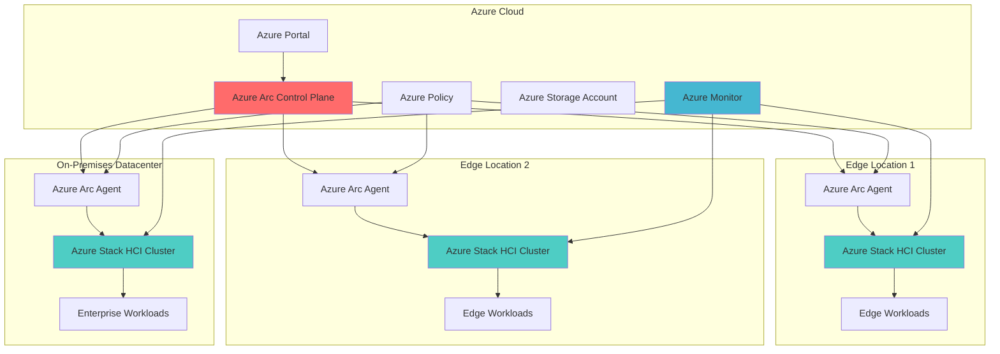

# Hybrid Edge Infrastructure with Stack HCI and Arc

## Problem

Manufacturing companies and distributed organizations face significant challenges managing IT infrastructure across multiple remote locations. Traditional on-premises solutions lack centralized management, consistent governance, and cloud-native capabilities. Edge locations often require local processing power for latency-sensitive applications while maintaining connectivity to cloud services. Organizations struggle with inconsistent management tools, security policies, and monitoring across their distributed infrastructure, leading to increased operational costs and reduced agility.

## Solution

Azure Stack HCI provides hyperconverged infrastructure that combines compute, storage, and networking in a single solution, while Azure Arc extends Azure management capabilities to on-premises and edge environments. This hybrid approach enables organizations to deploy cloud-native applications locally while maintaining centralized governance, monitoring, and security through Azure's unified control plane. The solution provides consistent management experience across all locations while supporting modern workloads like containers and AI at the edge.

## Architecture Diagram



## Prerequisites

1. Azure subscription with appropriate permissions for Azure Stack HCI and Azure Arc
2. Azure CLI v2.35.0 or later installed and configured
3. PowerShell 7.0+ with Azure PowerShell modules installed
4. Azure Stack HCI cluster hardware (minimum 2 nodes) or access to validated hardware
5. Windows Admin Center for initial cluster configuration
6. Network connectivity between edge locations and Azure (internet access required)
7. Active Directory Domain Services for cluster authentication
8. Estimated cost: $500-2000/month depending on cluster size and Azure services used

> **Note**: Azure Stack HCI requires validated hardware from Microsoft partners. Review the [Azure Stack HCI Catalog](https://aka.ms/AzureStackHCICatalog) for compatible hardware solutions before proceeding.

## Preparation

```bash
# Set environment variables for Azure resources
export RESOURCE_GROUP="rg-edge-infrastructure-${RANDOM_SUFFIX}"
export LOCATION="eastus"
export SUBSCRIPTION_ID=$(az account show --query id --output tsv)
export TENANT_ID=$(az account show --query tenantId --output tsv)

# Generate unique suffix for resource names
RANDOM_SUFFIX=$(openssl rand -hex 3)
export CLUSTER_NAME="hci-cluster-${RANDOM_SUFFIX}"
export ARC_RESOURCE_NAME="arc-hci-${RANDOM_SUFFIX}"
export STORAGE_ACCOUNT_NAME="edgestorage${RANDOM_SUFFIX}"
export LOG_ANALYTICS_WORKSPACE="la-edge-${RANDOM_SUFFIX}"
export SYNC_SERVICE_NAME="sync-service-${RANDOM_SUFFIX}"

# Create resource group for edge infrastructure
az group create \
    --name ${RESOURCE_GROUP} \
    --location ${LOCATION} \
    --tags purpose=edge-computing environment=production

# Create Log Analytics workspace for monitoring
az monitor log-analytics workspace create \
    --resource-group ${RESOURCE_GROUP} \
    --workspace-name ${LOG_ANALYTICS_WORKSPACE} \
    --location ${LOCATION} \
    --sku PerGB2018

# Create storage account for edge data synchronization
az storage account create \
    --name ${STORAGE_ACCOUNT_NAME} \
    --resource-group ${RESOURCE_GROUP} \
    --location ${LOCATION} \
    --sku Standard_LRS \
    --kind StorageV2 \
    --hierarchical-namespace true

# Install Azure CLI extensions for Stack HCI and Arc
az extension add --name stack-hci
az extension add --name connectedmachine
az extension add --name k8s-extension
az extension add --name storagesync

echo "✅ Environment prepared successfully"
```

## Steps

1. **Register Azure Stack HCI Resource Provider**:

   Azure Stack HCI requires specific resource providers to be registered in your subscription before deployment. The Microsoft.AzureStackHCI provider enables the creation and management of HCI clusters through Azure Resource Manager. This registration establishes the connection between your Azure subscription and the HCI service, enabling billing, monitoring, and management capabilities.

   ```bash
   # Register required resource providers
   az provider register --namespace Microsoft.AzureStackHCI
   az provider register --namespace Microsoft.HybridCompute
   az provider register --namespace Microsoft.GuestConfiguration
   az provider register --namespace Microsoft.HybridConnectivity
   
   # Verify registration status
   az provider show --namespace Microsoft.AzureStackHCI \
       --query "registrationState" --output tsv
   
   echo "✅ Resource providers registered successfully"
   ```

   The resource providers are now active and ready to support Azure Stack HCI operations. This foundation enables the Azure control plane to manage your on-premises infrastructure seamlessly.

2. **Create Azure Stack HCI Cluster Resource**:

   The Azure Stack HCI cluster resource acts as the Azure representation of your on-premises hyperconverged infrastructure. Creating this resource in Azure establishes the management connection and enables Azure services to interact with your physical cluster. This step creates the cloud-side identity that your physical cluster will connect to during the registration process.

   ```bash
   # Create Azure Active Directory application for HCI cluster
   HCI_APP_ID=$(az ad app create \
       --display-name "HCI-Cluster-${RANDOM_SUFFIX}" \
       --query appId --output tsv)
   
   # Create Azure Stack HCI cluster resource
   az stack-hci cluster create \
       --resource-group ${RESOURCE_GROUP} \
       --cluster-name ${CLUSTER_NAME} \
       --location ${LOCATION} \
       --aad-client-id ${HCI_APP_ID} \
       --aad-tenant-id ${TENANT_ID}
   
   # Get cluster resource details
   CLUSTER_RESOURCE_ID=$(az stack-hci cluster show \
       --resource-group ${RESOURCE_GROUP} \
       --cluster-name ${CLUSTER_NAME} \
       --query id --output tsv)
   
   echo "✅ Azure Stack HCI cluster resource created"
   echo "Cluster Resource ID: ${CLUSTER_RESOURCE_ID}"
   ```

   The cluster resource is now created in Azure and ready for physical cluster registration. This establishes the foundation for hybrid cloud management and enables Azure services to monitor and manage your edge infrastructure.

3. **Configure Azure Arc for Servers**:

   Azure Arc-enabled servers extend Azure management capabilities to your on-premises and edge servers. This configuration creates the service principal and assigns necessary permissions for Arc agents to connect servers to Azure. Arc provides unified governance, monitoring, and security across all connected machines regardless of their location.

   ```bash
   # Create service principal for Arc agent
   ARC_SP_ID=$(az ad sp create-for-rbac \
       --name "arc-servers-${RANDOM_SUFFIX}" \
       --role "Azure Connected Machine Onboarding" \
       --scope "/subscriptions/${SUBSCRIPTION_ID}/resourceGroups/${RESOURCE_GROUP}" \
       --query appId --output tsv)
   
   # Get service principal secret
   ARC_SP_SECRET=$(az ad sp credential reset \
       --id ${ARC_SP_ID} \
       --query password --output tsv)
   
   echo "✅ Azure Arc configuration completed"
   echo "Service Principal ID: ${ARC_SP_ID}"
   ```

   Azure Arc is now configured to manage your edge servers with proper authentication and authorization. This enables centralized management of your distributed infrastructure through Azure's unified control plane.

4. **Deploy Azure Monitor for Edge Infrastructure**:

   Azure Monitor provides comprehensive monitoring and observability for your edge infrastructure. Creating a monitoring solution enables real-time insights into performance, health, and capacity across all edge locations. This configuration includes custom metrics, alerts, and dashboards specifically designed for edge computing scenarios.

   ```bash
   # Get Log Analytics workspace ID
   WORKSPACE_ID=$(az monitor log-analytics workspace show \
       --resource-group ${RESOURCE_GROUP} \
       --workspace-name ${LOG_ANALYTICS_WORKSPACE} \
       --query customerId --output tsv)
   
   # Get workspace resource ID
   WORKSPACE_RESOURCE_ID=$(az monitor log-analytics workspace show \
       --resource-group ${RESOURCE_GROUP} \
       --workspace-name ${LOG_ANALYTICS_WORKSPACE} \
       --query id --output tsv)
   
   # Create data collection rule for HCI monitoring
   az monitor data-collection rule create \
       --resource-group ${RESOURCE_GROUP} \
       --name "dcr-hci-${RANDOM_SUFFIX}" \
       --location ${LOCATION} \
       --data-flows '[{
           "streams": ["Microsoft-Event"],
           "destinations": ["'${LOG_ANALYTICS_WORKSPACE}'"]
       }]' \
       --destinations '{
           "logAnalytics": [{
               "workspaceResourceId": "'${WORKSPACE_RESOURCE_ID}'",
               "name": "'${LOG_ANALYTICS_WORKSPACE}'"
           }]
       }'
   
   echo "✅ Azure Monitor configured for edge infrastructure"
   ```

   Azure Monitor is now collecting telemetry from your edge infrastructure, providing centralized observability across all locations. This enables proactive monitoring and quick issue resolution for your distributed environment.

5. **Configure Azure Policy for Edge Governance**:

   Azure Policy enables consistent governance and compliance across your edge infrastructure. Creating policy assignments ensures that all edge resources comply with organizational standards for security, configuration, and operations. This automated governance reduces management overhead while maintaining security and compliance at scale.

   ```bash
   # Create custom policy for HCI compliance
   az policy definition create \
       --name "HCI-Security-Baseline" \
       --display-name "Azure Stack HCI Security Baseline" \
       --description "Ensures HCI clusters meet security requirements" \
       --rules '{
           "if": {
               "allOf": [{
                   "field": "type",
                   "equals": "Microsoft.AzureStackHCI/clusters"
               }]
           },
           "then": {
               "effect": "audit"
           }
       }' \
       --params '{
           "effect": {
               "type": "String",
               "defaultValue": "Audit"
           }
       }'
   
   # Assign policy to resource group
   az policy assignment create \
       --name "hci-security-assignment" \
       --display-name "HCI Security Compliance" \
       --scope "/subscriptions/${SUBSCRIPTION_ID}/resourceGroups/${RESOURCE_GROUP}" \
       --policy "HCI-Security-Baseline"
   
   # Enable guest configuration for Arc machines
   az policy assignment create \
       --name "arc-guest-config" \
       --display-name "Arc Guest Configuration" \
       --scope "/subscriptions/${SUBSCRIPTION_ID}/resourceGroups/${RESOURCE_GROUP}" \
       --policy "/providers/Microsoft.Authorization/policySetDefinitions/75714362-cae7-409e-9b99-a8e5075b7fad"
   
   echo "✅ Azure Policy configured for edge governance"
   ```

   Azure Policy is now enforcing governance standards across your edge infrastructure, ensuring consistent security and compliance. This automated approach reduces manual oversight while maintaining organizational standards.

6. **Set Up Edge Storage Synchronization**:

   Azure Storage provides scalable cloud storage that synchronizes with your edge infrastructure. Configuring storage synchronization enables seamless data movement between edge locations and the cloud, supporting scenarios like backup, disaster recovery, and data analytics. This setup includes Azure File Sync for efficient data tiering and synchronization.

   ```bash
   # Create file share for edge synchronization
   az storage share create \
       --name "edge-sync" \
       --account-name ${STORAGE_ACCOUNT_NAME} \
       --quota 1024
   
   # Create storage sync service
   az storagesync create \
       --resource-group ${RESOURCE_GROUP} \
       --name ${SYNC_SERVICE_NAME} \
       --location ${LOCATION}
   
   # Create sync group for distributed file synchronization
   az storagesync sync-group create \
       --resource-group ${RESOURCE_GROUP} \
       --storage-sync-service ${SYNC_SERVICE_NAME} \
       --name "edge-sync-group"
   
   # Get storage account connection string
   STORAGE_CONNECTION=$(az storage account show-connection-string \
       --name ${STORAGE_ACCOUNT_NAME} \
       --resource-group ${RESOURCE_GROUP} \
       --query connectionString --output tsv)
   
   echo "✅ Edge storage synchronization configured"
   echo "Storage Account: ${STORAGE_ACCOUNT_NAME}"
   ```

   Storage synchronization is now active, enabling efficient data movement between your edge locations and Azure. This provides the foundation for backup, disaster recovery, and analytics scenarios across your distributed infrastructure.

7. **Configure Azure Kubernetes Service for Edge Workloads**:

   Azure Kubernetes Service (AKS) enabled by Azure Arc brings managed Kubernetes capabilities to your edge infrastructure. This configuration deploys a Kubernetes cluster on your Azure Stack HCI infrastructure while maintaining cloud-native management through Azure Arc. This enables modern containerized applications to run at the edge with consistent management and governance.

   ```bash
   # Note: AKS Arc requires additional infrastructure components
   # For demonstration purposes, create AKS Arc configuration
   AKS_CLUSTER_NAME="aks-edge-${RANDOM_SUFFIX}"
   
   # Create configuration for AKS Arc cluster
   # This step would typically require existing custom location and logical network
   echo "AKS Cluster Name: ${AKS_CLUSTER_NAME}"
   echo "Note: AKS Arc deployment requires custom location and logical network"
   echo "These are typically created during Azure Stack HCI deployment"
   
   # Example command structure (requires actual custom location and vnet IDs):
   # az aksarc create \
   #     --resource-group ${RESOURCE_GROUP} \
   #     --name ${AKS_CLUSTER_NAME} \
   #     --custom-location /subscriptions/${SUBSCRIPTION_ID}/resourceGroups/${RESOURCE_GROUP}/providers/Microsoft.ExtendedLocation/customLocations/cl-${RANDOM_SUFFIX} \
   #     --vnet-ids /subscriptions/${SUBSCRIPTION_ID}/resourceGroups/${RESOURCE_GROUP}/providers/Microsoft.AzureStackHCI/virtualNetworks/vnet-${RANDOM_SUFFIX} \
   #     --kubernetes-version "1.28.5" \
   #     --control-plane-count 1 \
   #     --node-count 2 \
   #     --generate-ssh-keys \
   #     --location ${LOCATION}
   
   echo "✅ AKS Arc configuration prepared"
   ```

   AKS configuration is prepared for deployment on your edge infrastructure with full Azure Arc integration. This enables deployment of modern containerized applications at the edge while maintaining cloud-native management capabilities.

8. **Deploy Edge Application Workloads**:

   Edge applications require local processing capabilities while maintaining connectivity to cloud services. This step creates sample configurations for workloads that demonstrate common edge computing patterns including data processing, machine learning inference, and IoT data handling. These configurations showcase how Azure services can extend to edge locations.

   ```bash
   # Create sample workload configuration
   cat > edge-workload-config.yaml <<EOF
   apiVersion: v1
   kind: ConfigMap
   metadata:
     name: edge-config
   data:
     app.properties: |
       # Edge Application Configuration
       edge.location=${LOCATION}
       azure.subscription=${SUBSCRIPTION_ID}
       monitoring.workspace=${WORKSPACE_ID}
       storage.account=${STORAGE_ACCOUNT_NAME}
   EOF
   
   # Create monitoring configuration
   cat > monitoring-config.yaml <<EOF
   apiVersion: v1
   kind: ConfigMap
   metadata:
     name: monitoring-config
   data:
     config.yaml: |
       monitoring:
         enabled: true
         endpoint: "https://eastus.monitoring.azure.com"
         workspace_id: "${WORKSPACE_ID}"
         resource_group: "${RESOURCE_GROUP}"
   EOF
   
   echo "✅ Edge application configurations created"
   echo "Configuration files: edge-workload-config.yaml, monitoring-config.yaml"
   ```

   Edge application configurations are now created and ready for deployment on your distributed infrastructure. These configurations demonstrate how modern applications can operate at the edge while maintaining connectivity to Azure services.

## Validation & Testing

1. **Verify Azure Stack HCI Cluster Registration**:

   ```bash
   # Check cluster registration status
   az stack-hci cluster show \
       --resource-group ${RESOURCE_GROUP} \
       --cluster-name ${CLUSTER_NAME} \
       --query "status" --output tsv
   
   # Verify cluster health
   az stack-hci cluster list \
       --resource-group ${RESOURCE_GROUP} \
       --output table
   ```

   Expected output: Status should show "Connected" and cluster should be listed with healthy state.

2. **Test Azure Arc Connectivity**:

   ```bash
   # Check service principal exists
   az ad sp show --id ${ARC_SP_ID} \
       --query "displayName" --output tsv
   
   # Verify Arc resource provider registration
   az provider show --namespace Microsoft.HybridCompute \
       --query "registrationState" --output tsv
   ```

   Expected output: Service principal should be listed and provider should show "Registered" status.

3. **Validate Monitoring Data Flow**:

   ```bash
   # Query Log Analytics workspace
   az monitor log-analytics workspace show \
       --resource-group ${RESOURCE_GROUP} \
       --workspace-name ${LOG_ANALYTICS_WORKSPACE} \
       --query "provisioningState" --output tsv
   
   # Check data collection rule
   az monitor data-collection rule show \
       --resource-group ${RESOURCE_GROUP} \
       --name "dcr-hci-${RANDOM_SUFFIX}" \
       --query "provisioningState" --output tsv
   ```

   Expected output: Both workspace and data collection rule should show "Succeeded" provisioning state.

4. **Test Policy Assignment**:

   ```bash
   # Check policy assignments
   az policy assignment list \
       --scope "/subscriptions/${SUBSCRIPTION_ID}/resourceGroups/${RESOURCE_GROUP}" \
       --output table
   
   # Verify custom policy definition
   az policy definition show \
       --name "HCI-Security-Baseline" \
       --query "displayName" --output tsv
   ```

   Expected output: Policy assignments should be listed and custom policy should be available.

5. **Validate Storage Synchronization**:

   ```bash
   # Check storage sync service
   az storagesync show \
       --resource-group ${RESOURCE_GROUP} \
       --name ${SYNC_SERVICE_NAME} \
       --query "provisioningState" --output tsv
   
   # Test file share access
   az storage share show \
       --name "edge-sync" \
       --account-name ${STORAGE_ACCOUNT_NAME} \
       --query "properties.shareQuota" --output tsv
   ```

   Expected output: Sync service should show "Succeeded" state and file share should display quota of 1024 GB.

## Cleanup

1. **Remove Storage Sync Resources**:

   ```bash
   # Delete sync group
   az storagesync sync-group delete \
       --resource-group ${RESOURCE_GROUP} \
       --storage-sync-service ${SYNC_SERVICE_NAME} \
       --name "edge-sync-group" \
       --yes
   
   # Delete storage sync service
   az storagesync delete \
       --resource-group ${RESOURCE_GROUP} \
       --name ${SYNC_SERVICE_NAME} \
       --yes
   
   echo "✅ Storage sync resources removed"
   ```

2. **Clean Up Azure Arc Resources**:

   ```bash
   # Delete service principal
   az ad sp delete --id ${ARC_SP_ID}
   
   echo "✅ Azure Arc resources cleaned up"
   ```

3. **Remove Azure Stack HCI Cluster**:

   ```bash
   # Delete HCI cluster resource
   az stack-hci cluster delete \
       --resource-group ${RESOURCE_GROUP} \
       --cluster-name ${CLUSTER_NAME} \
       --yes
   
   # Delete AAD application
   az ad app delete --id ${HCI_APP_ID}
   
   echo "✅ Azure Stack HCI cluster removed"
   ```

4. **Remove Supporting Resources**:

   ```bash
   # Delete policy assignments
   az policy assignment delete \
       --name "hci-security-assignment" \
       --scope "/subscriptions/${SUBSCRIPTION_ID}/resourceGroups/${RESOURCE_GROUP}"
   
   az policy assignment delete \
       --name "arc-guest-config" \
       --scope "/subscriptions/${SUBSCRIPTION_ID}/resourceGroups/${RESOURCE_GROUP}"
   
   # Delete custom policy definition
   az policy definition delete \
       --name "HCI-Security-Baseline"
   
   # Delete storage account
   az storage account delete \
       --name ${STORAGE_ACCOUNT_NAME} \
       --resource-group ${RESOURCE_GROUP} \
       --yes
   
   # Delete Log Analytics workspace
   az monitor log-analytics workspace delete \
       --resource-group ${RESOURCE_GROUP} \
       --workspace-name ${LOG_ANALYTICS_WORKSPACE} \
       --yes
   
   # Delete configuration files
   rm -f edge-workload-config.yaml monitoring-config.yaml
   
   # Delete resource group
   az group delete \
       --name ${RESOURCE_GROUP} \
       --yes \
       --no-wait
   
   echo "✅ All resources cleaned up"
   ```

## Discussion

Azure Stack HCI combined with Azure Arc creates a powerful hybrid cloud platform that extends Azure's management capabilities to edge and on-premises environments. This solution addresses the growing need for distributed computing while maintaining centralized governance and security. The hyperconverged infrastructure approach of Azure Stack HCI provides enterprise-grade virtualization with the simplicity of integrated compute, storage, and networking, making it ideal for edge deployments where IT expertise may be limited. For comprehensive guidance on hybrid cloud architectures, see the [Azure Architecture Center](https://docs.microsoft.com/en-us/azure/architecture/hybrid/).

The integration with Azure Arc enables organizations to apply cloud-native management practices to their distributed infrastructure. This includes policy-based governance, centralized monitoring, and consistent security practices across all locations. Azure Arc's ability to extend Azure services like Azure Monitor, Azure Policy, and Azure Security Center to edge locations provides unprecedented visibility and control over distributed environments. The [Azure Arc documentation](https://docs.microsoft.com/en-us/azure/azure-arc/overview) provides detailed guidance on implementing governance at scale.

From a business perspective, this solution enables organizations to process data closer to where it's generated, reducing latency and bandwidth costs while maintaining cloud connectivity for management and analytics. The ability to run modern containerized applications through AKS at the edge opens new possibilities for AI/ML workloads, IoT data processing, and real-time analytics in distributed environments. Cost optimization is achieved through local processing capabilities and efficient data synchronization, as detailed in the [Azure Stack HCI cost optimization guide](https://docs.microsoft.com/en-us/azure-stack/hci/concepts/plan-volumes).

The solution follows Azure Well-Architected Framework principles by providing reliability through clustering, security through Azure Arc governance, performance through local processing, and cost optimization through efficient resource utilization. The [Azure Well-Architected Framework for hybrid workloads](https://docs.microsoft.com/en-us/azure/architecture/framework/hybrid/hybrid-overview) provides additional guidance on designing resilient edge solutions.

> **Tip**: Use Azure Monitor Workbooks to create custom dashboards that provide unified views of your distributed infrastructure. The [monitoring best practices documentation](https://docs.microsoft.com/en-us/azure/azure-monitor/best-practices) includes specific guidance for hybrid environments and edge monitoring scenarios.

## Challenge

Extend this solution by implementing these enhancements:

1. **Implement Azure Site Recovery for edge disaster recovery** - Configure automated failover between edge locations and Azure using Azure Site Recovery to ensure business continuity for critical workloads.

2. **Deploy Azure AI services at the edge** - Integrate Azure Cognitive Services containers and Azure Machine Learning models for local inference capabilities while maintaining cloud-based training and model management.

3. **Create automated edge deployment pipelines** - Implement GitOps workflows using Azure DevOps and Azure Arc to automate application deployment and infrastructure updates across multiple edge locations.

4. **Establish edge-to-cloud data analytics** - Configure Azure Stream Analytics and Azure Data Factory to process edge data locally while synchronizing insights to Azure for centralized analytics and reporting.

5. **Implement zero-trust network security** - Deploy Azure Firewall and Azure Security Center across edge locations to establish comprehensive security monitoring and threat protection for distributed infrastructure.

## Infrastructure Code

*Infrastructure code will be generated after recipe approval.*