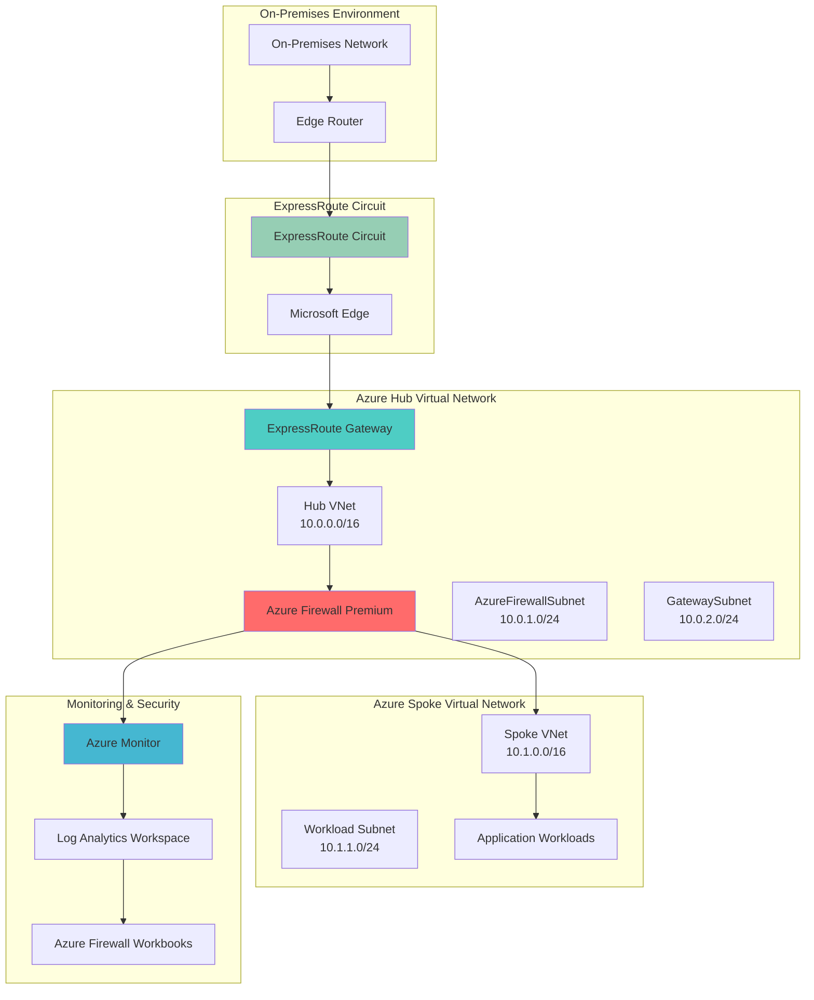

# Hybrid Network Threat Protection with Premium Firewall

## Problem

Enterprise organizations require secure, high-performance connectivity between on-premises networks and Azure cloud resources while maintaining centralized security controls and advanced threat protection. Traditional network security approaches often lack the visibility and advanced threat detection capabilities needed for modern hybrid architectures, leaving organizations vulnerable to sophisticated cyberattacks that can traverse between on-premises and cloud environments.

## Solution

This solution implements a comprehensive hybrid network security architecture using Azure Firewall Premium for advanced threat protection and Azure ExpressRoute for private, high-bandwidth connectivity. Azure Firewall Premium provides intrusion detection and prevention (IDPS), TLS inspection, and URL filtering capabilities, while ExpressRoute ensures predictable performance and enhanced security through private connectivity that bypasses the public internet.

## Architecture Diagram



## Prerequisites

1. Azure subscription with appropriate permissions for creating networking and security resources
2. Azure CLI v2.55.0 or later installed and configured (or Azure Cloud Shell)
3. Existing on-premises network infrastructure with BGP routing capabilities
4. ExpressRoute circuit already provisioned through a connectivity provider
5. Understanding of hybrid networking concepts, BGP routing, and Azure security principles
6. Estimated cost: $800-1200 USD per month for Azure Firewall Premium, ExpressRoute Gateway, and monitoring resources

> **Warning**: Azure Firewall Premium and ExpressRoute Gateway are premium services that incur significant costs. Review the [Azure Firewall pricing](https://azure.microsoft.com/pricing/details/azure-firewall/) and [ExpressRoute pricing](https://azure.microsoft.com/pricing/details/expressroute/) before deploying to production environments.

## Preparation

```bash
# Set environment variables for Azure resources
export RESOURCE_GROUP="rg-hybrid-security-${RANDOM_SUFFIX}"
export LOCATION="eastus"
export SUBSCRIPTION_ID=$(az account show --query id --output tsv)

# Generate unique suffix for resource names
RANDOM_SUFFIX=$(openssl rand -hex 3)

# Network configuration variables
export HUB_VNET_NAME="vnet-hub-${RANDOM_SUFFIX}"
export SPOKE_VNET_NAME="vnet-spoke-${RANDOM_SUFFIX}"
export FIREWALL_NAME="azfw-premium-${RANDOM_SUFFIX}"
export FIREWALL_POLICY_NAME="azfw-policy-${RANDOM_SUFFIX}"
export EXPRESSROUTE_GW_NAME="ergw-${RANDOM_SUFFIX}"
export LOG_ANALYTICS_NAME="laws-firewall-${RANDOM_SUFFIX}"

# Network address spaces
export HUB_VNET_PREFIX="10.0.0.0/16"
export SPOKE_VNET_PREFIX="10.1.0.0/16"
export FIREWALL_SUBNET_PREFIX="10.0.1.0/24"
export GATEWAY_SUBNET_PREFIX="10.0.2.0/24"
export WORKLOAD_SUBNET_PREFIX="10.1.1.0/24"

# Create resource group
az group create \
    --name ${RESOURCE_GROUP} \
    --location ${LOCATION} \
    --tags purpose=hybrid-security environment=production

echo "✅ Resource group created: ${RESOURCE_GROUP}"
```

## Steps

1. **Create Hub Virtual Network with Required Subnets**:

   The hub virtual network serves as the central point for hybrid connectivity and security policy enforcement. This network design follows the hub-and-spoke architecture pattern recommended by the Azure Well-Architected Framework, providing centralized security controls and routing. The AzureFirewallSubnet and GatewaySubnet have specific naming requirements and size constraints that must be followed for proper Azure service integration.

   ```bash
   # Create hub virtual network
   az network vnet create \
       --resource-group ${RESOURCE_GROUP} \
       --name ${HUB_VNET_NAME} \
       --address-prefixes ${HUB_VNET_PREFIX} \
       --location ${LOCATION} \
       --tags purpose=hub-network

   # Create AzureFirewallSubnet (name is required exactly as shown)
   az network vnet subnet create \
       --resource-group ${RESOURCE_GROUP} \
       --vnet-name ${HUB_VNET_NAME} \
       --name AzureFirewallSubnet \
       --address-prefixes ${FIREWALL_SUBNET_PREFIX}

   # Create GatewaySubnet for ExpressRoute Gateway
   az network vnet subnet create \
       --resource-group ${RESOURCE_GROUP} \
       --vnet-name ${HUB_VNET_NAME} \
       --name GatewaySubnet \
       --address-prefixes ${GATEWAY_SUBNET_PREFIX}

   echo "✅ Hub virtual network and subnets created successfully"
   ```

   The hub virtual network is now configured with the specialized subnets required for Azure Firewall Premium and ExpressRoute Gateway deployment. This foundational network infrastructure enables secure, centralized routing and policy enforcement for all hybrid connectivity scenarios.

2. **Create Spoke Virtual Network and Establish Peering**:

   The spoke virtual network hosts application workloads and connects to the hub through virtual network peering. This design pattern provides network isolation while enabling centralized security and routing through the hub. Virtual network peering creates a high-bandwidth, low-latency connection between networks without requiring additional networking hardware.

   ```bash
   # Create spoke virtual network
   az network vnet create \
       --resource-group ${RESOURCE_GROUP} \
       --name ${SPOKE_VNET_NAME} \
       --address-prefixes ${SPOKE_VNET_PREFIX} \
       --location ${LOCATION} \
       --tags purpose=spoke-network

   # Create workload subnet in spoke network
   az network vnet subnet create \
       --resource-group ${RESOURCE_GROUP} \
       --vnet-name ${SPOKE_VNET_NAME} \
       --name WorkloadSubnet \
       --address-prefixes ${WORKLOAD_SUBNET_PREFIX}

   # Create hub-to-spoke peering
   az network vnet peering create \
       --resource-group ${RESOURCE_GROUP} \
       --name hub-to-spoke \
       --vnet-name ${HUB_VNET_NAME} \
       --remote-vnet ${SPOKE_VNET_NAME} \
       --allow-vnet-access true \
       --allow-forwarded-traffic true \
       --allow-gateway-transit true

   # Create spoke-to-hub peering
   az network vnet peering create \
       --resource-group ${RESOURCE_GROUP} \
       --name spoke-to-hub \
       --vnet-name ${SPOKE_VNET_NAME} \
       --remote-vnet ${HUB_VNET_NAME} \
       --allow-vnet-access true \
       --allow-forwarded-traffic true \
       --use-remote-gateways true

   echo "✅ Spoke virtual network and peering established"
   ```

   The spoke network peering is configured with gateway transit options that enable workloads in the spoke to access on-premises resources through the ExpressRoute Gateway in the hub. This architecture provides secure, scalable connectivity while maintaining centralized network security controls.

3. **Create Log Analytics Workspace for Monitoring**:

   Log Analytics provides centralized logging and monitoring capabilities essential for security operations and compliance. This workspace will collect Azure Firewall logs, ExpressRoute metrics, and network security events, enabling comprehensive visibility into hybrid network traffic patterns and security incidents.

   ```bash
   # Create Log Analytics workspace
   az monitor log-analytics workspace create \
       --resource-group ${RESOURCE_GROUP} \
       --workspace-name ${LOG_ANALYTICS_NAME} \
       --location ${LOCATION} \
       --retention-time 30 \
       --sku PerGB2018

   # Get workspace ID for firewall configuration
   WORKSPACE_ID=$(az monitor log-analytics workspace show \
       --resource-group ${RESOURCE_GROUP} \
       --workspace-name ${LOG_ANALYTICS_NAME} \
       --query id --output tsv)

   echo "✅ Log Analytics workspace created: ${LOG_ANALYTICS_NAME}"
   echo "Workspace ID: ${WORKSPACE_ID}"
   ```

   The Log Analytics workspace is configured with a 30-day retention period and Per-GB pricing model, providing cost-effective storage and analysis of network security logs. This centralized logging foundation enables advanced threat detection, compliance reporting, and network performance monitoring across the hybrid environment.

4. **Create Azure Firewall Premium Public IP and Firewall Policy**:

   Azure Firewall Premium requires a static public IP address and a dedicated firewall policy that defines advanced security rules. The firewall policy enables centralized management of security rules across multiple firewall instances and provides the foundation for advanced threat protection features including IDPS, URL filtering, and TLS inspection.

   ```bash
   # Create public IP for Azure Firewall
   az network public-ip create \
       --resource-group ${RESOURCE_GROUP} \
       --name pip-${FIREWALL_NAME} \
       --location ${LOCATION} \
       --allocation-method Static \
       --sku Standard \
       --tier Regional

   # Create firewall policy for Premium features
   az network firewall policy create \
       --resource-group ${RESOURCE_GROUP} \
       --name ${FIREWALL_POLICY_NAME} \
       --location ${LOCATION} \
       --sku Premium \
       --threat-intel-mode Alert \
       --enable-dns-proxy true \
       --enable-explicit-proxy false

   # Configure IDPS (Intrusion Detection and Prevention System)
   az network firewall policy update \
       --resource-group ${RESOURCE_GROUP} \
       --name ${FIREWALL_POLICY_NAME} \
       --idps-mode Alert

   echo "✅ Azure Firewall Premium public IP and policy created"
   ```

   The firewall policy is configured with Premium SKU capabilities including threat intelligence integration and DNS proxy functionality. The IDPS system is set to Alert mode, providing comprehensive threat detection while allowing administrators to tune rules based on their specific security requirements.

5. **Deploy Azure Firewall Premium**:

   Azure Firewall Premium provides enterprise-grade network security with advanced threat protection capabilities. This managed service offers intrusion detection and prevention, URL filtering, TLS inspection, and web categorization features that are essential for securing hybrid network traffic against sophisticated threats.

   ```bash
   # Deploy Azure Firewall Premium
   az network firewall create \
       --resource-group ${RESOURCE_GROUP} \
       --name ${FIREWALL_NAME} \
       --location ${LOCATION} \
       --vnet-name ${HUB_VNET_NAME} \
       --public-ip pip-${FIREWALL_NAME} \
       --firewall-policy ${FIREWALL_POLICY_NAME} \
       --sku AZFW_VNet \
       --tier Premium

   # Get firewall private IP for routing configuration
   FIREWALL_PRIVATE_IP=$(az network firewall show \
       --resource-group ${RESOURCE_GROUP} \
       --name ${FIREWALL_NAME} \
       --query ipConfigurations[0].privateIPAddress \
       --output tsv)

   echo "✅ Azure Firewall Premium deployed successfully"
   echo "Firewall private IP: ${FIREWALL_PRIVATE_IP}"
   ```

   Azure Firewall Premium is now deployed with advanced threat protection capabilities enabled. The firewall's private IP address will be used for routing configuration, ensuring that all traffic flows through the security appliance for inspection and policy enforcement.

6. **Configure Diagnostic Settings for Firewall Monitoring**:

   Diagnostic settings enable Azure Firewall to send structured logs and metrics to Log Analytics for comprehensive monitoring and security analysis. These logs provide detailed information about allowed and blocked traffic, threat detection events, and firewall performance metrics essential for security operations.

   ```bash
   # Enable diagnostic settings for Azure Firewall
   az monitor diagnostic-settings create \
       --resource-group ${RESOURCE_GROUP} \
       --name firewall-diagnostics \
       --resource $(az network firewall show \
           --resource-group ${RESOURCE_GROUP} \
           --name ${FIREWALL_NAME} \
           --query id --output tsv) \
       --workspace ${WORKSPACE_ID} \
       --logs '[
           {
               "category": "AzureFirewallApplicationRule",
               "enabled": true,
               "retentionPolicy": {
                   "enabled": true,
                   "days": 30
               }
           },
           {
               "category": "AzureFirewallNetworkRule",
               "enabled": true,
               "retentionPolicy": {
                   "enabled": true,
                   "days": 30
               }
           },
           {
               "category": "AzureFirewallDnsProxy",
               "enabled": true,
               "retentionPolicy": {
                   "enabled": true,
                   "days": 30
               }
           },
           {
               "category": "AZFWIdpsSignature",
               "enabled": true,
               "retentionPolicy": {
                   "enabled": true,
                   "days": 30
               }
           },
           {
               "category": "AZFWThreatIntel",
               "enabled": true,
               "retentionPolicy": {
                   "enabled": true,
                   "days": 30
               }
           }
       ]' \
       --metrics '[
           {
               "category": "AllMetrics",
               "enabled": true,
               "retentionPolicy": {
                   "enabled": true,
                   "days": 30
               }
           }
       ]'

   echo "✅ Diagnostic settings configured for comprehensive monitoring"
   ```

   Comprehensive diagnostic logging is now enabled for Azure Firewall Premium, capturing application rules, network rules, DNS proxy activity, IDPS signatures, and threat intelligence events. This monitoring foundation provides the data needed for security incident response, compliance reporting, and network performance optimization.

7. **Create ExpressRoute Virtual Network Gateway**:

   The ExpressRoute Gateway provides high-performance, private connectivity between on-premises networks and Azure. This gateway enables predictable network performance, enhanced security through private connectivity, and support for high-bandwidth applications that require consistent latency and throughput.

   ```bash
   # Create public IP for ExpressRoute Gateway
   az network public-ip create \
       --resource-group ${RESOURCE_GROUP} \
       --name pip-${EXPRESSROUTE_GW_NAME} \
       --location ${LOCATION} \
       --allocation-method Static \
       --sku Standard \
       --tier Regional

   # Create ExpressRoute Gateway (this operation takes 15-20 minutes)
   az network vnet-gateway create \
       --resource-group ${RESOURCE_GROUP} \
       --name ${EXPRESSROUTE_GW_NAME} \
       --vnet ${HUB_VNET_NAME} \
       --public-ip-addresses pip-${EXPRESSROUTE_GW_NAME} \
       --gateway-type ExpressRoute \
       --sku Standard \
       --location ${LOCATION} \
       --no-wait

   echo "✅ ExpressRoute Gateway deployment initiated (15-20 minutes)"
   echo "Gateway deployment running in background..."
   ```

   The ExpressRoute Gateway deployment has been initiated and will complete in the background. This Standard SKU gateway provides up to 2 Gbps of bandwidth and supports multiple ExpressRoute circuits for redundancy. The gateway enables secure, private connectivity between on-premises networks and Azure resources.

8. **Create Network Security Rules for Hybrid Traffic**:

   Network security rules define the traffic patterns and security policies for hybrid connectivity. These rules enable controlled access between on-premises networks and Azure resources while maintaining security controls and compliance requirements.

   ```bash
   # Create network rule collection for hybrid connectivity
   az network firewall policy rule-collection-group create \
       --resource-group ${RESOURCE_GROUP} \
       --policy-name ${FIREWALL_POLICY_NAME} \
       --name HybridNetworkRules \
       --priority 1000

   # Add network rules for on-premises to Azure traffic
   az network firewall policy rule-collection-group collection add-filter-collection \
       --resource-group ${RESOURCE_GROUP} \
       --policy-name ${FIREWALL_POLICY_NAME} \
       --rule-collection-group-name HybridNetworkRules \
       --name OnPremToAzureRules \
       --collection-priority 1100 \
       --action Allow \
       --rule-name AllowOnPremToSpoke \
       --rule-type NetworkRule \
       --description "Allow on-premises traffic to spoke networks" \
       --destination-addresses ${SPOKE_VNET_PREFIX} \
       --source-addresses 192.168.0.0/16 \
       --ip-protocols TCP UDP \
       --destination-ports 443 80 22 3389

   # Add application rules for web traffic inspection
   az network firewall policy rule-collection-group collection add-filter-collection \
       --resource-group ${RESOURCE_GROUP} \
       --policy-name ${FIREWALL_POLICY_NAME} \
       --rule-collection-group-name HybridNetworkRules \
       --name WebTrafficRules \
       --collection-priority 1200 \
       --action Allow \
       --rule-name AllowWebTraffic \
       --rule-type ApplicationRule \
       --description "Allow web traffic with TLS inspection" \
       --target-fqdns "*.microsoft.com" "*.azure.com" "*.office.com" \
       --source-addresses ${SPOKE_VNET_PREFIX} 192.168.0.0/16 \
       --protocols "https=443" "http=80"

   echo "✅ Network security rules configured for hybrid traffic"
   ```

   Network security rules are now configured to allow controlled traffic between on-premises networks and Azure resources. These rules enable essential connectivity while maintaining security controls through Azure Firewall Premium's advanced threat protection capabilities.

9. **Configure Route Tables for Traffic Steering**:

   Route tables direct network traffic through Azure Firewall Premium for security inspection and policy enforcement. User-defined routes ensure that all traffic between on-premises and Azure resources passes through the firewall, enabling comprehensive security monitoring and threat protection.

   ```bash
   # Create route table for spoke network traffic steering
   az network route-table create \
       --resource-group ${RESOURCE_GROUP} \
       --name rt-spoke-firewall \
       --location ${LOCATION}

   # Add route to direct traffic through firewall
   az network route-table route create \
       --resource-group ${RESOURCE_GROUP} \
       --route-table-name rt-spoke-firewall \
       --name route-to-onprem \
       --address-prefix 192.168.0.0/16 \
       --next-hop-type VirtualAppliance \
       --next-hop-ip-address ${FIREWALL_PRIVATE_IP}

   # Add default route through firewall for internet traffic
   az network route-table route create \
       --resource-group ${RESOURCE_GROUP} \
       --route-table-name rt-spoke-firewall \
       --name route-default \
       --address-prefix 0.0.0.0/0 \
       --next-hop-type VirtualAppliance \
       --next-hop-ip-address ${FIREWALL_PRIVATE_IP}

   # Associate route table with spoke workload subnet
   az network vnet subnet update \
       --resource-group ${RESOURCE_GROUP} \
       --vnet-name ${SPOKE_VNET_NAME} \
       --name WorkloadSubnet \
       --route-table rt-spoke-firewall

   echo "✅ Route tables configured for traffic steering through firewall"
   ```

   Traffic steering is now configured to ensure all communication between on-premises networks and Azure workloads passes through Azure Firewall Premium. This architecture provides comprehensive security inspection, threat detection, and policy enforcement for hybrid network connectivity.

10. **Configure ExpressRoute Circuit Connection**:

    ExpressRoute circuit connection establishes the private network path between on-premises infrastructure and Azure. This connection bypasses the public internet, providing predictable performance, enhanced security, and support for high-bandwidth applications requiring consistent network characteristics.

    ```bash
    # Wait for ExpressRoute Gateway deployment to complete
    az network vnet-gateway wait \
        --resource-group ${RESOURCE_GROUP} \
        --name ${EXPRESSROUTE_GW_NAME} \
        --created \
        --timeout 1800

    # Note: The following commands require an existing ExpressRoute circuit
    # Replace with your actual circuit resource ID
    CIRCUIT_ID="/subscriptions/${SUBSCRIPTION_ID}/resourceGroups/rg-expressroute/providers/Microsoft.Network/expressRouteCircuits/circuit-name"

    # Create connection (requires pre-provisioned ExpressRoute circuit)
    echo "To connect ExpressRoute circuit, run:"
    echo "az network vpn-connection create \\"
    echo "    --resource-group ${RESOURCE_GROUP} \\"
    echo "    --name connection-expressroute \\"
    echo "    --vnet-gateway1 ${EXPRESSROUTE_GW_NAME} \\"
    echo "    --express-route-circuit2 \${CIRCUIT_ID} \\"
    echo "    --location ${LOCATION}"

    echo "✅ ExpressRoute Gateway ready for circuit connection"
    ```

    The ExpressRoute Gateway is now ready for circuit connection. Once connected to your ExpressRoute circuit, this gateway will provide private, high-bandwidth connectivity between on-premises networks and Azure resources through the secured hub virtual network.

## Validation & Testing

1. **Verify Azure Firewall Premium deployment and configuration**:

   ```bash
   # Check firewall status and configuration
   az network firewall show \
       --resource-group ${RESOURCE_GROUP} \
       --name ${FIREWALL_NAME} \
       --query "{name:name, tier:sku.tier, provisioningState:provisioningState, privateIP:ipConfigurations[0].privateIPAddress}"

   # Verify firewall policy configuration
   az network firewall policy show \
       --resource-group ${RESOURCE_GROUP} \
       --name ${FIREWALL_POLICY_NAME} \
       --query "{name:name, sku:sku.tier, threatIntelMode:threatIntelligenceMode, dnsProxy:dnsSettings.enableProxy}"
   ```

   Expected output: Firewall shows "Premium" tier with "Succeeded" provisioning state and valid private IP address.

2. **Test ExpressRoute Gateway connectivity**:

   ```bash
   # Check ExpressRoute Gateway status
   az network vnet-gateway show \
       --resource-group ${RESOURCE_GROUP} \
       --name ${EXPRESSROUTE_GW_NAME} \
       --query "{name:name, gatewayType:gatewayType, provisioningState:provisioningState, sku:sku.name}"

   # List gateway connections (will show connected circuits)
   az network vpn-connection list \
       --resource-group ${RESOURCE_GROUP} \
       --query "[].{name:name, connectionStatus:connectionStatus, routingWeight:routingWeight}"
   ```

   Expected output: Gateway shows "ExpressRoute" type with "Succeeded" provisioning state and any connected circuits.

3. **Validate network routing configuration**:

   ```bash
   # Check effective routes for workload subnet
   az network nic show-effective-route-table \
       --resource-group ${RESOURCE_GROUP} \
       --name nic-test-vm \
       --query "value[?addressPrefix[0]=='0.0.0.0/0' || addressPrefix[0]=='192.168.0.0/16']"

   # Verify route table association
   az network vnet subnet show \
       --resource-group ${RESOURCE_GROUP} \
       --vnet-name ${SPOKE_VNET_NAME} \
       --name WorkloadSubnet \
       --query "{name:name, routeTable:routeTable.id}"
   ```

   Expected output: Routes show traffic directed through firewall private IP address.

4. **Test firewall rule effectiveness**:

   ```bash
   # Query firewall logs for recent activity
   az monitor log-analytics query \
       --workspace ${WORKSPACE_ID} \
       --analytics-query "AzureDiagnostics | where Category == 'AzureFirewallNetworkRule' | take 10"

   # Check threat intelligence alerts
   az monitor log-analytics query \
       --workspace ${WORKSPACE_ID} \
       --analytics-query "AzureDiagnostics | where Category == 'AZFWThreatIntel' | take 10"
   ```

   Expected output: Logs show firewall processing network traffic and threat intelligence events.

## Cleanup

1. **Remove network security configurations**:

   ```bash
   # Remove route table associations
   az network vnet subnet update \
       --resource-group ${RESOURCE_GROUP} \
       --vnet-name ${SPOKE_VNET_NAME} \
       --name WorkloadSubnet \
       --remove routeTable

   # Delete route table
   az network route-table delete \
       --resource-group ${RESOURCE_GROUP} \
       --name rt-spoke-firewall

   echo "✅ Network routing configurations removed"
   ```

2. **Remove ExpressRoute Gateway and connections**:

   ```bash
   # Delete ExpressRoute connections (if any exist)
   az network vpn-connection delete \
       --resource-group ${RESOURCE_GROUP} \
       --name connection-expressroute \
       --no-wait

   # Delete ExpressRoute Gateway
   az network vnet-gateway delete \
       --resource-group ${RESOURCE_GROUP} \
       --name ${EXPRESSROUTE_GW_NAME} \
       --no-wait

   echo "✅ ExpressRoute Gateway deletion initiated"
   ```

3. **Remove Azure Firewall Premium and associated resources**:

   ```bash
   # Delete Azure Firewall
   az network firewall delete \
       --resource-group ${RESOURCE_GROUP} \
       --name ${FIREWALL_NAME} \
       --no-wait

   # Delete firewall policy
   az network firewall policy delete \
       --resource-group ${RESOURCE_GROUP} \
       --name ${FIREWALL_POLICY_NAME}

   # Delete firewall public IP
   az network public-ip delete \
       --resource-group ${RESOURCE_GROUP} \
       --name pip-${FIREWALL_NAME}

   echo "✅ Azure Firewall Premium resources removed"
   ```

4. **Remove networking and monitoring resources**:

   ```bash
   # Remove virtual network peering
   az network vnet peering delete \
       --resource-group ${RESOURCE_GROUP} \
       --name hub-to-spoke \
       --vnet-name ${HUB_VNET_NAME}

   az network vnet peering delete \
       --resource-group ${RESOURCE_GROUP} \
       --name spoke-to-hub \
       --vnet-name ${SPOKE_VNET_NAME}

   # Delete Log Analytics workspace
   az monitor log-analytics workspace delete \
       --resource-group ${RESOURCE_GROUP} \
       --workspace-name ${LOG_ANALYTICS_NAME} \
       --yes

   # Delete resource group and all remaining resources
   az group delete \
       --name ${RESOURCE_GROUP} \
       --yes \
       --no-wait

   echo "✅ All resources cleanup initiated"
   echo "Note: Complete deletion may take 30-45 minutes"
   ```

## Discussion

Azure Firewall Premium and ExpressRoute create a robust hybrid network security architecture that addresses the complex requirements of modern enterprise environments. This solution provides advanced threat protection capabilities including intrusion detection and prevention (IDPS), URL filtering, and TLS inspection while maintaining high-performance private connectivity through ExpressRoute circuits. The architecture follows Azure Well-Architected Framework principles by implementing defense-in-depth security, centralized policy management, and comprehensive monitoring capabilities.

The hub-and-spoke network design enables centralized security controls while providing scalable connectivity patterns for multiple workloads and environments. Azure Firewall Premium's advanced features, including threat intelligence integration and signature-based detection, provide protection against sophisticated threats that traditional network security appliances might miss. For detailed implementation guidance, refer to the [Azure Firewall Premium documentation](https://docs.microsoft.com/en-us/azure/firewall/premium-features) and [ExpressRoute planning guide](https://docs.microsoft.com/en-us/azure/expressroute/expressroute-workflows).

From a cost optimization perspective, this architecture provides significant value through reduced complexity, centralized management, and elimination of traditional network security hardware. Azure Firewall Premium's consumption-based pricing model and ExpressRoute's predictable bandwidth costs enable accurate financial planning and cost control. The integrated monitoring and logging capabilities reduce operational overhead while providing the visibility needed for security operations and compliance reporting. For cost optimization strategies, review the [Azure Firewall cost optimization guide](https://docs.microsoft.com/en-us/azure/firewall/firewall-faq#how-can-i-stop-and-start-azure-firewall) and [ExpressRoute pricing documentation](https://azure.microsoft.com/pricing/details/expressroute/).

The monitoring and observability capabilities provided by Azure Monitor, Log Analytics, and Azure Firewall Workbooks enable proactive security management and incident response. These tools provide real-time visibility into network traffic patterns, security events, and performance metrics essential for maintaining a secure hybrid environment. The structured logging format enables integration with SIEM systems and security orchestration platforms for automated threat response and compliance reporting.

> **Tip**: Use Azure Firewall Manager to centrally manage multiple firewall instances across different regions and subscriptions. This provides consistent security policies, simplified management, and integrated threat intelligence across your entire hybrid network infrastructure.

## Challenge

Extend this hybrid network security solution by implementing these advanced capabilities:

1. **Implement Zero Trust Network Architecture** - Configure conditional access policies, implement micro-segmentation with Network Security Groups, and deploy Azure AD Application Proxy for application-level security controls.

2. **Deploy Multi-Region Resilience** - Create a secondary region deployment with cross-region ExpressRoute connectivity, implement Global Load Balancer for traffic distribution, and configure automated failover procedures.

3. **Integrate Advanced Threat Intelligence** - Connect external threat intelligence feeds, implement custom IDPS signatures, deploy Azure Sentinel for SIEM capabilities, and create automated incident response workflows.

4. **Implement Network Performance Monitoring** - Deploy Azure Network Watcher for connection monitoring, implement ExpressRoute circuit monitoring with custom metrics, and create performance baseline dashboards for proactive optimization.

5. **Establish Compliance and Governance Controls** - Implement Azure Policy for network security compliance, create automated configuration drift detection, deploy Azure Security Center for unified security management, and establish audit logging for regulatory compliance.

## Infrastructure Code

*Infrastructure code will be generated after recipe approval.*