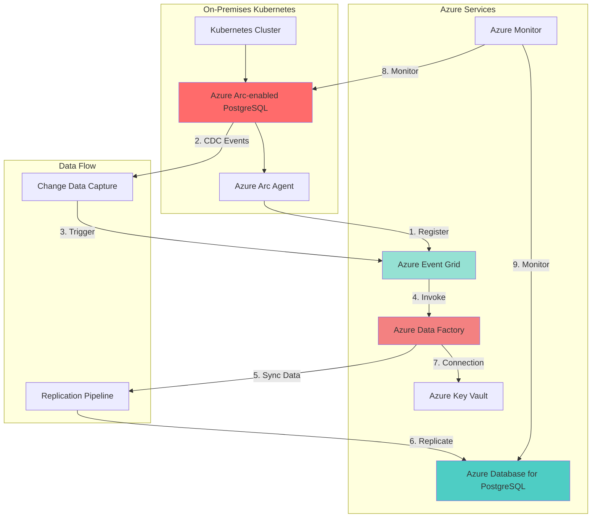

# Hybrid PostgreSQL Database Replication with Azure Arc and Cloud Database

## Problem

Organizations running PostgreSQL databases on-premises or at the edge need to maintain data consistency with cloud-based applications while preserving local performance and compliance requirements. Traditional replication approaches lack centralized management, event-driven synchronization, and automated conflict resolution, making it difficult to maintain reliable hybrid database architectures across distributed environments.

## Solution

Implement a hybrid database replication solution using Azure Arc-enabled PostgreSQL for on-premises Kubernetes clusters and Azure Database for PostgreSQL in the cloud. Azure Event Grid provides event-driven synchronization triggers while Azure Data Factory orchestrates automated data pipelines, ensuring consistent data across hybrid environments with centralized management and monitoring capabilities.

## Architecture Diagram



## Prerequisites

1. Azure subscription with Owner or Contributor access
2. Azure CLI v2.62.0 or later installed and configured
3. kubectl CLI tool installed (v1.28 or later)
4. Kubernetes cluster (AKS, EKS, GKE, or on-premises) with minimum 4 vCPUs and 16GB RAM
5. Basic understanding of PostgreSQL replication concepts
6. Estimated cost: $200-300/month for Azure services

> **Note**: Azure Arc-enabled PostgreSQL is currently in preview. Review the [supplemental terms of use](https://azure.microsoft.com/en-us/support/legal/preview-supplemental-terms/) for preview features.

## Preparation

```bash
# Set environment variables
export SUBSCRIPTION_ID=$(az account show --query id -o tsv)
export RESOURCE_GROUP="rg-hybrid-postgres-$(openssl rand -hex 3)"
export LOCATION="eastus"
export ARC_DC_NAME="arc-dc-postgres"
export K8S_NAMESPACE="arc-data"
export POSTGRES_NAME="postgres-hybrid"
export AZURE_PG_NAME="azpg-hybrid-$(openssl rand -hex 3)"
export ADF_NAME="adf-hybrid-$(openssl rand -hex 3)"
export EVENTGRID_TOPIC="eg-topic-$(openssl rand -hex 3)"

# Create resource group
az group create \
    --name ${RESOURCE_GROUP} \
    --location ${LOCATION} \
    --tags environment=demo purpose=hybrid-replication

# Install Azure Arc data services extension
az extension add --name arcdata

# Create namespace for Arc data services
kubectl create namespace ${K8S_NAMESPACE}

echo "✅ Environment prepared successfully"
```

## Steps

1. **Deploy Azure Arc Data Controller on Kubernetes**:

   Azure Arc Data Controller serves as the management layer for Arc-enabled data services, providing the foundation for deploying and managing PostgreSQL instances on your Kubernetes cluster. This controller enables hybrid cloud management capabilities, allowing you to manage on-premises databases through Azure's control plane while maintaining data sovereignty and local performance.

   ```bash
   # Generate random suffix for unique naming
   RANDOM_SUFFIX=$(openssl rand -hex 3)
   
   # Create service principal for Arc data controller
   ARC_SP_NAME="sp-arc-dc-${RANDOM_SUFFIX}"
   ARC_SP=$(az ad sp create-for-rbac \
       --name ${ARC_SP_NAME} \
       --role Contributor \
       --scopes /subscriptions/${SUBSCRIPTION_ID}/resourceGroups/${RESOURCE_GROUP} \
       --output json)
   
   # Extract credentials
   export ARC_SP_CLIENT_ID=$(echo $ARC_SP | jq -r '.appId')
   export ARC_SP_CLIENT_SECRET=$(echo $ARC_SP | jq -r '.password')
   export ARC_SP_TENANT_ID=$(echo $ARC_SP | jq -r '.tenant')
   
   # Deploy Arc data controller
   az arcdata dc create \
       --name ${ARC_DC_NAME} \
       --resource-group ${RESOURCE_GROUP} \
       --location ${LOCATION} \
       --connectivity-mode indirect \
       --namespace ${K8S_NAMESPACE} \
       --infrastructure onpremises \
       --k8s-namespace ${K8S_NAMESPACE} \
       --use-k8s
   
   echo "✅ Arc Data Controller deployed"
   ```

   The data controller is now managing your Kubernetes namespace and ready to deploy PostgreSQL instances. The indirect connectivity mode ensures that data remains on-premises while metadata is synchronized with Azure for centralized management.

2. **Create Azure Arc-enabled PostgreSQL Server**:

   Deploying PostgreSQL through Azure Arc provides enterprise-grade database capabilities with the flexibility of running on your own infrastructure. This approach combines the reliability of PostgreSQL 14 with Azure's management capabilities, including automated backups, monitoring, and security features while keeping data within your compliance boundaries.

   ```bash
   # Create PostgreSQL server configuration
   cat <<EOF > postgres-config.yaml
   apiVersion: arcdata.microsoft.com/v1beta1
   kind: PostgreSql
   metadata:
     name: ${POSTGRES_NAME}
     namespace: ${K8S_NAMESPACE}
   spec:
     engine:
       version: 14
     scale:
       replicas: 1
     scheduling:
       default:
         resources:
           requests:
             memory: 4Gi
             cpu: 2
           limits:
             memory: 8Gi
             cpu: 4
     storage:
       data:
         className: default
         size: 50Gi
       logs:
         className: default
         size: 10Gi
     security:
       adminPassword: "P@ssw0rd123!"
   EOF
   
   # Deploy PostgreSQL instance
   kubectl apply -f postgres-config.yaml
   
   # Wait for PostgreSQL to be ready
   kubectl wait --for=condition=Ready \
       --timeout=600s \
       -n ${K8S_NAMESPACE} \
       postgresql/${POSTGRES_NAME}
   
   # Get connection endpoint
   POSTGRES_ENDPOINT=$(kubectl get postgresql ${POSTGRES_NAME} \
       -n ${K8S_NAMESPACE} \
       -o jsonpath='{.status.primaryEndpoint}')
   
   echo "✅ Arc-enabled PostgreSQL deployed at: ${POSTGRES_ENDPOINT}"
   ```

3. **Configure Azure Database for PostgreSQL Flexible Server**:

   Azure Database for PostgreSQL Flexible Server provides a fully managed database service with zone-redundant high availability and automatic backups. Configuring it as the cloud target for replication ensures that cloud applications have access to synchronized data with minimal latency while benefiting from Azure's managed service capabilities including automatic patching and scaling.

   ```bash
   # Create PostgreSQL flexible server
   az postgres flexible-server create \
       --name ${AZURE_PG_NAME} \
       --resource-group ${RESOURCE_GROUP} \
       --location ${LOCATION} \
       --admin-user pgadmin \
       --admin-password "P@ssw0rd123!" \
       --sku-name Standard_D2ds_v4 \
       --storage-size 128 \
       --version 14 \
       --high-availability Disabled \
       --backup-retention 7 \
       --tags purpose=replication-target
   
   # Configure firewall for Azure services
   az postgres flexible-server firewall-rule create \
       --name allow-azure-services \
       --resource-group ${RESOURCE_GROUP} \
       --server-name ${AZURE_PG_NAME} \
       --start-ip-address 0.0.0.0 \
       --end-ip-address 0.0.0.0
   
   # Enable logical replication
   az postgres flexible-server parameter set \
       --name wal_level \
       --value logical \
       --resource-group ${RESOURCE_GROUP} \
       --server-name ${AZURE_PG_NAME}
   
   echo "✅ Azure Database for PostgreSQL configured"
   ```

   The flexible server is now ready to receive replicated data with logical replication enabled. This configuration allows for selective table replication and transformation during the synchronization process.

4. **Set Up Azure Event Grid for Change Detection**:

   Azure Event Grid provides a fully managed event routing service that enables reactive programming patterns. By integrating with your Arc-enabled PostgreSQL instance, Event Grid can detect database changes and trigger replication workflows automatically, ensuring near real-time data synchronization without constant polling or manual intervention.

   ```bash
   # Create Event Grid topic
   az eventgrid topic create \
       --name ${EVENTGRID_TOPIC} \
       --resource-group ${RESOURCE_GROUP} \
       --location ${LOCATION} \
       --tags purpose=database-sync
   
   # Get Event Grid endpoint and key
   EG_ENDPOINT=$(az eventgrid topic show \
       --name ${EVENTGRID_TOPIC} \
       --resource-group ${RESOURCE_GROUP} \
       --query endpoint -o tsv)
   
   EG_KEY=$(az eventgrid topic key list \
       --name ${EVENTGRID_TOPIC} \
       --resource-group ${RESOURCE_GROUP} \
       --query key1 -o tsv)
   
   # Configure Arc PostgreSQL to send events
   kubectl exec -it ${POSTGRES_NAME}-0 -n ${K8S_NAMESPACE} -- \
       psql -U postgres -c "
       CREATE EXTENSION IF NOT EXISTS pg_cron;
       SELECT cron.schedule('sync-trigger', '*/5 * * * *', 
         'SELECT pg_notify(''data_change'', ''sync_required'');');
       "
   
   echo "✅ Event Grid configured for change detection"
   ```

5. **Create Azure Data Factory Pipeline**:

   Azure Data Factory serves as the orchestration engine for your hybrid data movement, providing visual pipeline design, built-in connectors, and enterprise-scale data transformation capabilities. The pipeline monitors Event Grid for change notifications and executes incremental data synchronization between your on-premises and cloud PostgreSQL instances.

   ```bash
   # Create Data Factory instance
   az datafactory create \
       --name ${ADF_NAME} \
       --resource-group ${RESOURCE_GROUP} \
       --location ${LOCATION}
   
   # Create linked services for both PostgreSQL instances
   cat <<EOF > adf-linkedservice-arc.json
   {
     "name": "ArcPostgreSQLLinkedService",
     "properties": {
       "type": "PostgreSql",
       "typeProperties": {
         "connectionString": "Server=${POSTGRES_ENDPOINT};Database=postgres;Port=5432;UID=postgres;Password=P@ssw0rd123!"
       }
     }
   }
   EOF
   
   cat <<EOF > adf-linkedservice-azure.json
   {
     "name": "AzurePostgreSQLLinkedService",
     "properties": {
       "type": "AzurePostgreSql",
       "version": "1.0",
       "typeProperties": {
         "connectionString": "host=${AZURE_PG_NAME}.postgres.database.azure.com;database=postgres;port=5432;uid=pgadmin;password=P@ssw0rd123!"
       }
     }
   }
   EOF
   
   # Create linked services
   az datafactory linked-service create \
       --factory-name ${ADF_NAME} \
       --resource-group ${RESOURCE_GROUP} \
       --name ArcPostgreSQLLinkedService \
       --properties @adf-linkedservice-arc.json
   
   az datafactory linked-service create \
       --factory-name ${ADF_NAME} \
       --resource-group ${RESOURCE_GROUP} \
       --name AzurePostgreSQLLinkedService \
       --properties @adf-linkedservice-azure.json
   
   echo "✅ Data Factory pipeline components created"
   ```

6. **Configure Hybrid Replication Pipeline**:

   The replication pipeline implements change data capture (CDC) patterns to identify and synchronize only modified records, minimizing network traffic and ensuring efficient data transfer. This configuration includes error handling, retry logic, and data transformation capabilities to handle schema differences between source and target databases.

   ```bash
   # Create pipeline definition for incremental sync
   cat <<EOF > adf-pipeline.json
   {
     "name": "HybridPostgreSQLSync",
     "properties": {
       "activities": [
         {
           "name": "IncrementalCopy",
           "type": "Copy",
           "dependsOn": [],
           "policy": {
             "timeout": "7.00:00:00",
             "retry": 3,
             "retryIntervalInSeconds": 30
           },
           "typeProperties": {
             "source": {
               "type": "PostgreSqlSource",
               "query": "SELECT * FROM public.replicated_tables WHERE last_modified > '@{pipeline().parameters.lastSyncTime}'"
             },
             "sink": {
               "type": "AzurePostgreSqlSink",
               "writeBatchSize": 10000,
               "writeBatchTimeout": "00:30:00"
             },
             "enableStaging": false
           }
         }
       ],
       "parameters": {
         "lastSyncTime": {
           "type": "String",
           "defaultValue": "2024-01-01T00:00:00Z"
         }
       }
     }
   }
   EOF
   
   # Create the pipeline
   az datafactory pipeline create \
       --factory-name ${ADF_NAME} \
       --resource-group ${RESOURCE_GROUP} \
       --name HybridPostgreSQLSync \
       --pipeline @adf-pipeline.json
   
   # Create Event Grid trigger for custom events
   cat <<EOF > adf-trigger.json
   {
     "name": "EventGridSyncTrigger",
     "properties": {
       "type": "CustomEventsTrigger",
       "pipelines": [
         {
           "pipelineReference": {
             "referenceName": "HybridPostgreSQLSync",
             "type": "PipelineReference"
           }
         }
       ],
       "typeProperties": {
         "events": ["database_change"],
         "scope": "/subscriptions/${SUBSCRIPTION_ID}/resourceGroups/${RESOURCE_GROUP}/providers/Microsoft.EventGrid/topics/${EVENTGRID_TOPIC}"
       }
     }
   }
   EOF
   
   az datafactory trigger create \
       --factory-name ${ADF_NAME} \
       --resource-group ${RESOURCE_GROUP} \
       --name EventGridSyncTrigger \
       --properties @adf-trigger.json
   
   echo "✅ Hybrid replication pipeline configured"
   ```

7. **Enable Monitoring and Alerting**:

   Comprehensive monitoring ensures the reliability of your hybrid replication solution by tracking synchronization lag, data consistency, and system health. Azure Monitor provides unified visibility across both on-premises and cloud components, enabling proactive issue detection and automated response to replication failures.

   ```bash
   # Create Log Analytics workspace
   WORKSPACE_NAME="law-hybrid-postgres-$(openssl rand -hex 3)"
   az monitor log-analytics workspace create \
       --workspace-name ${WORKSPACE_NAME} \
       --resource-group ${RESOURCE_GROUP} \
       --location ${LOCATION}
   
   # Configure Arc PostgreSQL monitoring
   kubectl apply -f - <<EOF
   apiVersion: v1
   kind: ConfigMap
   metadata:
     name: postgres-monitoring
     namespace: ${K8S_NAMESPACE}
   data:
     prometheus.yml: |
       global:
         scrape_interval: 30s
       scrape_configs:
         - job_name: 'postgres'
           static_configs:
             - targets: ['${POSTGRES_NAME}:9187']
   EOF
   
   # Create alert for replication lag
   az monitor metrics alert create \
       --name alert-replication-lag \
       --resource-group ${RESOURCE_GROUP} \
       --scopes "/subscriptions/${SUBSCRIPTION_ID}/resourceGroups/${RESOURCE_GROUP}/providers/Microsoft.DBforPostgreSQL/flexibleServers/${AZURE_PG_NAME}" \
       --condition "avg replica_lag_in_bytes > 1048576" \
       --description "Alert when replication lag exceeds 1MB"
   
   echo "✅ Monitoring and alerting configured"
   ```

## Validation & Testing

1. Verify Arc-enabled PostgreSQL is running:

   ```bash
   # Check PostgreSQL pod status
   kubectl get pods -n ${K8S_NAMESPACE} | grep ${POSTGRES_NAME}
   
   # Test connection to Arc PostgreSQL
   kubectl exec -it ${POSTGRES_NAME}-0 -n ${K8S_NAMESPACE} -- \
       psql -U postgres -c "SELECT version();"
   ```

   Expected output: PostgreSQL 14.x version information

2. Test Azure Database for PostgreSQL connectivity:

   ```bash
   # Test connection to Azure PostgreSQL
   PGPASSWORD="P@ssw0rd123!" psql \
       -h ${AZURE_PG_NAME}.postgres.database.azure.com \
       -U pgadmin \
       -d postgres \
       -c "SELECT version();"
   ```

   Expected output: PostgreSQL 14.x on Azure

3. Validate Data Factory pipeline execution:

   ```bash
   # Trigger a test pipeline run
   RUN_ID=$(az datafactory pipeline create-run \
       --factory-name ${ADF_NAME} \
       --resource-group ${RESOURCE_GROUP} \
       --name HybridPostgreSQLSync \
       --query runId -o tsv)
   
   # Check pipeline run status
   az datafactory pipeline-run show \
       --factory-name ${ADF_NAME} \
       --resource-group ${RESOURCE_GROUP} \
       --run-id ${RUN_ID}
   ```

4. Test end-to-end replication:

   ```bash
   # Insert test data in Arc PostgreSQL
   kubectl exec -it ${POSTGRES_NAME}-0 -n ${K8S_NAMESPACE} -- \
       psql -U postgres -c "
       CREATE TABLE IF NOT EXISTS test_replication (
         id SERIAL PRIMARY KEY,
         data TEXT,
         created_at TIMESTAMP DEFAULT CURRENT_TIMESTAMP
       );
       INSERT INTO test_replication (data) VALUES ('Test replication data');
       "
   
   # Wait for sync and verify in Azure PostgreSQL
   sleep 30
   PGPASSWORD="P@ssw0rd123!" psql \
       -h ${AZURE_PG_NAME}.postgres.database.azure.com \
       -U pgadmin \
       -d postgres \
       -c "SELECT * FROM test_replication;"
   ```

## Cleanup

1. Remove Data Factory resources:

   ```bash
   # Stop all pipeline triggers
   az datafactory trigger stop \
       --factory-name ${ADF_NAME} \
       --resource-group ${RESOURCE_GROUP} \
       --name EventGridSyncTrigger
   
   # Delete Data Factory
   az datafactory delete \
       --name ${ADF_NAME} \
       --resource-group ${RESOURCE_GROUP} \
       --yes
   
   echo "✅ Data Factory resources removed"
   ```

2. Delete Event Grid topic:

   ```bash
   # Remove Event Grid topic
   az eventgrid topic delete \
       --name ${EVENTGRID_TOPIC} \
       --resource-group ${RESOURCE_GROUP} \
       --yes
   
   echo "✅ Event Grid topic deleted"
   ```

3. Remove PostgreSQL instances:

   ```bash
   # Delete Arc-enabled PostgreSQL
   kubectl delete postgresql ${POSTGRES_NAME} -n ${K8S_NAMESPACE}
   
   # Delete Azure Database for PostgreSQL
   az postgres flexible-server delete \
       --name ${AZURE_PG_NAME} \
       --resource-group ${RESOURCE_GROUP} \
       --yes
   
   echo "✅ PostgreSQL instances removed"
   ```

4. Clean up Arc data controller and resource group:

   ```bash
   # Delete Arc data controller
   az arcdata dc delete \
       --name ${ARC_DC_NAME} \
       --resource-group ${RESOURCE_GROUP} \
       --namespace ${K8S_NAMESPACE} \
       --force \
       --yes
   
   # Delete Kubernetes namespace
   kubectl delete namespace ${K8S_NAMESPACE}
   
   # Delete resource group
   az group delete \
       --name ${RESOURCE_GROUP} \
       --yes \
       --no-wait
   
   echo "✅ All resources cleaned up"
   ```

## Discussion

This hybrid database replication architecture demonstrates how Azure Arc extends Azure's data services to any infrastructure, enabling true hybrid cloud scenarios. The combination of Arc-enabled PostgreSQL and Azure Database for PostgreSQL provides flexibility in data placement while maintaining centralized management through Azure's control plane. This approach is particularly valuable for organizations with data sovereignty requirements, edge computing needs, or existing on-premises investments. For detailed guidance on Arc-enabled data services, see the [Azure Arc documentation](https://docs.microsoft.com/en-us/azure/azure-arc/data/overview).

The event-driven synchronization pattern using Azure Event Grid and Data Factory creates a responsive system that reacts to data changes rather than relying on scheduled polling. This reduces latency and resource consumption while providing better scalability for high-volume scenarios. The architecture follows the [Azure Well-Architected Framework](https://docs.microsoft.com/en-us/azure/architecture/framework/) principles by implementing reliability through retry mechanisms, security through managed identities, and operational excellence through comprehensive monitoring. For best practices on event-driven architectures, review the [Event Grid documentation](https://docs.microsoft.com/en-us/azure/event-grid/overview).

From a cost optimization perspective, this solution leverages consumption-based pricing for Event Grid and Data Factory, ensuring you only pay for actual data movement and processing. The hybrid approach also allows organizations to optimize costs by keeping frequently accessed data on-premises while replicating to the cloud for analytics and backup purposes. For detailed cost analysis and optimization strategies, consult the [Azure pricing calculator](https://azure.microsoft.com/en-us/pricing/calculator/) and [Data Factory pricing guide](https://docs.microsoft.com/en-us/azure/data-factory/pricing-concepts).

> **Tip**: Use Azure Monitor workbooks to create custom dashboards that visualize replication lag, data throughput, and error rates across your hybrid PostgreSQL deployment. See the [monitoring best practices](https://docs.microsoft.com/en-us/azure/azure-arc/data/monitor-postgresql-server) for Arc-enabled data services.

## Challenge

Extend this solution by implementing these enhancements:

1. Implement bi-directional replication with conflict resolution using custom Data Factory activities and Azure Functions
2. Add data transformation and masking capabilities to anonymize sensitive data during cloud replication
3. Create automated failover mechanisms that promote the cloud PostgreSQL instance when on-premises connectivity is lost
4. Integrate with Azure Purview for data lineage tracking and governance across hybrid environments
5. Implement advanced monitoring with custom metrics for transaction throughput and replication performance

## Infrastructure Code

### Available Infrastructure as Code:

- [Infrastructure Code Overview](code/README.md) - Detailed description of all infrastructure components
- [Bicep](code/bicep/) - Azure Bicep templates
- [Bash CLI Scripts](code/scripts/) - Example bash scripts using Azure CLI commands to deploy infrastructure
- [Terraform](code/terraform/) - Terraform configuration files