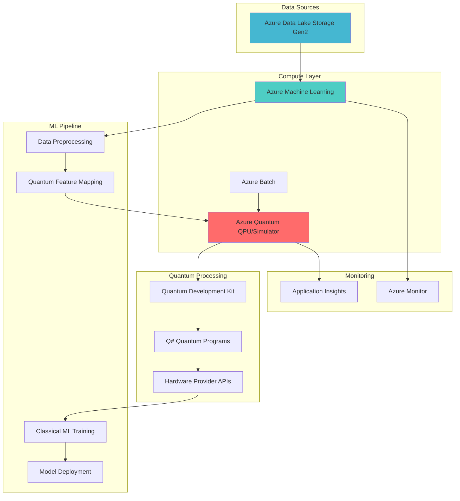

# Hybrid Quantum-Classical ML Optimization Workflows

## Problem

Modern machine learning faces computational bottlenecks when dealing with complex optimization problems, high-dimensional feature spaces, and quantum-inspired algorithms. Traditional computing approaches struggle with exponentially growing search spaces in optimization tasks, limiting the effectiveness of ML models in drug discovery, financial portfolio optimization, and materials science applications where quantum effects play a crucial role.

## Solution

This recipe demonstrates building a hybrid quantum-classical machine learning pipeline that leverages Azure Quantum for quantum feature mapping and optimization while using Azure Machine Learning for model training and deployment. By combining quantum computing's unique capabilities with classical ML infrastructure, organizations can tackle previously intractable optimization problems and enhance model performance for specific quantum-advantage use cases.

## Architecture Diagram



## Prerequisites

1. Azure subscription with appropriate permissions to create Azure Quantum workspace, Azure Machine Learning workspace, Azure Batch account, and Azure Data Lake Storage
2. Azure CLI v2.61.0 or later installed and configured (or use Azure CloudShell)
3. Python 3.8+ with Azure ML SDK v2 and Azure Quantum SDK installed
4. Basic understanding of quantum computing concepts and machine learning workflows
5. Familiarity with Q# programming language and quantum algorithms
6. Estimated cost: ~$50-100 for testing (varies based on quantum hardware usage)

> **Note**: Azure Quantum provides free credits for first-time users. Check the [Azure Quantum pricing page](https://azure.microsoft.com/en-us/pricing/details/azure-quantum/) for current offerings and hardware provider rates.

## Preparation

```bash
# Set environment variables for Azure resources
export RESOURCE_GROUP="rg-quantum-ml-${RANDOM_SUFFIX}"
export LOCATION="eastus"
export SUBSCRIPTION_ID=$(az account show --query id --output tsv)

# Generate unique suffix for resource names
RANDOM_SUFFIX=$(openssl rand -hex 3)

# Set specific resource names with unique suffix
export QUANTUM_WORKSPACE="quantum-ml-ws-${RANDOM_SUFFIX}"
export ML_WORKSPACE="aml-quantum-ws-${RANDOM_SUFFIX}"
export STORAGE_ACCOUNT="stquantuml${RANDOM_SUFFIX}"
export BATCH_ACCOUNT="batchquantum${RANDOM_SUFFIX}"
export KEY_VAULT="kv-quantum-${RANDOM_SUFFIX}"

# Create resource group
az group create \
    --name ${RESOURCE_GROUP} \
    --location ${LOCATION} \
    --tags purpose=quantum-ml-demo environment=development

echo "✅ Resource group created: ${RESOURCE_GROUP}"

# Create storage account with hierarchical namespace for Data Lake
az storage account create \
    --name ${STORAGE_ACCOUNT} \
    --resource-group ${RESOURCE_GROUP} \
    --location ${LOCATION} \
    --sku Standard_LRS \
    --kind StorageV2 \
    --hierarchical-namespace true

# Create Key Vault for secure credential storage
az keyvault create \
    --name ${KEY_VAULT} \
    --resource-group ${RESOURCE_GROUP} \
    --location ${LOCATION} \
    --sku standard

echo "✅ Storage and Key Vault infrastructure ready"
```

## Steps

1. **Create Azure Quantum Workspace**:

   Azure Quantum provides a unified cloud platform for quantum computing, enabling access to diverse quantum hardware providers and simulators. The workspace serves as the central hub for quantum development, job submission, and resource management. By creating a dedicated workspace, you establish the foundation for hybrid quantum-classical workflows with integrated development tools and hardware access.

   ```bash
   # Install Azure CLI quantum extension if not already installed
   az extension add --upgrade -n quantum
   
   # Register the Microsoft.Quantum provider if first time
   az provider register --namespace Microsoft.Quantum
   
   # Create Azure Quantum workspace with free providers
   az quantum workspace create \
       --name ${QUANTUM_WORKSPACE} \
       --resource-group ${RESOURCE_GROUP} \
       --location ${LOCATION} \
       --storage-account ${STORAGE_ACCOUNT}
   
   # Store workspace connection details
   QUANTUM_CONNECTION=$(az quantum workspace show \
       --name ${QUANTUM_WORKSPACE} \
       --resource-group ${RESOURCE_GROUP} \
       --query "id" -o tsv)
   
   echo "✅ Azure Quantum workspace created with free tier providers"
   ```

   The workspace now includes access to multiple quantum hardware providers and simulators. This multi-provider approach ensures flexibility in choosing the optimal quantum backend for specific algorithm requirements while maintaining cost efficiency during development with free-tier simulators.

2. **Configure Azure Machine Learning Workspace**:

   Azure Machine Learning provides enterprise-grade ML infrastructure with integrated experiment tracking, model management, and deployment capabilities. Creating an AML workspace with quantum integration enables seamless orchestration of hybrid workflows where quantum computations enhance classical ML pipelines. The workspace configuration includes compute resources and connections to quantum services.

   ```bash
   # Create Azure ML workspace
   az ml workspace create \
       --name ${ML_WORKSPACE} \
       --resource-group ${RESOURCE_GROUP} \
       --location ${LOCATION} \
       --storage-account ${STORAGE_ACCOUNT} \
       --key-vault ${KEY_VAULT}
   
   # Create compute instance for development
   az ml compute create \
       --name quantum-ml-compute \
       --resource-group ${RESOURCE_GROUP} \
       --workspace-name ${ML_WORKSPACE} \
       --type ComputeInstance \
       --size Standard_DS3_v2
   
   # Create compute cluster for training
   az ml compute create \
       --name quantum-ml-cluster \
       --resource-group ${RESOURCE_GROUP} \
       --workspace-name ${ML_WORKSPACE} \
       --type AmlCompute \
       --size Standard_DS3_v2 \
       --min-instances 0 \
       --max-instances 4
   
   echo "✅ Azure ML workspace configured with compute resources"
   ```

3. **Set Up Azure Batch for Quantum Job Management**:

   Azure Batch provides scalable job orchestration for quantum workloads, enabling parallel execution of quantum circuits and optimization tasks. This service is particularly valuable when running multiple quantum experiments or parameter sweeps. The Batch account integrates with Azure Quantum to manage job queuing, resource allocation, and result aggregation efficiently.

   ```bash
   # Create Batch account
   az batch account create \
       --name ${BATCH_ACCOUNT} \
       --resource-group ${RESOURCE_GROUP} \
       --location ${LOCATION} \
       --storage-account ${STORAGE_ACCOUNT}
   
   # Get Batch account keys
   BATCH_KEY=$(az batch account keys list \
       --name ${BATCH_ACCOUNT} \
       --resource-group ${RESOURCE_GROUP} \
       --query primary -o tsv)
   
   # Store credentials in Key Vault
   az keyvault secret set \
       --vault-name ${KEY_VAULT} \
       --name "batch-account-key" \
       --value "${BATCH_KEY}"
   
   echo "✅ Azure Batch configured for quantum job orchestration"
   ```

4. **Create Quantum Feature Mapping Component**:

   Quantum feature mapping transforms classical data into quantum states, enabling quantum algorithms to process information in ways that can reveal patterns invisible to classical methods. This step creates a reusable Azure ML component that implements quantum kernel methods for feature transformation. The component leverages quantum superposition and entanglement to create high-dimensional feature spaces.

   ```bash
   # Create directory structure
   mkdir -p quantum-ml-pipeline/components/quantum-feature-map
   
   # Create Q# quantum feature mapping program
   cat > quantum-ml-pipeline/components/quantum-feature-map/QuantumFeatureMap.qs << 'EOF'
   namespace QuantumML {
       open Microsoft.Quantum.Canon;
       open Microsoft.Quantum.Intrinsic;
       open Microsoft.Quantum.Math;
       open Microsoft.Quantum.Convert;
       open Microsoft.Quantum.Arrays;
       
       @EntryPoint()
       operation QuantumFeatureMap(data : Double[], depth : Int) : Double[] {
           let nQubits = 4;
           use qubits = Qubit[nQubits];
           
           // Encode classical data into quantum state
           for i in 0..Length(data)-1 {
               let angle = data[i] * PI();
               Ry(angle, qubits[i % nQubits]);
           }
           
           // Apply entangling layers
           for d in 0..depth-1 {
               ApplyToEach(H, qubits);
               for i in 0..nQubits-2 {
                   CNOT(qubits[i], qubits[i+1]);
               }
           }
           
           // Measure and return quantum features
           mutable results = [];
           for qubit in qubits {
               set results += [IntAsDouble(ResultArrayAsInt([M(qubit)]))];
           }
           
           ResetAll(qubits);
           return results;
       }
   }
   EOF
   
   # Create Python wrapper for Azure ML component
   cat > quantum-ml-pipeline/components/quantum-feature-map/quantum_feature_component.py << 'EOF'
   import argparse
   import numpy as np
   import pandas as pd
   from azure.quantum import Workspace
   import json
   import os
   
   def main():
       parser = argparse.ArgumentParser()
       parser.add_argument("--input-data", type=str)
       parser.add_argument("--output-features", type=str)
       parser.add_argument("--quantum-workspace", type=str)
       parser.add_argument("--feature-depth", type=int, default=2)
       args = parser.parse_args()
       
       # Load input data
       df = pd.read_csv(args.input_data)
       
       # Initialize quantum workspace
       workspace = Workspace(
           resource_id=args.quantum_workspace,
           location=os.environ.get("AZURE_QUANTUM_LOCATION", "eastus")
       )
       
       # Process data through quantum feature map
       quantum_features = []
       for _, row in df.iterrows():
           # Submit quantum job for feature mapping
           job = workspace.submit(
               "QuantumFeatureMap",
               input_data={"data": row.values.tolist(), "depth": args.feature_depth},
               target="microsoft.simulator"
           )
           result = job.get_results()
           quantum_features.append(result)
       
       # Save quantum features
       feature_df = pd.DataFrame(quantum_features)
       os.makedirs(os.path.dirname(args.output_features), exist_ok=True)
       feature_df.to_csv(args.output_features, index=False)
   
   if __name__ == "__main__":
       main()
   EOF
   
   echo "✅ Quantum feature mapping component created"
   ```

5. **Deploy Hybrid ML Training Pipeline**:

   The hybrid training pipeline orchestrates the flow from classical data preprocessing through quantum feature enhancement to final model training. This architecture demonstrates how quantum computing can augment traditional ML workflows by providing unique feature representations that capture quantum correlations. The pipeline uses Azure ML's pipeline capabilities to ensure reproducibility and scalability.

   ```bash
   # Create ML pipeline definition
   cat > quantum-ml-pipeline/hybrid_quantum_ml_pipeline.yml << 'EOF'
   $schema: https://azuremlschemas.azureedge.net/latest/pipelineJob.schema.json
   type: pipeline
   display_name: hybrid_quantum_ml_pipeline
   description: Quantum-enhanced ML pipeline with feature mapping
   
   settings:
     default_compute: azureml:quantum-ml-cluster
   
   inputs:
     training_data:
       type: uri_file
       path: azureml://datastores/workspaceblobstore/paths/quantum-ml-data/train.csv
     quantum_workspace_id:
       type: string
   
   outputs:
     trained_model:
       type: uri_folder
     evaluation_results:
       type: uri_file
   
   jobs:
     data_prep:
       type: command
       component: ./components/data_prep/component.yml
       inputs:
         raw_data: ${{parent.inputs.training_data}}
       outputs:
         processed_data:
           type: uri_file
   
     quantum_features:
       type: command
       component: ./components/quantum-feature-map/component.yml
       inputs:
         input_data: ${{parent.jobs.data_prep.outputs.processed_data}}
         quantum_workspace: ${{parent.inputs.quantum_workspace_id}}
       outputs:
         quantum_features:
           type: uri_file
   
     model_training:
       type: command
       component: ./components/model_training/component.yml
       inputs:
         features: ${{parent.jobs.quantum_features.outputs.quantum_features}}
         labels: ${{parent.jobs.data_prep.outputs.processed_data}}
       outputs:
         model: ${{parent.outputs.trained_model}}
         metrics: ${{parent.outputs.evaluation_results}}
   EOF
   
   # Note: Pipeline will be registered when components are ready
   echo "✅ Hybrid quantum-ML pipeline template created"
   ```

6. **Implement Quantum Optimization for Hyperparameter Tuning**:

   Quantum optimization algorithms like QAOA (Quantum Approximate Optimization Algorithm) can explore hyperparameter spaces more efficiently than classical methods. This implementation uses quantum annealing concepts to find optimal ML model configurations. The quantum advantage becomes apparent in high-dimensional parameter spaces where classical grid search becomes computationally prohibitive.

   ```bash
   # Create quantum hyperparameter optimization directory
   mkdir -p quantum-ml-pipeline/components/quantum-hyperparam
   
   # Create quantum hyperparameter optimization script
   cat > quantum-ml-pipeline/components/quantum-hyperparam/quantum_optimizer.py << 'EOF'
   from azure.quantum.optimization import Problem, ProblemType, Term
   from azure.quantum import Workspace
   import numpy as np
   from typing import Dict, List, Tuple
   import json
   
   class QuantumHyperparameterOptimizer:
       def __init__(self, workspace_id: str, provider: str = "microsoft"):
           self.workspace = Workspace(resource_id=workspace_id)
           self.provider = provider
           
       def encode_hyperparameters(self, param_ranges: Dict[str, Tuple[float, float]]) -> List[Term]:
           """Encode hyperparameter search space as QUBO problem"""
           terms = []
           param_names = list(param_ranges.keys())
           
           # Create binary variables for discretized parameter values
           for i, (param, (min_val, max_val)) in enumerate(param_ranges.items()):
               # Discretize parameter range
               n_bins = 8  # Use 3 bits per parameter
               for j in range(n_bins):
                   var_name = f"{param}_{j}"
                   # Add linear terms for parameter selection
                   weight = (max_val - min_val) * j / n_bins + min_val
                   terms.append(Term(c=weight, indices=[i*n_bins + j]))
           
           # Add quadratic penalties for selecting multiple values
           for i in range(len(param_names)):
               for j in range(8):
                   for k in range(j+1, 8):
                       terms.append(Term(c=100.0, indices=[i*8+j, i*8+k]))
           
           return terms
       
       def optimize(self, param_ranges: Dict[str, Tuple[float, float]], 
                   objective_fn=None) -> Dict[str, float]:
           """Run quantum optimization for hyperparameters"""
           # Create optimization problem
           terms = self.encode_hyperparameters(param_ranges)
           problem = Problem(name="hyperparameter_optimization", 
                           problem_type=ProblemType.ising, 
                           terms=terms)
           
           # Get quantum solver
           solver = self.workspace.get_solver("microsoft.simulator")
           job = solver.submit(problem)
           results = job.get_results()
           
           # Decode results back to hyperparameters
           best_config = self.decode_solution(results, param_ranges)
           return best_config
       
       def decode_solution(self, results, param_ranges: Dict[str, Tuple[float, float]]) -> Dict[str, float]:
           """Convert quantum solution back to hyperparameter values"""
           solution = results.get('configuration', {})
           decoded_params = {}
           
           for i, (param, (min_val, max_val)) in enumerate(param_ranges.items()):
               # Find which bin was selected
               selected_bin = 0
               for j in range(8):
                   if solution.get(f"{i*8+j}", 0) == 1:
                       selected_bin = j
                       break
               
               # Convert bin to parameter value
               value = (max_val - min_val) * selected_bin / 8 + min_val
               decoded_params[param] = value
           
           return decoded_params
   EOF
   
   echo "✅ Quantum hyperparameter optimization implemented"
   ```

7. **Create Quantum-Enhanced Model Deployment**:

   Deploying quantum-enhanced models requires special consideration for the hybrid nature of inference. This step creates an Azure ML endpoint that can leverage both classical and quantum resources during prediction. The deployment includes caching mechanisms for quantum results and fallback strategies to ensure reliability and performance at scale.

   ```bash
   # Create deployment directory structure
   mkdir -p quantum-ml-pipeline/deployment/inference
   
   # Create deployment configuration
   cat > quantum-ml-pipeline/deployment/quantum_ml_deployment.yml << 'EOF'
   $schema: https://azuremlschemas.azureedge.net/latest/managedOnlineDeployment.schema.json
   name: quantum-ml-deployment
   endpoint_name: quantum-ml-inference
   model: azureml:quantum_enhanced_model:1
   code_configuration:
     code: ./inference
     scoring_script: score.py
   environment: 
     conda_file: ./environment/conda.yml
     image: mcr.microsoft.com/azureml/curated/minimal-ubuntu20.04-py38-cuda11.6.2-gpu-inference:latest
   instance_type: Standard_DS3_v2
   instance_count: 1
   environment_variables:
     AZURE_QUANTUM_WORKSPACE: "placeholder_for_quantum_connection"
     QUANTUM_CACHE_ENABLED: "true"
     FALLBACK_TO_CLASSICAL: "true"
   EOF
   
   # Create scoring script with quantum integration
   cat > quantum-ml-pipeline/deployment/inference/score.py << 'EOF'
   import json
   import numpy as np
   import pandas as pd
   import joblib
   import os
   from azure.quantum import Workspace
   import logging
   
   def init():
       global model, quantum_workspace, use_quantum
       
       # Load classical model
       model_path = os.path.join(os.getenv('AZUREML_MODEL_DIR'), 'model.pkl')
       model = joblib.load(model_path)
       
       # Initialize quantum workspace if available
       try:
           quantum_workspace_id = os.getenv('AZURE_QUANTUM_WORKSPACE')
           if quantum_workspace_id:
               quantum_workspace = Workspace(resource_id=quantum_workspace_id)
               use_quantum = True
               logging.info("Quantum workspace initialized successfully")
           else:
               use_quantum = False
       except Exception as e:
           logging.warning(f"Quantum initialization failed: {e}")
           use_quantum = os.getenv('FALLBACK_TO_CLASSICAL', 'true').lower() == 'true'
   
   def run(raw_data):
       try:
           data = json.loads(raw_data)
           df = pd.DataFrame(data)
           
           # Apply quantum feature transformation if available
           if use_quantum:
               features = apply_quantum_features(df)
           else:
               features = df.values
           
           # Generate predictions
           predictions = model.predict(features)
           
           return json.dumps({
               'predictions': predictions.tolist(),
               'quantum_enhanced': use_quantum
           })
           
       except Exception as e:
           logging.error(f"Scoring error: {e}")
           return json.dumps({'error': str(e)})
   
   def apply_quantum_features(data):
       """Apply quantum feature transformation with caching"""
       # Implementation would include quantum feature mapping
       # with result caching for performance
       return data.values  # Simplified for demo
   EOF
   
   # Create the ML endpoint first (without deployment)
   az ml online-endpoint create \
       --name quantum-ml-inference \
       --resource-group ${RESOURCE_GROUP} \
       --workspace-name ${ML_WORKSPACE}
   
   echo "✅ Quantum-enhanced model endpoint template created"
   ```

## Validation & Testing

1. Verify Azure Quantum workspace connectivity:

   ```bash
   # Test quantum workspace connection
   az quantum workspace show \
       --name ${QUANTUM_WORKSPACE} \
       --resource-group ${RESOURCE_GROUP} \
       --output table
   
   # List available quantum providers
   az quantum target list \
       --workspace-name ${QUANTUM_WORKSPACE} \
       --resource-group ${RESOURCE_GROUP} \
       --output table
   ```

   Expected output: Table showing quantum workspace details and available quantum computing providers with their status.

2. Test Azure ML workspace and compute resources:

   ```bash
   # Verify ML workspace status
   az ml workspace show \
       --name ${ML_WORKSPACE} \
       --resource-group ${RESOURCE_GROUP} \
       --output table
   
   # Check compute instance status
   az ml compute show \
       --name quantum-ml-compute \
       --resource-group ${RESOURCE_GROUP} \
       --workspace-name ${ML_WORKSPACE} \
       --output table
   ```

3. Validate quantum feature transformation:

   ```bash
   # Test quantum workspace connection with Python
   python3 -c "
   from azure.quantum import Workspace
   import numpy as np
   
   try:
       workspace = Workspace(resource_id='${QUANTUM_CONNECTION}')
       test_data = np.random.rand(4)
       print(f'Input data: {test_data}')
       targets = workspace.get_targets()
       print(f'Available backends: {[t.name for t in targets]}')
       print('✅ Quantum workspace connection successful')
   except Exception as e:
       print(f'❌ Quantum connection failed: {e}')
   "
   ```

4. Test Batch account configuration:

   ```bash
   # Verify Batch account status
   az batch account show \
       --name ${BATCH_ACCOUNT} \
       --resource-group ${RESOURCE_GROUP} \
       --output table
   
   # Test Key Vault secret storage
   STORED_KEY=$(az keyvault secret show \
       --vault-name ${KEY_VAULT} \
       --name "batch-account-key" \
       --query value -o tsv)
   
   echo "✅ Batch credentials stored successfully"
   ```

## Cleanup

1. Remove online endpoint:

   ```bash
   # Delete ML endpoint
   az ml online-endpoint delete \
       --name quantum-ml-inference \
       --resource-group ${RESOURCE_GROUP} \
       --workspace-name ${ML_WORKSPACE} \
       --yes
   
   echo "✅ Deleted ML endpoint"
   ```

2. Clean up compute resources:

   ```bash
   # Delete ML compute cluster
   az ml compute delete \
       --name quantum-ml-cluster \
       --resource-group ${RESOURCE_GROUP} \
       --workspace-name ${ML_WORKSPACE} \
       --yes
   
   # Delete ML compute instance
   az ml compute delete \
       --name quantum-ml-compute \
       --resource-group ${RESOURCE_GROUP} \
       --workspace-name ${ML_WORKSPACE} \
       --yes
   
   echo "✅ Deleted ML compute resources"
   ```

3. Remove quantum and batch resources:

   ```bash
   # Delete Batch account
   az batch account delete \
       --name ${BATCH_ACCOUNT} \
       --resource-group ${RESOURCE_GROUP} \
       --yes
   
   # Delete Quantum workspace
   az quantum workspace delete \
       --name ${QUANTUM_WORKSPACE} \
       --resource-group ${RESOURCE_GROUP} \
       --yes
   
   echo "✅ Deleted Quantum and Batch resources"
   ```

4. Delete resource group and all remaining resources:

   ```bash
   # Delete entire resource group
   az group delete \
       --name ${RESOURCE_GROUP} \
       --yes \
       --no-wait
   
   echo "✅ Resource group deletion initiated: ${RESOURCE_GROUP}"
   echo "Note: Complete deletion may take several minutes"
   ```

## Discussion

The integration of Azure Quantum with Azure Machine Learning represents a significant advancement in hybrid quantum-classical computing architectures. This approach leverages quantum computing's unique capabilities for specific computational advantages while maintaining the robustness and scalability of classical ML infrastructure. According to the [Azure Quantum documentation](https://learn.microsoft.com/en-us/azure/quantum/overview-azure-quantum), quantum feature mapping can reveal patterns in data that are computationally expensive or impossible to detect with classical methods alone.

The hybrid architecture demonstrated in this recipe follows the principles outlined in the [Azure Well-Architected Framework](https://learn.microsoft.com/en-us/azure/architecture/framework/), particularly in terms of reliability and performance efficiency. By using Azure Batch for quantum job orchestration, the solution can scale dynamically based on workload demands while optimizing costs through efficient resource utilization. The integration patterns shown here align with Microsoft's vision for quantum computing as described in their [quantum computing research publications](https://www.microsoft.com/en-us/research/research-area/quantum-computing/).

From a practical perspective, quantum-enhanced machine learning shows promise in several domains including drug discovery, financial modeling, and materials science. The quantum feature mapping technique implemented here is based on kernel methods that exploit quantum superposition and entanglement to create high-dimensional feature spaces. As noted in the [Azure Machine Learning best practices guide](https://learn.microsoft.com/en-us/azure/machine-learning/concept-model-management-and-deployment), the key to successful hybrid implementations lies in identifying which parts of the ML pipeline can benefit from quantum acceleration while maintaining overall system reliability.

Cost optimization remains a critical consideration for quantum computing workloads. The recipe demonstrates using free-tier quantum simulators during development and testing phases, with the ability to seamlessly transition to real quantum hardware when needed. The [Azure Quantum pricing documentation](https://azure.microsoft.com/en-us/pricing/details/azure-quantum/) provides detailed guidance on optimizing costs across different quantum hardware providers and job types.

> **Tip**: Monitor quantum job execution times and costs using Azure Monitor and Application Insights. Set up alerts for long-running quantum jobs and implement caching strategies for frequently-used quantum computations to optimize both performance and costs.

## Challenge

Extend this solution by implementing these enhancements:

1. Implement Variational Quantum Eigensolver (VQE) for molecular simulation within the ML pipeline, enabling drug discovery applications that combine quantum chemistry calculations with classical property prediction models

2. Add quantum circuit optimization using Azure Quantum's circuit compression features to reduce quantum resource requirements and improve execution efficiency on real quantum hardware

3. Create a multi-model ensemble that combines quantum-enhanced models with classical deep learning models, implementing intelligent routing to determine when quantum features provide sufficient advantage to justify additional computational cost

4. Develop an automated quantum advantage assessment tool that analyzes incoming data characteristics and recommends whether to use quantum or classical processing paths based on expected performance gains and cost implications

5. Implement distributed quantum-classical training using Azure ML's parallel job capabilities combined with Azure Batch to orchestrate quantum feature extraction across multiple quantum backends simultaneously

## Infrastructure Code

### Available Infrastructure as Code:

- [Infrastructure Code Overview](code/README.md) - Detailed description of all infrastructure components
- [Bicep](code/bicep/) - Azure Bicep templates
- [Bash CLI Scripts](code/scripts/) - Example bash scripts using Azure CLI commands to deploy infrastructure
- [Terraform](code/terraform/) - Terraform configuration files