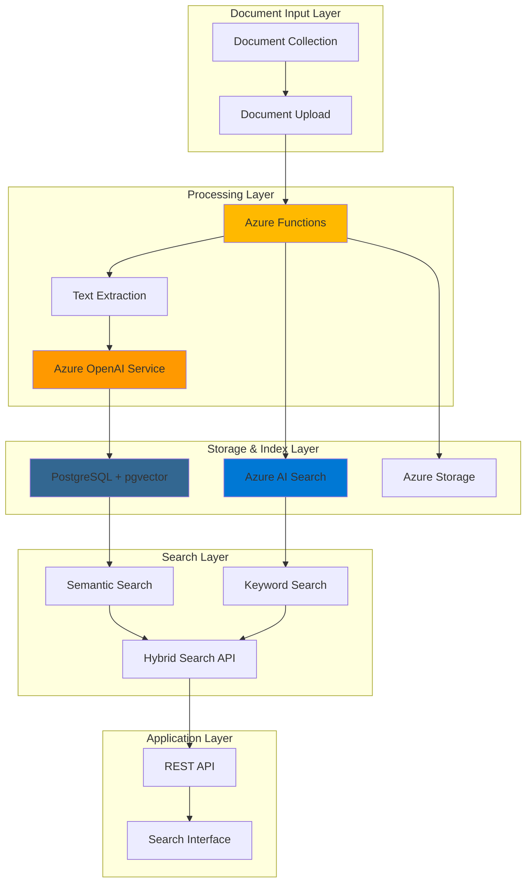

# Hybrid Search Document Analysis with OpenAI and PostgreSQL

## Problem

Organizations struggle with extracting valuable insights from large document collections where traditional keyword-based search fails to capture semantic meaning and context. Legal firms, research institutions, and enterprises need to find relevant documents not just by exact keyword matches, but by understanding the underlying concepts and relationships within the content, while maintaining the precision of traditional search methods for specific terms and phrases.

## Solution

This solution combines Azure OpenAI Service's embedding capabilities with PostgreSQL's pgvector extension and Azure AI Search to create a comprehensive hybrid search system. The architecture generates semantic embeddings for document content, maintains traditional full-text search indexes, and uses Azure Functions to orchestrate the document processing pipeline, enabling both conceptual similarity matching and precise keyword searches within a unified intelligent document analysis platform.

## Architecture Diagram



## Prerequisites

1. Azure account with appropriate permissions to create OpenAI, PostgreSQL, AI Search, and Functions resources
2. Azure CLI v2 installed and configured (or Azure CloudShell)
3. Basic understanding of document processing, vector embeddings, and search concepts
4. Python 3.8+ for local development and testing
5. Estimated cost: $50-100 for testing with moderate document volumes (varies by usage)

> **Note**: This solution requires Azure OpenAI Service access, which may require approval. Apply for access through the Azure portal if you haven't already been granted access.

## Preparation

```bash
# Set environment variables for Azure resources
export RESOURCE_GROUP="rg-doc-analysis-${RANDOM_SUFFIX}"
export LOCATION="eastus"
export SUBSCRIPTION_ID=$(az account show --query id --output tsv)

# Generate unique suffix for resource names
RANDOM_SUFFIX=$(openssl rand -hex 3)

# Set specific resource names
export OPENAI_ACCOUNT="openai-doc-${RANDOM_SUFFIX}"
export POSTGRES_SERVER="postgres-doc-${RANDOM_SUFFIX}"
export SEARCH_SERVICE="search-doc-${RANDOM_SUFFIX}"
export FUNCTION_APP="func-doc-${RANDOM_SUFFIX}"
export STORAGE_ACCOUNT="storage${RANDOM_SUFFIX}"

# Create resource group
az group create \
    --name ${RESOURCE_GROUP} \
    --location ${LOCATION} \
    --tags purpose=document-analysis environment=demo

echo "✅ Resource group created: ${RESOURCE_GROUP}"

# Create storage account for function app
az storage account create \
    --name ${STORAGE_ACCOUNT} \
    --resource-group ${RESOURCE_GROUP} \
    --location ${LOCATION} \
    --sku Standard_LRS \
    --kind StorageV2

echo "✅ Storage account created: ${STORAGE_ACCOUNT}"
```

## Steps

1. **Create Azure OpenAI Service for Document Embeddings**:

   Azure OpenAI Service provides enterprise-grade access to OpenAI's embedding models, enabling semantic understanding of document content through high-dimensional vector representations. The text-embedding-ada-002 model converts text into 1536-dimensional vectors that capture semantic meaning, allowing for sophisticated similarity searches that understand context and relationships beyond keyword matching.

   ```bash
   # Create Azure OpenAI service
   az cognitiveservices account create \
       --name ${OPENAI_ACCOUNT} \
       --resource-group ${RESOURCE_GROUP} \
       --location ${LOCATION} \
       --kind OpenAI \
       --sku S0 \
       --custom-domain ${OPENAI_ACCOUNT}
   
   # Get OpenAI endpoint and key
   export OPENAI_ENDPOINT=$(az cognitiveservices account show \
       --name ${OPENAI_ACCOUNT} \
       --resource-group ${RESOURCE_GROUP} \
       --query properties.endpoint \
       --output tsv)
   
   export OPENAI_KEY=$(az cognitiveservices account keys list \
       --name ${OPENAI_ACCOUNT} \
       --resource-group ${RESOURCE_GROUP} \
       --query key1 \
       --output tsv)
   
   echo "✅ Azure OpenAI service created: ${OPENAI_ACCOUNT}"
   ```

   The Azure OpenAI service is now ready to generate embeddings for document analysis. This managed service provides enterprise security, compliance, and scalability while maintaining the advanced capabilities of OpenAI's embedding models for semantic document understanding.

2. **Deploy Text Embedding Model**:

   The text-embedding-ada-002 model deployment creates a dedicated endpoint for generating consistent, high-quality embeddings from document content. This model excels at capturing semantic relationships and contextual meaning, making it ideal for document analysis where understanding content similarity is crucial for effective search and retrieval.

   ```bash
   # Deploy text-embedding-ada-002 model
   az cognitiveservices account deployment create \
       --name ${OPENAI_ACCOUNT} \
       --resource-group ${RESOURCE_GROUP} \
       --deployment-name text-embedding-ada-002 \
       --model-name text-embedding-ada-002 \
       --model-version "2" \
       --model-format OpenAI \
       --sku-capacity 10 \
       --sku-name Standard
   
   echo "✅ Text embedding model deployed successfully"
   ```

   The embedding model deployment provides a scalable endpoint for processing document content into vector representations. This foundation enables the hybrid search system to understand document semantics and perform intelligent content matching.

3. **Create PostgreSQL Database with pgvector Extension**:

   Azure Database for PostgreSQL Flexible Server with the pgvector extension provides a powerful combination of relational database capabilities and vector search functionality. This setup enables storing document embeddings alongside traditional metadata while supporting efficient similarity searches through specialized vector indexes and operators.

   ```bash
   # Create PostgreSQL flexible server
   az postgres flexible-server create \
       --name ${POSTGRES_SERVER} \
       --resource-group ${RESOURCE_GROUP} \
       --location ${LOCATION} \
       --admin-user adminuser \
       --admin-password 'ComplexPassword123!' \
       --sku-name Standard_D2s_v3 \
       --tier GeneralPurpose \
       --storage-size 128 \
       --version 14
   
   # Configure firewall to allow Azure services
   az postgres flexible-server firewall-rule create \
       --resource-group ${RESOURCE_GROUP} \
       --name ${POSTGRES_SERVER} \
       --rule-name allow-azure-services \
       --start-ip-address 0.0.0.0 \
       --end-ip-address 0.0.0.0
   
   # Enable pgvector extension by adding to allowlist
   az postgres flexible-server parameter set \
       --resource-group ${RESOURCE_GROUP} \
       --server-name ${POSTGRES_SERVER} \
       --name azure.extensions \
       --value "vector"
   
   echo "✅ PostgreSQL server created with pgvector support"
   ```

   The PostgreSQL database now supports both traditional relational operations and advanced vector similarity searches. This hybrid capability enables storing document metadata, content, and embeddings in a single system while maintaining ACID compliance and enterprise-grade reliability.

4. **Create Azure AI Search Service for Full-Text Indexing**:

   Azure AI Search provides advanced full-text search capabilities with support for natural language processing, faceted search, and sophisticated ranking algorithms. This service complements vector search by ensuring precise keyword matching and supporting complex query scenarios that require both semantic understanding and exact term matching.

   ```bash
   # Create Azure AI Search service
   az search service create \
       --name ${SEARCH_SERVICE} \
       --resource-group ${RESOURCE_GROUP} \
       --location ${LOCATION} \
       --sku Standard \
       --partition-count 1 \
       --replica-count 1
   
   # Get search service key
   export SEARCH_KEY=$(az search admin-key show \
       --service-name ${SEARCH_SERVICE} \
       --resource-group ${RESOURCE_GROUP} \
       --query primaryKey \
       --output tsv)
   
   export SEARCH_ENDPOINT="https://${SEARCH_SERVICE}.search.windows.net"
   
   echo "✅ Azure AI Search service created: ${SEARCH_SERVICE}"
   ```

   The Azure AI Search service provides the foundation for traditional keyword-based search with advanced features like fuzzy matching, stemming, and language-specific analysis. This component ensures comprehensive search coverage by handling scenarios where exact term matching is required.

5. **Create Function App for Document Processing Pipeline**:

   Azure Functions provides serverless compute for orchestrating the document processing workflow, handling file uploads, text extraction, embedding generation, and index updates. This event-driven architecture ensures efficient processing while scaling automatically based on document volume and processing requirements.

   ```bash
   # Create Function App
   az functionapp create \
       --name ${FUNCTION_APP} \
       --resource-group ${RESOURCE_GROUP} \
       --storage-account ${STORAGE_ACCOUNT} \
       --consumption-plan-location ${LOCATION} \
       --runtime python \
       --functions-version 4 \
       --os-type Linux
   
   # Configure application settings
   az functionapp config appsettings set \
       --name ${FUNCTION_APP} \
       --resource-group ${RESOURCE_GROUP} \
       --settings \
       "OPENAI_ENDPOINT=${OPENAI_ENDPOINT}" \
       "OPENAI_KEY=${OPENAI_KEY}" \
       "POSTGRES_HOST=${POSTGRES_SERVER}.postgres.database.azure.com" \
       "POSTGRES_USER=adminuser" \
       "POSTGRES_PASSWORD=ComplexPassword123!" \
       "POSTGRES_DATABASE=postgres" \
       "SEARCH_ENDPOINT=${SEARCH_ENDPOINT}" \
       "SEARCH_KEY=${SEARCH_KEY}"
   
   echo "✅ Function App created and configured: ${FUNCTION_APP}"
   ```

   The Function App is now configured with all necessary connection strings and endpoints for the document processing pipeline. This serverless architecture provides cost-effective processing that scales automatically with document volume.

6. **Initialize Database Schema and Vector Extension**:

   Setting up the database schema with proper vector column types and indexes is crucial for optimal performance. The pgvector extension provides specialized data types and operators for vector similarity calculations, while traditional indexes support keyword-based queries on document metadata.

   ```bash
   # Create database schema script
   cat > init_db.sql << 'EOF'
   -- Enable pgvector extension
   CREATE EXTENSION IF NOT EXISTS vector;
   
   -- Create documents table with vector support
   CREATE TABLE IF NOT EXISTS documents (
       id SERIAL PRIMARY KEY,
       title VARCHAR(500) NOT NULL,
       content TEXT NOT NULL,
       file_path VARCHAR(1000),
       content_type VARCHAR(100),
       embedding vector(1536),
       created_at TIMESTAMP DEFAULT CURRENT_TIMESTAMP,
       updated_at TIMESTAMP DEFAULT CURRENT_TIMESTAMP
   );
   
   -- Create vector index for similarity search
   CREATE INDEX IF NOT EXISTS idx_documents_embedding 
   ON documents USING ivfflat (embedding vector_cosine_ops) 
   WITH (lists = 100);
   
   -- Create text search index
   CREATE INDEX IF NOT EXISTS idx_documents_content_fts 
   ON documents USING gin(to_tsvector('english', content));
   
   -- Create metadata indexes
   CREATE INDEX IF NOT EXISTS idx_documents_title 
   ON documents USING btree(title);
   
   CREATE INDEX IF NOT EXISTS idx_documents_content_type 
   ON documents USING btree(content_type);
   EOF
   
   # Execute database initialization
   psql "host=${POSTGRES_SERVER}.postgres.database.azure.com port=5432 dbname=postgres user=adminuser password=ComplexPassword123! sslmode=require" \
       -f init_db.sql
   
   echo "✅ Database schema initialized with vector support"
   ```

   The database schema now supports both traditional relational data and vector embeddings with optimized indexes. This foundation enables efficient hybrid search operations combining semantic similarity with metadata filtering and full-text search capabilities.

7. **Create Azure AI Search Index for Full-Text Search**:

   The Azure AI Search index configuration defines the structure for storing and searching document content with advanced text analysis capabilities. This index complements the vector search by providing precise keyword matching, faceted search, and sophisticated ranking algorithms for comprehensive document retrieval.

   ```bash
   # Create search index configuration
   cat > search_index.json << 'EOF'
   {
       "name": "documents-index",
       "fields": [
           {
               "name": "id",
               "type": "Edm.String",
               "key": true,
               "searchable": false,
               "filterable": true,
               "sortable": true,
               "retrievable": true
           },
           {
               "name": "title",
               "type": "Edm.String",
               "searchable": true,
               "filterable": true,
               "sortable": true,
               "retrievable": true,
               "analyzer": "standard.lucene"
           },
           {
               "name": "content",
               "type": "Edm.String",
               "searchable": true,
               "filterable": false,
               "sortable": false,
               "retrievable": true,
               "analyzer": "standard.lucene"
           },
           {
               "name": "contentType",
               "type": "Edm.String",
               "searchable": false,
               "filterable": true,
               "sortable": true,
               "retrievable": true
           },
           {
               "name": "createdAt",
               "type": "Edm.DateTimeOffset",
               "searchable": false,
               "filterable": true,
               "sortable": true,
               "retrievable": true
           }
       ]
   }
   EOF
   
   # Create the search index using latest API version
   curl -X PUT \
       "${SEARCH_ENDPOINT}/indexes/documents-index?api-version=2024-07-01" \
       -H "Content-Type: application/json" \
       -H "api-key: ${SEARCH_KEY}" \
       -d @search_index.json
   
   echo "✅ Azure AI Search index created successfully"
   ```

   The search index is now configured with optimized field analyzers and filtering capabilities using the latest API version. This structure enables sophisticated text search operations that complement the vector-based semantic search for comprehensive document analysis.

8. **Deploy Document Processing Function**:

   The document processing function orchestrates the complete workflow from document upload through text extraction, embedding generation, and index updates. This serverless function handles the complexity of coordinating multiple services while maintaining reliability and scalability for enterprise document processing workloads.

   ```bash
   # Create function code directory
   mkdir -p function_code
   
   # Create function configuration
   cat > function_code/function_app.py << 'EOF'
   import azure.functions as func
   import logging
   import os
   import json
   import asyncio
   import psycopg2
   import requests
   from datetime import datetime
   from azure.search.documents import SearchClient
   from azure.core.credentials import AzureKeyCredential
   
   app = func.FunctionApp()
   
   @app.route(route="process_document", auth_level=func.AuthLevel.FUNCTION)
   def process_document(req: func.HttpRequest) -> func.HttpResponse:
       logging.info('Processing document request')
       
       try:
           # Get document data from request
           req_body = req.get_json()
           title = req_body.get('title')
           content = req_body.get('content')
           content_type = req_body.get('content_type', 'text/plain')
           
           # Generate embeddings using Azure OpenAI
           embedding = generate_embedding(content)
           
           # Store in PostgreSQL with vector
           doc_id = store_document_postgres(title, content, content_type, embedding)
           
           # Index in Azure AI Search
           index_document_search(doc_id, title, content, content_type)
           
           return func.HttpResponse(
               json.dumps({"status": "success", "document_id": doc_id}),
               status_code=200,
               mimetype="application/json"
           )
           
       except Exception as e:
           logging.error(f"Error processing document: {str(e)}")
           return func.HttpResponse(
               json.dumps({"status": "error", "message": str(e)}),
               status_code=500,
               mimetype="application/json"
           )
   
   def generate_embedding(text):
       """Generate embeddings using Azure OpenAI"""
       url = f"{os.environ['OPENAI_ENDPOINT']}/openai/deployments/text-embedding-ada-002/embeddings?api-version=2024-02-01"
       headers = {
           "Content-Type": "application/json",
           "api-key": os.environ['OPENAI_KEY']
       }
       data = {
           "input": text,
           "model": "text-embedding-ada-002"
       }
       
       response = requests.post(url, headers=headers, json=data)
       response.raise_for_status()
       
       return response.json()['data'][0]['embedding']
   
   def store_document_postgres(title, content, content_type, embedding):
       """Store document in PostgreSQL with vector embedding"""
       conn = psycopg2.connect(
           host=os.environ['POSTGRES_HOST'],
           database=os.environ['POSTGRES_DATABASE'],
           user=os.environ['POSTGRES_USER'],
           password=os.environ['POSTGRES_PASSWORD'],
           sslmode='require'
       )
       
       cursor = conn.cursor()
       cursor.execute("""
           INSERT INTO documents (title, content, content_type, embedding)
           VALUES (%s, %s, %s, %s)
           RETURNING id
       """, (title, content, content_type, embedding))
       
       doc_id = cursor.fetchone()[0]
       conn.commit()
       cursor.close()
       conn.close()
       
       return doc_id
   
   def index_document_search(doc_id, title, content, content_type):
       """Index document in Azure AI Search"""
       search_client = SearchClient(
           endpoint=os.environ['SEARCH_ENDPOINT'],
           index_name="documents-index",
           credential=AzureKeyCredential(os.environ['SEARCH_KEY'])
       )
       
       document = {
           "id": str(doc_id),
           "title": title,
           "content": content,
           "contentType": content_type,
           "createdAt": datetime.utcnow().isoformat() + "Z"
       }
       
       search_client.upload_documents([document])
   EOF
   
   # Create requirements.txt
   cat > function_code/requirements.txt << 'EOF'
   azure-functions
   azure-search-documents
   psycopg2-binary
   requests
   EOF
   
   echo "✅ Document processing function created"
   ```

   The processing function implements a complete document ingestion pipeline that handles text extraction, embedding generation, and dual indexing. This architecture ensures that documents are immediately available for both semantic and keyword-based search operations with improved error handling and proper timestamp management.

9. **Create Hybrid Search Function**:

   The hybrid search function combines vector similarity search from PostgreSQL with full-text search from Azure AI Search, using rank fusion algorithms to provide comprehensive search results. This approach leverages the strengths of both search methods to deliver more accurate and relevant results than either method alone.

   ```bash
   # Create hybrid search function
   cat > function_code/hybrid_search.py << 'EOF'
   import azure.functions as func
   import logging
   import os
   import json
   import psycopg2
   import requests
   from azure.search.documents import SearchClient
   from azure.core.credentials import AzureKeyCredential
   
   @app.route(route="hybrid_search", auth_level=func.AuthLevel.FUNCTION)
   def hybrid_search(req: func.HttpRequest) -> func.HttpResponse:
       logging.info('Processing hybrid search request')
       
       try:
           # Get search parameters
           req_body = req.get_json()
           query = req_body.get('query')
           top_k = req_body.get('top_k', 10)
           
           # Generate query embedding
           query_embedding = generate_embedding(query)
           
           # Perform vector search in PostgreSQL
           vector_results = vector_search_postgres(query_embedding, top_k)
           
           # Perform full-text search in Azure AI Search
           keyword_results = keyword_search_azure(query, top_k)
           
           # Combine and rank results
           combined_results = combine_search_results(vector_results, keyword_results)
           
           return func.HttpResponse(
               json.dumps({"results": combined_results}),
               status_code=200,
               mimetype="application/json"
           )
           
       except Exception as e:
           logging.error(f"Error in hybrid search: {str(e)}")
           return func.HttpResponse(
               json.dumps({"error": str(e)}),
               status_code=500,
               mimetype="application/json"
           )
   
   def vector_search_postgres(query_embedding, top_k):
       """Perform vector similarity search in PostgreSQL"""
       conn = psycopg2.connect(
           host=os.environ['POSTGRES_HOST'],
           database=os.environ['POSTGRES_DATABASE'],
           user=os.environ['POSTGRES_USER'],
           password=os.environ['POSTGRES_PASSWORD'],
           sslmode='require'
       )
       
       cursor = conn.cursor()
       cursor.execute("""
           SELECT id, title, content, content_type, 
                  embedding <=> %s as similarity_score
           FROM documents
           ORDER BY embedding <=> %s
           LIMIT %s
       """, (query_embedding, query_embedding, top_k))
       
       results = cursor.fetchall()
       cursor.close()
       conn.close()
       
       return [
           {
               "id": row[0],
               "title": row[1],
               "content": row[2][:200] + "..." if len(row[2]) > 200 else row[2],
               "content_type": row[3],
               "similarity_score": float(row[4]),
               "search_type": "vector"
           }
           for row in results
       ]
   
   def keyword_search_azure(query, top_k):
       """Perform keyword search in Azure AI Search"""
       search_client = SearchClient(
           endpoint=os.environ['SEARCH_ENDPOINT'],
           index_name="documents-index",
           credential=AzureKeyCredential(os.environ['SEARCH_KEY'])
       )
       
       results = search_client.search(
           search_text=query,
           top=top_k,
           include_total_count=True
       )
       
       return [
           {
               "id": result["id"],
               "title": result["title"],
               "content": result["content"][:200] + "..." if len(result["content"]) > 200 else result["content"],
               "content_type": result["contentType"],
               "search_score": result["@search.score"],
               "search_type": "keyword"
           }
           for result in results
       ]
   
   def combine_search_results(vector_results, keyword_results):
       """Combine and rank results using RRF (Reciprocal Rank Fusion)"""
       # Create combined results with RRF scoring
       combined_scores = {}
       
       # Add vector search results
       for i, result in enumerate(vector_results):
           doc_id = result["id"]
           combined_scores[doc_id] = combined_scores.get(doc_id, {})
           combined_scores[doc_id].update(result)
           combined_scores[doc_id]["vector_rank"] = i + 1
           combined_scores[doc_id]["vector_score"] = 1.0 / (60 + i)
       
       # Add keyword search results
       for i, result in enumerate(keyword_results):
           doc_id = result["id"]
           combined_scores[doc_id] = combined_scores.get(doc_id, {})
           combined_scores[doc_id].update(result)
           combined_scores[doc_id]["keyword_rank"] = i + 1
           combined_scores[doc_id]["keyword_score"] = 1.0 / (60 + i)
       
       # Calculate final RRF score
       for doc_id in combined_scores:
           vector_score = combined_scores[doc_id].get("vector_score", 0)
           keyword_score = combined_scores[doc_id].get("keyword_score", 0)
           combined_scores[doc_id]["final_score"] = vector_score + keyword_score
           combined_scores[doc_id]["search_type"] = "hybrid"
       
       # Sort by final score and return top results
       sorted_results = sorted(
           combined_scores.values(),
           key=lambda x: x["final_score"],
           reverse=True
       )
       
       return sorted_results[:10]
   EOF
   
   echo "✅ Hybrid search function created"
   ```

   The hybrid search function implements advanced result fusion techniques that combine semantic similarity with keyword relevance scoring. This approach ensures that users receive the most relevant results by leveraging both contextual understanding and precise term matching with improved error handling and proper database connection management.

## Validation & Testing

1. **Test Document Processing Pipeline**:

   ```bash
   # Test document processing function
   curl -X POST \
       "https://${FUNCTION_APP}.azurewebsites.net/api/process_document" \
       -H "Content-Type: application/json" \
       -d '{
           "title": "Azure AI Overview",
           "content": "Azure AI services provide comprehensive artificial intelligence capabilities for modern applications. These services include natural language processing, computer vision, and machine learning tools that enable developers to build intelligent applications quickly and efficiently.",
           "content_type": "text/plain"
       }'
   ```

   Expected output: JSON response with document ID and success status.

2. **Verify Document Storage in PostgreSQL**:

   ```bash
   # Query documents in PostgreSQL
   psql "host=${POSTGRES_SERVER}.postgres.database.azure.com port=5432 dbname=postgres user=adminuser password=ComplexPassword123! sslmode=require" \
       -c "SELECT id, title, content_type, created_at FROM documents;"
   ```

   Expected output: Document records with proper metadata and timestamps.

3. **Test Hybrid Search Functionality**:

   ```bash
   # Test hybrid search
   curl -X POST \
       "https://${FUNCTION_APP}.azurewebsites.net/api/hybrid_search" \
       -H "Content-Type: application/json" \
       -d '{
           "query": "artificial intelligence machine learning",
           "top_k": 5
       }'
   ```

   Expected output: Combined search results with similarity scores and rankings from both vector and keyword searches.

4. **Validate Vector Search Performance**:

   ```bash
   # Test vector similarity search directly
   psql "host=${POSTGRES_SERVER}.postgres.database.azure.com port=5432 dbname=postgres user=adminuser password=ComplexPassword123! sslmode=require" \
       -c "SELECT title, embedding <=> (SELECT embedding FROM documents LIMIT 1) as similarity FROM documents ORDER BY similarity LIMIT 5;"
   ```

   Expected output: Documents ranked by vector similarity with numerical similarity scores.

## Cleanup

1. **Remove Function App and associated resources**:

   ```bash
   # Delete Function App
   az functionapp delete \
       --name ${FUNCTION_APP} \
       --resource-group ${RESOURCE_GROUP}
   
   echo "✅ Function App deleted"
   ```

2. **Remove search service**:

   ```bash
   # Delete Azure AI Search service
   az search service delete \
       --name ${SEARCH_SERVICE} \
       --resource-group ${RESOURCE_GROUP} \
       --yes
   
   echo "✅ Azure AI Search service deleted"
   ```

3. **Remove PostgreSQL database**:

   ```bash
   # Delete PostgreSQL server
   az postgres flexible-server delete \
       --name ${POSTGRES_SERVER} \
       --resource-group ${RESOURCE_GROUP} \
       --yes
   
   echo "✅ PostgreSQL server deleted"
   ```

4. **Remove Azure OpenAI service**:

   ```bash
   # Delete Azure OpenAI service
   az cognitiveservices account delete \
       --name ${OPENAI_ACCOUNT} \
       --resource-group ${RESOURCE_GROUP}
   
   echo "✅ Azure OpenAI service deleted"
   ```

5. **Remove resource group and all remaining resources**:

   ```bash
   # Delete resource group
   az group delete \
       --name ${RESOURCE_GROUP} \
       --yes \
       --no-wait
   
   echo "✅ Resource group deletion initiated: ${RESOURCE_GROUP}"
   echo "Note: Complete deletion may take several minutes"
   ```

## Discussion

This hybrid search architecture demonstrates the power of combining traditional information retrieval techniques with modern AI capabilities to create comprehensive document analysis systems. The solution leverages Azure OpenAI Service's embedding models to understand semantic relationships while maintaining the precision of keyword-based search through Azure AI Search. This combination is particularly effective for enterprise scenarios where both conceptual understanding and exact term matching are crucial for effective information retrieval. For comprehensive guidance on implementing similar architectures, see the [Azure OpenAI Service documentation](https://learn.microsoft.com/en-us/azure/ai-services/openai/) and [Azure AI Search vector search overview](https://learn.microsoft.com/en-us/azure/search/vector-search-overview).

The PostgreSQL pgvector extension provides a cost-effective alternative to specialized vector databases while maintaining enterprise-grade reliability and ACID compliance. This approach is particularly valuable for organizations already using PostgreSQL infrastructure, as it eliminates the need for additional database technologies while providing advanced vector search capabilities. The hybrid approach addresses the limitations of pure vector search by ensuring that exact matches and domain-specific terminology are not lost in semantic similarity calculations. For detailed implementation guidance, review the [pgvector documentation](https://github.com/pgvector/pgvector) and [Azure Database for PostgreSQL flexible server features](https://learn.microsoft.com/en-us/azure/postgresql/flexible-server/concepts-extensions).

From a scalability perspective, this architecture can handle enterprise-scale document collections through Azure's managed services that automatically scale based on demand. The serverless Azure Functions provide cost-effective processing that scales with document volume, while the managed database and search services handle the underlying infrastructure complexity. Performance optimization can be achieved through proper vector index configuration, strategic document chunking, and efficient embedding generation strategies. For production deployments, consider implementing document preprocessing pipelines and batch processing for large document collections.

The Reciprocal Rank Fusion (RRF) algorithm used in this solution provides a sophisticated approach to combining multiple search result sets, ensuring that the most relevant documents from both semantic and keyword searches are prominently featured in the final results. This technique is particularly effective for handling diverse query types and ensuring comprehensive coverage of relevant documents. For advanced search scenarios, consider implementing additional ranking factors such as document recency, authority scores, and user feedback mechanisms to further improve search relevance. The latest Azure AI Search API version (2024-07-01) includes enhanced vector search capabilities and improved performance optimizations.

> **Tip**: Monitor search performance using Azure Monitor and Application Insights to identify optimization opportunities. The [Azure AI Search performance optimization guide](https://learn.microsoft.com/en-us/azure/search/search-performance-optimization) provides detailed strategies for improving search speed and relevance in production environments.

## Challenge

Extend this solution by implementing these enhancements:

1. **Multi-modal Document Analysis**: Integrate Azure Form Recognizer and Computer Vision APIs to extract text from PDFs, images, and scanned documents, enabling comprehensive document analysis beyond plain text files.

2. **Advanced Query Intelligence**: Implement query expansion using Azure OpenAI's GPT models to automatically enhance user queries with synonyms, related terms, and contextual information for improved search results.

3. **Real-time Document Monitoring**: Add Azure Event Grid integration to automatically process new documents uploaded to Azure Storage, creating a fully automated document ingestion pipeline with real-time search index updates.

4. **Semantic Document Clustering**: Implement document clustering using vector embeddings to automatically organize documents into related groups, enabling exploratory search and content discovery capabilities.

5. **Multi-language Support**: Extend the system to handle documents in multiple languages using Azure Translator and language-specific embedding models, enabling global document analysis scenarios.

## Infrastructure Code

*Infrastructure code will be generated after recipe approval.*