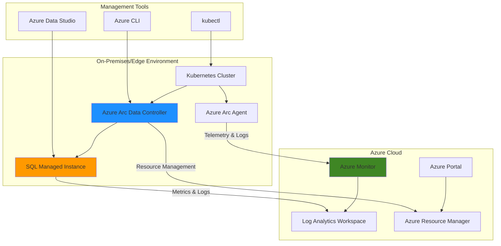

# Hybrid SQL Management with Arc-enabled Data Services

## Problem

Organizations with hybrid and multi-cloud infrastructures struggle to maintain consistent database management, monitoring, and governance across their distributed environments. Traditional SQL Server deployments on-premises lack the cloud-native capabilities like automatic scaling, centralized monitoring, and unified management that are standard in Azure. This fragmentation leads to increased operational complexity, inconsistent security policies, and difficulty in maintaining compliance across environments.

## Solution

Azure Arc-enabled Data Services provides a unified approach to deploying and managing SQL Managed Instance on any Kubernetes infrastructure while maintaining Azure-native capabilities. By combining Azure Arc with Azure Monitor, organizations can deploy SQL databases on-premises or edge locations while leveraging Azure's management plane for monitoring, governance, and operational insights. This solution enables consistent database management across hybrid environments with centralized monitoring and compliance.

## Architecture Diagram



## Prerequisites

1. Azure subscription with Owner or Contributor permissions
2. Kubernetes cluster (AKS, on-premises, or other cloud provider) with at least 4 vCPUs and 8GB RAM
3. Azure CLI v2.25.0 or later installed and configured
4. kubectl configured to access your Kubernetes cluster
5. Azure Data Studio or SQL Server Management Studio for database management
6. Estimated cost: $50-100/month for test environment (varies by region and usage)

> **Note**: This recipe assumes you have an existing Kubernetes cluster. If you need to create an AKS cluster, refer to the [AKS documentation](https://docs.microsoft.com/en-us/azure/aks/kubernetes-walkthrough) for setup instructions.

## Preparation

```bash
# Set environment variables for Azure resources
export RESOURCE_GROUP="rg-arc-data-services"
export LOCATION="eastus"
export SUBSCRIPTION_ID=$(az account show --query id --output tsv)
export ARC_DATA_CONTROLLER_NAME="arc-dc-controller"
export SQL_MI_NAME="sql-mi-arc"
export LOG_ANALYTICS_WORKSPACE="law-arc-monitoring"

# Generate unique suffix for resource names
RANDOM_SUFFIX=$(openssl rand -hex 3)
export RESOURCE_GROUP="${RESOURCE_GROUP}-${RANDOM_SUFFIX}"
export LOG_ANALYTICS_WORKSPACE="${LOG_ANALYTICS_WORKSPACE}-${RANDOM_SUFFIX}"

# Create resource group
az group create \
    --name ${RESOURCE_GROUP} \
    --location ${LOCATION} \
    --tags purpose=arc-data-services environment=demo

# Install Azure Arc data services CLI extension
az extension add --name arcdata

# Verify Kubernetes cluster connectivity
kubectl cluster-info

echo "✅ Environment prepared successfully"
```

## Steps

1. **Create Log Analytics Workspace for Monitoring**:

   Azure Monitor requires a Log Analytics workspace to collect and analyze telemetry data from Azure Arc-enabled data services. This workspace serves as the central repository for logs, metrics, and monitoring data from your hybrid SQL deployments, enabling advanced querying, alerting, and visualization capabilities that are essential for maintaining operational visibility across distributed environments.

   ```bash
   # Create Log Analytics workspace
   az monitor log-analytics workspace create \
       --resource-group ${RESOURCE_GROUP} \
       --workspace-name ${LOG_ANALYTICS_WORKSPACE} \
       --location ${LOCATION} \
       --sku PerGB2018

   # Get workspace ID and key for later configuration
   WORKSPACE_ID=$(az monitor log-analytics workspace show \
       --resource-group ${RESOURCE_GROUP} \
       --workspace-name ${LOG_ANALYTICS_WORKSPACE} \
       --query customerId --output tsv)

   WORKSPACE_KEY=$(az monitor log-analytics workspace get-shared-keys \
       --resource-group ${RESOURCE_GROUP} \
       --workspace-name ${LOG_ANALYTICS_WORKSPACE} \
       --query primarySharedKey --output tsv)

   echo "✅ Log Analytics workspace created: ${LOG_ANALYTICS_WORKSPACE}"
   echo "Workspace ID: ${WORKSPACE_ID}"
   ```

   The Log Analytics workspace is now configured to receive telemetry data from Azure Arc-enabled data services. This establishes the foundation for comprehensive monitoring and provides the data store for Azure Monitor dashboards and alerts.

2. **Create Azure Arc Data Controller**:

   The Azure Arc Data Controller acts as the foundational component that manages all Azure Arc-enabled data services within your Kubernetes cluster. It serves as the local control plane, handling resource provisioning, lifecycle management, and secure communication with Azure services while maintaining data residency and operational control over your infrastructure.

   ```bash
   # Create Arc data controller in indirect connectivity mode
   az arcdata dc create \
       --profile-name azure-arc-aks-premium-storage \
       --k8s-namespace arc \
       --name ${ARC_DATA_CONTROLLER_NAME} \
       --subscription ${SUBSCRIPTION_ID} \
       --resource-group ${RESOURCE_GROUP} \
       --location ${LOCATION} \
       --connectivity-mode indirect \
       --use-k8s

   # Wait for data controller to be ready
   kubectl wait --for=condition=Ready pod \
       --selector=app.kubernetes.io/name=controller \
       --namespace arc \
       --timeout=600s

   echo "✅ Azure Arc Data Controller created and ready"
   ```

   The Azure Arc Data Controller is now operational and ready to manage SQL Managed Instance deployments. This controller provides the hybrid management capabilities that enable Azure services to run on your Kubernetes infrastructure while maintaining cloud-native features and centralized governance.

3. **Deploy SQL Managed Instance with Arc Integration**:

   Azure Arc-enabled SQL Managed Instance provides near 100% compatibility with Azure SQL Database while running on your chosen infrastructure. This deployment model enables lift-and-shift scenarios for existing SQL Server workloads while providing cloud-native capabilities like automatic scaling, automated backups, and integrated monitoring without requiring changes to your applications.

   ```bash
   # Create SQL Managed Instance
   az sql mi-arc create \
       --name ${SQL_MI_NAME} \
       --k8s-namespace arc \
       --cores-request 2 \
       --cores-limit 4 \
       --memory-request 2Gi \
       --memory-limit 4Gi \
       --storage-class-data default \
       --storage-class-logs default \
       --storage-class-backups default \
       --volume-size-data 5Gi \
       --volume-size-logs 5Gi \
       --tier GeneralPurpose \
       --dev \
       --use-k8s

   # Wait for SQL MI to be ready
   kubectl wait --for=condition=Ready pod \
       --selector=app=${SQL_MI_NAME} \
       --namespace arc \
       --timeout=900s

   echo "✅ SQL Managed Instance deployed successfully"
   ```

   The SQL Managed Instance is now running on your Kubernetes cluster with Azure Arc integration. This provides a fully managed SQL Server experience with cloud-native capabilities while maintaining data residency and control over your infrastructure, enabling consistent database operations across hybrid environments.

4. **Configure Azure Monitor Integration**:

   Azure Monitor integration enables centralized monitoring and observability for your Arc-enabled SQL Managed Instance. This configuration establishes the telemetry pipeline that sends metrics, logs, and performance data to Azure Monitor, providing unified visibility across your hybrid infrastructure while maintaining secure data transmission through the Arc data controller.

   ```bash
   # Upload monitoring data to Azure Monitor
   az arcdata dc upload \
       --resource-group ${RESOURCE_GROUP} \
       --name ${ARC_DATA_CONTROLLER_NAME} \
       --k8s-namespace arc \
       --use-k8s

   # Configure Log Analytics workspace for monitoring
   az arcdata dc config init \
       --source azure-arc-aks-premium-storage \
       --path ./custom-config

   # Update config with Log Analytics workspace details
   az arcdata dc config add \
       --path ./custom-config \
       --json-values "spec.monitoring.logAnalyticsWorkspaceConfig.workspaceId=${WORKSPACE_ID}"

   az arcdata dc config add \
       --path ./custom-config \
       --json-values "spec.monitoring.logAnalyticsWorkspaceConfig.primaryKey=${WORKSPACE_KEY}"

   echo "✅ Azure Monitor integration configured"
   ```

   Azure Monitor is now configured to collect telemetry from your Arc-enabled data services. This enables comprehensive monitoring, alerting, and analytics capabilities through the Azure portal while maintaining your hybrid deployment model and ensuring secure data transmission.

5. **Set Up Database Monitoring and Alerts**:

   Proactive monitoring and alerting are essential for maintaining database performance and availability in hybrid environments. Azure Monitor provides sophisticated alerting capabilities that can notify administrators of performance issues, resource constraints, or security events across your distributed SQL deployments, enabling rapid response to operational challenges.

   ```bash
   # Create action group for alerts
   az monitor action-group create \
       --resource-group ${RESOURCE_GROUP} \
       --name "arc-sql-alerts" \
       --short-name "arcsql" \
       --email-receiver name="admin" email-address="admin@company.com"

   # Create CPU utilization alert rule
   az monitor metrics alert create \
       --resource-group ${RESOURCE_GROUP} \
       --name "arc-sql-high-cpu" \
       --description "High CPU usage on Arc SQL MI" \
       --severity 2 \
       --window-size 5m \
       --evaluation-frequency 1m \
       --action "arc-sql-alerts" \
       --condition "avg Percentage CPU > 80" \
       --scopes "/subscriptions/${SUBSCRIPTION_ID}/resourceGroups/${RESOURCE_GROUP}/providers/Microsoft.AzureArcData/sqlManagedInstances/${SQL_MI_NAME}"

   # Create storage space alert rule
   az monitor metrics alert create \
       --resource-group ${RESOURCE_GROUP} \
       --name "arc-sql-low-storage" \
       --description "Low storage space on Arc SQL MI" \
       --severity 1 \
       --window-size 5m \
       --evaluation-frequency 1m \
       --action "arc-sql-alerts" \
       --condition "avg Storage percent > 85" \
       --scopes "/subscriptions/${SUBSCRIPTION_ID}/resourceGroups/${RESOURCE_GROUP}/providers/Microsoft.AzureArcData/sqlManagedInstances/${SQL_MI_NAME}"

   echo "✅ Database monitoring and alerts configured"
   ```

   Comprehensive monitoring and alerting are now active for your Arc-enabled SQL Managed Instance. This proactive approach ensures rapid response to performance issues and maintains optimal database operation across your hybrid environment through automated notifications and centralized visibility.

6. **Configure Security and Governance**:

   Security and governance are critical aspects of hybrid database management that require consistent policy enforcement across distributed environments. Azure Arc enables centralized security policies, role-based access control, and compliance monitoring across your distributed database infrastructure, ensuring consistent security posture regardless of physical deployment location.

   ```bash
   # Enable Azure Policy for Arc-enabled resources
   az policy assignment create \
       --name "arc-sql-security-policy" \
       --display-name "Arc SQL Security Policy" \
       --policy "/providers/Microsoft.Authorization/policySetDefinitions/89c8a434-18f2-449b-9327-9579c0b9c2f2" \
       --scope "/subscriptions/${SUBSCRIPTION_ID}/resourceGroups/${RESOURCE_GROUP}"

   # Configure SQL authentication and security
   kubectl create secret generic sql-login-secret \
       --from-literal=username=arcadmin \
       --from-literal=password="MySecurePassword123!" \
       --namespace arc

   # Apply security configuration to SQL MI
   az sql mi-arc update \
       --name ${SQL_MI_NAME} \
       --k8s-namespace arc \
       --admin-login-secret sql-login-secret \
       --use-k8s

   echo "✅ Security and governance configured"
   ```

   Security policies and governance controls are now applied to your Arc-enabled SQL Managed Instance. This ensures consistent security standards and compliance monitoring across your hybrid database infrastructure, providing centralized policy enforcement while maintaining operational flexibility.

7. **Create Monitoring Dashboard**:

   Azure Monitor Workbooks provide customizable dashboards for visualizing database performance, resource utilization, and operational metrics across your hybrid infrastructure. These dashboards enable data-driven decision making and provide comprehensive insights into your distributed SQL environment through rich visualizations and interactive analytics.

   ```bash
   # Generate unique workbook name
   WORKBOOK_UUID=$(uuidgen)

   # Create custom monitoring workbook with JSON template
   cat > arc-sql-workbook.json << 'EOF'
   {
     "version": "Notebook/1.0",
     "items": [
       {
         "type": 1,
         "content": {
           "json": "# Azure Arc SQL Managed Instance Monitoring Dashboard\n\nThis dashboard provides comprehensive monitoring for your Arc-enabled SQL Managed Instance deployment."
         }
       },
       {
         "type": 3,
         "content": {
           "version": "KqlItem/1.0",
           "query": "Perf | where CounterName == \"Processor(_Total)\\\\% Processor Time\" | summarize avg(CounterValue) by bin(TimeGenerated, 5m)",
           "size": 0,
           "title": "CPU Utilization",
           "queryType": 0,
           "visualization": "timechart"
         }
       },
       {
         "type": 3,
         "content": {
           "version": "KqlItem/1.0",
           "query": "Perf | where CounterName == \"Memory\\\\Available MBytes\" | summarize avg(CounterValue) by bin(TimeGenerated, 5m)",
           "size": 0,
           "title": "Memory Usage",
           "queryType": 0,
           "visualization": "timechart"
         }
       }
     ]
   }
   EOF

   # Deploy workbook using Azure CLI
   az monitor app-insights workbook create \
       --resource-group ${RESOURCE_GROUP} \
       --name ${WORKBOOK_UUID} \
       --display-name "Arc SQL Monitoring Dashboard" \
       --category "workbook" \
       --serialized-data "$(cat arc-sql-workbook.json)" \
       --location ${LOCATION}

   echo "✅ Monitoring dashboard created with ID: ${WORKBOOK_UUID}"
   ```

   A comprehensive monitoring dashboard is now available in Azure Monitor, providing real-time insights into your Arc-enabled SQL Managed Instance performance and health. This dashboard enables proactive monitoring and performance optimization across your hybrid environment through centralized visualization and analytics.

## Validation & Testing

1. **Verify Arc Data Controller Status**:

   ```bash
   # Check data controller status
   az arcdata dc status show \
       --k8s-namespace arc \
       --use-k8s

   # Verify Kubernetes resources
   kubectl get pods -n arc
   kubectl get datacontroller -n arc
   ```

   Expected output: Data controller should show "Ready" status and all pods should be running.

2. **Test SQL Managed Instance Connectivity**:

   ```bash
   # Get SQL MI endpoint information
   az sql mi-arc show \
       --name ${SQL_MI_NAME} \
       --k8s-namespace arc \
       --use-k8s

   # Get external endpoint for connection
   SQL_ENDPOINT=$(kubectl get sqlmi ${SQL_MI_NAME} -n arc \
       -o jsonpath='{.status.endpoints.primary}')

   echo "SQL MI Endpoint: ${SQL_ENDPOINT}"

   # Test connectivity using sqlcmd (if available)
   # sqlcmd -S ${SQL_ENDPOINT} -U arcadmin -P "MySecurePassword123!" -Q "SELECT @@VERSION"
   ```

3. **Validate Monitoring Data Flow**:

   ```bash
   # Check monitoring data in Log Analytics
   az monitor log-analytics query \
       --workspace ${WORKSPACE_ID} \
       --analytics-query "AzureActivity | where ResourceProvider == 'Microsoft.AzureArcData' | take 10"

   # List available metrics for the SQL MI
   az monitor metrics list-definitions \
       --resource "/subscriptions/${SUBSCRIPTION_ID}/resourceGroups/${RESOURCE_GROUP}/providers/Microsoft.AzureArcData/sqlManagedInstances/${SQL_MI_NAME}"
   ```

4. **Test Database Operations**:

   ```bash
   # Verify SQL MI is accessible from within the cluster
   kubectl exec -n arc deployment/${SQL_MI_NAME} -- \
       /opt/mssql-tools/bin/sqlcmd -S localhost -U arcadmin -P "MySecurePassword123!" \
       -Q "SELECT name FROM sys.databases; SELECT @@VERSION"
   ```

## Cleanup

1. **Remove SQL Managed Instance**:

   ```bash
   # Delete SQL Managed Instance
   az sql mi-arc delete \
       --name ${SQL_MI_NAME} \
       --k8s-namespace arc \
       --use-k8s \
       --yes

   echo "✅ SQL Managed Instance deleted"
   ```

2. **Remove Azure Arc Data Controller**:

   ```bash
   # Delete Arc Data Controller
   az arcdata dc delete \
       --name ${ARC_DATA_CONTROLLER_NAME} \
       --k8s-namespace arc \
       --use-k8s \
       --yes

   # Clean up Kubernetes namespace
   kubectl delete namespace arc --ignore-not-found

   echo "✅ Arc Data Controller deleted"
   ```

3. **Remove Azure Resources**:

   ```bash
   # Delete entire resource group
   az group delete \
       --name ${RESOURCE_GROUP} \
       --yes \
       --no-wait

   echo "✅ Resource group deletion initiated: ${RESOURCE_GROUP}"
   echo "Note: Deletion may take several minutes to complete"
   ```

4. **Clean Up Local Configuration**:

   ```bash
   # Remove local configuration files
   rm -rf ./custom-config
   rm -f arc-sql-workbook.json

   # Uninstall Arc data CLI extension (optional)
   az extension remove --name arcdata

   echo "✅ Local cleanup completed"
   ```

## Discussion

Azure Arc-enabled Data Services represents a significant advancement in hybrid database management, enabling organizations to deploy Azure SQL capabilities on any Kubernetes infrastructure while maintaining centralized governance and monitoring. This architecture addresses the growing need for consistent database operations across distributed environments, from on-premises data centers to edge locations and multi-cloud deployments. The combination of Azure Arc with Azure Monitor creates a unified management experience that bridges the gap between cloud-native and traditional infrastructure models while adhering to the [Azure Well-Architected Framework](https://docs.microsoft.com/en-us/azure/architecture/framework/) principles.

The architectural approach demonstrated in this recipe focuses on operational excellence through automated monitoring and management, enabling organizations to apply consistent policies, security controls, and operational procedures across their entire database estate. By leveraging Azure Resource Manager APIs and Azure Monitor, organizations can maintain unified governance regardless of physical location, significantly reducing operational complexity and enabling centralized compliance management as outlined in the [Azure Arc data services documentation](https://docs.microsoft.com/en-us/azure/azure-arc/data/overview).

From a technical perspective, the integration between Azure Arc Data Controller and Azure Monitor provides comprehensive observability without requiring direct network connectivity from your databases to Azure services. The controller acts as a secure gateway, collecting telemetry and forwarding it to Azure Monitor while maintaining data sovereignty and security requirements. This design pattern is particularly valuable for organizations with strict compliance requirements or limited cloud connectivity, supporting both indirect and direct connectivity modes based on organizational needs.

The monitoring and alerting capabilities demonstrated in this recipe provide proactive operational insights that are essential for maintaining database performance and availability across hybrid environments. Azure Monitor's integration with Arc-enabled data services supports both real-time monitoring and historical analysis, enabling data-driven optimization decisions. For comprehensive monitoring strategies and best practices, refer to the [Azure Monitor documentation](https://docs.microsoft.com/en-us/azure/azure-monitor/) and [SQL Managed Instance monitoring guide](https://docs.microsoft.com/en-us/azure/azure-arc/data/monitoring-log-analytics-azure-portal-managed-instance).

> **Tip**: Use Azure Policy to enforce consistent security and compliance standards across all Arc-enabled resources. This ensures that security policies are automatically applied regardless of where your databases are deployed, maintaining consistent governance across your hybrid infrastructure while enabling centralized policy management and compliance reporting.

## Challenge

Extend this solution by implementing these enhancements:

1. **Implement automated disaster recovery** by setting up cross-region replication and failover procedures for your Arc-enabled SQL Managed Instance using Azure Site Recovery integration and automated backup strategies.

2. **Create advanced monitoring workflows** by implementing custom Azure Monitor queries, automated remediation actions using Azure Automation, and integration with Azure Logic Apps for complex operational scenarios and incident response.

3. **Establish multi-cluster management** by deploying multiple Arc Data Controllers across different Kubernetes clusters and implementing centralized governance policies through Azure Resource Graph queries and Azure Policy enforcement.

4. **Build DevOps integration** by creating CI/CD pipelines that automatically deploy database schema changes and application updates to Arc-enabled SQL instances using Azure DevOps or GitHub Actions with proper testing and rollback procedures.

5. **Implement advanced security controls** by integrating Azure Key Vault for secrets management, implementing Azure AD authentication with conditional access policies, and establishing network security policies with Azure Firewall for your Arc-enabled database infrastructure.

## Infrastructure Code

*Infrastructure code will be generated after recipe approval.*