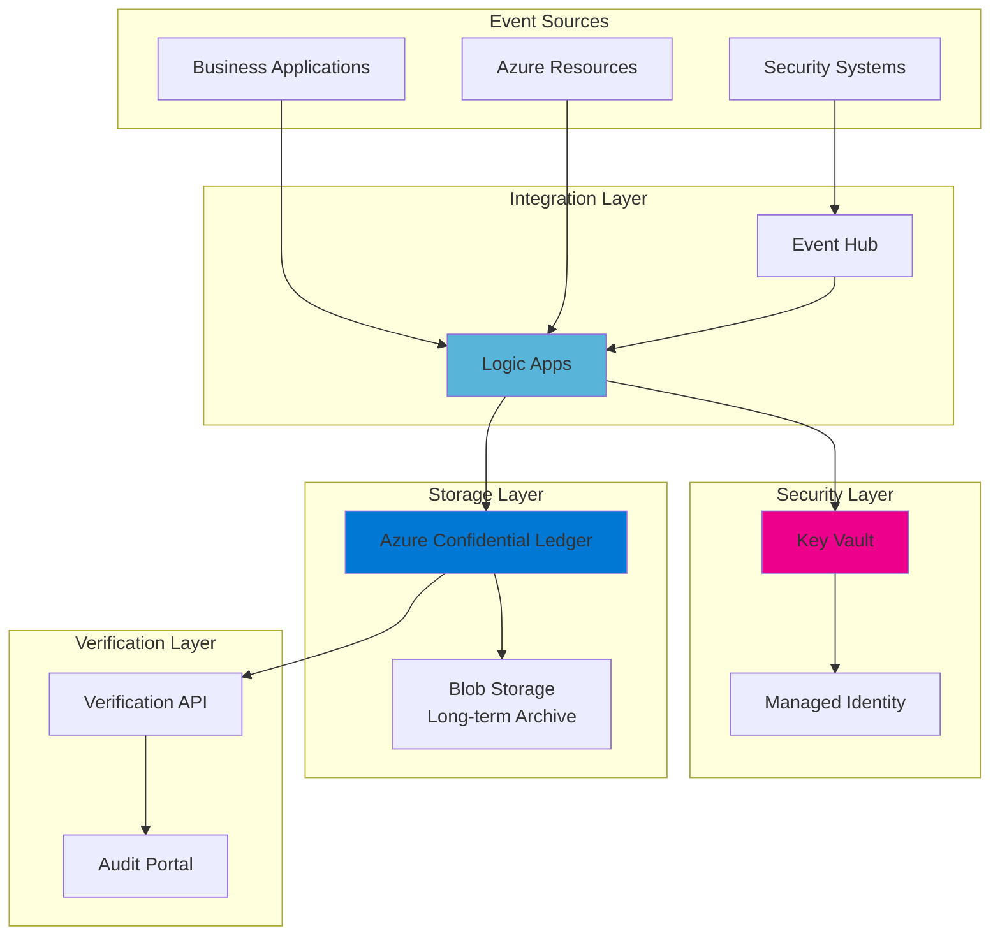

# Immutable Audit Trails with Blockchain Technology

## Problem

Organizations face increasing regulatory requirements to maintain tamper-proof audit trails for critical business operations, security events, and compliance activities. Traditional logging systems are vulnerable to insider threats, data manipulation, and lack cryptographic proof of integrity, making it difficult to prove that audit records have not been altered after creation.

## Solution

Implement a blockchain-based immutable audit trail system using Azure Confidential Ledger for cryptographically secure storage, Azure Logic Apps for automated event capture and workflow orchestration, and Azure Key Vault for secure credential management. This architecture provides tamper-proof audit logging with cryptographic verification capabilities.

## Architecture Diagram



## Prerequisites

1. Azure account with Owner or Contributor permissions at the subscription level
2. Azure CLI installed and configured (version 2.50.0 or later)
3. Basic understanding of blockchain concepts and audit logging requirements
4. Familiarity with Azure Logic Apps workflow design
5. Estimated cost: ~$150-200/month for moderate usage (10,000 transactions/day)

> **Note**: Azure Confidential Ledger requires a minimum of 3 nodes for consensus, which contributes to the base cost regardless of transaction volume.

## Preparation

```bash
# Set environment variables for Azure resources
export RESOURCE_GROUP="rg-audit-trail-${RANDOM_SUFFIX}"
export LOCATION="eastus"
export SUBSCRIPTION_ID=$(az account show --query id --output tsv)

# Generate unique suffix for resource names
RANDOM_SUFFIX=$(openssl rand -hex 3)

# Create resource group
az group create \
    --name ${RESOURCE_GROUP} \
    --location ${LOCATION} \
    --tags purpose=audit-trail environment=demo

echo "✅ Resource group created: ${RESOURCE_GROUP}"

# Set additional variables
export LEDGER_NAME="acl-${RANDOM_SUFFIX}"
export KEYVAULT_NAME="kv-audit-${RANDOM_SUFFIX}"
export LOGIC_APP_NAME="la-audit-${RANDOM_SUFFIX}"
export EVENT_HUB_NAMESPACE="eh-audit-${RANDOM_SUFFIX}"
export STORAGE_ACCOUNT="staudit${RANDOM_SUFFIX}"

# Register Azure Confidential Ledger resource provider
az provider register --namespace "microsoft.ConfidentialLedger"

# Verify registration
az provider show --namespace "microsoft.ConfidentialLedger" \
    --query "registrationState" --output tsv
```

## Steps

1. **Create Azure Key Vault for Secure Credential Storage**:

   Azure Key Vault provides centralized, secure storage for application secrets, certificates, and keys with hardware security module (HSM) backing. In this audit trail architecture, Key Vault will store the Confidential Ledger access credentials and certificates, ensuring that sensitive authentication information is never exposed in application code or configuration files. This managed service integrates with Azure AD for authentication and provides comprehensive audit logging of all access attempts, following Azure Well-Architected Framework security principles.

   ```bash
   # Create Key Vault with soft delete and purge protection
   az keyvault create \
       --name ${KEYVAULT_NAME} \
       --resource-group ${RESOURCE_GROUP} \
       --location ${LOCATION} \
       --sku standard \
       --enable-soft-delete true \
       --enable-purge-protection true \
       --retention-days 90
   
   # Enable logging for Key Vault operations
   KEYVAULT_ID=$(az keyvault show \
       --name ${KEYVAULT_NAME} \
       --resource-group ${RESOURCE_GROUP} \
       --query id --output tsv)
   
   echo "✅ Key Vault created with enhanced security: ${KEYVAULT_NAME}"
   ```

   The Key Vault now provides a secure foundation for managing cryptographic materials. Soft delete and purge protection ensure that accidentally deleted secrets can be recovered, while the 90-day retention period meets most compliance requirements for audit trail systems.

2. **Deploy Azure Confidential Ledger**:

   Azure Confidential Ledger represents a breakthrough in secure, immutable data storage by combining blockchain technology with hardware-backed secure enclaves. Each transaction is cryptographically linked to previous entries, creating an unbreakable chain of records that can be mathematically verified. The service runs exclusively within Intel SGX enclaves, ensuring that even Microsoft administrators cannot access or modify the data.

   ```bash
   # Create Confidential Ledger with AAD-based security principals
   az confidentialledger create \
       --name ${LEDGER_NAME} \
       --resource-group ${RESOURCE_GROUP} \
       --location ${LOCATION} \
       --ledger-type Public \
       --aad-based-security-principals \
           object-id=$(az ad signed-in-user show --query id -o tsv) \
           ledger-role-name="Administrator"
   
   # Wait for ledger deployment (this can take 5-10 minutes)
   echo "⏳ Waiting for Confidential Ledger deployment..."
   az confidentialledger wait \
       --name ${LEDGER_NAME} \
       --resource-group ${RESOURCE_GROUP} \
       --created
   
   # Get ledger endpoint
   LEDGER_ENDPOINT=$(az confidentialledger show \
       --name ${LEDGER_NAME} \
       --resource-group ${RESOURCE_GROUP} \
       --query properties.ledgerUri --output tsv)
   
   echo "✅ Confidential Ledger deployed: ${LEDGER_ENDPOINT}"
   ```

   The Confidential Ledger is now operational with blockchain consensus across multiple nodes. The "Public" ledger type means transactions are stored in plaintext (but still immutable), which is appropriate for audit trails that may need to be reviewed by auditors. For sensitive data, consider using the "Private" ledger type with encryption.

3. **Configure Event Hub for High-Volume Event Ingestion**:

   Azure Event Hubs provides a scalable event streaming platform capable of ingesting millions of events per second with automatic scaling and load balancing. In this architecture, Event Hubs acts as a buffer between event sources and the audit processing logic, ensuring that sudden spikes in audit events don't overwhelm the system. The partitioned architecture enables parallel processing while maintaining event ordering within each partition, supporting enterprise-scale audit event processing.

   ```bash
   # Create Event Hub namespace
   az eventhubs namespace create \
       --name ${EVENT_HUB_NAMESPACE} \
       --resource-group ${RESOURCE_GROUP} \
       --location ${LOCATION} \
       --sku Standard \
       --capacity 1
   
   # Create Event Hub with multiple partitions for scalability
   az eventhubs eventhub create \
       --name audit-events \
       --namespace-name ${EVENT_HUB_NAMESPACE} \
       --resource-group ${RESOURCE_GROUP} \
       --partition-count 4 \
       --message-retention 1
   
   # Create consumer group for Logic Apps
   az eventhubs eventhub consumer-group create \
       --consumer-group-name logic-apps-consumer \
       --eventhub-name audit-events \
       --namespace-name ${EVENT_HUB_NAMESPACE} \
       --resource-group ${RESOURCE_GROUP}
   
   echo "✅ Event Hub configured for audit event streaming"
   ```

   The Event Hub is now ready to receive high volumes of audit events with built-in retention and replay capabilities. The consumer group ensures that Logic Apps can process events independently without affecting other potential consumers.

4. **Create Storage Account for Long-term Archive**:

   While Confidential Ledger provides immutable audit trails, organizations often need to archive audit data for extended periods to meet regulatory requirements. Azure Storage with immutable blob storage policies and versioning ensures that archived audit records cannot be modified or deleted during the retention period. This dual-storage approach balances the cryptographic integrity of active audits with cost-effective long-term retention, following Azure cost optimization best practices.

   ```bash
   # Create storage account with hierarchical namespace
   az storage account create \
       --name ${STORAGE_ACCOUNT} \
       --resource-group ${RESOURCE_GROUP} \
       --location ${LOCATION} \
       --sku Standard_LRS \
       --kind StorageV2 \
       --hierarchical-namespace true
   
   # Create container for audit archives
   az storage container create \
       --name audit-archive \
       --account-name ${STORAGE_ACCOUNT} \
       --auth-mode login
   
   # Enable versioning for additional protection
   az storage account blob-service-properties update \
       --account-name ${STORAGE_ACCOUNT} \
       --enable-versioning true
   
   echo "✅ Archive storage configured with versioning enabled"
   ```

   The storage account now provides cost-effective archival capabilities with Data Lake Storage Gen2 features enabled for analytics workloads.

5. **Deploy Logic App for Workflow Orchestration**:

   Azure Logic Apps provides the serverless workflow orchestration engine that captures events, enriches them with contextual information, and writes them to the Confidential Ledger. This low-code integration platform eliminates the need for custom development while providing enterprise-grade reliability, monitoring, and automatic scaling. The visual designer makes it easy to modify audit workflows as business requirements evolve, supporting agile compliance management.

   ```bash
   # Install Logic Apps extension if not already installed
   az extension add --name logic --only-show-errors || true
   
   # Create Logic App workflow with minimal definition
   az logic workflow create \
       --name ${LOGIC_APP_NAME} \
       --resource-group ${RESOURCE_GROUP} \
       --location ${LOCATION} \
       --definition '{
         "definition": {
           "$schema": "https://schema.management.azure.com/providers/Microsoft.Logic/schemas/2016-06-01/workflowdefinition.json#",
           "contentVersion": "1.0.0.0",
           "triggers": {},
           "actions": {},
           "outputs": {}
         }
       }'
   
   # Enable managed identity for secure authentication
   az logic workflow identity assign \
       --name ${LOGIC_APP_NAME} \
       --resource-group ${RESOURCE_GROUP}
   
   LOGIC_APP_IDENTITY=$(az logic workflow show \
       --name ${LOGIC_APP_NAME} \
       --resource-group ${RESOURCE_GROUP} \
       --query identity.principalId --output tsv)
   
   echo "✅ Logic App created with managed identity: ${LOGIC_APP_IDENTITY}"
   ```

   The Logic App is now deployed with a system-assigned managed identity, providing secure access to other Azure resources without managing credentials.

6. **Configure Access Permissions and RBAC**:

   Implementing proper access control is crucial for maintaining the integrity of audit trails and following the principle of least privilege. Azure's Role-Based Access Control (RBAC) ensures that only authorized services and users can write to the ledger, while read access can be granted to auditors and compliance officers. This security model prevents unauthorized modifications while enabling necessary oversight and compliance reporting.

   ```bash
   # Grant Logic App access to Key Vault
   az keyvault set-policy \
       --name ${KEYVAULT_NAME} \
       --object-id ${LOGIC_APP_IDENTITY} \
       --secret-permissions get list
   
   # Grant Logic App access to Event Hub
   az role assignment create \
       --assignee ${LOGIC_APP_IDENTITY} \
       --role "Azure Event Hubs Data Receiver" \
       --scope "/subscriptions/${SUBSCRIPTION_ID}/resourceGroups/${RESOURCE_GROUP}/providers/Microsoft.EventHub/namespaces/${EVENT_HUB_NAMESPACE}"
   
   # Grant Logic App access to Storage Account
   az role assignment create \
       --assignee ${LOGIC_APP_IDENTITY} \
       --role "Storage Blob Data Contributor" \
       --scope "/subscriptions/${SUBSCRIPTION_ID}/resourceGroups/${RESOURCE_GROUP}/providers/Microsoft.Storage/storageAccounts/${STORAGE_ACCOUNT}"
   
   echo "✅ RBAC permissions configured for secure access"
   ```

   The managed identity now has the minimum necessary permissions to perform audit operations while maintaining security boundaries.

7. **Store Ledger Connection Information in Key Vault**:

   Storing connection strings and endpoints in Key Vault ensures that sensitive configuration data is never hard-coded or exposed in application settings. This approach also enables credential rotation without modifying application code, supporting security best practices for production systems and compliance with data protection regulations.

   ```bash
   # Store ledger endpoint in Key Vault
   az keyvault secret set \
       --vault-name ${KEYVAULT_NAME} \
       --name "ledger-endpoint" \
       --value "${LEDGER_ENDPOINT}"
   
   # Store Event Hub connection string
   EH_CONNECTION=$(az eventhubs namespace authorization-rule keys list \
       --resource-group ${RESOURCE_GROUP} \
       --namespace-name ${EVENT_HUB_NAMESPACE} \
       --name RootManageSharedAccessKey \
       --query primaryConnectionString --output tsv)
   
   az keyvault secret set \
       --vault-name ${KEYVAULT_NAME} \
       --name "eventhub-connection" \
       --value "${EH_CONNECTION}"
   
   echo "✅ Connection information securely stored in Key Vault"
   ```

   All sensitive connection information is now centrally managed and audited through Key Vault.

8. **Create Sample Audit Entry to Validate Configuration**:

   Testing the audit trail system with a sample entry validates that all components are properly configured and can communicate effectively. This verification step is essential before connecting production systems to ensure that audit events will be reliably captured and stored with proper integrity guarantees.

   ```bash
   # Create a test audit entry structure
   AUDIT_ENTRY='{
     "eventType": "SystemConfiguration",
     "timestamp": "'$(date -u +%Y-%m-%dT%H:%M:%SZ)'",
     "actor": "admin@company.com",
     "action": "CreateAuditTrailSystem",
     "resource": "AzureConfidentialLedger",
     "result": "Success",
     "details": "Initial audit trail system deployment"
   }'
   
   # Store in temporary file for validation
   echo ${AUDIT_ENTRY} > test-audit.json
   
   echo "✅ Test audit entry created for validation"
   ```

   The sample audit entry demonstrates the expected structure and format for production audit events.

## Validation & Testing

1. Verify Confidential Ledger is operational:

   ```bash
   # Check ledger status and properties
   az confidentialledger show \
       --name ${LEDGER_NAME} \
       --resource-group ${RESOURCE_GROUP} \
       --query "{Name:name, State:properties.provisioningState, Endpoint:properties.ledgerUri}"
   ```

   Expected output: A JSON object showing the ledger name, "Succeeded" state, and the HTTPS endpoint URL.

2. Test Key Vault secret retrieval:

   ```bash
   # Retrieve stored ledger endpoint
   az keyvault secret show \
       --vault-name ${KEYVAULT_NAME} \
       --name "ledger-endpoint" \
       --query value --output tsv
   ```

   Expected output: The Confidential Ledger endpoint URL matching the one from step 2.

3. Verify Event Hub configuration:

   ```bash
   # Check Event Hub details and consumer groups
   az eventhubs eventhub show \
       --name audit-events \
       --namespace-name ${EVENT_HUB_NAMESPACE} \
       --resource-group ${RESOURCE_GROUP} \
       --query "{Name:name, PartitionCount:partitionCount, Status:status}"
   ```

   Expected output: Event Hub details showing 4 partitions and "Active" status.

4. Validate Logic App workflow status:

   ```bash
   # Check Logic App workflow and identity
   az logic workflow show \
       --name ${LOGIC_APP_NAME} \
       --resource-group ${RESOURCE_GROUP} \
       --query "{Name:name, State:properties.state, Identity:identity.type}"
   ```

   Expected output: Logic App showing "Enabled" state and "SystemAssigned" identity type.

## Cleanup

1. Delete the resource group and all resources:

   ```bash
   # Delete resource group (this removes all resources)
   az group delete \
       --name ${RESOURCE_GROUP} \
       --yes \
       --no-wait
   
   echo "✅ Resource group deletion initiated: ${RESOURCE_GROUP}"
   echo "Note: Deletion may take 5-10 minutes to complete"
   ```

2. Verify deletion status:

   ```bash
   # Check if resource group still exists
   az group exists --name ${RESOURCE_GROUP}
   ```

   Expected output: "false" when deletion is complete.

3. Clean up local files:

   ```bash
   # Remove temporary test files
   rm -f test-audit.json
   
   # Clear environment variables
   unset RESOURCE_GROUP LOCATION SUBSCRIPTION_ID RANDOM_SUFFIX
   unset LEDGER_NAME KEYVAULT_NAME LOGIC_APP_NAME EVENT_HUB_NAMESPACE STORAGE_ACCOUNT
   
   echo "✅ Local cleanup completed"
   ```

## Discussion

Azure Confidential Ledger fundamentally changes how organizations approach audit trail integrity by leveraging blockchain technology within hardware-backed secure enclaves. Unlike traditional logging systems that rely on access controls and backup strategies, Confidential Ledger provides mathematical proof that audit records have not been tampered with since creation. This cryptographic guarantee is particularly valuable for regulatory compliance scenarios where organizations must prove the authenticity of their audit trails. The service follows the Azure Well-Architected Framework security pillar by implementing defense in depth with hardware-level security guarantees. For detailed architecture guidance, see the [Azure Confidential Ledger documentation](https://docs.microsoft.com/en-us/azure/confidential-ledger/overview).

The integration with Azure Logic Apps enables sophisticated event processing workflows without requiring custom code development. Logic Apps can enrich audit events with contextual information, route different event types to appropriate storage tiers, and trigger alerts for suspicious activities. This serverless approach ensures automatic scaling and high availability while reducing operational overhead. The managed connector ecosystem allows integration with hundreds of services and systems, making it ideal for complex enterprise environments. The [Logic Apps security documentation](https://docs.microsoft.com/en-us/azure/logic-apps/logic-apps-securing-a-logic-app) provides comprehensive guidance on securing workflows and managing sensitive data.

From a cost optimization perspective, the architecture balances the higher cost of Confidential Ledger's blockchain consensus with economical long-term storage in Azure Blob Storage. Active audit trails requiring cryptographic verification remain in the ledger, while historical records can be archived to immutable blob storage with legal hold policies. This tiered approach can reduce costs by 60-80% compared to keeping all audit data in the ledger indefinitely while maintaining compliance requirements. The Event Hubs integration provides cost-effective buffering for high-volume scenarios. Review the [Azure Well-Architected Framework](https://docs.microsoft.com/en-us/azure/architecture/framework/) for additional cost optimization strategies and the [Azure pricing calculator](https://azure.microsoft.com/en-us/pricing/calculator/) for detailed cost planning.

> **Tip**: Use Azure Monitor and Log Analytics to track Confidential Ledger transaction rates and identify optimization opportunities. Setting up alerts for unusual activity patterns can help detect potential security incidents early while maintaining audit trail integrity. The [Azure Monitor documentation](https://docs.microsoft.com/en-us/azure/azure-monitor/) provides detailed guidance on creating custom dashboards and alerts for blockchain-based audit systems.

## Challenge

Extend this solution by implementing these enhancements:

1. Create a custom Logic Apps connector for Confidential Ledger that supports batch transaction submission and automatic retry logic for improved performance and cost efficiency.
2. Implement a React-based audit trail viewer that verifies transaction receipts using the Confidential Ledger SDK and displays the blockchain visualization with cryptographic proof validation.
3. Add Azure Cognitive Services integration to automatically classify and tag audit events based on their content, enabling advanced analytics, anomaly detection, and compliance reporting.
4. Build a multi-region deployment with ledger replication for disaster recovery while maintaining cryptographic integrity across regions using Azure Traffic Manager and regional failover.
5. Develop a compliance reporting module that generates SOC 2, ISO 27001, and GDPR audit reports directly from the immutable audit trail data with automated evidence collection.

## Infrastructure Code

### Available Infrastructure as Code:

- [Infrastructure Code Overview](code/README.md) - Detailed description of all infrastructure components
- [Bicep](code/bicep/) - Azure Bicep templates
- [Bash CLI Scripts](code/scripts/) - Example bash scripts using Azure CLI commands to deploy infrastructure
- [Terraform](code/terraform/) - Terraform configuration files