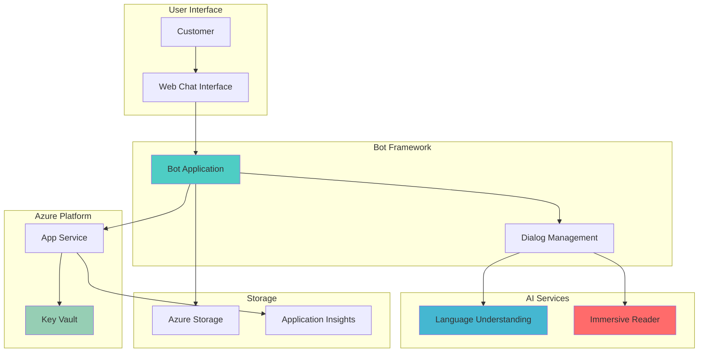

# Inclusive AI Chatbots with Accessibility Features

## Problem

Customer service organizations struggle to provide inclusive support experiences for users with diverse reading abilities, learning differences, and language barriers. Traditional chatbots often present complex text responses that can be overwhelming for users with dyslexia, visual processing difficulties, or limited language proficiency. This creates accessibility barriers that prevent many customers from effectively using self-service support channels, leading to increased support costs and reduced customer satisfaction.

## Solution

Azure Immersive Reader integrated with Azure Bot Framework creates an inclusive customer service chatbot that automatically enhances text readability and accessibility. This solution combines natural language understanding with advanced reading assistance features including text-to-speech, visual focus tools, translation capabilities, and syllable breakdown to ensure all users can effectively interact with customer service content regardless of their reading abilities or language preferences.

## Architecture Diagram



## Prerequisites

1. Azure subscription with appropriate permissions for AI services, App Service, and Key Vault
2. Azure CLI v2.50.0 or later installed and configured
3. Node.js 18.x or later for Bot Framework development
4. Basic understanding of conversational AI and accessibility principles
5. Familiarity with REST APIs and web application deployment
6. Estimated cost: $15-30 per month for development and testing resources

> **Note**: Azure Immersive Reader is available in multiple regions but may have specific regional limitations. Verify service availability in your target deployment region before proceeding.

## Preparation

```bash
# Set environment variables for Azure resources
export RESOURCE_GROUP="rg-accessible-bot-${RANDOM_SUFFIX}"
export LOCATION="eastus"
export SUBSCRIPTION_ID=$(az account show --query id --output tsv)
export BOT_NAME="accessible-customer-bot"
export APP_SERVICE_PLAN="asp-accessible-bot"

# Generate unique suffix for resource names
RANDOM_SUFFIX=$(openssl rand -hex 3)
export IMMERSIVE_READER_NAME="immersive-reader-${RANDOM_SUFFIX}"
export LUIS_APP_NAME="customer-service-luis-${RANDOM_SUFFIX}"
export KEY_VAULT_NAME="kv-bot-${RANDOM_SUFFIX}"
export STORAGE_ACCOUNT_NAME="stbot${RANDOM_SUFFIX}"
export APP_SERVICE_NAME="app-accessible-bot-${RANDOM_SUFFIX}"

# Create resource group with accessibility tags
az group create \
    --name ${RESOURCE_GROUP} \
    --location ${LOCATION} \
    --tags purpose=accessibility-demo \
           environment=development \
           compliance=accessibility

echo "✅ Resource group created: ${RESOURCE_GROUP}"
```

## Steps

1. **Create Azure Immersive Reader Resource**:

   Azure Immersive Reader provides inclusive reading capabilities that transform text into accessible formats with features like text-to-speech, visual focus tools, and translation support. This cognitive service is specifically designed to help users with dyslexia, emerging readers, and language learners by applying proven techniques to improve reading comprehension and accessibility.

   ```bash
   # Create Immersive Reader cognitive service
   az cognitiveservices account create \
       --name ${IMMERSIVE_READER_NAME} \
       --resource-group ${RESOURCE_GROUP} \
       --location ${LOCATION} \
       --kind ImmersiveReader \
       --sku S0 \
       --custom-domain ${IMMERSIVE_READER_NAME} \
       --tags purpose=accessibility service=immersive-reader
   
   # Retrieve Immersive Reader endpoint and key
   IMMERSIVE_READER_ENDPOINT=$(az cognitiveservices account show \
       --name ${IMMERSIVE_READER_NAME} \
       --resource-group ${RESOURCE_GROUP} \
       --query "properties.endpoint" \
       --output tsv)
   
   IMMERSIVE_READER_KEY=$(az cognitiveservices account keys list \
       --name ${IMMERSIVE_READER_NAME} \
       --resource-group ${RESOURCE_GROUP} \
       --query "key1" \
       --output tsv)
   
   echo "✅ Immersive Reader service created with endpoint: ${IMMERSIVE_READER_ENDPOINT}"
   ```

   The Immersive Reader resource now provides the foundation for accessible text processing. This service automatically applies reading assistance features like syllable breakdown, part-of-speech highlighting, and multi-language support to enhance comprehension for users with diverse learning needs.

2. **Create Language Understanding (LUIS) Application**:

   Language Understanding (LUIS) enables the chatbot to comprehend user intents and extract meaningful entities from customer service inquiries. This AI service processes natural language input to identify specific customer needs, support categories, and contextual information that drives appropriate bot responses and accessibility features.

   ```bash
   # Create LUIS authoring resource
   az cognitiveservices account create \
       --name ${LUIS_APP_NAME} \
       --resource-group ${RESOURCE_GROUP} \
       --location ${LOCATION} \
       --kind LUIS.Authoring \
       --sku F0 \
       --tags purpose=language-understanding service=luis
   
   # Create LUIS runtime resource  
   az cognitiveservices account create \
       --name "${LUIS_APP_NAME}-runtime" \
       --resource-group ${RESOURCE_GROUP} \
       --location ${LOCATION} \
       --kind LUIS \
       --sku S0 \
       --tags purpose=language-understanding service=luis-runtime
   
   # Get LUIS authoring key and endpoint
   LUIS_AUTHORING_KEY=$(az cognitiveservices account keys list \
       --name ${LUIS_APP_NAME} \
       --resource-group ${RESOURCE_GROUP} \
       --query "key1" \
       --output tsv)
   
   LUIS_AUTHORING_ENDPOINT=$(az cognitiveservices account show \
       --name ${LUIS_APP_NAME} \
       --resource-group ${RESOURCE_GROUP} \
       --query "properties.endpoint" \
       --output tsv)
   
   echo "✅ LUIS authoring resource created with endpoint: ${LUIS_AUTHORING_ENDPOINT}"
   ```

   The Language Understanding service is now configured to process customer service intents. This enables the bot to understand various support requests, accessibility preferences, and user needs while maintaining context throughout the conversation.

3. **Create Azure Key Vault for Secure Configuration**:

   Azure Key Vault provides secure, centralized storage for sensitive configuration data including API keys, connection strings, and service endpoints. This approach follows security best practices by avoiding hardcoded secrets in application code and enabling secure access management for bot credentials.

   ```bash
   # Create Key Vault with access policies
   az keyvault create \
       --name ${KEY_VAULT_NAME} \
       --resource-group ${RESOURCE_GROUP} \
       --location ${LOCATION} \
       --sku standard \
       --enable-rbac-authorization false \
       --tags purpose=secure-configuration service=key-vault
   
   # Store Immersive Reader credentials
   az keyvault secret set \
       --vault-name ${KEY_VAULT_NAME} \
       --name "ImmersiveReaderKey" \
       --value ${IMMERSIVE_READER_KEY}
   
   az keyvault secret set \
       --vault-name ${KEY_VAULT_NAME} \
       --name "ImmersiveReaderEndpoint" \
       --value ${IMMERSIVE_READER_ENDPOINT}
   
   # Store LUIS credentials
   az keyvault secret set \
       --vault-name ${KEY_VAULT_NAME} \
       --name "LuisAuthoringKey" \
       --value ${LUIS_AUTHORING_KEY}
   
   az keyvault secret set \
       --vault-name ${KEY_VAULT_NAME} \
       --name "LuisAuthoringEndpoint" \
       --value ${LUIS_AUTHORING_ENDPOINT}
   
   echo "✅ Key Vault created and secrets stored securely"
   ```

   Key Vault now securely manages all sensitive configuration data for the accessible bot solution. This centralized approach ensures proper credential rotation, audit logging, and secure access control for production deployments.

4. **Create Storage Account for Bot State Management**:

   Azure Storage provides persistent state management for bot conversations, user preferences, and accessibility settings. This storage layer maintains conversation context and user-specific configurations like preferred reading assistance settings, ensuring personalized accessibility experiences across sessions.

   ```bash
   # Create storage account for bot state
   az storage account create \
       --name ${STORAGE_ACCOUNT_NAME} \
       --resource-group ${RESOURCE_GROUP} \
       --location ${LOCATION} \
       --sku Standard_LRS \
       --kind StorageV2 \
       --access-tier Hot \
       --tags purpose=bot-state service=storage
   
   # Get storage connection string
   STORAGE_CONNECTION_STRING=$(az storage account show-connection-string \
       --name ${STORAGE_ACCOUNT_NAME} \
       --resource-group ${RESOURCE_GROUP} \
       --query "connectionString" \
       --output tsv)
   
   # Store connection string in Key Vault
   az keyvault secret set \
       --vault-name ${KEY_VAULT_NAME} \
       --name "StorageConnectionString" \
       --value "${STORAGE_CONNECTION_STRING}"
   
   echo "✅ Storage account created for bot state management"
   ```

   The storage account is now configured to maintain conversation state and user preferences. This enables the bot to remember accessibility settings, conversation history, and personalized configurations that enhance the user experience across multiple interactions.

5. **Create App Service Plan and Web App**:

   Azure App Service provides the hosting platform for the Bot Framework application with built-in scaling, security, and monitoring capabilities. This managed service eliminates infrastructure management while providing enterprise-grade hosting for the accessible customer service bot with integrated CI/CD and monitoring features.

   ```bash
   # Create App Service Plan
   az appservice plan create \
       --name ${APP_SERVICE_PLAN} \
       --resource-group ${RESOURCE_GROUP} \
       --location ${LOCATION} \
       --sku B1 \
       --is-linux \
       --tags purpose=bot-hosting service=app-service
   
   # Create Web App
   az webapp create \
       --name ${APP_SERVICE_NAME} \
       --resource-group ${RESOURCE_GROUP} \
       --plan ${APP_SERVICE_PLAN} \
       --runtime "NODE:18-lts" \
       --tags purpose=accessible-bot service=web-app
   
   # Configure App Service for Key Vault access
   az webapp identity assign \
       --name ${APP_SERVICE_NAME} \
       --resource-group ${RESOURCE_GROUP}
   
   # Get managed identity principal ID
   PRINCIPAL_ID=$(az webapp identity show \
       --name ${APP_SERVICE_NAME} \
       --resource-group ${RESOURCE_GROUP} \
       --query "principalId" \
       --output tsv)
   
   # Grant Key Vault access to Web App
   az keyvault set-policy \
       --name ${KEY_VAULT_NAME} \
       --object-id ${PRINCIPAL_ID} \
       --secret-permissions get list
   
   echo "✅ App Service created with Key Vault access configured"
   ```

   The App Service is now ready to host the accessible bot application with secure access to configuration secrets. This managed hosting environment provides automatic scaling, security updates, and integrated monitoring for reliable bot operations.

6. **Create Bot Framework Registration**:

   Azure Bot Framework registration establishes the bot identity and communication channels, enabling integration with multiple platforms while maintaining consistent accessibility features. This registration provides the foundation for multi-channel deployment including web chat, Microsoft Teams, and other communication platforms.

   ```bash
   # Create Bot Framework registration
   az bot create \
       --name ${BOT_NAME} \
       --resource-group ${RESOURCE_GROUP} \
       --kind registration \
       --endpoint "https://${APP_SERVICE_NAME}.azurewebsites.net/api/messages" \
       --msi-resource-group ${RESOURCE_GROUP} \
       --tags purpose=accessible-bot service=bot-framework
   
   # Get bot application ID
   BOT_APP_ID=$(az bot show \
       --name ${BOT_NAME} \
       --resource-group ${RESOURCE_GROUP} \
       --query "properties.msaAppId" \
       --output tsv)
   
   # Store bot credentials in Key Vault
   az keyvault secret set \
       --vault-name ${KEY_VAULT_NAME} \
       --name "BotAppId" \
       --value ${BOT_APP_ID}
   
   echo "✅ Bot Framework registration created: ${BOT_NAME}"
   ```

   The Bot Framework registration is now configured to enable secure communication between the bot application and Azure services. This provides the identity foundation for multi-channel deployment while maintaining consistent accessibility features across all communication platforms.

7. **Configure Application Settings**:

   Application settings configure the Web App with necessary environment variables and Key Vault references for secure configuration management. This approach enables the bot application to access required services while maintaining security best practices and supporting different deployment environments.

   ```bash
   # Configure Web App settings with Key Vault references
   az webapp config appsettings set \
       --name ${APP_SERVICE_NAME} \
       --resource-group ${RESOURCE_GROUP} \
       --settings \
       "MicrosoftAppId=@Microsoft.KeyVault(VaultName=${KEY_VAULT_NAME};SecretName=BotAppId)" \
       "ImmersiveReaderKey=@Microsoft.KeyVault(VaultName=${KEY_VAULT_NAME};SecretName=ImmersiveReaderKey)" \
       "ImmersiveReaderEndpoint=@Microsoft.KeyVault(VaultName=${KEY_VAULT_NAME};SecretName=ImmersiveReaderEndpoint)" \
       "LuisAuthoringKey=@Microsoft.KeyVault(VaultName=${KEY_VAULT_NAME};SecretName=LuisAuthoringKey)" \
       "LuisAuthoringEndpoint=@Microsoft.KeyVault(VaultName=${KEY_VAULT_NAME};SecretName=LuisAuthoringEndpoint)" \
       "StorageConnectionString=@Microsoft.KeyVault(VaultName=${KEY_VAULT_NAME};SecretName=StorageConnectionString)" \
       "NODE_ENV=production"
   
   # Enable Application Insights for monitoring
   az monitor app-insights component create \
       --app ${APP_SERVICE_NAME} \
       --location ${LOCATION} \
       --resource-group ${RESOURCE_GROUP} \
       --tags purpose=monitoring service=app-insights
   
   # Get Application Insights instrumentation key
   APPINSIGHTS_KEY=$(az monitor app-insights component show \
       --app ${APP_SERVICE_NAME} \
       --resource-group ${RESOURCE_GROUP} \
       --query "instrumentationKey" \
       --output tsv)
   
   # Add Application Insights to Web App
   az webapp config appsettings set \
       --name ${APP_SERVICE_NAME} \
       --resource-group ${RESOURCE_GROUP} \
       --settings "APPINSIGHTS_INSTRUMENTATIONKEY=${APPINSIGHTS_KEY}"
   
   echo "✅ Application settings configured with Key Vault integration"
   ```

   The Web App now has secure access to all required configuration through Key Vault references and comprehensive monitoring through Application Insights. This configuration enables the bot to operate securely while providing detailed telemetry for performance optimization and accessibility analytics.

## Validation & Testing

1. **Verify Resource Creation**:

   ```bash
   # Check all resources are created successfully
   az resource list \
       --resource-group ${RESOURCE_GROUP} \
       --output table
   
   # Verify Immersive Reader service status
   az cognitiveservices account show \
       --name ${IMMERSIVE_READER_NAME} \
       --resource-group ${RESOURCE_GROUP} \
       --query "properties.provisioningState" \
       --output tsv
   ```

   Expected output: All resources should show "Succeeded" provisioning state.

2. **Test Key Vault Access**:

   ```bash
   # Verify Key Vault secrets are accessible
   az keyvault secret list \
       --vault-name ${KEY_VAULT_NAME} \
       --query "[].name" \
       --output tsv
   
   # Test Web App can access Key Vault
   az webapp config appsettings list \
       --name ${APP_SERVICE_NAME} \
       --resource-group ${RESOURCE_GROUP} \
       --query "[?name=='ImmersiveReaderKey'].value" \
       --output tsv
   ```

   Expected output: List of stored secrets and successful Key Vault reference resolution.

3. **Validate Bot Framework Registration**:

   ```bash
   # Check bot registration status
   az bot show \
       --name ${BOT_NAME} \
       --resource-group ${RESOURCE_GROUP} \
       --query "properties.endpoint" \
       --output tsv
   
   # Verify bot endpoint accessibility
   curl -I https://${APP_SERVICE_NAME}.azurewebsites.net/api/messages
   ```

   Expected output: Bot endpoint URL and HTTP response indicating service availability.

## Cleanup

1. **Remove Bot Framework Registration**:

   ```bash
   # Delete bot registration
   az bot delete \
       --name ${BOT_NAME} \
       --resource-group ${RESOURCE_GROUP} \
       --yes
   
   echo "✅ Bot Framework registration deleted"
   ```

2. **Remove Cognitive Services Resources**:

   ```bash
   # Delete Immersive Reader service
   az cognitiveservices account delete \
       --name ${IMMERSIVE_READER_NAME} \
       --resource-group ${RESOURCE_GROUP} \
       --yes
   
   # Delete LUIS resources
   az cognitiveservices account delete \
       --name ${LUIS_APP_NAME} \
       --resource-group ${RESOURCE_GROUP} \
       --yes
   
   az cognitiveservices account delete \
       --name "${LUIS_APP_NAME}-runtime" \
       --resource-group ${RESOURCE_GROUP} \
       --yes
   
   echo "✅ Cognitive Services resources deleted"
   ```

3. **Remove Infrastructure Resources**:

   ```bash
   # Delete entire resource group and all contained resources
   az group delete \
       --name ${RESOURCE_GROUP} \
       --yes \
       --no-wait
   
   echo "✅ Resource group deletion initiated: ${RESOURCE_GROUP}"
   echo "Note: Complete deletion may take several minutes"
   
   # Verify deletion (optional)
   az group exists --name ${RESOURCE_GROUP}
   ```

## Discussion

Azure Immersive Reader integrated with Bot Framework creates a powerful accessibility solution that addresses the diverse needs of users with varying reading abilities and language preferences. This combination leverages Microsoft's research in reading comprehension and cognitive accessibility to provide features like text-to-speech, visual focus tools, syllable breakdown, and real-time translation. The solution follows [Microsoft's Inclusive Design principles](https://learn.microsoft.com/en-us/azure/architecture/guide/design-principles/inclusive-design) to ensure that customer service interactions are accessible to users with dyslexia, visual processing difficulties, and language learning needs.

The architectural approach demonstrates the [Azure Well-Architected Framework](https://learn.microsoft.com/en-us/azure/architecture/framework/) principles of reliability and security through Key Vault integration, managed identity authentication, and comprehensive monitoring. By using Bot Framework's multi-channel capabilities, organizations can deploy the same accessible experience across web chat, Microsoft Teams, and other communication platforms while maintaining consistent accessibility features. The [Bot Framework documentation](https://learn.microsoft.com/en-us/azure/bot-service/) provides extensive guidance on conversation design patterns that complement accessibility features.

From a business perspective, this solution reduces support costs by enabling more users to successfully complete self-service tasks while improving customer satisfaction through inclusive design. The integration with [Azure Application Insights](https://learn.microsoft.com/en-us/azure/azure-monitor/app/app-insights-overview) provides telemetry on accessibility feature usage, helping organizations optimize their inclusive design approach based on real user behavior and needs.

> **Tip**: Use the [Immersive Reader SDK](https://learn.microsoft.com/en-us/azure/cognitive-services/immersive-reader/overview) client library to customize reading preferences and implement user-specific accessibility settings that persist across bot conversations for a personalized experience.

## Challenge

Extend this accessible customer service bot solution by implementing these enhancements:

1. **Multi-Language Support**: Integrate Azure Translator service to provide real-time translation of bot responses while maintaining Immersive Reader functionality across different languages, enabling global accessibility.

2. **Voice-First Accessibility**: Add Azure Speech Services integration to support voice input and output, creating a fully voice-accessible customer service experience for users with visual impairments or motor difficulties.

3. **Adaptive Cards with Accessibility**: Implement Bot Framework Adaptive Cards with proper accessibility attributes and Immersive Reader integration to create rich, accessible interactive experiences that work with screen readers and assistive technologies.

4. **Sentiment-Aware Accessibility**: Enhance the bot with Azure Text Analytics to detect user frustration or confusion, automatically adjusting Immersive Reader settings and conversation complexity to improve comprehension and reduce cognitive load.

5. **Enterprise SSO Integration**: Implement Azure AD B2C integration with accessibility preferences stored in user profiles, enabling personalized accessibility settings that follow users across different customer service touchpoints and channels.

## Infrastructure Code

### Available Infrastructure as Code:

- [Infrastructure Code Overview](code/README.md) - Detailed description of all infrastructure components
- [Bicep](code/bicep/) - Azure Bicep templates
- [Bash CLI Scripts](code/scripts/) - Example bash scripts using Azure CLI commands to deploy infrastructure
- [Terraform](code/terraform/) - Terraform configuration files