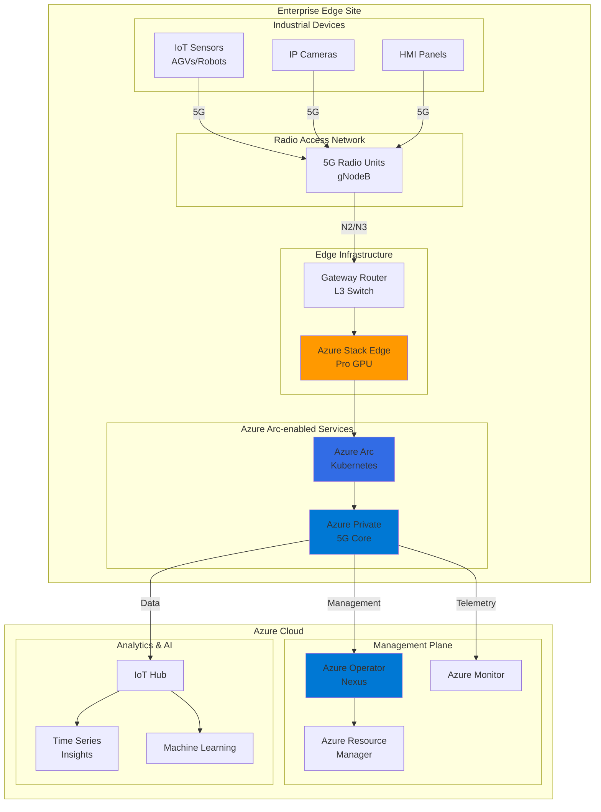

# Industrial 5G Networks for Edge Computing

## Problem

Manufacturing facilities and logistics operations struggle with traditional Wi-Fi networks that suffer from interference, limited coverage, and inability to support thousands of IoT devices simultaneously. Legacy industrial networks cannot provide the ultra-low latency required for real-time control systems, automated guided vehicles (AGVs), and predictive maintenance sensors, resulting in production inefficiencies and safety risks.

## Solution

Deploy a carrier-grade private 5G network using Azure Operator Nexus as the hybrid cloud platform and Azure Private 5G Core for 5G network functions, enabling ultra-reliable low-latency communications (URLLC) for mission-critical applications. This solution provides dedicated spectrum, network slicing capabilities, and seamless integration with Azure IoT and edge computing services for real-time analytics and control.

## Architecture Diagram



## Prerequisites

1. Azure subscription with Enterprise Agreement and appropriate permissions for Azure Operator Nexus
2. Azure CLI v2.40.0 or later installed and configured
3. Azure Stack Edge Pro GPU device(s) deployed and configured
4. 5G radio equipment (gNodeB) from certified partners
5. Private spectrum license or CBRS access (3.5 GHz band in US)
6. Understanding of 5G network architecture and Azure Arc-enabled services
7. Estimated cost: $5,000-$10,000/month for core infrastructure plus spectrum costs

> **Warning**: Azure Private 5G Core service will retire on September 30, 2025. Microsoft recommends migrating to partner solutions like [Nokia 4G & 5G private wireless](https://azuremarketplace.microsoft.com/en-US/marketplace/apps/nokiaofamericacorporation1591716055441.ndac_5g-ready_private_wireless?tab=Overview) or [Ericsson Private 5G](https://azuremarketplace.microsoft.com/en-US/marketplace/apps/ericssonab1605633442837.ericsson_private_five_g?tab=Overview) available in Azure Marketplace.

## Preparation

```bash
# Set environment variables for Azure resources
export RESOURCE_GROUP="rg-private5g-${RANDOM_SUFFIX}"
export LOCATION="eastus"
export SUBSCRIPTION_ID=$(az account show --query id --output tsv)
export MOBILE_NETWORK_NAME="mn-manufacturing"
export SITE_NAME="site-factory01"

# Generate unique suffix for resource names
RANDOM_SUFFIX=$(openssl rand -hex 3)
export ASE_DEVICE_NAME="ase-${RANDOM_SUFFIX}"
export CUSTOM_LOCATION_NAME="cl-${SITE_NAME}"

# Create resource group
az group create \
    --name ${RESOURCE_GROUP} \
    --location ${LOCATION} \
    --tags purpose=private5g environment=production

echo "✅ Resource group created: ${RESOURCE_GROUP}"

# Register required resource providers
az provider register --namespace Microsoft.MobileNetwork
az provider register --namespace Microsoft.ExtendedLocation
az provider register --namespace Microsoft.Kubernetes
az provider register --namespace Microsoft.KubernetesConfiguration

echo "✅ Resource providers registered"
```

## Steps

1. **Create Mobile Network Resource**:

   The Mobile Network resource represents your private 5G network at the organizational level. This foundational resource defines network-wide policies, network slices for different use cases (like IoT sensors vs. video streaming), and manages the overall network identity. Creating this first ensures all subsequent site deployments inherit consistent network configurations.

   ```bash
   # Create the mobile network resource
   az mobile-network create \
       --mobile-network-name ${MOBILE_NETWORK_NAME} \
       --resource-group ${RESOURCE_GROUP} \
       --location ${LOCATION} \
       --identifier "{mcc:310,mnc:950}"

   # Store the mobile network ID
   MOBILE_NETWORK_ID=$(az mobile-network show \
       --mobile-network-name ${MOBILE_NETWORK_NAME} \
       --resource-group ${RESOURCE_GROUP} \
       --query id --output tsv)

   echo "✅ Mobile network created with ID: ${MOBILE_NETWORK_ID}"
   ```

   The mobile network now serves as the parent resource for all your private 5G infrastructure. The PLMN identifier (MCC/MNC) uniquely identifies your network and must be coordinated with local spectrum regulations.

2. **Configure Network Slices**:

   Network slicing enables you to create multiple virtual networks on the same physical infrastructure, each optimized for specific use cases. For manufacturing, we'll create slices for mission-critical control (ultra-low latency), massive IoT sensors (high device density), and enhanced mobile broadband for video surveillance.

   ```bash
   # Create network slice for mission-critical IoT
   az mobile-network slice create \
       --mobile-network-name ${MOBILE_NETWORK_NAME} \
       --resource-group ${RESOURCE_GROUP} \
       --slice-name "slice-critical-iot" \
       --location ${LOCATION} \
       --snssai "{sst:1,sd:000001}"

   # Create network slice for massive IoT
   az mobile-network slice create \
       --mobile-network-name ${MOBILE_NETWORK_NAME} \
       --resource-group ${RESOURCE_GROUP} \
       --slice-name "slice-massive-iot" \
       --location ${LOCATION} \
       --snssai "{sst:2,sd:000002}"

   # Create network slice for video surveillance
   az mobile-network slice create \
       --mobile-network-name ${MOBILE_NETWORK_NAME} \
       --resource-group ${RESOURCE_GROUP} \
       --slice-name "slice-video" \
       --location ${LOCATION} \
       --snssai "{sst:3,sd:000003}"

   echo "✅ Network slices configured for different use cases"
   ```

   Each slice can now be assigned different quality of service (QoS) parameters, ensuring critical control systems get guaranteed low latency while bulk sensor data uses best-effort delivery.

3. **Create Data Networks**:

   Data networks define how device traffic exits the 5G core and connects to your enterprise applications. In a manufacturing environment, you typically need separate data networks for OT (operational technology) systems, IT systems, and internet access, ensuring proper network segmentation and security.

   ```bash
   # Create data network for OT systems
   az mobile-network data-network create \
       --mobile-network-name ${MOBILE_NETWORK_NAME} \
       --data-network-name "dn-ot-systems" \
       --resource-group ${RESOURCE_GROUP} \
       --location ${LOCATION} \
       --description "Operational Technology systems data network"

   # Create data network for IT systems
   az mobile-network data-network create \
       --mobile-network-name ${MOBILE_NETWORK_NAME} \
       --data-network-name "dn-it-systems" \
       --resource-group ${RESOURCE_GROUP} \
       --location ${LOCATION} \
       --description "Information Technology systems data network"

   echo "✅ Data networks created for traffic segmentation"
   ```

   The data networks are now configured to route different types of traffic to appropriate enterprise systems while maintaining security boundaries between OT and IT networks.

4. **Deploy Azure Stack Edge Integration**:

   Azure Stack Edge provides the compute platform for running the 5G core network functions at the edge. The integration with Azure Arc enables cloud-based management while keeping all data processing local for low latency and data sovereignty.

   ```bash
   # Create custom location for the site
   az customlocation create \
       --name ${CUSTOM_LOCATION_NAME} \
       --resource-group ${RESOURCE_GROUP} \
       --location ${LOCATION} \
       --namespace "Microsoft.ExtendedLocation" \
       --host-resource-id "/subscriptions/${SUBSCRIPTION_ID}/resourceGroups/${RESOURCE_GROUP}/providers/Microsoft.Kubernetes/connectedClusters/${ASE_DEVICE_NAME}" \
       --cluster-extension-ids "/subscriptions/${SUBSCRIPTION_ID}/resourceGroups/${RESOURCE_GROUP}/providers/Microsoft.Kubernetes/connectedClusters/${ASE_DEVICE_NAME}/providers/Microsoft.KubernetesConfiguration/extensions/azure-private-5g-core"

   # Get custom location ID
   CUSTOM_LOCATION_ID=$(az customlocation show \
       --name ${CUSTOM_LOCATION_NAME} \
       --resource-group ${RESOURCE_GROUP} \
       --query id --output tsv)

   echo "✅ Custom location created for edge deployment"
   ```

5. **Create Site and Deploy Packet Core**:

   The site represents a physical location where you deploy the 5G core. The packet core contains all the network functions (AMF, SMF, UPF, etc.) that handle device registration, session management, and data forwarding. This deployment brings carrier-grade capabilities to your enterprise edge.

   ```bash
   # Create site resource
   az mobile-network site create \
       --mobile-network-name ${MOBILE_NETWORK_NAME} \
       --site-name ${SITE_NAME} \
       --resource-group ${RESOURCE_GROUP} \
       --location ${LOCATION}

   # Deploy packet core control plane
   az mobile-network pccp create \
       --packet-core-control-plane-name ${SITE_NAME} \
       --resource-group ${RESOURCE_GROUP} \
       --location ${LOCATION} \
       --access-interface "{name:N2,ipv4Address:192.168.1.10,ipv4Subnet:192.168.1.0/24,ipv4Gateway:192.168.1.1}" \
       --local-diagnostics "{authenticationType:AAD}" \
       --platform "{type:AKS-HCI,customLocationId:${CUSTOM_LOCATION_ID}}" \
       --sku "G0" \
       --mobile-networks "[{id:${MOBILE_NETWORK_ID}}]" \
       --control-plane-access-interface "{name:N2,ipv4Address:192.168.1.10,ipv4Subnet:192.168.1.0/24,ipv4Gateway:192.168.1.1}"

   echo "✅ Packet core control plane deployed"
   ```

   The packet core is now running on your Azure Stack Edge device, ready to handle 5G device connections and manage network traffic according to your defined policies.

6. **Configure Service Policies**:

   Service policies define how different types of traffic are handled within your 5G network. For manufacturing, we create policies that prioritize real-time control traffic, ensure video streams have adequate bandwidth, and manage bulk IoT data efficiently.

   ```bash
   # Create service for real-time control
   az mobile-network service create \
       --mobile-network-name ${MOBILE_NETWORK_NAME} \
       --resource-group ${RESOURCE_GROUP} \
       --service-name "svc-realtime-control" \
       --location ${LOCATION} \
       --service-precedence 10 \
       --pcc-rules "[{ruleName:rule-control,rulePrecedence:100,serviceDataFlowTemplates:[{templateName:control-traffic,direction:Bidirectional,protocol:[tcp],remoteIpList:[10.1.0.0/16]}]}]"

   # Create service for video surveillance
   az mobile-network service create \
       --mobile-network-name ${MOBILE_NETWORK_NAME} \
       --resource-group ${RESOURCE_GROUP} \
       --service-name "svc-video-surveillance" \
       --location ${LOCATION} \
       --service-precedence 20 \
       --pcc-rules "[{ruleName:rule-video,rulePrecedence:200,serviceDataFlowTemplates:[{templateName:video-streams,direction:Uplink,protocol:[udp],remoteIpList:[10.2.0.0/16]}]}]"

   echo "✅ Service policies configured for different traffic types"
   ```

7. **Create SIM Policies and Provision Devices**:

   SIM policies control device access to your network and assign appropriate service levels. In a private 5G deployment, you maintain complete control over which devices can connect, what resources they can access, and their quality of service parameters.

   ```bash
   # Get slice ID for SIM policy
   SLICE_ID=$(az mobile-network slice show \
       --mobile-network-name ${MOBILE_NETWORK_NAME} \
       --resource-group ${RESOURCE_GROUP} \
       --slice-name "slice-critical-iot" \
       --query id --output tsv)

   # Get data network ID for SIM policy
   DATA_NETWORK_ID=$(az mobile-network data-network show \
       --mobile-network-name ${MOBILE_NETWORK_NAME} \
       --resource-group ${RESOURCE_GROUP} \
       --data-network-name "dn-ot-systems" \
       --query id --output tsv)

   # Create SIM policy for industrial IoT devices
   az mobile-network sim policy create \
       --mobile-network-name ${MOBILE_NETWORK_NAME} \
       --resource-group ${RESOURCE_GROUP} \
       --sim-policy-name "policy-industrial-iot" \
       --location ${LOCATION} \
       --default-slice "{id:${SLICE_ID}}" \
       --ue-ambr "{uplink:10 Mbps,downlink:10 Mbps}" \
       --slice-configurations "[{slice:{id:${SLICE_ID}},defaultDataNetwork:{id:${DATA_NETWORK_ID}},dataNetworkConfigurations:[{dataNetwork:{id:${DATA_NETWORK_ID}},sessionAmbr:{uplink:10 Mbps,downlink:10 Mbps}}]}]"

   echo "✅ SIM policies created for device provisioning"
   ```

8. **Configure Monitoring and Analytics**:

   Azure Monitor integration provides real-time visibility into your 5G network performance, device connectivity, and application behavior. This observability is crucial for maintaining service quality and troubleshooting issues in production environments.

   ```bash
   # Create Log Analytics workspace
   az monitor log-analytics workspace create \
       --workspace-name "law-private5g-${RANDOM_SUFFIX}" \
       --resource-group ${RESOURCE_GROUP} \
       --location ${LOCATION}

   # Configure diagnostic settings for packet core
   LAW_ID=$(az monitor log-analytics workspace show \
       --workspace-name "law-private5g-${RANDOM_SUFFIX}" \
       --resource-group ${RESOURCE_GROUP} \
       --query id --output tsv)

   az monitor diagnostic-settings create \
       --name "diag-packet-core" \
       --resource "/subscriptions/${SUBSCRIPTION_ID}/resourceGroups/${RESOURCE_GROUP}/providers/Microsoft.MobileNetwork/packetCoreControlPlanes/${SITE_NAME}" \
       --logs '[{"category":"DeviceEvents","enabled":true},{"category":"SMFEvents","enabled":true}]' \
       --metrics '[{"category":"AllMetrics","enabled":true}]' \
       --workspace ${LAW_ID}

   echo "✅ Monitoring and analytics configured"
   ```

   Your private 5G network now streams telemetry to Azure Monitor, enabling you to track KPIs like device attach success rates, throughput, latency, and identify any anomalies in real-time.

9. **Integrate with Azure IoT Services**:

   Connecting your private 5G network to Azure IoT Hub enables seamless device management, data ingestion, and edge computing scenarios. This integration bridges the gap between your local 5G network and cloud-based analytics and AI services.

   ```bash
   # Create IoT Hub for device management
   az iot hub create \
       --name "iothub-5g-${RANDOM_SUFFIX}" \
       --resource-group ${RESOURCE_GROUP} \
       --location ${LOCATION} \
       --sku S1

   # Create device provisioning service
   az iot dps create \
       --name "dps-5g-${RANDOM_SUFFIX}" \
       --resource-group ${RESOURCE_GROUP} \
       --location ${LOCATION}

   # Link DPS to IoT Hub
   IOT_HUB_CONNECTION=$(az iot hub connection-string show \
       --hub-name "iothub-5g-${RANDOM_SUFFIX}" \
       --key primary --query connectionString --output tsv)

   az iot dps linked-hub create \
       --dps-name "dps-5g-${RANDOM_SUFFIX}" \
       --resource-group ${RESOURCE_GROUP} \
       --connection-string "${IOT_HUB_CONNECTION}" \
       --location ${LOCATION}

   echo "✅ IoT services integrated with 5G network"
   ```

10. **Deploy Edge Computing Workloads**:

    Azure Operator Nexus enables deployment of containerized workloads alongside your 5G core, enabling ultra-low latency applications like computer vision, predictive maintenance, and real-time control systems that require sub-10ms response times.

    ```bash
    # Create container registry for edge workloads
    az acr create \
        --name "acr5g${RANDOM_SUFFIX}" \
        --resource-group ${RESOURCE_GROUP} \
        --location ${LOCATION} \
        --sku Standard

    # Deploy sample edge analytics workload
    cat > edge-workload.yaml << EOF
    apiVersion: apps/v1
    kind: Deployment
    metadata:
      name: realtime-analytics
      namespace: edge-workloads
    spec:
      replicas: 3
      selector:
        matchLabels:
          app: analytics
      template:
        metadata:
          labels:
            app: analytics
        spec:
          containers:
          - name: analytics-engine
            image: acr5g${RANDOM_SUFFIX}.azurecr.io/analytics:latest
            ports:
            - containerPort: 8080
            resources:
              requests:
                memory: "512Mi"
                cpu: "500m"
              limits:
                memory: "1Gi"
                cpu: "1000m"
    EOF

    # Apply workload to edge cluster
    kubectl apply -f edge-workload.yaml \
        --kubeconfig ${CUSTOM_LOCATION_NAME}-kubeconfig

    echo "✅ Edge computing workloads deployed"
    ```

    Your edge analytics workloads now process data locally, reducing latency for critical manufacturing applications while only sending aggregated insights to the cloud.

## Validation & Testing

1. Verify packet core deployment status:

   ```bash
   # Check packet core control plane status
   az mobile-network pccp show \
       --packet-core-control-plane-name ${SITE_NAME} \
       --resource-group ${RESOURCE_GROUP} \
       --query "{State:provisioningState,Version:version}" \
       --output table
   ```

   Expected output: State should show "Succeeded" and Version should display the deployed packet core version.

2. Test data network connectivity:

   ```bash
   # Check data networks
   az mobile-network data-network list \
       --resource-group ${RESOURCE_GROUP} \
       --mobile-network-name ${MOBILE_NETWORK_NAME} \
       --query "[].{Name:name,State:provisioningState}" \
       --output table
   ```

3. Verify network slice configuration:

   ```bash
   # List configured network slices
   az mobile-network slice list \
       --mobile-network-name ${MOBILE_NETWORK_NAME} \
       --resource-group ${RESOURCE_GROUP} \
       --query "[].{Name:name,SST:snssai.sst,SD:snssai.sd}" \
       --output table
   ```

4. Monitor real-time metrics:

   ```bash
   # Query device connection metrics
   az monitor metrics list \
       --resource "/subscriptions/${SUBSCRIPTION_ID}/resourceGroups/${RESOURCE_GROUP}/providers/Microsoft.MobileNetwork/packetCoreControlPlanes/${SITE_NAME}" \
       --metric "ConnectedDeviceCount" \
       --interval PT1M \
       --output table
   ```

> **Tip**: Use Azure Monitor workbooks to create custom dashboards showing 5G network KPIs, device connectivity heatmaps, and application performance metrics in real-time.

## Cleanup

1. Remove edge workloads:

   ```bash
   # Delete edge analytics deployment
   kubectl delete deployment realtime-analytics \
       --namespace edge-workloads \
       --kubeconfig ${CUSTOM_LOCATION_NAME}-kubeconfig

   echo "✅ Edge workloads removed"
   ```

2. Delete packet core and site:

   ```bash
   # Delete packet core control plane
   az mobile-network pccp delete \
       --packet-core-control-plane-name ${SITE_NAME} \
       --resource-group ${RESOURCE_GROUP} \
       --yes --no-wait

   # Delete site
   az mobile-network site delete \
       --mobile-network-name ${MOBILE_NETWORK_NAME} \
       --site-name ${SITE_NAME} \
       --resource-group ${RESOURCE_GROUP} \
       --yes --no-wait

   echo "✅ Packet core and site deletion initiated"
   ```

3. Remove IoT services:

   ```bash
   # Delete IoT Hub
   az iot hub delete \
       --name "iothub-5g-${RANDOM_SUFFIX}" \
       --resource-group ${RESOURCE_GROUP}

   # Delete DPS
   az iot dps delete \
       --name "dps-5g-${RANDOM_SUFFIX}" \
       --resource-group ${RESOURCE_GROUP}

   echo "✅ IoT services removed"
   ```

4. Delete resource group:

   ```bash
   # Delete entire resource group
   az group delete \
       --name ${RESOURCE_GROUP} \
       --yes --no-wait

   echo "✅ Resource group deletion initiated: ${RESOURCE_GROUP}"
   echo "Note: Complete deletion may take 10-15 minutes"
   ```

## Discussion

Azure Operator Nexus and Azure Private 5G Core bring carrier-grade telecommunications capabilities to enterprise environments, enabling organizations to deploy their own private 5G networks with cloud-native management. This architecture is particularly powerful for manufacturing and logistics scenarios where ultra-reliable low-latency communication (URLLC) is critical for real-time control systems, autonomous vehicles, and safety applications. According to the [Azure Private 5G Core documentation](https://learn.microsoft.com/en-us/azure/private-5g-core/private-5g-core-overview), the solution provides complete 5G core network functions running on Azure Stack Edge devices, ensuring data sovereignty and minimal latency.

The integration with Azure Operator Nexus provides a sophisticated orchestration layer that automates lifecycle management of both infrastructure and network functions. As detailed in the [Azure Operator Nexus overview](https://learn.microsoft.com/en-us/azure/operator-nexus/overview), this platform reduces operational complexity by providing unified management across compute, network, and storage resources. The ability to deploy containerized workloads alongside the 5G core enables edge computing scenarios where data processing happens within milliseconds of generation, critical for computer vision quality control or predictive maintenance applications.

Network slicing capabilities allow organizations to create multiple virtual networks on the same infrastructure, each optimized for specific use cases. Mission-critical robotic control can use dedicated slices with guaranteed low latency, while bulk sensor data uses best-effort delivery on separate slices. The [Azure Well-Architected Framework](https://learn.microsoft.com/en-us/azure/architecture/framework/) principles of reliability and performance efficiency are built into the platform through features like high availability deployments across paired Azure Stack Edge devices and automatic scaling based on network load.

From a security perspective, private 5G networks provide inherent advantages over Wi-Fi, including SIM-based authentication, encrypted air interfaces, and complete network isolation. Integration with Azure security services adds defense-in-depth through [Azure Private 5G Core security best practices](https://learn.microsoft.com/en-us/azure/private-5g-core/security), while the [reliability guide](https://learn.microsoft.com/en-us/azure/private-5g-core/reliability-private-5g-core) details high availability configurations for mission-critical deployments.

> **Warning**: Given the upcoming retirement of Azure Private 5G Core on September 30, 2025, organizations should evaluate migration paths to partner solutions early in the planning process. This allows sufficient time to test alternative solutions and ensure continuity of operations.

## Challenge

Extend this solution by implementing these enhancements:

1. **Migration to Partner Solutions**: Evaluate and implement migration to Nokia or Ericsson private 5G solutions available in Azure Marketplace before the September 2025 retirement deadline.

2. **Multi-Site Federation**: Deploy private 5G cores across multiple manufacturing sites and implement inter-site communication through Azure Virtual WAN, enabling seamless roaming for mobile assets between facilities.

3. **AI-Powered Network Optimization**: Integrate Azure Machine Learning to analyze network telemetry and automatically adjust QoS policies based on application performance, implementing self-optimizing network capabilities.

4. **Digital Twin Integration**: Connect the 5G network to Azure Digital Twins to create real-time digital representations of manufacturing equipment, enabling predictive maintenance and process optimization.

5. **Zero Trust Security**: Implement Azure Private Endpoint connections for all management traffic and integrate with Microsoft Defender for IoT to detect anomalous device behavior on the 5G network.

## Infrastructure Code

### Available Infrastructure as Code:

- [Infrastructure Code Overview](code/README.md) - Detailed description of all infrastructure components
- [Bicep](code/bicep/) - Azure Bicep templates
- [Bash CLI Scripts](code/scripts/) - Example bash scripts using Azure CLI commands to deploy infrastructure
- [Terraform](code/terraform/) - Terraform configuration files