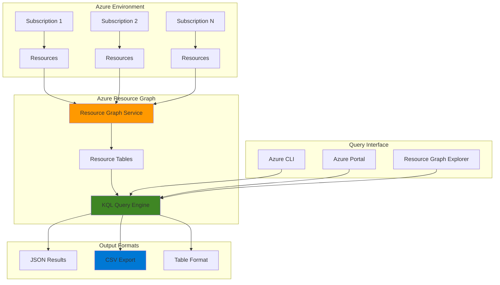

# Infrastructure Inventory Reports with Resource Graph

## Problem

Organizations struggle to maintain comprehensive visibility and governance over their growing Azure infrastructure across multiple subscriptions and resource groups. Traditional methods of resource discovery require time-consuming manual processes or complex API calls to individual resource providers, making it difficult to generate up-to-date compliance reports, track resource sprawl, and ensure adherence to organizational policies and budgets.

## Solution

Azure Resource Graph provides a powerful, scalable solution for infrastructure inventory and compliance reporting using KQL-based queries that can discover, catalog, and analyze Azure resources across subscriptions in seconds. This approach enables automated report generation with exportable results, supporting governance requirements while eliminating the complexity of querying individual resource providers.

## Architecture Diagram



## Prerequisites

1. Azure account with Reader permissions across target subscriptions and resource groups
2. Azure CLI installed and configured (version 2.22.0 or higher)
3. Basic understanding of KQL (Kusto Query Language) syntax
4. Read access to Azure subscriptions containing resources to inventory
5. Estimated cost: No additional charges for Azure Resource Graph queries (service is free)

> **Note**: Azure Resource Graph queries are free and provide read-only access to your Azure resources without impacting performance or incurring additional costs.

## Preparation

```bash
# Set environment variables for Azure resources
export LOCATION="eastus"
export SUBSCRIPTION_ID=$(az account show --query id --output tsv)

# Generate unique suffix for file naming
RANDOM_SUFFIX=$(openssl rand -hex 3)

# Install Azure Resource Graph CLI extension
az extension add --name resource-graph

# Verify extension installation and version
az extension list --query "[?name=='resource-graph']" --output table

echo "✅ Azure CLI Resource Graph extension installed"
```

## Steps

1. **Verify Azure Resource Graph Access**:

   Azure Resource Graph provides enterprise-scale resource discovery across your Azure environment using the powerful KQL query language. Before executing complex inventory queries, verify that you have appropriate access permissions and the Resource Graph extension is properly configured.

   ```bash
   # Test basic Resource Graph connectivity
   az graph query -q "Resources | limit 5" --output table
   
   # Display available Resource Graph tables and schema
   az graph query -q "union * | getschema | project ColumnName, ColumnType | order by ColumnName asc" \
       --query "data[0:10]" --output table
   
   echo "✅ Resource Graph connectivity verified"
   ```

   This initial step confirms that Azure Resource Graph can access your subscription resources and displays the available data schema for building comprehensive inventory queries.

2. **Create Basic Resource Inventory Query**:

   The foundation of infrastructure inventory reporting is a comprehensive view of all resources across your Azure environment. This query provides essential resource metadata including names, types, locations, and resource groups - the core information needed for governance and compliance reporting.

   ```bash
   # Execute comprehensive resource inventory query
   az graph query -q "
   Resources
   | project name, type, location, resourceGroup, subscriptionId
   | order by type asc, name asc
   | limit 50
   " --output table
   
   echo "✅ Basic resource inventory query executed"
   ```

   The query systematically catalogs your infrastructure, organizing results by resource type and name for easy analysis. This structured approach enables consistent reporting and helps identify resource patterns across your environment.

3. **Generate Resource Count by Type Report**:

   Understanding the distribution of resource types across your Azure environment is crucial for capacity planning, cost management, and compliance monitoring. This aggregated view reveals infrastructure patterns and helps identify potential governance issues or optimization opportunities.

   ```bash
   # Create resource type summary report
   az graph query -q "
   Resources
   | summarize count() by type
   | order by count_ desc
   " --output table
   
   # Save detailed results to environment variable for further analysis
   RESOURCE_COUNTS=$(az graph query -q "
   Resources
   | summarize ResourceCount=count() by ResourceType=type
   | order by ResourceCount desc
   " --output json)
   
   echo "✅ Resource type distribution report generated"
   echo "Total resource types found: $(echo $RESOURCE_COUNTS | jq '.data | length')"
   ```

   This aggregated analysis provides valuable insights into your infrastructure composition, helping identify the most prevalent resource types and supporting strategic decisions about governance policies and cost optimization.

4. **Create Location-Based Distribution Report**:

   Geographic distribution of Azure resources impacts compliance, performance, and cost optimization strategies. This location-based analysis helps ensure resources are deployed in appropriate regions according to organizational policies and regulatory requirements.

   ```bash
   # Generate resource distribution by location
   az graph query -q "
   Resources
   | where location != ''
   | summarize ResourceCount=count() by Location=location
   | order by ResourceCount desc
   " --output table
   
   # Create detailed location analysis with resource types
   az graph query -q "
   Resources
   | where location != ''
   | summarize count() by location, type
   | order by location asc, count_ desc
   " --query "data[0:20]" --output table
   
   echo "✅ Location-based resource distribution report completed"
   ```

   The location analysis reveals geographic resource distribution patterns, supporting compliance with data residency requirements and enabling optimization of regional resource placement for performance and cost efficiency.

5. **Generate Compliance and Tagging Report**:

   Resource tagging is fundamental to Azure governance, enabling cost tracking, resource organization, and policy enforcement. This comprehensive tagging analysis identifies untagged resources and evaluates tag compliance across your infrastructure, supporting governance and cost management initiatives.

   ```bash
   # Analyze resource tagging compliance
   az graph query -q "
   Resources
   | extend TagCount = array_length(todynamic(tags))
   | extend HasTags = case(TagCount > 0, 'Tagged', 'Untagged')
   | summarize count() by HasTags, type
   | order by type asc
   " --output table
   
   # Identify resources missing critical tags
   az graph query -q "
   Resources
   | where tags !has 'Environment' or tags !has 'Owner'
   | project name, type, resourceGroup, location, tags
   | limit 20
   " --output table
   
   echo "✅ Resource tagging compliance analysis completed"
   ```

   This tagging analysis provides actionable insights for improving governance posture by identifying resources that lack essential metadata for cost allocation, ownership tracking, and policy enforcement.

6. **Export Comprehensive Inventory Report**:

   Creating exportable reports enables sharing inventory data with stakeholders, integration with external systems, and long-term compliance tracking. The JSON export functionality provides formatted data suitable for further analysis in business intelligence tools or compliance frameworks.

   ```bash
   # Generate comprehensive inventory report for export
   INVENTORY_QUERY="
   Resources
   | project 
       ResourceName=name,
       ResourceType=type,
       Location=location,
       ResourceGroup=resourceGroup,
       SubscriptionId=subscriptionId,
       Tags=tags,
       ResourceId=id,
       Kind=kind
   | order by ResourceType asc, ResourceName asc
   "
   
   # Execute query and save results
   az graph query -q "$INVENTORY_QUERY" \
       --output json > infrastructure-inventory-$(date +%Y%m%d).json
   
   # Generate summary statistics
   az graph query -q "
   Resources
   | summarize 
       TotalResources=count(),
       UniqueTypes=dcount(type),
       UniqueLocations=dcount(location),
       TaggedResources=countif(array_length(todynamic(tags)) > 0)
   " --output table
   
   echo "✅ Comprehensive inventory report exported to infrastructure-inventory-$(date +%Y%m%d).json"
   ```

   The exported inventory provides a complete snapshot of your Azure environment, enabling offline analysis, compliance auditing, and integration with governance workflows while maintaining detailed resource metadata.

## Validation & Testing

1. **Verify Query Results Accuracy**:

   ```bash
   # Validate total resource count
   TOTAL_RESOURCES=$(az graph query -q "Resources | count" \
       --query "data[0].count_" --output tsv)
   echo "Total resources discovered: $TOTAL_RESOURCES"
   
   # Verify subscription coverage
   az graph query -q "
   Resources
   | distinct subscriptionId
   | join kind=inner (ResourceContainers | where type == 'microsoft.resources/subscriptions')
       on \$left.subscriptionId == \$right.subscriptionId
   | project subscriptionId, SubscriptionName=name
   " --output table
   ```

   Expected output: List of subscriptions with resource counts matching Azure Portal resource counts.

2. **Test Export Functionality**:

   ```bash
   # Verify exported file contains data
   if [ -f "infrastructure-inventory-$(date +%Y%m%d).json" ]; then
       EXPORTED_COUNT=$(jq '.data | length' infrastructure-inventory-$(date +%Y%m%d).json)
       echo "Successfully exported $EXPORTED_COUNT resources to JSON file"
   else
       echo "⚠️ Export file not found"
   fi
   
   # Test query performance with larger datasets
   time az graph query -q "Resources | count" --output json
   ```

3. **Validate Tagging Analysis**:

   ```bash
   # Confirm tagging compliance metrics
   az graph query -q "
   Resources
   | extend HasEnvironmentTag = case(tags has 'Environment', 'Yes', 'No')
   | summarize count() by HasEnvironmentTag
   " --output table
   ```

## Cleanup

1. **Remove exported inventory files**:

   ```bash
   # Clean up generated inventory files
   rm -f infrastructure-inventory-*.json
   
   echo "✅ Inventory report files cleaned up"
   ```

2. **Clear environment variables**:

   ```bash
   # Clear session variables
   unset RESOURCE_COUNTS
   unset INVENTORY_QUERY
   unset TOTAL_RESOURCES
   unset RANDOM_SUFFIX
   
   echo "✅ Environment variables cleared"
   ```

> **Note**: The Azure Resource Graph extension can remain installed for future use, as it provides ongoing value for infrastructure governance and monitoring without additional cost.

## Discussion

Azure Resource Graph represents a paradigm shift in how organizations approach infrastructure governance and compliance reporting. By leveraging the power of KQL (Kusto Query Language), Resource Graph enables complex queries across vast Azure environments that would traditionally require multiple API calls and significant processing time. The service provides read-only access to resource metadata without impacting performance, making it ideal for frequent governance checks and automated reporting workflows that support the Azure Well-Architected Framework's operational excellence pillar.

The inventory reporting capabilities demonstrated in this recipe showcase Resource Graph's strength in aggregating data across subscriptions and resource types. Unlike traditional approaches that require iterating through individual resource providers, Resource Graph maintains a unified view of your Azure environment that updates continuously as resources are created, modified, or deleted. This real-time synchronization ensures that governance reports reflect the current state of your infrastructure, supporting accurate compliance assessments and cost management decisions.

Resource Graph's integration with Azure Policy provides additional governance value by enabling compliance monitoring and policy impact assessment at scale. Organizations can combine resource inventory queries with policy evaluation data to create comprehensive governance dashboards that highlight both resource distribution and compliance status. This integrated approach supports the Azure Well-Architected Framework's governance pillar by providing the visibility and control necessary for effective cloud resource management while maintaining cost optimization through efficient querying mechanisms.

The export capabilities allow for seamless integration with existing governance tools and processes. Whether exporting to JSON for API integration, CSV for spreadsheet analysis, or using the Azure Portal's Resource Graph Explorer for interactive querying, organizations can adapt the reporting output to their specific workflow requirements. This flexibility ensures that Resource Graph can complement existing governance frameworks rather than requiring wholesale process changes, enabling gradual adoption and integration with established business processes.

> **Tip**: Use Resource Graph shared queries to standardize governance reporting across your organization and ensure consistent metrics for compliance and cost management initiatives across different teams and departments.

For more information, see the official Microsoft documentation:

- [Azure Resource Graph Overview](https://learn.microsoft.com/en-us/azure/governance/resource-graph/overview) - Comprehensive guide to Resource Graph capabilities and use cases
- [Understanding the Azure Resource Graph Query Language](https://learn.microsoft.com/en-us/azure/governance/resource-graph/concepts/query-language) - Complete KQL reference for Resource Graph queries
- [Azure Resource Graph Sample Queries](https://learn.microsoft.com/en-us/azure/governance/resource-graph/samples/starter) - Extensive collection of practical query examples
- [Working with Large Azure Resource Data Sets](https://learn.microsoft.com/en-us/azure/governance/resource-graph/concepts/work-with-data) - Best practices for handling large-scale inventory queries
- [Azure Governance Documentation](https://learn.microsoft.com/en-us/azure/governance/) - Complete governance framework and best practices

## Challenge

Extend this infrastructure inventory solution by implementing these governance enhancements:

1. **Automated Compliance Monitoring**: Create scheduled queries that identify resources violating organizational policies, such as untagged resources or resources deployed in restricted regions, with automated alerting through Azure Monitor and Logic Apps integration.

2. **Cost Optimization Discovery**: Develop KQL queries that identify underutilized resources by analyzing properties like VM sizes, storage access tiers, and database service levels to support cost optimization initiatives and right-sizing recommendations.

3. **Security Posture Assessment**: Build inventory queries that evaluate security configurations across resource types, including public IP exposure, network security group rules, and encryption settings to support security governance and compliance frameworks.

4. **Resource Lifecycle Tracking**: Implement change tracking queries using Resource Graph's time-based filtering capabilities to monitor resource provisioning patterns, identify configuration drift, and support change management processes with historical analysis.

5. **Multi-Tenant Governance**: Extend the solution to support Azure Lighthouse scenarios where service providers need to generate consolidated inventory reports across multiple customer tenants while maintaining appropriate access controls and data isolation requirements.

## Infrastructure Code

*Infrastructure code will be generated after recipe approval.*