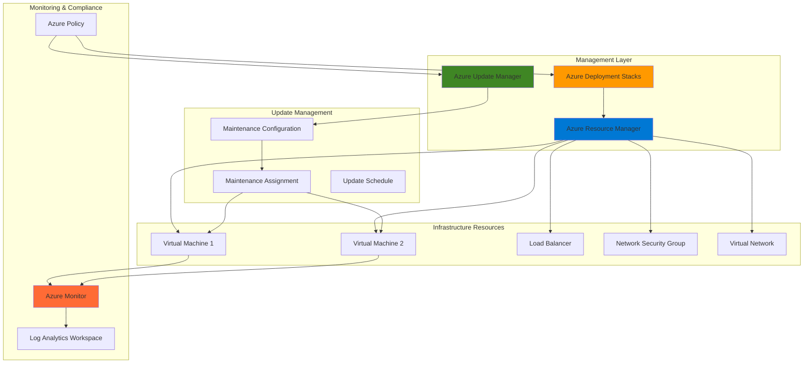

# Infrastructure Lifecycle Management with Deployment Stacks and Update Manager

## Problem

Organizations struggle with maintaining consistent infrastructure deployments and keeping systems patched across their Azure environments. Traditional approaches often result in configuration drift, manual patching processes, and difficulty tracking resource dependencies. Teams need a unified solution that manages infrastructure as atomic units while automating system updates and maintaining compliance across their cloud infrastructure.

## Solution

Azure Deployment Stacks provide centralized management of resource collections as atomic units, enabling consistent deployment and lifecycle management. Combined with Azure Update Manager's automated patching capabilities, this solution creates a comprehensive infrastructure lifecycle management platform that maintains both infrastructure consistency and system security through automated updates and compliance monitoring.

## Architecture Diagram



## Prerequisites

1. Azure subscription with Contributor or Owner permissions
2. Azure CLI v2.61.0 or later installed and configured
3. Basic understanding of Azure Resource Manager templates and Bicep
4. Familiarity with Azure virtual machines and networking concepts
5. Estimated cost: $50-100 for running resources during this recipe

> **Note**: Deployment Stacks are generally available and provide advanced resource lifecycle management capabilities beyond traditional ARM deployments.

## Preparation

```bash
# Set environment variables for Azure resources
export RESOURCE_GROUP="rg-infra-lifecycle-${RANDOM_SUFFIX}"
export LOCATION="eastus"
export SUBSCRIPTION_ID=$(az account show --query id --output tsv)

# Generate unique suffix for resource names
RANDOM_SUFFIX=$(openssl rand -hex 3)

# Set deployment and update management variables
export DEPLOYMENT_STACK_NAME="stack-web-tier-${RANDOM_SUFFIX}"
export MAINTENANCE_CONFIG_NAME="mc-weekly-updates-${RANDOM_SUFFIX}"
export LOG_ANALYTICS_WORKSPACE="law-monitoring-${RANDOM_SUFFIX}"
export TEMPLATE_FILE="web-tier-template.bicep"

# Create resource group
az group create \
    --name ${RESOURCE_GROUP} \
    --location ${LOCATION} \
    --tags purpose=recipe environment=demo

echo "✅ Resource group created: ${RESOURCE_GROUP}"

# Create Log Analytics workspace for monitoring
az monitor log-analytics workspace create \
    --resource-group ${RESOURCE_GROUP} \
    --workspace-name ${LOG_ANALYTICS_WORKSPACE} \
    --location ${LOCATION} \
    --sku pergb2018

echo "✅ Log Analytics workspace created: ${LOG_ANALYTICS_WORKSPACE}"
```

## Steps

1. **Create Bicep Template for Infrastructure Stack**:

   Azure Deployment Stacks require a template that defines the infrastructure resources to be managed as an atomic unit. This template establishes the foundation for consistent deployments and resource lifecycle management across your environment.

   ```bash
   # Create Bicep template for web tier infrastructure
   cat > ${TEMPLATE_FILE} << 'EOF'
   @description('Location for all resources')
   param location string = resourceGroup().location

   @description('Admin username for VMs')
   param adminUsername string = 'azureuser'

   @description('Admin password for VMs')
   @secure()
   param adminPassword string

   @description('Size of VMs')
   param vmSize string = 'Standard_B2s'

   @description('Number of VM instances')
   param instanceCount int = 2

   // Virtual Network
   resource vnet 'Microsoft.Network/virtualNetworks@2023-09-01' = {
     name: 'vnet-webtier'
     location: location
     properties: {
       addressSpace: {
         addressPrefixes: [
           '10.0.0.0/16'
         ]
       }
       subnets: [
         {
           name: 'subnet-web'
           properties: {
             addressPrefix: '10.0.1.0/24'
           }
         }
       ]
     }
   }

   // Network Security Group
   resource nsg 'Microsoft.Network/networkSecurityGroups@2023-09-01' = {
     name: 'nsg-webtier'
     location: location
     properties: {
       securityRules: [
         {
           name: 'AllowHTTP'
           properties: {
             priority: 1000
             protocol: 'Tcp'
             access: 'Allow'
             direction: 'Inbound'
             sourceAddressPrefix: '*'
             sourcePortRange: '*'
             destinationAddressPrefix: '*'
             destinationPortRange: '80'
           }
         }
         {
           name: 'AllowSSH'
           properties: {
             priority: 1001
             protocol: 'Tcp'
             access: 'Allow'
             direction: 'Inbound'
             sourceAddressPrefix: '*'
             sourcePortRange: '*'
             destinationAddressPrefix: '*'
             destinationPortRange: '22'
           }
         }
       ]
     }
   }

   // Public IP for Load Balancer
   resource publicIp 'Microsoft.Network/publicIPAddresses@2023-09-01' = {
     name: 'pip-webtier-lb'
     location: location
     sku: {
       name: 'Standard'
     }
     properties: {
       publicIPAllocationMethod: 'Static'
     }
   }

   // Load Balancer
   resource loadBalancer 'Microsoft.Network/loadBalancers@2023-09-01' = {
     name: 'lb-webtier'
     location: location
     sku: {
       name: 'Standard'
     }
     properties: {
       frontendIPConfigurations: [
         {
           name: 'LoadBalancerFrontEnd'
           properties: {
             publicIPAddress: {
               id: publicIp.id
             }
           }
         }
       ]
       backendAddressPools: [
         {
           name: 'BackendPool'
         }
       ]
       loadBalancingRules: [
         {
           name: 'HTTPRule'
           properties: {
             frontendIPConfiguration: {
               id: resourceId('Microsoft.Network/loadBalancers/frontendIPConfigurations', 'lb-webtier', 'LoadBalancerFrontEnd')
             }
             backendAddressPool: {
               id: resourceId('Microsoft.Network/loadBalancers/backendAddressPools', 'lb-webtier', 'BackendPool')
             }
             protocol: 'Tcp'
             frontendPort: 80
             backendPort: 80
             enableFloatingIP: false
             idleTimeoutInMinutes: 5
             probe: {
               id: resourceId('Microsoft.Network/loadBalancers/probes', 'lb-webtier', 'tcpProbe')
             }
           }
         }
       ]
       probes: [
         {
           name: 'tcpProbe'
           properties: {
             protocol: 'Tcp'
             port: 80
             intervalInSeconds: 5
             numberOfProbes: 2
           }
         }
       ]
     }
   }

   // Virtual Machine Scale Set
   resource vmss 'Microsoft.Compute/virtualMachineScaleSets@2023-09-01' = {
     name: 'vmss-webtier'
     location: location
     sku: {
       name: vmSize
       tier: 'Standard'
       capacity: instanceCount
     }
     properties: {
       upgradePolicy: {
         mode: 'Manual'
       }
       virtualMachineProfile: {
         osProfile: {
           computerNamePrefix: 'web'
           adminUsername: adminUsername
           adminPassword: adminPassword
         }
         storageProfile: {
           osDisk: {
             createOption: 'FromImage'
             caching: 'ReadWrite'
             managedDisk: {
               storageAccountType: 'Premium_LRS'
             }
           }
           imageReference: {
             publisher: 'Canonical'
             offer: '0001-com-ubuntu-server-jammy'
             sku: '22_04-lts-gen2'
             version: 'latest'
           }
         }
         networkProfile: {
           networkInterfaceConfigurations: [
             {
               name: 'nic-webtier'
               properties: {
                 primary: true
                 ipConfigurations: [
                   {
                     name: 'ipconfig1'
                     properties: {
                       subnet: {
                         id: '${vnet.id}/subnets/subnet-web'
                       }
                       loadBalancerBackendAddressPools: [
                         {
                           id: '${loadBalancer.id}/backendAddressPools/BackendPool'
                         }
                       ]
                     }
                   }
                 ]
                 networkSecurityGroup: {
                   id: nsg.id
                 }
               }
             }
           ]
         }
         extensionProfile: {
           extensions: [
             {
               name: 'customScript'
               properties: {
                 publisher: 'Microsoft.Azure.Extensions'
                 type: 'CustomScript'
                 typeHandlerVersion: '2.1'
                 autoUpgradeMinorVersion: true
                 settings: {
                   commandToExecute: 'apt-get update && apt-get install -y nginx && systemctl enable nginx && systemctl start nginx'
                 }
               }
             }
           ]
         }
       }
     }
   }

   output loadBalancerIP string = publicIp.properties.ipAddress
   output vmssName string = vmss.name
   output vnetId string = vnet.id
   EOF

   echo "✅ Bicep template created: ${TEMPLATE_FILE}"
   ```

   This template defines a complete web tier infrastructure including virtual network, security groups, load balancer, and virtual machine scale set. The template establishes standardized configurations that can be consistently deployed and managed through Deployment Stacks.

2. **Create Azure Deployment Stack**:

   Azure Deployment Stacks enable you to manage collections of Azure resources as atomic units, providing enhanced lifecycle management capabilities beyond traditional ARM deployments. This approach ensures consistent resource deployment and simplifies management operations.

   ```bash
   # Create deployment stack at resource group scope
   az stack group create \
       --name ${DEPLOYMENT_STACK_NAME} \
       --resource-group ${RESOURCE_GROUP} \
       --template-file ${TEMPLATE_FILE} \
       --parameters adminPassword="ComplexP@ssw0rd123!" \
       --action-on-unmanage deleteAll \
       --deny-settings-mode denyWriteAndDelete \
       --deny-settings-apply-to-child-scopes

   echo "✅ Deployment stack created: ${DEPLOYMENT_STACK_NAME}"
   ```

   The deployment stack manages all resources defined in the template as a single unit. The deny settings protect managed resources from unauthorized modifications, while the action-on-unmanage setting ensures proper cleanup when resources are removed from the template.

3. **Configure Azure Update Manager Maintenance Configuration**:

   Azure Update Manager requires maintenance configurations that define update schedules and policies. This centralized approach ensures consistent patch management across all managed resources while providing flexibility for different maintenance windows.

   ```bash
   # Create maintenance configuration for scheduled updates
   az maintenance configuration create \
       --resource-group ${RESOURCE_GROUP} \
       --resource-name ${MAINTENANCE_CONFIG_NAME} \
       --location ${LOCATION} \
       --maintenance-scope InGuestPatch \
       --maintenance-window-duration "03:00" \
       --maintenance-window-recur-every "Week Sunday" \
       --maintenance-window-start-date-time "2025-07-28 02:00" \
       --maintenance-window-time-zone "UTC" \
       --reboot-setting IfRequired \
       --linux-parameters packageNameMasksToInclude='*' \
       --windows-parameters classificationsToInclude='Critical,Security'

   echo "✅ Maintenance configuration created: ${MAINTENANCE_CONFIG_NAME}"
   ```

   This configuration establishes weekly maintenance windows for critical and security updates. The schedule ensures updates are applied during low-traffic periods while providing adequate time for system reboots and validation.

4. **Assign Maintenance Configuration to Infrastructure Resources**:

   Maintenance assignments connect your infrastructure resources to specific maintenance configurations, enabling automated patch management across your deployment stack. This ensures all managed resources receive consistent update policies.

   ```bash
   # Get VMSS resource ID from deployment stack
   VMSS_RESOURCE_ID=$(az stack group show \
       --name ${DEPLOYMENT_STACK_NAME} \
       --resource-group ${RESOURCE_GROUP} \
       --query "resources[?type=='Microsoft.Compute/virtualMachineScaleSets'].id" \
       --output tsv)

   # Create maintenance assignment for VMSS
   az maintenance assignment create \
       --resource-group ${RESOURCE_GROUP} \
       --resource-name maintenance-assignment-vmss \
       --resource-type virtualMachineScaleSets \
       --provider-name Microsoft.Compute \
       --configuration-assignment-name ${MAINTENANCE_CONFIG_NAME} \
       --maintenance-configuration-id "/subscriptions/${SUBSCRIPTION_ID}/resourceGroups/${RESOURCE_GROUP}/providers/Microsoft.Maintenance/maintenanceConfigurations/${MAINTENANCE_CONFIG_NAME}"

   echo "✅ Maintenance assignment created for VMSS resources"
   ```

   The maintenance assignment ensures that all virtual machines in the scale set receive automated updates according to the defined maintenance configuration. This creates a unified patching strategy across your infrastructure stack.

5. **Enable Monitoring and Compliance Tracking**:

   Azure Monitor integration provides comprehensive visibility into both infrastructure deployments and update management activities. This monitoring capability ensures you can track compliance, identify issues, and maintain operational excellence.

   ```bash
   # Create monitoring workspace connection
   WORKSPACE_ID=$(az monitor log-analytics workspace show \
       --resource-group ${RESOURCE_GROUP} \
       --workspace-name ${LOG_ANALYTICS_WORKSPACE} \
       --query id --output tsv)

   # Enable monitoring for deployment stack resources
   az monitor diagnostic-settings create \
       --name "diag-${DEPLOYMENT_STACK_NAME}" \
       --resource "${VMSS_RESOURCE_ID}" \
       --workspace "${WORKSPACE_ID}" \
       --logs '[{
         "category": "Administrative",
         "enabled": true,
         "retentionPolicy": {
           "enabled": true,
           "days": 30
         }
       }]' \
       --metrics '[{
         "category": "AllMetrics",
         "enabled": true,
         "retentionPolicy": {
           "enabled": true,
           "days": 30
         }
       }]'

   echo "✅ Monitoring configured for deployment stack resources"
   ```

   This configuration enables comprehensive logging and metrics collection for your infrastructure resources. The data flows to Log Analytics where you can create dashboards, alerts, and compliance reports for both infrastructure and update management activities.

6. **Configure Azure Policy for Governance**:

   Azure Policy ensures consistent governance across your infrastructure lifecycle by enforcing compliance requirements and automatically configuring required settings. This policy-driven approach maintains security and operational standards.

   ```bash
   # Create custom policy for deployment stack governance
   cat > policy-definition.json << 'EOF'
   {
     "mode": "All",
     "policyRule": {
       "if": {
         "allOf": [
           {
             "field": "type",
             "equals": "Microsoft.Resources/deploymentStacks"
           },
           {
             "field": "Microsoft.Resources/deploymentStacks/denySettings.mode",
             "notEquals": "denyWriteAndDelete"
           }
         ]
       },
       "then": {
         "effect": "deny"
       }
     },
     "parameters": {}
   }
   EOF

   # Create policy definition
   az policy definition create \
       --name "enforce-deployment-stack-deny-settings" \
       --display-name "Enforce Deployment Stack Deny Settings" \
       --description "Ensures all deployment stacks have appropriate deny settings configured" \
       --rules policy-definition.json \
       --mode All

   # Assign policy to resource group
   az policy assignment create \
       --name "deployment-stack-governance" \
       --display-name "Deployment Stack Governance" \
       --policy "enforce-deployment-stack-deny-settings" \
       --scope "/subscriptions/${SUBSCRIPTION_ID}/resourceGroups/${RESOURCE_GROUP}"

   echo "✅ Azure Policy configured for deployment stack governance"
   ```

   This policy ensures that all deployment stacks maintain appropriate security settings and deny configurations. The policy enforcement prevents misconfigurations that could compromise your infrastructure management strategy.

7. **Create Automated Update Compliance Reporting**:

   Automated reporting provides visibility into update compliance across your infrastructure, enabling proactive management and demonstrating security posture to stakeholders. This reporting integrates with your existing monitoring and governance processes.

   ```bash
   # Create workbook for update compliance reporting
   cat > compliance-workbook.json << 'EOF'
   {
     "version": "Notebook/1.0",
     "items": [
       {
         "type": 1,
         "content": {
           "json": "# Infrastructure Lifecycle Management Dashboard\n\nThis dashboard provides insights into deployment stack status and update compliance across your infrastructure."
         }
       },
       {
         "type": 3,
         "content": {
           "version": "KqlItem/1.0",
           "query": "PatchAssessmentResources\n| where TimeGenerated >= ago(7d)\n| summarize UpdatesAvailable = countif(UpdateState == \"Available\"), UpdatesInstalled = countif(UpdateState == \"Installed\") by ComputerName\n| order by UpdatesAvailable desc",
           "size": 0,
           "title": "Update Compliance Summary",
           "timeContext": {
             "durationMs": 604800000
           },
           "queryType": 1,
           "resourceType": "microsoft.resourcegraph/resources"
         }
       }
     ]
   }
   EOF

   # Create Azure Workbook for compliance reporting
   az monitor workbook create \
       --resource-group ${RESOURCE_GROUP} \
       --name "infrastructure-lifecycle-dashboard" \
       --display-name "Infrastructure Lifecycle Management Dashboard" \
       --serialized-data @compliance-workbook.json \
       --location ${LOCATION}

   echo "✅ Compliance reporting workbook created"
   ```

   The workbook provides real-time visibility into your infrastructure lifecycle management, including deployment stack status, update compliance, and resource health. This centralized dashboard enables proactive management and demonstrates compliance to stakeholders.

## Validation & Testing

1. **Verify Deployment Stack Status**:

   ```bash
   # Check deployment stack status
   az stack group show \
       --name ${DEPLOYMENT_STACK_NAME} \
       --resource-group ${RESOURCE_GROUP} \
       --query "{Name:name, Status:provisioningState, Resources:length(resources)}" \
       --output table
   ```

   Expected output: Stack should show "Succeeded" status with all resources properly deployed.

2. **Test Update Manager Configuration**:

   ```bash
   # Verify maintenance configuration
   az maintenance configuration show \
       --resource-group ${RESOURCE_GROUP} \
       --resource-name ${MAINTENANCE_CONFIG_NAME} \
       --query "{Name:name, Scope:maintenanceScope, Status:properties.provisioningState}" \
       --output table

   # Check maintenance assignments
   az maintenance assignment list \
       --resource-group ${RESOURCE_GROUP} \
       --output table
   ```

   Expected output: Maintenance configuration should be active with proper assignments to your infrastructure resources.

3. **Validate Infrastructure Accessibility**:

   ```bash
   # Get load balancer public IP
   LB_IP=$(az network public-ip show \
       --resource-group ${RESOURCE_GROUP} \
       --name pip-webtier-lb \
       --query ipAddress --output tsv)

   # Test web server accessibility
   curl -I "http://${LB_IP}" || echo "Web server not yet accessible"
   
   echo "Load balancer IP: ${LB_IP}"
   ```

   Expected output: HTTP response from the load balancer indicating successful infrastructure deployment.

4. **Test Resource Protection**:

   ```bash
   # Attempt to modify a protected resource (should fail)
   az network nsg rule create \
       --resource-group ${RESOURCE_GROUP} \
       --nsg-name nsg-webtier \
       --name test-rule \
       --priority 2000 \
       --direction Inbound \
       --access Allow \
       --protocol Tcp \
       --source-address-prefix '*' \
       --source-port-range '*' \
       --destination-address-prefix '*' \
       --destination-port-range '8080' \
       2>/dev/null || echo "✅ Resource protection working - modification blocked"
   ```

   Expected output: Command should fail due to deny settings, confirming resource protection is active.

## Cleanup

1. **Remove Deployment Stack**:

   ```bash
   # Delete deployment stack (removes all managed resources)
   az stack group delete \
       --name ${DEPLOYMENT_STACK_NAME} \
       --resource-group ${RESOURCE_GROUP} \
       --yes

   echo "✅ Deployment stack deleted"
   ```

2. **Remove Maintenance Configuration**:

   ```bash
   # Delete maintenance configuration
   az maintenance configuration delete \
       --resource-group ${RESOURCE_GROUP} \
       --resource-name ${MAINTENANCE_CONFIG_NAME} \
       --yes

   echo "✅ Maintenance configuration deleted"
   ```

3. **Remove Policy Assignment**:

   ```bash
   # Remove policy assignment
   az policy assignment delete \
       --name "deployment-stack-governance" \
       --scope "/subscriptions/${SUBSCRIPTION_ID}/resourceGroups/${RESOURCE_GROUP}"

   # Delete custom policy definition
   az policy definition delete \
       --name "enforce-deployment-stack-deny-settings"

   echo "✅ Policy assignment and definition deleted"
   ```

4. **Remove Monitoring Resources**:

   ```bash
   # Delete Log Analytics workspace
   az monitor log-analytics workspace delete \
       --resource-group ${RESOURCE_GROUP} \
       --workspace-name ${LOG_ANALYTICS_WORKSPACE} \
       --force true

   echo "✅ Log Analytics workspace deleted"
   ```

5. **Remove Resource Group**:

   ```bash
   # Delete resource group
   az group delete \
       --name ${RESOURCE_GROUP} \
       --yes --no-wait

   echo "✅ Resource group deletion initiated"
   ```

## Discussion

Azure Deployment Stacks revolutionize infrastructure lifecycle management by treating collections of resources as atomic units, providing capabilities beyond traditional ARM deployments. This approach eliminates configuration drift and ensures consistent resource management across your Azure environment. The integration with Azure Update Manager creates a comprehensive solution that addresses both infrastructure consistency and security patch management. For detailed information about deployment stack capabilities, see the [Azure Deployment Stacks documentation](https://learn.microsoft.com/en-us/azure/azure-resource-manager/bicep/deployment-stacks).

The combination of deployment stacks and update manager follows Azure Well-Architected Framework principles by providing operational excellence through automated deployments, security through consistent patching, and reliability through centralized resource management. The deny settings feature prevents unauthorized modifications while maintaining the flexibility needed for legitimate infrastructure changes. This approach significantly reduces the operational overhead associated with managing complex infrastructure deployments while improving security posture through automated patch management.

From a governance perspective, the integration with Azure Policy ensures consistent enforcement of organizational standards across all infrastructure deployments. The monitoring and reporting capabilities provide visibility into both infrastructure health and compliance status, enabling proactive management and demonstrating security posture to stakeholders. For comprehensive guidance on Azure governance patterns, review the [Azure governance documentation](https://learn.microsoft.com/en-us/azure/governance/) and [Azure Update Manager best practices](https://learn.microsoft.com/en-us/azure/update-manager/overview).

Cost optimization is achieved through the automated lifecycle management capabilities that ensure resources are properly sized, consistently configured, and efficiently managed. The scheduled maintenance windows minimize disruption while ensuring security compliance, and the centralized monitoring reduces the operational overhead typically associated with complex infrastructure management. For cost optimization strategies, consult the [Azure cost management documentation](https://learn.microsoft.com/en-us/azure/cost-management-billing/).

> **Tip**: Use Azure Resource Graph queries to gain deeper insights into your deployment stack resources and update compliance status. The [Azure Resource Graph documentation](https://learn.microsoft.com/en-us/azure/governance/resource-graph/) provides comprehensive guidance on querying and analyzing your infrastructure at scale.

## Challenge

Extend this infrastructure lifecycle management solution by implementing these enhancements:

1. **Multi-Environment Pipeline**: Create Azure DevOps pipelines that deploy the same deployment stack across development, staging, and production environments with environment-specific configurations and approval workflows.

2. **Advanced Update Scheduling**: Implement multiple maintenance configurations for different application tiers (web, application, database) with staggered update windows and dependencies to ensure zero-downtime deployments.

3. **Disaster Recovery Integration**: Extend the deployment stack to include Azure Site Recovery configuration and implement automated failover testing as part of the infrastructure lifecycle management process.

4. **Compliance Automation**: Create Azure Logic Apps that automatically generate compliance reports, notify stakeholders of update status, and integrate with external ticketing systems for change management workflows.

5. **Cost Optimization Automation**: Implement Azure Automation runbooks that analyze resource utilization data and automatically scale resources up or down based on usage patterns while maintaining the deployment stack integrity.

## Infrastructure Code

### Available Infrastructure as Code:

- [Infrastructure Code Overview](code/README.md) - Detailed description of all infrastructure components
- [Bicep](code/bicep/) - Azure Bicep templates
- [Bash CLI Scripts](code/scripts/) - Example bash scripts using Azure CLI commands to deploy infrastructure
- [Terraform](code/terraform/) - Terraform configuration files