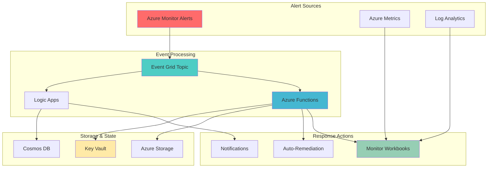

# Intelligent Alert Response Automation with Monitor Workbooks and Azure Functions

## Problem

Organizations struggle with alert fatigue when monitoring complex Azure environments, often receiving hundreds of alerts daily without adequate context or automated remediation. Traditional monitoring solutions create reactive workflows where alerts are manually triaged, contextual information is scattered across multiple dashboards, and remediation actions require manual intervention. This leads to increased mean time to resolution (MTTR), missed critical issues, and operational inefficiencies that can impact business continuity and customer satisfaction.

## Solution

Azure Monitor Workbooks combined with Azure Functions, Event Grid, and Logic Apps create an intelligent alert response system that automatically generates contextual dashboards, triggers smart remediation actions, and provides enriched notifications. This solution uses workbooks to visualize alert patterns and system health, Functions to process alerts and execute automated responses, Event Grid to orchestrate event-driven workflows, and Logic Apps to handle complex notification and approval workflows for seamless incident response.

## Architecture Diagram



## Prerequisites

1. Azure account with appropriate permissions for creating Monitor, Functions, Event Grid, and Logic Apps resources
2. Azure CLI v2.69.0 or later installed and configured (or Azure Cloud Shell)
3. Basic understanding of Azure monitoring concepts, serverless functions, and event-driven architectures
4. Familiarity with KQL (Kusto Query Language) for log analytics and workbook queries
5. Estimated cost: $15-30 per month for development/testing (varies by region and usage patterns)

> **Note**: This recipe requires permissions to create and manage Azure Monitor resources, Functions, Event Grid topics, and Logic Apps. Review the [Azure Monitor documentation](https://docs.microsoft.com/en-us/azure/azure-monitor/) for detailed role requirements and pricing information.

## Preparation

```bash
# Set environment variables for Azure resources
export RESOURCE_GROUP="rg-intelligent-alerts-${RANDOM_SUFFIX}"
export LOCATION="eastus"
export SUBSCRIPTION_ID=$(az account show --query id --output tsv)

# Generate unique suffix for resource names
RANDOM_SUFFIX=$(openssl rand -hex 3)

# Validate resource names don't exceed Azure limits
if [ ${#STORAGE_ACCOUNT} -gt 24 ]; then
    echo "Error: Storage account name too long. Adjusting..."
    STORAGE_ACCOUNT="stint${RANDOM_SUFFIX}"
fi

# Set resource names with unique suffix
export STORAGE_ACCOUNT="stintelligent${RANDOM_SUFFIX}"
export FUNCTION_APP="func-alert-response-${RANDOM_SUFFIX}"
export EVENT_GRID_TOPIC="eg-alerts-${RANDOM_SUFFIX}"
export LOGIC_APP="logic-notifications-${RANDOM_SUFFIX}"
export COSMOS_DB="cosmos-alertstate-${RANDOM_SUFFIX}"
export KEY_VAULT="kv-alerts-${RANDOM_SUFFIX}"
export LOG_ANALYTICS="law-monitoring-${RANDOM_SUFFIX}"

# Create resource group
az group create \
    --name ${RESOURCE_GROUP} \
    --location ${LOCATION} \
    --tags purpose=intelligent-alerts environment=demo

echo "✅ Resource group created: ${RESOURCE_GROUP}"

# Create Log Analytics workspace for monitoring
az monitor log-analytics workspace create \
    --resource-group ${RESOURCE_GROUP} \
    --workspace-name ${LOG_ANALYTICS} \
    --location ${LOCATION} \
    --sku pergb2018

echo "✅ Log Analytics workspace created: ${LOG_ANALYTICS}"
```

## Steps

1. **Create Storage Account and Key Vault for Secure Configuration**:

   Azure Storage provides the foundation for Function Apps while Key Vault ensures secure management of secrets and configuration data. This combination enables serverless alert processing with enterprise-grade security, supporting both function execution requirements and sensitive credential storage needed for alert response automation.

   ```bash
   # Create storage account for Function App
   az storage account create \
       --name ${STORAGE_ACCOUNT} \
       --resource-group ${RESOURCE_GROUP} \
       --location ${LOCATION} \
       --sku Standard_LRS \
       --kind StorageV2 \
       --https-only true
   
   # Create Key Vault for secure configuration with RBAC
   az keyvault create \
       --name ${KEY_VAULT} \
       --resource-group ${RESOURCE_GROUP} \
       --location ${LOCATION} \
       --sku standard \
       --enable-rbac-authorization true \
       --enable-soft-delete true \
       --retention-days 7
   
   echo "✅ Storage account and Key Vault created successfully"
   ```

   The storage account now supports Function App operations with secure HTTPS-only access, while Key Vault provides centralized secret management with RBAC authorization and soft-delete protection. This security-first approach ensures alert processing functions can access required credentials while maintaining compliance with enterprise security policies and data protection requirements.

2. **Create Cosmos DB for Alert State Management**:

   Cosmos DB provides globally distributed, low-latency storage for tracking alert states, response history, and system context. This NoSQL database enables the intelligent alert system to maintain historical context, track response patterns, and support advanced analytics for continuous improvement of alert response effectiveness.

   ```bash
   # Create Cosmos DB account
   az cosmosdb create \
       --name ${COSMOS_DB} \
       --resource-group ${RESOURCE_GROUP} \
       --location ${LOCATION} \
       --kind GlobalDocumentDB \
       --enable-free-tier false \
       --default-consistency-level Session
   
   # Create database and container for alert tracking
   az cosmosdb sql database create \
       --account-name ${COSMOS_DB} \
       --resource-group ${RESOURCE_GROUP} \
       --name AlertDatabase
   
   az cosmosdb sql container create \
       --account-name ${COSMOS_DB} \
       --resource-group ${RESOURCE_GROUP} \
       --database-name AlertDatabase \
       --name AlertStates \
       --partition-key-path "/alertId" \
       --throughput 400
   
   echo "✅ Cosmos DB created with alert state tracking container"
   ```

   The Cosmos DB database now provides persistent storage for alert state information with session-level consistency, enabling the system to track alert lifecycle, response effectiveness, and maintain context across multiple alert events for improved decision-making.

3. **Create Event Grid Topic for Alert Orchestration**:

   Event Grid enables decoupled, event-driven architecture for alert processing by providing reliable event delivery and fan-out capabilities. This service acts as the central nervous system for the intelligent alert response system, routing events to appropriate handlers while maintaining delivery guarantees and supporting retry policies for resilient alert processing.

   ```bash
   # Create Event Grid topic
   az eventgrid topic create \
       --name ${EVENT_GRID_TOPIC} \
       --resource-group ${RESOURCE_GROUP} \
       --location ${LOCATION}
   
   # Get Event Grid connection string for later use
   EVENT_GRID_KEY=$(az eventgrid topic key list \
       --name ${EVENT_GRID_TOPIC} \
       --resource-group ${RESOURCE_GROUP} \
       --query key1 --output tsv)
   
   EVENT_GRID_ENDPOINT=$(az eventgrid topic show \
       --name ${EVENT_GRID_TOPIC} \
       --resource-group ${RESOURCE_GROUP} \
       --query endpoint --output tsv)
   
   echo "✅ Event Grid topic created: ${EVENT_GRID_TOPIC}"
   ```

   The Event Grid topic is now configured to receive and distribute alert events with high availability and at-least-once delivery guarantees. This foundational component enables the system to scale horizontally and maintain reliability during high-volume alert scenarios.

4. **Create Azure Function App for Alert Processing**:

   Azure Functions provide serverless compute for processing alerts, executing remediation logic, and generating dynamic responses. The consumption plan ensures cost-effective scaling during varying alert volumes while maintaining sub-second cold start times for critical alert processing scenarios.

   ```bash
   # Create Function App with system-assigned managed identity
   az functionapp create \
       --name ${FUNCTION_APP} \
       --resource-group ${RESOURCE_GROUP} \
       --storage-account ${STORAGE_ACCOUNT} \
       --consumption-plan-location ${LOCATION} \
       --runtime python \
       --runtime-version 3.11 \
       --functions-version 4 \
       --os-type Linux \
       --assign-identity [system]
   
   # Configure Function App settings
   az functionapp config appsettings set \
       --name ${FUNCTION_APP} \
       --resource-group ${RESOURCE_GROUP} \
       --settings \
       "COSMOS_DB_CONNECTION_STRING=@Microsoft.KeyVault(SecretUri=https://${KEY_VAULT}.vault.azure.net/secrets/cosmos-connection/)" \
       "EVENT_GRID_ENDPOINT=${EVENT_GRID_ENDPOINT}" \
       "EVENT_GRID_KEY=@Microsoft.KeyVault(SecretUri=https://${KEY_VAULT}.vault.azure.net/secrets/eventgrid-key/)" \
       "LOG_ANALYTICS_WORKSPACE_ID=$(az monitor log-analytics workspace show --resource-group ${RESOURCE_GROUP} --workspace-name ${LOG_ANALYTICS} --query customerId --output tsv)"
   
   echo "✅ Function App created and configured"
   ```

   The Function App is now ready to process alerts with secure configuration management through Key Vault references. This setup enables the functions to access Cosmos DB for state management, Event Grid for event publishing, and Log Analytics for monitoring data while maintaining security best practices.

5. **Create Logic App for Notification Orchestration**:

   Logic Apps provide visual workflow orchestration for complex notification scenarios, approval processes, and integration with external systems. This service handles the business logic for alert notifications, including escalation policies, team routing, and integration with communication platforms like Microsoft Teams or Slack.

   ```bash
   # Create Logic App
   az logic workflow create \
       --name ${LOGIC_APP} \
       --resource-group ${RESOURCE_GROUP} \
       --location ${LOCATION} \
       --definition '{
         "$schema": "https://schema.management.azure.com/providers/Microsoft.Logic/schemas/2016-06-01/workflowdefinition.json#",
         "contentVersion": "1.0.0.0",
         "parameters": {},
         "triggers": {
           "manual": {
             "type": "Request",
             "kind": "Http",
             "inputs": {
               "schema": {
                 "type": "object",
                 "properties": {
                   "alertId": {"type": "string"},
                   "severity": {"type": "string"},
                   "resourceId": {"type": "string"},
                   "alertContext": {"type": "object"}
                 }
               }
             }
           }
         },
         "actions": {
           "Initialize_Response": {
             "type": "InitializeVariable",
             "inputs": {
               "variables": [{
                 "name": "notificationSent",
                 "type": "boolean",
                 "value": true
               }]
             }
           }
         },
         "outputs": {}
       }'
   
   # Get Logic App trigger URL
   LOGIC_APP_URL=$(az logic workflow show \
       --name ${LOGIC_APP} \
       --resource-group ${RESOURCE_GROUP} \
       --query "accessEndpoint" --output tsv)
   
   echo "✅ Logic App created for notification orchestration"
   ```

   The Logic App now provides a flexible notification engine that can be extended with connectors for various communication platforms. This workflow foundation enables complex notification scenarios including escalation chains, approval workflows, and integration with ITSM systems for comprehensive alert management.

6. **Deploy Function Code for Alert Processing**:

   The Function App requires custom code to process alerts, interact with Cosmos DB, and trigger workbook updates. This Python-based function implements the core logic for intelligent alert processing, including severity assessment, context enrichment, and automated response coordination.

   ```bash
   # Create function code directory
   mkdir -p /tmp/alert-functions
   cd /tmp/alert-functions
   
   # Create requirements.txt
   cat > requirements.txt << EOF
   azure-functions
   azure-cosmos
   azure-eventgrid
   azure-monitor-query
   azure-identity
   requests
   EOF
   
   # Create main function file
   cat > function_app.py << 'EOF'
   import azure.functions as func
   import json
   import logging
   import os
   from azure.cosmos import CosmosClient
   from azure.eventgrid import EventGridPublisherClient
   from azure.core.credentials import AzureKeyCredential
   from azure.identity import DefaultAzureCredential
   
   app = func.FunctionApp()
   
   @app.function_name("ProcessAlert")
   @app.event_grid_trigger(arg_name="event")
   def process_alert(event: func.EventGridEvent):
       logging.info(f"Processing alert: {event.get_json()}")
       
       # Parse alert data
       alert_data = event.get_json()
       alert_id = alert_data.get('alertId', 'unknown')
       severity = alert_data.get('severity', 'medium')
       
       # Store alert state in Cosmos DB
       cosmos_client = CosmosClient.from_connection_string(
           os.environ['COSMOS_DB_CONNECTION_STRING']
       )
       database = cosmos_client.get_database_client('AlertDatabase')
       container = database.get_container_client('AlertStates')
       
       alert_state = {
           'id': alert_id,
           'alertId': alert_id,
           'severity': severity,
           'status': 'processing',
           'timestamp': event.event_time.isoformat(),
           'data': alert_data
       }
       
       container.create_item(alert_state)
       logging.info(f"Alert state stored for {alert_id}")
       
       # Trigger workbook update if high severity
       if severity in ['high', 'critical']:
           update_workbook(alert_data)
   
   def update_workbook(alert_data):
       # Logic to refresh workbook data
       logging.info("Triggering workbook update for critical alert")
   EOF
   
   # Create host.json
   cat > host.json << 'EOF'
   {
     "version": "2.0",
     "functionTimeout": "00:05:00",
     "logging": {
       "applicationInsights": {
         "samplingSettings": {
           "isEnabled": true
         }
       }
     },
     "extensions": {
       "eventGrid": {
         "maxEventsPerBatch": 1
       }
     }
   }
   EOF
   
   # Deploy function code
   cd /tmp/alert-functions
   zip -r function-code.zip .
   
   az functionapp deployment source config-zip \
       --name ${FUNCTION_APP} \
       --resource-group ${RESOURCE_GROUP} \
       --src function-code.zip
   
   echo "✅ Function code deployed successfully"
   ```

   The Function App now contains custom alert processing logic that persists alert states, triggers workbook updates for critical alerts, and provides the foundation for intelligent response automation. This serverless architecture ensures the system can scale to handle thousands of alerts while maintaining low latency response times.

7. **Create Event Grid Subscription for Alert Processing**:

   Event Grid subscriptions connect alert sources to processing functions, enabling automatic routing of alerts to appropriate handlers. This configuration ensures that Azure Monitor alerts are automatically processed by the intelligent response system without manual intervention.

   ```bash
   # Create Event Grid subscription for Function App
   az eventgrid event-subscription create \
       --name "alerts-to-function" \
       --source-resource-id "/subscriptions/${SUBSCRIPTION_ID}/resourceGroups/${RESOURCE_GROUP}/providers/Microsoft.EventGrid/topics/${EVENT_GRID_TOPIC}" \
       --endpoint-type azurefunction \
       --endpoint "/subscriptions/${SUBSCRIPTION_ID}/resourceGroups/${RESOURCE_GROUP}/providers/Microsoft.Web/sites/${FUNCTION_APP}/functions/ProcessAlert" \
       --included-event-types Microsoft.AlertManagement.Alert.Activated Microsoft.AlertManagement.Alert.Resolved
   
   # Get Logic App trigger URL for webhook subscription
   LOGIC_APP_TRIGGER_URL=$(az logic workflow show \
       --name ${LOGIC_APP} \
       --resource-group ${RESOURCE_GROUP} \
       --query "accessEndpoint" --output tsv)
   
   # Create subscription for Logic App notifications
   az eventgrid event-subscription create \
       --name "alerts-to-logic" \
       --source-resource-id "/subscriptions/${SUBSCRIPTION_ID}/resourceGroups/${RESOURCE_GROUP}/providers/Microsoft.EventGrid/topics/${EVENT_GRID_TOPIC}" \
       --endpoint-type webhook \
       --endpoint "${LOGIC_APP_TRIGGER_URL}" \
       --included-event-types Microsoft.AlertManagement.Alert.Activated \
       --advanced-filter data.severity StringIn high critical
   
   echo "✅ Event Grid subscriptions created for alert routing"
   ```

   The Event Grid subscriptions now automatically route alerts to both the Function App for processing and the Logic App for high-severity notifications. This event-driven architecture ensures immediate response to critical alerts while maintaining efficient processing of all alert types.

8. **Create Azure Monitor Workbook for Alert Dashboard**:

   Azure Monitor Workbooks provide interactive dashboards for visualizing alert patterns, system health metrics, and response effectiveness. This workbook combines multiple data sources to create comprehensive views of the intelligent alert system's performance and operational insights.

   ```bash
   # Generate UUID for workbook name (required by Azure CLI)
   WORKBOOK_UUID=$(python3 -c "import uuid; print(str(uuid.uuid4()))") || \
   WORKBOOK_UUID=$(uuidgen | tr '[:upper:]' '[:lower:]') 2>/dev/null || \
   WORKBOOK_UUID="$(openssl rand -hex 16 | sed 's/\(.\{8\}\)\(.\{4\}\)\(.\{4\}\)\(.\{4\}\)\(.\{12\}\)/\1-\2-\3-\4-\5/')"
   
   # Create workbook template JSON
   cat > /tmp/alert-workbook.json << 'EOF'
   {
     "version": "Notebook/1.0",
     "items": [
       {
         "type": 1,
         "content": {
           "json": "# Intelligent Alert Response Dashboard\n\nThis workbook provides real-time insights into alert patterns, response effectiveness, and system health."
         }
       },
       {
         "type": 3,
         "content": {
           "version": "KqlItem/1.0",
           "query": "AlertsManagementResources\n| where type == \"microsoft.alertsmanagement/alerts\"\n| summarize AlertCount = count() by tostring(properties.severity)\n| order by AlertCount desc",
           "size": 1,
           "title": "Alert Count by Severity",
           "queryType": 1,
           "resourceType": "microsoft.resourcegraph/resources",
           "visualization": "piechart"
         }
       },
       {
         "type": 3,
         "content": {
           "version": "KqlItem/1.0",
           "query": "AlertsManagementResources\n| where type == \"microsoft.alertsmanagement/alerts\"\n| extend AlertTime = todatetime(properties.essentials.startDateTime)\n| where AlertTime > ago(24h)\n| summarize AlertCount = count() by bin(AlertTime, 1h)\n| order by AlertTime asc",
           "size": 0,
           "title": "Alert Trends (24 Hours)",
           "queryType": 1,
           "resourceType": "microsoft.resourcegraph/resources",
           "visualization": "timechart"
         }
       }
     ]
   }
   EOF
   
   # Create the workbook using Application Insights workbook command
   az monitor app-insights workbook create \
       --name "${WORKBOOK_UUID}" \
       --resource-group ${RESOURCE_GROUP} \
       --location ${LOCATION} \
       --category "monitoring" \
       --serialized-data "@/tmp/alert-workbook.json" \
       --display-name "Intelligent Alert Response Dashboard" \
       --description "Comprehensive dashboard for intelligent alert response system" \
       --kind shared
   
   echo "✅ Monitor Workbook created successfully"
   ```

   The workbook now provides visual insights into alert patterns, severity distribution, and trending data. This interactive dashboard enables operations teams to quickly understand system health, identify patterns, and make data-driven decisions about alert response strategies.

9. **Configure Key Vault Secrets for Secure Access**:

   Key Vault secrets store sensitive connection strings and API keys required by the intelligent alert system. This configuration ensures secure access to Cosmos DB, Event Grid, and other services while maintaining compliance with security best practices and enabling seamless credential rotation.

   ```bash
   # Store Cosmos DB connection string
   COSMOS_CONNECTION=$(az cosmosdb keys list \
       --name ${COSMOS_DB} \
       --resource-group ${RESOURCE_GROUP} \
       --type connection-strings \
       --query "connectionStrings[0].connectionString" --output tsv)
   
   az keyvault secret set \
       --vault-name ${KEY_VAULT} \
       --name "cosmos-connection" \
       --value "${COSMOS_CONNECTION}"
   
   # Store Event Grid access key
   az keyvault secret set \
       --vault-name ${KEY_VAULT} \
       --name "eventgrid-key" \
       --value "${EVENT_GRID_KEY}"
   
   # Wait for Function App managed identity to be fully created
   echo "Waiting for managed identity propagation..."
   sleep 45
   
   # Get Function App managed identity principal ID
   FUNCTION_IDENTITY=$(az functionapp identity show \
       --name ${FUNCTION_APP} \
       --resource-group ${RESOURCE_GROUP} \
       --query principalId --output tsv)
   
   # Verify the identity was created successfully
   if [ -z "${FUNCTION_IDENTITY}" ]; then
       echo "Error: Function App managed identity not found"
       exit 1
   fi
   
   # Assign Key Vault Secrets User role to Function App (RBAC-based access)
   az role assignment create \
       --role "Key Vault Secrets User" \
       --assignee ${FUNCTION_IDENTITY} \
       --scope "/subscriptions/${SUBSCRIPTION_ID}/resourceGroups/${RESOURCE_GROUP}/providers/Microsoft.KeyVault/vaults/${KEY_VAULT}" \
       --assignee-object-id ${FUNCTION_IDENTITY} \
       --assignee-principal-type ServicePrincipal
   
   echo "✅ Key Vault secrets configured with secure access"
   ```

   Key Vault now securely stores all sensitive configuration data with RBAC-based access control and soft-delete protection. The Function App can access required secrets through its system-assigned managed identity, eliminating the need for hardcoded credentials while maintaining security compliance and enabling automated credential rotation through Azure's identity management services.

10. **Create Sample Alert Rule for Testing**:

    A test alert rule validates the intelligent response system by generating controlled alert scenarios. This rule monitors resource health and triggers the complete alert response workflow, enabling verification of event routing, function processing, workbook updates, and notification delivery.

    ```bash
    # Create action group for testing with Event Grid webhook
    az monitor action-group create \
        --name "test-alert-actions" \
        --resource-group ${RESOURCE_GROUP} \
        --short-name "testalert" \
        --action email admin test@example.com \
        --action webhook test-webhook "${EVENT_GRID_ENDPOINT}" \
        --tags environment=demo purpose=testing
    
    # Create test alert rule for Function App CPU monitoring
    FUNCTION_APP_RESOURCE_ID="/subscriptions/${SUBSCRIPTION_ID}/resourceGroups/${RESOURCE_GROUP}/providers/Microsoft.Web/sites/${FUNCTION_APP}"
    
    az monitor metrics alert create \
        --name "test-cpu-alert" \
        --resource-group ${RESOURCE_GROUP} \
        --scopes "${FUNCTION_APP_RESOURCE_ID}" \
        --condition "avg CpuPercentage > 80" \
        --window-size 5m \
        --evaluation-frequency 1m \
        --action "test-alert-actions" \
        --description "Test alert rule for intelligent response system" \
        --severity 2 \
        --enabled true
    
    echo "✅ Test alert rule created for system validation"
    ```

    The test alert rule now provides a controlled mechanism for validating the intelligent alert response system. This configuration enables end-to-end testing of alert processing, workbook updates, and notification delivery while monitoring actual system metrics.

## Validation & Testing

1. **Verify Resource Deployment and Configuration**:

   ```bash
   # Check Function App status
   az functionapp show \
       --name ${FUNCTION_APP} \
       --resource-group ${RESOURCE_GROUP} \
       --query "{name:name, state:state, hostNames:hostNames}" \
       --output table
   
   # Verify Event Grid topic
   az eventgrid topic show \
       --name ${EVENT_GRID_TOPIC} \
       --resource-group ${RESOURCE_GROUP} \
       --query "{name:name, provisioningState:provisioningState}" \
       --output table
   
   # Check Cosmos DB status
   az cosmosdb show \
       --name ${COSMOS_DB} \
       --resource-group ${RESOURCE_GROUP} \
       --query "{name:name, provisioningState:provisioningState}" \
       --output table
   ```

   Expected output: All resources should show "Succeeded" provisioning state and Function App should be in "Running" state.

2. **Test Alert Processing Function**:

   ```bash
   # Send test event to Event Grid
   az eventgrid event send \
       --topic-name ${EVENT_GRID_TOPIC} \
       --resource-group ${RESOURCE_GROUP} \
       --events '[
         {
           "id": "test-alert-001",
           "eventType": "Microsoft.AlertManagement.Alert.Activated",
           "subject": "Test Alert",
           "eventTime": "'$(date -u +%Y-%m-%dT%H:%M:%SZ)'",
           "data": {
             "alertId": "test-alert-001",
             "severity": "high",
             "resourceId": "/subscriptions/test/resourceGroups/test/providers/Microsoft.Compute/virtualMachines/testvm",
             "alertContext": {
               "condition": "CPU > 80%",
               "timestamp": "'$(date -u +%Y-%m-%dT%H:%M:%SZ)'"
             }
           }
         }
       ]'
   
   # Check Function App logs via Log Analytics
   sleep 60  # Wait for logs to be available
   
   # Query Function App logs from Log Analytics workspace
   LOG_WORKSPACE_ID=$(az monitor log-analytics workspace show \
       --resource-group ${RESOURCE_GROUP} \
       --workspace-name ${LOG_ANALYTICS} \
       --query customerId --output tsv)
   
   az monitor log-analytics query \
       --workspace ${LOG_WORKSPACE_ID} \
       --analytics-query "FunctionAppLogs | where TimeGenerated > ago(10m) | where Message contains 'Processing alert' | project TimeGenerated, Message, Level | order by TimeGenerated desc | limit 20" \
       --output table
   ```

   Expected output: Function logs should show successful event processing, Cosmos DB operations, and Event Grid message handling. Look for log entries confirming alert state storage and workbook update triggers.

3. **Validate Workbook Functionality**:

   ```bash
   # Get workbook details using Application Insights command
   az monitor app-insights workbook show \
       --name "${WORKBOOK_UUID}" \
       --resource-group ${RESOURCE_GROUP} \
       --query "{name:name, category:category, displayName:displayName}" \
       --output table
   
   # Check if workbook is accessible
   WORKBOOK_RESOURCE_ID=$(az monitor app-insights workbook show \
       --name "${WORKBOOK_UUID}" \
       --resource-group ${RESOURCE_GROUP} \
       --query "id" --output tsv)
   
   echo "Workbook URL: https://portal.azure.com/#@${SUBSCRIPTION_ID}/resource${WORKBOOK_RESOURCE_ID}"
   ```

   Expected output: Workbook should be accessible through the Azure portal with alert visualization components.

4. **Test Alert State Storage**:

   ```bash
   # Query Cosmos DB for stored alert states
   az cosmosdb sql query \
       --account-name ${COSMOS_DB} \
       --resource-group ${RESOURCE_GROUP} \
       --database-name AlertDatabase \
       --container-name AlertStates \
       --query-text "SELECT * FROM c WHERE c.alertId = 'test-alert-001'"
   ```

   Expected output: Query should return the test alert state data stored by the processing function.

## Cleanup

1. **Remove test alert rule and action group**:

   ```bash
   # Delete test alert rule
   az monitor metrics alert delete \
       --name "test-cpu-alert" \
       --resource-group ${RESOURCE_GROUP}
   
   # Delete action group
   az monitor action-group delete \
       --name "test-alert-actions" \
       --resource-group ${RESOURCE_GROUP}
   
   echo "✅ Test alert resources removed"
   ```

2. **Remove Event Grid subscriptions**:

   ```bash
   # Delete Event Grid subscriptions
   echo "Removing Event Grid subscriptions..."
   
   az eventgrid event-subscription delete \
       --name "alerts-to-function" \
       --source-resource-id "/subscriptions/${SUBSCRIPTION_ID}/resourceGroups/${RESOURCE_GROUP}/providers/Microsoft.EventGrid/topics/${EVENT_GRID_TOPIC}" \
       --yes
   
   az eventgrid event-subscription delete \
       --name "alerts-to-logic" \
       --source-resource-id "/subscriptions/${SUBSCRIPTION_ID}/resourceGroups/${RESOURCE_GROUP}/providers/Microsoft.EventGrid/topics/${EVENT_GRID_TOPIC}" \
       --yes
   
   echo "✅ Event Grid subscriptions deleted"
   ```

3. **Remove all Azure resources**:

   ```bash
   # Delete resource group and all contained resources
   az group delete \
       --name ${RESOURCE_GROUP} \
       --yes \
       --no-wait
   
   echo "✅ Resource group deletion initiated: ${RESOURCE_GROUP}"
   echo "Note: Deletion may take several minutes to complete"
   
   # Clean up local files and environment variables
   rm -rf /tmp/alert-functions
   rm -f /tmp/alert-workbook.json
   
   # Clear environment variables
   unset RESOURCE_GROUP LOCATION SUBSCRIPTION_ID RANDOM_SUFFIX
   unset STORAGE_ACCOUNT FUNCTION_APP EVENT_GRID_TOPIC LOGIC_APP
   unset COSMOS_DB KEY_VAULT LOG_ANALYTICS WORKBOOK_UUID
   
   echo "✅ Cleanup completed successfully"
   ```

## Discussion

The intelligent alert response system demonstrates the power of Azure's event-driven architecture for creating automated, contextual monitoring solutions. By combining Azure Monitor Workbooks with Functions, Event Grid, and Logic Apps, organizations can transform reactive alert handling into proactive, intelligent response systems. This architecture follows the [Azure Well-Architected Framework](https://docs.microsoft.com/en-us/azure/architecture/framework/) principles of reliability, security, and operational excellence, while leveraging Azure's serverless compute capabilities for cost-effective scaling.

The event-driven design enables horizontal scaling during high-volume alert scenarios while maintaining low latency for critical alert processing. Azure Functions provide cost-effective serverless compute that scales automatically based on alert volume, while Event Grid ensures reliable event delivery with built-in retry mechanisms. The integration with Cosmos DB enables persistent state management and historical analytics, supporting continuous improvement of alert response strategies. For comprehensive guidance on serverless architectures, review the [Azure Functions documentation](https://docs.microsoft.com/en-us/azure/azure-functions/) and [Event Grid best practices](https://docs.microsoft.com/en-us/azure/event-grid/security-authentication).

From a security perspective, the solution implements defense-in-depth principles through Key Vault integration with RBAC authorization, system-assigned managed identity authentication, and Azure Active Directory-based access control. This approach ensures sensitive credentials are never exposed in code or configuration files while maintaining compliance with enterprise security policies and zero-trust principles. The workbook component provides real-time visualization without direct access to underlying data sources, with queries executed through Azure Resource Graph for secure, read-only access to alert metadata.

The system's extensibility allows for integration with external ITSM tools, communication platforms, and custom remediation scripts. Logic Apps provide visual workflow orchestration for complex scenarios such as escalation chains, approval processes, and multi-step remediation procedures. This flexibility ensures the solution can adapt to diverse organizational requirements while maintaining operational consistency. For monitoring and optimization guidance, see the [Azure Monitor best practices documentation](https://docs.microsoft.com/en-us/azure/azure-monitor/best-practices).

> **Tip**: Use Azure Monitor Application Insights to track function performance and identify optimization opportunities. Enable distributed tracing and custom metrics to gain deeper insights into alert processing latency and success rates. The [Azure Functions monitoring documentation](https://docs.microsoft.com/en-us/azure/azure-functions/functions-monitoring) provides comprehensive guidance on performance optimization.

## Challenge

Extend this intelligent alert response system by implementing these enhancements:

1. **Machine Learning Integration**: Implement Azure Machine Learning models to predict alert patterns and optimize response strategies based on historical data and system context.

2. **Multi-Tenant Support**: Extend the system to support multiple teams or departments with isolated workbooks, custom notification rules, and role-based access control for enterprise-wide deployment.

3. **Advanced Remediation Engine**: Create a comprehensive remediation system using Azure Automation runbooks that can automatically resolve common issues like restarting services, scaling resources, or applying configuration changes.

4. **Integration Hub**: Build connectors for popular ITSM tools (ServiceNow, Jira), communication platforms (Microsoft Teams, Slack), and monitoring tools (Datadog, Splunk) to create a unified alert management experience.

5. **Predictive Analytics Dashboard**: Develop advanced workbooks that use machine learning insights to predict system failures, recommend preventive actions, and provide capacity planning guidance based on alert patterns and resource utilization trends.

## Infrastructure Code

### Available Infrastructure as Code:

- [Infrastructure Code Overview](code/README.md) - Detailed description of all infrastructure components
- [Bicep](code/bicep/) - Azure Bicep templates
- [Bash CLI Scripts](code/scripts/) - Example bash scripts using Azure CLI commands to deploy infrastructure
- [Terraform](code/terraform/) - Terraform configuration files