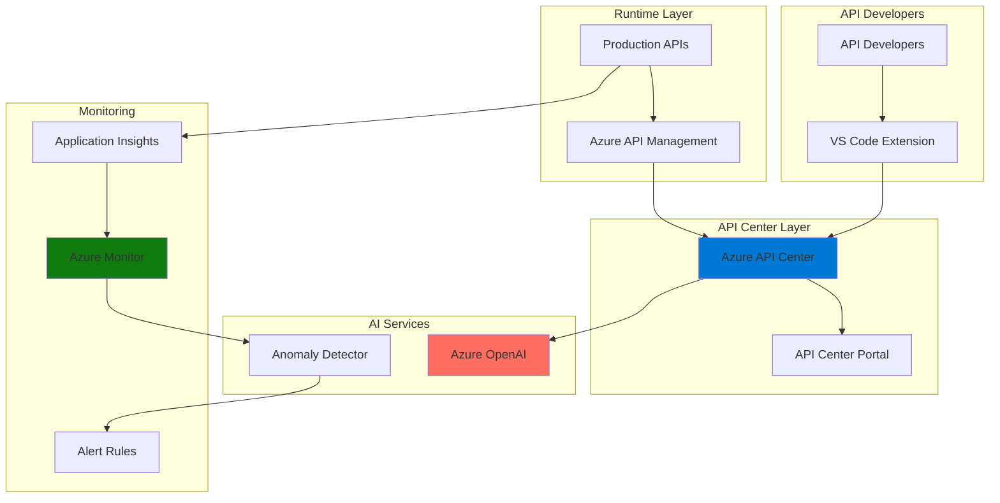

# Intelligent API Lifecycle with API Center and AI Services

## Problem

Organizations managing dozens or hundreds of APIs face significant challenges with API discovery, documentation maintenance, and performance monitoring. Development teams struggle to find the right APIs, maintain accurate documentation, and detect performance anomalies before they impact consumers. Manual API governance processes lead to inconsistent standards, outdated documentation, and missed opportunities for API reuse across the organization.

## Solution

This recipe demonstrates building an intelligent API lifecycle management system using Azure API Center for centralized API governance and discovery, integrated with Azure AI Services for automated documentation generation and Azure Monitor with anomaly detection capabilities. The solution provides AI-powered documentation updates, intelligent API discovery, and proactive performance monitoring to ensure high-quality API delivery throughout the entire lifecycle.

## Architecture Diagram



## Prerequisites

1. Azure subscription with appropriate permissions to create resources
2. Azure CLI v2.55.0 or later installed and configured (or use Azure Cloud Shell)
3. Basic understanding of API management concepts and REST APIs
4. Azure API Management instance (optional, for runtime integration)
5. Estimated cost: ~$50-100/month for minimal production setup

> **Note**: Azure API Center offers both Free and Standard plans. This recipe uses the Free plan for demonstration, but production workloads should use the Standard plan for advanced features.

## Preparation

```bash
# Set environment variables
export RESOURCE_GROUP="rg-api-lifecycle-${RANDOM_SUFFIX}"
export LOCATION="eastus"
export SUBSCRIPTION_ID=$(az account show --query id --output tsv)

# Generate unique suffix for resource names
RANDOM_SUFFIX=$(openssl rand -hex 3)

# Create resource group
az group create \
    --name ${RESOURCE_GROUP} \
    --location ${LOCATION} \
    --tags purpose=recipe environment=demo

# Set additional variables for services
export API_CENTER_NAME="apic-${RANDOM_SUFFIX}"
export OPENAI_NAME="openai-${RANDOM_SUFFIX}"
export MONITOR_WORKSPACE="law-${RANDOM_SUFFIX}"
export APIM_NAME="apim-${RANDOM_SUFFIX}"

echo "✅ Resource group created: ${RESOURCE_GROUP}"
```

## Steps

1. **Create Azure API Center Instance**:

   Azure API Center provides a centralized inventory for all your APIs, enabling unified governance and discovery across your organization. Unlike runtime API gateways, API Center focuses on design-time governance, allowing you to register APIs from any source including Azure API Management, third-party gateways, or even unmanaged APIs. This centralization is crucial for preventing API sprawl and ensuring consistent standards.

   ```bash
   # Create API Center instance (Free tier)
   az apic service create \
       --name ${API_CENTER_NAME} \
       --resource-group ${RESOURCE_GROUP} \
       --location ${LOCATION}
   
   # Store API Center resource ID
   API_CENTER_ID=$(az apic service show \
       --name ${API_CENTER_NAME} \
       --resource-group ${RESOURCE_GROUP} \
       --query id --output tsv)
   
   echo "✅ API Center created: ${API_CENTER_NAME}"
   ```

   The API Center is now ready to serve as your organization's central API repository. This foundation enables comprehensive API discovery, governance, and lifecycle management across all development teams and API consumers.

2. **Configure API Center Metadata Schema**:

   Custom metadata in API Center allows organizations to implement their specific governance requirements and classification systems. By defining metadata schemas, you can categorize APIs by business domain, lifecycle stage, security requirements, or any other organizational criteria. This structured approach enables powerful filtering and discovery capabilities for API consumers.

   ```bash
   # Create custom metadata schema for API classification
   az apic metadata-schema create \
       --resource-group ${RESOURCE_GROUP} \
       --service-name ${API_CENTER_NAME} \
       --metadata-schema-name "api-lifecycle" \
       --schema '{
         "type": "object",
         "properties": {
           "lifecycleStage": {
             "type": "string",
             "enum": ["design", "development", "testing", "production", "deprecated"]
           },
           "businessDomain": {
             "type": "string",
             "enum": ["finance", "hr", "operations", "customer", "analytics"]
           },
           "dataClassification": {
             "type": "string",
             "enum": ["public", "internal", "confidential", "restricted"]
           }
         }
       }'
   
   echo "✅ Metadata schema configured for lifecycle management"
   ```

3. **Deploy Azure OpenAI for Documentation Generation**:

   Azure OpenAI Service provides advanced language models that can automatically generate and enhance API documentation based on OpenAPI specifications. This AI-powered approach ensures documentation stays current with API changes and maintains consistency across all APIs. The GPT-4 model excels at understanding API structures and generating human-readable descriptions.

   ```bash
   # Create Azure OpenAI resource
   az cognitiveservices account create \
       --name ${OPENAI_NAME} \
       --resource-group ${RESOURCE_GROUP} \
       --location ${LOCATION} \
       --kind OpenAI \
       --sku S0 \
       --custom-domain ${OPENAI_NAME}
   
   # Deploy GPT-4 model for documentation generation
   az cognitiveservices account deployment create \
       --name ${OPENAI_NAME} \
       --resource-group ${RESOURCE_GROUP} \
       --deployment-name "gpt-4" \
       --model-name "gpt-4" \
       --model-version "0613" \
       --model-format OpenAI \
       --scale-settings-scale-type "Standard"
   
   # Get OpenAI endpoint and key
   OPENAI_ENDPOINT=$(az cognitiveservices account show \
       --name ${OPENAI_NAME} \
       --resource-group ${RESOURCE_GROUP} \
       --query properties.endpoint --output tsv)
   
   OPENAI_KEY=$(az cognitiveservices account keys list \
       --name ${OPENAI_NAME} \
       --resource-group ${RESOURCE_GROUP} \
       --query key1 --output tsv)
   
   echo "✅ Azure OpenAI deployed with GPT-4 model"
   ```

   The OpenAI service is now configured to provide intelligent documentation generation capabilities. This integration will automatically enhance API descriptions, generate usage examples, and maintain consistency across your API documentation.

4. **Set Up Azure Monitor and Application Insights**:

   Azure Monitor provides comprehensive observability for your APIs, collecting metrics, logs, and traces to ensure optimal performance. Application Insights, built on Azure Monitor, offers deep application performance monitoring with automatic anomaly detection. This observability stack is essential for maintaining API reliability and identifying issues before they impact consumers.

   ```bash
   # Create Log Analytics workspace
   az monitor log-analytics workspace create \
       --name ${MONITOR_WORKSPACE} \
       --resource-group ${RESOURCE_GROUP} \
       --location ${LOCATION}
   
   # Create Application Insights instance
   az monitor app-insights component create \
       --app "appins-${RANDOM_SUFFIX}" \
       --location ${LOCATION} \
       --resource-group ${RESOURCE_GROUP} \
       --workspace ${MONITOR_WORKSPACE}
   
   # Get Application Insights connection string
   APP_INSIGHTS_CONNECTION=$(az monitor app-insights component show \
       --app "appins-${RANDOM_SUFFIX}" \
       --resource-group ${RESOURCE_GROUP} \
       --query connectionString --output tsv)
   
   echo "✅ Monitoring infrastructure deployed"
   ```

5. **Register Sample APIs in API Center**:

   Registering APIs in API Center creates a comprehensive inventory that includes API definitions, versions, and deployment information. This registration process supports various API specification formats including OpenAPI, GraphQL, and gRPC. Each API can have multiple versions and deployments, reflecting real-world API evolution and multi-environment scenarios.

   ```bash
   # Register a sample API
   az apic api create \
       --resource-group ${RESOURCE_GROUP} \
       --service-name ${API_CENTER_NAME} \
       --api-id "customer-api" \
       --title "Customer Management API" \
       --type REST \
       --description "API for managing customer data and operations"
   
   # Create API version
   az apic api version create \
       --resource-group ${RESOURCE_GROUP} \
       --service-name ${API_CENTER_NAME} \
       --api-id "customer-api" \
       --version-id "v1" \
       --title "Version 1.0" \
       --lifecycle-stage "production"
   
   # Add API definition (OpenAPI spec)
   az apic api definition create \
       --resource-group ${RESOURCE_GROUP} \
       --service-name ${API_CENTER_NAME} \
       --api-id "customer-api" \
       --version-id "v1" \
       --definition-id "openapi" \
       --title "OpenAPI Definition" \
       --specification '{
         "name": "openapi",
         "version": "3.0.0"
       }'
   
   echo "✅ Sample API registered in API Center"
   ```

6. **Configure API Import from Azure API Management**:

   Integration with Azure API Management enables automatic synchronization of runtime APIs with your API Center inventory. This bi-directional integration ensures that APIs deployed to production gateways are automatically discoverable in API Center, maintaining consistency between design-time governance and runtime management.

   ```bash
   # Create API Management instance (if not existing)
   az apim create \
       --name ${APIM_NAME} \
       --resource-group ${RESOURCE_GROUP} \
       --location ${LOCATION} \
       --publisher-email "admin@contoso.com" \
       --publisher-name "Contoso" \
       --sku-name Consumption
   
   # Import APIs from API Management to API Center
   az apic import-from-apim \
       --resource-group ${RESOURCE_GROUP} \
       --service-name ${API_CENTER_NAME} \
       --apim-name ${APIM_NAME} \
       --apim-resource-group ${RESOURCE_GROUP}
   
   echo "✅ API Management integration configured"
   ```

   The integration now automatically imports all APIs from your API Management instance into API Center, providing a unified view of both managed and unmanaged APIs across your organization.

7. **Enable API Center Portal for Discovery**:

   The API Center Portal provides a self-service interface where developers can discover, explore, and understand available APIs. This portal reduces friction in API adoption by providing search capabilities, filtering by metadata, and access to API documentation. The portal can be customized with your organization's branding and integrated with existing developer portals.

   ```bash
   # Enable API Center portal (requires Standard tier in production)
   # For demo purposes, we'll configure portal settings
   
   # Create storage account for portal assets
   STORAGE_ACCOUNT="st${RANDOM_SUFFIX}"
   az storage account create \
       --name ${STORAGE_ACCOUNT} \
       --resource-group ${RESOURCE_GROUP} \
       --location ${LOCATION} \
       --sku Standard_LRS \
       --kind StorageV2
   
   # Enable static website hosting
   az storage blob service-properties update \
       --account-name ${STORAGE_ACCOUNT} \
       --static-website \
       --index-document index.html \
       --404-document error.html
   
   echo "✅ API Portal infrastructure prepared"
   ```

8. **Implement Anomaly Detection for API Metrics**:

   Azure Anomaly Detector uses advanced machine learning to identify unusual patterns in API performance metrics without requiring manual threshold configuration. This proactive monitoring approach helps identify issues like traffic spikes, latency increases, or error rate anomalies before they impact API consumers. The service learns from historical patterns to provide increasingly accurate detection.

   ```bash
   # Create Anomaly Detector resource
   az cognitiveservices account create \
       --name "anomaly-${RANDOM_SUFFIX}" \
       --resource-group ${RESOURCE_GROUP} \
       --location ${LOCATION} \
       --kind AnomalyDetector \
       --sku F0 \
       --custom-domain "anomaly-${RANDOM_SUFFIX}"
   
   # Configure metric alerts with anomaly detection
   az monitor metrics alert create \
       --name "api-anomaly-alert" \
       --resource-group ${RESOURCE_GROUP} \
       --scopes ${API_CENTER_ID} \
       --condition "avg Percentage CPU > 80" \
       --description "Alert on API performance anomalies" \
       --evaluation-frequency 5m \
       --window-size 15m
   
   echo "✅ Anomaly detection configured for API monitoring"
   ```

9. **Set Up Automated Documentation Pipeline**:

   Automation ensures API documentation remains synchronized with API definitions and includes AI-enhanced descriptions. This pipeline monitors API definition changes and triggers documentation regeneration using Azure OpenAI. The automated approach eliminates manual documentation maintenance while ensuring consistency and completeness across all APIs.

   ```bash
   # Create Logic App for documentation automation
   LOGIC_APP_NAME="logic-${RANDOM_SUFFIX}"
   az logic workflow create \
       --name ${LOGIC_APP_NAME} \
       --resource-group ${RESOURCE_GROUP} \
       --location ${LOCATION} \
       --definition '{
         "definition": {
           "$schema": "https://schema.management.azure.com/providers/Microsoft.Logic/schemas/2016-06-01/workflowdefinition.json#",
           "triggers": {
             "When_API_Updated": {
               "type": "ApiConnection",
               "inputs": {
                 "host": {
                   "connection": {
                     "name": "@parameters('\''$connections'\'')['\''apicenter'\''].connectionId"
                   }
                 }
               }
             }
           },
           "actions": {
             "Generate_Documentation": {
               "type": "Http",
               "inputs": {
                 "method": "POST",
                 "uri": "@concat('\''https://api.openai.com/v1/completions'\'')",
                 "headers": {
                   "Authorization": "Bearer @{parameters('\''OpenAIKey'\'')}"
                 }
               }
             }
           }
         }
       }'
   
   echo "✅ Documentation automation pipeline created"
   ```

## Validation & Testing

1. Verify API Center deployment and API registration:

   ```bash
   # List registered APIs
   az apic api list \
       --resource-group ${RESOURCE_GROUP} \
       --service-name ${API_CENTER_NAME} \
       --output table
   
   # Check API details
   az apic api show \
       --resource-group ${RESOURCE_GROUP} \
       --service-name ${API_CENTER_NAME} \
       --api-id "customer-api" \
       --output json
   ```

   Expected output: List of registered APIs with metadata and version information.

2. Test Azure OpenAI documentation generation:

   ```bash
   # Test OpenAI endpoint
   curl -X POST ${OPENAI_ENDPOINT}/openai/deployments/gpt-4/completions \
       -H "Content-Type: application/json" \
       -H "api-key: ${OPENAI_KEY}" \
       -d '{
         "prompt": "Generate API documentation for a customer management endpoint",
         "max_tokens": 100
       }'
   ```

3. Verify monitoring and anomaly detection setup:

   ```bash
   # Check Application Insights configuration
   az monitor app-insights component show \
       --app "appins-${RANDOM_SUFFIX}" \
       --resource-group ${RESOURCE_GROUP} \
       --output table
   
   # List configured alerts
   az monitor metrics alert list \
       --resource-group ${RESOURCE_GROUP} \
       --output table
   ```

## Cleanup

1. Delete the resource group and all resources:

   ```bash
   # Delete resource group (removes all resources)
   az group delete \
       --name ${RESOURCE_GROUP} \
       --yes \
       --no-wait
   
   echo "✅ Resource group deletion initiated: ${RESOURCE_GROUP}"
   echo "Note: Deletion may take 5-10 minutes to complete"
   ```

2. Verify deletion status:

   ```bash
   # Check if resource group still exists
   az group exists --name ${RESOURCE_GROUP}
   ```

3. Clean up local environment variables:

   ```bash
   # Unset environment variables
   unset RESOURCE_GROUP LOCATION API_CENTER_NAME
   unset OPENAI_NAME MONITOR_WORKSPACE APIM_NAME
   unset RANDOM_SUFFIX API_CENTER_ID
   
   echo "✅ Environment variables cleaned up"
   ```

## Discussion

Azure API Center addresses the critical challenge of API sprawl by providing a centralized inventory for all organizational APIs, regardless of their deployment location or management platform. This design-time governance approach complements runtime API management solutions, creating a complete API lifecycle management ecosystem. The integration with Azure AI Services transforms traditional API documentation from a manual burden into an intelligent, self-maintaining system. For detailed architectural guidance, see the [Azure API Center documentation](https://learn.microsoft.com/en-us/azure/api-center/overview) and [API governance best practices](https://learn.microsoft.com/en-us/azure/architecture/example-scenario/apis/intelligent-api-governance).

The anomaly detection capabilities powered by Azure AI Services provide proactive monitoring that adapts to your API's unique traffic patterns. Unlike traditional threshold-based alerts, machine learning models identify subtle deviations that might indicate emerging issues. This intelligent monitoring approach aligns with the [Azure Well-Architected Framework](https://learn.microsoft.com/en-us/azure/architecture/framework/) reliability pillar, ensuring APIs maintain consistent performance and availability.

From a cost optimization perspective, the solution scales efficiently with API growth. The consumption-based pricing for Azure Functions and AI Services ensures costs align with actual usage, while the Free tier of API Center supports initial adoption. Organizations should monitor AI service usage to manage costs effectively, as documented in the [Azure OpenAI pricing guide](https://azure.microsoft.com/en-us/pricing/details/cognitive-services/openai-service/). The investment in automated documentation and anomaly detection typically pays for itself through reduced manual effort and prevented outages.

> **Tip**: Use the Azure API Center VS Code extension to enable developers to register and discover APIs directly from their development environment, further streamlining the API lifecycle. See the [VS Code extension documentation](https://learn.microsoft.com/en-us/azure/api-center/use-vscode-extension) for setup instructions.

## Challenge

Extend this solution by implementing these enhancements:

1. **Implement API versioning strategy**: Create an automated pipeline that manages API version transitions, including deprecation notices and consumer migration tracking using API Center's version management capabilities.

2. **Add multi-language documentation**: Extend the OpenAI integration to generate API documentation in multiple languages, storing translations in API Center's custom metadata fields.

3. **Build API quality scoring**: Develop a scoring system that evaluates APIs based on documentation completeness, performance metrics, and compliance with organizational standards, displaying scores in the API Center portal.

4. **Create developer onboarding automation**: Implement a workflow that automatically provisions API access, generates client SDKs, and sends personalized onboarding guides when developers discover new APIs through the portal.

5. **Enable predictive capacity planning**: Combine historical API usage data from Application Insights with Azure Machine Learning to predict future capacity requirements and automatically scale API Management instances.

## Infrastructure Code

*Infrastructure code will be generated after recipe approval.*