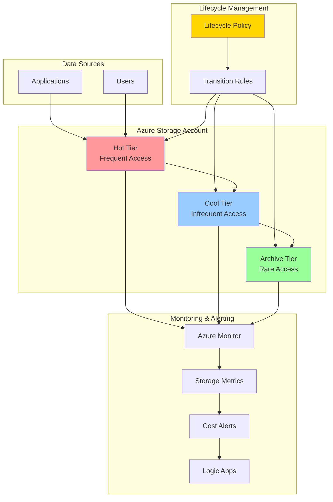

# Intelligent Blob Storage Lifecycle Management with Cost Optimization

## Problem

Organizations managing large volumes of data in Azure Blob Storage face escalating costs as files accumulate across different access patterns. Without automated lifecycle management, frequently accessed data remains in expensive hot storage while rarely accessed files consume unnecessary resources. Manual data archiving is time-consuming and error-prone, leading to cost inefficiencies and compliance risks when data retention policies aren't properly enforced.

## Solution

This recipe implements an automated blob storage lifecycle management system using Azure Storage lifecycle policies to automatically transition data between hot, cool, and archive tiers based on access patterns and age. Azure Monitor provides real-time visibility into storage costs and tier transitions, while Azure Logic Apps enables automated alerting and compliance reporting for comprehensive data governance.

## Architecture Diagram



## Prerequisites

1. Azure subscription with Storage Account and Logic Apps permissions
2. Azure CLI v2.0 or later installed and configured (or Azure Cloud Shell)
3. Basic understanding of Azure Storage tiers and cost models
4. Familiarity with JSON configuration for lifecycle policies
5. Estimated cost: $5-15 per month for storage, monitoring, and Logic Apps (depends on data volume)

> **Note**: This recipe demonstrates lifecycle management concepts using minimal data volumes. Production implementations should consider data residency, compliance requirements, and backup strategies.

## Preparation

```bash
# Set environment variables for Azure resources
export RESOURCE_GROUP="rg-lifecycle-${RANDOM_SUFFIX}"
export LOCATION="eastus"
export SUBSCRIPTION_ID=$(az account show --query id --output tsv)

# Generate unique suffix for resource names
RANDOM_SUFFIX=$(openssl rand -hex 3)

# Set resource names with unique suffix
export STORAGE_ACCOUNT="stlifecycle${RANDOM_SUFFIX}"
export LOGIC_APP_NAME="logic-storage-alerts-${RANDOM_SUFFIX}"
export WORKSPACE_NAME="law-storage-monitoring-${RANDOM_SUFFIX}"

# Create resource group for lifecycle management demo
az group create \
    --name ${RESOURCE_GROUP} \
    --location ${LOCATION} \
    --tags purpose=lifecycle-demo environment=development

echo "✅ Resource group created: ${RESOURCE_GROUP}"
echo "Subscription ID: ${SUBSCRIPTION_ID}"
```

## Steps

1. **Create Storage Account with Lifecycle Management Features**:

   Azure Storage Accounts provide the foundation for blob lifecycle management with built-in policy engine capabilities. Creating a General Purpose v2 storage account enables access to all three storage tiers (Hot, Cool, Archive) and supports lifecycle management policies. This storage account will serve as the central repository for demonstrating automated data tiering based on access patterns and age.

   ```bash
   # Create storage account with lifecycle management support
   az storage account create \
       --name ${STORAGE_ACCOUNT} \
       --resource-group ${RESOURCE_GROUP} \
       --location ${LOCATION} \
       --sku Standard_LRS \
       --kind StorageV2 \
       --access-tier Hot \
       --enable-hierarchical-namespace false \
       --tags purpose=lifecycle-demo environment=development
   
   # Enable blob versioning for enhanced lifecycle management
   az storage account blob-service-properties update \
       --account-name ${STORAGE_ACCOUNT} \
       --resource-group ${RESOURCE_GROUP} \
       --enable-versioning true \
       --enable-delete-retention true \
       --delete-retention-days 30
   
   echo "✅ Storage account created with lifecycle management capabilities"
   ```

   The storage account now supports comprehensive lifecycle management including blob versioning and soft delete protection. These features ensure data integrity during tier transitions while enabling cost-effective storage optimization through automated policy enforcement.

2. **Create Container and Upload Sample Data**:

   Azure Blob Storage containers provide logical organization for data subject to lifecycle policies. Creating containers with sample data of different types enables testing and validation of lifecycle management rules. This step establishes the data foundation for demonstrating automated tier transitions based on access patterns.

   ```bash
   # Get storage account key for container operations
   STORAGE_KEY=$(az storage account keys list \
       --account-name ${STORAGE_ACCOUNT} \
       --resource-group ${RESOURCE_GROUP} \
       --query '[0].value' --output tsv)
   
   # Create containers for different data types
   az storage container create \
       --name documents \
       --account-name ${STORAGE_ACCOUNT} \
       --account-key ${STORAGE_KEY} \
       --public-access off
   
   az storage container create \
       --name logs \
       --account-name ${STORAGE_ACCOUNT} \
       --account-key ${STORAGE_KEY} \
       --public-access off
   
   # Upload sample files to demonstrate lifecycle management
   echo "Sample document content - frequently accessed" > document1.txt
   echo "Application log entry - infrequently accessed" > app.log
   echo "Archive document content - rarely accessed" > archive.txt
   
   az storage blob upload \
       --container-name documents \
       --file document1.txt \
       --name document1.txt \
       --account-name ${STORAGE_ACCOUNT} \
       --account-key ${STORAGE_KEY}
   
   az storage blob upload \
       --container-name logs \
       --file app.log \
       --name app.log \
       --account-name ${STORAGE_ACCOUNT} \
       --account-key ${STORAGE_KEY}
   
   echo "✅ Containers created with sample data for lifecycle testing"
   ```

   The containers now contain sample data that will be subject to lifecycle management policies. This creates the foundation for testing automated tier transitions and validating cost optimization strategies.

3. **Configure Lifecycle Management Policy**:

   Azure Storage lifecycle management policies define rules for automatically transitioning blobs between storage tiers based on age and access patterns. Creating a comprehensive policy ensures cost optimization while maintaining appropriate data availability. This policy configuration automates the movement of data from hot to cool to archive tiers, reducing storage costs over time.

   ```bash
   # Create lifecycle management policy JSON
   cat > lifecycle-policy.json << EOF
   {
     "rules": [
       {
         "enabled": true,
         "name": "DocumentLifecycle",
         "type": "Lifecycle",
         "definition": {
           "filters": {
             "blobTypes": ["blockBlob"],
             "prefixMatch": ["documents/"]
           },
           "actions": {
             "baseBlob": {
               "tierToCool": {
                 "daysAfterModificationGreaterThan": 30
               },
               "tierToArchive": {
                 "daysAfterModificationGreaterThan": 90
               },
               "delete": {
                 "daysAfterModificationGreaterThan": 365
               }
             }
           }
         }
       },
       {
         "enabled": true,
         "name": "LogLifecycle",
         "type": "Lifecycle",
         "definition": {
           "filters": {
             "blobTypes": ["blockBlob"],
             "prefixMatch": ["logs/"]
           },
           "actions": {
             "baseBlob": {
               "tierToCool": {
                 "daysAfterModificationGreaterThan": 7
               },
               "tierToArchive": {
                 "daysAfterModificationGreaterThan": 30
               },
               "delete": {
                 "daysAfterModificationGreaterThan": 180
               }
             }
           }
         }
       }
     ]
   }
   EOF
   
   # Apply lifecycle management policy to storage account
   az storage account management-policy create \
       --account-name ${STORAGE_ACCOUNT} \
       --resource-group ${RESOURCE_GROUP} \
       --policy @lifecycle-policy.json
   
   echo "✅ Lifecycle management policy configured and applied"
   ```

   The lifecycle management policy is now active and will automatically transition blobs according to the defined rules. Documents move to cool storage after 30 days and archive after 90 days, while log files transition more aggressively to optimize costs. This automation eliminates manual intervention while ensuring compliance with data retention requirements.

4. **Create Log Analytics Workspace for Monitoring**:

   Azure Monitor requires a Log Analytics workspace to collect and analyze storage metrics and lifecycle events. Creating a dedicated workspace enables comprehensive monitoring of storage costs, tier transitions, and policy effectiveness. This monitoring foundation provides the data needed for automated alerting and cost optimization insights.

   ```bash
   # Create Log Analytics workspace for storage monitoring
   az monitor log-analytics workspace create \
       --resource-group ${RESOURCE_GROUP} \
       --workspace-name ${WORKSPACE_NAME} \
       --location ${LOCATION} \
       --sku pergb2018 \
       --retention-time 30 \
       --tags purpose=storage-monitoring environment=development
   
   # Get workspace ID for diagnostic settings
   WORKSPACE_ID=$(az monitor log-analytics workspace show \
       --resource-group ${RESOURCE_GROUP} \
       --workspace-name ${WORKSPACE_NAME} \
       --query id --output tsv)
   
   echo "✅ Log Analytics workspace created for storage monitoring"
   ```

   The Log Analytics workspace provides centralized collection and analysis of storage metrics, enabling real-time monitoring of lifecycle management effectiveness and cost optimization opportunities.

5. **Configure Storage Account Diagnostics**:

   Azure Storage diagnostic settings enable detailed monitoring of blob operations, tier transitions, and access patterns. Configuring diagnostics to send data to Log Analytics provides visibility into lifecycle management policy effectiveness and storage cost trends. This monitoring capability is essential for optimizing lifecycle policies and identifying cost-saving opportunities.

   ```bash
   # Get storage account resource ID for diagnostics
   STORAGE_ACCOUNT_ID=$(az storage account show \
       --name ${STORAGE_ACCOUNT} \
       --resource-group ${RESOURCE_GROUP} \
       --query id --output tsv)
   
   # Configure diagnostic settings for blob storage
   az monitor diagnostic-settings create \
       --resource ${STORAGE_ACCOUNT_ID}/blobServices/default \
       --name "BlobStorageMonitoring" \
       --workspace ${WORKSPACE_ID} \
       --metrics '[{"category":"Transaction","enabled":true},{"category":"Capacity","enabled":true}]' \
       --logs '[{"category":"StorageRead","enabled":true},{"category":"StorageWrite","enabled":true}]'
   
   echo "✅ Storage account diagnostics configured for comprehensive monitoring"
   ```

   The diagnostic settings now capture detailed storage metrics and access patterns, providing the foundation for monitoring lifecycle management effectiveness and identifying optimization opportunities.

6. **Create Logic App for Automated Alerting**:

   Azure Logic Apps enables automated responses to storage cost anomalies and lifecycle events. Creating a Logic App workflow automates the process of detecting cost spikes and sending notifications to stakeholders. This automation ensures proactive cost management and compliance monitoring without manual intervention.

   ```bash
   # Create Logic App for storage alerts
   az logic workflow create \
       --resource-group ${RESOURCE_GROUP} \
       --location ${LOCATION} \
       --name ${LOGIC_APP_NAME} \
       --tags purpose=storage-alerts environment=development
   
   # Get Logic App details
   LOGIC_APP_ID=$(az logic workflow show \
       --resource-group ${RESOURCE_GROUP} \
       --name ${LOGIC_APP_NAME} \
       --query id --output tsv)
   
   echo "✅ Logic App created for automated storage alerting"
   ```

   The Logic App provides the foundation for automated alerting and workflow automation based on storage metrics and lifecycle events. This enables proactive cost management and compliance monitoring.

7. **Configure Storage Cost Alerts**:

   Azure Monitor alerts provide automated notifications when storage costs exceed defined thresholds or when lifecycle policies require attention. Creating comprehensive alerts ensures proactive cost management and helps maintain optimal storage tier distribution. These alerts enable immediate response to cost anomalies and policy effectiveness issues.

   ```bash
   # Create action group for alert notifications
   az monitor action-group create \
       --resource-group ${RESOURCE_GROUP} \
       --name "StorageAlertsGroup" \
       --short-name "StorageAlerts" \
       --tags purpose=storage-alerts environment=development
   
   # Create metric alert for storage capacity
   az monitor metrics alert create \
       --name "HighStorageCapacity" \
       --resource-group ${RESOURCE_GROUP} \
       --scopes ${STORAGE_ACCOUNT_ID} \
       --condition "avg UsedCapacity > 1000000000" \
       --description "Alert when storage capacity exceeds 1GB" \
       --evaluation-frequency 5m \
       --window-size 15m \
       --severity 2 \
       --action StorageAlertsGroup
   
   # Create metric alert for transaction costs
   az monitor metrics alert create \
       --name "HighTransactionCount" \
       --resource-group ${RESOURCE_GROUP} \
       --scopes ${STORAGE_ACCOUNT_ID} \
       --condition "avg Transactions > 1000" \
       --description "Alert when transaction count is high" \
       --evaluation-frequency 5m \
       --window-size 15m \
       --severity 3 \
       --action StorageAlertsGroup
   
   echo "✅ Storage cost and capacity alerts configured"
   ```

   The alert system now monitors storage capacity and transaction patterns, providing automated notifications when thresholds are exceeded. This proactive monitoring enables quick response to cost anomalies and helps maintain optimal storage utilization.

## Validation & Testing

1. **Verify Lifecycle Management Policy**:

   ```bash
   # Check lifecycle management policy status
   az storage account management-policy show \
       --account-name ${STORAGE_ACCOUNT} \
       --resource-group ${RESOURCE_GROUP} \
       --query "policy.rules[*].{Name:name,Enabled:enabled,Type:type}"
   
   # Verify policy rules configuration
   az storage account management-policy show \
       --account-name ${STORAGE_ACCOUNT} \
       --resource-group ${RESOURCE_GROUP} \
       --query "policy.rules[0].definition.actions"
   ```

   Expected output: Policy shows enabled rules for document and log lifecycle management with proper tier transition timelines.

2. **Test Storage Monitoring and Metrics**:

   ```bash
   # Query storage capacity metrics
   az monitor metrics list \
       --resource ${STORAGE_ACCOUNT_ID} \
       --metric UsedCapacity \
       --interval 1h \
       --query "value[0].timeseries[0].data[-1]"
   
   # Check blob count metrics
   az monitor metrics list \
       --resource ${STORAGE_ACCOUNT_ID} \
       --metric BlobCount \
       --interval 1h \
       --query "value[0].timeseries[0].data[-1]"
   ```

   Expected output: Metrics show current storage usage and blob counts, confirming monitoring is active.

3. **Validate Alert Configuration**:

   ```bash
   # List configured alerts
   az monitor metrics alert list \
       --resource-group ${RESOURCE_GROUP} \
       --query "[].{Name:name,Severity:severity,Enabled:enabled}"
   
   # Check alert rules status
   az monitor metrics alert show \
       --name "HighStorageCapacity" \
       --resource-group ${RESOURCE_GROUP} \
       --query "{Name:name,Condition:criteria,Enabled:enabled}"
   ```

   Expected output: Alerts show as enabled with proper thresholds configured for capacity and transaction monitoring.

## Cleanup

1. **Remove Resource Group and All Resources**:

   ```bash
   # Delete resource group and all contained resources
   az group delete \
       --name ${RESOURCE_GROUP} \
       --yes \
       --no-wait
   
   echo "✅ Resource group deletion initiated: ${RESOURCE_GROUP}"
   echo "Note: Deletion may take several minutes to complete"
   ```

2. **Clean Up Local Files**:

   ```bash
   # Remove temporary files created during setup
   rm -f document1.txt app.log archive.txt lifecycle-policy.json
   
   echo "✅ Local files cleaned up"
   ```

3. **Verify Resource Deletion**:

   ```bash
   # Check if resource group still exists
   az group exists --name ${RESOURCE_GROUP}
   
   # List any remaining resources (should be empty)
   az resource list --resource-group ${RESOURCE_GROUP} --output table
   ```

## Discussion

Azure Storage lifecycle management provides automated, policy-driven data tiering that significantly reduces storage costs while maintaining appropriate data availability. The combination of lifecycle policies, Azure Monitor, and Logic Apps creates a comprehensive data governance solution that adapts to changing business requirements. This architecture follows the [Azure Well-Architected Framework](https://docs.microsoft.com/en-us/azure/architecture/framework/) principles of cost optimization and operational excellence.

The lifecycle management policy engine evaluates blob age and access patterns daily, automatically transitioning data between storage tiers to minimize costs. Hot storage provides immediate access for frequently used data, while cool storage reduces costs for infrequently accessed content. Archive storage delivers the lowest costs for rarely accessed data with flexible retrieval timeframes. For detailed information about storage tiers and their cost implications, see the [Azure Storage access tiers documentation](https://docs.microsoft.com/en-us/azure/storage/blobs/access-tiers-overview).

Azure Monitor integration provides real-time visibility into storage costs, tier distribution, and policy effectiveness. The monitoring solution captures detailed metrics about blob operations, capacity utilization, and transaction patterns, enabling data-driven optimization decisions. Combined with automated alerting through Logic Apps, this creates a proactive cost management system that identifies optimization opportunities and prevents unexpected cost spikes. For comprehensive monitoring guidance, review the [Azure Storage monitoring documentation](https://docs.microsoft.com/en-us/azure/storage/blobs/monitor-blob-storage).

The automated alerting system ensures stakeholders receive timely notifications about storage cost anomalies and policy effectiveness. Logic Apps can be extended to include automated remediation actions, such as adjusting lifecycle policies or implementing additional cost controls. This automation reduces operational overhead while maintaining strict governance over data retention and access patterns. For advanced automation scenarios, see the [Azure Logic Apps documentation](https://docs.microsoft.com/en-us/azure/logic-apps/).

> **Tip**: Enable last access time tracking on storage accounts to create more sophisticated lifecycle policies based on actual data usage patterns. This feature provides deeper insights into data access patterns and enables more precise cost optimization strategies.

## Challenge

Extend this solution by implementing these enhancements:

1. **Advanced Policy Configuration**: Create lifecycle policies that use blob index tags to apply different retention rules based on data classification and business criticality.

2. **Cross-Region Replication Management**: Implement geo-redundant storage lifecycle policies that balance cost optimization with disaster recovery requirements across multiple Azure regions.

3. **Automated Policy Optimization**: Build a machine learning model using Azure Cognitive Services that analyzes storage access patterns and automatically adjusts lifecycle policies to minimize costs while maintaining performance.

4. **Compliance Reporting Dashboard**: Create a Power BI dashboard that provides real-time visibility into data retention compliance, cost optimization metrics, and lifecycle policy effectiveness across multiple storage accounts.

5. **Integration with Azure Backup**: Implement automated backup policies that coordinate with lifecycle management to ensure long-term data protection while optimizing backup storage costs through tiered backup strategies.

## Infrastructure Code

### Available Infrastructure as Code:

- [Infrastructure Code Overview](code/README.md) - Detailed description of all infrastructure components
- [Bicep](code/bicep/) - Azure Bicep templates
- [Bash CLI Scripts](code/scripts/) - Example bash scripts using Azure CLI commands to deploy infrastructure
- [Terraform](code/terraform/) - Terraform configuration files