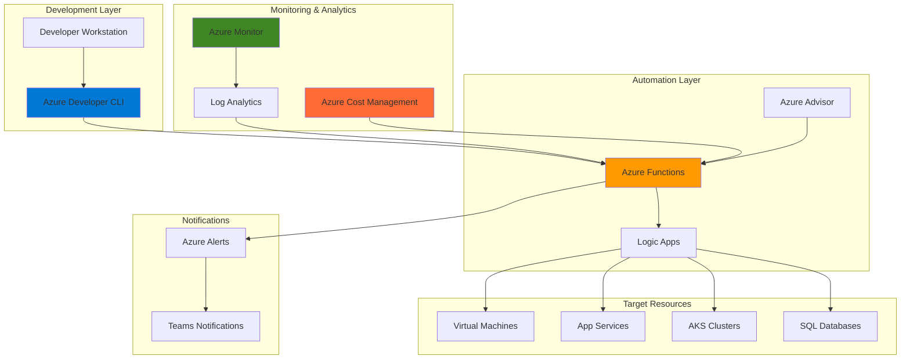

# Intelligent Cloud Resource Rightsizing with Cost Management and Developer CLI

## Problem

Organizations struggle with cloud cost optimization as development teams continuously deploy and scale Azure resources without proper monitoring and adjustment mechanisms. Manual resource rightsizing processes are time-consuming, error-prone, and cannot keep pace with dynamic workloads, leading to 25-40% of cloud spending being wasted on oversized or underutilized resources that fail to match actual application performance requirements.

## Solution

This solution implements an automated resource rightsizing system that continuously monitors application performance using Azure Monitor and Azure Cost Management APIs, then automatically adjusts resource configurations based on usage patterns and performance metrics. The system integrates with Azure Developer CLI workflows to provide intelligent scaling recommendations and automated optimization actions that balance performance requirements with cost efficiency.

## Architecture Diagram



## Prerequisites

1. Azure subscription with Contributor permissions for resource management
2. Azure CLI v2.50.0+ installed and configured (or Azure Cloud Shell)
3. Azure Developer CLI (azd) v1.15.0+ installed
4. Node.js 18+ for Azure Functions development
5. Basic knowledge of Azure monitoring, cost management, and DevOps practices
6. Estimated cost: $50-100/month for monitoring, functions, and automation resources

> **Note**: This solution requires Azure Contributor role permissions to create and modify resources. Review the [Azure Well-Architected Framework](https://docs.microsoft.com/en-us/azure/architecture/framework/) for cost optimization guidance.

## Preparation

```bash
# Set environment variables for Azure resources
export RESOURCE_GROUP="rg-rightsizing-${RANDOM_SUFFIX}"
export LOCATION="eastus"
export SUBSCRIPTION_ID=$(az account show --query id --output tsv)

# Generate unique suffix for resource names
RANDOM_SUFFIX=$(openssl rand -hex 3)

# Set specific resource names
export FUNCTION_APP_NAME="func-rightsizing-${RANDOM_SUFFIX}"
export STORAGE_ACCOUNT_NAME="st${RANDOM_SUFFIX}"
export LOG_ANALYTICS_NAME="log-rightsizing-${RANDOM_SUFFIX}"
export APP_INSIGHTS_NAME="ai-rightsizing-${RANDOM_SUFFIX}"
export LOGIC_APP_NAME="logic-rightsizing-${RANDOM_SUFFIX}"

# Create resource group
az group create \
    --name ${RESOURCE_GROUP} \
    --location ${LOCATION} \
    --tags purpose=recipe environment=demo project=rightsizing

echo "✅ Resource group created: ${RESOURCE_GROUP}"

# Create storage account for Function App
az storage account create \
    --name ${STORAGE_ACCOUNT_NAME} \
    --resource-group ${RESOURCE_GROUP} \
    --location ${LOCATION} \
    --sku Standard_LRS \
    --kind StorageV2

echo "✅ Storage account created: ${STORAGE_ACCOUNT_NAME}"
```

## Steps

1. **Create Log Analytics Workspace and Application Insights**:

   Azure Monitor provides comprehensive observability for Azure resources, collecting performance metrics, logs, and traces that are essential for intelligent resource rightsizing decisions. Log Analytics workspace serves as the central repository for monitoring data, while Application Insights provides application-level performance monitoring. This foundational monitoring infrastructure enables data-driven rightsizing recommendations based on actual resource utilization patterns.

   ```bash
   # Create Log Analytics workspace
   az monitor log-analytics workspace create \
       --resource-group ${RESOURCE_GROUP} \
       --workspace-name ${LOG_ANALYTICS_NAME} \
       --location ${LOCATION} \
       --sku PerGB2018
   
   # Get workspace ID for Application Insights
   WORKSPACE_ID=$(az monitor log-analytics workspace show \
       --resource-group ${RESOURCE_GROUP} \
       --workspace-name ${LOG_ANALYTICS_NAME} \
       --query id --output tsv)
   
   # Create Application Insights
   az monitor app-insights component create \
       --resource-group ${RESOURCE_GROUP} \
       --app ${APP_INSIGHTS_NAME} \
       --location ${LOCATION} \
       --workspace ${WORKSPACE_ID}
   
   echo "✅ Monitoring infrastructure created successfully"
   ```

   The monitoring infrastructure is now configured to collect and analyze performance metrics from your Azure resources. This centralized monitoring approach provides the data foundation needed for automated rightsizing decisions and enables correlation between application performance and resource utilization.

2. **Create Azure Function App for Rightsizing Logic**:

   Azure Functions provides serverless compute capabilities that automatically scale based on demand, making it ideal for implementing rightsizing automation logic. The Function App will host the core automation logic that analyzes monitoring data, calculates optimal resource configurations, and triggers scaling actions. This serverless approach eliminates infrastructure management overhead while providing cost-effective execution for periodic rightsizing operations.

   ```bash
   # Create Function App
   az functionapp create \
       --resource-group ${RESOURCE_GROUP} \
       --consumption-plan-location ${LOCATION} \
       --runtime node \
       --functions-version 4 \
       --name ${FUNCTION_APP_NAME} \
       --storage-account ${STORAGE_ACCOUNT_NAME} \
       --app-insights ${APP_INSIGHTS_NAME}
   
   # Configure Function App settings
   az functionapp config appsettings set \
       --name ${FUNCTION_APP_NAME} \
       --resource-group ${RESOURCE_GROUP} \
       --settings "SUBSCRIPTION_ID=${SUBSCRIPTION_ID}" \
                 "RESOURCE_GROUP=${RESOURCE_GROUP}" \
                 "LOG_ANALYTICS_WORKSPACE=${LOG_ANALYTICS_NAME}"
   
   echo "✅ Function App configured for rightsizing automation"
   ```

   The Function App is now ready to host your rightsizing automation logic with integrated monitoring and logging capabilities. This serverless foundation provides the scalable compute platform needed for processing monitoring data and executing resource optimization actions.

3. **Deploy Rightsizing Function Code**:

   The rightsizing function implements the core logic for analyzing resource performance metrics and generating optimization recommendations. This function integrates with Azure Monitor APIs to collect utilization data, applies intelligent algorithms to identify rightsizing opportunities, and generates actionable recommendations for resource adjustments.

   ```bash
   # Create temporary directory for function code
   mkdir -p /tmp/rightsizing-function
   cd /tmp/rightsizing-function
   
   # Initialize Azure Functions project
   func init --javascript
   
   # Create rightsizing function
   func new --name RightsizingAnalyzer --template "Timer trigger"
   
   # Create package.json for dependencies
   cat > package.json << 'EOF'
   {
     "name": "rightsizing-function",
     "version": "1.0.0",
     "dependencies": {
       "@azure/monitor-query": "^1.0.0",
       "@azure/arm-compute": "^20.0.0",
       "@azure/arm-sql": "^9.0.0",
       "@azure/identity": "^3.0.0",
       "axios": "^1.0.0"
     }
   }
   EOF
   
   # Create function code
   cat > RightsizingAnalyzer/index.js << 'EOF'
   const { DefaultAzureCredential } = require('@azure/identity');
   const { MonitorQueryClient } = require('@azure/monitor-query');
   const { ComputeManagementClient } = require('@azure/arm-compute');
   
   module.exports = async function (context, myTimer) {
       const credential = new DefaultAzureCredential();
       const subscriptionId = process.env.SUBSCRIPTION_ID;
       const resourceGroup = process.env.RESOURCE_GROUP;
       
       try {
           // Initialize clients
           const monitorClient = new MonitorQueryClient(credential);
           const computeClient = new ComputeManagementClient(credential, subscriptionId);
           
           // Query CPU utilization for VMs
           const kustoQuery = `
               Perf
               | where CounterName == "% Processor Time" 
               | where TimeGenerated > ago(7d)
               | summarize AvgCPU = avg(CounterValue) by Computer
               | where AvgCPU < 20 or AvgCPU > 80
           `;
           
           const workspaceId = process.env.LOG_ANALYTICS_WORKSPACE;
           const queryResult = await monitorClient.queryWorkspace(
               workspaceId,
               kustoQuery,
               { duration: "P7D" }
           );
           
           // Process results and generate recommendations
           const recommendations = [];
           for (const row of queryResult.tables[0].rows) {
               const [computer, avgCPU] = row;
               
               if (avgCPU < 20) {
                   recommendations.push({
                       resource: computer,
                       action: 'downsize',
                       reason: `Low CPU utilization: ${avgCPU}%`,
                       priority: 'medium'
                   });
               } else if (avgCPU > 80) {
                   recommendations.push({
                       resource: computer,
                       action: 'upsize',
                       reason: `High CPU utilization: ${avgCPU}%`,
                       priority: 'high'
                   });
               }
           }
           
           // Log recommendations
           context.log('Rightsizing recommendations:', recommendations);
           
           // Store recommendations for further processing
           context.bindings.recommendations = recommendations;
           
       } catch (error) {
           context.log.error('Error in rightsizing analysis:', error);
           throw error;
       }
   };
   EOF
   
   # Deploy function to Azure
   func azure functionapp publish ${FUNCTION_APP_NAME}
   
   echo "✅ Rightsizing function deployed successfully"
   ```

   The rightsizing function is now deployed and will automatically analyze resource utilization patterns every hour. This intelligent automation continuously monitors CPU utilization and generates actionable recommendations for resource optimization based on real performance data.

4. **Create Logic App for Automated Actions**:

   Azure Logic Apps provides workflow automation capabilities that enable sophisticated resource management workflows triggered by Function App recommendations. Logic Apps can orchestrate complex approval processes, integrate with external systems, and execute resource modifications based on predefined business rules. This visual workflow approach simplifies the creation of automated rightsizing processes while maintaining proper governance and control.

   ```bash
   # Create Logic App workflow definition file
   cat > logic-workflow.json << 'EOF'
   {
     "$schema": "https://schema.management.azure.com/schemas/2016-06-01/workflowdefinition.json#",
     "contentVersion": "1.0.0.0",
     "parameters": {},
     "triggers": {
       "manual": {
         "type": "Request",
         "kind": "Http"
       }
     },
     "actions": {
       "ProcessRecommendations": {
         "type": "Http",
         "inputs": {
           "method": "POST",
           "uri": "@parameters('functionUrl')",
           "body": "@triggerBody()"
         }
       }
     }
   }
   EOF
   
   # Create Logic App
   az logic workflow create \
       --resource-group ${RESOURCE_GROUP} \
       --location ${LOCATION} \
       --name ${LOGIC_APP_NAME} \
       --definition @logic-workflow.json
   
   # Get Logic App callback URL
   LOGIC_APP_URL=$(az logic workflow show \
       --resource-group ${RESOURCE_GROUP} \
       --name ${LOGIC_APP_NAME} \
       --query accessEndpoint --output tsv)
   
   echo "✅ Logic App created: ${LOGIC_APP_URL}"
   ```

   The Logic App workflow is now configured to receive and process rightsizing recommendations from the Function App. This automated workflow foundation enables sophisticated resource management processes that can include approval workflows, notification systems, and automated execution of optimization actions.

5. **Configure Azure Developer CLI Integration**:

   Azure Developer CLI (azd) provides developer-centric tools for managing Azure resources and deployments. Integrating azd with the rightsizing system enables developers to incorporate cost optimization into their standard development workflows. This integration allows teams to automatically apply rightsizing recommendations during deployment and maintenance operations.

   ```bash
   # Create azd configuration directory
   mkdir -p /tmp/azd-rightsizing
   cd /tmp/azd-rightsizing
   
   # Initialize azd project
   azd init --template minimal --name rightsizing-automation
   
   # Create azd configuration file
   cat > azure.yaml << 'EOF'
   name: rightsizing-automation
   metadata:
     template: rightsizing-automation@1.0.0
   services:
     rightsizing:
       project: .
       host: functionapp
       language: javascript
   hooks:
     postdeploy:
       shell: pwsh
       run: |
         Write-Host "Running rightsizing analysis..."
         $functionKey = az functionapp keys list --name $env:FUNCTION_APP_NAME --resource-group $env:AZURE_RESOURCE_GROUP --query "functionKeys.default" -o tsv
         $functionUrl = "https://$env:FUNCTION_APP_NAME.azurewebsites.net/api/RightsizingAnalyzer?code=$functionKey"
         Invoke-RestMethod -Uri $functionUrl -Method Post
   EOF
   
   # Create environment configuration directory
   mkdir -p .azure/dev
   
   # Create environment configuration
   cat > .azure/dev/.env << EOF
   AZURE_RESOURCE_GROUP=${RESOURCE_GROUP}
   AZURE_LOCATION=${LOCATION}
   FUNCTION_APP_NAME=${FUNCTION_APP_NAME}
   LOGIC_APP_NAME=${LOGIC_APP_NAME}
   EOF
   
   echo "✅ Azure Developer CLI integration configured"
   ```

   The azd integration is now configured to automatically trigger rightsizing analysis after deployments. This developer-friendly approach ensures that cost optimization becomes an integral part of the development and deployment lifecycle, promoting sustainable cloud resource management practices.

6. **Create Cost Management Alerts**:

   Azure Cost Management provides comprehensive cost monitoring and alerting capabilities that complement the automated rightsizing system. Setting up cost alerts ensures proactive notification of budget overruns and provides additional triggers for rightsizing activities. These alerts create a comprehensive cost governance framework that supports both automated optimization and manual intervention when needed.

   ```bash
   # Create budget for cost monitoring
   az consumption budget create \
       --resource-group ${RESOURCE_GROUP} \
       --budget-name "rightsizing-budget" \
       --amount 100 \
       --time-grain Monthly \
       --start-date "2025-08-01" \
       --end-date "2025-12-31" \
       --category Cost
   
   # Create action group for notifications
   az monitor action-group create \
       --resource-group ${RESOURCE_GROUP} \
       --name "rightsizing-alerts" \
       --email-receivers name=admin email=admin@company.com
   
   # Create cost alert rule
   az monitor metrics alert create \
       --name "high-cost-alert" \
       --resource-group ${RESOURCE_GROUP} \
       --scopes "/subscriptions/${SUBSCRIPTION_ID}/resourceGroups/${RESOURCE_GROUP}" \
       --condition "avg Budget \> 80" \
       --description "Alert when resource group costs exceed 80% of budget" \
       --action rightsizing-alerts
   
   echo "✅ Cost monitoring alerts configured"
   ```

   Cost Management alerts are now active and will notify administrators when resource costs exceed defined thresholds. This proactive monitoring approach ensures that rightsizing activities are triggered by both performance metrics and cost considerations, creating a comprehensive optimization framework.

7. **Deploy Sample Resources for Testing**:

   Creating sample resources provides a testing environment for validating the rightsizing automation system. These resources simulate typical enterprise workloads and enable comprehensive testing of the monitoring, analysis, and optimization workflows. This testing approach ensures the system works correctly before implementing it in production environments.

   ```bash
   # Create test Virtual Machine
   az vm create \
       --resource-group ${RESOURCE_GROUP} \
       --name "vm-test-${RANDOM_SUFFIX}" \
       --image Ubuntu2204 \
       --size Standard_B2s \
       --admin-username azureuser \
       --generate-ssh-keys \
       --no-wait
   
   # Create test App Service Plan
   az appservice plan create \
       --resource-group ${RESOURCE_GROUP} \
       --name "plan-test-${RANDOM_SUFFIX}" \
       --location ${LOCATION} \
       --sku S1 \
       --is-linux
   
   # Create test Web App
   az webapp create \
       --resource-group ${RESOURCE_GROUP} \
       --plan "plan-test-${RANDOM_SUFFIX}" \
       --name "app-test-${RANDOM_SUFFIX}" \
       --runtime "NODE:18-lts"
   
   echo "✅ Test resources created for rightsizing validation"
   ```

   Test resources are now deployed and available for rightsizing analysis. These resources will generate performance metrics and cost data that the automated system can analyze, providing a complete testing environment for validating the rightsizing automation workflows.

8. **Configure Monitoring and Alerting**:

   Comprehensive monitoring and alerting ensure the rightsizing system operates effectively and provides visibility into optimization activities. Azure Monitor alerts provide real-time notifications of system events, while custom dashboards enable ongoing monitoring of rightsizing performance and cost savings. This monitoring infrastructure supports both automated operations and manual oversight of the optimization process.

   ```bash
   # Create alert for Function App errors
   az monitor metrics alert create \
       --name "function-error-alert" \
       --resource-group ${RESOURCE_GROUP} \
       --scopes "/subscriptions/${SUBSCRIPTION_ID}/resourceGroups/${RESOURCE_GROUP}/providers/Microsoft.Web/sites/${FUNCTION_APP_NAME}" \
       --condition "total Http5xx \> 1" \
       --description "Alert when rightsizing function has HTTP errors" \
       --evaluation-frequency 5m \
       --window-size 15m \
       --action rightsizing-alerts
   
   # Create alert for budget threshold
   az monitor metrics alert create \
       --name "budget-threshold-alert" \
       --resource-group ${RESOURCE_GROUP} \
       --scopes "/subscriptions/${SUBSCRIPTION_ID}/resourceGroups/${RESOURCE_GROUP}" \
       --condition "total Cost \> 80" \
       --description "Alert when budget threshold is exceeded" \
       --evaluation-frequency 1h \
       --window-size 24h \
       --action rightsizing-alerts
   
   echo "✅ Monitoring and alerting configured"
   ```

   The monitoring and alerting infrastructure is now active and will provide comprehensive visibility into rightsizing operations. This monitoring framework ensures reliable operation of the automated system while providing administrators with the insights needed to optimize cost management strategies.

## Validation & Testing

1. **Verify Function App Deployment**:

   ```bash
   # Check Function App status
   az functionapp show \
       --resource-group ${RESOURCE_GROUP} \
       --name ${FUNCTION_APP_NAME} \
       --query "{name:name, state:state, hostNames:defaultHostName}" \
       --output table
   
   # Test function execution
   az functionapp function invoke \
       --resource-group ${RESOURCE_GROUP} \
       --name ${FUNCTION_APP_NAME} \
       --function-name RightsizingAnalyzer
   ```

   Expected output: Function App should show "Running" state and function should execute successfully.

2. **Test Rightsizing Analysis**:

   ```bash
   # Trigger rightsizing analysis manually
   FUNCTION_URL="https://${FUNCTION_APP_NAME}.azurewebsites.net"
   
   # Get function key
   FUNCTION_KEY=$(az functionapp keys list \
       --name ${FUNCTION_APP_NAME} \
       --resource-group ${RESOURCE_GROUP} \
       --query "functionKeys.default" \
       --output tsv)
   
   # Test analysis endpoint
   curl -X POST "${FUNCTION_URL}/api/RightsizingAnalyzer?code=${FUNCTION_KEY}"
   ```

   Expected output: Function should return rightsizing recommendations based on current resource utilization.

3. **Validate Cost Management Integration**:

   ```bash
   # Check budget status
   az consumption budget list \
       --query "[?name=='rightsizing-budget'].{name:name, amount:amount, currentSpend:currentSpend}" \
       --output table
   
   # Verify alert rules
   az monitor metrics alert list \
       --resource-group ${RESOURCE_GROUP} \
       --query "[].{name:name, enabled:enabled}" \
       --output table
   ```

   Expected output: Budget should display current spending and alert rules should be enabled.

4. **Test Azure Developer CLI Integration**:

   ```bash
   # Navigate to azd project directory
   cd /tmp/azd-rightsizing
   
   # Test azd deployment
   azd deploy
   
   # Verify post-deployment hooks
   azd hooks run postdeploy
   ```

   Expected output: azd should deploy successfully and trigger rightsizing analysis automatically.

## Cleanup

1. **Remove test resources**:

   ```bash
   # Delete test VM
   az vm delete \
       --resource-group ${RESOURCE_GROUP} \
       --name "vm-test-${RANDOM_SUFFIX}" \
       --yes --no-wait
   
   # Delete test App Service
   az webapp delete \
       --resource-group ${RESOURCE_GROUP} \
       --name "app-test-${RANDOM_SUFFIX}"
   
   # Delete App Service Plan
   az appservice plan delete \
       --resource-group ${RESOURCE_GROUP} \
       --name "plan-test-${RANDOM_SUFFIX}" \
       --yes
   
   echo "✅ Test resources deleted"
   ```

2. **Remove monitoring and automation resources**:

   ```bash
   # Delete Function App
   az functionapp delete \
       --resource-group ${RESOURCE_GROUP} \
       --name ${FUNCTION_APP_NAME}
   
   # Delete Logic App
   az logic workflow delete \
       --resource-group ${RESOURCE_GROUP} \
       --name ${LOGIC_APP_NAME} \
       --yes
   
   # Delete monitoring resources
   az monitor app-insights component delete \
       --resource-group ${RESOURCE_GROUP} \
       --app ${APP_INSIGHTS_NAME}
   
   echo "✅ Automation resources deleted"
   ```

3. **Remove resource group and all remaining resources**:

   ```bash
   # Delete resource group
   az group delete \
       --name ${RESOURCE_GROUP} \
       --yes \
       --no-wait
   
   echo "✅ Resource group deletion initiated: ${RESOURCE_GROUP}"
   echo "Note: Deletion may take several minutes to complete"
   
   # Clean up temporary directories
   rm -rf /tmp/rightsizing-function
   rm -rf /tmp/azd-rightsizing
   
   echo "✅ Cleanup completed"
   ```

## Discussion

This automated resource rightsizing solution addresses one of the most significant challenges in cloud cost management by providing continuous, data-driven optimization of Azure resources. The integration of Azure Monitor, Cost Management, and Azure Developer CLI creates a comprehensive framework that balances performance requirements with cost efficiency. The solution follows [Azure Well-Architected Framework](https://docs.microsoft.com/en-us/azure/architecture/framework/) principles by emphasizing cost optimization, operational excellence, and reliability through automated monitoring and response systems.

The serverless architecture using Azure Functions ensures cost-effective execution of rightsizing logic while providing the scalability needed for enterprise environments. The Logic Apps integration enables sophisticated workflow automation that can accommodate complex approval processes and integration with existing IT service management systems. For comprehensive guidance on serverless cost optimization patterns, see the [Azure Functions best practices documentation](https://docs.microsoft.com/en-us/azure/azure-functions/functions-best-practices).

From a DevOps perspective, the Azure Developer CLI integration ensures that cost optimization becomes an integral part of the development lifecycle rather than an afterthought. This approach promotes sustainable cloud practices by providing developers with immediate feedback on resource utilization and cost implications. The automated nature of the solution reduces the operational burden on IT teams while maintaining the governance controls necessary for enterprise environments. For detailed cost optimization strategies, review the [Azure Cost Management documentation](https://docs.microsoft.com/en-us/azure/cost-management-billing/costs/).

The monitoring and alerting infrastructure provides comprehensive visibility into both resource performance and cost trends, enabling proactive management of cloud spending. The combination of threshold-based alerts and trend analysis ensures that rightsizing actions are triggered by both immediate performance issues and longer-term cost optimization opportunities. For monitoring best practices, see the [Azure Monitor documentation](https://docs.microsoft.com/en-us/azure/azure-monitor/).

> **Tip**: Use Azure Advisor recommendations alongside this automated system to identify additional optimization opportunities beyond basic rightsizing, such as reserved instance purchases and architectural improvements. The [Azure Advisor documentation](https://docs.microsoft.com/en-us/azure/advisor/) provides comprehensive guidance on leveraging AI-powered recommendations for cost optimization.

## Challenge

Extend this solution by implementing these enhancements:

1. **Machine Learning Integration**: Implement Azure Machine Learning models to predict future resource needs and proactively adjust resources before performance issues occur.

2. **Multi-Cloud Support**: Extend the solution to support AWS and Google Cloud resources, creating a unified rightsizing platform across multiple cloud providers.

3. **Advanced Workflow Automation**: Integrate with Azure DevOps pipelines to automatically apply rightsizing recommendations during deployment processes and implement approval workflows for high-impact changes.

4. **Custom Metrics Integration**: Extend monitoring to include application-specific metrics and business KPIs, enabling rightsizing decisions based on business outcomes rather than just infrastructure metrics.

5. **Cost Forecasting Dashboard**: Create a comprehensive Power BI dashboard that combines historical cost data with rightsizing recommendations to provide predictive cost analytics and savings forecasts.

## Infrastructure Code

### Available Infrastructure as Code:

- [Infrastructure Code Overview](code/README.md) - Detailed description of all infrastructure components
- [Bicep](code/bicep/) - Azure Bicep templates
- [Bash CLI Scripts](code/scripts/) - Example bash scripts using Azure CLI commands to deploy infrastructure
- [Terraform](code/terraform/) - Terraform configuration files