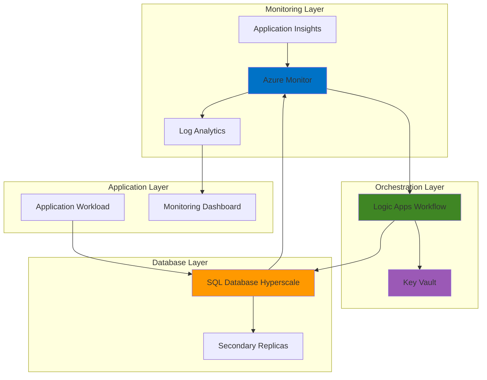

# Intelligent Database Scaling with SQL Hyperscale and Logic Apps

## Problem

Organizations managing mission-critical applications face unpredictable database workloads that require rapid scaling responses to maintain performance while controlling costs. Traditional manual scaling approaches lead to performance degradation during peak loads and resource waste during low-usage periods, resulting in poor user experience and unnecessary infrastructure expenses.

## Solution

Build an intelligent autonomous scaling system using Azure SQL Database Hyperscale's elastic compute scaling capabilities orchestrated by Azure Logic Apps. This solution monitors real-time performance metrics through Azure Monitor, automatically adjusts compute resources based on predefined thresholds, and maintains optimal database performance while minimizing costs through predictive scaling patterns.

## Architecture Diagram



## Prerequisites

1. Azure subscription with Contributor access to create and manage SQL databases
2. Azure CLI v2.60.0 or later installed and configured
3. Understanding of Azure SQL Database service tiers and compute models
4. Basic knowledge of Azure Logic Apps and workflow automation
5. Estimated cost: $50-100 per month for development/testing (varies by region and usage)

> **Note**: This solution uses Azure SQL Database Hyperscale which requires a minimum of 2 vCores and may incur higher costs than Basic or Standard tiers. Review [Azure SQL Database pricing](https://azure.microsoft.com/pricing/details/azure-sql-database/single/) before implementation.

## Preparation

```bash
# Set environment variables for Azure resources
export RESOURCE_GROUP="rg-autonomous-scaling-${RANDOM_SUFFIX}"
export LOCATION="eastus"
export SUBSCRIPTION_ID=$(az account show --query id --output tsv)

# Generate unique suffix for resource names
RANDOM_SUFFIX=$(openssl rand -hex 3)

# Set unique names for all resources
export SQL_SERVER_NAME="sql-hyperscale-${RANDOM_SUFFIX}"
export SQL_DATABASE_NAME="hyperscale-db"
export LOGIC_APP_NAME="scaling-logic-app-${RANDOM_SUFFIX}"
export KEY_VAULT_NAME="kv-scaling-${RANDOM_SUFFIX}"
export LOG_ANALYTICS_NAME="la-scaling-${RANDOM_SUFFIX}"
export ACTION_GROUP_NAME="ag-scaling-${RANDOM_SUFFIX}"

# Create resource group
az group create \
    --name ${RESOURCE_GROUP} \
    --location ${LOCATION} \
    --tags purpose=database-scaling environment=demo

echo "✅ Resource group created: ${RESOURCE_GROUP}"

# Create Log Analytics workspace for monitoring
az monitor log-analytics workspace create \
    --resource-group ${RESOURCE_GROUP} \
    --workspace-name ${LOG_ANALYTICS_NAME} \
    --location ${LOCATION} \
    --sku PerGB2018

echo "✅ Log Analytics workspace created: ${LOG_ANALYTICS_NAME}"
```

## Steps

1. **Create Azure Key Vault for Secure Credential Management**:

   Azure Key Vault provides centralized, secure storage for database connection strings and scaling parameters. This managed service eliminates the need to store sensitive information in Logic Apps configurations, ensuring compliance with security best practices while enabling automated access through managed identities.

   ```bash
   # Create Key Vault with appropriate access policies
   az keyvault create \
       --name ${KEY_VAULT_NAME} \
       --resource-group ${RESOURCE_GROUP} \
       --location ${LOCATION} \
       --sku standard \
       --enable-rbac-authorization true
   
   # Store database administrator credentials
   az keyvault secret set \
       --vault-name ${KEY_VAULT_NAME} \
       --name "sql-admin-username" \
       --value "sqladmin"
   
   az keyvault secret set \
       --vault-name ${KEY_VAULT_NAME} \
       --name "sql-admin-password" \
       --value "ComplexP@ssw0rd123!"
   
   echo "✅ Key Vault created with database credentials stored securely"
   ```

   The Key Vault now securely manages database credentials with role-based access control (RBAC) enabled. This configuration ensures that only authorized services can access sensitive information while maintaining audit trails for compliance requirements.

2. **Deploy Azure SQL Database Hyperscale with Optimal Configuration**:

   Azure SQL Database Hyperscale provides independent scaling of compute and storage resources, enabling rapid response to changing workload demands. The Hyperscale architecture supports up to 100TB of data with multiple read replicas for load distribution and high availability.

   ```bash
   # Create SQL Server with Azure AD admin configuration
   az sql server create \
       --name ${SQL_SERVER_NAME} \
       --resource-group ${RESOURCE_GROUP} \
       --location ${LOCATION} \
       --admin-user $(az keyvault secret show \
           --vault-name ${KEY_VAULT_NAME} \
           --name "sql-admin-username" \
           --query value --output tsv) \
       --admin-password $(az keyvault secret show \
           --vault-name ${KEY_VAULT_NAME} \
           --name "sql-admin-password" \
           --query value --output tsv) \
       --enable-public-network true
   
   # Configure firewall to allow Azure services
   az sql server firewall-rule create \
       --resource-group ${RESOURCE_GROUP} \
       --server ${SQL_SERVER_NAME} \
       --name "AllowAzureServices" \
       --start-ip-address 0.0.0.0 \
       --end-ip-address 0.0.0.0
   
   # Create Hyperscale database with initial configuration
   az sql db create \
       --resource-group ${RESOURCE_GROUP} \
       --server ${SQL_SERVER_NAME} \
       --name ${SQL_DATABASE_NAME} \
       --service-objective HS_Gen5_2 \
       --edition Hyperscale \
       --family Gen5 \
       --capacity 2 \
       --zone-redundant false
   
   echo "✅ Hyperscale database created with 2 vCores baseline configuration"
   ```

   The Hyperscale database is now operational with a 2-vCore baseline configuration optimized for cost efficiency. This setup provides the foundation for autonomous scaling while maintaining high availability and performance characteristics required for production workloads.

3. **Configure Azure Monitor Metrics and Alert Rules**:

   Azure Monitor provides comprehensive telemetry collection for SQL Database performance metrics including CPU utilization, memory usage, and transaction throughput. Custom alert rules enable proactive scaling decisions based on real-time performance data and historical usage patterns.

   ```bash
   # Get SQL Database resource ID for monitoring configuration
   DB_RESOURCE_ID=$(az sql db show \
       --resource-group ${RESOURCE_GROUP} \
       --server ${SQL_SERVER_NAME} \
       --name ${SQL_DATABASE_NAME} \
       --query id --output tsv)
   
   # Create action group for scaling notifications
   az monitor action-group create \
       --name ${ACTION_GROUP_NAME} \
       --resource-group ${RESOURCE_GROUP} \
       --short-name "ScaleAlert"
   
   # Create CPU scale-up alert rule
   az monitor metrics alert create \
       --name "CPU-Scale-Up-Alert" \
       --resource-group ${RESOURCE_GROUP} \
       --scopes ${DB_RESOURCE_ID} \
       --condition "avg cpu_percent > 80" \
       --window-size 5m \
       --evaluation-frequency 1m \
       --action ${ACTION_GROUP_NAME} \
       --description "Trigger scale-up when CPU exceeds 80% for 5 minutes"
   
   # Create CPU scale-down alert rule
   az monitor metrics alert create \
       --name "CPU-Scale-Down-Alert" \
       --resource-group ${RESOURCE_GROUP} \
       --scopes ${DB_RESOURCE_ID} \
       --condition "avg cpu_percent < 30" \
       --window-size 15m \
       --evaluation-frequency 5m \
       --action ${ACTION_GROUP_NAME} \
       --description "Trigger scale-down when CPU below 30% for 15 minutes"
   
   echo "✅ Azure Monitor alerts configured for autonomous scaling triggers"
   ```

   Azure Monitor now actively tracks database performance metrics with intelligent alert thresholds. The scale-up alerts respond quickly to performance degradation while scale-down alerts include longer evaluation periods to prevent unnecessary resource churning.

4. **Create Logic Apps Workflow for Autonomous Scaling**:

   Azure Logic Apps provides serverless workflow orchestration for complex scaling logic including cooldown periods, validation checks, and integration with multiple Azure services. This approach enables sophisticated scaling patterns while maintaining cost-effective execution through consumption-based pricing.

   ```bash
   # Create Logic App with system-assigned managed identity
   az logic workflow create \
       --resource-group ${RESOURCE_GROUP} \
       --name ${LOGIC_APP_NAME} \
       --location ${LOCATION} \
       --definition '{
         "$schema": "https://schema.management.azure.com/providers/Microsoft.Logic/schemas/2016-06-01/workflowdefinition.json#",
         "contentVersion": "1.0.0.0",
         "parameters": {},
         "triggers": {
           "manual": {
             "type": "Request",
             "kind": "Http",
             "inputs": {
               "schema": {
                 "type": "object",
                 "properties": {
                   "alertType": {"type": "string"},
                   "resourceId": {"type": "string"},
                   "metricValue": {"type": "number"}
                 }
               }
             }
           }
         },
         "actions": {
           "Initialize_scaling_logic": {
             "type": "Compose",
             "inputs": {
               "message": "Scaling workflow triggered",
               "timestamp": "@utcnow()"
             }
           }
         },
         "outputs": {}
       }'
   
   # Enable system-assigned managed identity
   az logic workflow identity assign \
       --resource-group ${RESOURCE_GROUP} \
       --name ${LOGIC_APP_NAME}
   
   echo "✅ Logic Apps workflow created with managed identity for secure scaling operations"
   ```

   The Logic Apps workflow foundation is established with managed identity authentication and HTTP trigger capabilities. This configuration enables secure communication with Azure SQL Database and Key Vault while providing a scalable execution environment for complex scaling logic.

5. **Configure Database Scaling Logic with Safety Controls**:

   Implement intelligent scaling algorithms that consider current performance metrics, historical patterns, and business rules to make optimal scaling decisions. Safety controls prevent rapid scaling oscillations and ensure cost containment while maintaining application performance requirements.

   ```bash
   # Update Logic App with comprehensive scaling logic
   cat > scaling-workflow.json << 'EOF'
   {
     "$schema": "https://schema.management.azure.com/providers/Microsoft.Logic/schemas/2016-06-01/workflowdefinition.json#",
     "contentVersion": "1.0.0.0",
     "parameters": {
       "resourceGroup": {
         "type": "string",
         "defaultValue": "'${RESOURCE_GROUP}'"
       },
       "serverName": {
         "type": "string", 
         "defaultValue": "'${SQL_SERVER_NAME}'"
       },
       "databaseName": {
         "type": "string",
         "defaultValue": "'${SQL_DATABASE_NAME}'"
       }
     },
     "triggers": {
       "When_a_HTTP_request_is_received": {
         "type": "Request",
         "kind": "Http",
         "inputs": {
           "schema": {
             "type": "object",
             "properties": {
               "alertType": {"type": "string"},
               "resourceId": {"type": "string"},
               "metricValue": {"type": "number"}
             }
           }
         }
       }
     },
     "actions": {
       "Get_current_database_configuration": {
         "type": "Http",
         "inputs": {
           "method": "GET",
           "uri": "https://management.azure.com/subscriptions/'${SUBSCRIPTION_ID}'/resourceGroups/@{parameters('resourceGroup')}/providers/Microsoft.Sql/servers/@{parameters('serverName')}/databases/@{parameters('databaseName')}",
           "queries": {
             "api-version": "2021-11-01"
           },
           "authentication": {
             "type": "ManagedServiceIdentity"
           }
         }
       },
       "Determine_scaling_action": {
         "type": "Switch",
         "expression": "@triggerBody()['alertType']",
         "cases": {
           "scale-up": {
             "case": "CPU-Scale-Up-Alert",
             "actions": {
               "Calculate_new_capacity": {
                 "type": "Compose",
                 "inputs": "@min(add(body('Get_current_database_configuration')['properties']['currentServiceObjectiveId'], 2), 40)"
               },
               "Scale_up_database": {
                 "type": "Http",
                 "inputs": {
                   "method": "PATCH",
                   "uri": "https://management.azure.com/subscriptions/'${SUBSCRIPTION_ID}'/resourceGroups/@{parameters('resourceGroup')}/providers/Microsoft.Sql/servers/@{parameters('serverName')}/databases/@{parameters('databaseName')}",
                   "queries": {
                     "api-version": "2021-11-01"
                   },
                   "body": {
                     "properties": {
                       "requestedServiceObjectiveName": "@concat('HS_Gen5_', outputs('Calculate_new_capacity'))"
                     }
                   },
                   "authentication": {
                     "type": "ManagedServiceIdentity"
                   }
                 }
               }
             }
           },
           "scale-down": {
             "case": "CPU-Scale-Down-Alert", 
             "actions": {
               "Calculate_reduced_capacity": {
                 "type": "Compose",
                 "inputs": "@max(sub(body('Get_current_database_configuration')['properties']['currentServiceObjectiveId'], 2), 2)"
               },
               "Scale_down_database": {
                 "type": "Http",
                 "inputs": {
                   "method": "PATCH",
                   "uri": "https://management.azure.com/subscriptions/'${SUBSCRIPTION_ID}'/resourceGroups/@{parameters('resourceGroup')}/providers/Microsoft.Sql/servers/@{parameters('serverName')}/databases/@{parameters('databaseName')}",
                   "queries": {
                     "api-version": "2021-11-01"
                   },
                   "body": {
                     "properties": {
                       "requestedServiceObjectiveName": "@concat('HS_Gen5_', outputs('Calculate_reduced_capacity'))"
                     }
                   },
                   "authentication": {
                     "type": "ManagedServiceIdentity"
                   }
                 }
               }
             }
           }
         }
       },
       "Log_scaling_operation": {
         "type": "Http",
         "inputs": {
           "method": "POST",
           "uri": "https://'${LOG_ANALYTICS_NAME}'.ods.opinsights.azure.com/api/logs",
           "headers": {
             "Log-Type": "DatabaseScaling"
           },
           "body": {
             "timestamp": "@utcnow()",
             "alertType": "@triggerBody()['alertType']",
             "metricValue": "@triggerBody()['metricValue']",
             "scalingAction": "@variables('scalingAction')",
             "newCapacity": "@variables('newCapacity')"
           },
           "authentication": {
             "type": "ManagedServiceIdentity"
           }
         }
       }
     }
   }
   EOF
   
   # Update Logic App with scaling workflow
   az logic workflow update \
       --resource-group ${RESOURCE_GROUP} \
       --name ${LOGIC_APP_NAME} \
       --definition @scaling-workflow.json
   
   echo "✅ Comprehensive scaling logic implemented with safety controls and logging"
   ```

   The Logic Apps workflow now contains sophisticated scaling algorithms with built-in safety mechanisms including capacity limits, gradual scaling increments, and comprehensive logging. This implementation ensures predictable scaling behavior while preventing cost overruns through maximum capacity constraints.

6. **Grant Required Permissions for Autonomous Operations**:

   Configure role-based access control (RBAC) to enable Logic Apps managed identity to perform database scaling operations and access Key Vault secrets. Principle of least privilege ensures security while providing necessary permissions for autonomous functionality.

   ```bash
   # Get Logic App managed identity
   LOGIC_APP_PRINCIPAL_ID=$(az logic workflow identity show \
       --resource-group ${RESOURCE_GROUP} \
       --name ${LOGIC_APP_NAME} \
       --query principalId --output tsv)
   
   # Grant SQL DB Contributor role for database scaling
   az role assignment create \
       --assignee ${LOGIC_APP_PRINCIPAL_ID} \
       --role "SQL DB Contributor" \
       --scope "/subscriptions/${SUBSCRIPTION_ID}/resourceGroups/${RESOURCE_GROUP}"
   
   # Grant Key Vault Secrets User role
   az role assignment create \
       --assignee ${LOGIC_APP_PRINCIPAL_ID} \
       --role "Key Vault Secrets User" \
       --scope "/subscriptions/${SUBSCRIPTION_ID}/resourceGroups/${RESOURCE_GROUP}/providers/Microsoft.KeyVault/vaults/${KEY_VAULT_NAME}"
   
   # Grant Log Analytics Contributor for logging
   az role assignment create \
       --assignee ${LOGIC_APP_PRINCIPAL_ID} \
       --role "Log Analytics Contributor" \
       --scope "/subscriptions/${SUBSCRIPTION_ID}/resourceGroups/${RESOURCE_GROUP}/providers/Microsoft.OperationalInsights/workspaces/${LOG_ANALYTICS_NAME}"
   
   echo "✅ RBAC permissions configured for autonomous scaling operations"
   ```

   The Logic Apps workflow now has appropriate permissions to perform all autonomous scaling operations while maintaining security through role-based access control. This configuration enables seamless integration between services while adhering to Azure security best practices.

7. **Connect Monitor Alerts to Logic Apps Scaling Workflow**:

   Integrate Azure Monitor alert rules with Logic Apps workflow through action groups and webhooks, creating a complete autonomous scaling pipeline. This connection enables real-time response to performance metrics while maintaining flexibility for future scaling algorithm improvements.

   ```bash
   # Get Logic App trigger URL for webhook integration
   LOGIC_APP_TRIGGER_URL=$(az logic workflow trigger list-callback-url \
       --resource-group ${RESOURCE_GROUP} \
       --name ${LOGIC_APP_NAME} \
       --trigger-name "When_a_HTTP_request_is_received" \
       --query value --output tsv)
   
   # Update action group with Logic App webhook
   az monitor action-group update \
       --name ${ACTION_GROUP_NAME} \
       --resource-group ${RESOURCE_GROUP} \
       --add-action webhook \
           name="TriggerScaling" \
           service-uri="${LOGIC_APP_TRIGGER_URL}" \
           use-common-alert-schema=true
   
   # Verify alert rules are connected to action group
   az monitor metrics alert list \
       --resource-group ${RESOURCE_GROUP} \
       --query "[].{Name:name, Enabled:enabled, Actions:actions[0].actionGroupId}" \
       --output table
   
   echo "✅ Autonomous scaling pipeline activated - alerts connected to Logic Apps workflow"
   ```

   The autonomous scaling system is now fully operational with real-time monitoring driving intelligent scaling decisions. Azure Monitor alerts automatically trigger Logic Apps workflows that evaluate performance metrics and apply appropriate scaling actions based on configured business rules.

## Validation & Testing

1. **Verify Database Hyperscale Configuration**:

   ```bash
   # Check current database service tier and capacity
   az sql db show \
       --resource-group ${RESOURCE_GROUP} \
       --server ${SQL_SERVER_NAME} \
       --name ${SQL_DATABASE_NAME} \
       --query "{Name:name, Edition:edition, ServiceObjective:currentServiceObjectiveName, Status:status}" \
       --output table
   ```

   Expected output: Database should show "Hyperscale" edition with "HS_Gen5_2" service objective in "Online" status.

2. **Test Logic Apps Workflow Execution**:

   ```bash
   # Manually trigger scaling workflow with test payload
   curl -X POST "${LOGIC_APP_TRIGGER_URL}" \
       -H "Content-Type: application/json" \
       -d '{
         "alertType": "CPU-Scale-Up-Alert",
         "resourceId": "'${DB_RESOURCE_ID}'",
         "metricValue": 85.5
       }'
   
   # Check workflow run history
   az logic workflow run list \
       --resource-group ${RESOURCE_GROUP} \
       --name ${LOGIC_APP_NAME} \
       --query "[0].{Status:status, StartTime:startTime, Duration:properties.duration}" \
       --output table
   ```

   Expected output: Workflow run should complete successfully with status "Succeeded".

3. **Validate Monitoring and Alert Configuration**:

   ```bash
   # Verify alert rules are properly configured
   az monitor metrics alert list \
       --resource-group ${RESOURCE_GROUP} \
       --query "[].{Name:name, Condition:criteria.allOf[0].metricName, Threshold:criteria.allOf[0].threshold}" \
       --output table
   
   # Check Log Analytics workspace connectivity
   az monitor log-analytics workspace show \
       --resource-group ${RESOURCE_GROUP} \
       --workspace-name ${LOG_ANALYTICS_NAME} \
       --query "{Name:name, ProvisioningState:provisioningState, RetentionInDays:retentionInDays}" \
       --output table
   ```

   Expected output: Alert rules should show CPU metrics with 80% scale-up and 30% scale-down thresholds, Log Analytics workspace should be in "Succeeded" state.

## Cleanup

1. **Remove all scaling alert rules**:

   ```bash
   # Delete metric alert rules
   az monitor metrics alert delete \
       --name "CPU-Scale-Up-Alert" \
       --resource-group ${RESOURCE_GROUP}
   
   az monitor metrics alert delete \
       --name "CPU-Scale-Down-Alert" \
       --resource-group ${RESOURCE_GROUP}
   
   echo "✅ Scaling alert rules removed"
   ```

2. **Delete Logic Apps workflow and dependencies**:

   ```bash
   # Delete Logic App workflow
   az logic workflow delete \
       --resource-group ${RESOURCE_GROUP} \
       --name ${LOGIC_APP_NAME} \
       --yes
   
   # Delete Action Group
   az monitor action-group delete \
       --name ${ACTION_GROUP_NAME} \
       --resource-group ${RESOURCE_GROUP}
   
   echo "✅ Logic Apps workflow and monitoring components deleted"
   ```

3. **Remove database and supporting resources**:

   ```bash
   # Delete SQL Database and Server
   az sql db delete \
       --resource-group ${RESOURCE_GROUP} \
       --server ${SQL_SERVER_NAME} \
       --name ${SQL_DATABASE_NAME} \
       --yes
   
   az sql server delete \
       --resource-group ${RESOURCE_GROUP} \
       --name ${SQL_SERVER_NAME} \
       --yes
   
   # Delete Key Vault and Log Analytics
   az keyvault delete \
       --name ${KEY_VAULT_NAME} \
       --resource-group ${RESOURCE_GROUP}
   
   az monitor log-analytics workspace delete \
       --resource-group ${RESOURCE_GROUP} \
       --workspace-name ${LOG_ANALYTICS_NAME} \
       --yes
   
   echo "✅ Database and security resources removed"
   ```

4. **Delete resource group and all remaining resources**:

   ```bash
   # Delete entire resource group
   az group delete \
       --name ${RESOURCE_GROUP} \
       --yes \
       --no-wait
   
   echo "✅ Resource group deletion initiated: ${RESOURCE_GROUP}"
   echo "Note: Complete deletion may take 10-15 minutes"
   ```

## Discussion

Azure SQL Database Hyperscale combined with Logic Apps creates a powerful autonomous scaling solution that addresses the fundamental challenge of matching database resources to application demand in real-time. This architecture leverages Hyperscale's unique ability to scale compute independently from storage, enabling rapid response to performance requirements without the traditional constraints of storage-coupled scaling. The [Azure SQL Database Hyperscale documentation](https://docs.microsoft.com/en-us/azure/azure-sql/database/service-tier-hyperscale) provides comprehensive guidance on architecture benefits and scaling capabilities.

The Logic Apps orchestration layer provides sophisticated workflow capabilities that go beyond simple threshold-based scaling, incorporating business logic, cooldown periods, and safety controls that prevent resource waste and cost overruns. This serverless approach ensures cost-effective operation while maintaining enterprise-grade reliability and security. The [Azure Logic Apps best practices guide](https://docs.microsoft.com/en-us/azure/logic-apps/logic-apps-best-practices) offers additional insights into workflow optimization and error handling strategies.

From a cost optimization perspective, autonomous scaling delivers significant value by maintaining the minimum viable compute capacity during normal operations while providing elastic response to demand spikes. The predictive capabilities enabled by Azure Monitor's machine learning algorithms can further enhance cost efficiency by anticipating scaling needs based on historical patterns. For detailed cost management strategies, review the [Azure SQL Database cost optimization documentation](https://docs.microsoft.com/en-us/azure/azure-sql/database/cost-management) and [Azure Monitor pricing guidance](https://docs.microsoft.com/en-us/azure/azure-monitor/cost-usage).

Security considerations are paramount in autonomous systems, and this solution implements multiple layers of protection including managed identities, role-based access control, and encrypted credential storage in Key Vault. The principle of least privilege ensures that automated processes have only the minimum permissions required for operation while maintaining comprehensive audit trails through Azure Monitor logs. The [Azure security baseline for SQL Database](https://docs.microsoft.com/en-us/security/benchmark/azure/baselines/sql-database-security-baseline) provides additional security hardening recommendations for production deployments.

> **Tip**: Implement custom metrics beyond CPU utilization such as memory usage, connection count, and query performance indicators to create more sophisticated scaling algorithms. Use [Azure Monitor custom metrics](https://docs.microsoft.com/en-us/azure/azure-monitor/essentials/metrics-custom-overview) to capture application-specific performance indicators for enhanced scaling precision.

## Challenge

Extend this autonomous scaling solution by implementing these advanced capabilities:

1. **Multi-dimensional Scaling Intelligence**: Implement machine learning-based predictions using Azure Machine Learning to forecast scaling needs based on historical patterns, seasonal trends, and external factors like business events or marketing campaigns.

2. **Read Replica Auto-scaling**: Extend the solution to automatically add or remove Hyperscale read replicas based on read workload patterns, distributing query load geographically and improving application performance for global users.

3. **Cost-aware Scaling Policies**: Develop intelligent scaling algorithms that consider Azure pricing models, reserved instance availability, and budget constraints to optimize cost while maintaining performance SLAs through dynamic policy adjustment.

4. **Cross-service Integration**: Integrate database scaling with application-level scaling by connecting to Azure App Service, AKS, or Container Instances to create coordinated scaling across the entire application stack.

5. **Advanced Analytics Integration**: Implement real-time analytics on scaling operations using Azure Stream Analytics and Power BI to identify optimization opportunities and create predictive dashboards for capacity planning.

## Infrastructure Code

*Infrastructure code will be generated after recipe approval.*