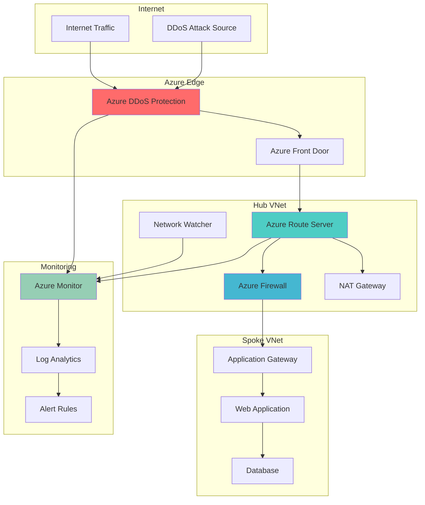

# Intelligent DDoS Protection with Adaptive BGP Routing

## Problem

Organizations face increasingly sophisticated DDoS attacks that can overwhelm traditional static network defenses, causing service disruptions and significant financial losses. Traditional network security approaches lack the intelligence to dynamically reroute traffic during attacks, monitor threat patterns in real-time, and automatically adapt routing policies based on threat intelligence, leaving critical applications vulnerable to volumetric and protocol-based attacks.

## Solution

Build an adaptive network security architecture that combines Azure DDoS Protection Standard for intelligent threat mitigation with Azure Route Server for dynamic BGP-based traffic routing. This solution automatically detects DDoS attacks, implements intelligent traffic rerouting through network virtual appliances, and provides comprehensive monitoring and alerting capabilities to maintain service availability during security incidents.

## Architecture Diagram



## Prerequisites

1. Azure subscription with Owner or Contributor permissions for resource group management
2. Azure CLI v2.50.0 or later installed and configured (or Azure Cloud Shell)
3. Basic understanding of Azure networking concepts (VNets, subnets, BGP routing)
4. Familiarity with network security principles and DDoS attack patterns
5. Estimated cost: $2,944 per month for DDoS Network Protection plus compute and networking costs

> **Note**: Azure DDoS Protection Network Protection pricing includes a monthly fixed fee that covers up to 100 protected public IP addresses. Review the [Azure DDoS Protection pricing](https://azure.microsoft.com/pricing/details/ddos-protection/) before deployment.

## Preparation

```bash
# Set environment variables for Azure resources
export RESOURCE_GROUP="rg-adaptive-network-security"
export LOCATION="eastus"
export SUBSCRIPTION_ID=$(az account show --query id --output tsv)

# Generate unique suffix for resource names
RANDOM_SUFFIX=$(openssl rand -hex 3)

# Set resource naming variables
export HUB_VNET_NAME="vnet-hub-${RANDOM_SUFFIX}"
export SPOKE_VNET_NAME="vnet-spoke-${RANDOM_SUFFIX}"
export ROUTE_SERVER_NAME="rs-adaptive-${RANDOM_SUFFIX}"
export DDOS_PLAN_NAME="ddos-plan-${RANDOM_SUFFIX}"
export FIREWALL_NAME="fw-adaptive-${RANDOM_SUFFIX}"
export LOG_ANALYTICS_NAME="law-adaptive-${RANDOM_SUFFIX}"

# Create resource group
az group create \
    --name ${RESOURCE_GROUP} \
    --location ${LOCATION} \
    --tags purpose=adaptive-network-security environment=production

echo "✅ Resource group created: ${RESOURCE_GROUP}"

# Register required resource providers
az provider register --namespace Microsoft.Network
az provider register --namespace Microsoft.Security
az provider register --namespace Microsoft.OperationalInsights

echo "✅ Resource providers registered"
```

## Steps

1. **Create DDoS Protection Plan**:

   Azure DDoS Protection Network Protection provides enhanced DDoS mitigation capabilities beyond the basic protection included with Azure platform. It offers always-on traffic monitoring, adaptive real-time tuning, and DDoS mitigation analytics with cost protection and attack analytics. This managed service automatically scales protection based on traffic patterns and provides detailed telemetry for security analysis.

   ```bash
   # Create DDoS Protection Plan
   az network ddos-protection create \
       --name ${DDOS_PLAN_NAME} \
       --resource-group ${RESOURCE_GROUP} \
       --location ${LOCATION} \
       --tags purpose=ddos-protection tier=standard
   
   # Store DDoS Protection Plan ID for later use
   DDOS_PLAN_ID=$(az network ddos-protection show \
       --name ${DDOS_PLAN_NAME} \
       --resource-group ${RESOURCE_GROUP} \
       --query id --output tsv)
   
   echo "✅ DDoS Protection Plan created: ${DDOS_PLAN_NAME}"
   ```

   The DDoS Protection Plan is now ready to provide advanced threat protection for your virtual networks. This foundational security layer will automatically detect and mitigate volumetric, protocol, and resource layer attacks while maintaining service availability during security incidents.

2. **Create Hub Virtual Network with DDoS Protection**:

   The hub virtual network serves as the central connectivity point for your network architecture, hosting shared services like Azure Route Server and Azure Firewall. Enabling DDoS Protection on the hub VNet ensures that all traffic flowing through the network infrastructure benefits from intelligent threat detection and mitigation capabilities.

   ```bash
   # Create hub virtual network with DDoS Protection
   az network vnet create \
       --name ${HUB_VNET_NAME} \
       --resource-group ${RESOURCE_GROUP} \
       --location ${LOCATION} \
       --address-prefix 10.0.0.0/16 \
       --ddos-protection-plan ${DDOS_PLAN_ID} \
       --enable-ddos-protection true \
       --tags purpose=hub-network tier=production
   
   # Create Route Server subnet (required for Azure Route Server)
   az network vnet subnet create \
       --name RouteServerSubnet \
       --resource-group ${RESOURCE_GROUP} \
       --vnet-name ${HUB_VNET_NAME} \
       --address-prefix 10.0.1.0/27
   
   # Create Azure Firewall subnet
   az network vnet subnet create \
       --name AzureFirewallSubnet \
       --resource-group ${RESOURCE_GROUP} \
       --vnet-name ${HUB_VNET_NAME} \
       --address-prefix 10.0.2.0/26
   
   # Create management subnet for network appliances
   az network vnet subnet create \
       --name ManagementSubnet \
       --resource-group ${RESOURCE_GROUP} \
       --vnet-name ${HUB_VNET_NAME} \
       --address-prefix 10.0.3.0/24
   
   echo "✅ Hub VNet created with DDoS Protection enabled"
   ```

   The hub virtual network is now configured with DDoS Protection Network Protection and specialized subnets for network services. This architecture provides centralized security monitoring and control while enabling dynamic routing capabilities through Azure Route Server.

3. **Create Spoke Virtual Network and Application Resources**:

   The spoke virtual network hosts your application workloads and connects to the hub network through VNet peering. This design follows the hub-and-spoke network topology, providing centralized security controls while isolating application traffic and enabling scalable network architecture.

   ```bash
   # Create spoke virtual network
   az network vnet create \
       --name ${SPOKE_VNET_NAME} \
       --resource-group ${RESOURCE_GROUP} \
       --location ${LOCATION} \
       --address-prefix 10.1.0.0/16 \
       --tags purpose=spoke-network tier=application
   
   # Create application subnet
   az network vnet subnet create \
       --name ApplicationSubnet \
       --resource-group ${RESOURCE_GROUP} \
       --vnet-name ${SPOKE_VNET_NAME} \
       --address-prefix 10.1.1.0/24
   
   # Create database subnet
   az network vnet subnet create \
       --name DatabaseSubnet \
       --resource-group ${RESOURCE_GROUP} \
       --vnet-name ${SPOKE_VNET_NAME} \
       --address-prefix 10.1.2.0/24
   
   # Create VNet peering from hub to spoke
   az network vnet peering create \
       --name "hub-to-spoke" \
       --resource-group ${RESOURCE_GROUP} \
       --vnet-name ${HUB_VNET_NAME} \
       --remote-vnet ${SPOKE_VNET_NAME} \
       --allow-vnet-access \
       --allow-forwarded-traffic \
       --use-remote-gateways false
   
   # Create VNet peering from spoke to hub
   az network vnet peering create \
       --name "spoke-to-hub" \
       --resource-group ${RESOURCE_GROUP} \
       --vnet-name ${SPOKE_VNET_NAME} \
       --remote-vnet ${HUB_VNET_NAME} \
       --allow-vnet-access \
       --allow-forwarded-traffic \
       --use-remote-gateways false
   
   echo "✅ Spoke VNet created and peered with hub"
   ```

   The spoke virtual network is now connected to the hub through VNet peering, creating a secure network topology that enables centralized security controls while maintaining application isolation and performance.

4. **Deploy Azure Route Server**:

   Azure Route Server enables dynamic routing between network virtual appliances and your Azure virtual network using BGP. It simplifies network configuration by automatically exchanging routing information, eliminating the need for manual route table management and enabling intelligent traffic routing based on real-time network conditions.

   ```bash
   # Create public IP for Route Server
   az network public-ip create \
       --name "pip-${ROUTE_SERVER_NAME}" \
       --resource-group ${RESOURCE_GROUP} \
       --location ${LOCATION} \
       --allocation-method Static \
       --sku Standard \
       --tier Regional
   
   # Create Azure Route Server
   az network routeserver create \
       --name ${ROUTE_SERVER_NAME} \
       --resource-group ${RESOURCE_GROUP} \
       --location ${LOCATION} \
       --hosted-subnet $(az network vnet subnet show \
           --name RouteServerSubnet \
           --resource-group ${RESOURCE_GROUP} \
           --vnet-name ${HUB_VNET_NAME} \
           --query id --output tsv) \
       --public-ip-address "pip-${ROUTE_SERVER_NAME}" \
       --tags purpose=dynamic-routing tier=production
   
   # Wait for Route Server deployment
   echo "Waiting for Route Server deployment..."
   az network routeserver wait \
       --name ${ROUTE_SERVER_NAME} \
       --resource-group ${RESOURCE_GROUP} \
       --created
   
   echo "✅ Azure Route Server deployed and ready"
   ```

   The Azure Route Server is now operational and ready to establish BGP peering sessions with network virtual appliances. This enables dynamic route advertisement and intelligent traffic routing based on network conditions and security policies.

5. **Configure Azure Firewall for Traffic Inspection**:

   Azure Firewall provides centralized network security with threat intelligence-based filtering and application-aware inspection capabilities. Integrating the firewall with Azure Route Server enables dynamic routing of traffic through security inspection points while maintaining high availability and performance.

   ```bash
   # Create public IP for Azure Firewall
   az network public-ip create \
       --name "pip-${FIREWALL_NAME}" \
       --resource-group ${RESOURCE_GROUP} \
       --location ${LOCATION} \
       --allocation-method Static \
       --sku Standard \
       --tier Regional
   
   # Create Azure Firewall
   az network firewall create \
       --name ${FIREWALL_NAME} \
       --resource-group ${RESOURCE_GROUP} \
       --location ${LOCATION} \
       --tier Standard \
       --sku AZFW_VNet \
       --tags purpose=network-security tier=production
   
   # Configure Azure Firewall IP configuration
   az network firewall ip-config create \
       --name "fw-ipconfig" \
       --resource-group ${RESOURCE_GROUP} \
       --firewall-name ${FIREWALL_NAME} \
       --public-ip-address "pip-${FIREWALL_NAME}" \
       --vnet-name ${HUB_VNET_NAME}
   
   # Create network rule collection for traffic inspection
   az network firewall network-rule create \
       --collection-name "adaptive-security-rules" \
       --destination-addresses "*" \
       --destination-ports 80 443 \
       --firewall-name ${FIREWALL_NAME} \
       --name "allow-web-traffic" \
       --protocols TCP \
       --resource-group ${RESOURCE_GROUP} \
       --source-addresses 10.1.0.0/16 \
       --action Allow \
       --priority 100
   
   echo "✅ Azure Firewall configured with traffic inspection rules"
   ```

   The Azure Firewall is now active and configured to inspect traffic flowing between networks. This provides application-aware security filtering and threat intelligence capabilities that complement the DDoS Protection at the network edge.

6. **Create Log Analytics Workspace for Monitoring**:

   Log Analytics provides centralized logging and analytics capabilities for monitoring network security events, DDoS attacks, and routing changes. This workspace serves as the foundation for security monitoring, alerting, and forensic analysis across your adaptive network security architecture.

   ```bash
   # Create Log Analytics workspace
   az monitor log-analytics workspace create \
       --name ${LOG_ANALYTICS_NAME} \
       --resource-group ${RESOURCE_GROUP} \
       --location ${LOCATION} \
       --sku PerGB2018 \
       --retention-time 30 \
       --tags purpose=security-monitoring tier=production
   
   # Get workspace ID for configuration
   WORKSPACE_ID=$(az monitor log-analytics workspace show \
       --name ${LOG_ANALYTICS_NAME} \
       --resource-group ${RESOURCE_GROUP} \
       --query id --output tsv)
   
   echo "✅ Log Analytics workspace created: ${LOG_ANALYTICS_NAME}"
   ```

   The Log Analytics workspace is now ready to collect and analyze security telemetry from your network infrastructure. This centralized logging capability enables proactive threat detection and forensic analysis of security incidents.

7. **Enable Network Watcher and Flow Logs**:

   Network Watcher provides network monitoring, diagnostics, and analytics capabilities that are essential for understanding traffic patterns and detecting anomalies. Flow logs capture detailed information about network traffic, enabling security analysis and compliance reporting.

   ```bash
   # Enable Network Watcher (automatically enabled per region)
   az network watcher configure \
       --resource-group ${RESOURCE_GROUP} \
       --location ${LOCATION} \
       --enabled true
   
   # Create storage account for flow logs
   STORAGE_ACCOUNT="stflowlogs${RANDOM_SUFFIX}"
   az storage account create \
       --name ${STORAGE_ACCOUNT} \
       --resource-group ${RESOURCE_GROUP} \
       --location ${LOCATION} \
       --sku Standard_LRS \
       --kind StorageV2
   
   # Create Network Security Group for spoke subnet
   az network nsg create \
       --name "nsg-spoke-${RANDOM_SUFFIX}" \
       --resource-group ${RESOURCE_GROUP} \
       --location ${LOCATION}
   
   # Associate NSG with spoke application subnet
   az network vnet subnet update \
       --name ApplicationSubnet \
       --resource-group ${RESOURCE_GROUP} \
       --vnet-name ${SPOKE_VNET_NAME} \
       --network-security-group "nsg-spoke-${RANDOM_SUFFIX}"
   
   # Get Network Security Group ID
   NSG_ID=$(az network nsg show \
       --name "nsg-spoke-${RANDOM_SUFFIX}" \
       --resource-group ${RESOURCE_GROUP} \
       --query id --output tsv)
   
   # Configure flow logs
   az network watcher flow-log create \
       --name "flowlog-${RANDOM_SUFFIX}" \
       --resource-group ${RESOURCE_GROUP} \
       --location ${LOCATION} \
       --nsg ${NSG_ID} \
       --storage-account ${STORAGE_ACCOUNT} \
       --workspace ${WORKSPACE_ID} \
       --enabled true \
       --format JSON \
       --log-version 2
   
   echo "✅ Network Watcher and flow logs configured"
   ```

   Network Watcher is now active and capturing detailed network telemetry. This provides comprehensive visibility into network traffic patterns and enables advanced security analytics for threat detection and response.

8. **Configure DDoS Protection Monitoring and Alerts**:

   Comprehensive monitoring and alerting for DDoS attacks ensures rapid response to security incidents. Azure Monitor provides built-in metrics and alerting capabilities that integrate with DDoS Protection to provide real-time visibility into attack patterns and mitigation effectiveness.

   ```bash
   # Create action group for DDoS alerts
   az monitor action-group create \
       --name "ddos-alerts-${RANDOM_SUFFIX}" \
       --resource-group ${RESOURCE_GROUP} \
       --short-name "ddos-ag" \
       --tags purpose=ddos-alerting
   
   # Get public IP resource ID for monitoring
   PUBLIC_IP_ID=$(az network public-ip show \
       --name "pip-${FIREWALL_NAME}" \
       --resource-group ${RESOURCE_GROUP} \
       --query id --output tsv)
   
   # Create alert rule for DDoS attack detection
   az monitor metrics alert create \
       --name "DDoS-Attack-Alert" \
       --resource-group ${RESOURCE_GROUP} \
       --scopes ${PUBLIC_IP_ID} \
       --condition "avg 'Under DDoS attack or not' > 0" \
       --window-size 5m \
       --evaluation-frequency 1m \
       --severity 1 \
       --action "ddos-alerts-${RANDOM_SUFFIX}" \
       --description "Alert when DDoS attack is detected"
   
   # Create alert rule for traffic volume monitoring
   az monitor metrics alert create \
       --name "High-Traffic-Volume-Alert" \
       --resource-group ${RESOURCE_GROUP} \
       --scopes ${PUBLIC_IP_ID} \
       --condition "avg 'Packets inbound DDoS' > 100000" \
       --window-size 5m \
       --evaluation-frequency 1m \
       --severity 2 \
       --action "ddos-alerts-${RANDOM_SUFFIX}" \
       --description "Alert when traffic volume exceeds threshold"
   
   echo "✅ DDoS monitoring and alerting configured"
   ```

   The monitoring and alerting system is now active and will provide real-time notifications when DDoS attacks are detected or traffic volumes exceed normal thresholds. This enables rapid response to security incidents and helps maintain service availability.

## Validation & Testing

1. **Verify DDoS Protection Status**:

   ```bash
   # Check DDoS Protection Plan status
   az network ddos-protection show \
       --name ${DDOS_PLAN_NAME} \
       --resource-group ${RESOURCE_GROUP} \
       --query "provisioningState" \
       --output table
   
   # Verify VNet DDoS Protection status
   az network vnet show \
       --name ${HUB_VNET_NAME} \
       --resource-group ${RESOURCE_GROUP} \
       --query "enableDdosProtection" \
       --output table
   ```

   Expected output: `ProvisioningState: Succeeded` and `EnableDdosProtection: true`

2. **Test Route Server Connectivity**:

   ```bash
   # Check Route Server status
   az network routeserver show \
       --name ${ROUTE_SERVER_NAME} \
       --resource-group ${RESOURCE_GROUP} \
       --query "provisioningState" \
       --output table
   
   # Get Route Server details for BGP configuration
   az network routeserver show \
       --name ${ROUTE_SERVER_NAME} \
       --resource-group ${RESOURCE_GROUP} \
       --query "{ASN:virtualRouterAsn,IPs:virtualRouterIps}" \
       --output table
   ```

   Expected output: `ProvisioningState: Succeeded` with BGP ASN and IP addresses displayed

3. **Validate Network Monitoring**:

   ```bash
   # Check Network Watcher status
   az network watcher show \
       --resource-group ${RESOURCE_GROUP} \
       --location ${LOCATION} \
       --query "provisioningState" \
       --output table
   
   # Verify Log Analytics workspace
   az monitor log-analytics workspace show \
       --name ${LOG_ANALYTICS_NAME} \
       --resource-group ${RESOURCE_GROUP} \
       --query "provisioningState" \
       --output table
   ```

   Expected output: Both resources should show `ProvisioningState: Succeeded`

4. **Test Alert Configuration**:

   ```bash
   # List configured alert rules
   az monitor metrics alert list \
       --resource-group ${RESOURCE_GROUP} \
       --query "[].{Name:name,Severity:severity,Enabled:enabled}" \
       --output table
   
   # Check action group configuration
   az monitor action-group show \
       --name "ddos-alerts-${RANDOM_SUFFIX}" \
       --resource-group ${RESOURCE_GROUP} \
       --query "enabled" \
       --output table
   ```

   Expected output: Alert rules should be enabled with appropriate severity levels

## Cleanup

1. **Remove Alert Rules and Action Groups**:

   ```bash
   # Delete alert rules
   az monitor metrics alert delete \
       --name "DDoS-Attack-Alert" \
       --resource-group ${RESOURCE_GROUP} \
       --yes
   
   az monitor metrics alert delete \
       --name "High-Traffic-Volume-Alert" \
       --resource-group ${RESOURCE_GROUP} \
       --yes
   
   # Delete action group
   az monitor action-group delete \
       --name "ddos-alerts-${RANDOM_SUFFIX}" \
       --resource-group ${RESOURCE_GROUP} \
       --yes
   
   echo "✅ Monitoring resources deleted"
   ```

2. **Remove Network Resources**:

   ```bash
   # Delete Route Server
   az network routeserver delete \
       --name ${ROUTE_SERVER_NAME} \
       --resource-group ${RESOURCE_GROUP} \
       --yes
   
   # Delete Azure Firewall
   az network firewall delete \
       --name ${FIREWALL_NAME} \
       --resource-group ${RESOURCE_GROUP}
   
   # Delete public IPs
   az network public-ip delete \
       --name "pip-${ROUTE_SERVER_NAME}" \
       --resource-group ${RESOURCE_GROUP}
   
   az network public-ip delete \
       --name "pip-${FIREWALL_NAME}" \
       --resource-group ${RESOURCE_GROUP}
   
   echo "✅ Network resources deleted"
   ```

3. **Remove VNets and DDoS Protection**:

   ```bash
   # Delete VNet peerings
   az network vnet peering delete \
       --name "hub-to-spoke" \
       --resource-group ${RESOURCE_GROUP} \
       --vnet-name ${HUB_VNET_NAME}
   
   az network vnet peering delete \
       --name "spoke-to-hub" \
       --resource-group ${RESOURCE_GROUP} \
       --vnet-name ${SPOKE_VNET_NAME}
   
   # Delete virtual networks
   az network vnet delete \
       --name ${HUB_VNET_NAME} \
       --resource-group ${RESOURCE_GROUP}
   
   az network vnet delete \
       --name ${SPOKE_VNET_NAME} \
       --resource-group ${RESOURCE_GROUP}
   
   # Delete DDoS Protection Plan
   az network ddos-protection delete \
       --name ${DDOS_PLAN_NAME} \
       --resource-group ${RESOURCE_GROUP}
   
   echo "✅ VNets and DDoS Protection deleted"
   ```

4. **Remove Supporting Resources**:

   ```bash
   # Delete Log Analytics workspace
   az monitor log-analytics workspace delete \
       --name ${LOG_ANALYTICS_NAME} \
       --resource-group ${RESOURCE_GROUP} \
       --yes
   
   # Delete storage account
   az storage account delete \
       --name ${STORAGE_ACCOUNT} \
       --resource-group ${RESOURCE_GROUP} \
       --yes
   
   # Delete resource group
   az group delete \
       --name ${RESOURCE_GROUP} \
       --yes \
       --no-wait
   
   echo "✅ Resource group deletion initiated: ${RESOURCE_GROUP}"
   echo "Note: Deletion may take several minutes to complete"
   ```

## Discussion

Azure DDoS Protection Network Protection and Azure Route Server create a powerful combination for adaptive network security that automatically responds to evolving threats. This architecture provides always-on traffic monitoring with machine learning-based attack detection that can distinguish between legitimate traffic spikes and malicious DDoS attacks. The integration with Azure Route Server enables dynamic traffic routing through security appliances, allowing the network to adapt routing policies based on real-time threat intelligence and network conditions. For comprehensive guidance on DDoS protection strategies, see the [Azure DDoS Protection documentation](https://docs.microsoft.com/en-us/azure/ddos-protection/) and [Azure Route Server configuration guide](https://docs.microsoft.com/en-us/azure/route-server/configure-route-server).

The BGP-based routing capabilities of Azure Route Server provide significant advantages for network security operations by enabling automatic route propagation and network convergence during security incidents. When DDoS attacks are detected, the system can automatically reroute traffic through additional security appliances or redirect traffic to scrubbing centers. This approach follows the [Azure Well-Architected Framework](https://docs.microsoft.com/en-us/azure/architecture/framework/security/) principles of defense in depth and automated response to security threats.

From a cost optimization perspective, Azure DDoS Protection Network Protection provides cost protection guarantees that can offset the monthly service fees during large-scale attacks. The service includes DDoS Rapid Response support and detailed attack analytics that provide valuable insights for improving security posture. Azure Route Server eliminates the operational overhead of manually managing route tables and enables more efficient use of network virtual appliances through dynamic load balancing. For detailed cost analysis and optimization strategies, review the [Azure DDoS Protection pricing guide](https://azure.microsoft.com/pricing/details/ddos-protection/) and [Azure Route Server pricing](https://azure.microsoft.com/pricing/details/route-server/).

> **Tip**: Use Azure Network Watcher and Azure Monitor to continuously analyze traffic patterns and fine-tune DDoS protection policies. The [Azure Network Watcher documentation](https://docs.microsoft.com/en-us/azure/network-watcher/) provides comprehensive guidance on network monitoring and diagnostic capabilities that complement your adaptive security architecture.

## Challenge

Extend this adaptive network security solution by implementing these enhancements:

1. **Multi-Region Deployment**: Deploy the solution across multiple Azure regions with cross-region traffic routing and failover capabilities for enhanced resilience during large-scale attacks.

2. **Integration with Microsoft Sentinel**: Connect DDoS Protection logs and Route Server telemetry to Microsoft Sentinel for advanced threat hunting and security orchestration with automated response playbooks.

3. **Custom BGP Routing Logic**: Implement custom network virtual appliances that dynamically adjust BGP route advertisements based on security threat levels and traffic analysis using Azure Route Server peering.

4. **Application-Layer Protection**: Integrate Azure Web Application Firewall and Azure Front Door with your adaptive routing architecture to provide comprehensive protection across all layers of the network stack.

5. **Machine Learning Integration**: Implement Azure Machine Learning models to analyze traffic patterns and predict potential DDoS attacks, enabling proactive route adjustments and security posture improvements.

## Infrastructure Code

*Infrastructure code will be generated after recipe approval.*