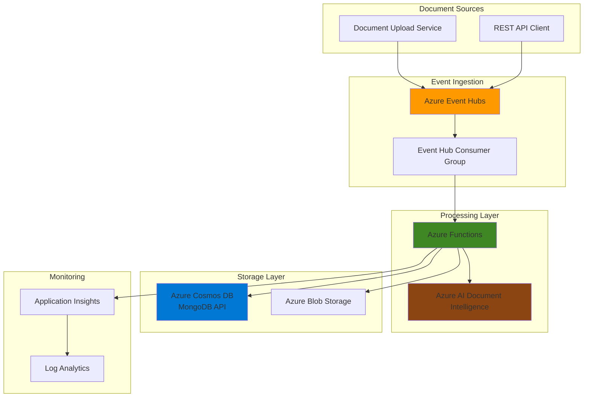

# Intelligent Document Processing with AI Extraction

## Problem

Organizations handling high-volume document workflows face challenges with traditional batch processing systems that create delays between document ingestion and availability of extracted insights. Manual document processing is slow, error-prone, and doesn't scale effectively with increasing document volumes. Without real-time capabilities, businesses lose competitive advantages in scenarios requiring immediate document analysis, such as financial transactions, legal document reviews, or customer onboarding processes.

## Solution

This solution implements a serverless, event-driven architecture that processes documents in real-time using Azure Event Hubs for high-throughput message ingestion, Azure AI Document Intelligence for intelligent text extraction, and Azure Cosmos DB for MongoDB API for flexible, scalable document storage. Azure Functions orchestrate the processing pipeline, automatically scaling based on demand while maintaining exactly-once processing semantics through Event Hubs' built-in checkpointing system.

## Architecture Diagram



## Prerequisites

1. Azure account with appropriate permissions for creating Event Hubs, Functions, Cosmos DB, and AI services
2. Azure CLI v2.60.0 or later installed and configured (or Azure Cloud Shell)
3. Basic knowledge of serverless architectures and event-driven patterns
4. Understanding of NoSQL database concepts and MongoDB operations
5. Estimated cost: $50-100 per month for moderate usage (Event Hubs Standard, Functions Consumption, Cosmos DB 400 RU/s)

> **Note**: This recipe uses Azure AI Document Intelligence which requires specific Azure regions. Ensure your chosen region supports all required services by checking the [Azure products by region page](https://azure.microsoft.com/en-us/global-infrastructure/services/).

## Preparation

```bash
# Set environment variables for Azure resources
export RESOURCE_GROUP="rg-docprocessing-${RANDOM_SUFFIX}"
export LOCATION="eastus"
export SUBSCRIPTION_ID=$(az account show --query id --output tsv)

# Generate unique suffix for resource names
RANDOM_SUFFIX=$(openssl rand -hex 3)

# Set specific resource names
export EVENT_HUB_NAMESPACE="eh-docprocessing-${RANDOM_SUFFIX}"
export EVENT_HUB_NAME="document-events"
export COSMOS_ACCOUNT="cosmos-docprocessing-${RANDOM_SUFFIX}"
export FUNCTION_APP_NAME="func-docprocessing-${RANDOM_SUFFIX}"
export STORAGE_ACCOUNT="stdocprocessing${RANDOM_SUFFIX}"
export AI_DOCUMENT_SERVICE="ai-docprocessing-${RANDOM_SUFFIX}"

# Create resource group
az group create \
    --name ${RESOURCE_GROUP} \
    --location ${LOCATION} \
    --tags purpose=document-processing environment=demo

echo "✅ Resource group created: ${RESOURCE_GROUP}"

# Create storage account for Function App
az storage account create \
    --name ${STORAGE_ACCOUNT} \
    --resource-group ${RESOURCE_GROUP} \
    --location ${LOCATION} \
    --sku Standard_LRS \
    --kind StorageV2

echo "✅ Storage account created: ${STORAGE_ACCOUNT}"
```

## Steps

1. **Create Azure Event Hubs Namespace and Hub**:

   Azure Event Hubs provides a distributed streaming platform capable of ingesting millions of events per second with low latency. The namespace acts as a container for multiple Event Hubs, while the hub itself serves as the event ingestion endpoint. This architecture ensures high availability and automatic scaling for unpredictable document processing workloads.

   ```bash
   # Create Event Hubs namespace
   az eventhubs namespace create \
       --name ${EVENT_HUB_NAMESPACE} \
       --resource-group ${RESOURCE_GROUP} \
       --location ${LOCATION} \
       --sku Standard \
       --capacity 1
   
   # Create Event Hub
   az eventhubs eventhub create \
       --name ${EVENT_HUB_NAME} \
       --namespace-name ${EVENT_HUB_NAMESPACE} \
       --resource-group ${RESOURCE_GROUP} \
       --partition-count 4 \
       --message-retention 1
   
   # Create consumer group for Functions
   az eventhubs eventhub consumer-group create \
       --name functions-consumer \
       --eventhub-name ${EVENT_HUB_NAME} \
       --namespace-name ${EVENT_HUB_NAMESPACE} \
       --resource-group ${RESOURCE_GROUP}
   
   echo "✅ Event Hubs infrastructure created with partitioned architecture"
   ```

   The Event Hub is configured with 4 partitions to enable parallel processing while maintaining message ordering within each partition. This setup provides the foundation for real-time document event ingestion with built-in load balancing and fault tolerance.

2. **Deploy Azure Cosmos DB for MongoDB**:

   Azure Cosmos DB for MongoDB API provides globally distributed, multi-model database capabilities with MongoDB compatibility. This enables flexible document storage with automatic scaling, built-in replication, and comprehensive SLA coverage. The MongoDB API maintains familiar development patterns while providing enterprise-grade performance and reliability.

   ```bash
   # Create Cosmos DB account with MongoDB API
   az cosmosdb create \
       --name ${COSMOS_ACCOUNT} \
       --resource-group ${RESOURCE_GROUP} \
       --location ${LOCATION} \
       --kind MongoDB \
       --server-version 5.0 \
       --default-consistency-level Session \
       --enable-automatic-failover true
   
   # Create database
   az cosmosdb mongodb database create \
       --account-name ${COSMOS_ACCOUNT} \
       --resource-group ${RESOURCE_GROUP} \
       --name DocumentProcessingDB
   
   # Create collection with sharding
   az cosmosdb mongodb collection create \
       --account-name ${COSMOS_ACCOUNT} \
       --resource-group ${RESOURCE_GROUP} \
       --database-name DocumentProcessingDB \
       --name ProcessedDocuments \
       --throughput 400 \
       --shard documentId
   
   echo "✅ Cosmos DB MongoDB API configured with automatic failover"
   ```

   The Cosmos DB account is configured with MongoDB server version 5.0 for the latest features and Session consistency for optimal balance between performance and data consistency. The collection uses document ID as the shard key, ensuring even distribution of documents across partitions for scalable storage and query performance.

3. **Create Azure AI Document Intelligence Service**:

   Azure AI Document Intelligence provides advanced document analysis capabilities including text extraction, key-value pair identification, and table recognition. This managed service eliminates the complexity of building custom OCR solutions while providing industry-leading accuracy for various document types including forms, invoices, and contracts.

   ```bash
   # Create AI Document Intelligence service
   az cognitiveservices account create \
       --name ${AI_DOCUMENT_SERVICE} \
       --resource-group ${RESOURCE_GROUP} \
       --location ${LOCATION} \
       --kind FormRecognizer \
       --sku S0 \
       --custom-domain ${AI_DOCUMENT_SERVICE}
   
   # Get API key for Functions configuration
   AI_DOC_KEY=$(az cognitiveservices account keys list \
       --name ${AI_DOCUMENT_SERVICE} \
       --resource-group ${RESOURCE_GROUP} \
       --query key1 --output tsv)
   
   # Get endpoint URL
   AI_DOC_ENDPOINT=$(az cognitiveservices account show \
       --name ${AI_DOCUMENT_SERVICE} \
       --resource-group ${RESOURCE_GROUP} \
       --query properties.endpoint --output tsv)
   
   echo "✅ AI Document Intelligence service deployed and configured"
   ```

   The S0 pricing tier provides sufficient capacity for moderate document processing workloads with the ability to process multiple document types simultaneously. The service integrates seamlessly with Azure Functions through REST API calls using the latest Document Intelligence API version.

4. **Deploy Azure Functions App with Event Hub Trigger**:

   Azure Functions provides serverless compute that automatically scales based on Event Hub message volume. The consumption plan ensures cost-effective operation by charging only for actual execution time while maintaining sub-second response times. Functions handle the orchestration between Event Hubs, AI Document Intelligence, and Cosmos DB.

   ```bash
   # Create Function App
   az functionapp create \
       --name ${FUNCTION_APP_NAME} \
       --resource-group ${RESOURCE_GROUP} \
       --storage-account ${STORAGE_ACCOUNT} \
       --consumption-plan-location ${LOCATION} \
       --runtime node \
       --runtime-version 20 \
       --functions-version 4
   
   # Get Event Hub connection string
   EVENT_HUB_CONNECTION=$(az eventhubs namespace authorization-rule keys list \
       --name RootManageSharedAccessKey \
       --namespace-name ${EVENT_HUB_NAMESPACE} \
       --resource-group ${RESOURCE_GROUP} \
       --query primaryConnectionString --output tsv)
   
   # Get Cosmos DB connection string
   COSMOS_CONNECTION=$(az cosmosdb keys list \
       --name ${COSMOS_ACCOUNT} \
       --resource-group ${RESOURCE_GROUP} \
       --type connection-strings \
       --query "connectionStrings[0].connectionString" --output tsv)
   
   # Configure application settings
   az functionapp config appsettings set \
       --name ${FUNCTION_APP_NAME} \
       --resource-group ${RESOURCE_GROUP} \
       --settings \
       "EventHubConnection=${EVENT_HUB_CONNECTION}" \
       "CosmosDBConnection=${COSMOS_CONNECTION}" \
       "AIDocumentKey=${AI_DOC_KEY}" \
       "AIDocumentEndpoint=${AI_DOC_ENDPOINT}"
   
   echo "✅ Function App configured with Event Hub and Cosmos DB integration"
   ```

   The Function App is configured with Node.js 20 runtime for optimal performance and modern JavaScript features. Application settings provide secure access to all integrated services without hardcoding credentials in the function code.

5. **Create Document Processing Function**:

   The processing function implements the core business logic for document analysis, extraction, and storage. It processes Event Hub messages containing document metadata, calls AI Document Intelligence for text extraction, and stores results in Cosmos DB with proper error handling and retry logic.

   ```bash
   # Create function directory structure
   mkdir -p /tmp/DocumentProcessor
   cd /tmp/DocumentProcessor
   
   # Create function.json for Event Hub trigger
   cat > function.json << 'EOF'
   {
     "bindings": [
       {
         "type": "eventHubTrigger",
         "name": "eventHubMessages",
         "direction": "in",
         "eventHubName": "document-events",
         "connection": "EventHubConnection",
         "consumerGroup": "functions-consumer",
         "cardinality": "many"
       }
     ]
   }
   EOF
   
   # Create main function code
   cat > index.js << 'EOF'
   const { MongoClient } = require('mongodb');
   const axios = require('axios');
   
   module.exports = async function (context, eventHubMessages) {
       const cosmosConnection = process.env.CosmosDBConnection;
       const aiEndpoint = process.env.AIDocumentEndpoint;
       const aiKey = process.env.AIDocumentKey;
       
       const client = new MongoClient(cosmosConnection);
       
       try {
           await client.connect();
           const db = client.db('DocumentProcessingDB');
           const collection = db.collection('ProcessedDocuments');
           
           for (const message of eventHubMessages) {
               try {
                   context.log('Processing document:', message.documentId);
                   
                   // Call AI Document Intelligence v4.0 API
                   const response = await axios.post(
                       `${aiEndpoint}/documentintelligence/documentModels/prebuilt-layout:analyze?api-version=2024-11-30`,
                       { urlSource: message.documentUrl },
                       {
                           headers: {
                               'Ocp-Apim-Subscription-Key': aiKey,
                               'Content-Type': 'application/json'
                           }
                       }
                   );
                   
                   // Get operation location for polling
                   const operationLocation = response.headers['operation-location'];
                   
                   // Poll for completion
                   let result;
                   let attempts = 0;
                   do {
                       await new Promise(resolve => setTimeout(resolve, 1000));
                       const pollResponse = await axios.get(operationLocation, {
                           headers: { 'Ocp-Apim-Subscription-Key': aiKey }
                       });
                       result = pollResponse.data;
                       attempts++;
                   } while (result.status === 'running' && attempts < 30);
                   
                   if (result.status === 'succeeded') {
                       // Store processed document
                       const processedDoc = {
                           documentId: message.documentId,
                           originalUrl: message.documentUrl,
                           extractedText: result.analyzeResult.pages.map(p => 
                               p.lines.map(l => l.content).join(' ')
                           ).join('\n'),
                           processingDate: new Date(),
                           metadata: message.metadata || {},
                           aiAnalysis: result.analyzeResult
                       };
                       
                       await collection.insertOne(processedDoc);
                       context.log('Document processed successfully:', message.documentId);
                   } else {
                       context.log.error('Document processing failed:', message.documentId);
                   }
                   
               } catch (error) {
                   context.log.error('Error processing document:', error);
               }
           }
       } finally {
           await client.close();
       }
   };
   EOF
   
   # Create package.json
   cat > package.json << 'EOF'
   {
     "name": "document-processor",
     "version": "1.0.0",
     "dependencies": {
       "mongodb": "^6.0.0",
       "axios": "^1.6.0"
     }
   }
   EOF
   
   # Deploy function
   zip -r function.zip .
   az functionapp deployment source config-zip \
       --name ${FUNCTION_APP_NAME} \
       --resource-group ${RESOURCE_GROUP} \
       --src function.zip
   
   echo "✅ Document processing function deployed with AI integration"
   ```

   The function implements asynchronous processing with proper error handling and connection management. It uses the latest Azure AI Document Intelligence v4.0 API (2024-11-30) with the new endpoint format and polls the service for completion. The function stores comprehensive document analysis results in Cosmos DB with both extracted text and detailed AI analysis metadata.

6. **Create Change Feed Function for Downstream Processing**:

   Azure Cosmos DB change feed provides a persistent record of document modifications, enabling real-time reactions to data changes. This function demonstrates how to trigger downstream workflows such as notifications, indexing, or additional processing based on newly processed documents.

   ```bash
   # Create change feed function directory
   mkdir -p /tmp/ChangeProcessor
   cd /tmp/ChangeProcessor
   
   # Create function.json for Cosmos DB trigger
   cat > function.json << 'EOF'
   {
     "bindings": [
       {
         "type": "cosmosDBTrigger",
         "name": "documents",
         "direction": "in",
         "connectionStringSetting": "CosmosDBConnection",
         "databaseName": "DocumentProcessingDB",
         "collectionName": "ProcessedDocuments",
         "createLeaseCollectionIfNotExists": true,
         "leaseCollectionName": "leases"
       }
     ]
   }
   EOF
   
   # Create change feed processor
   cat > index.js << 'EOF'
   module.exports = async function (context, documents) {
       if (documents && documents.length > 0) {
           context.log('Processing', documents.length, 'document changes');
           
           for (const doc of documents) {
               context.log('Document changed:', doc.documentId);
               
               // Example downstream processing
               if (doc.extractedText && doc.extractedText.length > 1000) {
                   context.log('Large document detected, triggering special processing');
                   // Add logic for large document handling
               }
               
               // Example: Send notification for specific document types
               if (doc.metadata && doc.metadata.type === 'invoice') {
                   context.log('Invoice processed, sending notification');
                   // Add notification logic
               }
           }
       }
   };
   EOF
   
   # Create package.json
   cat > package.json << 'EOF'
   {
     "name": "change-processor",
     "version": "1.0.0"
   }
   EOF
   
   # Deploy change feed function
   zip -r changefunction.zip .
   az functionapp deployment source config-zip \
       --name ${FUNCTION_APP_NAME} \
       --resource-group ${RESOURCE_GROUP} \
       --src changefunction.zip
   
   echo "✅ Change feed function deployed for downstream processing"
   ```

   The change feed function automatically creates a lease collection for tracking processed changes, ensuring exactly-once processing across multiple function instances. This enables building complex event-driven workflows that react to document processing completion.

7. **Configure Application Insights for Monitoring**:

   Application Insights provides comprehensive monitoring and diagnostics for the serverless application. It tracks function execution metrics, dependency calls, and custom telemetry, enabling proactive monitoring and performance optimization of the document processing pipeline.

   ```bash
   # Create Application Insights
   az monitor app-insights component create \
       --app ${FUNCTION_APP_NAME}-insights \
       --location ${LOCATION} \
       --resource-group ${RESOURCE_GROUP} \
       --kind web \
       --application-type web
   
   # Get instrumentation key
   APPINSIGHTS_KEY=$(az monitor app-insights component show \
       --app ${FUNCTION_APP_NAME}-insights \
       --resource-group ${RESOURCE_GROUP} \
       --query instrumentationKey --output tsv)
   
   # Configure Function App with Application Insights
   az functionapp config appsettings set \
       --name ${FUNCTION_APP_NAME} \
       --resource-group ${RESOURCE_GROUP} \
       --settings "APPINSIGHTS_INSTRUMENTATIONKEY=${APPINSIGHTS_KEY}"
   
   echo "✅ Application Insights configured for comprehensive monitoring"
   ```

   Application Insights integration provides real-time visibility into function performance, error rates, and dependency health. This enables rapid identification and resolution of issues in the document processing pipeline.

## Validation & Testing

1. **Verify Event Hub Configuration**:

   ```bash
   # Check Event Hub status
   az eventhubs eventhub show \
       --name ${EVENT_HUB_NAME} \
       --namespace-name ${EVENT_HUB_NAMESPACE} \
       --resource-group ${RESOURCE_GROUP} \
       --query "{Status:status,Partitions:partitionCount,MessageRetention:messageRetentionInDays}"
   ```

   Expected output: Status should be "Active" with 4 partitions and 1-day message retention.

2. **Test Cosmos DB Connectivity**:

   ```bash
   # Verify Cosmos DB account
   az cosmosdb show \
       --name ${COSMOS_ACCOUNT} \
       --resource-group ${RESOURCE_GROUP} \
       --query "{Status:provisioningState,ConsistencyLevel:consistencyPolicy.defaultConsistencyLevel}"
   
   # Check collection configuration
   az cosmosdb mongodb collection show \
       --account-name ${COSMOS_ACCOUNT} \
       --resource-group ${RESOURCE_GROUP} \
       --database-name DocumentProcessingDB \
       --name ProcessedDocuments
   ```

   Expected output: Status should be "Succeeded" with Session consistency level.

3. **Test Function App Deployment**:

   ```bash
   # Verify Function App status
   az functionapp show \
       --name ${FUNCTION_APP_NAME} \
       --resource-group ${RESOURCE_GROUP} \
       --query "{State:state,Runtime:siteConfig.linuxFxVersion}"
   
   # Check function configuration
   az functionapp config appsettings list \
       --name ${FUNCTION_APP_NAME} \
       --resource-group ${RESOURCE_GROUP} \
       --query "[?name=='EventHubConnection'].name"
   ```

   Expected output: State should be "Running" with Node.js 20 runtime.

4. **Send Test Document Event**:

   ```bash
   # Install Event Hubs SDK for testing
   npm install @azure/event-hubs
   
   # Create test message
   cat > test-message.json << 'EOF'
   {
     "documentId": "test-doc-001",
     "documentUrl": "https://example.com/sample-document.pdf",
     "metadata": {
       "type": "invoice",
       "source": "api",
       "timestamp": "2025-07-12T10:00:00Z"
     }
   }
   EOF
   
   # Send test message
   node -e "
   const { EventHubProducerClient } = require('@azure/event-hubs');
   const client = new EventHubProducerClient('${EVENT_HUB_CONNECTION}', '${EVENT_HUB_NAME}');
   const message = require('./test-message.json');
   client.sendBatch([{ body: message }]).then(() => {
     console.log('✅ Test message sent successfully');
     process.exit(0);
   }).catch(console.error);
   "
   ```

## Cleanup

1. **Remove all Azure resources**:

   ```bash
   # Delete resource group and all contained resources
   az group delete \
       --name ${RESOURCE_GROUP} \
       --yes \
       --no-wait
   
   echo "✅ Resource group deletion initiated: ${RESOURCE_GROUP}"
   echo "Note: Deletion may take several minutes to complete"
   ```

2. **Verify resource cleanup**:

   ```bash
   # Check if resource group still exists
   az group exists --name ${RESOURCE_GROUP}
   
   # List any remaining resources (should be empty)
   az resource list --resource-group ${RESOURCE_GROUP} --output table
   ```

## Discussion

This serverless document processing architecture leverages Azure's managed services to create a highly scalable, cost-effective solution for real-time document analysis. The combination of Event Hubs and Functions provides elastic scaling capabilities that automatically adjust to document volume fluctuations without manual intervention. For comprehensive architectural guidance, see the [Azure Functions documentation](https://docs.microsoft.com/en-us/azure/azure-functions/) and [Event Hubs best practices](https://docs.microsoft.com/en-us/azure/event-hubs/event-hubs-performance-guide).

The event-driven pattern enables natural decoupling between document ingestion, processing, and storage layers, allowing independent scaling and evolution of system components. Azure Cosmos DB's change feed capability creates opportunities for building sophisticated downstream workflows such as document indexing, notification systems, and business process automation. This architecture follows the [Azure Well-Architected Framework](https://docs.microsoft.com/en-us/azure/architecture/framework/) principles of reliability, scalability, and cost optimization.

From a cost perspective, the consumption-based pricing model for Azure Functions ensures you only pay for actual document processing time, making this solution highly cost-effective for variable workloads. The serverless approach eliminates infrastructure management overhead while providing enterprise-grade security, compliance, and monitoring capabilities. For detailed cost optimization strategies, review the [Azure Functions performance guide](https://docs.microsoft.com/en-us/azure/azure-functions/functions-scale) and [Cosmos DB cost optimization documentation](https://docs.microsoft.com/en-us/azure/cosmos-db/optimize-cost-throughput).

The updated implementation uses Azure AI Document Intelligence v4.0 API (2024-11-30) with the new documentintelligence endpoint format and improved analysis capabilities. This latest version provides enhanced accuracy, support for more document types, and better performance for production workloads.

> **Tip**: Use Azure Monitor and Application Insights to track processing metrics and optimize performance. The [monitoring documentation](https://docs.microsoft.com/en-us/azure/azure-functions/functions-monitoring) provides comprehensive guidance on setting up alerts, tracking custom metrics, and identifying optimization opportunities for production workloads.

## Challenge

Extend this solution by implementing these enhancements:

1. **Document Classification Pipeline**: Add Azure Cognitive Services Text Analytics to automatically classify documents by type (invoice, contract, receipt) and route them to specialized processing functions based on classification results.

2. **Multi-Format Document Support**: Extend the AI Document Intelligence integration to handle various document formats (Word, Excel, PowerPoint) and implement format-specific extraction logic with appropriate error handling.

3. **Document Validation Workflow**: Create a validation system using Azure Logic Apps that flags documents requiring human review based on confidence scores, missing fields, or business rules, with approval workflows integrated into Microsoft Teams.

4. **Data Lake Integration**: Implement Azure Data Lake Storage Gen2 for long-term document archival and analytics, with Azure Synapse Analytics for reporting and business intelligence on document processing trends and patterns.

5. **Global Distribution**: Deploy the solution across multiple Azure regions with Cosmos DB global distribution, implementing geo-redundancy and disaster recovery patterns for mission-critical document processing workloads.

## Infrastructure Code

### Available Infrastructure as Code:

- [Infrastructure Code Overview](code/README.md) - Detailed description of all infrastructure components
- [Bicep](code/bicep/) - Azure Bicep templates
- [Bash CLI Scripts](code/scripts/) - Example bash scripts using Azure CLI commands to deploy infrastructure
- [Terraform](code/terraform/) - Terraform configuration files