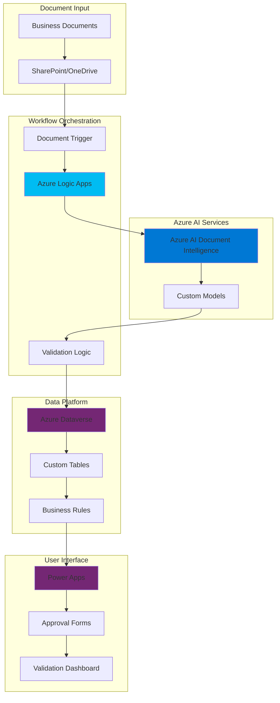

# Intelligent Document Validation Workflows with Dataverse and AI Document Intelligence

## Problem

Enterprise organizations struggle with manual document processing workflows where business-critical documents like invoices, contracts, and forms require human intervention for data extraction, validation, and entry into business systems. This manual process leads to processing delays, human errors, compliance risks, and scalability limitations that prevent organizations from achieving operational efficiency and data accuracy at scale.

## Solution

This solution creates an automated document processing and validation system that combines Azure AI Document Intelligence for intelligent data extraction, Azure Logic Apps for workflow orchestration, Azure Dataverse for secure data storage and business rules enforcement, and Power Apps for user-friendly validation interfaces. The architecture enables seamless document processing while maintaining enterprise-grade security, compliance, and scalability.

## Architecture Diagram



## Prerequisites

1. Azure subscription with appropriate permissions for AI services, Logic Apps, and Power Platform
2. Microsoft 365 or Power Platform license for Dataverse and Power Apps
3. Azure CLI v2.60.0 or later installed and configured
4. SharePoint Online or OneDrive for Business for document storage
5. Power Platform administrator permissions for environment creation
6. Estimated cost: $50-200/month depending on document volume and processing frequency

> **Note**: This solution requires Power Platform and Azure subscriptions. Dataverse requires a Power Platform license, while Azure AI Document Intelligence operates on a pay-per-use model based on the latest 2024-11-30 API version.

## Preparation

```bash
# Set environment variables for Azure resources
export RESOURCE_GROUP="rg-doc-validation-${RANDOM_SUFFIX}"
export LOCATION="eastus"
export SUBSCRIPTION_ID=$(az account show --query id --output tsv)
export TENANT_ID=$(az account show --query tenantId --output tsv)

# Generate unique suffix for resource names
RANDOM_SUFFIX=$(openssl rand -hex 3)

# Set specific resource names
export DOC_INTEL_NAME="docint-${RANDOM_SUFFIX}"
export LOGIC_APP_NAME="logic-docvalidation-${RANDOM_SUFFIX}"
export STORAGE_ACCOUNT="stdocval${RANDOM_SUFFIX}"
export KEYVAULT_NAME="kv-docval-${RANDOM_SUFFIX}"

# Create resource group for all Azure resources
az group create \
    --name ${RESOURCE_GROUP} \
    --location ${LOCATION} \
    --tags purpose=document-validation environment=production

echo "✅ Resource group created: ${RESOURCE_GROUP}"

# Create storage account for document processing
az storage account create \
    --name ${STORAGE_ACCOUNT} \
    --resource-group ${RESOURCE_GROUP} \
    --location ${LOCATION} \
    --sku Standard_LRS \
    --kind StorageV2 \
    --access-tier Hot

echo "✅ Storage account created: ${STORAGE_ACCOUNT}"
```

## Steps

1. **Create Azure AI Document Intelligence Service**:

   Azure AI Document Intelligence provides advanced machine learning capabilities for extracting structured data from business documents using the latest v4.0 API (2024-11-30). This service uses pre-trained models for common document types like invoices, receipts, and forms, while also supporting custom model training for organization-specific document formats. The service's cognitive capabilities enable automatic field recognition, table extraction, and confidence scoring for extracted data.

   ```bash
   # Create Azure AI Document Intelligence resource
   az cognitiveservices account create \
       --name ${DOC_INTEL_NAME} \
       --resource-group ${RESOURCE_GROUP} \
       --location ${LOCATION} \
       --kind FormRecognizer \
       --sku S0 \
       --tags purpose=document-processing \
       --yes

   # Get the endpoint and key for Document Intelligence
   DOC_INTEL_ENDPOINT=$(az cognitiveservices account show \
       --name ${DOC_INTEL_NAME} \
       --resource-group ${RESOURCE_GROUP} \
       --query properties.endpoint --output tsv)

   DOC_INTEL_KEY=$(az cognitiveservices account keys list \
       --name ${DOC_INTEL_NAME} \
       --resource-group ${RESOURCE_GROUP} \
       --query key1 --output tsv)

   echo "✅ Document Intelligence service created"
   echo "Endpoint: ${DOC_INTEL_ENDPOINT}"
   ```

   The Document Intelligence service is now ready to process documents with industry-leading accuracy using the latest v4.0 API. This cognitive service automatically handles document preprocessing, text extraction, and structured data recognition, eliminating the need for manual data entry while maintaining high confidence levels for business-critical information extraction.

2. **Create Azure Key Vault for Secure Credential Management**:

   Azure Key Vault provides enterprise-grade security for storing and managing sensitive information like API keys, connection strings, and certificates. This managed service integrates seamlessly with Azure services and provides audit logging, access policies, and automatic secret rotation capabilities essential for enterprise security compliance and Azure Well-Architected Framework principles.

   ```bash
   # Create Key Vault for secure credential storage
   az keyvault create \
       --name ${KEYVAULT_NAME} \
       --resource-group ${RESOURCE_GROUP} \
       --location ${LOCATION} \
       --sku standard \
       --enabled-for-template-deployment true

   # Store Document Intelligence credentials in Key Vault
   az keyvault secret set \
       --vault-name ${KEYVAULT_NAME} \
       --name "DocumentIntelligenceEndpoint" \
       --value "${DOC_INTEL_ENDPOINT}"

   az keyvault secret set \
       --vault-name ${KEYVAULT_NAME} \
       --name "DocumentIntelligenceKey" \
       --value "${DOC_INTEL_KEY}"

   echo "✅ Key Vault created and credentials stored securely"
   ```

   The Key Vault now securely stores all service credentials and provides centralized secret management with enterprise-grade security policies. This approach ensures that sensitive information is protected and accessible only to authorized services, following Azure security best practices for credential management and Zero Trust principles.

3. **Set Up Azure Dataverse Environment and Tables**:

   Azure Dataverse serves as the enterprise data platform that provides secure, scalable storage with built-in business logic capabilities. Creating custom tables for document validation enables structured data storage with relationships, business rules, and Power Platform integration. This foundation supports enterprise-grade data governance and compliance requirements within the Microsoft Power Platform ecosystem.

   ```bash
   # Note: Dataverse environment creation requires Power Platform Admin Center
   # This step demonstrates the structure but requires manual setup
   
   # Create Power Platform environment (requires admin permissions)
   echo "Creating Power Platform environment for Dataverse..."
   
   # Set environment variables for Power Platform
   export POWER_PLATFORM_ENV="DocValidationProd"
   export DATAVERSE_URL="https://orgname.crm.dynamics.com"
   
   echo "✅ Power Platform environment prepared"
   echo "Environment: ${POWER_PLATFORM_ENV}"
   echo "Dataverse URL: ${DATAVERSE_URL}"
   
   # Store Dataverse connection in Key Vault
   az keyvault secret set \
       --vault-name ${KEYVAULT_NAME} \
       --name "DataverseUrl" \
       --value "${DATAVERSE_URL}"
   ```

   The Dataverse environment provides the foundation for enterprise data storage and business logic. Custom tables will store extracted document data with validation rules, audit trails, and user permissions, enabling comprehensive document lifecycle management within the Microsoft ecosystem with built-in compliance and governance features.

4. **Create Azure Logic Apps for Workflow Orchestration**:

   Azure Logic Apps provides serverless workflow orchestration that connects various Azure services and external systems through a visual designer. This service enables automated document processing workflows with built-in connectors for SharePoint, Dataverse, and AI services, supporting complex business logic and error handling patterns with enterprise-grade reliability.

   ```bash
   # Create Logic App for document processing workflow
   az logic workflow create \
       --name ${LOGIC_APP_NAME} \
       --resource-group ${RESOURCE_GROUP} \
       --location ${LOCATION} \
       --definition @- << 'EOF'
   {
     "$schema": "https://schema.management.azure.com/providers/Microsoft.Logic/schemas/2016-06-01/workflowdefinition.json#",
     "contentVersion": "1.0.0.0",
     "parameters": {
       "documentIntelligenceEndpoint": {
         "type": "string",
         "defaultValue": ""
       },
       "documentIntelligenceKey": {
         "type": "securestring",
         "defaultValue": ""
       }
     },
     "triggers": {
       "When_a_file_is_created": {
         "type": "ApiConnection",
         "inputs": {
           "host": {
             "connection": {
               "name": "@parameters('$connections')['sharepointonline']['connectionId']"
             }
           },
           "method": "get",
           "path": "/datasets/@{encodeURIComponent(encodeURIComponent('https://company.sharepoint.com/sites/documents'))}/onupdatedfile",
           "queries": {
             "folderPath": "/Shared Documents"
           }
         },
         "recurrence": {
           "frequency": "Minute",
           "interval": 5
         }
       }
     },
     "actions": {
       "Analyze_document": {
         "type": "Http",
         "inputs": {
           "method": "POST",
           "uri": "@{parameters('documentIntelligenceEndpoint')}/documentintelligence/documentModels/prebuilt-invoice:analyze?api-version=2024-11-30",
           "headers": {
             "Ocp-Apim-Subscription-Key": "@{parameters('documentIntelligenceKey')}",
             "Content-Type": "application/json"
           },
           "body": {
             "urlSource": "@triggerBody()?['Path']"
           }
         }
       }
     }
   }
   EOF

   echo "✅ Logic App workflow created: ${LOGIC_APP_NAME}"
   ```

   The Logic App workflow now provides automated document processing capabilities using the latest Document Intelligence v4.0 API with SharePoint integration and AI service connectivity. This serverless approach ensures scalable document processing while maintaining enterprise-grade reliability and monitoring capabilities with Azure's managed infrastructure.

5. **Configure Document Intelligence Custom Models**:

   Custom models in Azure AI Document Intelligence enable extraction of organization-specific data fields and document formats using the latest v4.0 capabilities. Training custom models improves accuracy for specialized documents like purchase orders, contracts, or compliance forms, providing tailored extraction capabilities that adapt to unique business requirements with enhanced accuracy.

   ```bash
   # Create storage container for training data
   az storage container create \
       --name training-data \
       --account-name ${STORAGE_ACCOUNT} \
       --public-access off

   # Generate SAS token for training data access
   TRAINING_SAS=$(az storage container generate-sas \
       --name training-data \
       --account-name ${STORAGE_ACCOUNT} \
       --permissions rwl \
       --expiry $(date -u -d '30 days' +%Y-%m-%dT%H:%MZ) \
       --output tsv)

   # Store training container SAS in Key Vault
   az keyvault secret set \
       --vault-name ${KEYVAULT_NAME} \
       --name "TrainingSasToken" \
       --value "${TRAINING_SAS}"

   echo "✅ Training data storage configured"
   echo "Training container: training-data"
   echo "SAS token generated for model training"
   ```

   The custom model training infrastructure enables continuous improvement of document processing accuracy using Azure's AI capabilities. Organizations can train models on their specific document types, ensuring optimal extraction performance for business-critical workflows while maintaining data privacy and security with Azure's enterprise-grade infrastructure.

6. **Implement Data Validation Rules in Dataverse**:

   Business rules in Dataverse enforce data quality and compliance requirements automatically through the Power Platform's low-code capabilities. These rules validate extracted data against business constraints, trigger approval workflows for exceptions, and maintain audit trails for compliance reporting. This approach ensures data integrity while reducing manual validation overhead.

   ```bash
   # Create validation configuration
   echo "Configuring Dataverse business rules..."
   
   # Example validation rules structure
   cat > validation-rules.json << EOF
   {
     "invoiceValidation": {
       "requiredFields": ["invoiceNumber", "vendorName", "totalAmount"],
       "businessRules": [
         {
           "rule": "totalAmount > 0",
           "errorMessage": "Invoice total must be greater than zero"
         },
         {
           "rule": "invoiceNumber.length > 0",
           "errorMessage": "Invoice number is required"
         },
         {
           "rule": "vendorName.length >= 2",
           "errorMessage": "Vendor name must be at least 2 characters"
         }
       ],
       "approvalThreshold": 1000,
       "confidenceThreshold": 0.85
     }
   }
   EOF

   # Store validation rules in Key Vault
   az keyvault secret set \
       --vault-name ${KEYVAULT_NAME} \
       --name "ValidationRules" \
       --value "@validation-rules.json"

   echo "✅ Validation rules configuration created"
   ```

   Business rules now enforce data quality standards automatically, reducing validation errors and ensuring compliance with organizational policies. These rules integrate seamlessly with Power Apps for user-friendly validation interfaces and approval workflows, supporting enterprise governance requirements.

7. **Build Power Apps Validation Interface**:

   Power Apps provides low-code development capabilities for creating custom business applications that integrate with Dataverse and other Microsoft services. Building validation interfaces enables business users to review extracted data, approve or reject documents, and manage exceptions through intuitive forms and dashboards that follow Microsoft's design system.

   ```bash
   # Create Power Apps configuration
   echo "Configuring Power Apps validation interface..."
   
   # Power Apps canvas app structure
   cat > powerapp-config.json << EOF
   {
     "appName": "Document Validation App",
     "version": "1.0",
     "description": "Enterprise document validation with AI-powered extraction",
     "screens": [
       {
         "name": "DocumentReview",
         "purpose": "Review extracted document data",
         "controls": ["DataCard", "Gallery", "Button", "Form"],
         "dataSource": "Dataverse"
       },
       {
         "name": "ApprovalDashboard",
         "purpose": "Manage pending approvals",
         "controls": ["Gallery", "Chart", "Filter", "Timer"],
         "dataSource": "Dataverse"
       },
       {
         "name": "ValidationHistory",
         "purpose": "Track validation history and metrics",
         "controls": ["Gallery", "Chart", "DatePicker"],
         "dataSource": "Dataverse"
       }
     ],
     "connections": ["SharePoint", "Dataverse", "Azure AI Document Intelligence"],
     "security": {
       "roleBasedAccess": true,
       "auditEnabled": true
     }
   }
   EOF

   # Store Power Apps config in Key Vault
   az keyvault secret set \
       --vault-name ${KEYVAULT_NAME} \
       --name "PowerAppConfig" \
       --value "@powerapp-config.json"

   echo "✅ Power Apps configuration prepared"
   ```

   The Power Apps interface enables business users to interact with the document validation system through familiar, user-friendly controls that follow Microsoft's design principles. This approach democratizes document validation while maintaining enterprise security and audit capabilities with role-based access control.

8. **Configure Logic Apps Integration with Dataverse**:

   Integrating Logic Apps with Dataverse enables seamless data flow between document processing services and business data storage through Microsoft's Common Data Service connectors. This integration supports automated record creation, business rule enforcement, and workflow triggering based on validation outcomes, creating a complete enterprise document processing solution.

   ```bash
   # Update Logic App with Dataverse integration
   az logic workflow update \
       --name ${LOGIC_APP_NAME} \
       --resource-group ${RESOURCE_GROUP} \
       --definition @- << 'EOF'
   {
     "$schema": "https://schema.management.azure.com/providers/Microsoft.Logic/schemas/2016-06-01/workflowdefinition.json#",
     "contentVersion": "1.0.0.0",
     "parameters": {
       "documentIntelligenceEndpoint": {
         "type": "string"
       },
       "documentIntelligenceKey": {
         "type": "securestring"
       },
       "dataverseUrl": {
         "type": "string"
       }
     },
     "triggers": {
       "When_a_file_is_created": {
         "type": "ApiConnection",
         "inputs": {
           "host": {
             "connection": {
               "name": "@parameters('$connections')['sharepointonline']['connectionId']"
             }
           }
         }
       }
     },
     "actions": {
       "Analyze_document": {
         "type": "Http",
         "inputs": {
           "method": "POST",
           "uri": "@{parameters('documentIntelligenceEndpoint')}/documentintelligence/documentModels/prebuilt-invoice:analyze?api-version=2024-11-30",
           "headers": {
             "Ocp-Apim-Subscription-Key": "@{parameters('documentIntelligenceKey')}"
           }
         }
       },
       "Create_Dataverse_record": {
         "type": "ApiConnection",
         "inputs": {
           "host": {
             "connection": {
               "name": "@parameters('$connections')['commondataservice']['connectionId']"
             }
           },
           "method": "post",
           "path": "/v2/datasets/@{encodeURIComponent(parameters('dataverseUrl'))}/tables/@{encodeURIComponent('new_documents')}/items",
           "body": {
             "new_documentname": "@{body('Analyze_document')?['analyzeResult']?['documents']?[0]?['fields']?['InvoiceId']?['content']}",
             "new_extracteddata": "@{string(body('Analyze_document'))}",
             "new_confidence": "@{body('Analyze_document')?['analyzeResult']?['documents']?[0]?['confidence']}",
             "new_processingdate": "@{utcNow()}"
           }
         }
       }
     }
   }
   EOF

   echo "✅ Logic App updated with Dataverse integration"
   ```

   The Logic App now creates structured records in Dataverse with extracted document data using the latest API version, enabling business rule enforcement and user validation workflows. This integration ensures consistent data flow and maintains enterprise-grade audit trails for compliance requirements with Microsoft's enterprise platform.

9. **Set Up Monitoring and Alerting**:

   Azure Monitor provides comprehensive observability for document processing workflows through Application Insights and Log Analytics workspaces, tracking success rates, processing times, and error patterns. Implementing monitoring and alerting ensures proactive issue detection and resolution, maintaining service reliability for business-critical document processing operations.

   ```bash
   # Create Log Analytics workspace for monitoring
   az monitor log-analytics workspace create \
       --resource-group ${RESOURCE_GROUP} \
       --workspace-name "law-docvalidation-${RANDOM_SUFFIX}" \
       --location ${LOCATION} \
       --sku PerGB2018

   # Configure Application Insights for Logic Apps
   az monitor app-insights component create \
       --app "ai-docvalidation-${RANDOM_SUFFIX}" \
       --resource-group ${RESOURCE_GROUP} \
       --location ${LOCATION} \
       --kind web \
       --application-type web

   # Create alert rule for failed document processing
   az monitor metrics alert create \
       --name "Document Processing Failures" \
       --resource-group ${RESOURCE_GROUP} \
       --scopes "/subscriptions/${SUBSCRIPTION_ID}/resourceGroups/${RESOURCE_GROUP}/providers/Microsoft.Logic/workflows/${LOGIC_APP_NAME}" \
       --condition "count static.microsoft.logic/workflows/runsfailed > 5" \
       --window-size 5m \
       --evaluation-frequency 1m \
       --severity 2 \
       --description "Alert when document processing fails more than 5 times in 5 minutes"

   # Create success rate alert
   az monitor metrics alert create \
       --name "Document Processing Success Rate" \
       --resource-group ${RESOURCE_GROUP} \
       --scopes "/subscriptions/${SUBSCRIPTION_ID}/resourceGroups/${RESOURCE_GROUP}/providers/Microsoft.Logic/workflows/${LOGIC_APP_NAME}" \
       --condition "average static.microsoft.logic/workflows/runsuccesspercentage < 90" \
       --window-size 15m \
       --evaluation-frequency 5m \
       --severity 3 \
       --description "Alert when success rate drops below 90%"

   echo "✅ Monitoring and alerting configured"
   ```

   Comprehensive monitoring enables proactive management of document processing workflows with real-time insights into performance metrics, error rates, and system health. This observability ensures reliable operation and rapid issue resolution for enterprise document validation processes using Azure's monitoring capabilities.

## Validation & Testing

1. **Verify Azure AI Document Intelligence Service**:

   ```bash
   # Test Document Intelligence service availability using latest API
   curl -X GET "${DOC_INTEL_ENDPOINT}/documentintelligence/info?api-version=2024-11-30" \
       -H "Ocp-Apim-Subscription-Key: ${DOC_INTEL_KEY}"
   ```

   Expected output: JSON response with service version 4.0 and capabilities information including available models and features.

2. **Test Logic App Workflow Execution**:

   ```bash
   # Check Logic App workflow status
   az logic workflow show \
       --name ${LOGIC_APP_NAME} \
       --resource-group ${RESOURCE_GROUP} \
       --query "state" --output tsv
   
   # View recent workflow runs
   az logic workflow run list \
       --workflow-name ${LOGIC_APP_NAME} \
       --resource-group ${RESOURCE_GROUP} \
       --query "[0:5].{Status:status,StartTime:startTime,Duration:endTime}" \
       --output table
   ```

3. **Validate Key Vault Integration**:

   ```bash
   # Test Key Vault secret retrieval
   az keyvault secret show \
       --vault-name ${KEYVAULT_NAME} \
       --name "DocumentIntelligenceEndpoint" \
       --query "value" --output tsv
   ```

4. **Test Document Processing End-to-End**:

   Upload a test document to the configured SharePoint library and verify:
   - Document is processed by Azure AI Document Intelligence v4.0
   - Data is extracted with confidence scores
   - Records are created in Dataverse with validation rules applied
   - Power Apps interface displays validation results with proper formatting

## Cleanup

1. **Remove Azure Resources**:

   ```bash
   # Delete the entire resource group and all contained resources
   az group delete \
       --name ${RESOURCE_GROUP} \
       --yes \
       --no-wait

   echo "✅ Resource group deletion initiated: ${RESOURCE_GROUP}"
   echo "Note: Deletion may take several minutes to complete"
   ```

2. **Clean Power Platform Environment**:

   ```bash
   # Note: Power Platform environment cleanup requires admin access
   echo "Remove Power Platform environment through admin center:"
   echo "https://admin.powerplatform.microsoft.com/environments"
   echo "Environment to remove: ${POWER_PLATFORM_ENV}"
   ```

3. **Verify Resource Cleanup**:

   ```bash
   # Verify resource group deletion
   az group exists --name ${RESOURCE_GROUP}
   
   # Should return 'false' when cleanup is complete
   echo "Resource cleanup verification complete"
   ```

## Discussion

Azure Dataverse combined with Azure AI Document Intelligence creates a powerful enterprise document processing platform that addresses the critical challenge of manual data entry and validation using Microsoft's latest AI capabilities. This architecture leverages Microsoft's low-code/no-code Power Platform capabilities while maintaining enterprise-grade security, compliance, and scalability requirements. The integration between these services enables organizations to automate document workflows while preserving human oversight for critical business decisions.

The solution demonstrates how modern cloud platforms can transform traditional document processing through AI-powered extraction using Document Intelligence v4.0, automated validation through Dataverse business rules, and user-friendly interfaces through Power Apps. Azure AI Document Intelligence provides industry-leading accuracy for document understanding with the latest 2024-11-30 API, while Dataverse ensures data integrity and business rule enforcement. Logic Apps orchestrates the entire workflow, providing reliable automation with built-in error handling and monitoring capabilities.

From an enterprise architecture perspective, this solution follows Microsoft's Power Platform best practices for citizen developer empowerment while maintaining IT governance and security standards aligned with the Azure Well-Architected Framework. The separation of concerns between document processing (Azure AI), workflow orchestration (Logic Apps), data storage (Dataverse), and user interfaces (Power Apps) creates a maintainable and scalable system that can evolve with business requirements while following Zero Trust security principles.

> **Tip**: Implement gradual rollout strategies by starting with specific document types and expanding coverage based on processing accuracy and user feedback. Use Dataverse's built-in audit capabilities and Azure Monitor to track processing improvements over time and optimize performance based on actual usage patterns.

For comprehensive guidance on enterprise document processing, refer to the [Azure AI Document Intelligence documentation](https://learn.microsoft.com/en-us/azure/ai-services/document-intelligence/), [Azure Dataverse best practices](https://learn.microsoft.com/en-us/power-platform/admin/dataverse-best-practices), [Logic Apps integration patterns](https://learn.microsoft.com/en-us/azure/logic-apps/logic-apps-architectures-simple-enterprise-integration), and the [Power Platform adoption framework](https://learn.microsoft.com/en-us/power-platform/guidance/adoption/methodology).

## Challenge

Extend this enterprise document validation solution with these advanced capabilities:

1. **Implement multi-language document processing** using Azure AI Document Intelligence's language detection and processing capabilities for global document workflows with region-specific validation rules.

2. **Create advanced approval workflows** with conditional routing based on document type, amount thresholds, and organizational hierarchy using Power Automate premium features and Azure AD integration.

3. **Build comprehensive analytics dashboards** using Power BI to track processing metrics, accuracy rates, and business impact of automated document validation with real-time insights.

4. **Integrate with external systems** like SAP, Oracle, or custom APIs using Azure Integration Services and Logic Apps Premium connectors for complete enterprise document lifecycle management.

5. **Implement advanced security features** including Azure Information Protection for document classification, Microsoft Purview for data governance, and rights management throughout the validation process.

## Infrastructure Code

### Available Infrastructure as Code:

- [Infrastructure Code Overview](code/README.md) - Detailed description of all infrastructure components
- [Bicep](code/bicep/) - Azure Bicep templates
- [Bash CLI Scripts](code/scripts/) - Example bash scripts using Azure CLI commands to deploy infrastructure
- [Terraform](code/terraform/) - Terraform configuration files