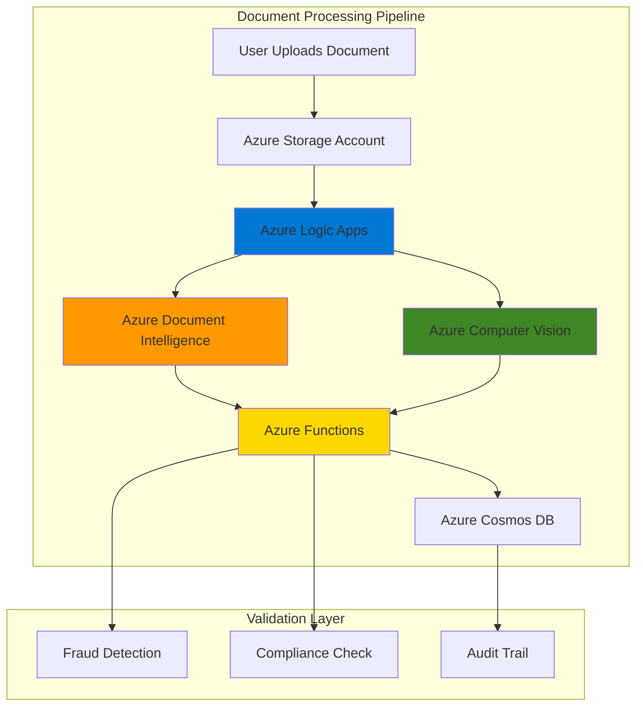

# Intelligent Document Verification Systems with Azure Document Intelligence and Azure Computer Vision

## Problem

Organizations across industries struggle with manual document verification processes that are prone to human error, time-consuming, and vulnerable to fraud. Financial institutions, healthcare providers, and government agencies need to process thousands of identity documents daily while ensuring authenticity and extracting accurate structured data. Traditional manual verification methods create bottlenecks, increase operational costs, and fail to detect sophisticated document fraud attempts, leading to compliance risks and potential financial losses.

## Solution

Azure Document Intelligence (formerly Form Recognizer) combined with Azure Computer Vision creates a powerful automated document verification system that extracts structured data from identity documents while validating their authenticity. This solution leverages pre-trained AI models to process various document types, while Azure Logic Apps orchestrates the workflow and Azure Functions provides custom validation logic for compliance and fraud detection scenarios.

## Architecture Diagram



## Prerequisites

1. Azure subscription with appropriate permissions to create AI services, Logic Apps, and Functions
2. Azure CLI v2 installed and configured (or Azure CloudShell)
3. Basic understanding of document processing, OCR, and REST APIs
4. Familiarity with Azure serverless architectures and JSON processing
5. Sample identity documents for testing (driver's licenses, passports, etc.)
6. Estimated cost: $25-50 per month for development workloads

> **Note**: Azure Document Intelligence pricing varies by document type and volume. Review the [pricing documentation](https://azure.microsoft.com/pricing/details/cognitive-services/form-recognizer/) for detailed cost estimates.

## Preparation

```bash
# Set environment variables for Azure resources
export RESOURCE_GROUP="rg-docverify-${RANDOM_SUFFIX}"
export LOCATION="eastus"
export SUBSCRIPTION_ID=$(az account show --query id --output tsv)

# Generate unique suffix for resource names
RANDOM_SUFFIX=$(openssl rand -hex 3)

# Create resource group
az group create \
    --name ${RESOURCE_GROUP} \
    --location ${LOCATION} \
    --tags purpose=docverify environment=demo

echo "✅ Resource group created: ${RESOURCE_GROUP}"

# Create storage account for document processing
STORAGE_ACCOUNT="stdocverify${RANDOM_SUFFIX}"
az storage account create \
    --name ${STORAGE_ACCOUNT} \
    --resource-group ${RESOURCE_GROUP} \
    --location ${LOCATION} \
    --sku Standard_LRS \
    --kind StorageV2

echo "✅ Storage account created: ${STORAGE_ACCOUNT}"

# Get storage account connection string
STORAGE_CONNECTION=$(az storage account show-connection-string \
    --name ${STORAGE_ACCOUNT} \
    --resource-group ${RESOURCE_GROUP} \
    --query connectionString --output tsv)

# Create containers for document processing
az storage container create \
    --name "incoming-docs" \
    --connection-string ${STORAGE_CONNECTION} \
    --public-access off

az storage container create \
    --name "processed-docs" \
    --connection-string ${STORAGE_CONNECTION} \
    --public-access off

echo "✅ Storage containers created for document processing"
```

## Steps

1. **Create Azure Document Intelligence Service**:

   Azure Document Intelligence provides pre-trained models specifically designed for identity document processing, including driver's licenses, passports, and ID cards. This service uses advanced machine learning to extract structured information with high accuracy while maintaining data privacy and security. The identity document model can process various document formats and automatically detects document types, making it ideal for automated verification workflows.

   ```bash
   # Create Document Intelligence service
   DOC_INTELLIGENCE_NAME="docintel-${RANDOM_SUFFIX}"
   az cognitiveservices account create \
       --name ${DOC_INTELLIGENCE_NAME} \
       --resource-group ${RESOURCE_GROUP} \
       --location ${LOCATION} \
       --kind FormRecognizer \
       --sku S0 \
       --custom-domain ${DOC_INTELLIGENCE_NAME}
   
   # Get the endpoint and key
   DOC_INTELLIGENCE_ENDPOINT=$(az cognitiveservices account show \
       --name ${DOC_INTELLIGENCE_NAME} \
       --resource-group ${RESOURCE_GROUP} \
       --query properties.endpoint --output tsv)
   
   DOC_INTELLIGENCE_KEY=$(az cognitiveservices account keys list \
       --name ${DOC_INTELLIGENCE_NAME} \
       --resource-group ${RESOURCE_GROUP} \
       --query key1 --output tsv)
   
   echo "✅ Document Intelligence service created with endpoint: ${DOC_INTELLIGENCE_ENDPOINT}"
   ```

   The Document Intelligence service is now ready to process identity documents with built-in models for driver's licenses, passports, and ID cards. This foundational AI service provides structured data extraction capabilities essential for automated verification workflows.

2. **Create Azure Computer Vision Service**:

   Azure Computer Vision complements Document Intelligence by providing advanced image analysis capabilities for document authenticity verification. This service can detect tampering, analyze image quality, verify security features, and perform optical character recognition for additional validation. The combination of both services creates a comprehensive document verification system.

   ```bash
   # Create Computer Vision service
   VISION_NAME="vision-${RANDOM_SUFFIX}"
   az cognitiveservices account create \
       --name ${VISION_NAME} \
       --resource-group ${RESOURCE_GROUP} \
       --location ${LOCATION} \
       --kind ComputerVision \
       --sku S1 \
       --custom-domain ${VISION_NAME}
   
   # Get the endpoint and key
   VISION_ENDPOINT=$(az cognitiveservices account show \
       --name ${VISION_NAME} \
       --resource-group ${RESOURCE_GROUP} \
       --query properties.endpoint --output tsv)
   
   VISION_KEY=$(az cognitiveservices account keys list \
       --name ${VISION_NAME} \
       --resource-group ${RESOURCE_GROUP} \
       --query key1 --output tsv)
   
   echo "✅ Computer Vision service created with endpoint: ${VISION_ENDPOINT}"
   ```

   The Computer Vision service now provides advanced image analysis capabilities for document authenticity verification. This service integrates seamlessly with Document Intelligence to create a robust fraud detection system.

3. **Create Azure Functions App for Processing Logic**:

   Azure Functions provides serverless compute for implementing custom business logic, validation rules, and integration workflows. This component orchestrates the document verification process, coordinates between AI services, and implements specific compliance requirements. The consumption plan ensures cost-effective scaling based on document processing volume.

   ```bash
   # Create Function App
   FUNCTION_APP_NAME="func-docverify-${RANDOM_SUFFIX}"
   az functionapp create \
       --name ${FUNCTION_APP_NAME} \
       --resource-group ${RESOURCE_GROUP} \
       --storage-account ${STORAGE_ACCOUNT} \
       --consumption-plan-location ${LOCATION} \
       --runtime python \
       --runtime-version 3.12 \
       --functions-version 4 \
       --disable-app-insights false
   
   # Configure application settings
   az functionapp config appsettings set \
       --name ${FUNCTION_APP_NAME} \
       --resource-group ${RESOURCE_GROUP} \
       --settings \
       "DOCUMENT_INTELLIGENCE_ENDPOINT=${DOC_INTELLIGENCE_ENDPOINT}" \
       "DOCUMENT_INTELLIGENCE_KEY=${DOC_INTELLIGENCE_KEY}" \
       "COMPUTER_VISION_ENDPOINT=${VISION_ENDPOINT}" \
       "COMPUTER_VISION_KEY=${VISION_KEY}" \
       "STORAGE_CONNECTION_STRING=${STORAGE_CONNECTION}"
   
   echo "✅ Function App created and configured: ${FUNCTION_APP_NAME}"
   ```

   The Function App is now configured with AI service endpoints and storage connections. This serverless environment provides the runtime for custom document processing logic and validation workflows.

4. **Create Cosmos DB for Audit Trail**:

   Azure Cosmos DB provides globally distributed, multi-model database capabilities for storing verification results, audit trails, and compliance data. This NoSQL database ensures high availability and scalability for storing document processing metadata while maintaining GDPR compliance and data sovereignty requirements.

   ```bash
   # Create Cosmos DB account
   COSMOS_ACCOUNT_NAME="cosmos-docverify-${RANDOM_SUFFIX}"
   az cosmosdb create \
       --name ${COSMOS_ACCOUNT_NAME} \
       --resource-group ${RESOURCE_GROUP} \
       --location ${LOCATION} \
       --kind GlobalDocumentDB \
       --enable-free-tier false \
       --default-consistency-level Session
   
   # Create database and container
   az cosmosdb sql database create \
       --account-name ${COSMOS_ACCOUNT_NAME} \
       --resource-group ${RESOURCE_GROUP} \
       --name "DocumentVerification"
   
   az cosmosdb sql container create \
       --account-name ${COSMOS_ACCOUNT_NAME} \
       --resource-group ${RESOURCE_GROUP} \
       --database-name "DocumentVerification" \
       --name "VerificationResults" \
       --partition-key-path "/documentId" \
       --throughput 400
   
   # Get connection string
   COSMOS_CONNECTION=$(az cosmosdb keys list \
       --name ${COSMOS_ACCOUNT_NAME} \
       --resource-group ${RESOURCE_GROUP} \
       --type connection-strings \
       --query "connectionStrings[0].connectionString" --output tsv)
   
   echo "✅ Cosmos DB created for audit trail storage"
   ```

   The Cosmos DB database is now ready to store verification results and audit trails. This provides a scalable, compliant data store for tracking document processing activities and maintaining regulatory compliance.

5. **Create Logic Apps Workflow**:

   Azure Logic Apps provides visual workflow orchestration for coordinating document processing steps, handling errors, and implementing business rules. This low-code solution enables rapid development of complex document verification workflows while maintaining enterprise-grade reliability and monitoring capabilities.

   ```bash
   # Create Logic App
   LOGIC_APP_NAME="logic-docverify-${RANDOM_SUFFIX}"
   az logic workflow create \
       --name ${LOGIC_APP_NAME} \
       --resource-group ${RESOURCE_GROUP} \
       --location ${LOCATION} \
       --definition '{
         "$schema": "https://schema.management.azure.com/schemas/2016-06-01/workflowdefinition.json#",
         "actions": {
           "Document_Intelligence_Analysis": {
             "type": "Http",
             "inputs": {
               "method": "POST",
               "uri": "'${DOC_INTELLIGENCE_ENDPOINT}'/formrecognizer/documentModels/prebuilt-idDocument:analyze?api-version=2024-11-30",
               "headers": {
                 "Ocp-Apim-Subscription-Key": "'${DOC_INTELLIGENCE_KEY}'"
               }
             }
           },
           "Computer_Vision_Analysis": {
             "type": "Http",
             "inputs": {
               "method": "POST",
               "uri": "'${VISION_ENDPOINT}'/computervision/imageanalysis:analyze?api-version=2024-02-01",
               "headers": {
                 "Ocp-Apim-Subscription-Key": "'${VISION_KEY}'"
               }
             }
           }
         },
         "triggers": {
           "When_a_blob_is_added_or_modified": {
             "type": "ApiConnection",
             "inputs": {
               "host": {
                 "connection": {
                   "name": "@parameters(\"$connections\")[\"azureblob\"][\"connectionId\"]"
                 }
               },
               "method": "get",
               "path": "/triggers/batch/onupdatedfile"
             }
           }
         },
         "contentVersion": "1.0.0.0",
         "outputs": {},
         "parameters": {
           "$connections": {
             "defaultValue": {},
             "type": "Object"
           }
         }
       }'
   
   echo "✅ Logic App workflow created: ${LOGIC_APP_NAME}"
   ```

   The Logic App workflow is now configured to trigger on document uploads and orchestrate the verification process through both AI services. This provides a visual, maintainable workflow for complex document processing scenarios.

6. **Deploy Document Processing Function**:

   This Azure Function implements the core document verification logic by coordinating calls to both AI services, applying business rules, and storing results. The function processes documents asynchronously, handles errors gracefully, and maintains detailed audit trails for compliance requirements.

   ```bash
   # Create function code directory
   mkdir -p /tmp/docverify-function
   cd /tmp/docverify-function
   
   # Create function configuration
   cat > host.json << 'EOF'
{
  "version": "2.0",
  "functionTimeout": "00:05:00",
  "extensions": {
    "http": {
      "routePrefix": "api"
    }
  }
}
EOF
   
   # Create requirements.txt
   cat > requirements.txt << 'EOF'
azure-functions
azure-ai-documentintelligence
azure-ai-vision-imageanalysis
azure-storage-blob
azure-cosmos
requests
EOF
   
   # Create the main function
   mkdir -p DocumentVerificationFunction
   cat > DocumentVerificationFunction/function.json << 'EOF'
{
  "scriptFile": "__init__.py",
  "bindings": [
    {
      "authLevel": "function",
      "type": "httpTrigger",
      "direction": "in",
      "name": "req",
      "methods": ["post"]
    },
    {
      "type": "http",
      "direction": "out",
      "name": "$return"
    }
  ]
}
EOF
   
   # Create the Python function code
   cat > DocumentVerificationFunction/__init__.py << 'EOF'
import azure.functions as func
import json
import logging
import os
from azure.ai.documentintelligence import DocumentIntelligenceClient
from azure.ai.vision.imageanalysis import ImageAnalysisClient
from azure.core.credentials import AzureKeyCredential
from azure.cosmos import CosmosClient
from datetime import datetime
import uuid

def main(req: func.HttpRequest) -> func.HttpResponse:
    try:
        # Parse request
        req_body = req.get_json()
        document_url = req_body.get('document_url')
        
        if not document_url:
            return func.HttpResponse(
                json.dumps({"error": "document_url is required"}),
                status_code=400,
                mimetype="application/json"
            )
        
        # Initialize clients
        doc_intel_client = DocumentIntelligenceClient(
            endpoint=os.environ["DOCUMENT_INTELLIGENCE_ENDPOINT"],
            credential=AzureKeyCredential(os.environ["DOCUMENT_INTELLIGENCE_KEY"])
        )
        
        vision_client = ImageAnalysisClient(
            endpoint=os.environ["COMPUTER_VISION_ENDPOINT"],
            credential=AzureKeyCredential(os.environ["COMPUTER_VISION_KEY"])
        )
        
        cosmos_client = CosmosClient.from_connection_string(
            os.environ["COSMOS_CONNECTION_STRING"]
        )
        
        # Document Intelligence analysis
        doc_intel_result = doc_intel_client.begin_analyze_document(
            "prebuilt-idDocument", 
            analyze_request={"urlSource": document_url}
        ).result()
        
        # Computer Vision analysis
        vision_result = vision_client.analyze_from_url(
            image_url=document_url,
            visual_features=["Tags", "Objects", "Caption", "Read"],
            smart_crops_aspect_ratios=[0.9, 1.33]
        )
        
        # Process results
        verification_result = {
            "document_id": str(uuid.uuid4()),
            "timestamp": datetime.utcnow().isoformat(),
            "document_url": document_url,
            "document_intelligence": {
                "fields": extract_document_fields(doc_intel_result),
                "confidence": calculate_confidence(doc_intel_result)
            },
            "computer_vision": {
                "caption": vision_result.caption.text if vision_result.caption else "",
                "tags": [tag.name for tag in vision_result.tags.list],
                "quality_score": assess_image_quality(vision_result)
            },
            "verification_status": determine_verification_status(doc_intel_result, vision_result),
            "fraud_indicators": detect_fraud_indicators(doc_intel_result, vision_result)
        }
        
        # Store in Cosmos DB
        database = cosmos_client.get_database_client("DocumentVerification")
        container = database.get_container_client("VerificationResults")
        container.create_item(verification_result)
        
        return func.HttpResponse(
            json.dumps(verification_result),
            status_code=200,
            mimetype="application/json"
        )
        
    except Exception as e:
        logging.error(f"Error processing document: {str(e)}")
        return func.HttpResponse(
            json.dumps({"error": str(e)}),
            status_code=500,
            mimetype="application/json"
        )

def extract_document_fields(result):
    """Extract structured fields from Document Intelligence result"""
    fields = {}
    if result.documents:
        for doc in result.documents:
            for field_name, field_value in doc.fields.items():
                fields[field_name] = {
                    "value": field_value.value,
                    "confidence": field_value.confidence
                }
    return fields

def calculate_confidence(result):
    """Calculate overall confidence score"""
    confidences = []
    if result.documents:
        for doc in result.documents:
            for field_value in doc.fields.values():
                if field_value.confidence:
                    confidences.append(field_value.confidence)
    return sum(confidences) / len(confidences) if confidences else 0

def assess_image_quality(vision_result):
    """Assess image quality based on Computer Vision analysis"""
    quality_score = 0.5  # Default
    
    # Check caption confidence
    if vision_result.caption and vision_result.caption.confidence:
        quality_score += min(vision_result.caption.confidence, 0.3)
    
    # Check tag confidence
    if vision_result.tags and vision_result.tags.list:
        avg_tag_confidence = sum(tag.confidence for tag in vision_result.tags.list[:5]) / min(5, len(vision_result.tags.list))
        quality_score += min(avg_tag_confidence, 0.2)
    
    return min(quality_score, 1.0)

def determine_verification_status(doc_intel_result, vision_result):
    """Determine overall verification status"""
    doc_confidence = calculate_confidence(doc_intel_result)
    vision_quality = assess_image_quality(vision_result)
    
    if doc_confidence > 0.8 and vision_quality > 0.7:
        return "VERIFIED"
    elif doc_confidence > 0.6 and vision_quality > 0.5:
        return "NEEDS_REVIEW"
    else:
        return "REJECTED"

def detect_fraud_indicators(doc_intel_result, vision_result):
    """Detect potential fraud indicators"""
    indicators = []
    
    # Check confidence levels
    if calculate_confidence(doc_intel_result) < 0.5:
        indicators.append("LOW_CONFIDENCE_EXTRACTION")
    
    # Check image quality
    if assess_image_quality(vision_result) < 0.4:
        indicators.append("POOR_IMAGE_QUALITY")
    
    # Additional fraud detection logic can be added here
    
    return indicators
EOF
   
   # Deploy function (requires Azure Functions Core Tools)
   echo "✅ Function code prepared. Deploy with: func azure functionapp publish ${FUNCTION_APP_NAME}"
   ```

   The Azure Function is now prepared with comprehensive document verification logic. This serverless function coordinates AI services, applies business rules, and maintains audit trails for compliance requirements.

7. **Configure API Management for Security**:

   Azure API Management provides enterprise-grade security, throttling, and monitoring for the document verification API. This service ensures secure access control, rate limiting, and comprehensive logging for production deployments while maintaining high availability and performance.

   ```bash
   # Create API Management service
   APIM_NAME="apim-docverify-${RANDOM_SUFFIX}"
   az apim create \
       --name ${APIM_NAME} \
       --resource-group ${RESOURCE_GROUP} \
       --location ${LOCATION} \
       --publisher-name "Document Verification System" \
       --publisher-email "admin@company.com" \
       --sku-name Developer \
       --sku-capacity 1
   
   # Get Function App URL
   FUNCTION_URL=$(az functionapp show \
       --name ${FUNCTION_APP_NAME} \
       --resource-group ${RESOURCE_GROUP} \
       --query defaultHostName --output tsv)
   
   echo "✅ API Management service created: ${APIM_NAME}"
   echo "Function URL: https://${FUNCTION_URL}"
   ```

   The API Management service provides secure, monitored access to the document verification API. This enterprise-grade gateway ensures proper authentication, rate limiting, and comprehensive logging for production environments.

## Validation & Testing

1. **Verify AI Services are Operational**:

   ```bash
   # Test Document Intelligence service
   az cognitiveservices account show \
       --name ${DOC_INTELLIGENCE_NAME} \
       --resource-group ${RESOURCE_GROUP} \
       --query "provisioningState" --output tsv
   
   # Test Computer Vision service
   az cognitiveservices account show \
       --name ${VISION_NAME} \
       --resource-group ${RESOURCE_GROUP} \
       --query "provisioningState" --output tsv
   ```

   Expected output: `Succeeded` for both services.

2. **Test Document Processing Function**:

   ```bash
   # Get Function App URL and key
   FUNCTION_URL=$(az functionapp show \
       --name ${FUNCTION_APP_NAME} \
       --resource-group ${RESOURCE_GROUP} \
       --query defaultHostName --output tsv)
   
   FUNCTION_KEY=$(az functionapp keys list \
       --name ${FUNCTION_APP_NAME} \
       --resource-group ${RESOURCE_GROUP} \
       --query functionKeys.default --output tsv)
   
   # Test with sample document URL
   curl -X POST "https://${FUNCTION_URL}/api/DocumentVerificationFunction" \
       -H "Content-Type: application/json" \
       -H "x-functions-key: ${FUNCTION_KEY}" \
       -d '{
         "document_url": "https://example.com/sample-id-document.jpg"
       }'
   ```

   Expected output: JSON response with verification results and status.

3. **Verify Cosmos DB Storage**:

   ```bash
   # Check Cosmos DB container
   az cosmosdb sql container show \
       --account-name ${COSMOS_ACCOUNT_NAME} \
       --resource-group ${RESOURCE_GROUP} \
       --database-name "DocumentVerification" \
       --name "VerificationResults" \
       --query "provisioningState" --output tsv
   ```

   Expected output: `Succeeded` indicating the container is ready for data storage.

## Cleanup

1. **Remove API Management Service**:

   ```bash
   # Delete API Management service
   az apim delete \
       --name ${APIM_NAME} \
       --resource-group ${RESOURCE_GROUP} \
       --yes
   
   echo "✅ API Management service deleted"
   ```

2. **Remove Function App and Dependencies**:

   ```bash
   # Delete Function App
   az functionapp delete \
       --name ${FUNCTION_APP_NAME} \
       --resource-group ${RESOURCE_GROUP}
   
   echo "✅ Function App deleted"
   ```

3. **Remove Cosmos DB Account**:

   ```bash
   # Delete Cosmos DB account
   az cosmosdb delete \
       --name ${COSMOS_ACCOUNT_NAME} \
       --resource-group ${RESOURCE_GROUP} \
       --yes
   
   echo "✅ Cosmos DB account deleted"
   ```

4. **Remove AI Services**:

   ```bash
   # Delete Document Intelligence service
   az cognitiveservices account delete \
       --name ${DOC_INTELLIGENCE_NAME} \
       --resource-group ${RESOURCE_GROUP}
   
   # Delete Computer Vision service
   az cognitiveservices account delete \
       --name ${VISION_NAME} \
       --resource-group ${RESOURCE_GROUP}
   
   echo "✅ AI services deleted"
   ```

5. **Remove Storage Account and Resource Group**:

   ```bash
   # Delete storage account
   az storage account delete \
       --name ${STORAGE_ACCOUNT} \
       --resource-group ${RESOURCE_GROUP} \
       --yes
   
   # Delete resource group and all remaining resources
   az group delete \
       --name ${RESOURCE_GROUP} \
       --yes \
       --no-wait
   
   echo "✅ Resource group deletion initiated: ${RESOURCE_GROUP}"
   echo "Note: Complete deletion may take several minutes"
   ```

## Discussion

Azure Document Intelligence and Computer Vision form a powerful combination for automated document verification systems that can significantly reduce manual processing time while improving accuracy and security. This architecture leverages Azure's AI capabilities to extract structured data from identity documents and validate their authenticity through advanced image analysis. The serverless design ensures cost-effective scaling while maintaining enterprise-grade security and compliance standards following the [Azure Well-Architected Framework](https://docs.microsoft.com/en-us/azure/architecture/framework/) principles. For comprehensive guidance on AI-powered document processing, see the [Azure Document Intelligence documentation](https://learn.microsoft.com/en-us/azure/ai-services/document-intelligence/) and [Computer Vision best practices](https://learn.microsoft.com/en-us/azure/ai-services/computer-vision/overview).

The integration of Logic Apps provides visual workflow orchestration that enables business users to modify verification rules without coding, while Azure Functions handles complex business logic and custom validation requirements. This hybrid approach supports various Azure security features including Azure AD integration, Azure Key Vault for secrets management, and comprehensive audit logging through Azure Monitor. The solution's modular design allows for easy extension to support additional document types, verification rules, and integration with existing enterprise systems.

From a compliance perspective, this architecture supports various regulatory requirements including GDPR, HIPAA, and financial services regulations through built-in encryption, audit trails, and data residency controls. Azure Cosmos DB provides global distribution capabilities while maintaining consistency and compliance with data protection regulations. The comprehensive logging and monitoring capabilities enable organizations to maintain detailed audit trails for regulatory reporting and fraud investigation. For detailed compliance information, review the [Azure compliance documentation](https://learn.microsoft.com/en-us/azure/compliance/) and [Azure security documentation](https://learn.microsoft.com/en-us/azure/security/).

> **Tip**: Use Azure Monitor and Application Insights to track document processing metrics, identify bottlenecks, and optimize performance. The [monitoring documentation](https://learn.microsoft.com/en-us/azure/azure-monitor/overview) provides comprehensive guidance on setting up alerts and dashboards for production workloads.

## Challenge

Extend this document verification system with these advanced capabilities:

1. **Multi-language Support**: Implement document processing for international identity documents using Azure Translator and custom OCR models for specific countries and languages.

2. **Real-time Fraud Detection**: Integrate Azure Stream Analytics to detect patterns across multiple document submissions and implement machine learning models for advanced fraud detection.

3. **Blockchain Verification**: Add Azure Blockchain Service integration to create immutable audit trails and enable cross-organizational document verification workflows.

4. **Mobile Integration**: Develop a mobile application using Azure App Service and Azure SignalR for real-time document capture and verification status updates.

5. **Advanced Analytics**: Implement Azure Synapse Analytics to analyze document processing patterns, identify optimization opportunities, and generate compliance reports for regulatory requirements.

## Infrastructure Code

### Available Infrastructure as Code:

- [Infrastructure Code Overview](code/README.md) - Detailed description of all infrastructure components
- [Bicep](code/bicep/) - Azure Bicep templates
- [Bash CLI Scripts](code/scripts/) - Example bash scripts using Azure CLI commands to deploy infrastructure
- [Terraform](code/terraform/) - Terraform configuration files