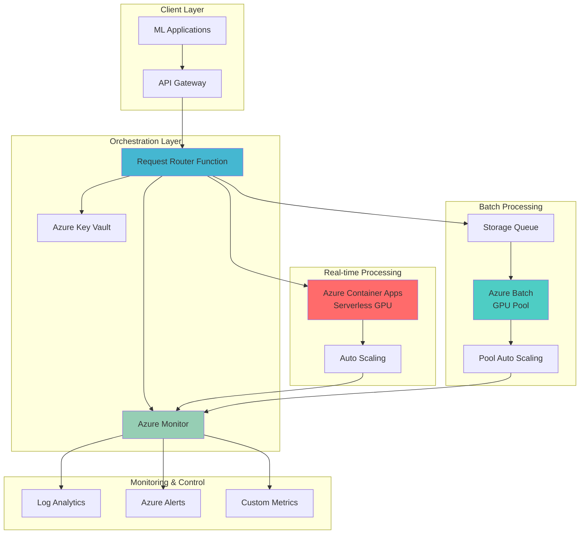

# Intelligent GPU Resource Orchestration with Container Apps and Azure Batch

## Problem

Modern machine learning operations require flexible GPU resource allocation that can adapt to varying workload patterns and cost constraints. Organizations struggle with the trade-off between real-time inference requirements that need immediate GPU availability and batch processing workloads that can tolerate longer startup times but require cost optimization. Static GPU provisioning leads to over-provisioning costs during low-demand periods and under-provisioning bottlenecks during peak demand, while manual scaling is too slow for dynamic ML inference workloads.

## Solution

This solution creates an intelligent GPU orchestration system that automatically routes ML inference tasks between Azure Container Apps serverless GPUs for real-time workloads and Azure Batch GPU pools for cost-optimized batch processing. The system uses Azure Monitor metrics and custom scaling logic to determine optimal resource allocation based on queue depth, response time requirements, and cost thresholds, ensuring both performance and cost efficiency.

## Architecture Diagram



## Prerequisites

1. Azure subscription with appropriate permissions for Container Apps, Batch, Monitor, and Key Vault
2. Azure CLI v2.57.0+ installed and configured (or Azure Cloud Shell)
3. Basic understanding of containerization, GPU computing, and machine learning inference
4. Docker knowledge for creating container images
5. Estimated cost: $50-200/day depending on GPU usage (T4: ~$0.526/hour, A100: ~$3.06/hour)

> **Note**: GPU quota approval is required for both Azure Container Apps serverless GPUs and Azure Batch GPU VMs. Submit quota requests through Azure Support before starting this recipe.

## Preparation

```bash
# Set environment variables for Azure resources
export RESOURCE_GROUP="rg-gpu-orchestration-${RANDOM_SUFFIX}"
export LOCATION="westus3"
export SUBSCRIPTION_ID=$(az account show --query id --output tsv)

# Generate unique suffix for resource names
RANDOM_SUFFIX=$(openssl rand -hex 3)

# Set resource names
export ACA_ENVIRONMENT="aca-env-${RANDOM_SUFFIX}"
export ACA_APP="ml-inference-app"
export BATCH_ACCOUNT="batch${RANDOM_SUFFIX}"
export BATCH_POOL="gpu-pool"
export KEY_VAULT="kv-gpu-${RANDOM_SUFFIX}"
export STORAGE_ACCOUNT="storage${RANDOM_SUFFIX}"
export LOG_WORKSPACE="logs-gpu-${RANDOM_SUFFIX}"
export FUNCTION_APP="router-func-${RANDOM_SUFFIX}"

# Create resource group
az group create \
    --name ${RESOURCE_GROUP} \
    --location ${LOCATION} \
    --tags purpose=gpu-orchestration environment=demo

echo "✅ Resource group created: ${RESOURCE_GROUP}"

# Create Log Analytics workspace for monitoring
az monitor log-analytics workspace create \
    --resource-group ${RESOURCE_GROUP} \
    --workspace-name ${LOG_WORKSPACE} \
    --location ${LOCATION}

export WORKSPACE_ID=$(az monitor log-analytics workspace show \
    --resource-group ${RESOURCE_GROUP} \
    --workspace-name ${LOG_WORKSPACE} \
    --query customerId --output tsv)

echo "✅ Log Analytics workspace created: ${LOG_WORKSPACE}"

# Create storage account for queues and function app
az storage account create \
    --name ${STORAGE_ACCOUNT} \
    --resource-group ${RESOURCE_GROUP} \
    --location ${LOCATION} \
    --sku Standard_LRS \
    --kind StorageV2

export STORAGE_CONNECTION_STRING=$(az storage account show-connection-string \
    --name ${STORAGE_ACCOUNT} \
    --resource-group ${RESOURCE_GROUP} \
    --query connectionString --output tsv)

echo "✅ Storage account created: ${STORAGE_ACCOUNT}"
```

## Steps

1. **Create Azure Key Vault for Secure Configuration Management**:

   Azure Key Vault provides centralized, secure storage for sensitive configuration data including API keys, connection strings, and model parameters. This managed service eliminates hardcoded secrets in application code and enables dynamic configuration updates without application restarts, which is essential for ML model management and scaling parameters.

   ```bash
   # Create Key Vault
   az keyvault create \
       --name ${KEY_VAULT} \
       --resource-group ${RESOURCE_GROUP} \
       --location ${LOCATION} \
       --sku standard \
       --enable-rbac-authorization true
   
   # Get current user's object ID for RBAC assignment
   USER_OBJECT_ID=$(az ad signed-in-user show --query id --output tsv)
   
   # Assign Key Vault Secrets Officer role
   az role assignment create \
       --role "Key Vault Secrets Officer" \
       --assignee ${USER_OBJECT_ID} \
       --scope $(az keyvault show --name ${KEY_VAULT} \
           --resource-group ${RESOURCE_GROUP} --query id --output tsv)
   
   echo "✅ Key Vault created with RBAC authentication: ${KEY_VAULT}"
   ```

   The Key Vault now securely stores configuration parameters and provides managed identity access for our applications. This foundation enables secure, dynamic configuration management for GPU resource allocation thresholds and ML model parameters.

2. **Create Azure Batch Account and GPU Pool**:

   Azure Batch provides managed pools of virtual machines for large-scale parallel and batch computing workloads. GPU-enabled pools offer cost-effective processing for ML training and batch inference tasks that can tolerate longer startup times but require sustained compute power. Batch handles VM provisioning, scaling, and job scheduling automatically.

   ```bash
   # Create Batch account
   az batch account create \
       --name ${BATCH_ACCOUNT} \
       --resource-group ${RESOURCE_GROUP} \
       --location ${LOCATION} \
       --storage-account ${STORAGE_ACCOUNT}
   
   # Set Batch account for subsequent commands
   az batch account set \
       --name ${BATCH_ACCOUNT} \
       --resource-group ${RESOURCE_GROUP}
   
   # Create GPU pool configuration
   cat > batch-pool-config.json << EOF
   {
       "id": "${BATCH_POOL}",
       "displayName": "GPU Processing Pool",
       "vmSize": "Standard_NC6s_v3",
       "virtualMachineConfiguration": {
           "imageReference": {
               "publisher": "microsoft-azure-batch",
               "offer": "ubuntu-server-container",
               "sku": "20-04-lts",
               "version": "latest"
           },
           "nodeAgentSkuId": "batch.node.ubuntu 20.04"
       },
       "targetDedicatedNodes": 0,
       "targetLowPriorityNodes": 2,
       "enableAutoScale": true,
       "autoScaleFormula": "\\$TargetDedicatedNodes = min(\\$PendingTasks.GetSample(180 * TimeInterval_Second, 70 * TimeInterval_Second), 4);",
       "autoScaleEvaluationInterval": "PT5M",
       "enableInterNodeCommunication": false,
       "taskSlotsPerNode": 1,
       "applicationPackageReferences": [],
       "startTask": {
           "commandLine": "apt-get update && apt-get install -y python3-pip && pip3 install azure-storage-queue torch torchvision",
           "userIdentity": {
               "autoUser": {
                   "scope": "pool",
                   "elevationLevel": "admin"
               }
           },
           "waitForSuccess": true
       }
   }
   EOF
   
   # Create the GPU pool
   az batch pool create --json-file batch-pool-config.json
   
   echo "✅ Batch GPU pool created with auto-scaling: ${BATCH_POOL}"
   ```

   The Batch pool now provides cost-optimized GPU compute with automatic scaling based on pending tasks. Low-priority VMs reduce costs by up to 80% compared to dedicated instances, making this ideal for non-time-critical batch ML workloads.

3. **Create Azure Container Apps Environment with GPU Support**:

   Azure Container Apps environments provide the hosting platform for serverless container workloads with built-in scaling, service discovery, and observability. The Consumption workload profile with GPU support enables on-demand access to NVIDIA T4 and A100 GPUs with per-second billing and automatic scale-to-zero functionality.

   ```bash
   # Create Container Apps environment with monitoring
   az containerapp env create \
       --name ${ACA_ENVIRONMENT} \
       --resource-group ${RESOURCE_GROUP} \
       --location ${LOCATION} \
       --logs-workspace-id ${WORKSPACE_ID} \
       --logs-workspace-key $(az monitor log-analytics workspace get-shared-keys \
           --resource-group ${RESOURCE_GROUP} \
           --workspace-name ${LOG_WORKSPACE} \
           --query primarySharedKey --output tsv)
   
   # Verify GPU workload profile availability
   az containerapp env workload-profile list-supported \
       --location ${LOCATION} \
       --query "[?contains(category, 'GPU')]" \
       --output table
   
   echo "✅ Container Apps environment created: ${ACA_ENVIRONMENT}"
   ```

   The Container Apps environment is now configured with Log Analytics integration for comprehensive monitoring. GPU workload profiles enable serverless GPU computing with automatic scaling and pay-per-second billing for real-time ML inference workloads.

4. **Add GPU Workload Profile and Deploy ML Inference Container App**:

   The Container App provides serverless GPU-accelerated ML inference with automatic scaling based on HTTP requests. This configuration uses NVIDIA T4 GPUs for cost-effective real-time inference while maintaining sub-second response times for interactive applications.

   ```bash
   # Add GPU workload profile to environment 
   az containerapp env workload-profile add \
       --name ${ACA_ENVIRONMENT} \
       --resource-group ${RESOURCE_GROUP} \
       --workload-profile-name "gpu-t4-profile" \
       --workload-profile-type "Consumption-GPU-NC8as-T4"
   
   # Create the ML inference container app with GPU
   az containerapp create \
       --name ${ACA_APP} \
       --resource-group ${RESOURCE_GROUP} \
       --environment ${ACA_ENVIRONMENT} \
       --image "mcr.microsoft.com/k8se/gpu-quickstart:latest" \
       --target-port 80 \
       --ingress external \
       --cpu 4.0 \
       --memory 8Gi \
       --workload-profile-name "gpu-t4-profile" \
       --min-replicas 0 \
       --max-replicas 10 \
       --env-vars "MODEL_PATH=/models" "GPU_ENABLED=true"
   
   # Get the Container App URL
   export ACA_URL=$(az containerapp show \
       --name ${ACA_APP} \
       --resource-group ${RESOURCE_GROUP} \
       --query properties.configuration.ingress.fqdn \
       --output tsv)
   
   echo "✅ ML inference Container App deployed: https://${ACA_URL}"
   ```

   The Container App now provides serverless GPU-accelerated inference with automatic scaling from zero to multiple replicas based on demand. This configuration optimizes for real-time response requirements while minimizing costs during idle periods.

5. **Create Storage Queue for Batch Job Management**:

   Azure Storage Queues provide reliable, persistent messaging for asynchronous batch job coordination. The queue decouples request submission from processing, enabling the orchestration function to route non-urgent workloads to cost-optimized Batch processing while maintaining delivery guarantees.

   ```bash
   # Create storage queue for batch jobs
   az storage queue create \
       --name "batch-inference-queue" \
       --connection-string "${STORAGE_CONNECTION_STRING}"
   
   # Create dead letter queue for failed jobs
   az storage queue create \
       --name "batch-inference-dlq" \
       --connection-string "${STORAGE_CONNECTION_STRING}"
   
   # Store connection string in Key Vault
   az keyvault secret set \
       --vault-name ${KEY_VAULT} \
       --name "storage-connection-string" \
       --value "${STORAGE_CONNECTION_STRING}"
   
   echo "✅ Storage queues created for batch job management"
   ```

   The storage infrastructure now provides reliable message queuing for batch workloads with dead letter queue support for error handling. This enables asynchronous processing and improves system resilience for ML batch inference tasks.

6. **Deploy Request Router Function App**:

   The Azure Function App implements intelligent request routing logic that analyzes workload characteristics, current system load, and cost constraints to determine optimal GPU resource allocation. This serverless orchestrator ensures efficient resource utilization while meeting performance requirements.

   ```bash
   # Create Function App with managed identity
   az functionapp create \
       --name ${FUNCTION_APP} \
       --resource-group ${RESOURCE_GROUP} \
       --storage-account ${STORAGE_ACCOUNT} \
       --consumption-plan-location ${LOCATION} \
       --runtime python \
       --runtime-version 3.11 \
       --functions-version 4 \
       --assign-identity [system]
   
   # Get Function App managed identity
   FUNCTION_IDENTITY=$(az functionapp identity show \
       --name ${FUNCTION_APP} \
       --resource-group ${RESOURCE_GROUP} \
       --query principalId --output tsv)
   
   # Grant Key Vault access to Function App
   az role assignment create \
       --role "Key Vault Secrets User" \
       --assignee ${FUNCTION_IDENTITY} \
       --scope $(az keyvault show --name ${KEY_VAULT} \
           --resource-group ${RESOURCE_GROUP} --query id --output tsv)
   
   # Configure Function App settings
   az functionapp config appsettings set \
       --name ${FUNCTION_APP} \
       --resource-group ${RESOURCE_GROUP} \
       --settings \
           "KEY_VAULT_URL=https://${KEY_VAULT}.vault.azure.net/" \
           "ACA_ENDPOINT=https://${ACA_URL}" \
           "BATCH_ACCOUNT_NAME=${BATCH_ACCOUNT}" \
           "BATCH_POOL_ID=${BATCH_POOL}" \
           "STORAGE_QUEUE_NAME=batch-inference-queue" \
           "LOG_ANALYTICS_WORKSPACE_ID=${WORKSPACE_ID}"
   
   echo "✅ Router Function App deployed: ${FUNCTION_APP}"
   ```

   The Function App orchestrator now has secure access to all system components through managed identity and can intelligently route ML inference requests based on workload characteristics and system metrics.

7. **Configure Azure Monitor Metrics and Alerts**:

   Azure Monitor provides comprehensive observability for GPU resource utilization, application performance, and cost metrics. Custom metrics and alerts enable proactive scaling decisions and cost optimization by monitoring queue depth, response times, and GPU utilization across both Container Apps and Batch pools.

   ```bash
   # Create alert for Container Apps request volume
   az monitor metrics alert create \
       --name "HighGPURequestVolume" \
       --resource-group ${RESOURCE_GROUP} \
       --scopes $(az containerapp show --name ${ACA_APP} \
           --resource-group ${RESOURCE_GROUP} --query id --output tsv) \
       --condition "avg Requests > 50" \
       --description "High GPU request volume detected" \
       --evaluation-frequency 1m \
       --window-size 5m \
       --severity 2
   
   # Create alert for storage queue depth
   az monitor metrics alert create \
       --name "HighBatchQueueDepth" \
       --resource-group ${RESOURCE_GROUP} \
       --scopes $(az storage account show --name ${STORAGE_ACCOUNT} \
           --resource-group ${RESOURCE_GROUP} --query id --output tsv) \
       --condition "avg ApproximateMessageCount > 100" \
       --description "High batch queue depth detected" \
       --evaluation-frequency 1m \
       --window-size 5m \
       --severity 3
   
   # Create resource group level cost alert
   az monitor metrics alert create \
       --name "HighResourceGroupCost" \
       --resource-group ${RESOURCE_GROUP} \
       --scopes "/subscriptions/${SUBSCRIPTION_ID}/resourceGroups/${RESOURCE_GROUP}" \
       --condition "total cost > 100" \
       --description "Resource group costs exceeding threshold" \
       --evaluation-frequency 1h \
       --window-size 6h \
       --severity 1
   
   echo "✅ Monitoring alerts configured for GPU optimization"
   ```

   The monitoring system now provides real-time visibility into GPU utilization, queue depths, and costs, enabling data-driven scaling decisions and proactive cost management for the ML infrastructure.

8. **Store Configuration Parameters in Key Vault**:

   Configuration parameters stored in Key Vault enable dynamic tuning of the orchestration logic without application redeployment. These parameters control routing decisions, scaling thresholds, and cost optimization settings, allowing operators to adapt the system to changing workload patterns and business requirements.

   ```bash
   # Store routing configuration parameters
   az keyvault secret set \
       --vault-name ${KEY_VAULT} \
       --name "realtime-threshold-ms" \
       --value "2000"
   
   az keyvault secret set \
       --vault-name ${KEY_VAULT} \
       --name "batch-cost-threshold" \
       --value "0.50"
   
   az keyvault secret set \
       --vault-name ${KEY_VAULT} \
       --name "max-aca-replicas" \
       --value "10"
   
   az keyvault secret set \
       --vault-name ${KEY_VAULT} \
       --name "max-batch-nodes" \
       --value "4"
   
   # Store ML model configuration
   az keyvault secret set \
       --vault-name ${KEY_VAULT} \
       --name "model-version" \
       --value "v1.0"
   
   az keyvault secret set \
       --vault-name ${KEY_VAULT} \
       --name "gpu-memory-limit" \
       --value "16384"
   
   echo "✅ Configuration parameters stored in Key Vault"
   ```

   The configuration management system now enables dynamic parameter tuning for optimal GPU resource allocation, cost control, and performance optimization without requiring application updates or restarts.

## Validation & Testing

1. **Verify Azure Container Apps GPU Configuration**:

   ```bash
   # Check Container App status and GPU configuration
   az containerapp show \
       --name ${ACA_APP} \
       --resource-group ${RESOURCE_GROUP} \
       --query "{name:name, state:properties.provisioningState, fqdn:properties.configuration.ingress.fqdn, replicas:properties.template.scale}" \
       --output table
   
   # Test Container App endpoint
   curl -X GET "https://${ACA_URL}/" \
       -H "Content-Type: application/json"
   ```

   Expected output: HTTP 200 response with Container App serving requests successfully.

2. **Validate Azure Batch GPU Pool Status**:

   ```bash
   # Check Batch pool status
   az batch pool show \
       --pool-id ${BATCH_POOL} \
       --query "{id:id, state:state, vmSize:vmSize, currentDedicatedNodes:currentDedicatedNodes, currentLowPriorityNodes:currentLowPriorityNodes}" \
       --output table
   
   # Verify auto-scaling configuration
   az batch pool show \
       --pool-id ${BATCH_POOL} \
       --query "autoScaleFormula"
   ```

   Expected output: Pool in "active" state with auto-scaling enabled and appropriate VM size configuration.

3. **Test Storage Queue and Key Vault Integration**:

   ```bash
   # Test queue operations
   az storage message put \
       --queue-name "batch-inference-queue" \
       --content "test-message" \
       --connection-string "${STORAGE_CONNECTION_STRING}"
   
   # Verify message was queued
   az storage message peek \
       --queue-name "batch-inference-queue" \
       --connection-string "${STORAGE_CONNECTION_STRING}"
   
   # Test Key Vault access
   az keyvault secret show \
       --vault-name ${KEY_VAULT} \
       --name "realtime-threshold-ms" \
       --query value
   ```

   Expected output: Successful queue operations and Key Vault secret retrieval.

4. **Verify Monitoring and Alerting Configuration**:

   ```bash
   # Check alert rules
   az monitor metrics alert list \
       --resource-group ${RESOURCE_GROUP} \
       --query "[].{name:name, enabled:enabled, severity:severity}" \
       --output table
   
   # Verify Log Analytics integration
   az monitor log-analytics workspace show \
       --resource-group ${RESOURCE_GROUP} \
       --workspace-name ${LOG_WORKSPACE} \
       --query "{name:name, customerId:customerId, provisioningState:provisioningState}"
   ```

   Expected output: All alert rules enabled and Log Analytics workspace in "Succeeded" state.

## Cleanup

1. **Remove Container Apps and Environment**:

   ```bash
   # Delete Container App
   az containerapp delete \
       --name ${ACA_APP} \
       --resource-group ${RESOURCE_GROUP} \
       --yes
   
   # Delete Container Apps environment
   az containerapp env delete \
       --name ${ACA_ENVIRONMENT} \
       --resource-group ${RESOURCE_GROUP} \
       --yes
   
   echo "✅ Container Apps resources deleted"
   ```

2. **Remove Azure Batch Resources**:

   ```bash
   # Delete Batch pool
   az batch pool delete \
       --pool-id ${BATCH_POOL} \
       --yes
   
   # Delete Batch account
   az batch account delete \
       --name ${BATCH_ACCOUNT} \
       --resource-group ${RESOURCE_GROUP} \
       --yes
   
   echo "✅ Batch resources deleted"
   ```

3. **Remove Supporting Services**:

   ```bash
   # Delete Function App
   az functionapp delete \
       --name ${FUNCTION_APP} \
       --resource-group ${RESOURCE_GROUP}
   
   # Delete Storage Account
   az storage account delete \
       --name ${STORAGE_ACCOUNT} \
       --resource-group ${RESOURCE_GROUP} \
       --yes
   
   # Delete Key Vault (soft delete enabled)
   az keyvault delete \
       --name ${KEY_VAULT} \
       --resource-group ${RESOURCE_GROUP}
   
   # Purge Key Vault to prevent name conflicts
   az keyvault purge \
       --name ${KEY_VAULT} \
       --no-wait
   
   echo "✅ Supporting services deleted"
   ```

4. **Remove Monitoring and Resource Group**:

   ```bash
   # Delete Log Analytics workspace
   az monitor log-analytics workspace delete \
       --resource-group ${RESOURCE_GROUP} \
       --workspace-name ${LOG_WORKSPACE} \
       --force true
   
   # Delete resource group and all remaining resources
   az group delete \
       --name ${RESOURCE_GROUP} \
       --yes \
       --no-wait
   
   echo "✅ Resource group deletion initiated: ${RESOURCE_GROUP}"
   echo "Note: Complete cleanup may take several minutes"
   
   # Verify cleanup (optional)
   az group exists --name ${RESOURCE_GROUP}
   ```

## Discussion

This GPU orchestration solution demonstrates the power of Azure's serverless and managed services for dynamic ML workload management. Azure Container Apps serverless GPUs provide the perfect balance between traditional serverless APIs and dedicated GPU compute, offering sub-second scaling with full data governance that keeps sensitive ML models within your control. The integration with Azure Batch creates a comprehensive GPU compute continuum that automatically optimizes for both performance and cost based on workload characteristics. For detailed guidance on serverless GPU configuration, see the [Azure Container Apps GPU documentation](https://learn.microsoft.com/en-us/azure/container-apps/gpu-serverless-overview) and [Azure Batch GPU capabilities](https://learn.microsoft.com/en-us/azure/batch/batch-pool-compute-intensive-sizes).

The intelligent routing logic implemented in Azure Functions enables sophisticated decision-making based on multiple factors including response time requirements, current system load, and cost thresholds. This approach follows [Azure Well-Architected Framework](https://learn.microsoft.com/en-us/azure/well-architected/) principles of cost optimization and performance efficiency by ensuring resources are allocated optimally based on actual business requirements rather than static provisioning. The solution leverages Azure's native scaling capabilities, including Container Apps auto-scaling and Batch pool auto-scaling, to create a truly elastic GPU compute platform.

From a cost optimization perspective, the combination of serverless GPUs for real-time workloads and low-priority Batch VMs for batch processing can achieve significant cost savings compared to always-on dedicated GPU infrastructure. Azure Container Apps charges only for actual GPU usage with per-second billing, while Batch low-priority VMs provide up to 80% cost savings for workloads that can tolerate interruptions. For comprehensive cost management strategies, review the [Azure cost optimization best practices](https://learn.microsoft.com/en-us/azure/cost-management-billing/costs/cost-optimization) and [GPU cost optimization guide](https://learn.microsoft.com/en-us/azure/machine-learning/how-to-manage-optimize-cost).

The monitoring and alerting configuration provides essential observability for production ML workloads, enabling operators to track GPU utilization, queue depths, and costs in real-time. Azure Monitor's integration with both Container Apps and Batch provides unified monitoring across the entire GPU compute stack, while custom metrics enable business-specific optimization decisions based on actual usage patterns and cost constraints.

> **Tip**: Use Azure Advisor and Cost Management tools to continuously optimize GPU resource allocation based on historical usage patterns. The [Azure Advisor recommendations](https://learn.microsoft.com/en-us/azure/advisor/) can identify underutilized resources and suggest right-sizing opportunities for both Container Apps and Batch pools.

## Challenge

Extend this solution by implementing these advanced GPU orchestration capabilities:

1. **Multi-Model Serving with Dynamic Routing**: Implement model-specific routing that directs different ML models to optimal GPU types (T4 vs A100) based on computational requirements and cost constraints.

2. **Predictive Auto-Scaling**: Integrate Azure Machine Learning to build predictive models that forecast GPU demand based on historical patterns, business metrics, and external factors, enabling proactive scaling before demand spikes.

3. **Cross-Region GPU Failover**: Extend the orchestration to multiple Azure regions with automatic failover capabilities when primary region GPU capacity is exhausted or unavailable.

4. **Advanced Cost Optimization with Spot Instances**: Implement sophisticated Batch pool management that dynamically mixes dedicated, low-priority, and spot instances based on workload urgency and cost optimization goals.

5. **ML Pipeline Integration**: Connect this GPU orchestration system with Azure Machine Learning pipelines to enable end-to-end ML lifecycle management including training, validation, and inference with optimal resource allocation.

## Infrastructure Code

*Infrastructure code will be generated after recipe approval.*