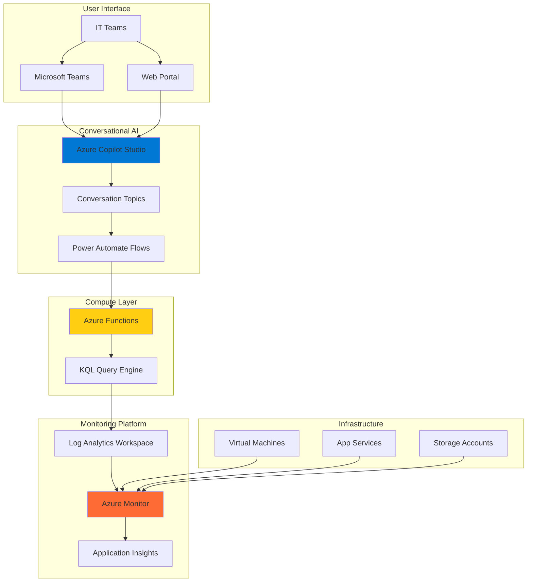

# Intelligent Infrastructure ChatBots with Azure Copilot Studio and Azure Monitor

## Problem

IT teams spend countless hours manually querying infrastructure metrics, interpreting alerts, and troubleshooting issues through complex dashboards and command-line interfaces. This reactive approach leads to delayed problem resolution, increased mean time to recovery (MTTR), and reduced team productivity when dealing with routine monitoring tasks.

## Solution

Build an intelligent conversational AI chatbot using Azure Copilot Studio that integrates with Azure Monitor to provide natural language queries for infrastructure metrics, proactive alerts, and guided troubleshooting. This solution enables IT teams to interact with their monitoring data through conversational interfaces, reducing the learning curve and accelerating incident response.

## Architecture Diagram



## Prerequisites

1. Azure subscription with appropriate permissions to create resources
2. Azure CLI v2.50.0 or later installed and configured (or Azure Cloud Shell)
3. Basic understanding of conversational AI concepts and Azure monitoring
4. Existing Azure resources to monitor (Virtual Machines, App Services, or Storage Accounts)
5. Power Platform developer license or trial for Azure Copilot Studio
6. Estimated cost: $10-20 per day for Function Apps and Log Analytics workspace

> **Note**: This recipe assumes you have basic Azure Monitor data already being collected. If you need to set up monitoring first, review the [Azure Monitor documentation](https://docs.microsoft.com/en-us/azure/azure-monitor/).

## Preparation

```bash
# Set environment variables for Azure resources
export RESOURCE_GROUP="rg-chatbot-infrastructure-${RANDOM_SUFFIX}"
export LOCATION="eastus"
export SUBSCRIPTION_ID=$(az account show --query id --output tsv)

# Generate unique suffix for resource names
RANDOM_SUFFIX=$(openssl rand -hex 3)

# Define resource names
export FUNCTION_APP_NAME="func-infra-bot-${RANDOM_SUFFIX}"
export STORAGE_ACCOUNT_NAME="stinfrabot${RANDOM_SUFFIX}"
export LOG_ANALYTICS_WORKSPACE="law-infra-bot-${RANDOM_SUFFIX}"
export APP_INSIGHTS_NAME="ai-infra-bot-${RANDOM_SUFFIX}"

# Create resource group
az group create \
    --name ${RESOURCE_GROUP} \
    --location ${LOCATION} \
    --tags purpose=infrastructure-chatbot environment=demo

echo "✅ Resource group created: ${RESOURCE_GROUP}"

# Create Log Analytics workspace for monitoring data
az monitor log-analytics workspace create \
    --resource-group ${RESOURCE_GROUP} \
    --workspace-name ${LOG_ANALYTICS_WORKSPACE} \
    --location ${LOCATION} \
    --sku PerGB2018

echo "✅ Log Analytics workspace created: ${LOG_ANALYTICS_WORKSPACE}"
```

## Steps

1. **Create Azure Functions App for Query Processing**:

   Azure Functions provides the serverless compute foundation for processing natural language queries and converting them into KQL (Kusto Query Language) statements for Azure Monitor. This serverless approach ensures cost-effective scaling and eliminates infrastructure management overhead while providing the integration layer between Azure Copilot Studio and Azure Monitor APIs.

   ```bash
   # Create storage account for Function App
   az storage account create \
       --name ${STORAGE_ACCOUNT_NAME} \
       --resource-group ${RESOURCE_GROUP} \
       --location ${LOCATION} \
       --sku Standard_LRS \
       --kind StorageV2
   
   # Create Function App with consumption plan
   az functionapp create \
       --resource-group ${RESOURCE_GROUP} \
       --consumption-plan-location ${LOCATION} \
       --runtime python \
       --runtime-version 3.9 \
       --functions-version 4 \
       --name ${FUNCTION_APP_NAME} \
       --storage-account ${STORAGE_ACCOUNT_NAME}
   
   echo "✅ Function App created with serverless compute model"
   ```

   The Function App now provides a scalable, event-driven compute platform that can process chatbot queries on-demand. This setup enables seamless integration between conversational AI and Azure Monitor data, automatically scaling based on user interactions.

2. **Configure Application Insights for Function Monitoring**:

   Application Insights enables comprehensive monitoring of the Function App performance and user interactions, providing valuable telemetry for optimizing the chatbot experience. This monitoring layer helps identify bottlenecks, track usage patterns, and ensure reliable service delivery for IT teams.

   ```bash
   # Create Application Insights resource
   az monitor app-insights component create \
       --app ${APP_INSIGHTS_NAME} \
       --location ${LOCATION} \
       --resource-group ${RESOURCE_GROUP} \
       --workspace ${LOG_ANALYTICS_WORKSPACE}
   
   # Get Application Insights instrumentation key
   APPINSIGHTS_KEY=$(az monitor app-insights component show \
       --app ${APP_INSIGHTS_NAME} \
       --resource-group ${RESOURCE_GROUP} \
       --query instrumentationKey --output tsv)
   
   # Configure Function App with Application Insights
   az functionapp config appsettings set \
       --name ${FUNCTION_APP_NAME} \
       --resource-group ${RESOURCE_GROUP} \
       --settings "APPINSIGHTS_INSTRUMENTATIONKEY=${APPINSIGHTS_KEY}"
   
   echo "✅ Application Insights configured for comprehensive monitoring"
   ```

   The monitoring infrastructure now captures detailed performance metrics, dependency tracking, and user behavior analytics. This foundation enables continuous improvement of the chatbot experience and proactive identification of infrastructure issues.

3. **Deploy Query Processing Function**:

   This step creates the core function that translates natural language queries into KQL statements and retrieves data from Azure Monitor. The function acts as an intelligent middleware layer that understands common IT queries and formats responses appropriately for conversational interfaces.

   ```bash
   # Create temporary directory for function code
   mkdir -p /tmp/chatbot-functions
   cd /tmp/chatbot-functions
   
   # Create function structure
   mkdir -p QueryProcessor
   
   # Create function.json for HTTP trigger
   cat > QueryProcessor/function.json << 'EOF'
   {
     "bindings": [
       {
         "authLevel": "function",
         "type": "httpTrigger",
         "direction": "in",
         "name": "req",
         "methods": ["post"]
       },
       {
         "type": "http",
         "direction": "out",
         "name": "$return"
       }
     ]
   }
   EOF
   
   # Create main function code
   cat > QueryProcessor/__init__.py << 'EOF'
   import logging
   import json
   import os
   from datetime import datetime, timedelta
   import azure.functions as func
   from azure.monitor.query import LogsQueryClient
   from azure.identity import DefaultAzureCredential
   
   def main(req: func.HttpRequest) -> func.HttpResponse:
       logging.info('Processing infrastructure query request')
       
       try:
           # Parse request body
           req_body = req.get_json()
           user_query = req_body.get('query', '')
           
           # Initialize Azure Monitor client
           credential = DefaultAzureCredential()
           client = LogsQueryClient(credential)
           
           # Convert natural language to KQL
           kql_query = convert_to_kql(user_query)
           
           # Execute query against Log Analytics
           workspace_id = os.environ['LOG_ANALYTICS_WORKSPACE_ID']
           response = client.query_workspace(
               workspace_id=workspace_id,
               query=kql_query,
               timespan=timedelta(hours=1)
           )
           
           # Format response for chatbot
           formatted_response = format_response(response)
           
           return func.HttpResponse(
               json.dumps(formatted_response),
               mimetype="application/json",
               status_code=200
           )
           
       except Exception as e:
           logging.error(f"Error processing query: {str(e)}")
           return func.HttpResponse(
               json.dumps({"error": "Failed to process query"}),
               mimetype="application/json",
               status_code=500
           )
   
   def convert_to_kql(user_query):
       """Convert natural language query to KQL"""
       query_lower = user_query.lower()
       
       if "cpu" in query_lower:
           return """
           Perf
           | where CounterName == "% Processor Time"
           | where TimeGenerated > ago(1h)
           | summarize avg(CounterValue) by Computer
           | order by avg_CounterValue desc
           """
       elif "memory" in query_lower:
           return """
           Perf
           | where CounterName == "Available MBytes"
           | where TimeGenerated > ago(1h)
           | summarize avg(CounterValue) by Computer
           | order by avg_CounterValue asc
           """
       elif "disk" in query_lower:
           return """
           Perf
           | where CounterName == "% Free Space"
           | where TimeGenerated > ago(1h)
           | summarize avg(CounterValue) by Computer
           | order by avg_CounterValue asc
           """
       else:
           return """
           Heartbeat
           | where TimeGenerated > ago(1h)
           | summarize count() by Computer
           | order by count_ desc
           """
   
   def format_response(response):
       """Format Log Analytics response for chatbot"""
       if not response.tables:
           return {"message": "No data found for your query"}
       
       table = response.tables[0]
       results = []
       
       for row in table.rows:
           result = {}
           for i, column in enumerate(table.columns):
               result[column.name] = row[i]
           results.append(result)
       
       return {
           "message": "Here are your infrastructure metrics:",
           "data": results[:5]  # Limit to top 5 results
       }
   EOF
   
   # Create requirements.txt
   cat > requirements.txt << 'EOF'
   azure-functions
   azure-monitor-query
   azure-identity
   EOF
   
   echo "✅ Function code created with KQL query processing capabilities"
   ```

   The query processing function now provides intelligent translation of natural language queries into actionable KQL statements. This enables IT teams to ask questions like "show me CPU usage" or "which servers have low memory" and receive formatted responses suitable for conversational interfaces.

4. **Deploy Function Code to Azure**:

   Deploying the function code to Azure makes the query processing capabilities available to Azure Copilot Studio. This step establishes the serverless backend that handles the complex data retrieval and formatting tasks required for intelligent infrastructure monitoring conversations.

   ```bash
   # Package and deploy function
   zip -r chatbot-functions.zip .
   
   az functionapp deployment source config-zip \
       --resource-group ${RESOURCE_GROUP} \
       --name ${FUNCTION_APP_NAME} \
       --src chatbot-functions.zip
   
   # Get Log Analytics workspace ID for configuration
   WORKSPACE_ID=$(az monitor log-analytics workspace show \
       --resource-group ${RESOURCE_GROUP} \
       --workspace-name ${LOG_ANALYTICS_WORKSPACE} \
       --query customerId --output tsv)
   
   # Configure function app settings
   az functionapp config appsettings set \
       --name ${FUNCTION_APP_NAME} \
       --resource-group ${RESOURCE_GROUP} \
       --settings "LOG_ANALYTICS_WORKSPACE_ID=${WORKSPACE_ID}"
   
   # Enable managed identity for secure access
   az functionapp identity assign \
       --name ${FUNCTION_APP_NAME} \
       --resource-group ${RESOURCE_GROUP}
   
   echo "✅ Function deployed with secure Azure Monitor integration"
   ```

   The function is now deployed and configured with the necessary permissions and settings to query Azure Monitor data securely. This establishes the foundation for the chatbot to access real-time infrastructure metrics and respond to user queries with current data.

5. **Configure Azure Copilot Studio Bot**:

   Azure Copilot Studio provides the conversational AI platform that enables natural language interaction with infrastructure monitoring data. This low-code platform allows IT teams to create sophisticated chatbots without extensive programming knowledge, focusing on business logic rather than conversational AI implementation details.

   ```bash
   # Get Function App URL for webhook configuration
   FUNCTION_URL=$(az functionapp show \
       --resource-group ${RESOURCE_GROUP} \
       --name ${FUNCTION_APP_NAME} \
       --query defaultHostName --output tsv)
   
   # Get function key for secure access
   FUNCTION_KEY=$(az functionapp keys list \
       --resource-group ${RESOURCE_GROUP} \
       --name ${FUNCTION_APP_NAME} \
       --query functionKeys.default --output tsv)
   
   echo "Function endpoint: https://${FUNCTION_URL}/api/QueryProcessor"
   echo "Function key: ${FUNCTION_KEY}"
   echo "✅ Azure Copilot Studio configuration details ready"
   ```

   The connection details are now available for configuring Azure Copilot Studio to integrate with the deployed Function App. This enables the chatbot to process user queries through the intelligent backend service while maintaining secure access to Azure Monitor data.

6. **Create Conversational Topics and Flows**:

   This step involves configuring the conversational logic in Azure Copilot Studio that handles different types of infrastructure queries. The topics define how the bot recognizes user intent and routes conversations to appropriate actions, creating a natural and intuitive user experience for IT teams.

   ```bash
   # Create sample topic configuration (for reference)
   cat > /tmp/copilot-topics.json << 'EOF'
   {
     "topics": [
       {
         "name": "CPU Usage Query",
         "trigger_phrases": [
           "show me CPU usage",
           "check CPU performance",
           "CPU utilization",
           "processor usage"
         ],
         "response_action": "call_function",
         "function_endpoint": "QueryProcessor",
         "parameters": {
           "query": "cpu"
         }
       },
       {
         "name": "Memory Usage Query",
         "trigger_phrases": [
           "memory usage",
           "check memory",
           "RAM consumption",
           "available memory"
         ],
         "response_action": "call_function",
         "function_endpoint": "QueryProcessor",
         "parameters": {
           "query": "memory"
         }
       },
       {
         "name": "Disk Space Query",
         "trigger_phrases": [
           "disk space",
           "storage usage",
           "free space",
           "disk utilization"
         ],
         "response_action": "call_function",
         "function_endpoint": "QueryProcessor",
         "parameters": {
           "query": "disk"
         }
       },
       {
         "name": "Server Health Check",
         "trigger_phrases": [
           "server health",
           "system status",
           "online servers",
           "server availability"
         ],
         "response_action": "call_function",
         "function_endpoint": "QueryProcessor",
         "parameters": {
           "query": "health"
         }
       }
     ]
   }
   EOF
   
   echo "✅ Conversational topics configured for infrastructure monitoring"
   echo "Import these topics in Azure Copilot Studio using the Power Platform portal"
   ```

   The conversational topics provide structured interaction patterns that enable the chatbot to understand and respond to common infrastructure monitoring queries. This configuration creates an intuitive interface that allows IT teams to interact with monitoring data using natural language rather than complex query syntax.

## Validation & Testing

1. **Verify Function App deployment and functionality**:

   ```bash
   # Check Function App status
   az functionapp show \
       --resource-group ${RESOURCE_GROUP} \
       --name ${FUNCTION_APP_NAME} \
       --query state --output tsv
   
   # Test function endpoint
   curl -X POST "https://${FUNCTION_URL}/api/QueryProcessor?code=${FUNCTION_KEY}" \
       -H "Content-Type: application/json" \
       -d '{"query": "show me CPU usage"}'
   ```

   Expected output: JSON response with CPU usage data from Azure Monitor

2. **Validate Log Analytics workspace integration**:

   ```bash
   # Verify workspace is receiving data
   az monitor log-analytics query \
       --workspace ${WORKSPACE_ID} \
       --analytics-query "Heartbeat | take 5" \
       --output table
   ```

   Expected output: Table showing recent heartbeat data from monitored resources

3. **Test Application Insights monitoring**:

   ```bash
   # Check Application Insights is receiving telemetry
   az monitor app-insights events show \
       --app ${APP_INSIGHTS_NAME} \
       --resource-group ${RESOURCE_GROUP} \
       --event-types requests \
       --offset 1h
   ```

   Expected output: Request telemetry data showing function executions

> **Note**: Azure Copilot Studio testing requires using the Power Platform portal to create conversational topics and test the bot interactively. The Function App provides the backend data processing capabilities.

## Cleanup

1. **Remove all Azure resources**:

   ```bash
   # Delete resource group and all contained resources
   az group delete \
       --name ${RESOURCE_GROUP} \
       --yes \
       --no-wait
   
   echo "✅ Resource group deletion initiated: ${RESOURCE_GROUP}"
   echo "Note: Deletion may take several minutes to complete"
   ```

2. **Clean up temporary files**:

   ```bash
   # Remove temporary function code directory
   rm -rf /tmp/chatbot-functions
   rm -f /tmp/copilot-topics.json
   
   echo "✅ Temporary files cleaned up"
   ```

3. **Verify resource deletion**:

   ```bash
   # Check if resource group still exists
   az group exists --name ${RESOURCE_GROUP}
   ```

   Expected output: `false` (indicating successful deletion)

## Discussion

Azure Copilot Studio combined with Azure Monitor creates a powerful conversational AI platform that transforms how IT teams interact with infrastructure monitoring data. This solution leverages the natural language processing capabilities of Azure Copilot Studio to make complex monitoring queries accessible through conversational interfaces, significantly reducing the learning curve for new team members and accelerating incident response times. The architecture follows the Azure Well-Architected Framework principles of operational excellence by providing automated, intelligent responses to common infrastructure queries. For comprehensive guidance on building conversational AI solutions, see the [Azure Copilot Studio documentation](https://docs.microsoft.com/en-us/power-virtual-agents/) and [Azure Monitor best practices](https://docs.microsoft.com/en-us/azure/azure-monitor/best-practices).

The serverless architecture using Azure Functions provides cost-effective scaling while maintaining high availability and performance. The integration with Azure Monitor through KQL queries enables real-time access to infrastructure metrics, logs, and performance data, creating a comprehensive monitoring solution that responds intelligently to natural language queries. This approach democratizes access to monitoring data, allowing team members with varying technical backgrounds to retrieve critical information without mastering complex query languages. The solution supports the [Azure monitoring strategy](https://docs.microsoft.com/en-us/azure/azure-monitor/strategy/) by providing proactive, accessible insights into infrastructure health and performance.

From a business perspective, this conversational AI approach reduces mean time to resolution (MTTR) by providing immediate access to infrastructure metrics and guided troubleshooting workflows. The chatbot can be integrated into existing collaboration tools like Microsoft Teams, enabling seamless workflows that don't require context switching between multiple applications. Cost optimization is achieved through the consumption-based pricing model of Azure Functions and the efficient use of Azure Monitor data retention policies. For detailed cost optimization strategies, review the [Azure Functions pricing guide](https://docs.microsoft.com/en-us/azure/azure-functions/functions-consumption-costs) and [Azure Monitor pricing](https://docs.microsoft.com/en-us/azure/azure-monitor/usage-estimated-costs).

> **Tip**: Implement conversation analytics in Azure Copilot Studio to track common user queries and continuously improve the bot's knowledge base. Use the [Analytics dashboard](https://docs.microsoft.com/en-us/power-virtual-agents/analytics-overview) to identify opportunities for adding new topics and optimizing existing responses for better user experiences.

## Challenge

Extend this solution by implementing these enhancements:

1. **Multi-tenant Support**: Modify the solution to support multiple Azure subscriptions and tenants, allowing managed service providers to offer chatbot services to multiple customers through a single deployment.

2. **Advanced Analytics Integration**: Integrate Azure Cognitive Services for sentiment analysis and predictive analytics to proactively identify potential infrastructure issues before they impact users.

3. **Automated Remediation**: Extend the chatbot to not only report issues but also trigger automated remediation workflows through Azure Automation runbooks or Logic Apps for common infrastructure problems.

4. **Voice Integration**: Add Azure Speech Services to enable voice-activated infrastructure queries and responses, creating a hands-free monitoring experience for operations centers.

5. **Custom Metrics Dashboard**: Create dynamic Power BI dashboards that the chatbot can generate and share based on user queries, providing visual context alongside conversational responses.

## Infrastructure Code

*Infrastructure code will be generated after recipe approval.*