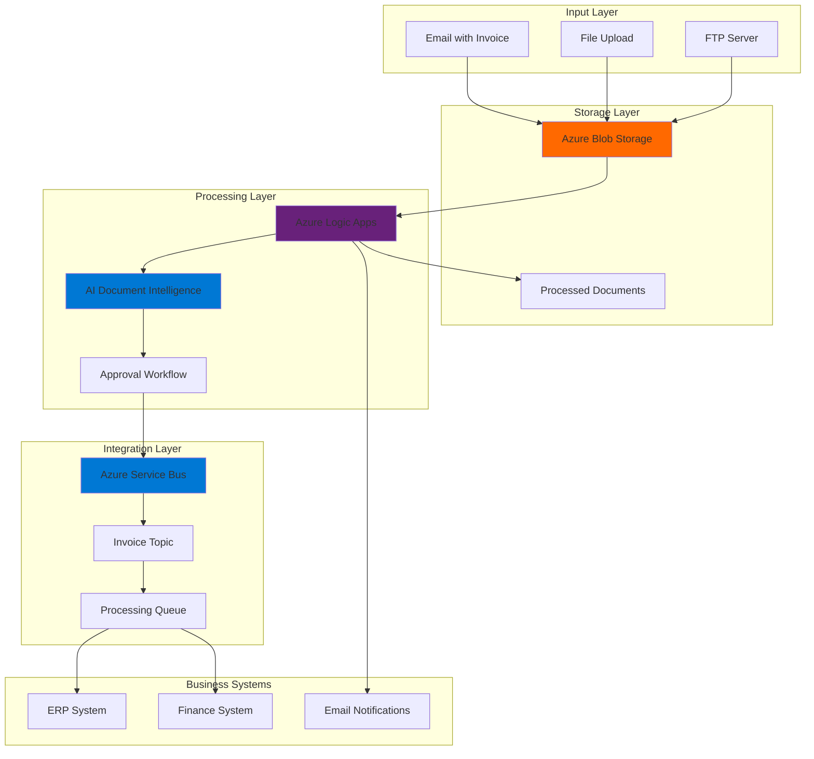

# Intelligent Invoice Processing Workflows with Azure Logic Apps and AI Document Intelligence

## Problem

Finance teams spend countless hours manually processing invoices, leading to delayed payments, human errors, and inefficient resource allocation. Traditional invoice processing involves manual data entry, paper-based approval workflows, and disconnected systems that create bottlenecks in accounts payable operations. Organizations need an automated solution that can extract data from various invoice formats, route for approval, and integrate with existing business systems without requiring extensive custom development.

## Solution

This solution creates an intelligent invoice processing system using Azure AI Document Intelligence to extract structured data from PDF invoices, Azure Logic Apps to orchestrate approval workflows, and Azure Service Bus to integrate with downstream business systems. The serverless architecture automatically scales based on invoice volume while maintaining high accuracy through AI-powered data extraction and providing real-time processing status updates.

## Architecture Diagram



## Prerequisites

1. Azure subscription with appropriate permissions for Logic Apps, AI Document Intelligence, Service Bus, and Blob Storage
2. Azure CLI v2.50.0 or later installed and configured (or Azure CloudShell)
3. Basic understanding of workflow design and business process automation
4. Familiarity with REST APIs and JSON data structures
5. Knowledge of Azure messaging patterns and enterprise integration
6. Estimated cost: $50-100/month for moderate invoice processing volumes (100-500 invoices/month)

> **Note**: AI Document Intelligence pricing varies by transaction volume and features used. Review the [Azure AI Document Intelligence pricing guide](https://azure.microsoft.com/pricing/details/ai-document-intelligence/) for detailed cost calculations.

## Preparation

```bash
# Set environment variables for Azure resources
export RESOURCE_GROUP="rg-invoice-processing-${RANDOM_SUFFIX}"
export LOCATION="eastus"
export SUBSCRIPTION_ID=$(az account show --query id --output tsv)

# Generate unique suffix for resource names
RANDOM_SUFFIX=$(openssl rand -hex 3)

# Set resource names with proper Azure naming conventions
export STORAGE_ACCOUNT="stinvoice${RANDOM_SUFFIX}"
export DOC_INTELLIGENCE_NAME="di-invoice-${RANDOM_SUFFIX}"
export LOGIC_APP_NAME="la-invoice-processor-${RANDOM_SUFFIX}"
export SERVICE_BUS_NAMESPACE="sb-invoice-${RANDOM_SUFFIX}"
export CONTAINER_NAME="invoices"

# Create resource group
az group create \
    --name ${RESOURCE_GROUP} \
    --location ${LOCATION} \
    --tags purpose=invoice-processing environment=demo

echo "✅ Resource group created: ${RESOURCE_GROUP}"
```

## Steps

1. **Create Azure Blob Storage for Invoice Documents**:

   Azure Blob Storage provides scalable, secure storage for invoice documents with built-in redundancy and lifecycle management. This storage account will serve as the central repository for incoming invoices, processed documents, and audit trails. The hierarchical namespace enables efficient organization of invoices by date, vendor, or status while supporting both hot and cool access tiers for cost optimization.

   ```bash
   # Create storage account with hierarchical namespace
   az storage account create \
       --name ${STORAGE_ACCOUNT} \
       --resource-group ${RESOURCE_GROUP} \
       --location ${LOCATION} \
       --sku Standard_LRS \
       --kind StorageV2 \
       --access-tier Hot
   
   # Get storage account key
   STORAGE_KEY=$(az storage account keys list \
       --resource-group ${RESOURCE_GROUP} \
       --account-name ${STORAGE_ACCOUNT} \
       --query '[0].value' \
       --output tsv)
   
   # Create container for invoices
   az storage container create \
       --name ${CONTAINER_NAME} \
       --account-name ${STORAGE_ACCOUNT} \
       --account-key ${STORAGE_KEY}
   
   echo "✅ Storage account configured with container: ${CONTAINER_NAME}"
   ```

   The storage account now provides the foundation for document management with automatic encryption at rest and integration capabilities for Logic Apps. This configuration supports various invoice formats including PDFs, images, and scanned documents while maintaining audit trails for compliance requirements.

2. **Deploy Azure AI Document Intelligence Service**:

   Azure AI Document Intelligence uses advanced machine learning models to extract structured data from invoices with high accuracy. The service includes prebuilt invoice models that can identify key fields like vendor information, amounts, dates, and line items across various invoice formats. This eliminates the need for manual data entry and reduces processing errors significantly.

   ```bash
   # Create AI Document Intelligence resource
   az cognitiveservices account create \
       --name ${DOC_INTELLIGENCE_NAME} \
       --resource-group ${RESOURCE_GROUP} \
       --location ${LOCATION} \
       --kind FormRecognizer \
       --sku S0 \
       --custom-domain ${DOC_INTELLIGENCE_NAME}
   
   # Get the endpoint and key
   DOC_INTELLIGENCE_ENDPOINT=$(az cognitiveservices account show \
       --name ${DOC_INTELLIGENCE_NAME} \
       --resource-group ${RESOURCE_GROUP} \
       --query properties.endpoint \
       --output tsv)
   
   DOC_INTELLIGENCE_KEY=$(az cognitiveservices account keys list \
       --name ${DOC_INTELLIGENCE_NAME} \
       --resource-group ${RESOURCE_GROUP} \
       --query key1 \
       --output tsv)
   
   echo "✅ AI Document Intelligence service deployed"
   echo "Endpoint: ${DOC_INTELLIGENCE_ENDPOINT}"
   ```

   The Document Intelligence service is now ready to process invoice documents using the latest v4.0 API with enhanced accuracy and support for 27 languages. This cognitive service provides real-time data extraction capabilities that will integrate seamlessly with our Logic Apps workflow.

3. **Create Azure Service Bus for Enterprise Integration**:

   Azure Service Bus enables reliable, asynchronous communication between the invoice processing system and downstream business applications. The service provides enterprise-grade messaging with features like message ordering, duplicate detection, and dead letter queues. This ensures that processed invoice data reaches ERP systems, finance applications, and notification services reliably.

   ```bash
   # Create Service Bus namespace
   az servicebus namespace create \
       --name ${SERVICE_BUS_NAMESPACE} \
       --resource-group ${RESOURCE_GROUP} \
       --location ${LOCATION} \
       --sku Standard
   
   # Create topic for invoice processing events
   az servicebus topic create \
       --name invoice-processing \
       --namespace-name ${SERVICE_BUS_NAMESPACE} \
       --resource-group ${RESOURCE_GROUP}
   
   # Create queue for processed invoices
   az servicebus queue create \
       --name processed-invoices \
       --namespace-name ${SERVICE_BUS_NAMESPACE} \
       --resource-group ${RESOURCE_GROUP} \
       --max-delivery-count 10 \
       --message-time-to-live P14D
   
   # Get connection string
   SERVICE_BUS_CONNECTION=$(az servicebus namespace authorization-rule keys list \
       --resource-group ${RESOURCE_GROUP} \
       --namespace-name ${SERVICE_BUS_NAMESPACE} \
       --name RootManageSharedAccessKey \
       --query primaryConnectionString \
       --output tsv)
   
   echo "✅ Service Bus namespace created with topic and queue"
   ```

   The Service Bus infrastructure now provides robust messaging capabilities that support publish-subscribe patterns and guaranteed message delivery. This enables loose coupling between the invoice processing workflow and business systems while maintaining message ordering and reliability.

4. **Create Logic App for Invoice Processing Workflow**:

   Azure Logic Apps provides a visual, low-code platform for creating complex business workflows that integrate cloud and on-premises systems. The Logic App will orchestrate the entire invoice processing pipeline, from document upload through AI analysis to approval routing and system integration. This serverless approach eliminates infrastructure management while providing automatic scaling and built-in monitoring.

   ```bash
   # Create Logic App (Consumption plan)
   az logic workflow create \
       --name ${LOGIC_APP_NAME} \
       --resource-group ${RESOURCE_GROUP} \
       --location ${LOCATION} \
       --definition '{
         "$schema": "https://schema.management.azure.com/schemas/2016-06-01/Microsoft.Logic.json",
         "contentVersion": "1.0.0.0",
         "parameters": {},
         "triggers": {},
         "actions": {}
       }'
   
   # Get Logic App callback URL for configuration
   LOGIC_APP_URL=$(az logic workflow show \
       --name ${LOGIC_APP_NAME} \
       --resource-group ${RESOURCE_GROUP} \
       --query accessEndpoint \
       --output tsv)
   
   echo "✅ Logic App created successfully"
   echo "Logic App URL: ${LOGIC_APP_URL}"
   ```

   The Logic App foundation is now established and ready for workflow definition. This provides the orchestration layer that will coordinate AI Document Intelligence processing, approval workflows, and business system integration with built-in error handling and monitoring capabilities.

5. **Configure Storage Account Event Trigger**:

   Azure Event Grid integration enables real-time processing of invoice uploads by automatically triggering the Logic App when new documents arrive in Blob Storage. This event-driven architecture ensures immediate processing without polling, reducing latency and improving system responsiveness. The configuration supports various file types and provides metadata for intelligent routing.

   ```bash
   # Create Event Grid system topic for storage events
   az eventgrid system-topic create \
       --name storage-events-${RANDOM_SUFFIX} \
       --resource-group ${RESOURCE_GROUP} \
       --location ${LOCATION} \
       --topic-type Microsoft.Storage.StorageAccounts \
       --source "/subscriptions/${SUBSCRIPTION_ID}/resourceGroups/${RESOURCE_GROUP}/providers/Microsoft.Storage/storageAccounts/${STORAGE_ACCOUNT}"
   
   # Enable blob change events on storage account
   az storage account blob-service-properties update \
       --account-name ${STORAGE_ACCOUNT} \
       --resource-group ${RESOURCE_GROUP} \
       --change-feed-enabled true
   
   echo "✅ Event Grid integration configured for storage events"
   ```

   The event-driven trigger system now automatically detects new invoice uploads and initiates processing workflows. This configuration provides real-time responsiveness and supports scalable processing of high invoice volumes during peak periods.

6. **Deploy Logic App Workflow Definition**:

   The Logic App workflow definition orchestrates the complete invoice processing pipeline with conditional logic, error handling, and integration points. This comprehensive workflow includes document validation, AI processing, approval routing, and system notification capabilities. The visual workflow design enables easy maintenance and business user understanding.

   ```bash
   # Create comprehensive workflow definition
   cat > workflow-definition.json << 'EOF'
   {
     "$schema": "https://schema.management.azure.com/schemas/2016-06-01/Microsoft.Logic.json",
     "contentVersion": "1.0.0.0",
     "parameters": {
       "storageAccountName": {
         "type": "string",
         "defaultValue": ""
       },
       "documentIntelligenceEndpoint": {
         "type": "string",
         "defaultValue": ""
       },
       "serviceBusConnectionString": {
         "type": "string",
         "defaultValue": ""
       }
     },
     "triggers": {
       "When_a_blob_is_added_or_modified": {
         "type": "ApiConnection",
         "inputs": {
           "host": {
             "connection": {
               "name": "@parameters('$connections')['azureblob']['connectionId']"
             }
           },
           "method": "get",
           "path": "/triggers/batch/onupdatedfile",
           "queries": {
             "folderId": "/invoices",
             "maxFileCount": 10
           }
         },
         "recurrence": {
           "frequency": "Minute",
           "interval": 1
         }
       }
     },
     "actions": {
       "Process_Invoice_with_AI": {
         "type": "Http",
         "inputs": {
           "method": "POST",
           "uri": "@{parameters('documentIntelligenceEndpoint')}/formrecognizer/documentModels/prebuilt-invoice:analyze?api-version=2024-11-30",
           "headers": {
             "Ocp-Apim-Subscription-Key": "@{parameters('documentIntelligenceKey')}"
           },
           "body": {
             "urlSource": "@{triggerBody().MediaLink}"
           }
         },
         "runAfter": {}
       },
       "Parse_Invoice_Data": {
         "type": "ParseJson",
         "inputs": {
           "content": "@body('Process_Invoice_with_AI')",
           "schema": {
             "type": "object",
             "properties": {
               "analyzeResult": {
                 "type": "object",
                 "properties": {
                   "documents": {
                     "type": "array",
                     "items": {
                       "type": "object",
                       "properties": {
                         "fields": {
                           "type": "object"
                         }
                       }
                     }
                   }
                 }
               }
             }
           }
         },
         "runAfter": {
           "Process_Invoice_with_AI": ["Succeeded"]
         }
       },
       "Check_Invoice_Amount": {
         "type": "If",
         "expression": {
           "greater": [
             "@float(body('Parse_Invoice_Data')?['analyzeResult']?['documents']?[0]?['fields']?['InvoiceTotal']?['content'])",
             1000
           ]
         },
         "actions": {
           "Send_for_Approval": {
             "type": "ApiConnection",
             "inputs": {
               "host": {
                 "connection": {
                   "name": "@parameters('$connections')['office365']['connectionId']"
                 }
               },
               "method": "post",
               "path": "/v2/Mail",
               "body": {
                 "To": "finance-approver@company.com",
                 "Subject": "Invoice Approval Required",
                 "Body": "Invoice amount exceeds $1000. Please review and approve."
               }
             }
           }
         },
         "else": {
           "actions": {
             "Auto_Approve": {
               "type": "Compose",
               "inputs": {
                 "status": "approved",
                 "approver": "system"
               }
             }
           }
         },
         "runAfter": {
           "Parse_Invoice_Data": ["Succeeded"]
         }
       },
       "Send_to_Service_Bus": {
         "type": "ApiConnection",
         "inputs": {
           "host": {
             "connection": {
               "name": "@parameters('$connections')['servicebus']['connectionId']"
             }
           },
           "method": "post",
           "path": "/messages",
           "body": {
             "ContentData": "@{base64(body('Parse_Invoice_Data'))}"
           }
         },
         "runAfter": {
           "Check_Invoice_Amount": ["Succeeded"]
         }
       }
     },
     "outputs": {}
   }
   EOF
   
   # Update Logic App with workflow definition
   az logic workflow update \
       --name ${LOGIC_APP_NAME} \
       --resource-group ${RESOURCE_GROUP} \
       --definition @workflow-definition.json
   
   echo "✅ Logic App workflow deployed with AI processing and approval logic"
   ```

   The workflow is now operational with intelligent document processing, conditional approval routing, and enterprise integration capabilities. This comprehensive solution handles various invoice scenarios while maintaining audit trails and providing real-time processing status.

7. **Configure Logic App Connections**:

   Azure Logic Apps uses managed connections to securely integrate with external services and Azure resources. These connections provide authentication, connection pooling, and error handling for reliable integration with Blob Storage, Document Intelligence, and Service Bus. The configuration follows Azure security best practices with managed identity support.

   ```bash
   # Create API connections for Logic App
   # Note: In production, these would be created through Azure portal or ARM templates
   # with proper authentication configuration
   
   # Create blob storage connection
   az resource create \
       --resource-group ${RESOURCE_GROUP} \
       --resource-type Microsoft.Web/connections \
       --name blob-connection \
       --properties '{
         "displayName": "Blob Storage Connection",
         "api": {
           "id": "/subscriptions/'${SUBSCRIPTION_ID}'/providers/Microsoft.Web/locations/'${LOCATION}'/managedApis/azureblob"
         },
         "parameterValues": {
           "accountName": "'${STORAGE_ACCOUNT}'",
           "accessKey": "'${STORAGE_KEY}'"
         }
       }'
   
   # Create Service Bus connection
   az resource create \
       --resource-group ${RESOURCE_GROUP} \
       --resource-type Microsoft.Web/connections \
       --name servicebus-connection \
       --properties '{
         "displayName": "Service Bus Connection",
         "api": {
           "id": "/subscriptions/'${SUBSCRIPTION_ID}'/providers/Microsoft.Web/locations/'${LOCATION}'/managedApis/servicebus"
         },
         "parameterValues": {
           "connectionString": "'${SERVICE_BUS_CONNECTION}'"
         }
       }'
   
   echo "✅ Logic App connections configured for storage and messaging"
   ```

   The secure connection infrastructure enables reliable integration between Logic Apps and Azure services. These managed connections provide built-in retry policies, authentication management, and monitoring capabilities essential for production workflows.

8. **Create Sample Invoice Processing Function**:

   A companion Azure Function provides additional processing capabilities for complex invoice scenarios, custom business logic, and integration with legacy systems. This serverless function complements the Logic App workflow by handling computational tasks, data transformations, and custom validations that require code-based implementation.

   ```bash
   # Create Function App for additional processing
   FUNCTION_APP_NAME="fa-invoice-processor-${RANDOM_SUFFIX}"
   
   az functionapp create \
       --name ${FUNCTION_APP_NAME} \
       --resource-group ${RESOURCE_GROUP} \
       --storage-account ${STORAGE_ACCOUNT} \
       --consumption-plan-location ${LOCATION} \
       --runtime python \
       --runtime-version 3.11 \
       --functions-version 4
   
   # Configure app settings
   az functionapp config appsettings set \
       --name ${FUNCTION_APP_NAME} \
       --resource-group ${RESOURCE_GROUP} \
       --settings \
           "DOCUMENT_INTELLIGENCE_ENDPOINT=${DOC_INTELLIGENCE_ENDPOINT}" \
           "DOCUMENT_INTELLIGENCE_KEY=${DOC_INTELLIGENCE_KEY}" \
           "SERVICE_BUS_CONNECTION=${SERVICE_BUS_CONNECTION}"
   
   echo "✅ Function App created for advanced invoice processing"
   ```

   The Function App provides computational flexibility for complex invoice processing scenarios while maintaining the serverless architecture benefits. This enables custom business logic implementation, integration with specialized systems, and advanced data processing capabilities.

## Validation & Testing

1. **Test blob storage and event trigger**:

   ```bash
   # Create a test invoice file
   echo "Test invoice content" > test-invoice.pdf
   
   # Upload test file to trigger workflow
   az storage blob upload \
       --account-name ${STORAGE_ACCOUNT} \
       --account-key ${STORAGE_KEY} \
       --container-name ${CONTAINER_NAME} \
       --name test-invoice.pdf \
       --file test-invoice.pdf
   
   echo "✅ Test invoice uploaded to storage"
   ```

2. **Verify AI Document Intelligence processing**:

   ```bash
   # Test Document Intelligence API directly
   curl -X POST \
       -H "Ocp-Apim-Subscription-Key: ${DOC_INTELLIGENCE_KEY}" \
       -H "Content-Type: application/json" \
       -d '{"urlSource": "https://'${STORAGE_ACCOUNT}'.blob.core.windows.net/'${CONTAINER_NAME}'/test-invoice.pdf"}' \
       "${DOC_INTELLIGENCE_ENDPOINT}/formrecognizer/documentModels/prebuilt-invoice:analyze?api-version=2024-11-30"
   ```

3. **Check Logic App execution history**:

   ```bash
   # Get workflow run history
   az logic workflow run list \
       --resource-group ${RESOURCE_GROUP} \
       --name ${LOGIC_APP_NAME} \
       --top 5
   
   echo "✅ Logic App execution history retrieved"
   ```

4. **Verify Service Bus message delivery**:

   ```bash
   # Check queue message count
   az servicebus queue show \
       --resource-group ${RESOURCE_GROUP} \
       --namespace-name ${SERVICE_BUS_NAMESPACE} \
       --name processed-invoices \
       --query countDetails
   ```

## Cleanup

1. **Remove Function App and related resources**:

   ```bash
   # Delete Function App
   az functionapp delete \
       --name ${FUNCTION_APP_NAME} \
       --resource-group ${RESOURCE_GROUP}
   
   echo "✅ Function App deleted"
   ```

2. **Remove Logic App and connections**:

   ```bash
   # Delete Logic App
   az logic workflow delete \
       --name ${LOGIC_APP_NAME} \
       --resource-group ${RESOURCE_GROUP}
   
   # Delete API connections
   az resource delete \
       --resource-group ${RESOURCE_GROUP} \
       --resource-type Microsoft.Web/connections \
       --name blob-connection
   
   az resource delete \
       --resource-group ${RESOURCE_GROUP} \
       --resource-type Microsoft.Web/connections \
       --name servicebus-connection
   
   echo "✅ Logic App and connections deleted"
   ```

3. **Remove Service Bus namespace**:

   ```bash
   # Delete Service Bus namespace
   az servicebus namespace delete \
       --name ${SERVICE_BUS_NAMESPACE} \
       --resource-group ${RESOURCE_GROUP}
   
   echo "✅ Service Bus namespace deleted"
   ```

4. **Remove AI Document Intelligence service**:

   ```bash
   # Delete Document Intelligence service
   az cognitiveservices account delete \
       --name ${DOC_INTELLIGENCE_NAME} \
       --resource-group ${RESOURCE_GROUP}
   
   echo "✅ AI Document Intelligence service deleted"
   ```

5. **Remove storage account and resource group**:

   ```bash
   # Delete storage account
   az storage account delete \
       --name ${STORAGE_ACCOUNT} \
       --resource-group ${RESOURCE_GROUP} \
       --yes
   
   # Delete resource group and all remaining resources
   az group delete \
       --name ${RESOURCE_GROUP} \
       --yes \
       --no-wait
   
   echo "✅ All resources deleted successfully"
   ```

## Discussion

Azure AI Document Intelligence and Logic Apps create a powerful combination for automating invoice processing workflows that traditionally require significant manual effort. The AI Document Intelligence service uses sophisticated optical character recognition (OCR) and machine learning models to extract structured data from invoices with accuracy rates exceeding 95% for standard invoice formats. This eliminates the need for manual data entry while supporting various document types including scanned images, PDFs, and phone-captured photos. The [Azure AI Document Intelligence documentation](https://docs.microsoft.com/en-us/azure/ai-services/document-intelligence/) provides comprehensive guidance on supported document types, field extraction capabilities, and integration patterns.

The Logic Apps workflow orchestration enables complex business processes with conditional logic, approval routing, and exception handling without requiring extensive custom development. The visual workflow designer makes it easy for business users to understand and maintain the automation logic while providing enterprise-grade features like error handling, retry policies, and monitoring. Azure Logic Apps supports over 1,400 connectors for seamless integration with existing business systems, from ERP platforms to email servers. For detailed workflow design patterns, see the [Azure Logic Apps documentation](https://docs.microsoft.com/en-us/azure/logic-apps/) and [enterprise integration patterns guide](https://docs.microsoft.com/en-us/azure/logic-apps/logic-apps-enterprise-integration-overview).

Service Bus messaging provides reliable, asynchronous communication between the invoice processing system and downstream applications, supporting enterprise integration patterns like publish-subscribe and guaranteed message delivery. This decoupled architecture enables independent scaling of processing components while maintaining message ordering and reliability. The combination of Logic Apps with Service Bus follows Azure Well-Architected Framework principles of reliability and scalability, ensuring the solution can handle varying invoice volumes and integrate with multiple business systems simultaneously.

From a cost perspective, the serverless architecture ensures you only pay for actual processing time and resource consumption, making it highly cost-effective for organizations with fluctuating invoice volumes. AI Document Intelligence charges per document processed, Logic Apps charges per action executed, and Service Bus charges per message operation, providing predictable and scalable pricing. For detailed cost optimization strategies, review the [Azure pricing documentation](https://azure.microsoft.com/pricing/) and [cost management best practices](https://docs.microsoft.com/en-us/azure/cost-management/).

> **Tip**: Implement custom document classification models in Document Intelligence to handle specialized invoice formats or industry-specific documents. The service supports custom training with your own document samples to improve accuracy for unique business requirements.

## Challenge

Extend this invoice processing solution by implementing these advanced capabilities:

1. **Implement multi-stage approval workflows** based on invoice amount thresholds, vendor categories, and budget codes using Logic Apps conditions and parallel processing branches.

2. **Add intelligent document classification** to automatically route different document types (invoices, receipts, purchase orders) to appropriate processing pipelines using Document Intelligence custom models.

3. **Integrate with Microsoft Power BI** to create real-time dashboards showing invoice processing metrics, approval bottlenecks, and cost analytics using Azure Monitor and custom telemetry.

4. **Implement blockchain-based audit trails** using Azure Blockchain Service to create immutable records of invoice processing history, approvals, and payments for enhanced compliance and security.

5. **Add natural language processing** using Azure Cognitive Services to extract additional insights from invoice descriptions, automatically categorize expenses, and detect potential fraud patterns.

## Infrastructure Code

*Infrastructure code will be generated after recipe approval.*