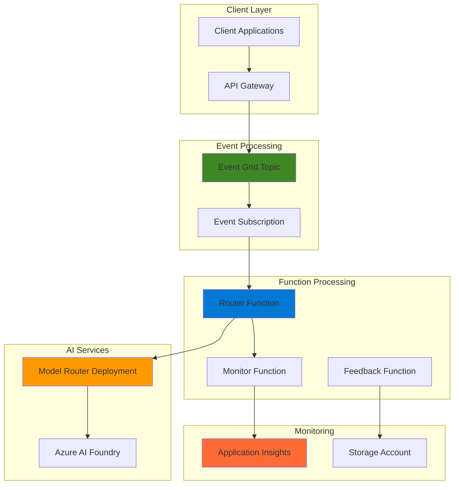

# Intelligent Model Selection with Model Router and Event Grid

## Problem

Organizations implementing AI solutions face the challenge of balancing model performance with operational costs. Using powerful models like GPT-4o for simple queries wastes resources, while using smaller models for complex reasoning tasks produces inadequate results. Manual model selection is inefficient and doesn't scale with varying workload demands, leading to either over-provisioning expensive models or under-delivering on quality requirements.

## Solution

Build an event-driven AI orchestration system that automatically routes requests to optimal models based on complexity analysis. Azure Model Router intelligently selects between underlying models (GPT-4.1, GPT-4.1-mini, GPT-4.1-nano, o4-mini) while Event Grid triggers Azure Functions to handle request preprocessing, routing decisions, and performance monitoring. This approach optimizes costs by using smaller models when sufficient while ensuring complex queries receive appropriate model capacity.

## Architecture Diagram



## Prerequisites

1. Azure subscription with contributor permissions for resource creation
2. Azure CLI installed and configured (version 2.50+)
3. Basic understanding of serverless architectures and event-driven patterns
4. Access to Azure AI Foundry and Model Router preview features
5. Estimated cost: $15-25 for testing (includes AI model usage, Functions execution, and Event Grid operations)

> **Note**: Model Router is currently in preview and available in East US 2 and Sweden Central regions. Ensure your subscription has access to Azure AI Foundry preview features.

## Preparation

```bash
# Set environment variables for Azure resources
export RESOURCE_GROUP="rg-recipe-${RANDOM_SUFFIX}"
export LOCATION="eastus2"
export SUBSCRIPTION_ID=$(az account show --query id --output tsv)

# Generate unique suffix for resource names
RANDOM_SUFFIX=$(openssl rand -hex 3)

# Set resource names with unique suffix
export STORAGE_ACCOUNT="stmodelrouter${RANDOM_SUFFIX}"
export FUNCTION_APP="func-router-${RANDOM_SUFFIX}"
export AI_FOUNDRY_RESOURCE="ai-foundry-${RANDOM_SUFFIX}"
export EVENT_GRID_TOPIC="egt-router-${RANDOM_SUFFIX}"
export APP_INSIGHTS="ai-router-${RANDOM_SUFFIX}"

# Create resource group
az group create \
    --name ${RESOURCE_GROUP} \
    --location ${LOCATION} \
    --tags purpose=recipe environment=demo

echo "✅ Resource group created: ${RESOURCE_GROUP}"

# Create storage account for Functions
az storage account create \
    --name ${STORAGE_ACCOUNT} \
    --resource-group ${RESOURCE_GROUP} \
    --location ${LOCATION} \
    --sku Standard_LRS \
    --kind StorageV2

echo "✅ Storage account created: ${STORAGE_ACCOUNT}"
```

## Steps

1. **Create Application Insights for Monitoring**:

   Application Insights provides comprehensive telemetry collection for Azure Functions and AI model performance tracking. This foundational monitoring service enables real-time analysis of request patterns, model selection decisions, and cost optimization metrics. The integrated dashboard helps identify trends and anomalies in model usage patterns across different complexity levels.

   ```bash
   # Create Application Insights workspace
   az monitor app-insights component create \
       --app ${APP_INSIGHTS} \
       --location ${LOCATION} \
       --resource-group ${RESOURCE_GROUP} \
       --kind web \
       --application-type web
   
   # Get Application Insights connection string
   AI_CONNECTION_STRING=$(az monitor app-insights component show \
       --app ${APP_INSIGHTS} \
       --resource-group ${RESOURCE_GROUP} \
       --query connectionString \
       --output tsv)
   
   echo "✅ Application Insights created with monitoring enabled"
   ```

   Application Insights now provides real-time telemetry collection and performance analytics. This service automatically captures function execution metrics, dependency calls to AI services, and custom metrics for model selection decisions, enabling comprehensive monitoring of the intelligent routing system.

2. **Create Azure Functions App with Event Grid Integration**:

   Azure Functions provides serverless event processing that automatically scales based on Event Grid message volume. The Function App hosts intelligent routing logic and integrates seamlessly with Application Insights for comprehensive monitoring. This serverless approach eliminates infrastructure management while providing cost-effective scaling for unpredictable AI workloads.

   ```bash
   # Create Function App with Application Insights integration
   az functionapp create \
       --name ${FUNCTION_APP} \
       --resource-group ${RESOURCE_GROUP} \
       --storage-account ${STORAGE_ACCOUNT} \
       --consumption-plan-location ${LOCATION} \
       --runtime python \
       --runtime-version 3.11 \
       --functions-version 4 \
       --app-insights ${APP_INSIGHTS}
   
   # Configure Function App settings for AI integration
   az functionapp config appsettings set \
       --name ${FUNCTION_APP} \
       --resource-group ${RESOURCE_GROUP} \
       --settings \
       "APPLICATIONINSIGHTS_CONNECTION_STRING=${AI_CONNECTION_STRING}" \
       "FUNCTIONS_WORKER_RUNTIME=python" \
       "AzureWebJobsFeatureFlags=EnableWorkerIndexing"
   
   echo "✅ Function App created with Event Grid integration"
   ```

   The Function App is now configured with automatic scaling and integrated monitoring. Event Grid triggers will automatically invoke functions based on AI request patterns, enabling reactive processing without manual intervention. The consumption-based pricing model ensures cost optimization during low-usage periods.

3. **Create Event Grid Topic for AI Request Orchestration**:

   Event Grid provides reliable, push-based event delivery that decouples AI request processing from client applications. The custom topic enables flexible routing of AI requests with built-in retry logic and dead letter queuing. This event-driven architecture supports multiple subscribers and enables complex workflows for AI model selection with enterprise-grade reliability.

   ```bash
   # Create Event Grid custom topic
   az eventgrid topic create \
       --name ${EVENT_GRID_TOPIC} \
       --resource-group ${RESOURCE_GROUP} \
       --location ${LOCATION} \
       --input-schema eventgridschema
   
   # Get Event Grid topic endpoint and access key
   EVENT_GRID_ENDPOINT=$(az eventgrid topic show \
       --name ${EVENT_GRID_TOPIC} \
       --resource-group ${RESOURCE_GROUP} \
       --query endpoint \
       --output tsv)
   
   EVENT_GRID_KEY=$(az eventgrid topic key list \
       --name ${EVENT_GRID_TOPIC} \
       --resource-group ${RESOURCE_GROUP} \
       --query key1 \
       --output tsv)
   
   echo "✅ Event Grid topic created: ${EVENT_GRID_TOPIC}"
   ```

   Event Grid topic now provides scalable event ingestion with automatic load balancing. The service handles event validation, filtering, and delivery with built-in monitoring capabilities and guaranteed at-least-once delivery semantics for reliable AI request processing.

4. **Deploy Azure AI Foundry Resource for Model Router**:

   Azure AI Foundry provides the foundational AI platform required for Model Router deployment. This managed service handles model lifecycle management, scaling, and security while providing unified access to multiple underlying models. The resource serves as the deployment target for the intelligent Model Router service with enterprise-grade security and compliance features.

   ```bash
   # Create Azure AI Foundry resource
   az cognitiveservices account create \
       --name ${AI_FOUNDRY_RESOURCE} \
       --resource-group ${RESOURCE_GROUP} \
       --location ${LOCATION} \
       --kind AIServices \
       --sku S0 \
       --custom-domain ${AI_FOUNDRY_RESOURCE} \
       --assign-identity
   
   # Get AI Foundry resource endpoint and key
   AI_FOUNDRY_ENDPOINT=$(az cognitiveservices account show \
       --name ${AI_FOUNDRY_RESOURCE} \
       --resource-group ${RESOURCE_GROUP} \
       --query properties.endpoint \
       --output tsv)
   
   AI_FOUNDRY_KEY=$(az cognitiveservices account keys list \
       --name ${AI_FOUNDRY_RESOURCE} \
       --resource-group ${RESOURCE_GROUP} \
       --query key1 \
       --output tsv)
   
   echo "✅ Azure AI Foundry resource created for Model Router"
   ```

   Azure AI Foundry resource is now ready for Model Router deployment. The service provides enterprise security, compliance features, and integrated monitoring for AI model operations with managed identity support for secure service-to-service authentication.

5. **Deploy Model Router in Azure AI Foundry**:

   Model Router deployment creates an intelligent routing service that automatically selects optimal models based on request complexity analysis. The service evaluates factors like query complexity, cost, and performance requirements to route requests to the most suitable underlying model (GPT-4.1, GPT-4.1-mini, GPT-4.1-nano, or o4-mini). This single deployment provides unified access to multiple models with built-in cost optimization.

   ```bash
   # Deploy Model Router model
   az cognitiveservices account deployment create \
       --name ${AI_FOUNDRY_RESOURCE} \
       --resource-group ${RESOURCE_GROUP} \
       --deployment-name "model-router-deployment" \
       --model-name "model-router" \
       --model-version "2025-05-19" \
       --model-format OpenAI \
       --sku-capacity 50 \
       --sku-name "Standard"
   
   # Configure Function App with AI Foundry settings
   az functionapp config appsettings set \
       --name ${FUNCTION_APP} \
       --resource-group ${RESOURCE_GROUP} \
       --settings \
       "AI_FOUNDRY_ENDPOINT=${AI_FOUNDRY_ENDPOINT}" \
       "AI_FOUNDRY_KEY=${AI_FOUNDRY_KEY}" \
       "MODEL_DEPLOYMENT_NAME=model-router-deployment" \
       "EVENT_GRID_ENDPOINT=${EVENT_GRID_ENDPOINT}" \
       "EVENT_GRID_KEY=${EVENT_GRID_KEY}"
   
   echo "✅ Model Router deployed with intelligent routing enabled"
   ```

   Model Router deployment is now active and ready to intelligently route AI requests. The service automatically handles model selection, load balancing, and cost optimization without requiring manual intervention, providing up to 30-50% cost savings according to Microsoft documentation.

6. **Create Function Code for Intelligent Routing**:

   The router function implements intelligent request analysis and model routing logic. It evaluates incoming requests for complexity indicators, routes them through Model Router, and publishes metrics for monitoring. This function serves as the orchestration layer that connects Event Grid events with AI model selection decisions using sophisticated complexity analysis algorithms.

   ```bash
   # Create local function code directory
   mkdir -p ./function_code
   
   # Create router function code
   cat > ./function_code/function_app.py << 'EOF'
import azure.functions as func
import json
import logging
import os
from datetime import datetime, timezone
import requests
from azure.eventgrid import EventGridPublisherClient
from azure.core.credentials import AzureKeyCredential
from openai import AzureOpenAI

app = func.FunctionApp()

# Initialize clients
ai_client = AzureOpenAI(
    api_key=os.environ["AI_FOUNDRY_KEY"],
    api_version="2024-02-01",
    azure_endpoint=os.environ["AI_FOUNDRY_ENDPOINT"]
)

@app.event_grid_trigger(arg_name="azeventgrid")
def router_function(azeventgrid: func.EventGridEvent):
    """Intelligent AI request router using Model Router"""
    
    logging.info(f"Processing Event Grid event: {azeventgrid.event_type}")
    
    try:
        # Extract request data from event
        event_data = azeventgrid.get_json()
        user_prompt = event_data.get("prompt", "")
        request_id = event_data.get("request_id", "unknown")
        
        # Analyze request complexity
        complexity_score = analyze_complexity(user_prompt)
        
        # Route through Model Router
        response = ai_client.chat.completions.create(
            model=os.environ["MODEL_DEPLOYMENT_NAME"],
            messages=[
                {"role": "system", "content": "You are a helpful AI assistant."},
                {"role": "user", "content": user_prompt}
            ],
            temperature=0.7,
            max_tokens=1000
        )
        
        # Extract selected model from response
        selected_model = response.model
        
        # Log routing decision
        logging.info(f"Request {request_id}: Complexity {complexity_score}, "
                    f"Selected model: {selected_model}")
        
        # Publish monitoring event
        publish_monitoring_event(request_id, complexity_score, 
                               selected_model, len(response.choices[0].message.content))
        
        return {
            "request_id": request_id,
            "selected_model": selected_model,
            "response": response.choices[0].message.content,
            "complexity_score": complexity_score
        }
        
    except Exception as e:
        logging.error(f"Error processing request: {str(e)}")
        raise

def analyze_complexity(prompt: str) -> float:
    """Analyze prompt complexity for routing decisions"""
    
    # Basic complexity indicators
    complexity_indicators = [
        len(prompt.split()) > 100,  # Long prompts
        "analyze" in prompt.lower() or "reasoning" in prompt.lower(),
        "calculate" in prompt.lower() or "compute" in prompt.lower(),
        "explain" in prompt.lower() and "detail" in prompt.lower(),
        prompt.count("?") > 2,  # Multiple questions
    ]
    
    return sum(complexity_indicators) / len(complexity_indicators)

def publish_monitoring_event(request_id: str, complexity: float, 
                           model: str, response_length: int):
    """Publish monitoring metrics to Event Grid"""
    
    try:
        event_data = {
            "request_id": request_id,
            "complexity_score": complexity,
            "selected_model": model,
            "response_length": response_length,
            "timestamp": datetime.now(timezone.utc).isoformat()
        }
        
        # This would publish to a monitoring topic in a full implementation
        logging.info(f"Monitoring data: {json.dumps(event_data)}")
        
    except Exception as e:
        logging.warning(f"Failed to publish monitoring event: {str(e)}")

@app.function_name(name="health_check")
@app.route(route="health", methods=["GET"])
def health_check(req: func.HttpRequest) -> func.HttpResponse:
    """Health check endpoint"""
    return func.HttpResponse("Healthy", status_code=200)
EOF

   # Create requirements.txt
   cat > ./function_code/requirements.txt << 'EOF'
azure-functions
azure-eventgrid
openai==1.12.0
requests
EOF
   
   echo "✅ Function code created with intelligent routing logic"
   ```

   The router function now contains sophisticated complexity analysis and intelligent model selection logic. This implementation provides the foundation for cost-optimized AI request processing with comprehensive monitoring capabilities and proper error handling for production deployments.

7. **Deploy Function Code and Create Event Subscription**:

   Function deployment makes the intelligent routing logic available for Event Grid integration. The event subscription connects Event Grid topics to specific functions, enabling automatic function invocation when AI requests arrive. This serverless architecture provides scalable, event-driven processing with built-in error handling and monitoring.

   ```bash
   # Deploy function code
   cd ./function_code && \
   zip -r ../function.zip . && \
   cd ..
   
   az functionapp deployment source config-zip \
       --name ${FUNCTION_APP} \
       --resource-group ${RESOURCE_GROUP} \
       --src function.zip
   
   # Wait for deployment to complete
   sleep 30
   
   # Create Event Grid subscription for router function
   FUNCTION_ENDPOINT="https://${FUNCTION_APP}.azurewebsites.net/runtime/webhooks/eventgrid?functionName=router_function"
   
   az eventgrid event-subscription create \
       --name "ai-router-subscription" \
       --source-resource-id "/subscriptions/${SUBSCRIPTION_ID}/resourceGroups/${RESOURCE_GROUP}/providers/Microsoft.EventGrid/topics/${EVENT_GRID_TOPIC}" \
       --endpoint ${FUNCTION_ENDPOINT} \
       --endpoint-type azurefunction \
       --included-event-types "AIRequest.Submitted"
   
   echo "✅ Function deployed with Event Grid subscription configured"
   ```

   The intelligent routing system is now fully operational with automatic event processing. Event Grid automatically delivers AI requests to the router function, which analyzes complexity and routes through Model Router for optimal cost and performance with automatic scaling based on demand.

## Validation & Testing

1. **Verify Model Router deployment status**:

   ```bash
   # Check Model Router deployment
   az cognitiveservices account deployment show \
       --name ${AI_FOUNDRY_RESOURCE} \
       --resource-group ${RESOURCE_GROUP} \
       --deployment-name "model-router-deployment"
   ```

   Expected output: Deployment status should show "Succeeded" with provisioning state "Succeeded"

2. **Test Event Grid topic connectivity**:

   ```bash
   # Test Event Grid topic with sample event
   az eventgrid event send \
       --topic-name ${EVENT_GRID_TOPIC} \
       --resource-group ${RESOURCE_GROUP} \
       --events '[
         {
           "id": "test-001",
           "eventType": "AIRequest.Submitted",
           "subject": "test-request",
           "data": {
             "prompt": "What is artificial intelligence?",
             "request_id": "test-001"
           },
           "dataVersion": "1.0"
         }
       ]'
   
   echo "✅ Test event sent to Event Grid topic"
   ```

3. **Verify function execution and monitoring**:

   ```bash
   # Check function logs in Application Insights
   sleep 60  # Wait for event processing
   
   # Query Application Insights for function execution
   az monitor app-insights query \
       --app ${APP_INSIGHTS} \
       --analytics-query "
         traces
         | where timestamp > ago(5m)
         | where message contains 'router_function'
         | project timestamp, message
         | order by timestamp desc
         | take 10
       "
   ```

   Expected output: Function execution logs showing event processing and model selection decisions

4. **Test complex vs simple prompt routing**:

   ```bash
   # Send complex reasoning request
   az eventgrid event send \
       --topic-name ${EVENT_GRID_TOPIC} \
       --resource-group ${RESOURCE_GROUP} \
       --events '[
         {
           "id": "complex-001",
           "eventType": "AIRequest.Submitted",
           "subject": "complex-request",
           "data": {
             "prompt": "Please analyze the economic implications of artificial intelligence on job markets, considering both positive and negative impacts across different industries, and provide detailed reasoning for your conclusions with supporting evidence.",
             "request_id": "complex-001"
           },
           "dataVersion": "1.0"
         }
       ]'
   
   echo "✅ Complex reasoning request sent for model selection testing"
   ```

## Cleanup

1. **Remove Event Grid subscription and topic**:

   ```bash
   # Delete Event Grid subscription
   az eventgrid event-subscription delete \
       --name "ai-router-subscription" \
       --source-resource-id "/subscriptions/${SUBSCRIPTION_ID}/resourceGroups/${RESOURCE_GROUP}/providers/Microsoft.EventGrid/topics/${EVENT_GRID_TOPIC}"
   
   # Delete Event Grid topic
   az eventgrid topic delete \
       --name ${EVENT_GRID_TOPIC} \
       --resource-group ${RESOURCE_GROUP}
   
   echo "✅ Event Grid resources deleted"
   ```

2. **Remove AI services and Function App**:

   ```bash
   # Delete Model Router deployment
   az cognitiveservices account deployment delete \
       --name ${AI_FOUNDRY_RESOURCE} \
       --resource-group ${RESOURCE_GROUP} \
       --deployment-name "model-router-deployment"
   
   # Delete Function App
   az functionapp delete \
       --name ${FUNCTION_APP} \
       --resource-group ${RESOURCE_GROUP}
   
   echo "✅ AI services and Function App deleted"
   ```

3. **Remove remaining resources and resource group**:

   ```bash
   # Delete resource group and all contained resources
   az group delete \
       --name ${RESOURCE_GROUP} \
       --yes \
       --no-wait
   
   echo "✅ Resource group deletion initiated: ${RESOURCE_GROUP}"
   echo "Note: Deletion may take several minutes to complete"
   
   # Clean up local files
   rm -rf ./function_code function.zip
   
   echo "✅ Local files cleaned up"
   ```

## Discussion

This intelligent model selection architecture demonstrates how to build cost-optimized AI systems using Azure's event-driven services. The Model Router service automatically analyzes request complexity and routes to appropriate underlying models, providing significant cost savings compared to always using premium models. According to Microsoft's [Model Router documentation](https://learn.microsoft.com/en-us/azure/ai-foundry/openai/concepts/model-router), Model Router can reduce AI operational costs by 30-50% while maintaining response quality through intelligent model selection between GPT-4.1, GPT-4.1-mini, GPT-4.1-nano, and o4-mini models.

The event-driven architecture using Event Grid and Azure Functions provides several key advantages over direct API calls. Event Grid's push-based delivery eliminates polling overhead and provides automatic retry logic with exponential backoff. The serverless Functions scale automatically based on event volume, ensuring consistent performance during traffic spikes while minimizing costs during low-usage periods. Application Insights integration provides comprehensive monitoring of both infrastructure performance and AI model selection decisions, enabling data-driven optimization of routing algorithms. This architecture follows the Azure Well-Architected Framework principles for operational excellence and cost optimization.

The complexity analysis algorithm implemented in the router function represents a simplified approach to intelligent routing. Production implementations should incorporate more sophisticated analysis including semantic understanding, token count estimation, and historical performance data. Azure AI Foundry provides additional capabilities for model monitoring and performance optimization that can enhance routing decisions. The architecture also supports A/B testing of different routing strategies through Event Grid's flexible subscription model and dead letter queuing for failed requests.

Cost optimization extends beyond model selection to include efficient resource utilization and monitoring-driven optimization. The Azure Well-Architected Framework emphasizes the importance of continuous cost monitoring and optimization, which this architecture enables through integrated Application Insights metrics and custom telemetry. Organizations can analyze model usage patterns, identify optimization opportunities, and adjust routing algorithms based on actual usage data and business requirements. The serverless architecture ensures you only pay for actual usage with automatic scaling capabilities.

> **Tip**: Enable Application Insights Live Metrics to monitor model selection decisions in real-time and identify opportunities for routing algorithm improvements. Use custom metrics to track cost savings achieved through intelligent model selection and set up automated alerts for cost thresholds.

## Challenge

Extend this intelligent routing solution by implementing these enhancements:

1. **Advanced Complexity Analysis**: Implement machine learning-based complexity scoring using Azure Cognitive Services Text Analytics to analyze sentiment, key phrases, and entities for more accurate routing decisions.

2. **Performance-Based Routing**: Add model performance tracking and dynamic routing based on real-time latency and accuracy metrics, automatically adjusting routing preferences based on current model performance.

3. **Multi-Region Deployment**: Extend the architecture across multiple Azure regions with intelligent load balancing and failover capabilities, using Traffic Manager for global request distribution.

4. **Custom Model Integration**: Integrate custom fine-tuned models alongside the standard Model Router options, implementing business-specific routing logic for specialized use cases.

5. **Advanced Monitoring Dashboard**: Build a comprehensive monitoring solution using Azure Monitor Workbooks and Power BI to visualize cost savings, model selection patterns, and performance trends across different request types and user segments.

## Infrastructure Code

### Available Infrastructure as Code:

- [Infrastructure Code Overview](code/README.md) - Detailed description of all infrastructure components
- [Bicep](code/bicep/) - Azure Bicep templates
- [Bash CLI Scripts](code/scripts/) - Example bash scripts using Azure CLI commands to deploy infrastructure
- [Terraform](code/terraform/) - Terraform configuration files