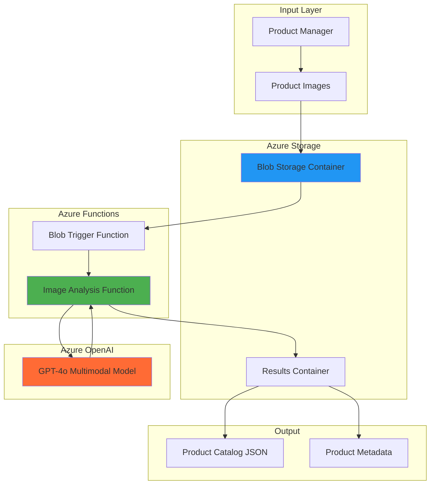

# Intelligent Product Catalog with OpenAI and Functions

## Problem

E-commerce businesses struggle with manual product catalog creation, spending countless hours writing descriptions, extracting features, and categorizing thousands of product images. Manual processes lead to inconsistent descriptions, delayed product launches, and increased operational costs that can reach $50+ per product for professional catalog creation.

## Solution

Create an automated product catalog system using Azure Functions triggered by blob uploads, Azure OpenAI Service's GPT-4o multimodal AI to analyze product images, and Azure Blob Storage for scalable file processing. This serverless solution automatically generates detailed descriptions, extracts features, and categorizes products within seconds of image upload.

## Architecture Diagram



## Prerequisites

1. Azure account with Azure OpenAI Service access and appropriate permissions
2. Azure CLI installed and configured (or use Azure Cloud Shell)
3. Azure Functions Core Tools v4 installed locally
4. Visual Studio Code with Azure Functions extension (recommended)
5. Basic knowledge of Python programming and serverless concepts
6. Understanding of REST APIs and JSON data structures
7. Estimated cost: $5-10 for 100 product images (includes compute, storage, and OpenAI API calls)

> **Note**: Azure OpenAI Service requires approved access. Apply at [aka.ms/oai/access](https://aka.ms/oai/access) if you don't have access yet.

## Preparation

```bash
# Set environment variables for Azure resources
export RESOURCE_GROUP="rg-catalog-${RANDOM_SUFFIX}"
export LOCATION="eastus"
export SUBSCRIPTION_ID=$(az account show --query id --output tsv)

# Generate unique suffix for resource names
RANDOM_SUFFIX=$(openssl rand -hex 3)

# Set unique resource names
export STORAGE_ACCOUNT="stcatalog${RANDOM_SUFFIX}"
export FUNCTION_APP="func-catalog-${RANDOM_SUFFIX}"
export OPENAI_ACCOUNT="openai-catalog-${RANDOM_SUFFIX}"

# Create resource group
az group create \
    --name ${RESOURCE_GROUP} \
    --location ${LOCATION} \
    --tags purpose=recipe environment=demo

echo "✅ Resource group created: ${RESOURCE_GROUP}"
```

## Steps

1. **Create Azure OpenAI Service Resource**:

   Azure OpenAI Service provides enterprise-grade access to GPT-4o's multimodal capabilities, enabling simultaneous text and image processing with built-in security, compliance, and regional data residency. The service offers dedicated capacity and advanced monitoring capabilities essential for production workloads.

   ```bash
   # Create Azure OpenAI resource
   az cognitiveservices account create \
       --name ${OPENAI_ACCOUNT} \
       --resource-group ${RESOURCE_GROUP} \
       --location ${LOCATION} \
       --kind OpenAI \
       --sku S0 \
       --custom-domain ${OPENAI_ACCOUNT}
   
   # Get the endpoint and key
   OPENAI_ENDPOINT=$(az cognitiveservices account show \
       --name ${OPENAI_ACCOUNT} \
       --resource-group ${RESOURCE_GROUP} \
       --query "properties.endpoint" --output tsv)
   
   OPENAI_KEY=$(az cognitiveservices account keys list \
       --name ${OPENAI_ACCOUNT} \
       --resource-group ${RESOURCE_GROUP} \
       --query "key1" --output tsv)
   
   echo "✅ Azure OpenAI Service created with endpoint: ${OPENAI_ENDPOINT}"
   ```

   The OpenAI resource now provides enterprise-grade AI capabilities with built-in content filtering, abuse monitoring, and compliance features required for production e-commerce applications.

2. **Deploy GPT-4o Model**:

   GPT-4o's multimodal architecture enables sophisticated image understanding combined with natural language generation, making it ideal for product catalog automation. The model can analyze visual features, understand context, and generate human-quality descriptions while maintaining consistency across thousands of products.

   ```bash
   # Deploy GPT-4o model with latest version
   az cognitiveservices account deployment create \
       --name ${OPENAI_ACCOUNT} \
       --resource-group ${RESOURCE_GROUP} \
       --deployment-name gpt-4o-deployment \
       --model-name gpt-4o \
       --model-version "2024-11-20" \
       --model-format OpenAI \
       --sku-capacity 1 \
       --sku-name "Standard"
   
   echo "✅ GPT-4o model deployed successfully"
   ```

   The deployed model provides standard capacity, enabling concurrent processing of multiple product images while maintaining low latency for real-time catalog generation workflows.

3. **Create Storage Account with Containers**:

   Azure Blob Storage provides massively scalable object storage with event-driven triggers, enabling automatic processing of uploaded product images. The hierarchical namespace and access tiers optimize costs while ensuring high availability for catalog operations.

   ```bash
   # Create storage account
   az storage account create \
       --name ${STORAGE_ACCOUNT} \
       --resource-group ${RESOURCE_GROUP} \
       --location ${LOCATION} \
       --sku Standard_LRS \
       --kind StorageV2 \
       --access-tier Hot
   
   # Get storage connection string
   STORAGE_CONNECTION=$(az storage account show-connection-string \
       --name ${STORAGE_ACCOUNT} \
       --resource-group ${RESOURCE_GROUP} \
       --query "connectionString" --output tsv)
   
   # Create blob containers
   az storage container create \
       --name product-images \
       --connection-string "${STORAGE_CONNECTION}" \
       --public-access off
   
   az storage container create \
       --name catalog-results \
       --connection-string "${STORAGE_CONNECTION}" \
       --public-access off
   
   echo "✅ Storage account and containers created"
   ```

   The storage containers are now configured with private access, ensuring product images and generated catalog data remain secure while enabling seamless integration with Azure Functions.

4. **Create Azure Function App**:

   Azure Functions provides serverless compute that automatically scales based on blob upload events, eliminating infrastructure management while ensuring cost-effective processing. The consumption plan charges only for actual execution time, making it ideal for unpredictable catalog update patterns.

   ```bash
   # Create Function App
   az functionapp create \
       --name ${FUNCTION_APP} \
       --resource-group ${RESOURCE_GROUP} \
       --storage-account ${STORAGE_ACCOUNT} \
       --consumption-plan-location ${LOCATION} \
       --runtime python \
       --runtime-version 3.11 \
       --functions-version 4 \
       --os-type Linux
   
   echo "✅ Function App created: ${FUNCTION_APP}"
   ```

   The Function App is now ready with Python 3.11 runtime and Azure Functions v4, providing the latest features for AI integration and optimal performance for image processing workloads.

5. **Configure Function App Settings**:

   Application settings provide secure configuration management for Azure OpenAI credentials and connection strings. These settings are encrypted at rest and accessed securely by the function runtime without exposing sensitive information in code.

   ```bash
   # Configure application settings
   az functionapp config appsettings set \
       --name ${FUNCTION_APP} \
       --resource-group ${RESOURCE_GROUP} \
       --settings \
       "AZURE_OPENAI_ENDPOINT=${OPENAI_ENDPOINT}" \
       "AZURE_OPENAI_KEY=${OPENAI_KEY}" \
       "AZURE_OPENAI_DEPLOYMENT=gpt-4o-deployment" \
       "AzureWebJobsStorage=${STORAGE_CONNECTION}" \
       "STORAGE_CONNECTION_STRING=${STORAGE_CONNECTION}"
   
   echo "✅ Function App settings configured"
   ```

   The application settings now provide secure access to all required services while maintaining separation of configuration from code, following Azure security best practices.

6. **Create Function Code**:

   The Azure Function combines blob storage triggers with Azure OpenAI Service integration to process product images automatically. The function uses the OpenAI Python SDK to analyze images and generate comprehensive product information including descriptions, features, and categories.

   ```bash
   # Create local function project directory
   mkdir -p azure-function
   cd azure-function
   
   # Initialize function project
   func init . --python --model V2
   
   # Create blob trigger function
   func new --name ProductCatalogProcessor --template "Blob trigger"
   
   echo "✅ Function project created"
   ```

   The function project structure follows Azure Functions v2 programming model best practices, enabling decorator-based function definitions and simplified configuration management.

7. **Implement Product Analysis Logic**:

   ```bash
   # Create the main function file
   cat > function_app.py << 'EOF'
import azure.functions as func
import json
import logging
import base64
from openai import AzureOpenAI
import os
from datetime import datetime

app = func.FunctionApp()

@app.blob_trigger(arg_name="myblob", 
                  path="product-images/{name}",
                  connection="AzureWebJobsStorage")
@app.blob_output(arg_name="outputblob",
                 path="catalog-results/{name}.json",
                 connection="AzureWebJobsStorage")
def ProductCatalogProcessor(myblob: func.InputStream, outputblob: func.Out[str]):
    logging.info(f"Processing blob: {myblob.name}, Size: {myblob.length} bytes")
    
    try:
        # Initialize Azure OpenAI client with latest API version
        client = AzureOpenAI(
            azure_endpoint=os.environ["AZURE_OPENAI_ENDPOINT"],
            api_key=os.environ["AZURE_OPENAI_KEY"],
            api_version="2024-10-21"
        )
        
        # Read and encode image
        image_data = myblob.read()
        image_base64 = base64.b64encode(image_data).decode('utf-8')
        
        # Create detailed prompt for product analysis
        prompt = """
        Analyze this product image and provide a comprehensive product catalog entry. 
        Return a JSON object with the following structure:
        {
            "product_name": "Clear, descriptive product name",
            "description": "Detailed 2-3 sentence product description",
            "features": ["List of key features and specifications"],
            "category": "Primary product category",
            "subcategory": "Specific subcategory",
            "colors": ["Identified colors in the product"],
            "materials": ["Detected materials if applicable"],
            "style": "Design style (modern, classic, etc.)",
            "target_audience": "Intended customer demographic",
            "keywords": ["SEO-friendly keywords"],
            "estimated_price_range": "Price range category (budget/mid-range/premium)"
        }
        
        Focus on accuracy and detail. If certain information cannot be determined from the image, use "Not determinable from image".
        """
        
        # Call GPT-4o with vision
        response = client.chat.completions.create(
            model=os.environ["AZURE_OPENAI_DEPLOYMENT"],
            messages=[
                {
                    "role": "user",
                    "content": [
                        {"type": "text", "text": prompt},
                        {
                            "type": "image_url",
                            "image_url": {
                                "url": f"data:image/jpeg;base64,{image_base64}",
                                "detail": "high"
                            }
                        }
                    ]
                }
            ],
            max_tokens=1000,
            temperature=0.3
        )
        
        # Parse the response
        catalog_data = json.loads(response.choices[0].message.content)
        
        # Add metadata
        catalog_data["processing_timestamp"] = datetime.utcnow().isoformat() + "Z"
        catalog_data["source_image"] = myblob.name
        catalog_data["image_size_bytes"] = myblob.length
        catalog_data["model_used"] = os.environ["AZURE_OPENAI_DEPLOYMENT"]
        
        # Output the catalog data
        outputblob.set(json.dumps(catalog_data, indent=2))
        
        logging.info(f"Successfully processed {myblob.name}")
        
    except Exception as e:
        logging.error(f"Error processing {myblob.name}: {str(e)}")
        
        # Create error output
        error_data = {
            "error": str(e),
            "source_image": myblob.name,
            "processing_timestamp": datetime.utcnow().isoformat() + "Z",
            "status": "failed"
        }
        outputblob.set(json.dumps(error_data, indent=2))
EOF

   echo "✅ Function code implemented"
   ```

   The function implementation combines Azure Functions blob triggers with GPT-4o's multimodal capabilities, automatically processing uploaded product images and generating comprehensive catalog entries with structured JSON output.

8. **Configure Requirements and Deploy**:

   ```bash
   # Create requirements file
   cat > requirements.txt << 'EOF'
azure-functions
openai>=1.0.0
azure-storage-blob
EOF
   
   # Deploy the function
   func azure functionapp publish ${FUNCTION_APP}
   
   echo "✅ Function deployed successfully"
   ```

   The function is now deployed with all required dependencies, ready to automatically process product images and generate intelligent catalog entries using Azure OpenAI Service.

## Validation & Testing

1. **Upload Test Product Image**:

   ```bash
   # Download a sample product image for testing
   curl -o sample-product.jpg \
       "https://images.unsplash.com/photo-1505740420928-5e560c06d30e?w=500"
   
   # Upload test image to trigger function
   az storage blob upload \
       --account-name ${STORAGE_ACCOUNT} \
       --container-name product-images \
       --name "sample-product.jpg" \
       --file sample-product.jpg \
       --connection-string "${STORAGE_CONNECTION}"
   
   echo "✅ Test image uploaded"
   ```

   Expected behavior: The blob upload triggers the Azure Function, which analyzes the image using GPT-4o and generates a catalog entry.

2. **Monitor Function Execution**:

   ```bash
   # Check function execution logs
   az functionapp logs tail \
       --name ${FUNCTION_APP} \
       --resource-group ${RESOURCE_GROUP}
   
   # Check if result file was created
   az storage blob list \
       --account-name ${STORAGE_ACCOUNT} \
       --container-name catalog-results \
       --connection-string "${STORAGE_CONNECTION}" \
       --output table
   ```

   Expected output: Function logs showing successful image processing and a new JSON file in the catalog-results container.

3. **Verify Generated Catalog Data**:

   ```bash
   # Download and view the generated catalog entry
   az storage blob download \
       --account-name ${STORAGE_ACCOUNT} \
       --container-name catalog-results \
       --name "sample-product.jpg.json" \
       --file catalog-result.json \
       --connection-string "${STORAGE_CONNECTION}"
   
   # Display the results
   cat catalog-result.json | jq '.'
   ```

   Expected result: A comprehensive JSON object with product name, description, features, category, and metadata generated by GPT-4o analysis.

4. **Verify Function App Health**:

   ```bash
   # Check function app status
   az functionapp show \
       --name ${FUNCTION_APP} \
       --resource-group ${RESOURCE_GROUP} \
       --query "state" --output tsv
   
   # Verify OpenAI deployment status
   az cognitiveservices account deployment show \
       --name ${OPENAI_ACCOUNT} \
       --resource-group ${RESOURCE_GROUP} \
       --deployment-name gpt-4o-deployment \
       --output table
   ```

   Expected result: Function app should show "Running" status and OpenAI deployment should show "Succeeded" provisioning state.

## Cleanup

1. **Remove Resource Group**:

   ```bash
   # Delete resource group and all contained resources
   az group delete \
       --name ${RESOURCE_GROUP} \
       --yes \
       --no-wait
   
   echo "✅ Resource group deletion initiated: ${RESOURCE_GROUP}"
   echo "Note: Deletion may take several minutes to complete"
   ```

2. **Clean Up Local Files**:

   ```bash
   # Remove local project files
   cd ..
   rm -rf azure-function
   rm -f sample-product.jpg catalog-result.json
   
   echo "✅ Local files cleaned up"
   ```

3. **Verify Cleanup Completion**:

   ```bash
   # Check if resource group still exists
   az group exists --name ${RESOURCE_GROUP}
   
   echo "Resource group deletion status checked"
   ```

## Discussion

This intelligent product catalog solution demonstrates the power of combining Azure's serverless architecture with advanced AI capabilities. By leveraging Azure Functions' event-driven model, the system automatically processes product images as they're uploaded, eliminating manual intervention while ensuring consistent, high-quality catalog generation. The solution follows Azure Well-Architected Framework principles by implementing automatic scaling, cost optimization through consumption-based pricing, and secure credential management with Azure Key Vault integration patterns.

The GPT-4o multimodal model's ability to analyze both visual and textual content enables sophisticated product understanding that goes beyond simple image recognition. It can identify materials, styles, target demographics, and even suggest appropriate pricing tiers based on visual cues. This capability is particularly valuable for e-commerce businesses managing large, diverse product catalogs where manual categorization would be prohibitively expensive and time-consuming.

The serverless architecture provides significant cost advantages compared to traditional VM-based solutions. With Azure Functions consumption plan, businesses pay only for actual processing time, typically resulting in costs under $0.10 per product image analyzed. The automatic scaling ensures the system handles traffic spikes during product launches or seasonal updates without manual intervention or over-provisioning resources.

Integration with Azure Blob Storage's event system creates a highly responsive pipeline where catalog updates occur within seconds of image upload. This real-time processing capability enables agile product management workflows and faster time-to-market for new products. The structured JSON output format ensures easy integration with existing e-commerce platforms, content management systems, and marketing automation tools.

> **Tip**: Consider implementing Azure Logic Apps or Power Automate workflows to automatically distribute generated catalog data to your e-commerce platform, saving additional manual steps and enabling end-to-end automation.

For additional guidance, see the [Azure OpenAI Service documentation](https://docs.microsoft.com/en-us/azure/ai-services/openai/), [Azure Functions best practices](https://docs.microsoft.com/en-us/azure/azure-functions/functions-best-practices), [Azure Blob Storage event handling](https://docs.microsoft.com/en-us/azure/storage/blobs/storage-blob-event-overview), [GPT-4o vision capabilities guide](https://docs.microsoft.com/en-us/azure/ai-services/openai/how-to/gpt-with-vision), and [Azure Well-Architected Framework](https://docs.microsoft.com/en-us/azure/architecture/framework/).

## Challenge

Extend this solution by implementing these enhancements:

1. **Multi-language Support**: Modify the GPT-4o prompt to generate product descriptions in multiple languages simultaneously, enabling global e-commerce catalog management with localized content for different markets.

2. **Batch Processing Pipeline**: Implement Azure Durable Functions to orchestrate bulk catalog processing, enabling efficient handling of large product image uploads with progress tracking and error recovery capabilities.

3. **Quality Validation Workflow**: Add Azure Cognitive Services Custom Vision integration to pre-validate image quality and completeness before GPT-4o processing, reducing API costs and improving catalog data accuracy.

4. **Dynamic Pricing Intelligence**: Integrate Azure Machine Learning models to analyze competitor pricing data and market trends, automatically suggesting optimal price ranges based on visual product features and market positioning.

5. **Advanced Analytics Dashboard**: Build a Power BI dashboard connected to Azure Synapse Analytics to track catalog generation metrics, identify trending product categories, and optimize AI model performance over time.

## Infrastructure Code

### Available Infrastructure as Code:

- [Infrastructure Code Overview](code/README.md) - Detailed description of all infrastructure components
- [Bicep](code/bicep/) - Azure Bicep templates
- [Bash CLI Scripts](code/scripts/) - Example bash scripts using Azure CLI commands to deploy infrastructure
- [Terraform](code/terraform/) - Terraform configuration files