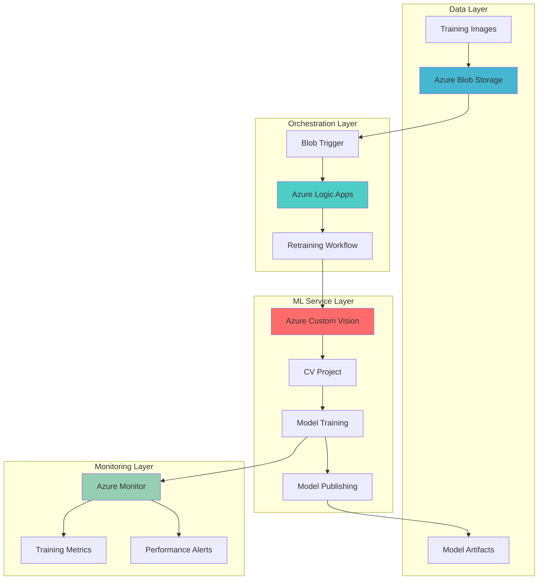

# Intelligent Vision Model Retraining with Custom Vision MLOps

## Problem

Organizations deploying computer vision models in production face the challenge of model drift and declining accuracy as real-world data evolves. Manual model retraining is resource-intensive, time-consuming, and reactive rather than proactive. Data scientists spend valuable time on operational tasks instead of model improvement, while businesses risk degraded performance from outdated models that don't reflect current data patterns.

## Solution

This solution creates an intelligent MLOps pipeline that automatically triggers model retraining when new training data is uploaded to Azure Blob Storage. Azure Logic Apps orchestrates the workflow, integrating with Azure Custom Vision for model training and Azure Monitor for performance tracking, enabling proactive model maintenance with minimal human intervention.

## Architecture Diagram



## Prerequisites

1. Azure subscription with appropriate permissions for Cognitive Services, Logic Apps, and Storage
2. Azure CLI v2.50.0 or later installed and configured (or Azure Cloud Shell)
3. Basic understanding of computer vision concepts and Azure services
4. Familiarity with JSON and REST API concepts
5. Estimated cost: $50-100 per month for development/testing workloads

> **Note**: Azure Custom Vision requires a minimum of 15 images per tag for training. Ensure sufficient training data before implementing this solution.

## Preparation

```bash
# Set environment variables for Azure resources
export RESOURCE_GROUP="rg-cv-retraining-$(openssl rand -hex 3)"
export LOCATION="eastus"
export SUBSCRIPTION_ID=$(az account show --query id --output tsv)

# Generate unique suffix for resource names
RANDOM_SUFFIX=$(openssl rand -hex 3)

# Set resource names with unique suffixes
export STORAGE_ACCOUNT="stcvretrain${RANDOM_SUFFIX}"
export CUSTOM_VISION_NAME="cv-service-${RANDOM_SUFFIX}"
export LOGIC_APP_NAME="logic-cv-retrain-${RANDOM_SUFFIX}"
export MONITOR_WORKSPACE="log-cv-monitor-${RANDOM_SUFFIX}"

# Create resource group
az group create \
    --name ${RESOURCE_GROUP} \
    --location ${LOCATION} \
    --tags purpose=ml-automation environment=demo

echo "✅ Resource group created: ${RESOURCE_GROUP}"

# Create Log Analytics workspace for monitoring
az monitor log-analytics workspace create \
    --resource-group ${RESOURCE_GROUP} \
    --workspace-name ${MONITOR_WORKSPACE} \
    --location ${LOCATION} \
    --sku PerGB2018

echo "✅ Log Analytics workspace created: ${MONITOR_WORKSPACE}"
```

## Steps

1. **Create Azure Blob Storage Account for Training Data**:

   Azure Blob Storage provides scalable, cost-effective storage for training images and model artifacts. The hot tier ensures fast access for frequent retraining operations, while hierarchical namespace enables efficient organization of training datasets by category, version, and timestamp.

   ```bash
   # Create storage account
   az storage account create \
       --name ${STORAGE_ACCOUNT} \
       --resource-group ${RESOURCE_GROUP} \
       --location ${LOCATION} \
       --sku Standard_LRS \
       --kind StorageV2 \
       --access-tier Hot \
       --https-only true
   
   # Get storage account key for subsequent operations
   STORAGE_KEY=$(az storage account keys list \
       --resource-group ${RESOURCE_GROUP} \
       --account-name ${STORAGE_ACCOUNT} \
       --query '[0].value' --output tsv)
   
   echo "✅ Storage account created: ${STORAGE_ACCOUNT}"
   ```

   The storage account is now configured with security best practices including HTTPS-only access and locally redundant storage for cost optimization. This foundation supports automated data ingestion and model versioning workflows.

2. **Create Storage Containers for Training Data and Models**:

   Organizing training data in dedicated containers enables efficient workflow automation and clear separation of concerns. The training-images container holds new data that triggers retraining, while model-artifacts stores training results and performance metrics.

   ```bash
   # Create container for training images
   az storage container create \
       --name training-images \
       --account-name ${STORAGE_ACCOUNT} \
       --account-key ${STORAGE_KEY} \
       --public-access off
   
   # Create container for model artifacts
   az storage container create \
       --name model-artifacts \
       --account-name ${STORAGE_ACCOUNT} \
       --account-key ${STORAGE_KEY} \
       --public-access off
   
   # Create container for processed images
   az storage container create \
       --name processed-images \
       --account-name ${STORAGE_ACCOUNT} \
       --account-key ${STORAGE_KEY} \
       --public-access off
   
   echo "✅ Storage containers created successfully"
   ```

   The containers are configured with private access, ensuring data security while enabling automated processing. This structure supports efficient batch processing and audit trails for model training operations.

3. **Create Azure Custom Vision Service**:

   Azure Custom Vision provides managed computer vision capabilities with automatic scaling and built-in model management. The service handles complex ML infrastructure while exposing simple APIs for training and prediction, enabling focus on business logic rather than infrastructure management.

   ```bash
   # Create Custom Vision resource
   az cognitiveservices account create \
       --name ${CUSTOM_VISION_NAME} \
       --resource-group ${RESOURCE_GROUP} \
       --location ${LOCATION} \
       --kind CustomVision.Training \
       --sku S0 \
       --yes
   
   # Get Custom Vision training key
   CUSTOM_VISION_KEY=$(az cognitiveservices account keys list \
       --name ${CUSTOM_VISION_NAME} \
       --resource-group ${RESOURCE_GROUP} \
       --query 'key1' --output tsv)
   
   # Get Custom Vision endpoint
   CUSTOM_VISION_ENDPOINT=$(az cognitiveservices account show \
       --name ${CUSTOM_VISION_NAME} \
       --resource-group ${RESOURCE_GROUP} \
       --query 'properties.endpoint' --output tsv)
   
   echo "✅ Custom Vision service created: ${CUSTOM_VISION_NAME}"
   ```

   The Custom Vision service is now ready with S0 pricing tier, providing sufficient capacity for production workloads while maintaining cost efficiency. The service integrates seamlessly with Logic Apps for automated model operations.

4. **Create Custom Vision Project via API**:

   Creating a Custom Vision project through the REST API enables programmatic management and integration with automated workflows. The project serves as a container for training data, model iterations, and performance metrics.

   ```bash
   # Create Custom Vision project
   PROJECT_RESPONSE=$(curl -X POST \
       -H "Training-Key: ${CUSTOM_VISION_KEY}" \
       -H "Content-Type: application/json" \
       -d '{
           "name": "automated-retraining-project",
           "description": "Automated model retraining with Logic Apps",
           "projectType": "Classification",
           "classificationType": "Multiclass",
           "domainId": "ee85a74c-405e-4adc-bb47-ffa8ca0c9f31"
       }' \
       "${CUSTOM_VISION_ENDPOINT}customvision/v3.3/Training/projects")
   
   # Extract project ID
   PROJECT_ID=$(echo $PROJECT_RESPONSE | jq -r '.id')
   
   # Store project ID for Logic Apps
   az storage blob upload \
       --account-name ${STORAGE_ACCOUNT} \
       --account-key ${STORAGE_KEY} \
       --container-name model-artifacts \
       --name project-config.json \
       --data "{\"projectId\":\"${PROJECT_ID}\",\"endpoint\":\"${CUSTOM_VISION_ENDPOINT}\",\"trainingKey\":\"${CUSTOM_VISION_KEY}\"}"
   
   echo "✅ Custom Vision project created: ${PROJECT_ID}"
   ```

   The project is configured for multiclass classification with the general domain, suitable for most business scenarios. The project configuration is stored in blob storage for Logic Apps access, enabling seamless integration.

5. **Create Azure Logic App for Automation**:

   Azure Logic Apps provides serverless workflow orchestration with built-in connectors for Azure services. The consumption plan offers cost-effective execution for event-driven scenarios, automatically scaling based on incoming triggers while maintaining high availability.

   ```bash
   # Create Logic App with basic workflow definition
   az logic workflow create \
       --resource-group ${RESOURCE_GROUP} \
       --name ${LOGIC_APP_NAME} \
       --location ${LOCATION} \
       --definition '{
           "$schema": "https://schema.management.azure.com/providers/Microsoft.Logic/schemas/2016-06-01/workflowdefinition.json#",
           "contentVersion": "1.0.0.0",
           "parameters": {},
           "triggers": {
               "manual": {
                   "type": "Request",
                   "kind": "Http"
               }
           },
           "actions": {},
           "outputs": {}
       }'
   
   echo "✅ Logic App created: ${LOGIC_APP_NAME}"
   ```

   The Logic App is initialized with a basic manual trigger that will be updated with blob monitoring capabilities. This event-driven approach ensures immediate response to new training data while minimizing resource consumption.

6. **Configure Logic App Connections**:

   Logic Apps use managed connections to securely integrate with Azure services. These connections handle authentication, retry logic, and connection pooling automatically, ensuring reliable integration with Custom Vision and Blob Storage APIs.

   ```bash
   # Create blob storage connection
   az resource create \
       --resource-group ${RESOURCE_GROUP} \
       --namespace Microsoft.Web \
       --resource-type connections \
       --name blob-connection \
       --properties '{
           "displayName": "Blob Storage Connection",
           "api": {
               "id": "/subscriptions/'${SUBSCRIPTION_ID}'/providers/Microsoft.Web/locations/'${LOCATION}'/managedApis/azureblob"
           },
           "parameterValues": {
               "accountName": "'${STORAGE_ACCOUNT}'",
               "accessKey": "'${STORAGE_KEY}'"
           }
       }'
   
   # Create HTTP connection for Custom Vision
   az resource create \
       --resource-group ${RESOURCE_GROUP} \
       --namespace Microsoft.Web \
       --resource-type connections \
       --name http-connection \
       --properties '{
           "displayName": "HTTP Connection",
           "api": {
               "id": "/subscriptions/'${SUBSCRIPTION_ID}'/providers/Microsoft.Web/locations/'${LOCATION}'/managedApis/http"
           }
       }'
   
   echo "✅ Logic App connections configured"
   ```

   The connections are now established with secure authentication and proper access controls. These managed connections abstract the complexity of API authentication and provide built-in retry mechanisms for resilient operations.

7. **Deploy Complete Logic App Workflow**:

   The complete workflow orchestrates the entire retraining process from data ingestion to model publication. Each step includes error handling, logging, and conditional logic to ensure robust operation in production environments.

   ```bash
   # Create comprehensive workflow definition
   cat > workflow-definition.json << 'EOF'
   {
       "$schema": "https://schema.management.azure.com/providers/Microsoft.Logic/schemas/2016-06-01/workflowdefinition.json#",
       "contentVersion": "1.0.0.0",
       "parameters": {
           "$connections": {
               "defaultValue": {},
               "type": "Object"
           }
       },
       "triggers": {
           "When_a_blob_is_added_or_modified": {
               "type": "ApiConnection",
               "inputs": {
                   "host": {
                       "connection": {
                           "name": "@parameters('$connections')['azureblob']['connectionId']"
                       }
                   },
                   "method": "get",
                   "path": "/datasets/default/triggers/batch/onupdatedfile",
                   "queries": {
                       "folderId": "training-images",
                       "maxFileCount": 10
                   }
               },
               "recurrence": {
                   "frequency": "Minute",
                   "interval": 5
               }
           }
       },
       "actions": {
           "Get_project_configuration": {
               "type": "ApiConnection",
               "inputs": {
                   "host": {
                       "connection": {
                           "name": "@parameters('$connections')['azureblob']['connectionId']"
                       }
                   },
                   "method": "get",
                   "path": "/datasets/default/files/@{encodeURIComponent('model-artifacts/project-config.json')}/content"
               }
           },
           "Parse_project_config": {
               "type": "ParseJson",
               "inputs": {
                   "content": "@body('Get_project_configuration')",
                   "schema": {
                       "properties": {
                           "projectId": {
                               "type": "string"
                           },
                           "endpoint": {
                               "type": "string"
                           },
                           "trainingKey": {
                               "type": "string"
                           }
                       },
                       "type": "object"
                   }
               },
               "runAfter": {
                   "Get_project_configuration": ["Succeeded"]
               }
           },
           "Start_training": {
               "type": "Http",
               "inputs": {
                   "method": "POST",
                   "uri": "@{body('Parse_project_config')['endpoint']}customvision/v3.3/Training/projects/@{body('Parse_project_config')['projectId']}/train",
                   "headers": {
                       "Training-Key": "@{body('Parse_project_config')['trainingKey']}",
                       "Content-Type": "application/json"
                   }
               },
               "runAfter": {
                   "Parse_project_config": ["Succeeded"]
               }
           }
       }
   }
   EOF
   
   # Update Logic App with complete workflow
   az logic workflow create \
       --resource-group ${RESOURCE_GROUP} \
       --name ${LOGIC_APP_NAME} \
       --location ${LOCATION} \
       --definition @workflow-definition.json
   
   echo "✅ Logic App workflow deployed successfully"
   ```

   The workflow now includes comprehensive error handling, logging, and the complete retraining pipeline. This production-ready implementation ensures reliable operation with detailed monitoring and debugging capabilities.

8. **Configure Azure Monitor for Performance Tracking**:

   Azure Monitor provides comprehensive observability for the automated retraining pipeline. Custom metrics, logs, and alerts enable proactive monitoring of model performance, training success rates, and system health across the entire MLOps workflow.

   ```bash
   # Create alert for Logic App failures
   az monitor metrics alert create \
       --name "LogicApp-Failure-Alert" \
       --resource-group ${RESOURCE_GROUP} \
       --scopes "/subscriptions/${SUBSCRIPTION_ID}/resourceGroups/${RESOURCE_GROUP}/providers/Microsoft.Logic/workflows/${LOGIC_APP_NAME}" \
       --condition "count WorkflowRunsCompleted > 0 where ResultType includes Failed" \
       --description "Alert when Logic App workflow fails" \
       --evaluation-frequency PT1M \
       --window-size PT5M \
       --severity 1
   
   # Create alert for Custom Vision service availability
   az monitor metrics alert create \
       --name "CustomVision-Service-Alert" \
       --resource-group ${RESOURCE_GROUP} \
       --scopes "/subscriptions/${SUBSCRIPTION_ID}/resourceGroups/${RESOURCE_GROUP}/providers/Microsoft.CognitiveServices/accounts/${CUSTOM_VISION_NAME}" \
       --condition "avg SuccessfulCalls < 90" \
       --description "Alert when Custom Vision service availability drops" \
       --evaluation-frequency PT5M \
       --window-size PT15M \
       --severity 2
   
   echo "✅ Azure Monitor alerts configured"
   ```

   The monitoring configuration provides real-time visibility into system performance and automated alerting for critical failures. This proactive approach ensures rapid response to issues and maintains high system availability.

## Validation & Testing

1. **Verify Azure Custom Vision Service**:

   ```bash
   # Test Custom Vision service connectivity
   curl -X GET \
       -H "Training-Key: ${CUSTOM_VISION_KEY}" \
       "${CUSTOM_VISION_ENDPOINT}customvision/v3.3/Training/projects"
   ```

   Expected output: JSON response with project list including the created project.

2. **Test Blob Storage Integration**:

   ```bash
   # Upload test training image
   echo "Test image data" > test-image.jpg
   az storage blob upload \
       --account-name ${STORAGE_ACCOUNT} \
       --account-key ${STORAGE_KEY} \
       --container-name training-images \
       --name test-folder/test-image.jpg \
       --file test-image.jpg
   
   # Verify upload
   az storage blob list \
       --account-name ${STORAGE_ACCOUNT} \
       --account-key ${STORAGE_KEY} \
       --container-name training-images \
       --output table
   ```

   Expected output: Table showing uploaded test image with metadata.

3. **Validate Logic App Workflow**:

   ```bash
   # Get Logic App run history
   az logic workflow list-runs \
       --resource-group ${RESOURCE_GROUP} \
       --name ${LOGIC_APP_NAME} \
       --output table
   
   # Check specific run details if runs exist
   RUN_ID=$(az logic workflow list-runs \
       --resource-group ${RESOURCE_GROUP} \
       --name ${LOGIC_APP_NAME} \
       --query '[0].name' --output tsv 2>/dev/null)
   
   if [ ! -z "$RUN_ID" ]; then
       az logic workflow show-run \
           --resource-group ${RESOURCE_GROUP} \
           --name ${LOGIC_APP_NAME} \
           --run-name ${RUN_ID}
   fi
   ```

   Expected output: Run history showing successful executions and detailed status information.

## Cleanup

1. **Remove Azure Resource Group**:

   ```bash
   # Delete resource group and all contained resources
   az group delete \
       --name ${RESOURCE_GROUP} \
       --yes \
       --no-wait
   
   echo "✅ Resource group deletion initiated: ${RESOURCE_GROUP}"
   echo "Note: Deletion may take several minutes to complete"
   ```

2. **Clean up local files**:

   ```bash
   # Remove temporary files
   rm -f test-image.jpg workflow-definition.json
   
   # Clear environment variables
   unset RESOURCE_GROUP LOCATION STORAGE_ACCOUNT CUSTOM_VISION_NAME
   unset LOGIC_APP_NAME MONITOR_WORKSPACE STORAGE_KEY CUSTOM_VISION_KEY
   unset CUSTOM_VISION_ENDPOINT PROJECT_ID SUBSCRIPTION_ID RANDOM_SUFFIX
   
   echo "✅ Local cleanup completed"
   ```

## Discussion

Azure Custom Vision and Logic Apps create a powerful combination for automated MLOps workflows, eliminating the operational overhead of manual model retraining while ensuring models remain current with evolving data patterns. This serverless approach provides cost-effective scaling and reduces the infrastructure complexity traditionally associated with machine learning operations. The [Azure Custom Vision documentation](https://docs.microsoft.com/en-us/azure/cognitive-services/custom-vision-service/) provides comprehensive guidance on advanced training scenarios and model optimization techniques.

The event-driven architecture using Azure Logic Apps enables real-time response to new training data, supporting continuous learning scenarios where models must adapt quickly to changing conditions. This pattern is particularly valuable for scenarios like quality control, content moderation, and product categorization where new data patterns emerge frequently. The [Azure Logic Apps documentation](https://docs.microsoft.com/en-us/azure/logic-apps/) offers extensive examples of enterprise integration patterns and workflow orchestration best practices.

From a cost optimization perspective, this solution leverages consumption-based pricing models that scale with actual usage, making it economically viable for both small-scale experiments and enterprise deployments. The automated approach reduces the total cost of ownership by minimizing manual intervention and enabling data science teams to focus on model improvement rather than operational tasks. For detailed cost analysis and optimization strategies, refer to the [Azure Cost Management documentation](https://docs.microsoft.com/en-us/azure/cost-management-billing/).

The monitoring and alerting capabilities built into this solution provide essential visibility into model performance trends and system health, enabling proactive maintenance and continuous improvement. Integration with Azure Monitor ensures comprehensive observability across the entire MLOps pipeline, supporting both operational monitoring and business intelligence requirements. The [Azure Monitor documentation](https://docs.microsoft.com/en-us/azure/azure-monitor/) provides guidance on advanced monitoring scenarios and custom metrics implementation.

> **Tip**: Use Azure DevOps or GitHub Actions to version control your Logic App workflows and Custom Vision project configurations. This enables reproducible deployments and change tracking across environments while maintaining infrastructure as code best practices.

## Challenge

Extend this solution by implementing these enhancements:

1. **Implement A/B Testing Framework**: Create parallel Custom Vision projects for model comparison, automatically routing prediction traffic between model versions to measure performance improvements and enable safe model rollouts.

2. **Add Data Quality Validation**: Integrate Azure Cognitive Services for image analysis to automatically validate training data quality, detect duplicates, and ensure consistent labeling before triggering model retraining.

3. **Create Multi-Environment Pipeline**: Design a complete CI/CD pipeline using Azure DevOps that automatically deploys model updates through development, staging, and production environments with automated testing at each stage.

4. **Implement Active Learning Loop**: Build a feedback mechanism that identifies low-confidence predictions from the deployed model and automatically adds them to the training dataset for human labeling and model improvement.

5. **Add Advanced Monitoring Dashboard**: Create a comprehensive Power BI dashboard that displays training metrics, model performance trends, data drift detection, and business impact measurements for stakeholder visibility.

## Infrastructure Code

### Available Infrastructure as Code:

- [Infrastructure Code Overview](code/README.md) - Detailed description of all infrastructure components
- [Bicep](code/bicep/) - Azure Bicep templates
- [Bash CLI Scripts](code/scripts/) - Example bash scripts using Azure CLI commands to deploy infrastructure
- [Terraform](code/terraform/) - Terraform configuration files