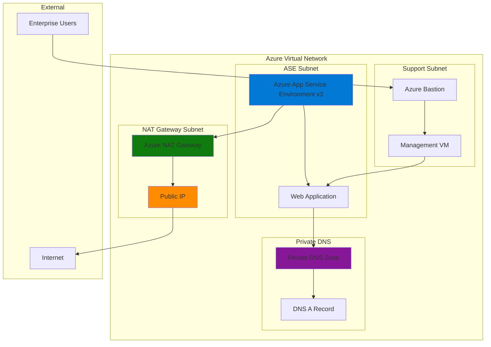

# Isolated Web Apps with Enterprise Security Controls

## Problem

Enterprise organizations require completely isolated web application hosting that eliminates shared multi-tenant infrastructure concerns while maintaining predictable outbound connectivity for regulatory compliance. Traditional Azure App Service's multi-tenant architecture doesn't provide the network isolation needed for sensitive workloads, lacks control over outbound IP addresses, and cannot integrate with private DNS zones for internal service discovery. Organizations need a solution that provides dedicated compute resources, private network integration, and internal DNS resolution for enterprise-grade security and compliance requirements.

## Solution

Azure App Service Environment v3 (ASEv3) provides a fully isolated, single-tenant Azure App Service deployment within your virtual network, delivering dedicated compute resources with complete network isolation. When combined with Azure Private DNS zones for internal service discovery and Azure NAT Gateway for predictable outbound connectivity, this architecture enables enterprise-grade web application hosting with full control over network traffic flow, internal DNS resolution, and regulatory compliance requirements.

## Architecture Diagram



## Prerequisites

1. Azure subscription with Owner or Contributor permissions for App Service Environment deployment
2. Azure CLI v2.50.0 or later installed and configured (or Azure Cloud Shell)
3. Understanding of Azure networking concepts (VNets, subnets, private DNS)
4. Familiarity with Azure App Service and enterprise security requirements
5. Knowledge of DNS management and network security principles
6. Estimated cost: $1,000-$2,000 per month for dedicated ASE infrastructure plus application resources

> **Warning**: Azure App Service Environment v3 incurs significant costs (~$1,000/month base) for dedicated infrastructure even when no applications are running. This solution is designed for enterprise workloads requiring complete isolation and dedicated resources.

## Preparation

```bash
# Set environment variables for Azure resources
export RESOURCE_GROUP="rg-ase-enterprise-${RANDOM_SUFFIX}"
export LOCATION="eastus"
export SUBSCRIPTION_ID=$(az account show --query id --output tsv)

# Generate unique suffix for resource names
RANDOM_SUFFIX=$(openssl rand -hex 3)

# Define resource names with enterprise naming convention
export VNET_NAME="vnet-ase-enterprise-${RANDOM_SUFFIX}"
export ASE_SUBNET_NAME="snet-ase-${RANDOM_SUFFIX}"
export NAT_SUBNET_NAME="snet-nat-${RANDOM_SUFFIX}"
export SUPPORT_SUBNET_NAME="snet-support-${RANDOM_SUFFIX}"
export BASTION_SUBNET_NAME="AzureBastionSubnet"
export ASE_NAME="ase-enterprise-${RANDOM_SUFFIX}"
export NAT_GATEWAY_NAME="nat-gateway-${RANDOM_SUFFIX}"
export PUBLIC_IP_NAME="pip-nat-${RANDOM_SUFFIX}"
export PRIVATE_DNS_ZONE="enterprise.internal"
export APP_SERVICE_PLAN_NAME="asp-enterprise-${RANDOM_SUFFIX}"
export WEB_APP_NAME="webapp-enterprise-${RANDOM_SUFFIX}"
export BASTION_NAME="bastion-${RANDOM_SUFFIX}"
export BASTION_PIP_NAME="pip-bastion-${RANDOM_SUFFIX}"

# Create resource group
az group create \
    --name ${RESOURCE_GROUP} \
    --location ${LOCATION} \
    --tags purpose=enterprise-isolation environment=production

echo "✅ Resource group created: ${RESOURCE_GROUP}"
echo "✅ Environment variables configured for enterprise deployment"
```

## Steps

1. **Create Virtual Network with Enterprise Subnets**:

   Enterprise networking requires careful subnet planning to isolate different components while maintaining security boundaries. Azure App Service Environment v3 requires a dedicated subnet with sufficient address space (/24 recommended) to support scaling operations. The NAT Gateway needs its own subnet for outbound traffic management, while support services like Azure Bastion require separate network isolation for secure management access.

   ```bash
   # Create virtual network with enterprise address space
   az network vnet create \
       --name ${VNET_NAME} \
       --resource-group ${RESOURCE_GROUP} \
       --location ${LOCATION} \
       --address-prefix 10.0.0.0/16 \
       --tags purpose=enterprise-isolation tier=network
   
   # Create subnet for App Service Environment (requires /24 minimum)
   az network vnet subnet create \
       --vnet-name ${VNET_NAME} \
       --resource-group ${RESOURCE_GROUP} \
       --name ${ASE_SUBNET_NAME} \
       --address-prefix 10.0.1.0/24 \
       --service-endpoints Microsoft.Storage Microsoft.KeyVault
   
   # Create subnet for NAT Gateway
   az network vnet subnet create \
       --vnet-name ${VNET_NAME} \
       --resource-group ${RESOURCE_GROUP} \
       --name ${NAT_SUBNET_NAME} \
       --address-prefix 10.0.2.0/24
   
   # Create subnet for support services
   az network vnet subnet create \
       --vnet-name ${VNET_NAME} \
       --resource-group ${RESOURCE_GROUP} \
       --name ${SUPPORT_SUBNET_NAME} \
       --address-prefix 10.0.3.0/24
   
   # Create Azure Bastion subnet for secure management
   az network vnet subnet create \
       --vnet-name ${VNET_NAME} \
       --resource-group ${RESOURCE_GROUP} \
       --name ${BASTION_SUBNET_NAME} \
       --address-prefix 10.0.4.0/26
   
   echo "✅ Virtual network and subnets created with enterprise segmentation"
   ```

   The virtual network is now configured with proper subnet segmentation following enterprise security principles. Each subnet serves a specific purpose: ASE for application hosting, NAT for outbound connectivity, support for management services, and Bastion for secure administrative access. This design provides network isolation while enabling controlled communication between services.

2. **Deploy Azure NAT Gateway for Predictable Outbound Connectivity**:

   Azure NAT Gateway provides enterprise-grade outbound internet connectivity with static public IP addresses, essential for regulatory compliance and firewall allowlisting. Unlike default Azure outbound connectivity which uses dynamic IPs, NAT Gateway ensures all outbound traffic from the App Service Environment uses predictable IP addresses. This is crucial for enterprise applications that need to connect to external services with IP-based access controls.

   ```bash
   # Create public IP for NAT Gateway with static allocation
   az network public-ip create \
       --name ${PUBLIC_IP_NAME} \
       --resource-group ${RESOURCE_GROUP} \
       --location ${LOCATION} \
       --allocation-method Static \
       --sku Standard \
       --tags purpose=nat-gateway tier=network
   
   # Create NAT Gateway for predictable outbound connectivity
   az network nat gateway create \
       --name ${NAT_GATEWAY_NAME} \
       --resource-group ${RESOURCE_GROUP} \
       --location ${LOCATION} \
       --public-ip-addresses ${PUBLIC_IP_NAME} \
       --idle-timeout 10 \
       --tags purpose=outbound-connectivity tier=network
   
   # Associate NAT Gateway with ASE subnet
   az network vnet subnet update \
       --name ${ASE_SUBNET_NAME} \
       --resource-group ${RESOURCE_GROUP} \
       --vnet-name ${VNET_NAME} \
       --nat-gateway ${NAT_GATEWAY_NAME}
   
   # Store NAT Gateway public IP for documentation
   export NAT_PUBLIC_IP=$(az network public-ip show \
       --name ${PUBLIC_IP_NAME} \
       --resource-group ${RESOURCE_GROUP} \
       --query ipAddress --output tsv)
   
   echo "✅ NAT Gateway configured with static IP: ${NAT_PUBLIC_IP}"
   ```

   The NAT Gateway is now providing predictable outbound connectivity for the App Service Environment. All outbound traffic from applications will use the static public IP address, enabling enterprises to configure external firewall rules, API allowlists, and compliance monitoring. This eliminates the unpredictability of Azure's default outbound connectivity and provides the control required for enterprise security policies.

3. **Create Azure Private DNS Zone for Internal Service Discovery**:

   Azure Private DNS provides enterprise-grade internal DNS resolution without requiring custom DNS infrastructure. Private DNS zones enable applications to use meaningful hostnames instead of IP addresses, supporting service discovery patterns and application configuration management. This is essential for enterprise applications that need to resolve internal services, databases, and APIs using private hostnames that don't resolve on the public internet.

   ```bash
   # Create private DNS zone for enterprise internal domain
   az network private-dns zone create \
       --name ${PRIVATE_DNS_ZONE} \
       --resource-group ${RESOURCE_GROUP} \
       --tags purpose=internal-dns tier=network
   
   # Link private DNS zone to virtual network
   az network private-dns link vnet create \
       --name "link-${VNET_NAME}" \
       --resource-group ${RESOURCE_GROUP} \
       --zone-name ${PRIVATE_DNS_ZONE} \
       --virtual-network ${VNET_NAME} \
       --registration-enabled false
   
   # Create initial A record for application
   az network private-dns record-set a create \
       --name "webapp" \
       --resource-group ${RESOURCE_GROUP} \
       --zone-name ${PRIVATE_DNS_ZONE} \
       --ttl 300
   
   echo "✅ Private DNS zone created: ${PRIVATE_DNS_ZONE}"
   echo "✅ DNS zone linked to virtual network for internal resolution"
   ```

   The private DNS zone is now configured to provide internal hostname resolution for enterprise applications. This enables service discovery patterns where applications can connect to internal services using hostnames like "webapp.enterprise.internal" instead of IP addresses. The DNS zone is linked to the virtual network with registration disabled to maintain manual control over DNS records for security and compliance purposes.

4. **Deploy Azure App Service Environment v3**:

   Azure App Service Environment v3 provides a completely isolated, single-tenant deployment of Azure App Service within your virtual network. This eliminates the shared infrastructure concerns of multi-tenant App Service while providing dedicated compute resources, custom networking, and enterprise-grade security. ASEv3 automatically manages front-end scaling to meet application needs without requiring manual configuration of scale factors.

   ```bash
   # Create App Service Environment v3 with internal load balancer
   az appservice ase create \
       --name ${ASE_NAME} \
       --resource-group ${RESOURCE_GROUP} \
       --subnet ${ASE_SUBNET_NAME} \
       --vnet-name ${VNET_NAME} \
       --kind ASEv3 \
       --virtual-ip-type Internal \
       --tags purpose=enterprise-isolation tier=compute
   
   echo "✅ App Service Environment v3 deployment initiated"
   echo "Note: ASE deployment takes 60-90 minutes to complete"
   
   # Wait for ASE to be ready (this will take substantial time)
   echo "Waiting for App Service Environment to be ready..."
   az appservice ase show \
       --name ${ASE_NAME} \
       --resource-group ${RESOURCE_GROUP} \
       --query "provisioningState" \
       --output tsv
   
   # Get ASE internal IP address once deployment completes
   export ASE_INTERNAL_IP=$(az appservice ase show \
       --name ${ASE_NAME} \
       --resource-group ${RESOURCE_GROUP} \
       --query "internalInboundIpAddress" \
       --output tsv)
   
   echo "✅ App Service Environment deployed with internal IP: ${ASE_INTERNAL_IP}"
   ```

   The App Service Environment v3 is now deploying with complete network isolation and dedicated compute resources. This provides the enterprise-grade security and compliance posture required for sensitive applications. The internal load balancer configuration ensures all application traffic remains within the virtual network, while the dedicated infrastructure eliminates noisy neighbor concerns and provides predictable performance characteristics.

5. **Create App Service Plan and Web Application**:

   App Service Plans in ASEv3 provide dedicated compute resources with enterprise-grade scaling capabilities. The Isolated v2 pricing tier offers enhanced performance with dedicated cores and memory, supporting high-memory applications and CPU-intensive workloads. This configuration ensures applications have predictable performance characteristics without competing for resources with other tenants.

   ```bash
   # Create App Service Plan in the ASE
   az appservice plan create \
       --name ${APP_SERVICE_PLAN_NAME} \
       --resource-group ${RESOURCE_GROUP} \
       --ase ${ASE_NAME} \
       --sku I1v2 \
       --is-linux false \
       --tags purpose=enterprise-app tier=compute
   
   # Create web application in the ASE
   az webapp create \
       --name ${WEB_APP_NAME} \
       --resource-group ${RESOURCE_GROUP} \
       --plan ${APP_SERVICE_PLAN_NAME} \
       --runtime "dotnet:8" \
       --tags purpose=enterprise-app tier=application
   
   # Configure application settings for enterprise requirements
   az webapp config appsettings set \
       --name ${WEB_APP_NAME} \
       --resource-group ${RESOURCE_GROUP} \
       --settings \
           "WEBSITE_DNS_SERVER=168.63.129.16" \
           "WEBSITE_VNET_ROUTE_ALL=1" \
           "ASPNETCORE_ENVIRONMENT=Production"
   
   echo "✅ Web application deployed to App Service Environment"
   echo "✅ Enterprise configuration applied"
   ```

   The web application is now running on dedicated infrastructure within the isolated App Service Environment. The application has access to the full capabilities of Azure App Service while maintaining complete network isolation. The configuration ensures all outbound traffic is routed through the NAT Gateway and DNS resolution uses the private DNS zone for internal services.

6. **Configure Private DNS Records for Application**:

   Private DNS records enable internal service discovery and application routing within the enterprise network. By creating DNS records that point to the App Service Environment's internal IP address, applications and services can access the web application using meaningful hostnames instead of IP addresses. This supports enterprise patterns for configuration management and service discovery.

   ```bash
   # Update private DNS A record with ASE internal IP
   az network private-dns record-set a add-record \
       --record-set-name "webapp" \
       --resource-group ${RESOURCE_GROUP} \
       --zone-name ${PRIVATE_DNS_ZONE} \
       --ipv4-address ${ASE_INTERNAL_IP}
   
   # Create additional DNS records for different environments
   az network private-dns record-set a create \
       --name "api" \
       --resource-group ${RESOURCE_GROUP} \
       --zone-name ${PRIVATE_DNS_ZONE} \
       --ttl 300
   
   az network private-dns record-set a add-record \
       --record-set-name "api" \
       --resource-group ${RESOURCE_GROUP} \
       --zone-name ${PRIVATE_DNS_ZONE} \
       --ipv4-address ${ASE_INTERNAL_IP}
   
   # Create wildcard record for subdomain routing
   az network private-dns record-set a create \
       --name "*" \
       --resource-group ${RESOURCE_GROUP} \
       --zone-name ${PRIVATE_DNS_ZONE} \
       --ttl 300
   
   az network private-dns record-set a add-record \
       --record-set-name "*" \
       --resource-group ${RESOURCE_GROUP} \
       --zone-name ${PRIVATE_DNS_ZONE} \
       --ipv4-address ${ASE_INTERNAL_IP}
   
   echo "✅ Private DNS records configured for internal service discovery"
   echo "✅ Application accessible via webapp.${PRIVATE_DNS_ZONE}"
   ```

   The private DNS zone now provides internal hostname resolution for the enterprise application. Services within the virtual network can access the application using "webapp.enterprise.internal" instead of IP addresses. This enables configuration management patterns where connection strings and service endpoints use meaningful hostnames that remain consistent across deployments.

7. **Deploy Azure Bastion for Secure Management Access**:

   Azure Bastion provides secure, browser-based RDP and SSH connectivity to virtual machines without requiring public IP addresses or VPN connections. This is essential for enterprise management scenarios where administrative access must be secured and audited. Bastion integrates with Azure Active Directory for authentication and provides session recording capabilities for compliance requirements.

   ```bash
   # Create public IP for Azure Bastion
   az network public-ip create \
       --name ${BASTION_PIP_NAME} \
       --resource-group ${RESOURCE_GROUP} \
       --location ${LOCATION} \
       --allocation-method Static \
       --sku Standard \
       --tags purpose=bastion tier=management
   
   # Deploy Azure Bastion for secure management access
   az network bastion create \
       --name ${BASTION_NAME} \
       --resource-group ${RESOURCE_GROUP} \
       --location ${LOCATION} \
       --public-ip-address ${BASTION_PIP_NAME} \
       --vnet-name ${VNET_NAME} \
       --sku Standard \
       --tags purpose=secure-management tier=management
   
   echo "✅ Azure Bastion deployed for secure management access"
   ```

   Azure Bastion is now providing secure administrative access to the enterprise environment. This eliminates the need for public IP addresses on management VMs and provides a secure, auditable pathway for administrative tasks. The Standard SKU provides additional features like session recording and IP-based access controls for enhanced security.

8. **Create Management Virtual Machine**:

   A management virtual machine provides a secure platform for administering the enterprise environment and testing internal connectivity. This VM serves as a jump server for accessing applications and services that are not directly accessible from the internet. It also provides a platform for monitoring, troubleshooting, and managing the isolated environment.

   ```bash
   # Create management VM for testing and administration
   az vm create \
       --name "vm-management-${RANDOM_SUFFIX}" \
       --resource-group ${RESOURCE_GROUP} \
       --location ${LOCATION} \
       --image "Win2022Datacenter" \
       --size "Standard_D2s_v3" \
       --subnet ${SUPPORT_SUBNET_NAME} \
       --vnet-name ${VNET_NAME} \
       --admin-username "azureuser" \
       --admin-password "P@ssw0rd123!" \
       --nsg "" \
       --public-ip-address "" \
       --tags purpose=management tier=compute
   
   # Install required tools on management VM
   az vm extension set \
       --name "CustomScriptExtension" \
       --publisher "Microsoft.Compute" \
       --resource-group ${RESOURCE_GROUP} \
       --vm-name "vm-management-${RANDOM_SUFFIX}" \
       --settings '{"commandToExecute":"powershell.exe Install-WindowsFeature -Name Web-Server -IncludeManagementTools"}'
   
   echo "✅ Management VM created for secure administration"
   echo "✅ Connect via Azure Bastion for secure access"
   ```

   The management virtual machine is now deployed within the support subnet, providing a secure platform for administering the enterprise environment. This VM can access all internal services including the web application through private DNS, while remaining isolated from direct internet access. Administrative tasks can be performed securely through Azure Bastion connectivity.

## Validation & Testing

1. **Verify App Service Environment Deployment**:

   ```bash
   # Check ASE deployment status and configuration
   az appservice ase show \
       --name ${ASE_NAME} \
       --resource-group ${RESOURCE_GROUP} \
       --query "{name:name,provisioningState:provisioningState,internalIP:internalInboundIpAddress,subnet:virtualNetwork.subnet}" \
       --output table
   
   # Verify ASE hosting settings
   az appservice ase show \
       --name ${ASE_NAME} \
       --resource-group ${RESOURCE_GROUP} \
       --query "userWhitelistedIpRanges"
   ```

   Expected output: ASE should show "Succeeded" provisioning state with internal IP address assigned.

2. **Test Private DNS Resolution**:

   ```bash
   # Verify private DNS zone configuration
   az network private-dns zone show \
       --name ${PRIVATE_DNS_ZONE} \
       --resource-group ${RESOURCE_GROUP} \
       --query "{name:name,numberOfRecords:numberOfRecords,provisioningState:provisioningState}" \
       --output table
   
   # List DNS records
   az network private-dns record-set list \
       --resource-group ${RESOURCE_GROUP} \
       --zone-name ${PRIVATE_DNS_ZONE} \
       --output table
   ```

   Expected output: Private DNS zone should show records for webapp, api, and wildcard entries.

3. **Validate NAT Gateway Configuration**:

   ```bash
   # Check NAT Gateway status and public IP
   az network nat gateway show \
       --name ${NAT_GATEWAY_NAME} \
       --resource-group ${RESOURCE_GROUP} \
       --query "{name:name,publicIps:publicIpAddresses[].id,provisioningState:provisioningState}" \
       --output table
   
   # Verify subnet association
   az network vnet subnet show \
       --name ${ASE_SUBNET_NAME} \
       --resource-group ${RESOURCE_GROUP} \
       --vnet-name ${VNET_NAME} \
       --query "natGateway.id" \
       --output tsv
   ```

   Expected output: NAT Gateway should show successful provisioning with public IP assigned and subnet association.

4. **Test Web Application Accessibility**:

   ```bash
   # Get web app default hostname
   az webapp show \
       --name ${WEB_APP_NAME} \
       --resource-group ${RESOURCE_GROUP} \
       --query "defaultHostName" \
       --output tsv
   
   # Check application health
   az webapp show \
       --name ${WEB_APP_NAME} \
       --resource-group ${RESOURCE_GROUP} \
       --query "{name:name,state:state,defaultHostName:defaultHostName}" \
       --output table
   ```

   Expected output: Web application should show "Running" state with ASE-specific hostname.

5. **Verify Network Security Configuration**:

   ```bash
   # Check virtual network configuration
   az network vnet show \
       --name ${VNET_NAME} \
       --resource-group ${RESOURCE_GROUP} \
       --query "{name:name,addressSpace:addressSpace.addressPrefixes,subnets:subnets[].{name:name,addressPrefix:addressPrefix}}" \
       --output table
   
   # Verify Bastion deployment
   az network bastion show \
       --name ${BASTION_NAME} \
       --resource-group ${RESOURCE_GROUP} \
       --query "{name:name,provisioningState:provisioningState}" \
       --output table
   ```

   Expected output: Virtual network should show proper subnet configuration with Bastion successfully deployed.

## Cleanup

1. **Remove App Service Environment and Applications**:

   ```bash
   # Delete web applications first
   az webapp delete \
       --name ${WEB_APP_NAME} \
       --resource-group ${RESOURCE_GROUP} \
       --yes
   
   # Delete App Service Plan
   az appservice plan delete \
       --name ${APP_SERVICE_PLAN_NAME} \
       --resource-group ${RESOURCE_GROUP} \
       --yes
   
   # Delete App Service Environment (this takes substantial time)
   az appservice ase delete \
       --name ${ASE_NAME} \
       --resource-group ${RESOURCE_GROUP} \
       --yes
   
   echo "✅ App Service Environment deletion initiated"
   ```

2. **Remove Network Infrastructure**:

   ```bash
   # Delete Azure Bastion
   az network bastion delete \
       --name ${BASTION_NAME} \
       --resource-group ${RESOURCE_GROUP}
   
   # Delete management VM
   az vm delete \
       --name "vm-management-${RANDOM_SUFFIX}" \
       --resource-group ${RESOURCE_GROUP} \
       --yes
   
   # Delete NAT Gateway
   az network nat gateway delete \
       --name ${NAT_GATEWAY_NAME} \
       --resource-group ${RESOURCE_GROUP}
   
   # Delete public IP addresses
   az network public-ip delete \
       --name ${PUBLIC_IP_NAME} \
       --resource-group ${RESOURCE_GROUP}
   
   az network public-ip delete \
       --name ${BASTION_PIP_NAME} \
       --resource-group ${RESOURCE_GROUP}
   
   echo "✅ Network infrastructure cleanup completed"
   ```

3. **Remove Private DNS Zone**:

   ```bash
   # Delete private DNS zone
   az network private-dns zone delete \
       --name ${PRIVATE_DNS_ZONE} \
       --resource-group ${RESOURCE_GROUP} \
       --yes
   
   echo "✅ Private DNS zone deleted"
   ```

4. **Delete Resource Group**:

   ```bash
   # Delete entire resource group and all remaining resources
   az group delete \
       --name ${RESOURCE_GROUP} \
       --yes \
       --no-wait
   
   echo "✅ Resource group deletion initiated: ${RESOURCE_GROUP}"
   echo "Note: Complete cleanup may take several hours due to ASE deletion"
   ```

## Discussion

Azure App Service Environment v3 represents the pinnacle of enterprise web application hosting on Azure, providing complete isolation, dedicated compute resources, and full network control that traditional multi-tenant App Service cannot deliver. When combined with Azure Private DNS and NAT Gateway, this architecture addresses the most stringent enterprise security and compliance requirements while maintaining the developer productivity benefits of Azure App Service. The solution is particularly valuable for organizations in regulated industries like finance, healthcare, and government where network isolation and predictable connectivity are mandatory requirements.

The architectural benefits extend beyond simple isolation to include performance predictability, security control, and operational flexibility. ASEv3's internal load balancer configuration ensures all application traffic remains within the virtual network perimeter, while the dedicated compute resources eliminate noisy neighbor scenarios that can impact application performance. The integration with Azure Private DNS enables service discovery patterns that support microservices architectures and complex application topologies without exposing internal services to public DNS resolution.

From a cost perspective, Azure App Service Environment v3 requires careful consideration as it incurs substantial fixed costs (~$1,000/month) regardless of application usage. However, for enterprise workloads requiring dedicated resources and complete isolation, this cost is often justified by the enhanced security posture, predictable performance, and regulatory compliance capabilities. The solution scales effectively for organizations hosting multiple applications, as the fixed ASE costs are amortized across all hosted applications while maintaining isolation and security benefits.

The networking architecture demonstrates enterprise-grade design principles with proper subnet segmentation, predictable outbound connectivity through NAT Gateway, and secure administrative access via Azure Bastion. This design aligns with Azure Well-Architected Framework principles for security, reliability, and operational excellence. For comprehensive guidance on App Service Environment deployment patterns, see the [Azure App Service Environment documentation](https://learn.microsoft.com/en-us/azure/app-service/environment/overview) and [Azure networking best practices](https://learn.microsoft.com/en-us/azure/cloud-adoption-framework/ready/azure-best-practices/networking-vnet).

> **Tip**: Enable Azure Monitor and Log Analytics integration for comprehensive observability across the App Service Environment, including application performance monitoring, security logging, and infrastructure health metrics. This provides the operational visibility required for enterprise production environments.

## Challenge

Extend this enterprise-grade isolated hosting solution by implementing these advanced capabilities:

1. **Multi-Region Deployment with Traffic Manager**: Deploy identical ASEv3 environments in multiple Azure regions with Azure Traffic Manager for global load balancing and disaster recovery, implementing automated failover and geographic traffic routing for enhanced availability.

2. **Advanced Security Integration**: Implement Azure Application Gateway with Web Application Firewall (WAF) in front of the App Service Environment, integrate with Azure Security Center for threat detection, and configure Azure Key Vault for certificate management and secrets storage.

3. **DevOps Integration with Azure DevOps**: Create automated CI/CD pipelines using Azure DevOps that deploy applications to the isolated environment, implement blue-green deployment strategies, and integrate security scanning and compliance checks into the deployment process.

4. **Monitoring and Alerting**: Configure comprehensive monitoring using Azure Monitor, Application Insights, and Log Analytics with custom dashboards, automated alerting for security events, and integration with enterprise SIEM systems for centralized security monitoring.

5. **Compliance Automation**: Implement Azure Policy for automated compliance enforcement, configure Azure Backup for application and configuration data protection, and create automated compliance reporting that demonstrates adherence to industry regulations and internal security policies.

## Infrastructure Code

### Available Infrastructure as Code:

- [Infrastructure Code Overview](code/README.md) - Detailed description of all infrastructure components
- [Bicep](code/bicep/) - Azure Bicep templates
- [Bash CLI Scripts](code/scripts/) - Example bash scripts using Azure CLI commands to deploy infrastructure
- [Terraform](code/terraform/) - Terraform configuration files