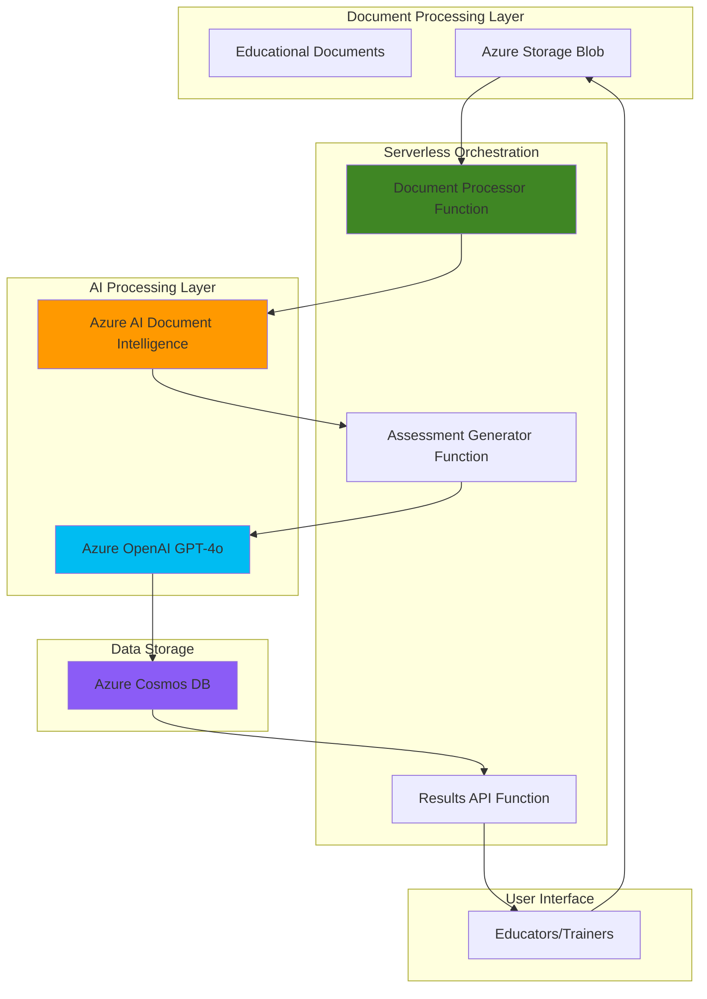

# Learning Assessment Generator with Document Intelligence and OpenAI

## Problem

Educational institutions and training organizations spend countless hours manually creating quiz questions and assessments from existing course materials, textbooks, and training documents. This manual process is time-consuming, inconsistent in quality, and doesn't scale efficiently as content libraries grow. Educators need an automated way to extract key concepts from educational documents and generate high-quality assessment questions with detailed explanations to support learning objectives.

## Solution

This solution combines Azure AI Document Intelligence for content extraction with Azure OpenAI for intelligent assessment generation, orchestrated through serverless Azure Functions and stored in Azure Cosmos DB. The system automatically processes educational documents, extracts structured content using advanced OCR and layout analysis, then generates contextually relevant quiz questions, multiple-choice answers, and detailed explanations using GPT models.

## Architecture Diagram



## Prerequisites

1. Azure subscription with appropriate permissions to create AI Services, Functions, and Cosmos DB
2. Azure CLI installed and configured (or Azure Cloud Shell)
3. Basic understanding of serverless architecture and document processing
4. Familiarity with REST APIs and JSON data structures
5. Estimated cost: $15-25 per month for development/testing usage (includes Document Intelligence, OpenAI, Functions, and Cosmos DB)

> **Note**: Azure OpenAI requires approved access through the limited access program. Apply at https://aka.ms/oaiapply if you haven't been approved yet.

## Preparation

```bash
# Set environment variables for Azure resources
export RESOURCE_GROUP="rg-learning-assessment-${RANDOM_SUFFIX}"
export LOCATION="eastus"
export SUBSCRIPTION_ID=$(az account show --query id --output tsv)

# Generate unique suffix for resource names
RANDOM_SUFFIX=$(openssl rand -hex 3)

# Create resource group
az group create \
    --name ${RESOURCE_GROUP} \
    --location ${LOCATION} \
    --tags purpose=learning-assessment environment=demo

echo "✅ Resource group created: ${RESOURCE_GROUP}"

# Set additional environment variables for Azure services
export STORAGE_ACCOUNT="assessstorage${RANDOM_SUFFIX}"
export COSMOSDB_ACCOUNT="assess-cosmos-${RANDOM_SUFFIX}"
export FUNCTION_APP="assess-functions-${RANDOM_SUFFIX}"
export DOCUMENT_INTELLIGENCE="assess-doc-intel-${RANDOM_SUFFIX}"
export OPENAI_ACCOUNT="assess-openai-${RANDOM_SUFFIX}"
```

## Steps

1. **Create Azure Storage Account for Document Upload**:

   Azure Storage provides the foundational layer for document ingestion, offering secure blob storage with event-driven triggers that seamlessly integrate with Azure Functions. This storage account will serve as the entry point for educational documents and provide automatic event notifications when new content is uploaded.

   ```bash
   # Create storage account with blob storage capabilities
   az storage account create \
       --name ${STORAGE_ACCOUNT} \
       --resource-group ${RESOURCE_GROUP} \
       --location ${LOCATION} \
       --sku Standard_LRS \
       --kind StorageV2
   
   # Create container for educational documents
   az storage container create \
       --name "documents" \
       --account-name ${STORAGE_ACCOUNT} \
       --public-access off
   
   # Get storage connection string for functions
   STORAGE_CONNECTION=$(az storage account show-connection-string \
       --name ${STORAGE_ACCOUNT} \
       --resource-group ${RESOURCE_GROUP} \
       --output tsv)
   
   echo "✅ Storage account configured with document container"
   ```

2. **Deploy Azure AI Document Intelligence Service**:

   Azure AI Document Intelligence provides industry-leading OCR capabilities with advanced layout analysis, supporting hierarchical document structure extraction including sections, tables, and figures. The service uses the latest v4.0 API (2024-11-30 GA) with enhanced AI quality for educational content processing and improved figure detection capabilities.

   ```bash
   # Create Document Intelligence resource
   az cognitiveservices account create \
       --name ${DOCUMENT_INTELLIGENCE} \
       --resource-group ${RESOURCE_GROUP} \
       --location ${LOCATION} \
       --kind FormRecognizer \
       --sku S0 \
       --custom-domain ${DOCUMENT_INTELLIGENCE}
   
   # Get Document Intelligence endpoint and key
   DOC_INTEL_ENDPOINT=$(az cognitiveservices account show \
       --name ${DOCUMENT_INTELLIGENCE} \
       --resource-group ${RESOURCE_GROUP} \
       --query properties.endpoint \
       --output tsv)
   
   DOC_INTEL_KEY=$(az cognitiveservices account keys list \
       --name ${DOCUMENT_INTELLIGENCE} \
       --resource-group ${RESOURCE_GROUP} \
       --query key1 \
       --output tsv)
   
   echo "✅ Document Intelligence service deployed"
   ```

3. **Deploy Azure OpenAI Service**:

   Azure OpenAI provides enterprise-grade access to GPT-4o models with built-in content filtering and responsible AI features. The service enables intelligent assessment generation by leveraging advanced language understanding capabilities to create pedagogically sound questions and explanations from extracted document content.

   ```bash
   # Create Azure OpenAI account
   az cognitiveservices account create \
       --name ${OPENAI_ACCOUNT} \
       --resource-group ${RESOURCE_GROUP} \
       --location ${LOCATION} \
       --kind OpenAI \
       --sku S0 \
       --custom-domain ${OPENAI_ACCOUNT}
   
   # Deploy GPT-4o model for content generation
   az cognitiveservices account deployment create \
       --name ${OPENAI_ACCOUNT} \
       --resource-group ${RESOURCE_GROUP} \
       --deployment-name "gpt-4o" \
       --model-name "gpt-4o" \
       --model-version "2024-08-06" \
       --model-format OpenAI \
       --sku-capacity 20 \
       --sku-name "Standard"
   
   # Get OpenAI endpoint and key
   OPENAI_ENDPOINT=$(az cognitiveservices account show \
       --name ${OPENAI_ACCOUNT} \
       --resource-group ${RESOURCE_GROUP} \
       --query properties.endpoint \
       --output tsv)
   
   OPENAI_KEY=$(az cognitiveservices account keys list \
       --name ${OPENAI_ACCOUNT} \
       --resource-group ${RESOURCE_GROUP} \
       --query key1 \
       --output tsv)
   
   echo "✅ Azure OpenAI service deployed with GPT-4o model"
   ```

4. **Create Azure Cosmos DB for Data Storage**:

   Azure Cosmos DB provides globally distributed, serverless NoSQL storage optimized for AI applications with automatic indexing and single-digit millisecond latency. The database will store extracted document content, generated assessments, and metadata with flexible JSON schemas that accommodate educational content variations.

   ```bash
   # Create Cosmos DB account with NoSQL API
   az cosmosdb create \
       --name ${COSMOSDB_ACCOUNT} \
       --resource-group ${RESOURCE_GROUP} \
       --locations regionName=${LOCATION} failoverPriority=0 \
       --capabilities EnableServerless \
       --enable-automatic-failover false
   
   # Create database and containers
   az cosmosdb sql database create \
       --account-name ${COSMOSDB_ACCOUNT} \
       --resource-group ${RESOURCE_GROUP} \
       --name "AssessmentDB"
   
   az cosmosdb sql container create \
       --account-name ${COSMOSDB_ACCOUNT} \
       --resource-group ${RESOURCE_GROUP} \
       --database-name "AssessmentDB" \
       --name "Documents" \
       --partition-key-path "/documentId"
   
   az cosmosdb sql container create \
       --account-name ${COSMOSDB_ACCOUNT} \
       --resource-group ${RESOURCE_GROUP} \
       --database-name "AssessmentDB" \
       --name "Assessments" \
       --partition-key-path "/documentId"
   
   # Get Cosmos DB connection details
   COSMOS_ENDPOINT=$(az cosmosdb show \
       --name ${COSMOSDB_ACCOUNT} \
       --resource-group ${RESOURCE_GROUP} \
       --query documentEndpoint \
       --output tsv)
   
   COSMOS_KEY=$(az cosmosdb keys list \
       --name ${COSMOSDB_ACCOUNT} \
       --resource-group ${RESOURCE_GROUP} \
       --query primaryMasterKey \
       --output tsv)
   
   echo "✅ Cosmos DB configured with assessment containers"
   ```

5. **Create Azure Functions App for Serverless Processing**:

   Azure Functions provides event-driven serverless compute that automatically scales based on document processing demands. The Functions runtime v4 with Python 3.12 support enables seamless integration with Azure AI services while maintaining efficient connection pooling and optimized performance for AI workloads.

   ```bash
   # Create Function App with Python runtime
   az functionapp create \
       --name ${FUNCTION_APP} \
       --resource-group ${RESOURCE_GROUP} \
       --storage-account ${STORAGE_ACCOUNT} \
       --consumption-plan-location ${LOCATION} \
       --runtime python \
       --runtime-version 3.12 \
       --functions-version 4 \
       --os-type linux
   
   # Configure application settings with service connections
   az functionapp config appsettings set \
       --name ${FUNCTION_APP} \
       --resource-group ${RESOURCE_GROUP} \
       --settings \
       "DOC_INTEL_ENDPOINT=${DOC_INTEL_ENDPOINT}" \
       "DOC_INTEL_KEY=${DOC_INTEL_KEY}" \
       "OPENAI_ENDPOINT=${OPENAI_ENDPOINT}" \
       "OPENAI_KEY=${OPENAI_KEY}" \
       "COSMOS_ENDPOINT=${COSMOS_ENDPOINT}" \
       "COSMOS_KEY=${COSMOS_KEY}" \
       "COSMOS_DATABASE=AssessmentDB"
   
   echo "✅ Function App created with AI service connections"
   ```

6. **Deploy Document Processing Function**:

   This function leverages Azure AI Document Intelligence's Layout model (v4.0 2024-11-30 GA) with advanced figure detection and hierarchical structure analysis to extract comprehensive content from educational documents. The processing includes intelligent section identification, table extraction, and figure recognition optimized for educational materials.

   ```bash
   # Create local function directory structure
   mkdir -p assess-functions
   cd assess-functions
   
   # Initialize Python function project
   cat > requirements.txt << 'EOF'
azure-functions
azure-storage-blob
azure-cosmos
azure-ai-documentintelligence
openai
aiohttp
EOF
   
   # Create document processor function
   cat > function_app.py << 'EOF'
import azure.functions as func
import json
import logging
import os
from azure.ai.documentintelligence import DocumentIntelligenceClient
from azure.core.credentials import AzureKeyCredential
from azure.cosmos import CosmosClient
from datetime import datetime

app = func.FunctionApp()

@app.blob_trigger(arg_name="myblob", path="documents/{name}",
                 connection="AzureWebJobsStorage")
def document_processor(myblob: func.InputStream) -> None:
    logging.info(f"Processing document: {myblob.name}")
    
    # Initialize Document Intelligence client
    doc_intel_client = DocumentIntelligenceClient(
        endpoint=os.environ["DOC_INTEL_ENDPOINT"],
        credential=AzureKeyCredential(os.environ["DOC_INTEL_KEY"])
    )
    
    # Initialize Cosmos DB client
    cosmos_client = CosmosClient(
        os.environ["COSMOS_ENDPOINT"],
        os.environ["COSMOS_KEY"]
    )
    database = cosmos_client.get_database_client("AssessmentDB")
    container = database.get_container_client("Documents")
    
    try:
        # Process document with Layout model for comprehensive extraction
        poller = doc_intel_client.begin_analyze_document(
            "prebuilt-layout",
            analyze_request=myblob.read(),
            features=["keyValuePairs", "queryFields"]
        )
        result = poller.result()
        
        # Extract structured content
        extracted_content = {
            "documentId": myblob.name.split("/")[-1],
            "fileName": myblob.name,
            "extractedText": result.content,
            "sections": [],
            "tables": [],
            "figures": [],
            "keyValuePairs": [],
            "processedDate": datetime.utcnow().isoformat(),
            "status": "processed"
        }
        
        # Process sections with hierarchical structure
        if result.sections:
            for section in result.sections:
                extracted_content["sections"].append({
                    "spans": [{"offset": span.offset, "length": span.length} 
                             for span in section.spans] if section.spans else [],
                    "elements": section.elements if hasattr(section, 'elements') else []
                })
        
        # Process tables for structured data
        if result.tables:
            for table in result.tables:
                table_data = {
                    "rowCount": table.row_count,
                    "columnCount": table.column_count,
                    "cells": []
                }
                for cell in table.cells:
                    table_data["cells"].append({
                        "content": cell.content,
                        "rowIndex": cell.row_index,
                        "columnIndex": cell.column_index
                    })
                extracted_content["tables"].append(table_data)
        
        # Process key-value pairs for metadata
        if result.key_value_pairs:
            for kv_pair in result.key_value_pairs:
                if kv_pair.key and kv_pair.value:
                    extracted_content["keyValuePairs"].append({
                        "key": kv_pair.key.content,
                        "value": kv_pair.value.content
                    })
        
        # Store in Cosmos DB
        container.create_item(extracted_content)
        logging.info(f"Document processed and stored: {myblob.name}")
        
    except Exception as e:
        logging.error(f"Error processing document {myblob.name}: {str(e)}")
        # Store error status
        error_record = {
            "documentId": myblob.name.split("/")[-1],
            "fileName": myblob.name,
            "status": "error",
            "error": str(e),
            "processedDate": datetime.utcnow().isoformat()
        }
        container.create_item(error_record)
EOF
   
   echo "✅ Document processing function created"
   ```

7. **Deploy Assessment Generation Function**:

   This function utilizes Azure OpenAI's GPT-4o model with the latest API version (2024-10-21) to generate pedagogically sound assessment questions from extracted document content. The AI prompts are carefully designed to create various question types including multiple-choice, true/false, and short-answer questions with detailed explanations that support learning objectives.

   ```bash
   # Add assessment generator function to the same app
   cat >> function_app.py << 'EOF'

@app.timer_trigger(schedule="0 */5 * * * *", arg_name="myTimer", run_on_startup=False,
              use_monitor=False) 
def assessment_generator(myTimer: func.TimerRequest) -> None:
    logging.info("Starting assessment generation process")
    
    from openai import AzureOpenAI
    
    # Initialize clients
    openai_client = AzureOpenAI(
        api_key=os.environ["OPENAI_KEY"],
        api_version="2024-10-21",
        azure_endpoint=os.environ["OPENAI_ENDPOINT"]
    )
    
    cosmos_client = CosmosClient(
        os.environ["COSMOS_ENDPOINT"],
        os.environ["COSMOS_KEY"]
    )
    database = cosmos_client.get_database_client("AssessmentDB")
    docs_container = database.get_container_client("Documents")
    assess_container = database.get_container_client("Assessments")
    
    try:
        # Query for processed documents without assessments
        query = "SELECT * FROM c WHERE c.status = 'processed'"
        documents = list(docs_container.query_items(query=query, enable_cross_partition_query=True))
        
        for doc in documents:
            # Check if assessment already exists
            existing_assessment = list(assess_container.query_items(
                query="SELECT * FROM c WHERE c.documentId = @docId",
                parameters=[{"name": "@docId", "value": doc["documentId"]}],
                enable_cross_partition_query=True
            ))
            
            if existing_assessment:
                continue
                
            # Generate assessment using GPT-4o
            content_summary = doc["extractedText"][:4000]  # Limit for token constraints
            
            assessment_prompt = f"""
            You are an expert educational assessment creator. Based on the following educational content, 
            create a comprehensive assessment with 5 high-quality questions. Each question should test 
            understanding of key concepts from the material.

            Content: {content_summary}

            Generate exactly 5 questions in the following JSON format:
            {{
                "questions": [
                    {{
                        "id": 1,
                        "type": "multiple_choice",
                        "question": "Question text here",
                        "options": ["A) Option 1", "B) Option 2", "C) Option 3", "D) Option 4"],
                        "correct_answer": "A",
                        "explanation": "Detailed explanation of why this is correct",
                        "difficulty": "medium",
                        "learning_objective": "What concept this tests"
                    }}
                ]
            }}

            Ensure questions are:
            - Pedagogically sound and test real understanding
            - Clear and unambiguous
            - Varied in difficulty (easy, medium, hard)
            - Include detailed explanations
            - Cover different aspects of the content
            """
            
            response = openai_client.chat.completions.create(
                model="gpt-4o",
                messages=[
                    {"role": "system", "content": "You are an expert educational assessment creator focused on creating high-quality, pedagogically sound questions."},
                    {"role": "user", "content": assessment_prompt}
                ],
                temperature=0.7,
                max_tokens=2000
            )
            
            # Parse and store assessment
            try:
                assessment_data = json.loads(response.choices[0].message.content)
                
                assessment_record = {
                    "documentId": doc["documentId"],
                    "fileName": doc["fileName"],
                    "questions": assessment_data["questions"],
                    "generatedDate": datetime.utcnow().isoformat(),
                    "status": "completed",
                    "totalQuestions": len(assessment_data["questions"])
                }
                
                assess_container.create_item(assessment_record)
                logging.info(f"Assessment generated for document: {doc['documentId']}")
                
            except json.JSONDecodeError as e:
                logging.error(f"Failed to parse assessment JSON for {doc['documentId']}: {str(e)}")
                continue
                
    except Exception as e:
        logging.error(f"Error in assessment generation: {str(e)}")
EOF
   
   echo "✅ Assessment generation function added"
   ```

8. **Deploy Results API Function**:

   This HTTP-triggered function provides a RESTful API endpoint for retrieving generated assessments with filtering and pagination capabilities. The API supports real-time querying of assessment data with proper error handling and response formatting for integration with educational platforms and user interfaces.

   ```bash
   # Add API function for retrieving assessments
   cat >> function_app.py << 'EOF'

@app.route(route="assessments/{document_id?}", auth_level=func.AuthLevel.FUNCTION)
def get_assessments(req: func.HttpRequest) -> func.HttpResponse:
    logging.info('Assessment API request received')
    
    cosmos_client = CosmosClient(
        os.environ["COSMOS_ENDPOINT"],
        os.environ["COSMOS_KEY"]
    )
    database = cosmos_client.get_database_client("AssessmentDB")
    assess_container = database.get_container_client("Assessments")
    
    try:
        document_id = req.route_params.get('document_id')
        
        if document_id:
            # Get specific assessment
            query = "SELECT * FROM c WHERE c.documentId = @docId"
            parameters = [{"name": "@docId", "value": document_id}]
        else:
            # Get all assessments with pagination
            query = "SELECT * FROM c ORDER BY c.generatedDate DESC"
            parameters = []
        
        assessments = list(assess_container.query_items(
            query=query,
            parameters=parameters,
            enable_cross_partition_query=True
        ))
        
        # Format response
        response_data = {
            "assessments": assessments,
            "count": len(assessments),
            "status": "success"
        }
        
        return func.HttpResponse(
            json.dumps(response_data, default=str),
            mimetype="application/json",
            status_code=200
        )
        
    except Exception as e:
        logging.error(f"Error retrieving assessments: {str(e)}")
        return func.HttpResponse(
            json.dumps({"error": str(e), "status": "error"}),
            mimetype="application/json",
            status_code=500
        )
EOF
   
   echo "✅ Results API function added"
   ```

9. **Deploy Functions to Azure**:

   The deployment process packages all functions together in a single Function App, enabling efficient resource sharing and unified configuration management. Azure Functions automatically handles scaling and provides built-in monitoring through Application Insights for comprehensive observability of the assessment generation pipeline.

   ```bash
   # Create local.settings.json for local development (optional)
   cat > local.settings.json << 'EOF'
{
  "IsEncrypted": false,
  "Values": {
    "AzureWebJobsStorage": "",
    "FUNCTIONS_WORKER_RUNTIME": "python"
  }
}
EOF
   
   # Deploy the function app
   zip -r function-package.zip . -x "*.git*" "*.DS_Store*"
   
   az functionapp deployment source config-zip \
       --name ${FUNCTION_APP} \
       --resource-group ${RESOURCE_GROUP} \
       --src function-package.zip
   
   # Wait for deployment to complete
   sleep 30
   
   # Get function app URL for API access
   FUNCTION_URL=$(az functionapp show \
       --name ${FUNCTION_APP} \
       --resource-group ${RESOURCE_GROUP} \
       --query defaultHostName \
       --output tsv)
   
   echo "✅ Functions deployed to: https://${FUNCTION_URL}"
   
   # Return to parent directory
   cd ..
   ```

10. **Configure Function App Integration**:

    Final configuration ensures all Azure services are properly connected with appropriate managed identity permissions and monitoring capabilities. This step enables secure, production-ready operation with comprehensive logging and performance tracking through Azure Monitor and Application Insights.

    ```bash
    # Enable Application Insights for monitoring
    az monitor app-insights component create \
        --app ${FUNCTION_APP}-insights \
        --location ${LOCATION} \
        --resource-group ${RESOURCE_GROUP} \
        --kind web
    
    # Get instrumentation key
    INSIGHTS_KEY=$(az monitor app-insights component show \
        --app ${FUNCTION_APP}-insights \
        --resource-group ${RESOURCE_GROUP} \
        --query instrumentationKey \
        --output tsv)
    
    # Configure Application Insights in Function App
    az functionapp config appsettings set \
        --name ${FUNCTION_APP} \
        --resource-group ${RESOURCE_GROUP} \
        --settings "APPINSIGHTS_INSTRUMENTATIONKEY=${INSIGHTS_KEY}"
    
    # Enable managed identity for secure service connections
    az functionapp identity assign \
        --name ${FUNCTION_APP} \
        --resource-group ${RESOURCE_GROUP}
    
    echo "✅ Function App integration configured with monitoring"
    ```

## Validation & Testing

1. **Verify Azure Services Deployment**:

   ```bash
   # Check all services are running
   az cognitiveservices account show \
       --name ${DOCUMENT_INTELLIGENCE} \
       --resource-group ${RESOURCE_GROUP} \
       --query "properties.provisioningState"
   
   az cognitiveservices account show \
       --name ${OPENAI_ACCOUNT} \
       --resource-group ${RESOURCE_GROUP} \
       --query "properties.provisioningState"
   
   az cosmosdb show \
       --name ${COSMOSDB_ACCOUNT} \
       --resource-group ${RESOURCE_GROUP} \
       --query "provisioningState"
   
   az functionapp show \
       --name ${FUNCTION_APP} \
       --resource-group ${RESOURCE_GROUP} \
       --query "state"
   ```

   Expected output: All services should show "Succeeded" or "Running" status.

2. **Test Document Processing Pipeline**:

   ```bash
   # Create a sample educational document
   cat > sample-lesson.txt << 'EOF'
   # Introduction to Photosynthesis

   Photosynthesis is the process by which plants convert light energy into chemical energy.
   This fundamental biological process occurs in chloroplasts and involves two main stages:
   
   ## Light-Dependent Reactions
   - Occur in the thylakoid membranes
   - Produce ATP and NADPH
   - Release oxygen as a byproduct
   
   ## Light-Independent Reactions (Calvin Cycle)
   - Occur in the stroma
   - Use ATP and NADPH to fix carbon dioxide
   - Produce glucose
   
   The overall equation for photosynthesis is:
   6CO2 + 6H2O + light energy → C6H12O6 + 6O2
   EOF
   
   # Upload document to storage
   az storage blob upload \
       --file sample-lesson.txt \
       --container-name documents \
       --name "sample-lesson.txt" \
       --account-name ${STORAGE_ACCOUNT}
   
   echo "✅ Sample document uploaded for processing"
   ```

3. **Monitor Function Execution**:

   ```bash
   # Check function logs
   az functionapp log tail \
       --name ${FUNCTION_APP} \
       --resource-group ${RESOURCE_GROUP}
   
   # Wait for processing (functions may take 2-3 minutes)
   echo "Waiting for document processing and assessment generation..."
   sleep 180
   ```

4. **Test Assessment API**:

   ```bash
   # Get function key for API access
   FUNCTION_KEY=$(az functionapp keys list \
       --name ${FUNCTION_APP} \
       --resource-group ${RESOURCE_GROUP} \
       --query "functionKeys.default" \
       --output tsv)
   
   # Test API endpoint
   curl -X GET \
       "https://${FUNCTION_URL}/api/assessments?code=${FUNCTION_KEY}" \
       -H "Content-Type: application/json" | jq .
   ```

   Expected output: JSON response with generated assessment questions and metadata.

## Cleanup

1. **Remove Function App and associated resources**:

   ```bash
   # Delete Function App
   az functionapp delete \
       --name ${FUNCTION_APP} \
       --resource-group ${RESOURCE_GROUP}
   
   echo "✅ Function App deleted"
   ```

2. **Remove AI Services**:

   ```bash
   # Delete Document Intelligence service
   az cognitiveservices account delete \
       --name ${DOCUMENT_INTELLIGENCE} \
       --resource-group ${RESOURCE_GROUP}
   
   # Delete Azure OpenAI service
   az cognitiveservices account delete \
       --name ${OPENAI_ACCOUNT} \
       --resource-group ${RESOURCE_GROUP}
   
   echo "✅ AI services deleted"
   ```

3. **Remove data storage services**:

   ```bash
   # Delete Cosmos DB account
   az cosmosdb delete \
       --name ${COSMOSDB_ACCOUNT} \
       --resource-group ${RESOURCE_GROUP} \
       --yes
   
   # Delete Storage Account
   az storage account delete \
       --name ${STORAGE_ACCOUNT} \
       --resource-group ${RESOURCE_GROUP} \
       --yes
   
   echo "✅ Data storage services deleted"
   ```

4. **Remove Resource Group**:

   ```bash
   # Delete entire resource group and all remaining resources
   az group delete \
       --name ${RESOURCE_GROUP} \
       --yes \
       --no-wait
   
   echo "✅ Resource group deletion initiated: ${RESOURCE_GROUP}"
   echo "Note: Complete deletion may take several minutes"
   
   # Clean up environment variables
   unset RESOURCE_GROUP LOCATION SUBSCRIPTION_ID RANDOM_SUFFIX
   unset STORAGE_ACCOUNT COSMOSDB_ACCOUNT FUNCTION_APP
   unset DOCUMENT_INTELLIGENCE OPENAI_ACCOUNT
   ```

## Discussion

This learning assessment generator demonstrates the power of combining Azure's AI services in a serverless architecture to solve real educational challenges. The solution leverages Azure AI Document Intelligence's advanced v4.0 capabilities (2024-11-30 GA), including improved figure detection and hierarchical document structure analysis, which are particularly valuable for processing educational materials that often contain complex layouts, diagrams, and structured content.

The integration with Azure OpenAI's GPT-4o model enables sophisticated content understanding and assessment generation that goes beyond simple text extraction. The AI generates pedagogically sound questions by analyzing content context, identifying key learning concepts, and creating appropriate difficulty progressions. This approach ensures that generated assessments align with educational best practices rather than simply testing rote memorization.

The serverless architecture using Azure Functions provides several advantages for educational institutions. The event-driven processing model automatically scales based on document upload volume, making it cost-effective for institutions with varying workloads. The consumption-based pricing means organizations only pay for actual document processing, not idle infrastructure. Additionally, the Functions runtime v4 with Python 3.12 support handles connection pooling to Cosmos DB efficiently, ensuring optimal performance even during high-volume processing periods as documented in the [Azure Functions serverless computing guide](https://learn.microsoft.com/en-us/azure/azure-functions/functions-versions).

Azure Cosmos DB's NoSQL capabilities perfectly complement this use case by providing flexible schema storage for both extracted document content and generated assessments. The automatic indexing and single-digit millisecond latency support real-time querying of assessment data, while the global distribution capabilities enable low-latency access for distributed educational organizations. The serverless pricing model aligns with the intermittent nature of assessment generation workloads.

> **Tip**: Implement batch processing for large document volumes using Azure AI Document Intelligence's new Batch API capabilities to improve efficiency and reduce costs for bulk assessment generation scenarios.

The solution follows Azure Well-Architected Framework principles by implementing proper error handling, comprehensive logging through Application Insights, and secure credential management through managed identities. The architecture is designed for reliability with automatic retry capabilities and graceful degradation when services are unavailable. For production deployments, consider implementing additional features such as content filtering validation, assessment quality scoring, and integration with learning management systems as outlined in the [Azure OpenAI responsible AI documentation](https://learn.microsoft.com/en-us/azure/ai-services/openai/concepts/content-filter).

## Challenge

Extend this learning assessment generator with these enhancements:

1. **Multi-Modal Assessment Generation**: Integrate Azure Computer Vision to process images and diagrams within educational documents, generating visual-based questions that test comprehension of charts, graphs, and scientific diagrams.

2. **Adaptive Difficulty Scaling**: Implement machine learning algorithms using Azure Machine Learning to analyze student performance data and automatically adjust question difficulty levels based on learning outcomes and competency progression.

3. **Real-Time Collaboration Features**: Add Azure SignalR Service integration to enable collaborative assessment creation where multiple educators can review, edit, and approve generated questions in real-time with version control and change tracking.

4. **Advanced Analytics Dashboard**: Build a comprehensive analytics solution using Azure Synapse Analytics and Power BI to provide insights into assessment effectiveness, student performance patterns, and content gap analysis across curricula.

5. **Multi-Language Support**: Extend the system to support international educational content by integrating Azure Translator Service for automatic translation of source documents and generated assessments, enabling global educational content accessibility.

## Infrastructure Code

*Infrastructure code will be generated after recipe approval.*