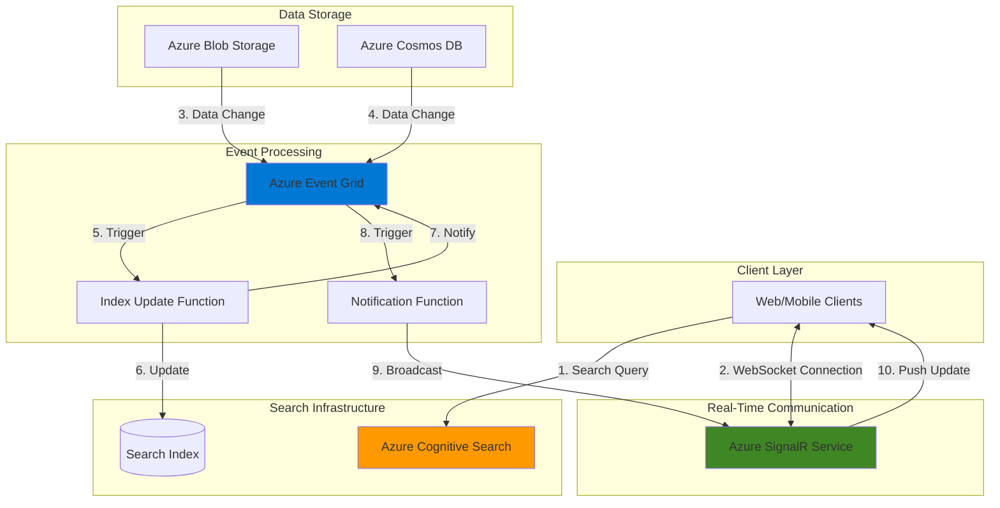

# Live Search Results with Cognitive Search and SignalR

## Problem

Modern applications require search functionality that updates instantly as data changes, providing users with real-time results without manual refresh. Traditional search implementations suffer from stale results, requiring users to repeatedly refresh pages to see new content. This creates poor user experiences in scenarios like live inventory tracking, real-time analytics dashboards, or collaborative document search where immediate visibility of changes is critical.

## Solution

Combine Azure Cognitive Search's powerful full-text search capabilities with Azure SignalR Service for real-time push notifications. Azure Functions and Event Grid orchestrate the solution, automatically triggering index updates and broadcasting changes to connected clients. This serverless architecture ensures instant search result updates while maintaining scalability and cost-effectiveness through event-driven processing.

## Architecture Diagram



## Prerequisites

1. Azure subscription with appropriate permissions to create resources
2. Azure CLI v2.50+ installed and configured (or use Azure Cloud Shell)
3. Basic understanding of REST APIs and WebSocket connections
4. Familiarity with Azure Functions and event-driven architectures
5. Node.js 18+ installed locally for Function development
6. Estimated cost: ~$50-100/month for moderate usage

> **Note**: This recipe uses Azure Cognitive Search (now branded as Azure AI Search) which provides advanced search capabilities including vector search and semantic ranking.

## Preparation

```bash
# Set environment variables for resource naming
export RESOURCE_GROUP="rg-realtimesearch-demo"
export LOCATION="eastus"
export SEARCH_SERVICE="search${RANDOM}"
export SIGNALR_SERVICE="signalr${RANDOM}"
export STORAGE_ACCOUNT="storage${RANDOM}"
export FUNCTION_APP="func${RANDOM}"
export EVENT_GRID_TOPIC="topic${RANDOM}"
export COSMOS_ACCOUNT="cosmos${RANDOM}"

# Generate unique suffix for globally unique names
RANDOM_SUFFIX=$(openssl rand -hex 3)

# Create resource group
az group create \
    --name ${RESOURCE_GROUP} \
    --location ${LOCATION} \
    --tags environment=demo purpose=real-time-search

echo "✅ Resource group created: ${RESOURCE_GROUP}"

# Create storage account for Function App
az storage account create \
    --name ${STORAGE_ACCOUNT} \
    --resource-group ${RESOURCE_GROUP} \
    --location ${LOCATION} \
    --sku Standard_LRS \
    --kind StorageV2

echo "✅ Storage account created: ${STORAGE_ACCOUNT}"
```

## Steps

1. **Create Azure Cognitive Search Service**:

   Azure Cognitive Search provides enterprise-grade search capabilities with features like full-text search, faceted navigation, and AI-powered enrichment. The service automatically handles indexing, query processing, and result ranking, making it ideal for building sophisticated search experiences. By choosing the Basic tier, we balance cost with functionality for our real-time search scenario.

   ```bash
   # Create Cognitive Search service
   az search service create \
       --name ${SEARCH_SERVICE} \
       --resource-group ${RESOURCE_GROUP} \
       --location ${LOCATION} \
       --sku basic \
       --partition-count 1 \
       --replica-count 1
   
   # Get admin key for search service
   SEARCH_ADMIN_KEY=$(az search admin-key show \
       --service-name ${SEARCH_SERVICE} \
       --resource-group ${RESOURCE_GROUP} \
       --query "primaryKey" -o tsv)
   
   # Store search endpoint
   SEARCH_ENDPOINT="https://${SEARCH_SERVICE}.search.windows.net"
   
   echo "✅ Search service created: ${SEARCH_SERVICE}"
   echo "Search endpoint: ${SEARCH_ENDPOINT}"
   ```

   The Cognitive Search service is now ready to host our search index. The admin key enables full control over index creation and management, while the endpoint provides the base URL for all search operations.

2. **Deploy Azure SignalR Service**:

   Azure SignalR Service manages WebSocket connections at scale, eliminating the complexity of handling persistent connections in your application. It provides automatic scaling, built-in authentication, and global distribution, making it perfect for real-time scenarios. The Standard tier supports up to 1,000 concurrent connections per unit and includes features like REST APIs and serverless integration.

   ```bash
   # Create SignalR Service
   az signalr create \
       --name ${SIGNALR_SERVICE} \
       --resource-group ${RESOURCE_GROUP} \
       --location ${LOCATION} \
       --sku Standard_S1 \
       --unit-count 1 \
       --service-mode Serverless
   
   # Get SignalR connection string
   SIGNALR_CONNECTION=$(az signalr key list \
       --name ${SIGNALR_SERVICE} \
       --resource-group ${RESOURCE_GROUP} \
       --query "primaryConnectionString" -o tsv)
   
   echo "✅ SignalR Service created: ${SIGNALR_SERVICE}"
   ```

   SignalR Service is configured in Serverless mode, which integrates seamlessly with Azure Functions for handling connection management and message distribution without maintaining server infrastructure.

3. **Set Up Azure Cosmos DB for Data Storage**:

   Azure Cosmos DB provides globally distributed, multi-model database capabilities with guaranteed low latency. For our real-time search application, Cosmos DB serves as the primary data store with automatic change feed capabilities. The change feed enables real-time event streaming whenever documents are created or modified, triggering our search index updates automatically.

   ```bash
   # Create Cosmos DB account
   az cosmosdb create \
       --name ${COSMOS_ACCOUNT} \
       --resource-group ${RESOURCE_GROUP} \
       --locations regionName=${LOCATION} \
       --default-consistency-level Session \
       --enable-free-tier false
   
   # Create database and container
   az cosmosdb sql database create \
       --account-name ${COSMOS_ACCOUNT} \
       --resource-group ${RESOURCE_GROUP} \
       --name SearchDatabase
   
   az cosmosdb sql container create \
       --account-name ${COSMOS_ACCOUNT} \
       --resource-group ${RESOURCE_GROUP} \
       --database-name SearchDatabase \
       --name Products \
       --partition-key-path "/category" \
       --throughput 400
   
   # Get Cosmos DB connection string
   COSMOS_CONNECTION=$(az cosmosdb keys list \
       --name ${COSMOS_ACCOUNT} \
       --resource-group ${RESOURCE_GROUP} \
       --type connection-strings \
       --query "connectionStrings[0].connectionString" -o tsv)
   
   echo "✅ Cosmos DB created with Products container"
   ```

   The Products container is now ready to store searchable documents. The partition key on 'category' enables efficient querying and scaling across product categories.

4. **Create Azure Event Grid Topic**:

   Azure Event Grid provides reliable event delivery at massive scale, acting as the central nervous system for our event-driven architecture. It ensures that every data change triggers the appropriate downstream actions, from index updates to client notifications. Event Grid's advanced filtering capabilities allow precise control over which events trigger which functions.

   ```bash
   # Create Event Grid topic
   az eventgrid topic create \
       --name ${EVENT_GRID_TOPIC} \
       --resource-group ${RESOURCE_GROUP} \
       --location ${LOCATION}
   
   # Get Event Grid endpoint and key
   EVENT_GRID_ENDPOINT=$(az eventgrid topic show \
       --name ${EVENT_GRID_TOPIC} \
       --resource-group ${RESOURCE_GROUP} \
       --query "endpoint" -o tsv)
   
   EVENT_GRID_KEY=$(az eventgrid topic key list \
       --name ${EVENT_GRID_TOPIC} \
       --resource-group ${RESOURCE_GROUP} \
       --query "key1" -o tsv)
   
   echo "✅ Event Grid topic created: ${EVENT_GRID_TOPIC}"
   ```

   Event Grid now provides a reliable message bus for coordinating between data changes, search index updates, and client notifications.

5. **Deploy Azure Function App**:

   Azure Functions provides the serverless compute layer that processes events and orchestrates our real-time search updates. The consumption plan automatically scales based on demand, ensuring cost-effectiveness during low-traffic periods while handling traffic spikes seamlessly. Functions integrate natively with Event Grid, Cosmos DB, and SignalR Service through built-in bindings.

   ```bash
   # Create Function App
   az functionapp create \
       --name ${FUNCTION_APP} \
       --resource-group ${RESOURCE_GROUP} \
       --storage-account ${STORAGE_ACCOUNT} \
       --consumption-plan-location ${LOCATION} \
       --runtime node \
       --runtime-version 18 \
       --functions-version 4
   
   # Configure application settings
   az functionapp config appsettings set \
       --name ${FUNCTION_APP} \
       --resource-group ${RESOURCE_GROUP} \
       --settings \
       "SearchEndpoint=${SEARCH_ENDPOINT}" \
       "SearchAdminKey=${SEARCH_ADMIN_KEY}" \
       "SignalRConnection=${SIGNALR_CONNECTION}" \
       "CosmosDBConnection=${COSMOS_CONNECTION}" \
       "EventGridEndpoint=${EVENT_GRID_ENDPOINT}" \
       "EventGridKey=${EVENT_GRID_KEY}" \
       "AzureWebJobsStorage=DefaultEndpointsProtocol=https;AccountName=${STORAGE_ACCOUNT};EndpointSuffix=core.windows.net;AccountKey=$(az storage account keys list --resource-group ${RESOURCE_GROUP} --account-name ${STORAGE_ACCOUNT} --query '[0].value' -o tsv)"
   
   echo "✅ Function App created and configured"
   ```

   The Function App is now configured with all necessary connection strings and ready to host our serverless functions for index updates and real-time notifications.

6. **Create Search Index Schema**:

   The search index defines the structure and searchability of your data. Azure Cognitive Search supports various field types, analyzers, and scoring profiles to optimize search relevance. This schema includes full-text searchable fields, facetable categories, and sortable properties, enabling rich search experiences with filters and faceted navigation.

   ```bash
   # Create index definition file
   cat > index-schema.json << EOF
   {
     "name": "products-index",
     "fields": [
       {"name": "id", "type": "Edm.String", "key": true},
       {"name": "name", "type": "Edm.String", "searchable": true, "analyzer": "standard.lucene"},
       {"name": "description", "type": "Edm.String", "searchable": true, "analyzer": "standard.lucene"},
       {"name": "category", "type": "Edm.String", "filterable": true, "facetable": true},
       {"name": "price", "type": "Edm.Double", "filterable": true, "sortable": true},
       {"name": "inStock", "type": "Edm.Boolean", "filterable": true},
       {"name": "lastUpdated", "type": "Edm.DateTimeOffset", "filterable": true, "sortable": true}
     ],
     "suggesters": [
       {"name": "sg", "searchMode": "analyzingInfixMatching", "sourceFields": ["name", "category"]}
     ],
     "scoringProfiles": [
       {
         "name": "boostInStock",
         "functions": [
           {"type": "freshness", "fieldName": "lastUpdated", "boost": 2, "interpolation": "linear", "freshness": {"boostingDuration": "P7D"}}
         ]
       }
     ]
   }
   EOF
   
   # Create the index using REST API
   curl -X PUT "${SEARCH_ENDPOINT}/indexes/products-index?api-version=2021-04-30-Preview" \
     -H "Content-Type: application/json" \
     -H "api-key: ${SEARCH_ADMIN_KEY}" \
     -d @index-schema.json
   
   echo "✅ Search index created with schema"
   ```

   The search index now supports sophisticated queries with autocomplete suggestions, relevance boosting for in-stock items, and freshness scoring to prioritize recently updated products.

7. **Implement Index Update Function**:

   This Azure Function automatically updates the search index whenever data changes in Cosmos DB. The function uses change feed processing to capture modifications in near real-time, ensuring search results always reflect the current state of your data. Built-in error handling and retry logic ensure reliability even during transient failures.

   ```bash
   # Create function directory
   mkdir -p realtime-search-functions
   cd realtime-search-functions
   
   # Initialize Function App
   func init --javascript
   
   # Create index update function
   func new --name IndexUpdateFunction \
       --template "Azure Cosmos DB trigger"
   
   # Update function code
   cat > IndexUpdateFunction/index.js << 'EOF'
   const { SearchIndexClient } = require("@azure/search-documents");
   
   module.exports = async function (context, documents) {
       const searchClient = new SearchIndexClient(
           process.env.SearchEndpoint,
           "products-index",
           { apiKey: process.env.SearchAdminKey }
       );
       
       try {
           // Transform Cosmos DB documents to search documents
           const searchDocuments = documents.map(doc => ({
               id: doc.id,
               name: doc.name,
               description: doc.description,
               category: doc.category,
               price: doc.price,
               inStock: doc.inStock,
               lastUpdated: new Date().toISOString()
           }));
           
           // Update search index
           await searchClient.mergeOrUploadDocuments(searchDocuments);
           
           // Publish event for real-time notification
           await context.bindings.eventGridOutput.push({
               eventType: "SearchIndexUpdated",
               subject: "products/updated",
               data: {
                   documentIds: documents.map(d => d.id),
                   updateTime: new Date().toISOString()
               }
           });
           
           context.log(`Updated ${documents.length} documents in search index`);
       } catch (error) {
           context.log.error("Error updating search index:", error);
           throw error;
       }
   };
   EOF
   
   echo "✅ Index update function created"
   ```

   The function transforms Cosmos DB documents into the search index format, updates the index, and publishes an event to notify connected clients about the changes.

8. **Create Real-Time Notification Function**:

   This function broadcasts search index updates to all connected clients via SignalR Service. It processes Event Grid events and uses SignalR's hub pattern to send targeted messages. The serverless SignalR binding automatically handles connection management, scaling, and message delivery across multiple regions.

   ```bash
   # Create notification function
   func new --name NotificationFunction \
       --template "Azure Event Grid trigger"
   
   # Update notification function code
   cat > NotificationFunction/index.js << 'EOF'
   module.exports = async function (context, eventGridEvent) {
       if (eventGridEvent.eventType === "SearchIndexUpdated") {
           // Send real-time notification to all connected clients
           context.bindings.signalRMessages = [{
               target: "searchUpdated",
               arguments: [{
                   documentIds: eventGridEvent.data.documentIds,
                   updateTime: eventGridEvent.data.updateTime,
                   message: "Search results have been updated"
               }]
           }];
           
           context.log(`Notified clients about ${eventGridEvent.data.documentIds.length} updated documents`);
       }
   };
   EOF
   
   # Update function.json for bindings
   cat > NotificationFunction/function.json << 'EOF'
   {
     "bindings": [
       {
         "type": "eventGridTrigger",
         "name": "eventGridEvent",
         "direction": "in"
       },
       {
         "type": "signalR",
         "name": "signalRMessages",
         "hubName": "searchHub",
         "connectionStringSetting": "SignalRConnection",
         "direction": "out"
       }
     ]
   }
   EOF
   
   echo "✅ Notification function created"
   ```

   The notification function completes the real-time loop by informing all connected clients whenever the search index updates, enabling instant UI updates without polling.

9. **Deploy Functions to Azure**:

   Deploying the functions to Azure enables them to process events at scale. The deployment includes all dependencies and configurations, ensuring the functions can immediately begin processing Cosmos DB changes and broadcasting notifications. Azure Functions' built-in monitoring and diagnostics help track performance and troubleshoot issues.

   ```bash
   # Install dependencies
   npm install @azure/search-documents @azure/event-grid
   
   # Deploy to Azure
   func azure functionapp publish ${FUNCTION_APP} --javascript
   
   # Create Event Grid subscription for notifications
   az eventgrid event-subscription create \
       --name search-notification-sub \
       --source-resource-id $(az eventgrid topic show \
           --name ${EVENT_GRID_TOPIC} \
           --resource-group ${RESOURCE_GROUP} \
           --query id -o tsv) \
       --endpoint-type azurefunction \
       --endpoint $(az functionapp function show \
           --name ${FUNCTION_APP} \
           --resource-group ${RESOURCE_GROUP} \
           --function-name NotificationFunction \
           --query id -o tsv) \
       --event-types SearchIndexUpdated
   
   echo "✅ Functions deployed and Event Grid subscription created"
   ```

   The serverless infrastructure is now fully deployed and ready to process real-time search updates automatically as data changes occur.

## Validation & Testing

1. **Verify Search Service Status**:

   ```bash
   # Check search service status
   az search service show \
       --name ${SEARCH_SERVICE} \
       --resource-group ${RESOURCE_GROUP} \
       --query "{name:name, status:status, sku:sku.name}" \
       --output table
   ```

   Expected output: Service should show "Running" status with Basic SKU.

2. **Test SignalR Connectivity**:

   ```bash
   # Get SignalR service URL
   SIGNALR_URL=$(az signalr show \
       --name ${SIGNALR_SERVICE} \
       --resource-group ${RESOURCE_GROUP} \
       --query "hostName" -o tsv)
   
   echo "SignalR URL: https://${SIGNALR_URL}"
   
   # Test negotiate endpoint (should return 401 without auth)
   curl -i "https://${SIGNALR_URL}/client/negotiate?hub=searchHub"
   ```

   Expected output: HTTP 401 response confirming SignalR endpoint is active.

3. **Insert Test Document and Verify Search**:

   ```bash
   # Insert test document into Cosmos DB
   az cosmosdb sql container item create \
       --account-name ${COSMOS_ACCOUNT} \
       --resource-group ${RESOURCE_GROUP} \
       --database-name SearchDatabase \
       --container-name Products \
       --partition-key-value "Electronics" \
       --body '{
         "id": "test-product-001",
         "name": "Wireless Headphones",
         "description": "Premium noise-cancelling wireless headphones",
         "category": "Electronics",
         "price": 299.99,
         "inStock": true
       }'
   
   # Wait for indexing (typically 1-2 seconds)
   sleep 5
   
   # Search for the product
   curl -X POST "${SEARCH_ENDPOINT}/indexes/products-index/docs/search?api-version=2021-04-30-Preview" \
     -H "Content-Type: application/json" \
     -H "api-key: ${SEARCH_ADMIN_KEY}" \
     -d '{"search": "wireless", "select": "name,price,inStock"}'
   ```

   Expected output: JSON response containing the test product with matching search results.

> **Tip**: Use Azure Monitor and Application Insights to track function execution times, search query performance, and SignalR message delivery metrics for production optimization.

## Cleanup

1. **Delete Resource Group and All Resources**:

   ```bash
   # Delete entire resource group
   az group delete \
       --name ${RESOURCE_GROUP} \
       --yes \
       --no-wait
   
   echo "✅ Resource group deletion initiated"
   echo "Note: Complete deletion may take 5-10 minutes"
   ```

2. **Clean Up Local Files**:

   ```bash
   # Remove function project directory
   cd ..
   rm -rf realtime-search-functions
   rm -f index-schema.json
   
   # Clear environment variables
   unset RESOURCE_GROUP LOCATION SEARCH_SERVICE SIGNALR_SERVICE
   unset STORAGE_ACCOUNT FUNCTION_APP EVENT_GRID_TOPIC COSMOS_ACCOUNT
   unset SEARCH_ADMIN_KEY SEARCH_ENDPOINT SIGNALR_CONNECTION
   unset COSMOS_CONNECTION EVENT_GRID_ENDPOINT EVENT_GRID_KEY
   
   echo "✅ Local cleanup completed"
   ```

## Discussion

Building real-time search applications requires careful orchestration of multiple Azure services working in harmony. Azure Cognitive Search provides the foundation with its powerful indexing and querying capabilities, while SignalR Service enables efficient real-time communication at scale. This architecture follows the [Azure Well-Architected Framework](https://docs.microsoft.com/en-us/azure/architecture/framework/) principles, ensuring reliability, security, and cost optimization. For detailed implementation guidance, see the [Azure Cognitive Search documentation](https://docs.microsoft.com/en-us/azure/search/) and [SignalR Service best practices](https://docs.microsoft.com/en-us/azure/azure-signalr/signalr-concept-performance).

The event-driven pattern using Azure Functions and Event Grid provides loose coupling between components, allowing independent scaling and maintenance. This serverless approach eliminates infrastructure management overhead while providing automatic scaling based on actual usage. The change feed capability in Cosmos DB ensures no data modifications are missed, maintaining search index consistency. For comprehensive event-driven patterns, review the [Event Grid documentation](https://docs.microsoft.com/en-us/azure/event-grid/overview) and [Azure Functions triggers guide](https://docs.microsoft.com/en-us/azure/azure-functions/functions-triggers-bindings).

From a performance perspective, this solution can handle millions of search queries while simultaneously processing thousands of index updates per second. The combination of Cognitive Search's distributed architecture and SignalR's WebSocket management ensures low-latency updates even under high load. Cost optimization is achieved through consumption-based pricing for Functions and Event Grid, while the Basic tier of Cognitive Search provides an affordable entry point. For production deployments, consider the [Cognitive Search capacity planning guide](https://docs.microsoft.com/en-us/azure/search/search-capacity-planning) and implement caching strategies to reduce search service load.

> **Warning**: Monitor your Cognitive Search service usage closely as the Basic tier has limits on index size (2GB) and number of indexes (15). Plan for scaling to Standard tier as your application grows.

## Challenge

Extend this real-time search solution with these advanced features:

1. Implement semantic search capabilities using Azure Cognitive Search's semantic ranking feature to improve result relevance based on context understanding
2. Add geo-spatial search functionality for location-based queries with real-time updates as inventory changes across different locations
3. Create a machine learning pipeline using Azure Machine Learning to analyze search patterns and automatically optimize search relevance scoring
4. Build a multi-tenant solution with index-per-tenant isolation while maintaining real-time updates across all tenants efficiently
5. Integrate Azure API Management to provide rate limiting, authentication, and usage analytics for your real-time search API endpoints

## Infrastructure Code

*Infrastructure code will be generated after recipe approval.*