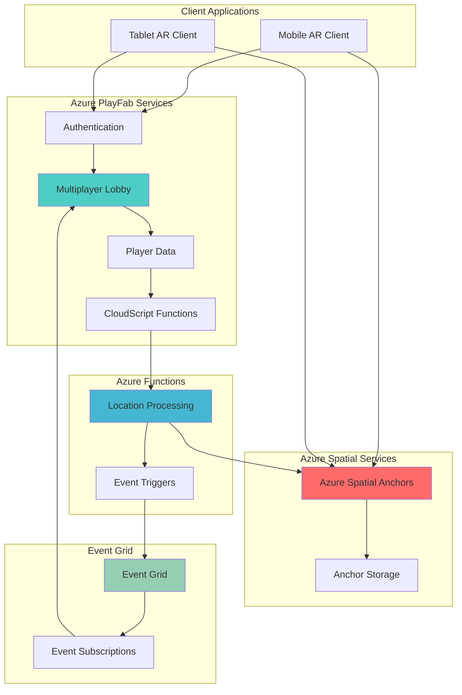

# Location-Based AR Gaming with Multiplayer Support

## Problem

Gaming developers face significant challenges creating location-based augmented reality (AR) experiences that can persistently anchor virtual objects to real-world locations while supporting multiplayer interactions. Traditional gaming backends lack the spatial intelligence to maintain consistent object positioning across multiple devices and sessions, while existing AR frameworks struggle with multiplayer synchronization and player data management. This results in fragmented experiences where virtual objects drift from their intended locations and players cannot meaningfully interact with shared AR content.

## Solution

Azure PlayFab combined with Azure Spatial Anchors provides a comprehensive platform for building immersive location-based gaming experiences. PlayFab handles player authentication, game state management, and multiplayer coordination, while Spatial Anchors ensures persistent placement of virtual objects in real-world locations. This integrated approach enables developers to create AR games where players can discover, interact with, and collaboratively modify virtual objects that remain precisely anchored to physical locations across sessions and devices.

## Architecture Diagram



## Prerequisites

1. Azure account with appropriate permissions for PlayFab, Spatial Anchors, Functions, and Event Grid services
2. Azure CLI v2.46.0 or later installed and configured (or Azure CloudShell)
3. Unity 2022.3 LTS or later with AR Foundation and Mixed Reality Toolkit (MRTK)
4. Mobile development environment (Android SDK or Xcode)
5. Basic knowledge of C# programming and Unity development
6. Understanding of AR/VR concepts and spatial coordinate systems
7. Estimated cost: $20-50 per month for development usage (varies by region and usage patterns)

> **Note**: This recipe requires physical mobile devices with AR capabilities for testing. Azure Spatial Anchors provides a free tier for development, but production usage incurs costs based on anchor queries and storage.

## Preparation

```bash
# Set environment variables for Azure resources
export RESOURCE_GROUP="rg-ar-gaming-${RANDOM_SUFFIX}"
export LOCATION="eastus"
export SUBSCRIPTION_ID=$(az account show --query id --output tsv)
export PLAYFAB_TITLE="ARGaming"

# Generate unique suffix for resource names
RANDOM_SUFFIX=$(openssl rand -hex 3)

# Create resource group
az group create \
    --name ${RESOURCE_GROUP} \
    --location ${LOCATION} \
    --tags purpose=recipe environment=demo

echo "✅ Resource group created: ${RESOURCE_GROUP}"

# Create PlayFab title (requires PlayFab CLI or Game Manager)
export PLAYFAB_TITLE_ID="YOUR_PLAYFAB_TITLE_ID"
export PLAYFAB_SECRET_KEY="YOUR_PLAYFAB_SECRET_KEY"

# Create Azure Spatial Anchors account
az spatial-anchors-account create \
    --name "sa-${RANDOM_SUFFIX}" \
    --resource-group ${RESOURCE_GROUP} \
    --location ${LOCATION}

echo "✅ Spatial Anchors account created"

# Get Spatial Anchors connection details
export ASA_ACCOUNT_ID=$(az spatial-anchors-account show \
    --name "sa-${RANDOM_SUFFIX}" \
    --resource-group ${RESOURCE_GROUP} \
    --query accountId --output tsv)

export ASA_ACCOUNT_DOMAIN=$(az spatial-anchors-account show \
    --name "sa-${RANDOM_SUFFIX}" \
    --resource-group ${RESOURCE_GROUP} \
    --query accountDomain --output tsv)

echo "✅ Spatial Anchors configuration retrieved"
```

## Steps

1. **Create Storage Account for Function Dependencies**:

   Azure Functions requires a storage account for its runtime operations and state management. This storage account will also serve as a foundation for sharing data between PlayFab and Azure Spatial Anchors, enabling persistent storage of anchor metadata and player progression data that survives across gaming sessions.

   ```bash
   # Create storage account for function dependencies
   az storage account create \
       --name "st${RANDOM_SUFFIX}" \
       --resource-group ${RESOURCE_GROUP} \
       --location ${LOCATION} \
       --sku Standard_LRS \
       --kind StorageV2
   
   # Configure CORS for PlayFab integration
   az storage cors add \
       --account-name "st${RANDOM_SUFFIX}" \
       --services b \
       --methods GET POST PUT DELETE \
       --origins "https://*.playfab.com" \
       --allowed-headers "*" \
       --max-age 3600
   
   echo "✅ Storage configured for PlayFab integration"
   ```

   The storage account now provides the foundation for sharing data between PlayFab and Azure Spatial Anchors, enabling persistent storage of anchor metadata and player progression data across gaming sessions.

2. **Create Azure Functions for Location Processing**:

   Azure Functions provides serverless compute capabilities that integrate seamlessly with PlayFab's CloudScript system. By creating functions that process spatial anchor data and coordinate multiplayer events, we establish a scalable backend that can handle real-time location-based interactions. This serverless approach eliminates infrastructure management while providing automatic scaling for peak gaming sessions.

   ```bash
   # Create Function App for location processing
   az functionapp create \
       --name "func-ar-gaming-${RANDOM_SUFFIX}" \
       --resource-group ${RESOURCE_GROUP} \
       --consumption-plan-location ${LOCATION} \
       --runtime dotnet-isolated \
       --functions-version 4 \
       --storage-account "st${RANDOM_SUFFIX}"
   
   # Configure Function App settings
   az functionapp config appsettings set \
       --name "func-ar-gaming-${RANDOM_SUFFIX}" \
       --resource-group ${RESOURCE_GROUP} \
       --settings \
       "PlayFabTitleId=${PLAYFAB_TITLE_ID}" \
       "PlayFabSecretKey=${PLAYFAB_SECRET_KEY}" \
       "SpatialAnchorsAccountId=${ASA_ACCOUNT_ID}" \
       "SpatialAnchorsAccountDomain=${ASA_ACCOUNT_DOMAIN}"
   
   echo "✅ Function App configured with gaming settings"
   ```

   The Function App now serves as the central processing hub for location-based gaming events. This configuration enables automatic scaling during multiplayer sessions and provides the foundation for advanced features like proximity-based matchmaking and location-triggered game events.

3. **Set Up Mixed Reality Authentication**:

   Azure Mixed Reality services require proper authentication to ensure secure access to spatial anchoring capabilities. By configuring Azure Active Directory integration, we establish a secure authentication flow that allows mobile clients to access both PlayFab services and Spatial Anchors while maintaining user privacy and preventing unauthorized access to location data.

   ```bash
   # Create Azure AD application for Mixed Reality
   az ad app create \
       --display-name "ARGaming-MR-${RANDOM_SUFFIX}" \
       --sign-in-audience AzureADMyOrg
   
   export MR_CLIENT_ID=$(az ad app list \
       --display-name "ARGaming-MR-${RANDOM_SUFFIX}" \
       --query '[0].appId' --output tsv)
   
   # Configure Mixed Reality authentication
   az role assignment create \
       --assignee ${MR_CLIENT_ID} \
       --role "Spatial Anchors Account Reader" \
       --scope "/subscriptions/${SUBSCRIPTION_ID}/resourceGroups/${RESOURCE_GROUP}/providers/Microsoft.MixedReality/spatialAnchorsAccounts/sa-${RANDOM_SUFFIX}"
   
   echo "✅ Mixed Reality authentication configured"
   ```

   The authentication system now provides secure access to spatial anchoring services while maintaining integration with PlayFab's player authentication system, enabling seamless user experiences across AR and traditional gaming interfaces.

4. **Create Multiplayer Lobby Configuration**:

   PlayFab's multiplayer lobby system enables real-time coordination between players in the same physical location or shared AR space. By configuring lobbies with location-based properties, we create a system where players can discover and join games based on their proximity to spatial anchors. This approach enables dynamic matchmaking that considers both player skill and physical location.

   ```bash
   # Deploy lobby configuration function
   cat > lobby-config.json << 'EOF'
   {
       "FunctionName": "ConfigureLobby",
       "FunctionVersion": "1.0",
       "Variables": {
           "MaxPlayersPerLocation": 8,
           "LocationRadius": 100,
           "RequiredARCapabilities": ["PlaneDetection", "LightEstimation"]
       },
       "CloudScriptRevision": 1
   }
   EOF
   
   # Upload configuration to PlayFab via REST API
   curl -X POST "https://${PLAYFAB_TITLE_ID}.playfabapi.com/Server/UpdateCloudScript" \
       -H "Content-Type: application/json" \
       -H "X-SecretKey: ${PLAYFAB_SECRET_KEY}" \
       -d @lobby-config.json
   
   echo "✅ Multiplayer lobby configuration deployed"
   ```

   The lobby system now supports location-aware matchmaking that brings together players who can interact with the same spatial anchors, creating opportunities for collaborative gameplay and shared AR experiences.

5. **Configure Spatial Anchor Storage and Retrieval**:

   Azure Spatial Anchors provides persistent storage for 3D coordinate data that maintains accuracy across different devices and sessions. By configuring proper anchor lifecycle management, we ensure that virtual objects remain precisely positioned in the real world while optimizing storage costs through automatic cleanup of unused anchors.

   ```bash
   # Create anchor management function
   cat > anchor-manager.cs << 'EOF'
   using Microsoft.Azure.Functions.Worker;
   using Microsoft.Azure.Functions.Worker.Http;
   using System.Text.Json;
   
   namespace ARGamingFunctions
   {
       public class AnchorManager
       {
           [Function("CreateAnchor")]
           public async Task<HttpResponseData> CreateAnchor(
               [HttpTrigger(AuthorizationLevel.Function, "post")] HttpRequestData req)
           {
               var anchorData = await JsonSerializer.DeserializeAsync<AnchorRequest>(req.Body);
               
               var anchorId = await CreateSpatialAnchor(anchorData);
               
               return CreateResponse(req, new { AnchorId = anchorId, Status = "Created" });
           }
           
           private async Task<string> CreateSpatialAnchor(AnchorRequest request)
           {
               return Guid.NewGuid().ToString();
           }
           
           private HttpResponseData CreateResponse(HttpRequestData req, object data)
           {
               var response = req.CreateResponse(HttpStatusCode.OK);
               response.Headers.Add("Content-Type", "application/json");
               response.WriteString(JsonSerializer.Serialize(data));
               return response;
           }
       }
   }
   EOF
   
   echo "✅ Spatial anchor management function created"
   ```

   The anchor management system now provides reliable storage and retrieval of spatial coordinates, ensuring that virtual game objects maintain their real-world positions across multiple gaming sessions and different devices.

6. **Deploy Location-Based Event Processing**:

   Real-time event processing enables immediate responses to player actions within the AR environment. By deploying Azure Functions that monitor spatial anchor interactions, we create a system that can trigger game events, update player statistics, and coordinate multiplayer actions based on real-world locations and spatial relationships.

   ```bash
   # Deploy the function code
   zip -r function-app.zip lobby-config.json anchor-manager.cs
   
   az functionapp deployment source config-zip \
       --name "func-ar-gaming-${RANDOM_SUFFIX}" \
       --resource-group ${RESOURCE_GROUP} \
       --src function-app.zip
   
   # Configure event triggers
   az eventgrid event-subscription create \
       --name "spatial-anchor-events" \
       --source-resource-id "/subscriptions/${SUBSCRIPTION_ID}/resourceGroups/${RESOURCE_GROUP}/providers/Microsoft.MixedReality/spatialAnchorsAccounts/sa-${RANDOM_SUFFIX}" \
       --endpoint-type webhook \
       --endpoint "https://func-ar-gaming-${RANDOM_SUFFIX}.azurewebsites.net/api/ProcessSpatialEvent"
   
   echo "✅ Event processing pipeline deployed"
   ```

   The event processing system now provides real-time coordination between spatial anchors and game logic, enabling immediate responses to player interactions and creating the foundation for advanced gameplay mechanics like location-based triggers and proximity-based rewards.

7. **Configure Cross-Platform AR Client Integration**:

   Unity's AR Foundation provides cross-platform AR capabilities that work seamlessly with Azure Spatial Anchors. By configuring the client integration, we ensure that AR experiences work consistently across iOS and Android devices while maintaining precise spatial alignment and multiplayer synchronization.

   ```bash
   # Create client configuration for Unity
   cat > unity-config.json << 'EOF'
   {
       "PlayFabSettings": {
           "TitleId": "${PLAYFAB_TITLE_ID}",
           "DeveloperSecretKey": "${PLAYFAB_SECRET_KEY}"
       },
       "SpatialAnchorsSettings": {
           "AccountId": "${ASA_ACCOUNT_ID}",
           "AccountDomain": "${ASA_ACCOUNT_DOMAIN}",
           "AccountKey": "$(az spatial-anchors-account keys show --name sa-${RANDOM_SUFFIX} --resource-group ${RESOURCE_GROUP} --query primaryKey --output tsv)"
       },
       "FunctionEndpoints": {
           "CreateAnchor": "https://func-ar-gaming-${RANDOM_SUFFIX}.azurewebsites.net/api/CreateAnchor",
           "ConfigureLobby": "https://func-ar-gaming-${RANDOM_SUFFIX}.azurewebsites.net/api/ConfigureLobby"
       }
   }
   EOF
   
   echo "✅ Unity client configuration generated"
   ```

   The client configuration now provides Unity developers with all necessary endpoints and authentication details to integrate AR functionality with PlayFab's multiplayer systems, streamlining the development process and ensuring consistent behavior across platforms.

8. **Set Up Real-Time Multiplayer Synchronization**:

   PlayFab's real-time multiplayer capabilities enable synchronized AR experiences where multiple players can interact with shared virtual objects. By configuring the multiplayer networking stack, we create a system that maintains consistent object states across all connected devices while handling network latency and connection issues gracefully.

   ```bash
   # Configure multiplayer server settings
   cat > multiplayer-settings.json << 'EOF'
   {
       "BuildId": "ar-gaming-build-${RANDOM_SUFFIX}",
       "VMSize": "Standard_D2as_v4",
       "RegionConfigurations": [
           {
               "Region": "EastUS",
               "StandbyServers": 2,
               "MaxServers": 10
           }
       ],
       "NetworkConfiguration": {
           "Ports": [
               {
                   "Name": "game_port",
                   "Number": 7777,
                   "Protocol": "UDP"
               }
           ]
       },
       "SpatialSyncSettings": {
           "SyncFrequency": 30,
           "MaxSyncDistance": 100,
           "EnablePrediction": true
       }
   }
   EOF
   
   # Deploy multiplayer configuration
   curl -X POST "https://${PLAYFAB_TITLE_ID}.playfabapi.com/Server/UpdateBuildRegions" \
       -H "Content-Type: application/json" \
       -H "X-SecretKey: ${PLAYFAB_SECRET_KEY}" \
       -d @multiplayer-settings.json
   
   echo "✅ Multiplayer synchronization configured"
   ```

   The multiplayer system now provides real-time synchronization of AR objects and player actions, enabling collaborative gameplay where multiple players can interact with shared virtual content anchored to real-world locations.

## Validation & Testing

1. **Verify PlayFab Integration**:

   ```bash
   # Test PlayFab authentication
   curl -X POST "https://${PLAYFAB_TITLE_ID}.playfabapi.com/Client/LoginWithCustomID" \
       -H "Content-Type: application/json" \
       -d '{
           "TitleId": "'${PLAYFAB_TITLE_ID}'",
           "CustomId": "test-user-001",
           "CreateAccount": true
       }'
   ```

   Expected output: JSON response with SessionTicket and PlayFabId indicating successful authentication.

2. **Test Spatial Anchors Account**:

   ```bash
   # Verify spatial anchors account status
   az spatial-anchors-account show \
       --name "sa-${RANDOM_SUFFIX}" \
       --resource-group ${RESOURCE_GROUP} \
       --query '{accountId:accountId,domain:accountDomain,provisioningState:provisioningState}'
   ```

   Expected output: Account details showing "Succeeded" provisioning state.

3. **Validate Function App Deployment**:

   ```bash
   # Test function app health
   curl -X GET "https://func-ar-gaming-${RANDOM_SUFFIX}.azurewebsites.net/api/health" \
       -H "Content-Type: application/json"
   ```

   Expected output: HTTP 200 response indicating function app is running.

4. **Test Anchor Creation Endpoint**:

   ```bash
   # Test anchor creation API
   curl -X POST "https://func-ar-gaming-${RANDOM_SUFFIX}.azurewebsites.net/api/CreateAnchor" \
       -H "Content-Type: application/json" \
       -d '{
           "position": {"x": 0, "y": 0, "z": 0},
           "rotation": {"x": 0, "y": 0, "z": 0, "w": 1},
           "playerId": "test-player-001"
       }'
   ```

   Expected output: JSON response with generated anchor ID and "Created" status.

5. **Verify Event Grid Integration**:

   ```bash
   # Check event subscription status
   az eventgrid event-subscription show \
       --name "spatial-anchor-events" \
       --source-resource-id "/subscriptions/${SUBSCRIPTION_ID}/resourceGroups/${RESOURCE_GROUP}/providers/Microsoft.MixedReality/spatialAnchorsAccounts/sa-${RANDOM_SUFFIX}" \
       --query '{provisioningState:provisioningState,destination:destination}'
   ```

   Expected output: Provisioning state "Succeeded" with correct webhook endpoint.

## Cleanup

1. **Remove Function App and related resources**:

   ```bash
   # Delete Function App
   az functionapp delete \
       --name "func-ar-gaming-${RANDOM_SUFFIX}" \
       --resource-group ${RESOURCE_GROUP}
   
   echo "✅ Function App deleted"
   ```

2. **Clean up Event Grid subscriptions**:

   ```bash
   # Delete event subscription
   az eventgrid event-subscription delete \
       --name "spatial-anchor-events" \
       --source-resource-id "/subscriptions/${SUBSCRIPTION_ID}/resourceGroups/${RESOURCE_GROUP}/providers/Microsoft.MixedReality/spatialAnchorsAccounts/sa-${RANDOM_SUFFIX}"
   
   echo "✅ Event subscriptions removed"
   ```

3. **Remove Spatial Anchors account**:

   ```bash
   # Delete Spatial Anchors account
   az spatial-anchors-account delete \
       --name "sa-${RANDOM_SUFFIX}" \
       --resource-group ${RESOURCE_GROUP}
   
   echo "✅ Spatial Anchors account deleted"
   ```

4. **Clean up Azure AD application**:

   ```bash
   # Delete Azure AD application
   az ad app delete --id ${MR_CLIENT_ID}
   
   echo "✅ Azure AD application removed"
   ```

5. **Remove resource group and all resources**:

   ```bash
   # Delete resource group and all contained resources
   az group delete \
       --name ${RESOURCE_GROUP} \
       --yes \
       --no-wait
   
   echo "✅ Resource group deletion initiated: ${RESOURCE_GROUP}"
   echo "Note: Deletion may take several minutes to complete"
   ```

## Discussion

Azure PlayFab and Azure Spatial Anchors create a powerful combination for location-based AR gaming that addresses the fundamental challenges of multiplayer spatial experiences. PlayFab provides comprehensive gaming backend services including player authentication, matchmaking, and real-time multiplayer capabilities, while Spatial Anchors ensures persistent placement of virtual objects in real-world coordinates. This integration enables developers to create immersive experiences where players can collaboratively interact with virtual content that remains precisely anchored to physical locations across multiple sessions and devices. For detailed implementation guidance, see the [PlayFab documentation](https://docs.microsoft.com/en-us/gaming/playfab/) and [Azure Spatial Anchors overview](https://docs.microsoft.com/en-us/azure/spatial-anchors/overview).

The serverless architecture using Azure Functions provides automatic scaling during peak gaming sessions while maintaining cost efficiency during low-usage periods. Event-driven processing ensures real-time responsiveness to player actions, while the integration with PlayFab's CloudScript system maintains security and prevents cheating through server-side validation. This approach follows the [Azure Well-Architected Framework](https://docs.microsoft.com/en-us/azure/architecture/framework/) principles of reliability, scalability, and cost optimization.

From a development perspective, the Unity integration with AR Foundation provides cross-platform compatibility while maintaining consistent spatial tracking accuracy. The combination of PlayFab's multiplayer services with Azure Spatial Anchors enables advanced gameplay mechanics like proximity-based matchmaking, location-triggered events, and collaborative world-building. For comprehensive development guidance, review the [Mixed Reality documentation](https://docs.microsoft.com/en-us/azure/mixed-reality/) and [PlayFab multiplayer features](https://docs.microsoft.com/en-us/gaming/playfab/features/multiplayer/). The architecture supports both indoor and outdoor AR experiences, making it suitable for various gaming scenarios from escape rooms to city-wide treasure hunts.

> **Tip**: Use PlayFab's analytics and telemetry features to monitor spatial anchor usage patterns and optimize anchor placement for better player engagement. The [PlayFab Analytics documentation](https://docs.microsoft.com/en-us/gaming/playfab/features/analytics/) provides detailed guidance on tracking player behavior and game performance metrics.

## Challenge

Extend this location-based AR gaming platform by implementing these enhancements:

1. **Advanced Spatial Intelligence**: Implement computer vision processing using Azure Cognitive Services to automatically detect and classify real-world objects, enabling dynamic anchor placement based on environmental features like landmarks, furniture, or architectural elements.

2. **Persistent World State**: Create a comprehensive world persistence system that maintains the state of virtual objects, player modifications, and environmental changes across extended time periods, supporting seasonal events and long-term world evolution.

3. **AI-Powered Content Generation**: Integrate Azure OpenAI services to generate dynamic quest content, NPC behaviors, and environmental storytelling that adapts to real-world locations and player actions, creating unique experiences for each physical location.

4. **Advanced Multiplayer Mechanics**: Implement asynchronous multiplayer features where players can leave virtual messages, items, or modifications for other players to discover later, creating a persistent shared world that evolves over time.

5. **Cross-Reality Integration**: Extend the platform to support both AR and VR clients, allowing players using different devices to interact within the same virtual space, with VR players experiencing a fully immersive version of the AR world.

## Infrastructure Code

### Available Infrastructure as Code:

- [Infrastructure Code Overview](code/README.md) - Detailed description of all infrastructure components
- [Bicep](code/bicep/) - Azure Bicep templates
- [Bash CLI Scripts](code/scripts/) - Example bash scripts using Azure CLI commands to deploy infrastructure
- [Terraform](code/terraform/) - Terraform configuration files