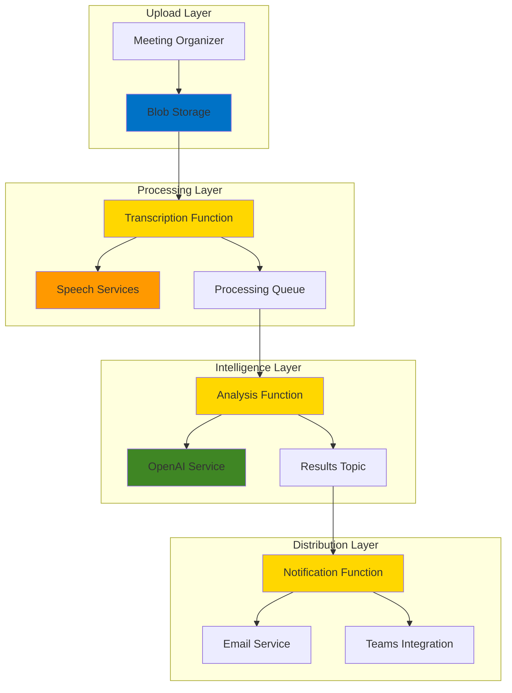

# Meeting Intelligence with Speech Services and OpenAI

## Problem

Organizations struggle to capture actionable insights from recorded meetings, resulting in missed follow-up tasks and poor meeting outcomes. Manual transcription and analysis consume valuable time, while important decisions and action items get lost in lengthy recordings. Without automated intelligence extraction, teams face reduced productivity and accountability gaps that impact business results.

## Solution

Build an intelligent meeting analysis system using Azure Speech Services for accurate transcription with speaker identification, Azure OpenAI for extracting key insights and action items, and Azure Service Bus with Functions for reliable processing workflows. This serverless architecture automatically processes meeting recordings, delivers structured insights, and enables automated follow-up actions.

## Architecture Diagram



## Prerequisites

1. Azure subscription with appropriate permissions for creating AI services, Functions, and Service Bus
2. Azure CLI installed and configured (or Azure Cloud Shell)
3. Basic understanding of serverless architecture and event-driven patterns
4. Familiarity with REST APIs and JSON data structures
5. Estimated cost: $15-25 for resources created (including OpenAI usage)

> **Note**: This recipe uses consumption-based pricing for Functions and pay-per-use for Speech and OpenAI services to minimize costs during development.

## Preparation

```bash
# Set environment variables for Azure resources
export RESOURCE_GROUP="rg-meeting-intelligence-${RANDOM_SUFFIX}"
export LOCATION="eastus"
export SUBSCRIPTION_ID=$(az account show --query id --output tsv)

# Generate unique suffix for resource names
RANDOM_SUFFIX=$(openssl rand -hex 3)

# Create resource group
az group create \
    --name ${RESOURCE_GROUP} \
    --location ${LOCATION} \
    --tags purpose=recipe environment=demo

echo "✅ Resource group created: ${RESOURCE_GROUP}"

# Create storage account for meeting recordings
export STORAGE_ACCOUNT="meetingstorage${RANDOM_SUFFIX}"
az storage account create \
    --name ${STORAGE_ACCOUNT} \
    --resource-group ${RESOURCE_GROUP} \
    --location ${LOCATION} \
    --sku Standard_LRS \
    --kind StorageV2

echo "✅ Storage account created: ${STORAGE_ACCOUNT}"

# Create blob container for audio files
export CONTAINER_NAME="meeting-recordings"
az storage container create \
    --account-name ${STORAGE_ACCOUNT} \
    --name ${CONTAINER_NAME} \
    --auth-mode login

echo "✅ Blob container created: ${CONTAINER_NAME}"
```

## Steps

1. **Create Speech Services Resource**:

   Azure Speech Services provides enterprise-grade speech-to-text capabilities with advanced features like speaker diarization, which identifies who spoke when during the meeting. The service supports real-time and batch transcription with high accuracy across multiple languages and acoustic conditions using the latest v3.2 API.

   ```bash
   # Create Speech Services resource
   export SPEECH_SERVICE="speech-meeting-${RANDOM_SUFFIX}"
   az cognitiveservices account create \
       --name ${SPEECH_SERVICE} \
       --resource-group ${RESOURCE_GROUP} \
       --kind SpeechServices \
       --sku S0 \
       --location ${LOCATION}
   
   # Get Speech Services key and endpoint
   export SPEECH_KEY=$(az cognitiveservices account keys list \
       --name ${SPEECH_SERVICE} \
       --resource-group ${RESOURCE_GROUP} \
       --query key1 --output tsv)
   
   export SPEECH_ENDPOINT=$(az cognitiveservices account show \
       --name ${SPEECH_SERVICE} \
       --resource-group ${RESOURCE_GROUP} \
       --query properties.endpoint --output tsv)
   
   echo "✅ Speech Services resource created with diarization support"
   ```

   The Speech Services resource is configured with the S0 tier, providing speaker diarization and batch transcription capabilities essential for enterprise meeting intelligence. This enables structured transcription output with speaker identification and temporal information.

2. **Create Azure OpenAI Service and Deploy Model**:

   Azure OpenAI Service provides access to powerful language models with enterprise security and compliance. We'll deploy a GPT-4 model for intelligent analysis of meeting transcripts, extracting key insights, decisions, and action items with high accuracy and contextual understanding.

   ```bash
   # Create OpenAI Service resource
   export OPENAI_SERVICE="openai-meeting-${RANDOM_SUFFIX}"
   az cognitiveservices account create \
       --name ${OPENAI_SERVICE} \
       --resource-group ${RESOURCE_GROUP} \
       --kind OpenAI \
       --sku S0 \
       --location ${LOCATION}
   
   # Get OpenAI key and endpoint
   export OPENAI_KEY=$(az cognitiveservices account keys list \
       --name ${OPENAI_SERVICE} \
       --resource-group ${RESOURCE_GROUP} \
       --query key1 --output tsv)
   
   export OPENAI_ENDPOINT=$(az cognitiveservices account show \
       --name ${OPENAI_SERVICE} \
       --resource-group ${RESOURCE_GROUP} \
       --query properties.endpoint --output tsv)
   
   # Deploy GPT-4 model for meeting analysis
   export DEPLOYMENT_NAME="gpt-4-meeting-analysis"
   az cognitiveservices account deployment create \
       --name ${OPENAI_SERVICE} \
       --resource-group ${RESOURCE_GROUP} \
       --deployment-name ${DEPLOYMENT_NAME} \
       --model-name gpt-4o \
       --model-version "2024-11-20" \
       --model-format OpenAI \
       --sku-capacity 1 \
       --sku-name Standard
   
   echo "✅ OpenAI Service created with GPT-4 model deployment"
   ```

   The OpenAI Service now has a dedicated GPT-4 model deployment optimized for meeting intelligence extraction. The deployment uses the latest model version with Standard pricing tier for reliable performance.

3. **Create Service Bus Namespace and Messaging Entities**:

   Azure Service Bus provides reliable, enterprise-grade messaging for decoupling the transcription and analysis processes. Using queues and topics ensures processing reliability with dead letter handling and enables scalable, asynchronous workflow orchestration.

   ```bash
   # Create Service Bus namespace
   export SERVICEBUS_NAMESPACE="sb-meeting-${RANDOM_SUFFIX}"
   az servicebus namespace create \
       --name ${SERVICEBUS_NAMESPACE} \
       --resource-group ${RESOURCE_GROUP} \
       --location ${LOCATION} \
       --sku Standard
   
   # Create queue for transcript processing
   export TRANSCRIPT_QUEUE="transcript-processing"
   az servicebus queue create \
       --namespace-name ${SERVICEBUS_NAMESPACE} \
       --resource-group ${RESOURCE_GROUP} \
       --name ${TRANSCRIPT_QUEUE} \
       --enable-dead-lettering-on-message-expiration true
   
   # Create topic for distributing analysis results
   export RESULTS_TOPIC="meeting-insights"
   az servicebus topic create \
       --namespace-name ${SERVICEBUS_NAMESPACE} \
       --resource-group ${RESOURCE_GROUP} \
       --name ${RESULTS_TOPIC}
   
   # Create subscription for notifications
   az servicebus topic subscription create \
       --namespace-name ${SERVICEBUS_NAMESPACE} \
       --resource-group ${RESOURCE_GROUP} \
       --topic-name ${RESULTS_TOPIC} \
       --name "notification-subscription"
   
   echo "✅ Service Bus messaging infrastructure created"
   ```

   The Service Bus infrastructure provides reliable message queuing with dead letter support and publish-subscribe patterns for distributing meeting insights to multiple downstream consumers with guaranteed delivery.

4. **Create Function App for Serverless Processing**:

   Azure Functions provides the serverless compute layer for our meeting intelligence workflow. Using the consumption plan ensures cost-effective scaling based on actual usage while maintaining high availability for processing meeting recordings with Python 3.11 runtime.

   ```bash
   # Create Function App with latest Python runtime
   export FUNCTION_APP="func-meeting-${RANDOM_SUFFIX}"
   az functionapp create \
       --name ${FUNCTION_APP} \
       --resource-group ${RESOURCE_GROUP} \
       --storage-account ${STORAGE_ACCOUNT} \
       --consumption-plan-location ${LOCATION} \
       --runtime python \
       --runtime-version 3.11 \
       --functions-version 4
   
   # Get Service Bus connection string
   export SERVICEBUS_CONNECTION=$(az servicebus namespace \
       authorization-rule keys list \
       --namespace-name ${SERVICEBUS_NAMESPACE} \
       --resource-group ${RESOURCE_GROUP} \
       --name RootManageSharedAccessKey \
       --query primaryConnectionString --output tsv)
   
   echo "✅ Function App created with Python 3.11 runtime"
   ```

   The Function App uses Python 3.11 runtime for optimal performance and compatibility with the latest Azure Functions v4 runtime, providing better cold start performance and enhanced security features.

5. **Configure Function App Settings**:

   Function App configuration includes connection strings and API keys for integrating with Speech Services, OpenAI, and Service Bus. Using application settings provides secure configuration management without hardcoding credentials in function code.

   ```bash
   # Configure Function App settings with all required connections
   az functionapp config appsettings set \
       --name ${FUNCTION_APP} \
       --resource-group ${RESOURCE_GROUP} \
       --settings \
       "SPEECH_KEY=${SPEECH_KEY}" \
       "SPEECH_ENDPOINT=${SPEECH_ENDPOINT}" \
       "OPENAI_KEY=${OPENAI_KEY}" \
       "OPENAI_ENDPOINT=${OPENAI_ENDPOINT}" \
       "DEPLOYMENT_NAME=${DEPLOYMENT_NAME}" \
       "SERVICE_BUS_CONNECTION=${SERVICEBUS_CONNECTION}" \
       "TRANSCRIPT_QUEUE=${TRANSCRIPT_QUEUE}" \
       "RESULTS_TOPIC=${RESULTS_TOPIC}" \
       "STORAGE_ACCOUNT_NAME=${STORAGE_ACCOUNT}" \
       "STORAGE_CONNECTION=$(az storage account show-connection-string \
           --name ${STORAGE_ACCOUNT} \
           --resource-group ${RESOURCE_GROUP} \
           --query connectionString --output tsv)"
   
   echo "✅ Function App configured with service connections"
   ```

   The Function App now has secure access to all required Azure services through managed configuration settings, including the specific model deployment name for OpenAI API calls.

6. **Deploy Transcription Function**:

   The transcription function handles blob storage triggers when meeting recordings are uploaded. It uses Azure Speech Services batch transcription API v3.2 to convert audio to text with speaker diarization, then queues the results for intelligent analysis.

   ```bash
   # Create function directory structure
   mkdir -p meeting-functions/TranscribeAudio
   cd meeting-functions/TranscribeAudio
   
   # Create function configuration
   cat > function.json << 'EOF'
   {
     "scriptFile": "__init__.py",
     "bindings": [
       {
         "name": "myblob",
         "type": "blobTrigger",
         "direction": "in",
         "path": "meeting-recordings/{name}",
         "connection": "STORAGE_CONNECTION"
       },
       {
         "name": "msg",
         "type": "serviceBus",
         "direction": "out",
         "queueName": "transcript-processing",
         "connection": "SERVICE_BUS_CONNECTION"
       }
     ]
   }
   EOF
   
   # Create Python function code with latest Speech API
   cat > __init__.py << 'EOF'
   import azure.functions as func
   import logging
   import json
   import os
   import requests
   
   def main(myblob: func.InputStream, msg: func.Out[str]):
       logging.info(f"Processing audio blob: {myblob.name}")
       
       # Speech Services configuration
       speech_key = os.environ['SPEECH_KEY']
       speech_endpoint = os.environ['SPEECH_ENDPOINT']
       storage_account = os.environ['STORAGE_ACCOUNT_NAME']
       
       # Prepare Speech Services request using v3.2 API
       url = f"{speech_endpoint}/speechtotext/v3.2/transcriptions"
       headers = {
           'Ocp-Apim-Subscription-Key': speech_key,
           'Content-Type': 'application/json'
       }
       
       # Create transcription job with enhanced diarization
       blob_name = myblob.name.split('/')[-1]
       transcription_data = {
           "contentUrls": [f"https://{storage_account}.blob.core.windows.net/meeting-recordings/{blob_name}"],
           "locale": "en-US",
           "displayName": f"Meeting Transcription - {blob_name}",
           "properties": {
               "diarizationEnabled": True,
               "wordLevelTimestampsEnabled": True,
               "punctuationMode": "DictatedAndAutomatic",
               "profanityFilterMode": "Masked"
           }
       }
       
       # Submit transcription job
       response = requests.post(url, headers=headers, json=transcription_data)
       
       if response.status_code == 201:
           transcription_id = response.json()['self'].split('/')[-1]
           
           # Prepare message for processing queue
           message_data = {
               "transcription_id": transcription_id,
               "blob_name": myblob.name,
               "status": "transcription_submitted",
               "api_version": "v3.2"
           }
           
           msg.set(json.dumps(message_data))
           logging.info(f"Transcription job submitted: {transcription_id}")
       else:
           logging.error(f"Transcription failed: {response.status_code} - {response.text}")
   EOF
   
   cd ../..
   echo "✅ Transcription function created with v3.2 API support"
   ```

   The transcription function uses the latest Speech Services v3.2 API with enhanced diarization capabilities and improved accuracy for meeting transcription scenarios with multiple speakers.

7. **Deploy Analysis Function**:

   The analysis function processes completed transcriptions using Azure OpenAI to extract meeting insights, key decisions, and action items. It uses structured prompts with the deployed GPT-4 model to ensure consistent, actionable output for automated follow-up workflows.

   ```bash
   # Create analysis function
   mkdir -p meeting-functions/AnalyzeTranscript
   cd meeting-functions/AnalyzeTranscript
   
   # Create function configuration
   cat > function.json << 'EOF'
   {
     "scriptFile": "__init__.py",
     "bindings": [
       {
         "name": "msg",
         "type": "serviceBusTrigger",
         "direction": "in",
         "queueName": "transcript-processing",
         "connection": "SERVICE_BUS_CONNECTION"
       },
       {
         "name": "outputmsg",
         "type": "serviceBus",
         "direction": "out",
         "topicName": "meeting-insights",
         "connection": "SERVICE_BUS_CONNECTION"
       }
     ]
   }
   EOF
   
   # Create enhanced analysis function code
   cat > __init__.py << 'EOF'
   import azure.functions as func
   import logging
   import json
   import os
   import requests
   import time
   
   def main(msg: func.ServiceBusMessage, outputmsg: func.Out[str]):
       logging.info("Processing transcript for analysis")
       
       try:
           # Parse incoming message
           message_data = json.loads(msg.get_body().decode('utf-8'))
           transcription_id = message_data['transcription_id']
           api_version = message_data.get('api_version', 'v3.2')
           
           # Speech Services configuration
           speech_key = os.environ['SPEECH_KEY']
           speech_endpoint = os.environ['SPEECH_ENDPOINT']
           
           # Get transcription results
           transcript_text = get_transcription_results(
               speech_endpoint, speech_key, transcription_id, api_version
           )
           
           if transcript_text:
               # Analyze with OpenAI
               insights = analyze_with_openai(transcript_text)
               
               # Send to results topic
               result_data = {
                   "blob_name": message_data['blob_name'],
                   "transcript": transcript_text,
                   "insights": insights,
                   "processed_at": time.time()
               }
               
               outputmsg.set(json.dumps(result_data))
               logging.info("Meeting analysis completed successfully")
           else:
               logging.error("Failed to retrieve transcription results")
               
       except Exception as e:
           logging.error(f"Error processing transcript: {str(e)}")
   
   def get_transcription_results(endpoint, key, transcription_id, api_version):
       """Poll for transcription completion and retrieve results"""
       url = f"{endpoint}/speechtotext/{api_version}/transcriptions/{transcription_id}"
       headers = {'Ocp-Apim-Subscription-Key': key}
       
       # Poll for completion with exponential backoff
       for attempt in range(12):
           try:
               response = requests.get(url, headers=headers, timeout=30)
               if response.status_code == 200:
                   data = response.json()
                   status = data.get('status')
                   
                   if status == 'Succeeded':
                       # Get transcription files
                       files_url = f"{url}/files"
                       files_response = requests.get(files_url, headers=headers, timeout=30)
                       
                       if files_response.status_code == 200:
                           files_data = files_response.json()
                           
                           # Find transcription result file
                           for file_info in files_data.get('values', []):
                               if file_info.get('kind') == 'Transcription':
                                   content_url = file_info.get('links', {}).get('contentUrl')
                                   if content_url:
                                       content_response = requests.get(content_url, timeout=30)
                                       if content_response.status_code == 200:
                                           transcript_data = content_response.json()
                                           # Extract combined text from results
                                           combined_phrases = transcript_data.get('combinedRecognizedPhrases', [])
                                           if combined_phrases:
                                               return combined_phrases[0].get('display', '')
                       return None
                   
                   elif status == 'Failed':
                       logging.error(f"Transcription failed: {data}")
                       return None
                   
                   # Still running, wait before retry
                   wait_time = min(30, 2 ** attempt)
                   time.sleep(wait_time)
               else:
                   logging.error(f"Error checking transcription status: {response.status_code}")
                   time.sleep(10)
                   
           except requests.RequestException as e:
               logging.error(f"Request error: {str(e)}")
               time.sleep(10)
       
       logging.error("Transcription did not complete in time")
       return None
   
   def analyze_with_openai(transcript):
       """Analyze transcript using Azure OpenAI GPT-4"""
       openai_key = os.environ['OPENAI_KEY']
       openai_endpoint = os.environ['OPENAI_ENDPOINT']
       deployment_name = os.environ['DEPLOYMENT_NAME']
       
       url = f"{openai_endpoint}/openai/deployments/{deployment_name}/chat/completions?api-version=2024-08-01-preview"
       headers = {
           'api-key': openai_key,
           'Content-Type': 'application/json'
       }
       
       prompt = f"""
       Analyze this meeting transcript and extract structured information in JSON format.
       
       Please provide:
       1. Key decisions made (with context and responsible parties if mentioned)
       2. Action items with assigned owners and deadlines if specified
       3. Important topics discussed with brief summaries
       4. Next meeting date/time if mentioned
       5. Meeting sentiment and overall tone
       
       Transcript: {transcript}
       
       Respond with valid JSON using these keys: 
       - decisions: array of decision objects with "decision", "context", "owner"
       - action_items: array with "task", "owner", "deadline", "priority"
       - topics: array with "topic", "summary", "time_discussed"  
       - next_meeting: string or null
       - sentiment: "positive", "neutral", or "negative"
       - meeting_effectiveness: score from 1-10 with brief explanation
       """
       
       data = {
           "messages": [
               {
                   "role": "system", 
                   "content": "You are an expert meeting analyst. Extract actionable insights from meeting transcripts in structured JSON format."
               },
               {
                   "role": "user", 
                   "content": prompt
               }
           ],
           "max_tokens": 1500,
           "temperature": 0.2
       }
       
       try:
           response = requests.post(url, headers=headers, json=data, timeout=60)
           if response.status_code == 200:
               content = response.json()['choices'][0]['message']['content']
               # Clean up markdown formatting if present
               if content.startswith('```json'):
                   content = content.replace('```json', '').replace('```', '').strip()
               return json.loads(content)
           else:
               logging.error(f"OpenAI API error: {response.status_code} - {response.text}")
               return {"error": "Analysis failed", "status_code": response.status_code}
       except json.JSONDecodeError as e:
           logging.error(f"JSON decode error: {str(e)}")
           return {"error": "Invalid JSON response from OpenAI"}
       except requests.RequestException as e:
           logging.error(f"Request error: {str(e)}")
           return {"error": "Network error during analysis"}
   EOF
   
   cd ../..
   echo "✅ Analysis function created with enhanced OpenAI integration"
   ```

   The analysis function includes robust error handling, exponential backoff for polling, and structured prompting for consistent meeting intelligence extraction using the latest Azure OpenAI API version.

8. **Deploy Notification Function**:

   The notification function processes meeting insights and distributes them through various channels. This enables automated follow-up actions, team notifications, and integration with existing workflow systems while providing structured summary formatting.

   ```bash
   # Create notification function
   mkdir -p meeting-functions/ProcessResults
   cd meeting-functions/ProcessResults
   
   # Create function configuration
   cat > function.json << 'EOF'
   {
     "scriptFile": "__init__.py",
     "bindings": [
       {
         "name": "msg",
         "type": "serviceBusTrigger",
         "direction": "in",
         "topicName": "meeting-insights",
         "subscriptionName": "notification-subscription",
         "connection": "SERVICE_BUS_CONNECTION"
       }
     ]
   }
   EOF
   
   # Create enhanced notification function
   cat > __init__.py << 'EOF'
   import azure.functions as func
   import logging
   import json
   from datetime import datetime
   
   def main(msg: func.ServiceBusMessage):
       logging.info("Processing meeting insights for distribution")
       
       try:
           # Parse meeting results
           results = json.loads(msg.get_body().decode('utf-8'))
           insights = results.get('insights', {})
           
           # Format comprehensive summary
           summary = format_meeting_summary(results)
           
           # Log structured output for demonstration
           logging.info(f"Meeting Intelligence Summary Generated:\n{summary}")
           
           # Generate actionable notifications
           action_notifications = generate_action_notifications(insights)
           for notification in action_notifications:
               logging.info(f"Action Item Notification: {notification}")
           
           # In production, integrate with:
           # - Microsoft Graph API for Teams/Outlook notifications
           # - SendGrid/Azure Communication Services for email
           # - Microsoft To Do API for task creation
           # - Power Automate for workflow automation
           # - Azure Logic Apps for complex integrations
           
       except Exception as e:
           logging.error(f"Error processing meeting insights: {str(e)}")
   
   def format_meeting_summary(results):
       """Generate comprehensive meeting summary"""
       timestamp = datetime.fromtimestamp(results['processed_at']).strftime('%Y-%m-%d %H:%M:%S')
       insights = results.get('insights', {})
       
       # Handle potential errors in insights
       if 'error' in insights:
           return f"""
   MEETING PROCESSING ERROR
   Generated: {timestamp}
   Recording: {results['blob_name']}
   Error: {insights['error']}
   
   Please check the transcription and try reprocessing.
   """
       
       summary = f"""
   ╔══════════════════════════════════════════════════════════════╗
   ║                    MEETING INTELLIGENCE SUMMARY               ║
   ╚══════════════════════════════════════════════════════════════╝
   
   📅 Generated: {timestamp}
   🎵 Recording: {results['blob_name']}
   😊 Sentiment: {insights.get('sentiment', 'Not analyzed').title()}
   📊 Effectiveness: {insights.get('meeting_effectiveness', {}).get('score', 'N/A')}/10
   
   ═══════════════════════════════════════════════════════════════
   🔑 KEY DECISIONS
   ═══════════════════════════════════════════════════════════════
   {format_decisions(insights.get('decisions', []))}
   
   ═══════════════════════════════════════════════════════════════
   ✅ ACTION ITEMS  
   ═══════════════════════════════════════════════════════════════
   {format_action_items(insights.get('action_items', []))}
   
   ═══════════════════════════════════════════════════════════════
   💬 TOPICS DISCUSSED
   ═══════════════════════════════════════════════════════════════
   {format_topics(insights.get('topics', []))}
   
   ═══════════════════════════════════════════════════════════════
   📅 NEXT MEETING
   ═══════════════════════════════════════════════════════════════
   {insights.get('next_meeting', 'Not specified')}
   
   ═══════════════════════════════════════════════════════════════
   📈 EFFECTIVENESS NOTES
   ═══════════════════════════════════════════════════════════════
   {insights.get('meeting_effectiveness', {}).get('explanation', 'No effectiveness analysis available')}
   """
       return summary
   
   def format_decisions(decisions):
       """Format decision items with context"""
       if not decisions:
           return "• No specific decisions identified in this meeting"
       
       formatted = []
       for i, decision in enumerate(decisions, 1):
           if isinstance(decision, dict):
               decision_text = decision.get('decision', str(decision))
               context = decision.get('context', '')
               owner = decision.get('owner', '')
               
               item = f"{i}. {decision_text}"
               if context:
                   item += f"\n   Context: {context}"
               if owner:
                   item += f"\n   Owner: {owner}"
           else:
               item = f"{i}. {decision}"
           formatted.append(item)
       
       return "\n".join(formatted)
   
   def format_action_items(action_items):
       """Format action items with priority and deadlines"""
       if not action_items:
           return "• No action items identified in this meeting"
       
       formatted = []
       for i, item in enumerate(action_items, 1):
           if isinstance(item, dict):
               task = item.get('task', str(item))
               owner = item.get('owner', 'Unassigned')
               deadline = item.get('deadline', 'No deadline')
               priority = item.get('priority', 'Normal')
               
               formatted_item = f"{i}. {task}"
               formatted_item += f"\n   👤 Owner: {owner}"
               formatted_item += f"\n   📅 Deadline: {deadline}"
               formatted_item += f"\n   🔥 Priority: {priority}"
           else:
               formatted_item = f"{i}. {item}\n   👤 Owner: Unassigned\n   📅 Deadline: No deadline"
           
           formatted.append(formatted_item)
       
       return "\n".join(formatted)
   
   def format_topics(topics):
       """Format discussion topics with summaries"""
       if not topics:
           return "• No specific topics identified in this meeting"
       
       formatted = []
       for i, topic in enumerate(topics, 1):
           if isinstance(topic, dict):
               topic_name = topic.get('topic', str(topic))
               summary = topic.get('summary', '')
               time_discussed = topic.get('time_discussed', '')
               
               item = f"{i}. {topic_name}"
               if summary:
                   item += f"\n   Summary: {summary}"
               if time_discussed:
                   item += f"\n   Duration: {time_discussed}"
           else:
               item = f"{i}. {topic}"
           
           formatted.append(item)
       
       return "\n".join(formatted)
   
   def generate_action_notifications(insights):
       """Generate individual notifications for urgent action items"""
       notifications = []
       action_items = insights.get('action_items', [])
       
       for item in action_items:
           if isinstance(item, dict):
               task = item.get('task', '')
               owner = item.get('owner', '')
               priority = item.get('priority', '').lower()
               deadline = item.get('deadline', '')
               
               if priority in ['high', 'urgent', 'critical'] and owner and owner != 'Unassigned':
                   notification = {
                       'type': 'urgent_action',
                       'recipient': owner,
                       'task': task,
                       'deadline': deadline,
                       'priority': priority
                   }
                   notifications.append(notification)
       
       return notifications
   EOF
   
   cd ../..
   echo "✅ Notification function created with enhanced formatting"
   ```

   The notification function provides comprehensive meeting summaries with structured formatting and generates specific notifications for urgent action items, ready for integration with Microsoft Teams, Outlook, and other productivity tools.

## Validation & Testing

1. **Verify Function App Deployment**:

   ```bash
   # Check Function App status and runtime version
   az functionapp show \
       --name ${FUNCTION_APP} \
       --resource-group ${RESOURCE_GROUP} \
       --query "{state: state, kind: kind, runtimeVersion: siteConfig.pythonVersion}" \
       --output table
   ```

   Expected output: Function App in `Running` state with Python 3.11 runtime.

2. **Test Speech Services Integration**:

   ```bash
   # Verify Speech Services access using v3.2 API
   curl -H "Ocp-Apim-Subscription-Key: ${SPEECH_KEY}" \
        "${SPEECH_ENDPOINT}/speechtotext/v3.2/transcriptions" \
        -I
   ```

   Expected output: HTTP 200 response with API access confirmation.

3. **Test OpenAI Model Deployment**:

   ```bash
   # Verify OpenAI model deployment status
   az cognitiveservices account deployment show \
       --name ${OPENAI_SERVICE} \
       --resource-group ${RESOURCE_GROUP} \
       --deployment-name ${DEPLOYMENT_NAME} \
       --query "{status: properties.provisioningState, model: properties.model}" \
       --output table
   ```

   Expected output: Deployment in `Succeeded` state with GPT-4 model.

4. **Test Service Bus Connectivity**:

   ```bash
   # Verify Service Bus queue status
   az servicebus queue show \
       --namespace-name ${SERVICEBUS_NAMESPACE} \
       --resource-group ${RESOURCE_GROUP} \
       --name ${TRANSCRIPT_QUEUE} \
       --query "{status: status, messageCount: messageCount}" \
       --output table
   ```

   Expected output: Queue in `Active` status with zero messages.

5. **Upload Test Audio File**:

   ```bash
   # Generate container SAS URL for file upload
   export CONTAINER_URL="https://${STORAGE_ACCOUNT}.blob.core.windows.net/${CONTAINER_NAME}"
   
   echo "📁 Upload a WAV or MP3 audio file to test the workflow:"
   echo "   Container URL: ${CONTAINER_URL}"
   echo ""
   echo "📊 Monitor Function App logs in real-time:"
   
   # Monitor Function App logs
   az functionapp logs tail \
       --name ${FUNCTION_APP} \
       --resource-group ${RESOURCE_GROUP}
   ```

## Cleanup

1. **Remove Function App and associated resources**:

   ```bash
   # Delete Function App
   az functionapp delete \
       --name ${FUNCTION_APP} \
       --resource-group ${RESOURCE_GROUP}
   
   echo "✅ Function App deleted"
   ```

2. **Remove AI Services resources**:

   ```bash
   # Delete Speech Services
   az cognitiveservices account delete \
       --name ${SPEECH_SERVICE} \
       --resource-group ${RESOURCE_GROUP}
   
   # Delete OpenAI Service
   az cognitiveservices account delete \
       --name ${OPENAI_SERVICE} \
       --resource-group ${RESOURCE_GROUP}
   
   echo "✅ AI Services resources deleted"
   ```

3. **Remove Service Bus namespace**:

   ```bash
   # Delete Service Bus namespace (includes all queues and topics)
   az servicebus namespace delete \
       --name ${SERVICEBUS_NAMESPACE} \
       --resource-group ${RESOURCE_GROUP}
   
   echo "✅ Service Bus namespace deleted"
   ```

4. **Remove storage and resource group**:

   ```bash
   # Delete storage account
   az storage account delete \
       --name ${STORAGE_ACCOUNT} \
       --resource-group ${RESOURCE_GROUP} \
       --yes
   
   # Delete resource group and all remaining resources
   az group delete \
       --name ${RESOURCE_GROUP} \
       --yes \
       --no-wait
   
   echo "✅ All resources deleted"
   echo "Note: Resource group deletion may take several minutes to complete"
   ```

## Discussion

This meeting intelligence solution demonstrates enterprise-grade serverless architecture using Azure's AI and messaging services to create automated workflow systems. The combination of Azure Speech Services with speaker diarization provides accurate transcription that identifies individual meeting participants, while Azure OpenAI Service delivers sophisticated text analysis capabilities for extracting actionable insights.

The serverless architecture pattern using Azure Functions provides several key advantages: automatic scaling based on workload demand, pay-per-execution pricing that minimizes costs during low usage periods, and built-in integration with Azure services through bindings and triggers. Service Bus messaging ensures reliable processing with dead letter handling and enables loose coupling between processing stages, making the system resilient to failures and capable of handling varying workloads.

Azure Speech Services batch transcription API v3.2 offers superior accuracy compared to real-time transcription for recorded content, supporting advanced features like speaker diarization, custom vocabularies, and multiple audio formats. The service automatically handles audio preprocessing, noise reduction, and speaker separation, delivering structured output that maintains temporal information and speaker attribution throughout the transcript. The latest API version provides enhanced diarization accuracy and improved processing times for meeting scenarios.

The integration with Azure OpenAI Service leverages state-of-the-art language models for intelligent content analysis. Using structured prompts with the GPT-4 model ensures consistent extraction of key information including decisions, action items, and topics discussed. The deployment-based approach provides dedicated compute resources for reliable performance and enables fine-tuning for specific organizational needs. The enhanced prompting includes sentiment analysis and meeting effectiveness scoring to provide additional business insights.

> **Tip**: Consider implementing custom speech models through Speech Studio if your organization frequently uses domain-specific terminology or has unique acoustic conditions that could benefit from model adaptation.

**Documentation Sources:**
- [Azure Speech Services v3.2 API Documentation](https://learn.microsoft.com/en-us/azure/ai-services/speech-service/rest-speech-to-text)
- [Azure OpenAI Service Deployment Guide](https://learn.microsoft.com/en-us/azure/ai-foundry/openai/how-to/create-resource)
- [Azure Functions Python 3.11 Developer Guide](https://learn.microsoft.com/en-us/azure/azure-functions/functions-reference-python)
- [Azure Service Bus Messaging Patterns](https://learn.microsoft.com/en-us/azure/service-bus-messaging/service-bus-messaging-overview)
- [Azure Well-Architected Framework](https://learn.microsoft.com/en-us/azure/architecture/framework/)

## Challenge

Extend this meeting intelligence solution by implementing these enhancements:

1. **Advanced Speaker Analytics**: Integrate speaker recognition capabilities to identify known participants by voice and track individual contribution metrics across multiple meetings using Azure Speech Services speaker identification features.

2. **Multi-language Support**: Implement automatic language detection and multi-language transcription to support global organizations with diverse meeting participants using Azure Speech Services language detection API.

3. **Real-time Processing**: Convert the batch processing workflow to support real-time meeting transcription and live insight generation during ongoing meetings using Azure SignalR Service and WebSocket connections.

4. **Integration Ecosystem**: Build connectors for popular productivity tools like Microsoft Teams, Slack, Asana, and Jira using Microsoft Graph API and Power Automate to automatically create tasks, send notifications, and update project status based on meeting outcomes.

5. **Advanced Analytics Dashboard**: Create a Power BI dashboard that aggregates meeting insights across time periods, tracks action item completion rates, and provides organizational meeting effectiveness metrics using Azure Synapse Analytics for data processing.

## Infrastructure Code

*Infrastructure code will be generated after recipe approval.*