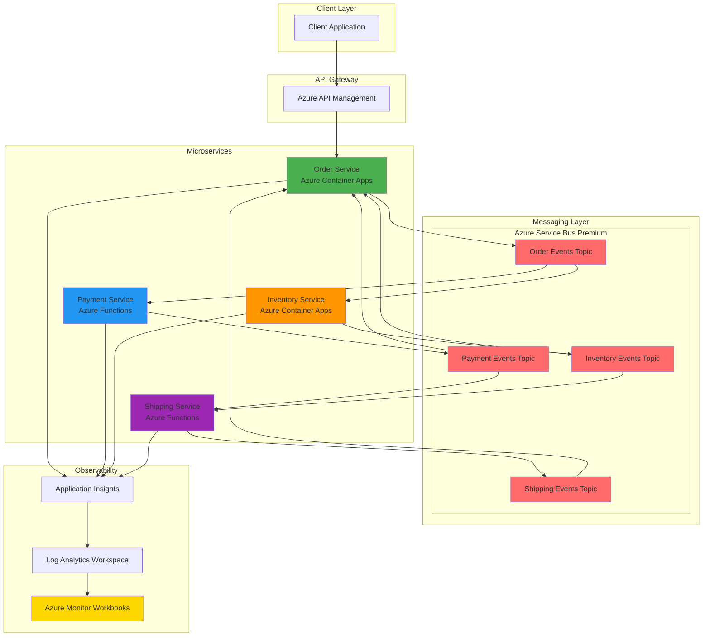

# Microservices Choreography with Service Bus and Observability

## Problem

Enterprise applications often struggle with tightly coupled microservices that rely on synchronous communication patterns, leading to cascading failures, poor scalability, and complex dependency management. Traditional orchestration approaches create single points of failure and bottlenecks that prevent teams from independently deploying and scaling their services. Organizations need a resilient, scalable approach to coordinate distributed business processes across multiple microservices while maintaining observability and operational control.

## Solution

This recipe implements the choreography pattern using Azure Service Bus Premium for high-performance message processing and Azure Monitor Workbooks for comprehensive distributed tracing. The solution enables loosely coupled microservices to coordinate complex business workflows through event-driven communication, where each service responds to events and publishes new events without central coordination. Azure Container Apps and Azure Functions provide the serverless compute foundation, while Azure Monitor Workbooks deliver real-time visibility into distributed transaction flows and performance metrics.

## Architecture Diagram



## Prerequisites

1. Azure account with appropriate permissions for resource creation and management
2. Azure CLI v2.60.0 or later installed and configured (or Azure Cloud Shell)
3. Understanding of microservices architecture and event-driven design patterns
4. Basic knowledge of Azure Container Apps, Azure Functions, and Azure Service Bus
5. Familiarity with Azure Monitor and observability concepts
6. Estimated cost: $50-100 per month for development/testing environment

> **Note**: This recipe uses Azure Service Bus Premium tier which provides enhanced performance, security, and reliability features essential for enterprise microservices architectures.

## Preparation

```bash
# Set environment variables for Azure resources
export RESOURCE_GROUP="rg-microservices-choreography"
export LOCATION="eastus"
export SUBSCRIPTION_ID=$(az account show --query id --output tsv)

# Generate unique suffix for resource names
RANDOM_SUFFIX=$(openssl rand -hex 3)
export NAMESPACE_NAME="sb-choreography-${RANDOM_SUFFIX}"
export WORKSPACE_NAME="log-choreography-${RANDOM_SUFFIX}"
export APPINSIGHTS_NAME="ai-choreography-${RANDOM_SUFFIX}"
export CONTAINER_ENV_NAME="cae-choreography-${RANDOM_SUFFIX}"

# Create resource group
az group create \
    --name ${RESOURCE_GROUP} \
    --location ${LOCATION} \
    --tags purpose=microservices-choreography environment=demo

echo "✅ Resource group created: ${RESOURCE_GROUP}"

# Create Log Analytics workspace for centralized logging
az monitor log-analytics workspace create \
    --resource-group ${RESOURCE_GROUP} \
    --workspace-name ${WORKSPACE_NAME} \
    --location ${LOCATION} \
    --sku PerGB2018

echo "✅ Log Analytics workspace created: ${WORKSPACE_NAME}"

# Get workspace ID for later use
export WORKSPACE_ID=$(az monitor log-analytics workspace show \
    --resource-group ${RESOURCE_GROUP} \
    --workspace-name ${WORKSPACE_NAME} \
    --query id --output tsv)
```

## Steps

1. **Create Azure Service Bus Premium Namespace**:

   Azure Service Bus Premium provides predictable performance with dedicated messaging units, enabling high-throughput, low-latency communication between microservices. The Premium tier offers resource isolation, larger message sizes (up to 100MB), and enhanced security features essential for enterprise choreography patterns. This dedicated infrastructure ensures consistent performance under variable loads and supports the reliability requirements of distributed business processes.

   ```bash
   # Create Service Bus Premium namespace
   az servicebus namespace create \
       --name ${NAMESPACE_NAME} \
       --resource-group ${RESOURCE_GROUP} \
       --location ${LOCATION} \
       --sku Premium \
       --capacity 1
   
   echo "✅ Service Bus Premium namespace created: ${NAMESPACE_NAME}"
   
   # Get Service Bus connection string
   export SERVICE_BUS_CONNECTION=$(az servicebus namespace \
       authorization-rule keys list \
       --resource-group ${RESOURCE_GROUP} \
       --namespace-name ${NAMESPACE_NAME} \
       --name RootManageSharedAccessKey \
       --query primaryConnectionString --output tsv)
   ```

   The Premium namespace now provides dedicated messaging units with predictable performance characteristics. This foundation enables reliable event processing across microservices with guaranteed message delivery and support for complex routing patterns through topics and subscriptions.

2. **Create Service Bus Topics and Subscriptions for Event Choreography**:

   Service Bus topics enable publish-subscribe messaging patterns essential for microservices choreography. Each topic represents a category of events (orders, payments, inventory, shipping), while subscriptions allow services to receive only relevant events. This decoupled approach enables independent service evolution and parallel processing of business workflows.

   ```bash
   # Create topics for different event types
   az servicebus topic create \
       --name order-events \
       --namespace-name ${NAMESPACE_NAME} \
       --resource-group ${RESOURCE_GROUP} \
       --max-message-size-in-kilobytes 1024
   
   az servicebus topic create \
       --name payment-events \
       --namespace-name ${NAMESPACE_NAME} \
       --resource-group ${RESOURCE_GROUP} \
       --max-message-size-in-kilobytes 1024
   
   az servicebus topic create \
       --name inventory-events \
       --namespace-name ${NAMESPACE_NAME} \
       --resource-group ${RESOURCE_GROUP} \
       --max-message-size-in-kilobytes 1024
   
   az servicebus topic create \
       --name shipping-events \
       --namespace-name ${NAMESPACE_NAME} \
       --resource-group ${RESOURCE_GROUP} \
       --max-message-size-in-kilobytes 1024
   
   echo "✅ Service Bus topics created for event choreography"
   
   # Create subscriptions for each service
   az servicebus topic subscription create \
       --name payment-service-sub \
       --topic-name order-events \
       --namespace-name ${NAMESPACE_NAME} \
       --resource-group ${RESOURCE_GROUP}
   
   az servicebus topic subscription create \
       --name inventory-service-sub \
       --topic-name order-events \
       --namespace-name ${NAMESPACE_NAME} \
       --resource-group ${RESOURCE_GROUP}
   
   az servicebus topic subscription create \
       --name shipping-service-sub \
       --topic-name payment-events \
       --namespace-name ${NAMESPACE_NAME} \
       --resource-group ${RESOURCE_GROUP}
   
   echo "✅ Service Bus subscriptions created for choreography pattern"
   ```

   The topic and subscription architecture now enables event-driven choreography where services can publish events to topics and subscribe to events from other services. This creates a loosely coupled communication pattern where services react to events without direct service-to-service calls.

3. **Create Application Insights for Distributed Tracing**:

   Application Insights provides comprehensive observability for distributed microservices architectures. It automatically captures telemetry data including requests, dependencies, exceptions, and custom events across all services. This centralized monitoring enables correlation of distributed transactions and provides insights into system performance and reliability.

   ```bash
   # Create Application Insights instance
   az monitor app-insights component create \
       --app ${APPINSIGHTS_NAME} \
       --location ${LOCATION} \
       --resource-group ${RESOURCE_GROUP} \
       --workspace ${WORKSPACE_ID} \
       --kind web \
       --application-type web
   
   echo "✅ Application Insights created: ${APPINSIGHTS_NAME}"
   
   # Get Application Insights connection string
   export APPINSIGHTS_CONNECTION=$(az monitor app-insights component show \
       --app ${APPINSIGHTS_NAME} \
       --resource-group ${RESOURCE_GROUP} \
       --query connectionString --output tsv)
   
   # Get Application Insights instrumentation key
   export APPINSIGHTS_KEY=$(az monitor app-insights component show \
       --app ${APPINSIGHTS_NAME} \
       --resource-group ${RESOURCE_GROUP} \
       --query instrumentationKey --output tsv)
   ```

   Application Insights is now configured to collect telemetry from all microservices, enabling end-to-end distributed tracing across the choreography workflow. This provides visibility into transaction flows, performance bottlenecks, and failure patterns across the entire system.

4. **Create Container Apps Environment**:

   Azure Container Apps provides a serverless container hosting platform optimized for microservices. The Container Apps Environment establishes the foundation for deploying containerized services with built-in scaling, networking, and observability features. This managed platform eliminates infrastructure complexity while providing enterprise-grade reliability and performance.

   ```bash
   # Create Container Apps Environment
   az containerapp env create \
       --name ${CONTAINER_ENV_NAME} \
       --resource-group ${RESOURCE_GROUP} \
       --location ${LOCATION} \
       --logs-workspace-id ${WORKSPACE_ID}
   
   echo "✅ Container Apps Environment created: ${CONTAINER_ENV_NAME}"
   
   # Get Container Apps Environment ID
   export CONTAINER_ENV_ID=$(az containerapp env show \
       --name ${CONTAINER_ENV_NAME} \
       --resource-group ${RESOURCE_GROUP} \
       --query id --output tsv)
   ```

   The Container Apps Environment provides a secure, scalable foundation for hosting microservices with integrated logging and monitoring. This environment supports automatic scaling based on demand and provides built-in service discovery and communication capabilities.

5. **Deploy Order Service as Container App**:

   The Order Service acts as the choreography initiator, processing order requests and publishing events that trigger downstream services. Deployed as a Container App, it provides automatic scaling and integrated monitoring while maintaining the event-driven communication pattern essential for microservices choreography.

   ```bash
   # Create Order Service container app
   az containerapp create \
       --name order-service \
       --resource-group ${RESOURCE_GROUP} \
       --environment ${CONTAINER_ENV_NAME} \
       --image mcr.microsoft.com/azuredocs/containerapps-helloworld:latest \
       --target-port 80 \
       --ingress external \
       --min-replicas 1 \
       --max-replicas 10 \
       --cpu 0.25 \
       --memory 0.5Gi \
       --env-vars \
           "SERVICE_BUS_CONNECTION=${SERVICE_BUS_CONNECTION}" \
           "APPINSIGHTS_CONNECTION=${APPINSIGHTS_CONNECTION}" \
           "SERVICE_NAME=order-service"
   
   echo "✅ Order Service deployed as Container App"
   
   # Get Order Service URL
   export ORDER_SERVICE_URL=$(az containerapp show \
       --name order-service \
       --resource-group ${RESOURCE_GROUP} \
       --query properties.configuration.ingress.fqdn \
       --output tsv)
   
   echo "Order Service URL: https://${ORDER_SERVICE_URL}"
   ```

   The Order Service is now running as a scalable Container App with integrated monitoring and Service Bus connectivity. This service can process incoming orders and publish events to trigger the choreography workflow across other microservices.

6. **Deploy Inventory Service as Container App**:

   The Inventory Service manages product availability and responds to order events by checking and reserving inventory. As part of the choreography pattern, it listens for order events and publishes inventory events to continue the workflow. This service demonstrates how microservices can participate in distributed business processes through event-driven communication.

   ```bash
   # Create Inventory Service container app
   az containerapp create \
       --name inventory-service \
       --resource-group ${RESOURCE_GROUP} \
       --environment ${CONTAINER_ENV_NAME} \
       --image mcr.microsoft.com/azuredocs/containerapps-helloworld:latest \
       --target-port 80 \
       --ingress internal \
       --min-replicas 1 \
       --max-replicas 5 \
       --cpu 0.25 \
       --memory 0.5Gi \
       --env-vars \
           "SERVICE_BUS_CONNECTION=${SERVICE_BUS_CONNECTION}" \
           "APPINSIGHTS_CONNECTION=${APPINSIGHTS_CONNECTION}" \
           "SERVICE_NAME=inventory-service"
   
   echo "✅ Inventory Service deployed as Container App"
   ```

   The Inventory Service is now operational and ready to participate in the choreography workflow. It will respond to order events by checking inventory availability and publishing inventory events to coordinate with other services in the distributed transaction.

7. **Create Function App for Payment Service**:

   Azure Functions provides serverless compute for event-driven workloads, making it ideal for services that respond to specific events in the choreography pattern. The Payment Service will process payment events and demonstrate how different compute platforms can participate in the same choreography workflow.

   ```bash
   # Create storage account for Function App
   export STORAGE_ACCOUNT="stfunc${RANDOM_SUFFIX}"
   az storage account create \
       --name ${STORAGE_ACCOUNT} \
       --resource-group ${RESOURCE_GROUP} \
       --location ${LOCATION} \
       --sku Standard_LRS
   
   echo "✅ Storage account created for Function App"
   
   # Create Function App
   az functionapp create \
       --name payment-service-${RANDOM_SUFFIX} \
       --resource-group ${RESOURCE_GROUP} \
       --consumption-plan-location ${LOCATION} \
       --storage-account ${STORAGE_ACCOUNT} \
       --runtime node \
       --functions-version 4 \
       --app-insights ${APPINSIGHTS_NAME}
   
   echo "✅ Payment Service Function App created"
   
   # Configure Function App settings
   az functionapp config appsettings set \
       --name payment-service-${RANDOM_SUFFIX} \
       --resource-group ${RESOURCE_GROUP} \
       --settings \
           "SERVICE_BUS_CONNECTION=${SERVICE_BUS_CONNECTION}" \
           "APPINSIGHTS_CONNECTION=${APPINSIGHTS_CONNECTION}"
   ```

   The Payment Service Function App is now configured with Service Bus connectivity and Application Insights monitoring. This serverless service will automatically scale based on incoming payment events and contribute to the overall choreography workflow.

8. **Create Function App for Shipping Service**:

   The Shipping Service represents the final stage of the choreography workflow, processing shipping requests after successful payment and inventory allocation. This Function App demonstrates how multiple serverless services can coordinate complex business processes through event-driven communication patterns.

   ```bash
   # Create Function App for Shipping Service
   az functionapp create \
       --name shipping-service-${RANDOM_SUFFIX} \
       --resource-group ${RESOURCE_GROUP} \
       --consumption-plan-location ${LOCATION} \
       --storage-account ${STORAGE_ACCOUNT} \
       --runtime node \
       --functions-version 4 \
       --app-insights ${APPINSIGHTS_NAME}
   
   echo "✅ Shipping Service Function App created"
   
   # Configure Function App settings
   az functionapp config appsettings set \
       --name shipping-service-${RANDOM_SUFFIX} \
       --resource-group ${RESOURCE_GROUP} \
       --settings \
           "SERVICE_BUS_CONNECTION=${SERVICE_BUS_CONNECTION}" \
           "APPINSIGHTS_CONNECTION=${APPINSIGHTS_CONNECTION}"
   ```

   The Shipping Service Function App completes the microservices choreography architecture. All services are now deployed and configured to participate in event-driven workflows while maintaining loose coupling and independent scalability.

9. **Create Azure Monitor Workbook for Distributed Tracing**:

   Azure Monitor Workbooks provide customizable dashboards for visualizing distributed transaction flows and system performance metrics. This workbook will display end-to-end transaction tracing across all microservices, enabling operators to understand system behavior and identify performance bottlenecks in the choreography workflow.

   ```bash
   # Create directory for workbook template
   mkdir -p workbook-templates
   
   # Create workbook template JSON
   cat > workbook-templates/choreography-workbook.json << 'EOF'
   {
     "version": "Notebook/1.0",
     "items": [
       {
         "type": 1,
         "content": {
           "json": "# Microservices Choreography Dashboard\n\nThis workbook provides comprehensive observability for event-driven microservices choreography patterns using Azure Service Bus Premium and distributed tracing."
         },
         "name": "title"
       },
       {
         "type": 3,
         "content": {
           "version": "KqlItem/1.0",
           "query": "requests\n| where cloud_RoleName in ('order-service', 'inventory-service', 'payment-service', 'shipping-service')\n| summarize RequestCount = count() by bin(timestamp, 5m), cloud_RoleName\n| render timechart",
           "size": 0,
           "title": "Request Volume by Service"
         },
         "name": "requestVolume"
       },
       {
         "type": 3,
         "content": {
           "version": "KqlItem/1.0",
           "query": "dependencies\n| where type == 'Azure Service Bus'\n| summarize MessageCount = count() by bin(timestamp, 5m), cloud_RoleName\n| render timechart",
           "size": 0,
           "title": "Service Bus Messages by Service"
         },
         "name": "serviceBusMessages"
       },
       {
         "type": 3,
         "content": {
           "version": "KqlItem/1.0",
           "query": "requests\n| where cloud_RoleName in ('order-service', 'inventory-service', 'payment-service', 'shipping-service')\n| summarize AvgDuration = avg(duration) by cloud_RoleName\n| render barchart",
           "size": 0,
           "title": "Average Response Time by Service"
         },
         "name": "responseTime"
       }
     ]
   }
   EOF
   
   # Create the workbook
   az monitor workbook create \
       --resource-group ${RESOURCE_GROUP} \
       --name "Microservices Choreography Dashboard" \
       --display-name "Microservices Choreography Dashboard" \
       --source-id ${WORKSPACE_ID} \
       --category "microservices" \
       --serialized-data @workbook-templates/choreography-workbook.json
   
   echo "✅ Azure Monitor Workbook created for distributed tracing"
   ```

   The Azure Monitor Workbook provides comprehensive visibility into the choreography workflow with real-time metrics, distributed tracing visualization, and performance analytics. This enables operators to monitor system health and optimize the event-driven architecture.

10. **Configure Service Bus Message Filtering and Routing**:

    Advanced message filtering and routing capabilities enable sophisticated choreography patterns where services can selectively process events based on content, headers, or other criteria. This configuration demonstrates how to implement complex business logic through message routing without coupling services directly.

    ```bash
    # Create subscription with message filtering
    az servicebus topic subscription create \
        --name high-priority-orders \
        --topic-name order-events \
        --namespace-name ${NAMESPACE_NAME} \
        --resource-group ${RESOURCE_GROUP}
    
    # Create SQL filter for high-priority orders
    az servicebus topic subscription rule create \
        --name HighPriorityRule \
        --subscription-name high-priority-orders \
        --topic-name order-events \
        --namespace-name ${NAMESPACE_NAME} \
        --resource-group ${RESOURCE_GROUP} \
        --filter-type SqlFilter \
        --filter-sql-expression "Priority = 'High'"
    
    echo "✅ Message filtering configured for choreography routing"
    
    # Create dead letter queue for failed messages
    az servicebus queue create \
        --name failed-events-dlq \
        --namespace-name ${NAMESPACE_NAME} \
        --resource-group ${RESOURCE_GROUP} \
        --enable-dead-lettering-on-message-expiration true \
        --max-delivery-count 3
    
    echo "✅ Dead letter queue configured for error handling"
    ```

    Message filtering and routing capabilities now enable sophisticated choreography patterns where services can process events selectively based on business rules. This configuration supports complex workflows while maintaining loose coupling between services.

## Validation & Testing

1. **Verify Service Bus Premium Namespace**:

   ```bash
   # Check Service Bus namespace status
   az servicebus namespace show \
       --name ${NAMESPACE_NAME} \
       --resource-group ${RESOURCE_GROUP} \
       --query "{Name:name,Status:status,Sku:sku.name}" \
       --output table
   
   # List all topics
   az servicebus topic list \
       --namespace-name ${NAMESPACE_NAME} \
       --resource-group ${RESOURCE_GROUP} \
       --query "[].name" --output table
   ```

   Expected output: Service Bus Premium namespace should be "Active" with all four topics (order-events, payment-events, inventory-events, shipping-events) listed.

2. **Test Container Apps Deployment**:

   ```bash
   # Check Container Apps status
   az containerapp list \
       --resource-group ${RESOURCE_GROUP} \
       --query "[].{Name:name,Status:properties.runningStatus}" \
       --output table
   
   # Test Order Service endpoint
   curl -X GET "https://${ORDER_SERVICE_URL}/api/health" \
       -H "accept: application/json"
   ```

   Expected output: Both container apps should show "Running" status and the Order Service should respond with a health check response.

3. **Verify Function Apps Configuration**:

   ```bash
   # Check Function Apps status
   az functionapp list \
       --resource-group ${RESOURCE_GROUP} \
       --query "[].{Name:name,State:state,DefaultHostName:defaultHostName}" \
       --output table
   
   # Verify Application Insights connection
   az monitor app-insights component show \
       --app ${APPINSIGHTS_NAME} \
       --resource-group ${RESOURCE_GROUP} \
       --query "{Name:name,Kind:kind,ApplicationId:appId}" \
       --output table
   ```

   Expected output: Function Apps should show "Running" state and Application Insights should display the correct application ID.

4. **Test Message Flow and Distributed Tracing**:

   ```bash
   # Send test message to simulate choreography workflow
   az servicebus topic message send \
       --topic-name order-events \
       --namespace-name ${NAMESPACE_NAME} \
       --resource-group ${RESOURCE_GROUP} \
       --body '{"orderId":"test-001","customerId":"customer-123","amount":99.99,"priority":"High"}' \
       --properties Priority=High
   
   echo "✅ Test message sent to trigger choreography workflow"
   
   # Check Application Insights for telemetry data
   sleep 30
   echo "Navigate to Application Insights to view distributed traces"
   echo "URL: https://portal.azure.com/#@/resource${APPINSIGHTS_CONNECTION}/overview"
   ```

   Expected result: Test message should trigger the choreography workflow with telemetry data appearing in Application Insights showing distributed transaction correlation.

## Cleanup

1. **Remove Function Apps and associated resources**:

   ```bash
   # Delete Function Apps
   az functionapp delete \
       --name payment-service-${RANDOM_SUFFIX} \
       --resource-group ${RESOURCE_GROUP}
   
   az functionapp delete \
       --name shipping-service-${RANDOM_SUFFIX} \
       --resource-group ${RESOURCE_GROUP}
   
   echo "✅ Function Apps deleted"
   ```

2. **Remove Container Apps and Environment**:

   ```bash
   # Delete Container Apps
   az containerapp delete \
       --name order-service \
       --resource-group ${RESOURCE_GROUP} \
       --yes
   
   az containerapp delete \
       --name inventory-service \
       --resource-group ${RESOURCE_GROUP} \
       --yes
   
   # Delete Container Apps Environment
   az containerapp env delete \
       --name ${CONTAINER_ENV_NAME} \
       --resource-group ${RESOURCE_GROUP} \
       --yes
   
   echo "✅ Container Apps and Environment deleted"
   ```

3. **Remove Service Bus and monitoring resources**:

   ```bash
   # Delete Service Bus namespace
   az servicebus namespace delete \
       --name ${NAMESPACE_NAME} \
       --resource-group ${RESOURCE_GROUP}
   
   # Delete monitoring resources
   az monitor app-insights component delete \
       --app ${APPINSIGHTS_NAME} \
       --resource-group ${RESOURCE_GROUP}
   
   az monitor log-analytics workspace delete \
       --resource-group ${RESOURCE_GROUP} \
       --workspace-name ${WORKSPACE_NAME} \
       --yes
   
   echo "✅ Service Bus and monitoring resources deleted"
   ```

4. **Remove resource group and all remaining resources**:

   ```bash
   # Delete resource group and all contained resources
   az group delete \
       --name ${RESOURCE_GROUP} \
       --yes \
       --no-wait
   
   echo "✅ Resource group deletion initiated: ${RESOURCE_GROUP}"
   echo "Note: Complete deletion may take 10-15 minutes"
   
   # Clean up local files
   rm -rf workbook-templates/
   ```

## Discussion

The choreography pattern implemented in this recipe represents a fundamental shift from centralized orchestration to distributed coordination in microservices architectures. Unlike traditional orchestration where a central service controls the entire workflow, choreography enables each service to respond to events and trigger subsequent actions independently. This approach significantly improves system resilience, scalability, and maintainability by eliminating single points of failure and reducing coupling between services. The [Azure Architecture Center's choreography pattern documentation](https://learn.microsoft.com/en-us/azure/architecture/patterns/choreography) provides comprehensive guidance on implementing this pattern effectively.

Azure Service Bus Premium provides the high-performance, reliable messaging infrastructure essential for enterprise choreography implementations. With dedicated messaging units, predictable performance, and advanced features like message sessions and large message support, the Premium tier ensures that complex business workflows can execute reliably under variable loads. The [Service Bus Premium messaging documentation](https://learn.microsoft.com/en-us/azure/service-bus-messaging/service-bus-premium-messaging) details the technical advantages and capacity planning considerations for production deployments.

The observability solution built with Azure Monitor Workbooks and Application Insights addresses one of the key challenges in distributed systems: understanding transaction flows across multiple services. Distributed tracing capabilities automatically correlate events across service boundaries, enabling operators to visualize end-to-end transaction flows and identify performance bottlenecks. For comprehensive observability strategies, refer to the [Azure Monitor best practices documentation](https://learn.microsoft.com/en-us/azure/azure-monitor/best-practices) and the [Application Insights distributed tracing guide](https://learn.microsoft.com/en-us/azure/azure-monitor/app/distributed-trace-data).

From a cost optimization perspective, the combination of Container Apps and Azure Functions provides excellent scalability characteristics with pay-per-use pricing models. Container Apps automatically scale based on demand while providing consistent hosting for stateful services, while Azure Functions offer true serverless execution for event-driven workloads. The [Azure Well-Architected Framework cost optimization principles](https://learn.microsoft.com/en-us/azure/architecture/framework/cost/) provide detailed guidance on optimizing costs in distributed architectures.

> **Tip**: Implement correlation IDs in all messages to enable end-to-end transaction tracing across the choreography workflow. Use Azure Monitor's correlation features to automatically link related events and provide comprehensive visibility into distributed business processes.

## Challenge

Extend this choreography implementation by adding these advanced capabilities:

1. **Implement Saga Pattern for Long-Running Transactions**: Add compensating actions for each service to handle partial failures in the choreography workflow, ensuring data consistency across distributed operations.

2. **Add Event Sourcing with Azure Cosmos DB**: Store all domain events in Cosmos DB to enable event replay, audit trails, and temporal querying of business process history.

3. **Implement Circuit Breaker Pattern**: Add resilience patterns using Azure Service Bus dead letter queues and retry policies to handle service failures gracefully.

4. **Create Advanced Monitoring Dashboard**: Enhance the Azure Monitor Workbook with custom metrics, SLA tracking, and automated alerting for choreography workflow anomalies.

5. **Add API Gateway Integration**: Implement Azure API Management to provide unified access to microservices with rate limiting, authentication, and request routing capabilities.

## Infrastructure Code

*Infrastructure code will be generated after recipe approval.*