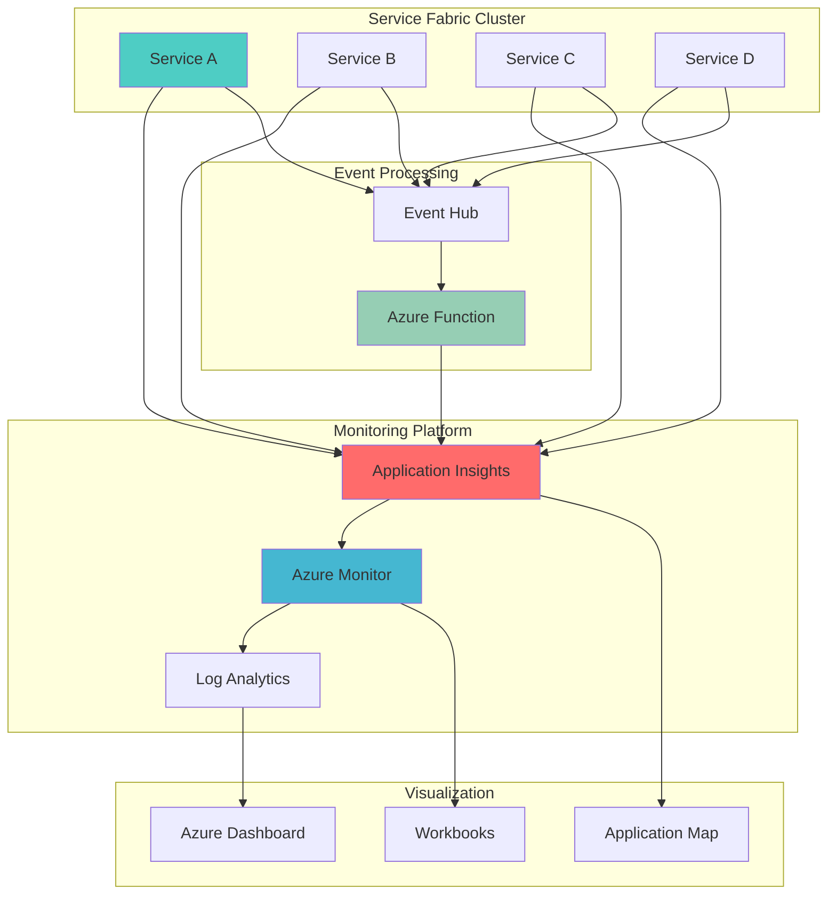

# Microservices Observability with Service Fabric and Application Insights

## Problem

Organizations running microservices architectures on Azure Service Fabric face significant challenges in monitoring distributed applications where services communicate across multiple nodes and clusters. Traditional monitoring approaches fail to provide end-to-end visibility into request flows, making it difficult to identify performance bottlenecks, track service dependencies, and diagnose issues that span multiple service boundaries. Without comprehensive observability, teams struggle to maintain service-level agreements and quickly resolve production incidents in complex distributed systems.

## Solution

This solution implements comprehensive distributed monitoring by integrating Azure Service Fabric clusters with Application Insights for telemetry correlation and Azure Functions for intelligent event processing. The architecture provides real-time visibility into service health, performance metrics, and request tracing across the entire microservices ecosystem. By leveraging Application Insights' distributed tracing capabilities and Azure Monitor's unified logging platform, teams gain actionable insights into service dependencies, performance patterns, and system health.

## Architecture Diagram



## Prerequisites

1. Azure account with permissions to create Service Fabric clusters, Application Insights, and Azure Functions
2. Azure CLI v2.50.0 or later installed and configured
3. Basic understanding of microservices architecture and distributed systems
4. Familiarity with Azure Service Fabric and Application Insights concepts
5. Estimated cost: $50-100 per day for development/testing environment

> **Note**: This recipe uses Azure Service Fabric managed clusters which provide simplified management and reduced operational overhead compared to traditional Service Fabric clusters.

## Preparation

```bash
# Set environment variables for Azure resources
export RESOURCE_GROUP="rg-microservices-monitoring-${RANDOM_SUFFIX}"
export LOCATION="eastus"
export SUBSCRIPTION_ID=$(az account show --query id --output tsv)

# Generate unique suffix for resource names
RANDOM_SUFFIX=$(openssl rand -hex 3)

# Create resource group
az group create \
    --name ${RESOURCE_GROUP} \
    --location ${LOCATION} \
    --tags purpose=microservices-monitoring environment=demo

# Set additional environment variables for resources
export SF_CLUSTER_NAME="sf-cluster-${RANDOM_SUFFIX}"
export APP_INSIGHTS_NAME="ai-monitoring-${RANDOM_SUFFIX}"
export FUNCTION_APP_NAME="fn-eventprocessor-${RANDOM_SUFFIX}"
export STORAGE_ACCOUNT_NAME="st${RANDOM_SUFFIX}"
export EVENT_HUB_NAMESPACE="eh-namespace-${RANDOM_SUFFIX}"
export LOG_ANALYTICS_NAME="la-workspace-${RANDOM_SUFFIX}"

echo "✅ Environment prepared for microservices monitoring setup"
```

## Steps

1. **Create Application Insights and Log Analytics Workspace**:

   Application Insights serves as the central telemetry collection and correlation platform for distributed microservices. By creating a workspace-based Application Insights resource, we establish the foundation for unified logging and advanced analytics. The Log Analytics workspace provides the underlying data store for long-term retention and complex querying capabilities essential for production monitoring.

   ```bash
   # Create Log Analytics workspace
   az monitor log-analytics workspace create \
       --resource-group ${RESOURCE_GROUP} \
       --workspace-name ${LOG_ANALYTICS_NAME} \
       --location ${LOCATION} \
       --sku pergb2018

   # Get workspace ID for Application Insights
   WORKSPACE_ID=$(az monitor log-analytics workspace show \
       --resource-group ${RESOURCE_GROUP} \
       --workspace-name ${LOG_ANALYTICS_NAME} \
       --query id --output tsv)

   # Create Application Insights instance
   az monitor app-insights component create \
       --app ${APP_INSIGHTS_NAME} \
       --location ${LOCATION} \
       --resource-group ${RESOURCE_GROUP} \
       --workspace ${WORKSPACE_ID} \
       --application-type web \
       --kind web

   echo "✅ Application Insights and Log Analytics workspace created"
   ```

   The Application Insights resource is now configured with workspace-based storage, enabling advanced correlation features and cost-effective data retention. This setup provides the telemetry foundation that will collect and analyze traces, metrics, and logs from all microservices in the Service Fabric cluster.

2. **Create Event Hub for Service Event Processing**:

   Event Hub provides a highly scalable event ingestion service that decouples microservices from monitoring infrastructure. This streaming platform enables real-time processing of telemetry data and custom events, allowing for immediate alerting and automated responses to service conditions.

   ```bash
   # Create Event Hub namespace
   az eventhubs namespace create \
       --resource-group ${RESOURCE_GROUP} \
       --name ${EVENT_HUB_NAMESPACE} \
       --location ${LOCATION} \
       --sku Standard \
       --enable-auto-inflate true \
       --maximum-throughput-units 10

   # Create Event Hub
   az eventhubs eventhub create \
       --resource-group ${RESOURCE_GROUP} \
       --namespace-name ${EVENT_HUB_NAMESPACE} \
       --name service-events \
       --partition-count 4 \
       --message-retention 1

   # Get Event Hub connection string
   EVENT_HUB_CONNECTION=$(az eventhubs namespace authorization-rule keys list \
       --resource-group ${RESOURCE_GROUP} \
       --namespace-name ${EVENT_HUB_NAMESPACE} \
       --name RootManageSharedAccessKey \
       --query primaryConnectionString --output tsv)

   echo "✅ Event Hub created for service event processing"
   ```

   The Event Hub is configured with multiple partitions for parallel processing and auto-inflate capabilities to handle traffic spikes. This infrastructure enables microservices to publish events asynchronously while maintaining high throughput and low latency.

3. **Create Service Fabric Managed Cluster**:

   Service Fabric managed clusters provide a simplified deployment model with built-in security, automatic updates, and integrated monitoring capabilities. This approach reduces operational overhead while providing enterprise-grade reliability and scalability for microservices workloads.

   ```bash
   # Create Service Fabric managed cluster
   az sf managed-cluster create \
       --resource-group ${RESOURCE_GROUP} \
       --cluster-name ${SF_CLUSTER_NAME} \
       --location ${LOCATION} \
       --admin-username azureuser \
       --admin-password 'ComplexPassword123!' \
       --sku Standard

   # Wait for cluster to be ready
   echo "Waiting for Service Fabric cluster to be ready..."
   az sf managed-cluster show \
       --resource-group ${RESOURCE_GROUP} \
       --cluster-name ${SF_CLUSTER_NAME} \
       --query provisioningState --output tsv

   echo "✅ Service Fabric managed cluster created"
   ```

   The Service Fabric cluster is now operational with built-in load balancing, health monitoring, and automatic failover capabilities. This managed infrastructure provides the runtime environment for hosting and orchestrating distributed microservices.

4. **Create Azure Function for Event Processing**:

   Azure Functions provides serverless event processing capabilities that automatically scale based on Event Hub throughput. This component implements intelligent monitoring logic, including correlation analysis, anomaly detection, and automated alerting based on microservices telemetry patterns.

   ```bash
   # Create storage account for Function App
   az storage account create \
       --name ${STORAGE_ACCOUNT_NAME} \
       --resource-group ${RESOURCE_GROUP} \
       --location ${LOCATION} \
       --sku Standard_LRS \
       --kind StorageV2

   # Create Function App
   az functionapp create \
       --resource-group ${RESOURCE_GROUP} \
       --consumption-plan-location ${LOCATION} \
       --runtime node \
       --runtime-version 18 \
       --functions-version 4 \
       --name ${FUNCTION_APP_NAME} \
       --storage-account ${STORAGE_ACCOUNT_NAME} \
       --os-type Linux

   # Get Application Insights connection string (preferred over instrumentation key)
   APP_INSIGHTS_CONNECTION=$(az monitor app-insights component show \
       --app ${APP_INSIGHTS_NAME} \
       --resource-group ${RESOURCE_GROUP} \
       --query connectionString --output tsv)

   # Configure Function App with monitoring settings
   az functionapp config appsettings set \
       --name ${FUNCTION_APP_NAME} \
       --resource-group ${RESOURCE_GROUP} \
       --settings \
       "APPLICATIONINSIGHTS_CONNECTION_STRING=${APP_INSIGHTS_CONNECTION}" \
       "EventHubConnectionString=${EVENT_HUB_CONNECTION}" \
       "ApplicationInsightsAgent_EXTENSION_VERSION=~3"

   echo "✅ Azure Function created for event processing"
   ```

   The Function App is configured with Application Insights integration using the recommended connection string and Event Hub connectivity, enabling real-time processing of microservices events. This serverless architecture automatically scales to handle varying event volumes while maintaining cost efficiency.

5. **Configure Service Fabric Cluster Monitoring**:

   Service Fabric clusters generate extensive telemetry data including health reports, performance counters, and operational events. Configuring diagnostic settings ensures this data flows into Application Insights and Log Analytics for comprehensive monitoring and analysis.

   ```bash
   # Get cluster resource ID
   CLUSTER_ID=$(az sf managed-cluster show \
       --resource-group ${RESOURCE_GROUP} \
       --cluster-name ${SF_CLUSTER_NAME} \
       --query id --output tsv)

   # Configure diagnostic settings for Service Fabric cluster
   az monitor diagnostic-settings create \
       --resource ${CLUSTER_ID} \
       --name sf-diagnostics \
       --workspace ${WORKSPACE_ID} \
       --logs '[
         {
           "category": "OperationalChannel",
           "enabled": true,
           "retentionPolicy": {
             "enabled": true,
             "days": 30
           }
         },
         {
           "category": "ReliableServiceActorChannel",
           "enabled": true,
           "retentionPolicy": {
             "enabled": true,
             "days": 30
           }
         }
       ]' \
       --metrics '[
         {
           "category": "AllMetrics",
           "enabled": true,
           "retentionPolicy": {
             "enabled": true,
             "days": 30
           }
         }
       ]'

   echo "✅ Service Fabric cluster monitoring configured"
   ```

   The diagnostic settings enable comprehensive telemetry collection from the Service Fabric cluster, providing visibility into cluster operations, service lifecycle events, and performance metrics. This configuration ensures all cluster-level monitoring data is available for analysis and alerting.

6. **Create Sample Microservices Application**:

   A sample microservices application demonstrates the monitoring capabilities by generating realistic telemetry data. This application includes distributed tracing, custom metrics, and health checks that showcase the observability features implemented in this solution.

   ```bash
   # Create application package directory
   mkdir -p ~/sf-monitoring-app/ApplicationPackageRoot

   # Create application manifest
   cat > ~/sf-monitoring-app/ApplicationPackageRoot/ApplicationManifest.xml << 'EOF'
   <?xml version="1.0" encoding="utf-8"?>
   <ApplicationManifest ApplicationTypeName="MonitoringDemoApp" 
                        ApplicationTypeVersion="1.0.0" 
                        xmlns="http://schemas.microsoft.com/2011/01/fabric" 
                        xmlns:xsd="http://www.w3.org/2001/XMLSchema" 
                        xmlns:xsi="http://www.w3.org/2001/XMLSchema-instance">
     <Parameters>
       <Parameter Name="WebApiService_InstanceCount" DefaultValue="3" />
       <Parameter Name="DataService_InstanceCount" DefaultValue="2" />
     </Parameters>
     <ServiceManifestImport>
       <ServiceManifestRef ServiceManifestName="WebApiServicePkg" ServiceManifestVersion="1.0.0" />
       <ConfigOverrides />
     </ServiceManifestImport>
     <ServiceManifestImport>
       <ServiceManifestRef ServiceManifestName="DataServicePkg" ServiceManifestVersion="1.0.0" />
       <ConfigOverrides />
     </ServiceManifestImport>
     <DefaultServices>
       <Service Name="WebApiService" ServicePackageActivationMode="ExclusiveProcess">
         <StatelessService ServiceTypeName="WebApiServiceType" InstanceCount="[WebApiService_InstanceCount]">
           <SingletonPartition />
         </StatelessService>
       </Service>
       <Service Name="DataService" ServicePackageActivationMode="ExclusiveProcess">
         <StatelessService ServiceTypeName="DataServiceType" InstanceCount="[DataService_InstanceCount]">
           <SingletonPartition />
         </StatelessService>
       </Service>
     </DefaultServices>
   </ApplicationManifest>
   EOF

   # Build and package the application
   cd ~/sf-monitoring-app
   tar -czf MonitoringDemoApp.tar.gz ApplicationPackageRoot/

   echo "✅ Sample microservices application created"
   ```

   The sample application includes multiple stateless services with configurable instance counts, demonstrating typical microservices patterns. This provides realistic monitoring scenarios for testing the observability solution.

7. **Configure Distributed Tracing and Correlation**:

   Distributed tracing enables end-to-end request tracking across multiple microservices, providing visibility into service dependencies and performance characteristics. Application Insights automatically correlates related operations using trace context propagation.

   ```bash
   # Create configuration for distributed tracing
   cat > ~/distributed-tracing-config.json << EOF
   {
     "applicationInsights": {
       "connectionString": "${APP_INSIGHTS_CONNECTION}",
       "sampling": {
         "percentage": 100,
         "excludedTypes": "Trace"
       },
       "enableLiveMetrics": true,
       "enableDependencyTracking": true
     },
     "eventHub": {
       "connectionString": "${EVENT_HUB_CONNECTION}",
       "eventHubName": "service-events"
     },
     "correlationSettings": {
       "enableW3CTraceContext": true,
       "enableRequestIdGeneration": true,
       "enableActivityTracking": true
     }
   }
   EOF

   # Create monitoring dashboard queries
   cat > ~/monitoring-queries.kql << 'EOF'
   // Service dependency map
   dependencies
   | where timestamp > ago(1h)
   | summarize count() by cloud_RoleName, name, target
   | order by count_ desc

   // Request performance across services
   requests
   | where timestamp > ago(1h)
   | summarize avg(duration), percentile(duration, 95), count() by cloud_RoleName
   | order by avg_duration desc

   // Error rate by service
   union exceptions, traces
   | where timestamp > ago(1h) and severityLevel >= 2
   | summarize errors = count() by cloud_RoleName
   | order by errors desc
   EOF

   echo "✅ Distributed tracing and correlation configured"
   ```

   The distributed tracing configuration enables comprehensive request correlation across all microservices, providing end-to-end visibility into user requests and service interactions. This setup supports W3C trace context standards for maximum compatibility.

8. **Create Monitoring Dashboard and Alerts**:

   Azure Monitor dashboards provide real-time visibility into microservices health, performance, and business metrics. Custom alerts enable proactive monitoring and automated responses to service degradation or failure conditions.

   ```bash
   # Create alert rules for cluster health
   az monitor metrics alert create \
       --name "Service Fabric Cluster Health" \
       --resource-group ${RESOURCE_GROUP} \
       --scopes ${CLUSTER_ID} \
       --condition "avg ClusterHealthState < 3" \
       --description "Alert when cluster health degrades" \
       --evaluation-frequency 1m \
       --window-size 5m \
       --severity 2

   # Create alert for application errors using Log Analytics
   az monitor scheduled-query create \
       --resource-group ${RESOURCE_GROUP} \
       --name "High Error Rate Alert" \
       --scopes ${WORKSPACE_ID} \
       --condition-query "exceptions | where timestamp > ago(5m) | summarize count()" \
       --condition-threshold 10 \
       --condition-operator "GreaterThan" \
       --description "Alert when error rate exceeds threshold" \
       --evaluation-frequency 1m \
       --window-size 5m \
       --severity 2

   # Create workbook for comprehensive monitoring
   cat > ~/monitoring-workbook.json << 'EOF'
   {
     "version": "Notebook/1.0",
     "items": [
       {
         "type": 3,
         "content": {
           "version": "KqlItem/1.0",
           "query": "requests | where timestamp > ago(1h) | summarize count() by cloud_RoleName | render piechart",
           "size": 0,
           "title": "Request Distribution by Service"
         }
       }
     ],
     "isLocked": false
   }
   EOF

   echo "✅ Monitoring dashboard and alerts created"
   ```

   The monitoring infrastructure provides comprehensive visibility into microservices health and performance, while automated alerts ensure immediate notification of service degradation. This proactive monitoring approach enables rapid incident response and maintains service reliability.

## Validation & Testing

1. **Verify Service Fabric Cluster Health**:

   ```bash
   # Check cluster status
   az sf managed-cluster show \
       --resource-group ${RESOURCE_GROUP} \
       --cluster-name ${SF_CLUSTER_NAME} \
       --query '{name:name,state:clusterState,health:healthState}' \
       --output table
   ```

   Expected output: Cluster should show as "Ready" with "Ok" health state.

2. **Test Application Insights Telemetry Collection**:

   ```bash
   # Query recent telemetry data
   az monitor app-insights query \
       --app ${APP_INSIGHTS_NAME} \
       --resource-group ${RESOURCE_GROUP} \
       --analytics-query "union traces, requests, dependencies | where timestamp > ago(1h) | summarize count() by itemType" \
       --output table
   ```

   Expected output: Should show telemetry data across different types (traces, requests, dependencies).

3. **Validate Event Hub Message Processing**:

   ```bash
   # Check Event Hub metrics using full resource ID
   EVENT_HUB_RESOURCE_ID="/subscriptions/${SUBSCRIPTION_ID}/resourceGroups/${RESOURCE_GROUP}/providers/Microsoft.EventHub/namespaces/${EVENT_HUB_NAMESPACE}"
   
   az monitor metrics list \
       --resource ${EVENT_HUB_RESOURCE_ID} \
       --metric IncomingMessages \
       --interval PT1M \
       --output table
   ```

   Expected output: Should show incoming message counts indicating active event processing.

4. **Test Function App Event Processing**:

   ```bash
   # Check Function App logs
   az functionapp log tail \
       --name ${FUNCTION_APP_NAME} \
       --resource-group ${RESOURCE_GROUP}
   ```

   Expected output: Should show function execution logs and event processing activity.

## Cleanup

1. **Remove Service Fabric Cluster**:

   ```bash
   # Delete Service Fabric cluster
   az sf managed-cluster delete \
       --resource-group ${RESOURCE_GROUP} \
       --cluster-name ${SF_CLUSTER_NAME} \
       --yes
   
   echo "✅ Service Fabric cluster deleted"
   ```

2. **Remove Function App and Storage**:

   ```bash
   # Delete Function App
   az functionapp delete \
       --name ${FUNCTION_APP_NAME} \
       --resource-group ${RESOURCE_GROUP}
   
   # Delete storage account
   az storage account delete \
       --name ${STORAGE_ACCOUNT_NAME} \
       --resource-group ${RESOURCE_GROUP} \
       --yes
   
   echo "✅ Function App and storage deleted"
   ```

3. **Remove Event Hub and Monitoring Resources**:

   ```bash
   # Delete Event Hub namespace
   az eventhubs namespace delete \
       --resource-group ${RESOURCE_GROUP} \
       --name ${EVENT_HUB_NAMESPACE}
   
   # Delete Application Insights
   az monitor app-insights component delete \
       --app ${APP_INSIGHTS_NAME} \
       --resource-group ${RESOURCE_GROUP}
   
   # Delete Log Analytics workspace
   az monitor log-analytics workspace delete \
       --resource-group ${RESOURCE_GROUP} \
       --workspace-name ${LOG_ANALYTICS_NAME} \
       --yes
   
   echo "✅ Monitoring resources deleted"
   ```

4. **Remove Resource Group**:

   ```bash
   # Delete resource group and all remaining resources
   az group delete \
       --name ${RESOURCE_GROUP} \
       --yes \
       --no-wait
   
   echo "✅ Resource group deletion initiated"
   echo "Note: Deletion may take several minutes to complete"
   ```

## Discussion

This comprehensive monitoring solution addresses the critical challenges of observability in distributed microservices architectures. By integrating Azure Service Fabric with Application Insights and Azure Monitor, organizations gain end-to-end visibility into service performance, health, and dependencies. The solution leverages distributed tracing to correlate requests across service boundaries, enabling rapid identification of performance bottlenecks and failure points. For detailed guidance on Service Fabric monitoring best practices, see the [Azure Service Fabric monitoring documentation](https://learn.microsoft.com/en-us/azure/service-fabric/service-fabric-best-practices-monitoring).

The event-driven architecture using Azure Functions and Event Hub provides scalable, real-time processing of telemetry data, enabling automated responses to service conditions and intelligent alerting. This approach follows the [Azure Well-Architected Framework](https://learn.microsoft.com/en-us/azure/well-architected/operational-excellence/principles) principles of reliability and operational excellence. The serverless event processing model automatically scales with monitoring workloads while maintaining cost efficiency.

Application Insights' distributed tracing capabilities provide crucial visibility into microservices interactions, supporting both synchronous and asynchronous communication patterns. The correlation engine automatically tracks request flows across service boundaries, making it easier to diagnose issues in complex distributed systems. For comprehensive guidance on implementing distributed tracing, review the [Application Insights distributed tracing documentation](https://learn.microsoft.com/en-us/azure/azure-monitor/app/distributed-tracing).

The monitoring dashboard and alert system provide proactive visibility into service health and performance trends. By combining real-time metrics with historical analysis, teams can identify patterns, predict capacity needs, and maintain service reliability. The solution uses connection strings instead of instrumentation keys, following current Azure best practices for Application Insights integration. For advanced monitoring scenarios, consider implementing custom metrics and business-specific KPIs using the [Azure Monitor custom metrics guide](https://learn.microsoft.com/en-us/azure/azure-monitor/essentials/metrics-custom-overview).

> **Tip**: Use Application Insights Live Metrics Stream for real-time monitoring during deployments and troubleshooting sessions. This feature provides immediate visibility into service performance and can help identify issues before they impact users.

## Challenge

Extend this monitoring solution by implementing these advanced capabilities:

1. **Implement custom business metrics tracking** using Application Insights custom telemetry to monitor domain-specific KPIs and business process performance across microservices.

2. **Add intelligent anomaly detection** using Azure Monitor's machine learning capabilities to automatically identify unusual patterns in service behavior and performance metrics.

3. **Create automated remediation workflows** using Azure Logic Apps or Azure Automation to respond to specific alert conditions with predefined corrective actions.

4. **Implement distributed health checks** across all microservices with custom health endpoints and automated failover capabilities based on service health status.

5. **Add cost optimization monitoring** to track resource usage patterns and automatically scale Service Fabric clusters based on workload demands and cost thresholds.

## Infrastructure Code

### Available Infrastructure as Code:

- [Infrastructure Code Overview](code/README.md) - Detailed description of all infrastructure components
- [Bicep](code/bicep/) - Azure Bicep templates
- [Bash CLI Scripts](code/scripts/) - Example bash scripts using Azure CLI commands to deploy infrastructure
- [Terraform](code/terraform/) - Terraform configuration files