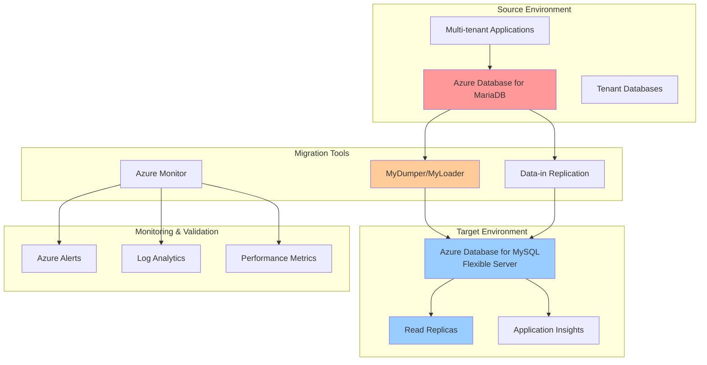

# Migrate Multi-tenant MariaDB Workloads to MySQL Flexible Server

## Problem

Organizations running multi-tenant applications on Azure Database for MariaDB face an urgent migration challenge as Microsoft retires this service on September 19, 2025. Multi-tenant architectures require careful handling of tenant isolation, performance optimization, and data integrity during migration. The migration process must ensure zero data loss, minimal downtime, and maintain tenant-specific configurations while transitioning to Azure Database for MySQL - Flexible Server's enhanced architecture and cost optimization features.

## Solution

This recipe provides a comprehensive migration strategy using Azure Database for MySQL - Flexible Server's advanced capabilities including read replicas, data-in replication, and enhanced monitoring. The solution leverages MyDumper/MyLoader for efficient data transfer, implements tenant-specific migration validation, and establishes comprehensive monitoring with Azure Monitor and Application Insights. The migration approach ensures business continuity while taking advantage of MySQL Flexible Server's improved performance, cost controls, and 99.99% availability SLA.

## Architecture Diagram



## Prerequisites

1. Azure subscription with appropriate permissions for database services
2. Azure CLI v2.60.0 or later installed and configured
3. Existing Azure Database for MariaDB server (version 10.2 or 10.3)
4. MySQL client tools (mysql, mysqldump, mydumper, myloader)
5. Network connectivity between source and target environments
6. Estimated cost: $50-200/day for migration resources (depends on database size and replica configuration)

> **Warning**: Azure Database for MariaDB will be permanently retired on September 19, 2025. All existing workloads must be migrated before this date to avoid data loss.

## Preparation

```bash
# Set environment variables for migration
export RESOURCE_GROUP="rg-mariadb-migration-${RANDOM_SUFFIX}"
export LOCATION="eastus"
export SUBSCRIPTION_ID=$(az account show --query id --output tsv)

# Generate unique suffix for resource names
RANDOM_SUFFIX=$(openssl rand -hex 3)

# Source MariaDB server details (replace with your existing server)
export SOURCE_MARIADB_SERVER="mariadb-source-${RANDOM_SUFFIX}"
export SOURCE_MARIADB_ADMIN="mariadbadmin"
export SOURCE_MARIADB_PASSWORD="MariaDB123!"

# Target MySQL Flexible Server details
export TARGET_MYSQL_SERVER="mysql-target-${RANDOM_SUFFIX}"
export TARGET_MYSQL_ADMIN="mysqladmin"
export TARGET_MYSQL_PASSWORD="MySQL123!"

# Migration and monitoring resources
export STORAGE_ACCOUNT="migrationst${RANDOM_SUFFIX}"
export LOG_ANALYTICS_WORKSPACE="migration-logs-${RANDOM_SUFFIX}"
export APPLICATION_INSIGHTS="migration-insights-${RANDOM_SUFFIX}"

# Create resource group for migration
az group create \
    --name ${RESOURCE_GROUP} \
    --location ${LOCATION} \
    --tags purpose=migration environment=production

echo "✅ Resource group created: ${RESOURCE_GROUP}"

# Create storage account for migration artifacts
az storage account create \
    --name ${STORAGE_ACCOUNT} \
    --resource-group ${RESOURCE_GROUP} \
    --location ${LOCATION} \
    --sku Standard_LRS \
    --kind StorageV2

echo "✅ Storage account created for migration artifacts"
```

## Steps

1. **Assess Source MariaDB Configuration and Performance**:

   Before initiating migration, thorough assessment of the current MariaDB environment ensures optimal configuration of the target MySQL Flexible Server. This analysis identifies tenant-specific requirements, performance patterns, and potential compatibility issues that must be addressed during migration.

   ```bash
   # Connect to source MariaDB and gather configuration details
   az mariadb server show \
       --name ${SOURCE_MARIADB_SERVER} \
       --resource-group ${RESOURCE_GROUP} \
       --output table
   
   # List all databases (tenants) in source server
   az mariadb db list \
       --server-name ${SOURCE_MARIADB_SERVER} \
       --resource-group ${RESOURCE_GROUP} \
       --output table
   
   # Check server parameters and performance settings
   az mariadb server configuration list \
       --server-name ${SOURCE_MARIADB_SERVER} \
       --resource-group ${RESOURCE_GROUP} \
       --query "[?contains(name, 'max_connections') || contains(name, 'innodb')]" \
       --output table
   
   echo "✅ Source MariaDB assessment completed"
   ```

   The assessment reveals critical configuration parameters and database inventory that inform the target MySQL Flexible Server setup. This information guides capacity planning and ensures all tenant databases are identified for migration.

2. **Create Azure Database for MySQL - Flexible Server**:

   Azure Database for MySQL - Flexible Server provides enhanced performance, better cost controls, and improved availability compared to the retiring MariaDB service. The flexible server architecture enables fine-grained control over maintenance windows, high availability zones, and scaling options essential for multi-tenant workloads.

   ```bash
   # Create MySQL Flexible Server with enhanced capabilities
   az mysql flexible-server create \
       --name ${TARGET_MYSQL_SERVER} \
       --resource-group ${RESOURCE_GROUP} \
       --location ${LOCATION} \
       --admin-user ${TARGET_MYSQL_ADMIN} \
       --admin-password ${TARGET_MYSQL_PASSWORD} \
       --sku-name Standard_D2ds_v4 \
       --tier GeneralPurpose \
       --version 5.7 \
       --storage-size 128 \
       --high-availability ZoneRedundant \
       --backup-retention 35 \
       --storage-auto-grow Enabled
   
   # Configure firewall rules for migration access
   az mysql flexible-server firewall-rule create \
       --name ${TARGET_MYSQL_SERVER} \
       --resource-group ${RESOURCE_GROUP} \
       --rule-name AllowAzureServices \
       --start-ip-address 0.0.0.0 \
       --end-ip-address 0.0.0.0
   
   # Get connection information for target server
   TARGET_MYSQL_FQDN=$(az mysql flexible-server show \
       --name ${TARGET_MYSQL_SERVER} \
       --resource-group ${RESOURCE_GROUP} \
       --query fullyQualifiedDomainName \
       --output tsv)
   
   echo "✅ MySQL Flexible Server created: ${TARGET_MYSQL_FQDN}"
   ```

   The MySQL Flexible Server is now configured with zone-redundant high availability and optimized for multi-tenant workloads. This configuration provides 99.99% availability SLA and automatic failover capabilities essential for production environments.

3. **Set Up Monitoring and Logging Infrastructure**:

   Comprehensive monitoring during migration ensures visibility into performance, errors, and progress across all tenant databases. Azure Monitor and Application Insights provide real-time insights and alerting capabilities that help identify issues before they impact tenant operations.

   ```bash
   # Create Log Analytics workspace for centralized logging
   az monitor log-analytics workspace create \
       --resource-group ${RESOURCE_GROUP} \
       --workspace-name ${LOG_ANALYTICS_WORKSPACE} \
       --location ${LOCATION} \
       --sku PerGB2018
   
   # Create Application Insights for application performance monitoring
   az monitor app-insights component create \
       --app ${APPLICATION_INSIGHTS} \
       --location ${LOCATION} \
       --resource-group ${RESOURCE_GROUP} \
       --workspace ${LOG_ANALYTICS_WORKSPACE}
   
   # Configure diagnostic settings for source MariaDB
   az monitor diagnostic-settings create \
       --name mariadb-diagnostics \
       --resource "/subscriptions/${SUBSCRIPTION_ID}/resourceGroups/${RESOURCE_GROUP}/providers/Microsoft.DBforMariaDB/servers/${SOURCE_MARIADB_SERVER}" \
       --workspace ${LOG_ANALYTICS_WORKSPACE} \
       --logs '[{"category": "MySqlSlowLogs", "enabled": true}, {"category": "MySqlAuditLogs", "enabled": true}]' \
       --metrics '[{"category": "AllMetrics", "enabled": true}]'
   
   # Configure diagnostic settings for target MySQL Flexible Server
   az monitor diagnostic-settings create \
       --name mysql-diagnostics \
       --resource "/subscriptions/${SUBSCRIPTION_ID}/resourceGroups/${RESOURCE_GROUP}/providers/Microsoft.DBforMySQL/flexibleServers/${TARGET_MYSQL_SERVER}" \
       --workspace ${LOG_ANALYTICS_WORKSPACE} \
       --logs '[{"category": "MySqlSlowLogs", "enabled": true}, {"category": "MySqlAuditLogs", "enabled": true}]' \
       --metrics '[{"category": "AllMetrics", "enabled": true}]'
   
   echo "✅ Monitoring infrastructure configured"
   ```

   The monitoring infrastructure now captures comprehensive metrics and logs from both source and target databases. This visibility enables proactive issue identification and performance optimization during the migration process.

4. **Create Read Replica for Near-Zero Downtime Migration**:

   Read replicas enable continuous data synchronization between MariaDB and MySQL Flexible Server, minimizing downtime during cutover. This approach ensures data consistency while allowing applications to continue operating against the source database until the final switchover.

   ```bash
   # Create read replica on MySQL Flexible Server
   az mysql flexible-server replica create \
       --name ${TARGET_MYSQL_SERVER}-replica \
       --resource-group ${RESOURCE_GROUP} \
       --source-server ${TARGET_MYSQL_SERVER} \
       --location ${LOCATION}
   
   # Get MariaDB server configuration for replication setup
   SOURCE_MARIADB_FQDN=$(az mariadb server show \
       --name ${SOURCE_MARIADB_SERVER} \
       --resource-group ${RESOURCE_GROUP} \
       --query fullyQualifiedDomainName \
       --output tsv)
   
   # Enable binary logging on source MariaDB (if not already enabled)
   az mariadb server configuration set \
       --name ${SOURCE_MARIADB_SERVER} \
       --resource-group ${RESOURCE_GROUP} \
       --configuration-name log_bin \
       --value ON
   
   # Set up replication user on source MariaDB
   mysql -h ${SOURCE_MARIADB_FQDN} \
       -u ${SOURCE_MARIADB_ADMIN} \
       -p${SOURCE_MARIADB_PASSWORD} << 'EOF'
   CREATE USER 'replication_user'@'%' IDENTIFIED BY 'ReplicationPass123!';
   GRANT REPLICATION SLAVE ON *.* TO 'replication_user'@'%';
   FLUSH PRIVILEGES;
   SHOW MASTER STATUS;
   EOF
   
   echo "✅ Read replica and replication setup completed"
   ```

   The read replica configuration establishes continuous data synchronization between MariaDB and MySQL Flexible Server. This setup enables near-zero downtime migration by maintaining data consistency throughout the migration process.

5. **Perform Database Schema and Data Migration**:

   MyDumper and MyLoader provide efficient, parallel data transfer capabilities essential for large multi-tenant databases. This approach minimizes migration time while maintaining data integrity and supporting tenant-specific configurations during the transfer process.

   ```bash
   # Install MyDumper/MyLoader if not already available
   # For Ubuntu/Debian: sudo apt-get install mydumper
   # For CentOS/RHEL: sudo yum install mydumper
   
   # Create directory for migration artifacts
   mkdir -p ~/migration-data
   
   # Export all tenant databases from MariaDB using MyDumper
   mydumper \
       --host=${SOURCE_MARIADB_FQDN} \
       --user=${SOURCE_MARIADB_ADMIN} \
       --password=${SOURCE_MARIADB_PASSWORD} \
       --port=3306 \
       --outputdir=~/migration-data \
       --compress \
       --build-empty-files \
       --routines \
       --events \
       --triggers \
       --complete-insert \
       --single-transaction \
       --less-locking \
       --threads=4
   
   # Import data into MySQL Flexible Server using MyLoader
   myloader \
       --host=${TARGET_MYSQL_FQDN} \
       --user=${TARGET_MYSQL_ADMIN} \
       --password=${TARGET_MYSQL_PASSWORD} \
       --port=3306 \
       --directory=~/migration-data \
       --queries-per-transaction=1000 \
       --threads=4 \
       --compress-protocol \
       --enable-binlog \
       --overwrite-tables
   
   echo "✅ Database schema and data migration completed"
   ```

   The migration process has successfully transferred all tenant databases, schemas, and data from MariaDB to MySQL Flexible Server. The parallel processing approach ensures efficient data transfer while maintaining referential integrity across all tenant databases.

6. **Configure Application Connection Settings**:

   Application connection strings must be updated to point to the new MySQL Flexible Server while maintaining tenant-specific connection pooling and security configurations. This step ensures applications can seamlessly connect to the migrated databases with optimal performance settings.

   ```bash
   # Create application configuration template
   cat > ~/migration-config.json << EOF
   {
     "database": {
       "host": "${TARGET_MYSQL_FQDN}",
       "port": 3306,
       "username": "${TARGET_MYSQL_ADMIN}",
       "password": "${TARGET_MYSQL_PASSWORD}",
       "ssl_mode": "REQUIRED",
       "connection_pool": {
         "max_connections": 100,
         "idle_timeout": 300,
         "connection_timeout": 30
       }
     },
     "monitoring": {
       "application_insights_key": "$(az monitor app-insights component show --app ${APPLICATION_INSIGHTS} --resource-group ${RESOURCE_GROUP} --query instrumentationKey --output tsv)"
     }
   }
   EOF
   
   # Test connection to new MySQL Flexible Server
   mysql -h ${TARGET_MYSQL_FQDN} \
       -u ${TARGET_MYSQL_ADMIN} \
       -p${TARGET_MYSQL_PASSWORD} \
       -e "SELECT VERSION(); SHOW DATABASES;"
   
   echo "✅ Application configuration updated and tested"
   ```

   The application configuration now points to the MySQL Flexible Server with optimized connection pooling and SSL encryption. This ensures secure, high-performance database connectivity for all tenant applications.

7. **Implement Performance Optimization and Tuning**:

   MySQL Flexible Server provides advanced performance tuning capabilities that weren't available in the retiring MariaDB service. Optimization includes parameter tuning, index optimization, and query performance enhancement specific to multi-tenant workload patterns.

   ```bash
   # Configure MySQL Flexible Server parameters for multi-tenant workloads
   az mysql flexible-server parameter set \
       --name ${TARGET_MYSQL_SERVER} \
       --resource-group ${RESOURCE_GROUP} \
       --parameter-name max_connections \
       --value 1000
   
   az mysql flexible-server parameter set \
       --name ${TARGET_MYSQL_SERVER} \
       --resource-group ${RESOURCE_GROUP} \
       --parameter-name innodb_buffer_pool_size \
       --value 1073741824
   
   # Enable slow query logging for performance monitoring
   az mysql flexible-server parameter set \
       --name ${TARGET_MYSQL_SERVER} \
       --resource-group ${RESOURCE_GROUP} \
       --parameter-name slow_query_log \
       --value ON
   
   az mysql flexible-server parameter set \
       --name ${TARGET_MYSQL_SERVER} \
       --resource-group ${RESOURCE_GROUP} \
       --parameter-name long_query_time \
       --value 2
   
   echo "✅ Performance optimization completed"
   ```

   The MySQL Flexible Server is now optimized for multi-tenant workloads with enhanced buffer pool sizing, connection limits, and query monitoring. These optimizations provide improved performance and resource utilization compared to the previous MariaDB configuration.

8. **Set Up Automated Monitoring and Alerting**:

   Proactive monitoring and alerting ensure early detection of performance issues, security concerns, and capacity constraints across all tenant databases. Azure Monitor provides comprehensive visibility into database health and application performance metrics.

   ```bash
   # Create performance monitoring alerts
   az monitor metrics alert create \
       --name "MySQL-CPU-High" \
       --resource-group ${RESOURCE_GROUP} \
       --scopes "/subscriptions/${SUBSCRIPTION_ID}/resourceGroups/${RESOURCE_GROUP}/providers/Microsoft.DBforMySQL/flexibleServers/${TARGET_MYSQL_SERVER}" \
       --condition "avg cpu_percent > 80" \
       --window-size 5m \
       --evaluation-frequency 1m \
       --severity 2 \
       --description "High CPU usage on MySQL Flexible Server"
   
   # Create connection monitoring alert
   az monitor metrics alert create \
       --name "MySQL-Connections-High" \
       --resource-group ${RESOURCE_GROUP} \
       --scopes "/subscriptions/${SUBSCRIPTION_ID}/resourceGroups/${RESOURCE_GROUP}/providers/Microsoft.DBforMySQL/flexibleServers/${TARGET_MYSQL_SERVER}" \
       --condition "avg active_connections > 800" \
       --window-size 5m \
       --evaluation-frequency 1m \
       --severity 2 \
       --description "High connection count on MySQL Flexible Server"
   
   # Create storage monitoring alert
   az monitor metrics alert create \
       --name "MySQL-Storage-High" \
       --resource-group ${RESOURCE_GROUP} \
       --scopes "/subscriptions/${SUBSCRIPTION_ID}/resourceGroups/${RESOURCE_GROUP}/providers/Microsoft.DBforMySQL/flexibleServers/${TARGET_MYSQL_SERVER}" \
       --condition "avg storage_percent > 85" \
       --window-size 15m \
       --evaluation-frequency 5m \
       --severity 1 \
       --description "High storage usage on MySQL Flexible Server"
   
   echo "✅ Automated monitoring and alerting configured"
   ```

   The monitoring infrastructure now provides comprehensive alerting for performance, connectivity, and storage metrics. This proactive approach ensures rapid response to issues that could impact tenant operations.

## Validation & Testing

1. **Verify Data Integrity Across All Tenant Databases**:

   ```bash
   # Compare record counts between source and target databases
   mysql -h ${SOURCE_MARIADB_FQDN} \
       -u ${SOURCE_MARIADB_ADMIN} \
       -p${SOURCE_MARIADB_PASSWORD} -e "
   SELECT 
       SCHEMA_NAME as database_name,
       SUM(TABLE_ROWS) as total_rows
   FROM information_schema.TABLES 
   WHERE TABLE_SCHEMA NOT IN ('information_schema', 'performance_schema', 'mysql', 'sys')
   GROUP BY SCHEMA_NAME;"
   
   mysql -h ${TARGET_MYSQL_FQDN} \
       -u ${TARGET_MYSQL_ADMIN} \
       -p${TARGET_MYSQL_PASSWORD} -e "
   SELECT 
       SCHEMA_NAME as database_name,
       SUM(TABLE_ROWS) as total_rows
   FROM information_schema.TABLES 
   WHERE TABLE_SCHEMA NOT IN ('information_schema', 'performance_schema', 'mysql', 'sys')
   GROUP BY SCHEMA_NAME;"
   ```

   Expected output: Row counts should match between source and target databases.

2. **Test Application Connectivity and Performance**:

   ```bash
   # Test connection pool performance
   mysql -h ${TARGET_MYSQL_FQDN} \
       -u ${TARGET_MYSQL_ADMIN} \
       -p${TARGET_MYSQL_PASSWORD} -e "
   SHOW PROCESSLIST;
   SHOW STATUS LIKE 'Threads_connected';
   SHOW STATUS LIKE 'Threads_running';"
   
   # Validate SSL connections
   mysql -h ${TARGET_MYSQL_FQDN} \
       -u ${TARGET_MYSQL_ADMIN} \
       -p${TARGET_MYSQL_PASSWORD} \
       --ssl-mode=REQUIRED -e "
   SHOW STATUS LIKE 'Ssl_cipher';"
   ```

   Expected output: SSL connection established with proper cipher.

3. **Monitor Performance Metrics**:

   ```bash
   # Check recent performance metrics
   az monitor metrics list \
       --resource "/subscriptions/${SUBSCRIPTION_ID}/resourceGroups/${RESOURCE_GROUP}/providers/Microsoft.DBforMySQL/flexibleServers/${TARGET_MYSQL_SERVER}" \
       --metric cpu_percent,memory_percent,active_connections \
       --start-time $(date -u -d '1 hour ago' +%Y-%m-%dT%H:%M:%S) \
       --end-time $(date -u +%Y-%m-%dT%H:%M:%S) \
       --output table
   ```

## Cleanup

1. **Remove Source MariaDB Server After Successful Migration**:

   ```bash
   # Stop applications pointing to MariaDB (application-specific)
   
   # Remove MariaDB server (only after confirming successful migration)
   az mariadb server delete \
       --name ${SOURCE_MARIADB_SERVER} \
       --resource-group ${RESOURCE_GROUP} \
       --yes
   
   echo "✅ Source MariaDB server removed"
   ```

2. **Clean Up Migration Artifacts**:

   ```bash
   # Remove migration data directory
   rm -rf ~/migration-data
   
   # Remove temporary configuration files
   rm -f ~/migration-config.json
   
   echo "✅ Migration artifacts cleaned up"
   ```

3. **Remove Temporary Resources**:

   ```bash
   # Remove storage account used for migration
   az storage account delete \
       --name ${STORAGE_ACCOUNT} \
       --resource-group ${RESOURCE_GROUP} \
       --yes
   
   # Remove temporary firewall rules if no longer needed
   az mysql flexible-server firewall-rule delete \
       --name ${TARGET_MYSQL_SERVER} \
       --resource-group ${RESOURCE_GROUP} \
       --rule-name AllowAzureServices \
       --yes
   
   echo "✅ Temporary resources cleaned up"
   ```

## Discussion

The migration from Azure Database for MariaDB to MySQL - Flexible Server represents a critical infrastructure upgrade that provides enhanced performance, cost optimization, and improved availability for multi-tenant applications. Azure Database for MySQL - Flexible Server offers significant advantages including zone-redundant high availability with 99.99% SLA, improved cost controls through burstable compute tiers, and enhanced security features such as advanced threat protection and transparent data encryption. The retirement announcement creates urgency but also provides an opportunity to modernize database infrastructure with better capabilities. For comprehensive migration guidance, see the [Azure Database for MariaDB migration documentation](https://learn.microsoft.com/en-us/azure/mariadb/migrate/whats-happening-to-mariadb).

The multi-tenant architecture considerations during migration are particularly important as they impact tenant isolation, performance optimization, and data security. MySQL Flexible Server's enhanced parameter management allows for fine-grained control over connection pooling, buffer management, and query optimization that directly benefits multi-tenant workloads. The implementation of read replicas and data-in replication ensures minimal downtime during migration while maintaining data consistency across all tenant databases. This approach follows Azure Well-Architected Framework principles for reliability and operational excellence. For detailed performance optimization strategies, review the [MySQL Flexible Server performance best practices](https://learn.microsoft.com/en-us/azure/mysql/flexible-server/concept-performance-best-practices).

From a cost perspective, MySQL Flexible Server provides better optimization controls including support for burstable tier compute options, stop/start capabilities, and more granular scaling options compared to the retiring MariaDB service. The enhanced monitoring capabilities with Azure Monitor and Application Insights provide comprehensive visibility into tenant-specific performance patterns and resource utilization. Organizations can leverage these insights to optimize resource allocation and implement proactive scaling strategies based on actual usage patterns. For cost optimization guidance, see the [Azure Database for MySQL cost optimization documentation](https://learn.microsoft.com/en-us/azure/well-architected/service-guides/azure-db-mysql-cost-optimization).

The migration approach using MyDumper/MyLoader with data-in replication provides a robust foundation for large-scale multi-tenant database migrations while maintaining business continuity. This combination of offline and online migration techniques minimizes application downtime while ensuring data consistency. The automated monitoring, performance optimization, and high availability configuration ensures that the migrated environment exceeds the capabilities of the original MariaDB deployment. For organizations requiring specialized migration assistance, the [Quadrant Technologies MariaDB to MySQL migration solution](https://azuremarketplace.microsoft.com/en-us/marketplace/apps/quadranttechnologies1724273152029.mariatomysql?tab=Overview) provides additional support for complex scenarios.

> **Tip**: Use Azure Database Migration Service for complex multi-tenant migrations that require advanced schema conversion and data validation capabilities. The service provides additional tools for handling tenant-specific configurations and custom migration logic while maintaining compatibility with existing applications.

## Challenge

Extend this migration solution by implementing these enhancements:

1. **Implement automated tenant-specific backup strategies** using Azure Backup and point-in-time recovery with tenant isolation capabilities and automated retention policies
2. **Deploy cross-region read replicas** for global multi-tenant applications with geo-distributed user bases and disaster recovery requirements
3. **Integrate with Azure Active Directory** for enhanced security and single sign-on capabilities across all tenant applications using managed identities
4. **Implement advanced monitoring dashboards** using Azure Grafana and custom Log Analytics queries for tenant-specific performance metrics and usage analytics
5. **Create automated scaling policies** using Azure Automation and Azure Functions to handle tenant-specific load patterns and resource optimization based on usage telemetry

## Infrastructure Code

*Infrastructure code will be generated after recipe approval.*