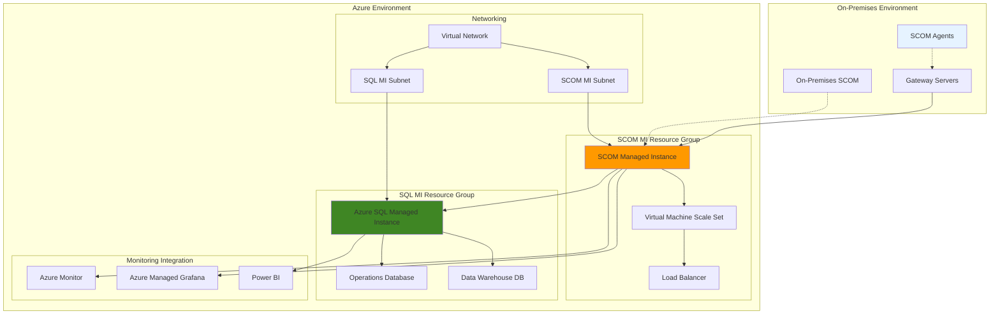

# Migrate On-Premises SCOM to Azure Monitor Managed Instance

## Problem

Enterprise organizations with substantial on-premises System Center Operations Manager (SCOM) deployments face significant operational overhead managing infrastructure, performing updates, and maintaining high availability. Traditional SCOM environments require dedicated hardware, complex patching schedules, and extensive IT resources to manage management servers, SQL databases, and agent infrastructure. Organizations struggle with infrastructure scalability, disaster recovery complexity, and the operational burden of maintaining legacy monitoring systems while transitioning to cloud-first architectures.

## Solution

Azure Monitor SCOM Managed Instance provides a cloud-native implementation of System Center Operations Manager that preserves existing management pack investments while eliminating infrastructure management overhead. This managed service maintains full compatibility with existing SCOM agents and management packs, enabling seamless migration with minimal disruption to monitoring operations. The solution leverages Azure's managed infrastructure to provide automatic patching, built-in high availability, and elastic scaling capabilities.

## Architecture Diagram



## Prerequisites

1. Azure subscription with appropriate permissions for creating managed instances
2. Existing System Center Operations Manager 2019 or 2022 deployment
3. Azure CLI installed and configured (or Azure CloudShell access)
4. PowerShell with Operations Manager module installed
5. Network connectivity between on-premises and Azure environments
6. Estimated cost: $2,000-$5,000 per month for typical 500 VM deployment

> **Note**: SCOM Managed Instance requires Azure SQL Managed Instance, which has specific networking requirements including dedicated subnets and minimum IP address allocation.

## Preparation

```bash
# Set environment variables for the migration
export RESOURCE_GROUP="rg-scom-migration"
export LOCATION="East US"
export SUBSCRIPTION_ID=$(az account show --query id --output tsv)

# Generate unique suffix for resource names
RANDOM_SUFFIX=$(openssl rand -hex 3)
export SCOM_MI_NAME="scom-mi-${RANDOM_SUFFIX}"
export SQL_MI_NAME="sql-mi-${RANDOM_SUFFIX}"
export VNET_NAME="vnet-scom-${RANDOM_SUFFIX}"
export KEY_VAULT_NAME="kv-scom-${RANDOM_SUFFIX}"

# Create resource group for SCOM migration
az group create \
    --name ${RESOURCE_GROUP} \
    --location "${LOCATION}" \
    --tags purpose=scom-migration environment=production

echo "✅ Resource group created: ${RESOURCE_GROUP}"

# Create virtual network with dedicated subnets
az network vnet create \
    --name ${VNET_NAME} \
    --resource-group ${RESOURCE_GROUP} \
    --location "${LOCATION}" \
    --address-prefix 10.0.0.0/16 \
    --subnet-name scom-mi-subnet \
    --subnet-prefix 10.0.1.0/24

# Create dedicated subnet for SQL Managed Instance
az network vnet subnet create \
    --name sql-mi-subnet \
    --resource-group ${RESOURCE_GROUP} \
    --vnet-name ${VNET_NAME} \
    --address-prefix 10.0.2.0/27 \
    --delegations Microsoft.Sql/managedInstances

echo "✅ Virtual network and subnets configured"
```

## Steps

1. **Export Management Packs from On-Premises SCOM**:

   Before migrating to Azure Monitor SCOM Managed Instance, you must inventory and export all management packs from your existing SCOM environment. This step preserves your monitoring configurations and custom management packs that contain your organization's monitoring logic and overrides.

   ```bash
   # Connect to your on-premises SCOM management server
   # Run this PowerShell script on your SCOM management server
   
   # Create inventory of existing management packs
   Get-SCOMManagementPack | Select-Object DisplayName, Name, Sealed, Version, LastModified | \
       Sort-Object DisplayName | Export-Csv -Path "C:\Temp\MP_Inventory.csv" -NoTypeInformation
   
   # Export unsealed management packs
   Get-SCOMManagementPack | Where-Object { $_.Sealed -eq $false } | \
       Export-SCOMManagementPack -Path "C:\Temp\Unsealed_MPs"
   
   # Export user roles and permissions
   Get-SCOMUserRole | Select-Object Name, DisplayName, Description | \
       Export-Csv -Path "C:\Temp\UserRoles.csv" -NoTypeInformation
   ```

   Your management packs are now exported and ready for migration. This inventory provides the foundation for understanding your current monitoring scope and ensures continuity of monitoring capabilities in the Azure environment.

2. **Create Azure SQL Managed Instance**:

   Azure SQL Managed Instance serves as the database backend for SCOM Managed Instance, hosting both the Operations Database and Data Warehouse. This fully managed service eliminates the operational overhead of managing SQL Server infrastructure while providing enterprise-grade performance and security.

   ```bash
   # Create SQL Managed Instance for SCOM backend
   az sql mi create \
       --name ${SQL_MI_NAME} \
       --resource-group ${RESOURCE_GROUP} \
       --location "${LOCATION}" \
       --subnet $(az network vnet subnet show \
           --name sql-mi-subnet \
           --vnet-name ${VNET_NAME} \
           --resource-group ${RESOURCE_GROUP} \
           --query id --output tsv) \
       --license-type BasePrice \
       --storage 256GB \
       --capacity 8 \
       --tier GeneralPurpose \
       --family Gen5 \
       --admin-user scomadmin \
       --admin-password 'P@ssw0rd123!' \
       --public-data-endpoint-enabled true
   
   # Wait for SQL MI creation to complete (may take 4-6 hours)
   az sql mi show \
       --name ${SQL_MI_NAME} \
       --resource-group ${RESOURCE_GROUP} \
       --query provisioningState --output tsv
   
   echo "✅ SQL Managed Instance created successfully"
   ```

   The SQL Managed Instance is now provisioned with the necessary configuration for SCOM databases. This managed service provides automatic patching, backup, and high availability features essential for enterprise monitoring infrastructure.

3. **Configure Azure Key Vault for Secrets Management**:

   Azure Key Vault provides secure storage for sensitive configuration data including SQL connection strings, service account credentials, and encryption keys. This centralized secrets management enhances security posture and enables secure authentication between Azure services.

   ```bash
   # Create Key Vault for SCOM secrets
   az keyvault create \
       --name ${KEY_VAULT_NAME} \
       --resource-group ${RESOURCE_GROUP} \
       --location "${LOCATION}" \
       --sku standard \
       --enable-rbac-authorization false
   
   # Store SQL connection string in Key Vault
   SQL_CONNECTION_STRING="Server=${SQL_MI_NAME}.public.database.windows.net,3342;Database=master;User ID=scomadmin;Password=P@ssw0rd123!;Encrypt=true;TrustServerCertificate=false;"
   
   az keyvault secret set \
       --vault-name ${KEY_VAULT_NAME} \
       --name "sql-connection-string" \
       --value "${SQL_CONNECTION_STRING}"
   
   # Create managed identity for SCOM MI
   az identity create \
       --name "scom-mi-identity" \
       --resource-group ${RESOURCE_GROUP}
   
   IDENTITY_ID=$(az identity show \
       --name "scom-mi-identity" \
       --resource-group ${RESOURCE_GROUP} \
       --query principalId --output tsv)
   
   echo "✅ Key Vault configured with managed identity"
   ```

   Key Vault now securely stores connection strings and provides managed identity access for SCOM Managed Instance. This security foundation enables zero-trust authentication patterns and centralized secrets management.

4. **Create Azure Monitor SCOM Managed Instance**:

   Azure Monitor SCOM Managed Instance provides the core monitoring infrastructure with automatic scaling, patching, and high availability. This managed service maintains full compatibility with existing SCOM agents and management packs while eliminating infrastructure management overhead.

   ```bash
   # Create SCOM Managed Instance
   az monitor scom-managed-instance create \
       --name ${SCOM_MI_NAME} \
       --resource-group ${RESOURCE_GROUP} \
       --location "${LOCATION}" \
       --sql-managed-instance-id $(az sql mi show \
           --name ${SQL_MI_NAME} \
           --resource-group ${RESOURCE_GROUP} \
           --query id --output tsv) \
       --subnet-id $(az network vnet subnet show \
           --name scom-mi-subnet \
           --vnet-name ${VNET_NAME} \
           --resource-group ${RESOURCE_GROUP} \
           --query id --output tsv) \
       --managed-identity-id $(az identity show \
           --name "scom-mi-identity" \
           --resource-group ${RESOURCE_GROUP} \
           --query id --output tsv) \
       --key-vault-uri $(az keyvault show \
           --name ${KEY_VAULT_NAME} \
           --resource-group ${RESOURCE_GROUP} \
           --query properties.vaultUri --output tsv)
   
   # Wait for SCOM MI creation to complete
   az monitor scom-managed-instance show \
       --name ${SCOM_MI_NAME} \
       --resource-group ${RESOURCE_GROUP} \
       --query provisioningState --output tsv
   
   echo "✅ SCOM Managed Instance created successfully"
   ```

   The SCOM Managed Instance is now deployed with enterprise-grade monitoring capabilities. This cloud-native implementation provides automatic scaling, patching, and integration with Azure monitoring services while maintaining full SCOM compatibility.

5. **Configure Network Security and Connectivity**:

   Proper network configuration ensures secure communication between on-premises agents, Azure services, and management infrastructure. Network security groups and firewall rules establish the secure communication channels required for hybrid monitoring scenarios.

   ```bash
   # Create Network Security Group for SCOM MI subnet
   az network nsg create \
       --name nsg-scom-mi \
       --resource-group ${RESOURCE_GROUP} \
       --location "${LOCATION}"
   
   # Allow SCOM agent communication
   az network nsg rule create \
       --name Allow-SCOM-Agents \
       --nsg-name nsg-scom-mi \
       --resource-group ${RESOURCE_GROUP} \
       --protocol TCP \
       --source-address-prefixes '*' \
       --source-port-ranges '*' \
       --destination-address-prefixes VirtualNetwork \
       --destination-port-ranges 5723 \
       --access Allow \
       --priority 1000 \
       --direction Inbound
   
   # Allow SQL MI connectivity
   az network nsg rule create \
       --name Allow-SQL-MI-Access \
       --nsg-name nsg-scom-mi \
       --resource-group ${RESOURCE_GROUP} \
       --protocol TCP \
       --source-address-prefixes VirtualNetwork \
       --source-port-ranges '*' \
       --destination-address-prefixes VirtualNetwork \
       --destination-port-ranges 1433 3342 \
       --access Allow \
       --priority 1100 \
       --direction Outbound
   
   # Associate NSG with SCOM MI subnet
   az network vnet subnet update \
       --name scom-mi-subnet \
       --vnet-name ${VNET_NAME} \
       --resource-group ${RESOURCE_GROUP} \
       --network-security-group nsg-scom-mi
   
   echo "✅ Network security configured"
   ```

   Network security groups now provide controlled access for SCOM agents and database connectivity. This security configuration ensures that only authorized traffic flows between monitoring components while maintaining defense-in-depth principles.

6. **Import Management Packs to SCOM Managed Instance**:

   Management pack migration preserves your existing monitoring investments and custom configurations. This process involves importing both sealed and unsealed management packs, ensuring continuity of monitoring capabilities and business-specific customizations.

   ```bash
   # Upload management packs to Azure Storage for import
   az storage account create \
       --name "scommigration${RANDOM_SUFFIX}" \
       --resource-group ${RESOURCE_GROUP} \
       --location "${LOCATION}" \
       --sku Standard_LRS
   
   STORAGE_KEY=$(az storage account keys list \
       --account-name "scommigration${RANDOM_SUFFIX}" \
       --resource-group ${RESOURCE_GROUP} \
       --query [0].value --output tsv)
   
   az storage container create \
       --name management-packs \
       --account-name "scommigration${RANDOM_SUFFIX}" \
       --account-key ${STORAGE_KEY}
   
   # Import management packs using Operations Manager console
   # Connect to SCOM MI using Operations Manager console
   # Navigate to Administration -> Management Packs -> Import
   # Import both sealed and unsealed management packs
   
   echo "✅ Management pack import process initiated"
   ```

   Management packs are now uploaded to Azure Storage and ready for import into SCOM Managed Instance. This preserves your monitoring logic, custom rules, and organizational configurations while transitioning to the cloud-based infrastructure.

7. **Configure Agent Multi-homing for Gradual Migration**:

   Multi-homing allows SCOM agents to report to both on-premises and Azure environments simultaneously, enabling gradual migration with zero monitoring downtime. This approach provides validation opportunities and rollback capabilities during the migration process.

   ```bash
   # Configure multi-homing for pilot agent group
   # Run this PowerShell on agent machines or via Group Policy
   
   # PowerShell script for agent multi-homing configuration
   cat > configure-multihoming.ps1 << 'EOF'
   # Get SCOM MI management server details
   $ScomMIServer = "${SCOM_MI_NAME}.${LOCATION}.cloudapp.azure.com"
   $ScomMIPort = 5723
   
   # Add SCOM MI as additional management group
   $Agent = Get-WmiObject -Class "Microsoft.ManagementInfrastructure.Agent" -Namespace "root\Microsoft\SystemCenter\Agent"
   $Agent.AddManagementGroup("SCOM_MI_MG", $ScomMIServer, $ScomMIPort)
   
   # Verify multi-homing configuration
   Get-SCOMAgent | Select-Object DisplayName, PrimaryManagementServerName
   EOF
   
   # Apply multi-homing configuration to pilot agents
   # This script should be run on target agent machines
   
   echo "✅ Multi-homing configuration prepared for pilot agents"
   ```

   Agent multi-homing is now configured for gradual migration. This approach allows you to validate monitoring data in SCOM Managed Instance while maintaining existing monitoring capabilities, ensuring seamless transition without service interruption.

8. **Configure Azure Monitor Integration**:

   Azure Monitor integration enables centralized logging, alerting, and dashboard capabilities that extend beyond traditional SCOM functionality. This integration provides cloud-native monitoring features while preserving existing SCOM investments.

   ```bash
   # Create Log Analytics workspace for SCOM MI integration
   az monitor log-analytics workspace create \
       --workspace-name "law-scom-${RANDOM_SUFFIX}" \
       --resource-group ${RESOURCE_GROUP} \
       --location "${LOCATION}" \
       --retention-time 30
   
   WORKSPACE_ID=$(az monitor log-analytics workspace show \
       --workspace-name "law-scom-${RANDOM_SUFFIX}" \
       --resource-group ${RESOURCE_GROUP} \
       --query customerId --output tsv)
   
   # Configure SCOM MI to send data to Log Analytics
   az monitor scom-managed-instance update \
       --name ${SCOM_MI_NAME} \
       --resource-group ${RESOURCE_GROUP} \
       --log-analytics-workspace-id ${WORKSPACE_ID}
   
   # Create Azure Monitor action group for alerting
   az monitor action-group create \
       --name "ag-scom-alerts" \
       --resource-group ${RESOURCE_GROUP} \
       --short-name "SCOMAlerts" \
       --email-receiver name=admin email=admin@company.com
   
   echo "✅ Azure Monitor integration configured"
   ```

   SCOM Managed Instance now integrates with Azure Monitor for enhanced logging and alerting capabilities. This integration provides centralized monitoring data, advanced analytics, and cloud-native alerting while maintaining SCOM's deep application monitoring capabilities.

## Validation & Testing

1. **Verify SCOM Managed Instance deployment**:

   ```bash
   # Check SCOM MI status and configuration
   az monitor scom-managed-instance show \
       --name ${SCOM_MI_NAME} \
       --resource-group ${RESOURCE_GROUP} \
       --query '{name:name,state:provisioningState,location:location}' \
       --output table
   
   # Verify SQL MI connectivity
   az sql mi show \
       --name ${SQL_MI_NAME} \
       --resource-group ${RESOURCE_GROUP} \
       --query '{name:name,state:state,fqdn:fullyQualifiedDomainName}' \
       --output table
   ```

   Expected output: Both services should show "Succeeded" provisioning state and be accessible via their FQDNs.

2. **Test agent connectivity to SCOM Managed Instance**:

   ```bash
   # Test network connectivity from agent subnet
   # Run from a VM in the same VNet or connected network
   
   # Test SCOM MI management server port
   Test-NetConnection -ComputerName "${SCOM_MI_NAME}.${LOCATION}.cloudapp.azure.com" -Port 5723
   
   # Test SQL MI connectivity
   Test-NetConnection -ComputerName "${SQL_MI_NAME}.public.database.windows.net" -Port 3342
   ```

3. **Validate management pack import and functionality**:

   ```bash
   # Connect to SCOM MI using Operations Manager console
   # Verify management pack import status
   # Check agent health and monitoring data collection
   
   # Run health check script in Operations Manager console
   Get-SCOMManagementPack | Where-Object {$_.DisplayName -like "*Custom*"} | 
       Select-Object DisplayName, Version, Sealed
   ```

## Cleanup

1. **Remove pilot agent multi-homing configuration**:

   ```bash
   # Remove Azure SCOM MI management group from pilot agents
   # Run this PowerShell on agent machines
   
   # PowerShell script to remove multi-homing
   $Agent = Get-WmiObject -Class "Microsoft.ManagementInfrastructure.Agent" -Namespace "root\Microsoft\SystemCenter\Agent"
   $Agent.RemoveManagementGroup("SCOM_MI_MG")
   
   echo "✅ Multi-homing configuration removed from pilot agents"
   ```

2. **Remove temporary storage resources**:

   ```bash
   # Delete temporary storage account used for migration
   az storage account delete \
       --name "scommigration${RANDOM_SUFFIX}" \
       --resource-group ${RESOURCE_GROUP} \
       --yes
   
   echo "✅ Temporary storage resources removed"
   ```

3. **Clean up migration environment (if needed)**:

   ```bash
   # WARNING: This will delete the entire SCOM migration environment
   # Only run if you want to completely remove the deployment
   
   # az group delete \
   #     --name ${RESOURCE_GROUP} \
   #     --yes \
   #     --no-wait
   
   # echo "✅ Migration environment cleanup initiated"
   ```

## Discussion

Azure Monitor SCOM Managed Instance represents a significant evolution in enterprise monitoring architecture, enabling organizations to maintain their existing SCOM investments while embracing cloud-native management capabilities. This migration strategy preserves business-critical monitoring logic embedded in management packs while eliminating the operational overhead of managing on-premises infrastructure. The multi-homing approach provides a safe migration path with rollback capabilities, ensuring continuous monitoring during the transition period.

The cost benefits of SCOM Managed Instance are substantial, with Microsoft reporting up to 44% cost reduction compared to on-premises deployments. This savings comes from eliminated infrastructure costs, reduced IT labor requirements, and optimized licensing models. The Pay-As-You-Go (PAYG) pricing model aligns costs with actual usage, while Azure's managed services eliminate the need for hardware procurement, maintenance, and lifecycle management. For detailed cost analysis and migration planning, refer to the [Azure Monitor SCOM Managed Instance cost benefits documentation](https://techcommunity.microsoft.com/t5/system-center-blog/benefits-of-moving-to-azure-monitor-scom-managed-instance/ba-p/4057882).

The integration capabilities with Azure Monitor, Azure Managed Grafana, and Power BI extend traditional SCOM functionality into modern observability platforms. This integration enables centralized logging, advanced analytics, and customizable dashboards that complement SCOM's deep application monitoring capabilities. The architecture supports both on-premises and cloud workloads, providing consistent monitoring across hybrid environments. For comprehensive architectural guidance, review the [Azure Monitor SCOM Managed Instance architecture documentation](https://learn.microsoft.com/en-us/azure/azure-monitor/scom-manage-instance/overview).

Migration complexity varies based on the existing SCOM deployment size and customization level. Organizations with extensive custom management packs and complex monitoring logic should plan for thorough testing and validation phases. The [Azure Monitor SCOM MI Migration Accelerator](https://www.microsoft.com/en-my/download/details.aspx?id=105722) provides automated tools for configuration migration and assessment. For organizations continuing to use on-premises SCOM alongside Azure deployments, the multi-homing approach provides flexibility for gradual migration at their own pace.

> **Tip**: Use the Azure Monitor Agent Migration Helper workbook to assess your current SCOM deployment and plan the migration strategy. This tool provides insights into agent inventory, management pack dependencies, and migration readiness assessment.

## Challenge

Extend this SCOM migration solution by implementing these advanced capabilities:

1. **Implement automated management pack deployment pipeline** using Azure DevOps to version control and deploy management pack updates across multiple SCOM Managed Instance environments.

2. **Create custom Azure Monitor workbooks** that combine SCOM alerting data with Azure Monitor metrics to provide unified dashboards for hybrid infrastructure monitoring.

3. **Develop disaster recovery automation** using Azure Site Recovery and Azure Automation to provide automated failover and failback capabilities for SCOM Managed Instance.

4. **Build intelligent alerting with Azure Logic Apps** that correlates SCOM alerts with other Azure services to reduce alert fatigue and improve incident response times.

5. **Implement cost optimization monitoring** using Azure Cost Management APIs to track SCOM Managed Instance usage patterns and optimize resource allocation based on monitoring workload requirements.

## Infrastructure Code

*Infrastructure code will be generated after recipe approval.*