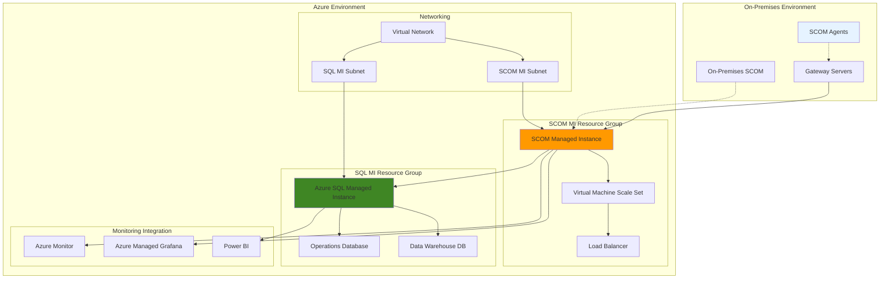

# Migrate On-Premises SCOM to Azure Monitor Managed Instance

## Problem

Enterprise organizations with substantial on-premises System Center Operations Manager (SCOM) deployments face significant operational overhead managing infrastructure, performing updates, and maintaining high availability. Traditional SCOM environments require dedicated hardware, complex patching schedules, and extensive IT resources to manage management servers, SQL databases, and agent infrastructure. Organizations struggle with infrastructure scalability, disaster recovery complexity, and the operational burden of maintaining legacy monitoring systems while transitioning to cloud-first architectures.

## Solution

Azure Monitor SCOM Managed Instance provides a cloud-native implementation of System Center Operations Manager that preserves existing management pack investments while eliminating infrastructure management overhead. This managed service maintains full compatibility with existing SCOM agents and management packs, enabling seamless migration with minimal disruption to monitoring operations. The solution leverages Azure's managed infrastructure to provide automatic patching, built-in high availability, and elastic scaling capabilities.

## Architecture Diagram



## Prerequisites

1. Azure subscription with appropriate permissions for creating managed instances
2. Existing System Center Operations Manager 2019 or 2022 deployment
3. Azure CLI installed and configured (or Azure CloudShell access)
4. PowerShell with Operations Manager module installed
5. On-premises Active Directory domain controller with network connectivity to Azure
6. Estimated cost: $2,000-$5,000 per month for typical 500 VM deployment

> **Note**: SCOM Managed Instance requires Azure SQL Managed Instance, which has specific networking requirements including dedicated subnets and minimum IP address allocation of /27 for SQL MI subnet.

## Preparation

```bash
# Set environment variables for the migration
export RESOURCE_GROUP="rg-scom-migration"
export LOCATION="eastus"
export SUBSCRIPTION_ID=$(az account show --query id --output tsv)

# Generate unique suffix for resource names
RANDOM_SUFFIX=$(openssl rand -hex 3)
export SCOM_MI_NAME="scom-mi-${RANDOM_SUFFIX}"
export SQL_MI_NAME="sql-mi-${RANDOM_SUFFIX}"
export VNET_NAME="vnet-scom-${RANDOM_SUFFIX}"
export KEY_VAULT_NAME="kv-scom-${RANDOM_SUFFIX}"

# Create resource group for SCOM migration
az group create \
    --name ${RESOURCE_GROUP} \
    --location ${LOCATION} \
    --tags purpose=scom-migration environment=production

echo "✅ Resource group created: ${RESOURCE_GROUP}"

# Create virtual network with dedicated subnets
az network vnet create \
    --name ${VNET_NAME} \
    --resource-group ${RESOURCE_GROUP} \
    --location ${LOCATION} \
    --address-prefix 10.0.0.0/16 \
    --subnet-name scom-mi-subnet \
    --subnet-prefix 10.0.1.0/24

# Create dedicated subnet for SQL Managed Instance
az network vnet subnet create \
    --name sql-mi-subnet \
    --resource-group ${RESOURCE_GROUP} \
    --vnet-name ${VNET_NAME} \
    --address-prefix 10.0.2.0/27 \
    --delegations Microsoft.Sql/managedInstances

echo "✅ Virtual network and subnets configured"
```

## Steps

1. **Export Management Packs from On-Premises SCOM**:

   Before migrating to Azure Monitor SCOM Managed Instance, you must inventory and export all management packs from your existing SCOM environment. Management packs contain your organization's monitoring rules, knowledge, and customizations that define how SCOM monitors applications and infrastructure components.

   ```powershell
   # Connect to your on-premises SCOM management server
   # Run this PowerShell script on your SCOM management server
   
   # Create inventory of existing management packs
   Get-SCOMManagementPack | Select-Object DisplayName, Name, Sealed, Version, LastModified | \
       Sort-Object DisplayName | Export-Csv -Path "C:\Temp\MP_Inventory.csv" -NoTypeInformation
   
   # Export unsealed management packs (custom/modified packs)
   Get-SCOMManagementPack | Where-Object { $_.Sealed -eq $false } | \
       Export-SCOMManagementPack -Path "C:\Temp\Unsealed_MPs"
   
   # Export user roles and permissions for reference
   Get-SCOMUserRole | Select-Object Name, DisplayName, Description | \
       Export-Csv -Path "C:\Temp\UserRoles.csv" -NoTypeInformation
   ```

   Your management packs are now exported and catalogued. This inventory provides the foundation for understanding your current monitoring scope and ensures continuity of monitoring capabilities in the Azure environment.

2. **Create Azure SQL Managed Instance**:

   Azure SQL Managed Instance serves as the database backend for SCOM Managed Instance, hosting both the Operations Database and Data Warehouse. This fully managed service provides enterprise-grade performance, security, and availability while eliminating the operational overhead of managing SQL Server infrastructure, patching, and backup operations.

   ```bash
   # Create SQL Managed Instance for SCOM backend
   az sql mi create \
       --name ${SQL_MI_NAME} \
       --resource-group ${RESOURCE_GROUP} \
       --location ${LOCATION} \
       --subnet $(az network vnet subnet show \
           --name sql-mi-subnet \
           --vnet-name ${VNET_NAME} \
           --resource-group ${RESOURCE_GROUP} \
           --query id --output tsv) \
       --license-type BasePrice \
       --storage 256GB \
       --capacity 8 \
       --tier GeneralPurpose \
       --family Gen5 \
       --admin-user scomadmin \
       --admin-password 'ComplexP@ssw0rd123!' \
       --public-data-endpoint-enabled true
   
   # Monitor SQL MI creation progress (may take 4-6 hours)
   echo "Waiting for SQL Managed Instance creation..."
   az sql mi show \
       --name ${SQL_MI_NAME} \
       --resource-group ${RESOURCE_GROUP} \
       --query provisioningState --output tsv
   
   echo "✅ SQL Managed Instance creation initiated"
   ```

   The SQL Managed Instance is now provisioning with the necessary configuration for SCOM databases. This managed service provides automatic patching, backup, and high availability features essential for enterprise monitoring infrastructure while maintaining full SQL Server compatibility.

3. **Configure Azure Key Vault for Secrets Management**:

   Azure Key Vault provides secure, centralized storage for sensitive configuration data including domain credentials, connection strings, and encryption keys. This security foundation enables zero-trust authentication patterns and meets enterprise compliance requirements for secrets management.

   ```bash
   # Create Key Vault for SCOM secrets management
   az keyvault create \
       --name ${KEY_VAULT_NAME} \
       --resource-group ${RESOURCE_GROUP} \
       --location ${LOCATION} \
       --sku standard \
       --enable-rbac-authorization false
   
   # Create managed identity for SCOM MI authentication
   az identity create \
       --name "scom-mi-identity" \
       --resource-group ${RESOURCE_GROUP}
   
   IDENTITY_ID=$(az identity show \
       --name "scom-mi-identity" \
       --resource-group ${RESOURCE_GROUP} \
       --query principalId --output tsv)
   
   # Grant Key Vault access to managed identity
   az keyvault set-policy \
       --name ${KEY_VAULT_NAME} \
       --object-id ${IDENTITY_ID} \
       --secret-permissions get list
   
   echo "✅ Key Vault configured with managed identity access"
   ```

   Key Vault now provides secure storage with managed identity access for SCOM Managed Instance. This security architecture eliminates the need to store credentials in configuration files while providing centralized secrets management and audit capabilities.

4. **Store Domain Credentials in Key Vault**:

   Domain credentials must be securely stored in Key Vault to enable SCOM Managed Instance to join your Active Directory domain and authenticate with domain resources. This step ensures secure credential management following Azure security best practices.

   ```bash
   # Store domain username in Key Vault
   # Replace with your actual domain username
   az keyvault secret set \
       --vault-name ${KEY_VAULT_NAME} \
       --name "domain-username" \
       --value "scom-svc@yourdomain.com"
   
   # Store domain password in Key Vault
   # Replace with your actual domain password
   az keyvault secret set \
       --vault-name ${KEY_VAULT_NAME} \
       --name "domain-password" \
       --value "YourSecureDomainPassword123!"
   
   # Store SQL connection information for reference
   SQL_FQDN="${SQL_MI_NAME}.${SUBSCRIPTION_ID}.database.windows.net"
   az keyvault secret set \
       --vault-name ${KEY_VAULT_NAME} \
       --name "sql-server-fqdn" \
       --value "${SQL_FQDN}"
   
   echo "✅ Domain credentials securely stored in Key Vault"
   ```

   Domain credentials are now securely stored in Key Vault with appropriate access controls. These credentials will be used by SCOM Managed Instance to join the Active Directory domain and enable integrated authentication with your existing infrastructure.

5. **Create Network Security and Connectivity**:

   Proper network security configuration ensures secure communication between on-premises agents, Azure services, and management infrastructure. Network Security Groups (NSGs) establish defense-in-depth security by controlling traffic flow between subnets and external networks.

   ```bash
   # Create Network Security Group for SCOM MI subnet
   az network nsg create \
       --name nsg-scom-mi \
       --resource-group ${RESOURCE_GROUP} \
       --location ${LOCATION}
   
   # Allow SCOM agent communication (port 5723)
   az network nsg rule create \
       --name Allow-SCOM-Agents \
       --nsg-name nsg-scom-mi \
       --resource-group ${RESOURCE_GROUP} \
       --protocol TCP \
       --source-address-prefixes '*' \
       --source-port-ranges '*' \
       --destination-address-prefixes VirtualNetwork \
       --destination-port-ranges 5723 \
       --access Allow \
       --priority 1000 \
       --direction Inbound
   
   # Allow SQL MI connectivity
   az network nsg rule create \
       --name Allow-SQL-MI-Access \
       --nsg-name nsg-scom-mi \
       --resource-group ${RESOURCE_GROUP} \
       --protocol TCP \
       --source-address-prefixes VirtualNetwork \
       --source-port-ranges '*' \
       --destination-address-prefixes VirtualNetwork \
       --destination-port-ranges 1433 \
       --access Allow \
       --priority 1100 \
       --direction Outbound
   
   # Associate NSG with SCOM MI subnet
   az network vnet subnet update \
       --name scom-mi-subnet \
       --vnet-name ${VNET_NAME} \
       --resource-group ${RESOURCE_GROUP} \
       --network-security-group nsg-scom-mi
   
   echo "✅ Network security groups configured"
   ```

   Network security groups now provide controlled access for SCOM agents and database connectivity. This security configuration ensures that only authorized traffic flows between monitoring components while maintaining defense-in-depth security principles.

6. **Create SCOM Managed Instance via Azure Portal**:

   Azure Monitor SCOM Managed Instance must be created through the Azure portal as Azure CLI commands are not yet available for this service. The portal provides a guided experience with validation checks to ensure proper configuration and prerequisites.

   ```bash
   # Generate deployment parameters for portal creation
   echo "SCOM Managed Instance creation parameters:"
   echo "Resource Group: ${RESOURCE_GROUP}"
   echo "Instance Name: ${SCOM_MI_NAME}"
   echo "Location: ${LOCATION}"
   echo "VNet: ${VNET_NAME}"
   echo "Subnet: scom-mi-subnet"
   echo "SQL MI: ${SQL_MI_NAME}"
   echo "Key Vault: ${KEY_VAULT_NAME}"
   echo "Managed Identity: scom-mi-identity"
   
   echo "Navigate to Azure Portal -> SCOM Managed Instance -> Create"
   echo "Use the parameters above to complete the creation wizard"
   
   # Create placeholder for tracking deployment
   cat > scom-deployment-info.json << EOF
   {
     "resourceGroup": "${RESOURCE_GROUP}",
     "scomInstanceName": "${SCOM_MI_NAME}",
     "location": "${LOCATION}",
     "virtualNetwork": "${VNET_NAME}",
     "sqlManagedInstance": "${SQL_MI_NAME}",
     "keyVault": "${KEY_VAULT_NAME}",
     "deploymentStatus": "pending-portal-creation"
   }
   EOF
   
   echo "✅ Portal creation parameters generated"
   ```

   SCOM Managed Instance parameters are prepared for Azure portal creation. Navigate to the Azure portal and use these parameters to create the instance through the guided wizard, which includes prerequisite validation and configuration verification.

7. **Configure Management Pack Storage**:

   Management pack migration requires temporary storage for uploading exported management packs to Azure. Azure Storage provides secure, scalable storage for management pack files during the import process, enabling seamless transfer of monitoring configurations.

   ```bash
   # Create storage account for management pack uploads
   az storage account create \
       --name "scommigration${RANDOM_SUFFIX}" \
       --resource-group ${RESOURCE_GROUP} \
       --location ${LOCATION} \
       --sku Standard_LRS \
       --kind StorageV2
   
   # Get storage account key
   STORAGE_KEY=$(az storage account keys list \
       --account-name "scommigration${RANDOM_SUFFIX}" \
       --resource-group ${RESOURCE_GROUP} \
       --query [0].value --output tsv)
   
   # Create container for management packs
   az storage container create \
       --name management-packs \
       --account-name "scommigration${RANDOM_SUFFIX}" \
       --account-key ${STORAGE_KEY} \
       --public-access off
   
   # Generate SAS token for secure uploads
   EXPIRY_DATE=$(date -u -d "+30 days" +%Y-%m-%dT%H:%MZ)
   SAS_TOKEN=$(az storage container generate-sas \
       --name management-packs \
       --account-name "scommigration${RANDOM_SUFFIX}" \
       --account-key ${STORAGE_KEY} \
       --permissions rwl \
       --expiry ${EXPIRY_DATE} \
       --output tsv)
   
   echo "✅ Management pack storage configured"
   echo "Upload URL: https://scommigration${RANDOM_SUFFIX}.blob.core.windows.net/management-packs?${SAS_TOKEN}"
   ```

   Storage account is now configured for secure management pack uploads. Use the generated SAS URL to upload your exported management packs, which will then be imported into SCOM Managed Instance through the Operations Manager console.

8. **Configure Agent Multi-homing for Gradual Migration**:

   Multi-homing enables SCOM agents to report to both on-premises and Azure environments simultaneously, providing a safe migration path with zero monitoring downtime. This approach allows validation of monitoring data in the cloud environment while maintaining existing monitoring capabilities.

   ```bash
   # Generate multi-homing configuration script
   cat > configure-multihoming.ps1 << 'EOF'
   # SCOM Agent Multi-homing Configuration Script
   param(
       [Parameter(Mandatory=$true)]
       [string]$ScomMIFQDN,
       [int]$ScomMIPort = 5723
   )
   
   try {
       # Get current agent configuration
       $Agent = Get-WmiObject -Class "Microsoft.ManagementInfrastructure.Agent" -Namespace "root\Microsoft\SystemCenter\Agent"
       
       # Add SCOM MI as additional management group
       Write-Output "Adding SCOM MI management group..."
       $Agent.AddManagementGroup("SCOM_MI_MG", $ScomMIFQDN, $ScomMIPort)
       
       # Verify multi-homing configuration
       Write-Output "Current agent configuration:"
       Get-SCOMAgent | Select-Object DisplayName, PrimaryManagementServerName
       
       Write-Output "Multi-homing configuration completed successfully"
   }
   catch {
       Write-Error "Failed to configure multi-homing: $($_.Exception.Message)"
   }
   EOF
   
   # Create deployment instructions
   echo "Multi-homing configuration script created: configure-multihoming.ps1"
   echo "Deploy to pilot agents using: .\configure-multihoming.ps1 -ScomMIFQDN <SCOM-MI-FQDN>"
   
   echo "✅ Multi-homing configuration prepared"
   ```

   Agent multi-homing script is prepared for gradual migration deployment. This PowerShell script can be deployed to pilot agent groups to enable dual reporting, allowing validation of SCOM Managed Instance monitoring while maintaining existing on-premises monitoring capabilities.

## Validation & Testing

1. **Verify SCOM Managed Instance deployment**:

   ```bash
   # Check resource group for deployed resources
   az resource list \
       --resource-group ${RESOURCE_GROUP} \
       --output table
   
   # Verify SQL MI deployment status
   az sql mi show \
       --name ${SQL_MI_NAME} \
       --resource-group ${RESOURCE_GROUP} \
       --query '{name:name,state:state,fqdn:fullyQualifiedDomainName}' \
       --output table
   
   # Check network connectivity prerequisites
   az network vnet show \
       --name ${VNET_NAME} \
       --resource-group ${RESOURCE_GROUP} \
       --query '{name:name,location:location,addressSpace:addressSpace}' \
       --output table
   ```

   Expected output: SQL Managed Instance should show "Ready" state and all network resources should be properly deployed with correct configurations.

2. **Test network connectivity to Azure services**:

   ```powershell
   # Test connectivity from on-premises network
   # Run from a domain-joined machine with SCOM agent
   
   # Test SQL MI connectivity
   Test-NetConnection -ComputerName "${SQL_MI_NAME}.public.${SUBSCRIPTION_ID}.database.windows.net" -Port 3342
   
   # Test Key Vault connectivity
   Test-NetConnection -ComputerName "${KEY_VAULT_NAME}.vault.azure.net" -Port 443
   
   # Verify DNS resolution for Azure services
   Resolve-DnsName -Name "${SQL_MI_NAME}.public.${SUBSCRIPTION_ID}.database.windows.net"
   ```

3. **Validate management pack preparation**:

   ```powershell
   # Verify exported management pack files
   Get-ChildItem -Path "C:\Temp\Unsealed_MPs" -Recurse | 
       Select-Object Name, Length, LastWriteTime
   
   # Check management pack inventory
   Import-Csv -Path "C:\Temp\MP_Inventory.csv" | 
       Where-Object {$_.Sealed -eq $false} | 
       Select-Object DisplayName, Version
   ```

## Cleanup

1. **Remove temporary storage resources**:

   ```bash
   # Delete temporary storage account used for migration
   az storage account delete \
       --name "scommigration${RANDOM_SUFFIX}" \
       --resource-group ${RESOURCE_GROUP} \
       --yes
   
   echo "✅ Temporary storage resources removed"
   ```

2. **Remove pilot agent multi-homing configuration**:

   ```powershell
   # Remove Azure SCOM MI management group from pilot agents
   # Run this PowerShell on agent machines
   
   try {
       $Agent = Get-WmiObject -Class "Microsoft.ManagementInfrastructure.Agent" -Namespace "root\Microsoft\SystemCenter\Agent"
       $Agent.RemoveManagementGroup("SCOM_MI_MG")
       Write-Output "Multi-homing configuration removed successfully"
   }
   catch {
       Write-Error "Failed to remove multi-homing: $($_.Exception.Message)"
   }
   ```

3. **Clean up migration environment (if needed)**:

   ```bash
   # WARNING: This will delete the entire SCOM migration environment
   # Only run if you want to completely remove the deployment
   
   # az group delete \
   #     --name ${RESOURCE_GROUP} \
   #     --yes \
   #     --no-wait
   
   # echo "✅ Migration environment cleanup initiated"
   ```

## Discussion

Azure Monitor SCOM Managed Instance represents a significant evolution in enterprise monitoring architecture, enabling organizations to maintain their existing SCOM investments while embracing cloud-native management capabilities. This migration strategy preserves business-critical monitoring logic embedded in management packs while eliminating the operational overhead of managing on-premises infrastructure. The multi-homing approach provides a safe migration path with rollback capabilities, ensuring continuous monitoring during the transition period.

The cost benefits of SCOM Managed Instance are substantial, with Microsoft reporting up to 44% cost reduction compared to on-premises deployments. This savings comes from eliminated infrastructure costs, reduced IT labor requirements, and optimized licensing models. The Pay-As-You-Go (PAYG) pricing model aligns costs with actual usage, while Azure's managed services eliminate the need for hardware procurement, maintenance, and lifecycle management. For detailed cost analysis and migration planning, refer to the [Azure Monitor SCOM Managed Instance cost benefits documentation](https://techcommunity.microsoft.com/t5/system-center-blog/benefits-of-moving-to-azure-monitor-scom-managed-instance/ba-p/4057882).

The integration capabilities with Azure Monitor, Azure Managed Grafana, and Power BI extend traditional SCOM functionality into modern observability platforms. This integration enables centralized logging, advanced analytics, and customizable dashboards that complement SCOM's deep application monitoring capabilities. The architecture supports both on-premises and cloud workloads, providing consistent monitoring across hybrid environments. For comprehensive architectural guidance, review the [Azure Monitor SCOM Managed Instance architecture documentation](https://learn.microsoft.com/en-us/azure/azure-monitor/scom-manage-instance/overview).

Migration complexity varies based on the existing SCOM deployment size and customization level. Organizations with extensive custom management packs and complex monitoring logic should plan for thorough testing and validation phases. The [Azure Monitor SCOM MI Migration Accelerator](https://www.microsoft.com/en-my/download/details.aspx?id=105722) provides automated tools for configuration migration and assessment. For organizations continuing to use on-premises SCOM alongside Azure deployments, the multi-homing approach provides flexibility for gradual migration at their own pace.

> **Tip**: Use the Azure Monitor Agent Migration Helper workbook to assess your current SCOM deployment and plan the migration strategy. This tool provides insights into agent inventory, management pack dependencies, and migration readiness assessment.

## Challenge

Extend this SCOM migration solution by implementing these advanced capabilities:

1. **Implement automated management pack deployment pipeline** using Azure DevOps to version control and deploy management pack updates across multiple SCOM Managed Instance environments with proper testing and approval workflows.

2. **Create custom Azure Monitor workbooks** that combine SCOM alerting data with Azure Monitor metrics to provide unified dashboards for hybrid infrastructure monitoring and cross-platform correlation.

3. **Develop disaster recovery automation** using Azure Site Recovery and Azure Automation to provide automated failover and failback capabilities for SCOM Managed Instance with RPO/RTO targets.

4. **Build intelligent alerting with Azure Logic Apps** that correlates SCOM alerts with other Azure services to reduce alert fatigue and improve incident response times through automated enrichment and routing.

5. **Implement cost optimization monitoring** using Azure Cost Management APIs to track SCOM Managed Instance usage patterns and optimize resource allocation based on monitoring workload requirements and seasonal patterns.

## Infrastructure Code

### Available Infrastructure as Code:

- [Infrastructure Code Overview](code/README.md) - Detailed description of all infrastructure components
- [Bicep](code/bicep/) - Azure Bicep templates
- [Bash CLI Scripts](code/scripts/) - Example bash scripts using Azure CLI commands to deploy infrastructure
- [Terraform](code/terraform/) - Terraform configuration files