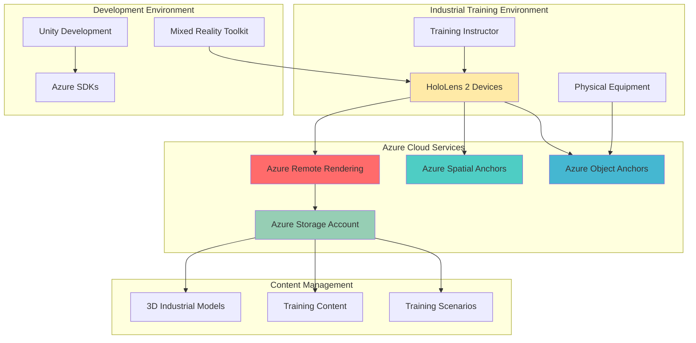

# Mixed Reality Industrial Training with Remote Rendering and Object Anchors

## Problem

Industrial training environments require complex 3D models and equipment visualization that traditional training methods cannot effectively deliver. Manufacturing facilities, oil refineries, and aerospace companies struggle with high-fidelity technical training because physical equipment is expensive, dangerous, or inaccessible for hands-on learning. Traditional 2D training materials and basic 3D models fail to provide the immersive, contextual learning experiences necessary for complex industrial procedures, resulting in longer training cycles and increased safety risks.

## Solution

Azure Remote Rendering enables cloud-based rendering of high-fidelity 3D industrial models that can be streamed to HoloLens 2 devices in real-time, while Azure Object Anchors and Azure Spatial Anchors provide precise spatial positioning and persistence. This combination creates an immersive mixed reality training platform where trainees can interact with photorealistic 3D models anchored to real-world objects, enabling hands-on learning with complex industrial equipment without physical constraints or safety concerns.

## Architecture Diagram



## Prerequisites

1. Azure subscription with appropriate permissions for Remote Rendering and Mixed Reality services
2. HoloLens 2 device with Windows Mixed Reality configured
3. Unity 2022.3 LTS or later with Mixed Reality Toolkit (MRTK) 3.0
4. Visual Studio 2022 with Universal Windows Platform development tools
5. Basic knowledge of C# programming and Unity development
6. Understanding of 3D modeling and industrial equipment visualization
7. Estimated cost: $200-500 for testing (Remote Rendering sessions, storage, and compute resources)

> **Note**: Azure Remote Rendering will be retired on September 30, 2025. Consider this timeline when planning production deployments and explore alternative solutions such as Unity Cloud Build or custom GPU-based rendering solutions.

## Preparation

```bash
# Set environment variables for Azure resources
export RESOURCE_GROUP="rg-industrial-training-${RANDOM_SUFFIX}"
export LOCATION="eastus"
export SUBSCRIPTION_ID=$(az account show --query id --output tsv)
export ARR_ACCOUNT_NAME="arr-training-${RANDOM_SUFFIX}"
export STORAGE_ACCOUNT_NAME="sttraining${RANDOM_SUFFIX}"
export SPATIAL_ANCHORS_ACCOUNT="sa-training-${RANDOM_SUFFIX}"

# Generate unique suffix for resource names
RANDOM_SUFFIX=$(openssl rand -hex 3)

# Create resource group for industrial training platform
az group create \
    --name ${RESOURCE_GROUP} \
    --location ${LOCATION} \
    --tags purpose=industrial-training environment=demo \
           project=mixed-reality-training

echo "✅ Resource group created: ${RESOURCE_GROUP}"

# Register required Azure resource providers
az provider register --namespace Microsoft.MixedReality
az provider register --namespace Microsoft.Storage
az provider register --namespace Microsoft.Compute

echo "✅ Azure providers registered for Mixed Reality services"
```

## Steps

1. **Create Azure Storage Account for 3D Models and Training Content**:

   Azure Storage provides the foundation for storing high-fidelity 3D industrial models, training scenarios, and application assets. The storage account will host complex CAD models, textures, and training content that Azure Remote Rendering will access for cloud-based rendering. This centralized storage approach enables version control, content management, and efficient distribution of training materials across multiple HoloLens devices.

   ```bash
   # Create storage account with blob and file services
   az storage account create \
       --name ${STORAGE_ACCOUNT_NAME} \
       --resource-group ${RESOURCE_GROUP} \
       --location ${LOCATION} \
       --sku Standard_LRS \
       --kind StorageV2 \
       --access-tier Hot \
       --https-only true
   
   # Get storage account key for configuration
   STORAGE_KEY=$(az storage account keys list \
       --account-name ${STORAGE_ACCOUNT_NAME} \
       --resource-group ${RESOURCE_GROUP} \
       --query '[0].value' --output tsv)
   
   # Create container for 3D models
   az storage container create \
       --name "3d-models" \
       --account-name ${STORAGE_ACCOUNT_NAME} \
       --account-key ${STORAGE_KEY} \
       --public-access off
   
   # Create container for training content
   az storage container create \
       --name "training-content" \
       --account-name ${STORAGE_ACCOUNT_NAME} \
       --account-key ${STORAGE_KEY} \
       --public-access off
   
   echo "✅ Storage account created with containers for 3D models and training content"
   ```

   The storage account is now configured with secure containers for industrial training assets. The Hot access tier ensures optimal performance for frequently accessed 3D models during training sessions, while the Standard_LRS replication provides cost-effective storage for development and testing environments.

2. **Create Azure Remote Rendering Account**:

   Azure Remote Rendering enables cloud-based rendering of complex 3D industrial models that exceed the computational capabilities of HoloLens 2 devices. This service leverages high-performance Azure GPU instances to render photorealistic models in real-time, streaming the rendered content to mixed reality devices. For industrial training, this means trainees can interact with full-detail CAD models of machinery, equipment, and facilities without performance limitations.

   ```bash
   # Create Azure Remote Rendering account
   az mixed-reality remote-rendering-account create \
       --name ${ARR_ACCOUNT_NAME} \
       --resource-group ${RESOURCE_GROUP} \
       --location ${LOCATION} \
       --tags purpose=industrial-training environment=demo
   
   # Get account details for application configuration
   ARR_ACCOUNT_ID=$(az mixed-reality remote-rendering-account show \
       --name ${ARR_ACCOUNT_NAME} \
       --resource-group ${RESOURCE_GROUP} \
       --query accountId --output tsv)
   
   ARR_ACCOUNT_DOMAIN=$(az mixed-reality remote-rendering-account show \
       --name ${ARR_ACCOUNT_NAME} \
       --resource-group ${RESOURCE_GROUP} \
       --query accountDomain --output tsv)
   
   # Get access key for authentication
   ARR_ACCESS_KEY=$(az mixed-reality remote-rendering-account key show \
       --name ${ARR_ACCOUNT_NAME} \
       --resource-group ${RESOURCE_GROUP} \
       --query primaryKey --output tsv)
   
   echo "✅ Remote Rendering account created: ${ARR_ACCOUNT_NAME}"
   echo "Account ID: ${ARR_ACCOUNT_ID}"
   echo "Account Domain: ${ARR_ACCOUNT_DOMAIN}"
   ```

   The Remote Rendering account is now ready to process 3D rendering sessions. This service will handle the computationally intensive task of rendering complex industrial models in the cloud, enabling HoloLens 2 devices to display high-fidelity content that would otherwise be impossible to render locally.

3. **Create Azure Spatial Anchors Account**:

   Azure Spatial Anchors provides cross-platform spatial positioning that enables persistent placement of 3D content in real-world environments. For industrial training, this service ensures that virtual machinery and equipment remain precisely positioned relative to physical objects across multiple training sessions and different users. This spatial persistence is crucial for creating consistent, repeatable training experiences in industrial environments.

   ```bash
   # Create Azure Spatial Anchors account
   az mixed-reality spatial-anchors-account create \
       --name ${SPATIAL_ANCHORS_ACCOUNT} \
       --resource-group ${RESOURCE_GROUP} \
       --location ${LOCATION} \
       --tags purpose=spatial-anchoring environment=industrial-training
   
   # Get account details for Unity integration
   SPATIAL_ANCHORS_ID=$(az mixed-reality spatial-anchors-account show \
       --name ${SPATIAL_ANCHORS_ACCOUNT} \
       --resource-group ${RESOURCE_GROUP} \
       --query accountId --output tsv)
   
   SPATIAL_ANCHORS_DOMAIN=$(az mixed-reality spatial-anchors-account show \
       --name ${SPATIAL_ANCHORS_ACCOUNT} \
       --resource-group ${RESOURCE_GROUP} \
       --query accountDomain --output tsv)
   
   # Get access key for authentication
   SPATIAL_ANCHORS_KEY=$(az mixed-reality spatial-anchors-account key show \
       --name ${SPATIAL_ANCHORS_ACCOUNT} \
       --resource-group ${RESOURCE_GROUP} \
       --query primaryKey --output tsv)
   
   echo "✅ Spatial Anchors account created: ${SPATIAL_ANCHORS_ACCOUNT}"
   echo "Account ID: ${SPATIAL_ANCHORS_ID}"
   echo "Account Domain: ${SPATIAL_ANCHORS_DOMAIN}"
   ```

   The Spatial Anchors account enables precise spatial positioning and persistence of virtual content in physical environments. This foundation allows industrial training scenarios to maintain consistent spatial relationships between virtual models and real-world equipment, creating immersive learning experiences that persist across training sessions.

4. **Upload Sample Industrial 3D Models**:

   Industrial training requires high-fidelity 3D models that represent real equipment and machinery. These models must be optimized for Azure Remote Rendering while maintaining the visual detail necessary for effective training. The upload process involves converting CAD models to appropriate formats and organizing them in the storage account for efficient retrieval during training sessions.

   ```bash
   # Create sample 3D model files (in production, use actual CAD models)
   mkdir -p ./industrial-models
   
   # Sample industrial equipment model (replace with actual .gltf/.glb files)
   cat > ./industrial-models/pump-assembly.json << 'EOF'
   {
     "name": "Industrial Pump Assembly",
     "description": "High-pressure centrifugal pump for industrial applications",
     "modelType": "machinery",
     "trainingScenarios": ["maintenance", "assembly", "troubleshooting"],
     "complexity": "high",
     "polygonCount": 2500000
   }
   EOF
   
   cat > ./industrial-models/control-panel.json << 'EOF'
   {
     "name": "Industrial Control Panel",
     "description": "Programmable logic controller interface panel",
     "modelType": "controls",
     "trainingScenarios": ["operation", "programming", "diagnostics"],
     "complexity": "medium",
     "polygonCount": 850000
   }
   EOF
   
   # Upload 3D model metadata to storage
   az storage blob upload \
       --file ./industrial-models/pump-assembly.json \
       --container-name "3d-models" \
       --name "pump-assembly/metadata.json" \
       --account-name ${STORAGE_ACCOUNT_NAME} \
       --account-key ${STORAGE_KEY}
   
   az storage blob upload \
       --file ./industrial-models/control-panel.json \
       --container-name "3d-models" \
       --name "control-panel/metadata.json" \
       --account-name ${STORAGE_ACCOUNT_NAME} \
       --account-key ${STORAGE_KEY}
   
   echo "✅ Industrial 3D model metadata uploaded to storage"
   ```

   The 3D model metadata is now stored in Azure Storage, providing the foundation for content management and retrieval during training sessions. In production environments, these would be accompanied by actual .gltf or .glb model files optimized for Azure Remote Rendering performance.

5. **Create Training Scenario Configuration**:

   Training scenarios define the learning objectives, procedures, and assessment criteria for industrial training sessions. These configurations integrate with the 3D models and spatial anchors to create structured learning experiences. Each scenario includes step-by-step procedures, safety protocols, and performance metrics that guide trainees through complex industrial processes.

   ```bash
   # Create training scenario configurations
   mkdir -p ./training-scenarios
   
   cat > ./training-scenarios/pump-maintenance.json << 'EOF'
   {
     "scenarioId": "pump-maintenance-001",
     "title": "Centrifugal Pump Maintenance Procedure",
     "description": "Step-by-step maintenance procedure for industrial centrifugal pumps",
     "duration": "45 minutes",
     "difficulty": "intermediate",
     "prerequisites": ["basic-pump-knowledge", "safety-training"],
     "objectives": [
       "Identify pump components and their functions",
       "Perform routine maintenance checks",
       "Troubleshoot common pump issues",
       "Document maintenance activities"
     ],
     "steps": [
       {
         "stepId": 1,
         "title": "Safety Lockout Procedure",
         "description": "Implement lockout/tagout safety procedures",
         "duration": "5 minutes",
         "safetyRequired": true
       },
       {
         "stepId": 2,
         "title": "Visual Inspection",
         "description": "Inspect pump housing and connections",
         "duration": "10 minutes",
         "interactiveElements": ["pump-housing", "connections", "gauges"]
       },
       {
         "stepId": 3,
         "title": "Performance Testing",
         "description": "Test pump performance and efficiency",
         "duration": "15 minutes",
         "measurements": ["pressure", "flow-rate", "vibration"]
       }
     ],
     "assessmentCriteria": {
       "safety": "mandatory",
       "accuracy": "85%",
       "timeLimit": "60 minutes"
     }
   }
   EOF
   
   cat > ./training-scenarios/control-panel-operation.json << 'EOF'
   {
     "scenarioId": "control-panel-001",
     "title": "Industrial Control Panel Operation",
     "description": "Operating procedures for programmable logic controller interfaces",
     "duration": "30 minutes",
     "difficulty": "beginner",
     "prerequisites": ["electrical-safety", "basic-controls"],
     "objectives": [
       "Navigate control panel interface",
       "Monitor system parameters",
       "Respond to alarms and alerts",
       "Perform routine operations"
     ],
     "steps": [
       {
         "stepId": 1,
         "title": "System Startup",
         "description": "Power on and initialize control system",
         "duration": "5 minutes",
         "interactiveElements": ["power-switch", "status-lights", "display"]
       },
       {
         "stepId": 2,
         "title": "Parameter Monitoring",
         "description": "Monitor key system parameters",
         "duration": "15 minutes",
         "parameters": ["temperature", "pressure", "flow-rate", "status"]
       },
       {
         "stepId": 3,
         "title": "Alarm Response",
         "description": "Respond to system alarms appropriately",
         "duration": "10 minutes",
         "scenarios": ["high-pressure", "low-flow", "system-fault"]
       }
     ],
     "assessmentCriteria": {
       "safety": "mandatory",
       "accuracy": "90%",
       "timeLimit": "45 minutes"
     }
   }
   EOF
   
   # Upload training scenarios to storage
   az storage blob upload \
       --file ./training-scenarios/pump-maintenance.json \
       --container-name "training-content" \
       --name "scenarios/pump-maintenance.json" \
       --account-name ${STORAGE_ACCOUNT_NAME} \
       --account-key ${STORAGE_KEY}
   
   az storage blob upload \
       --file ./training-scenarios/control-panel-operation.json \
       --container-name "training-content" \
       --name "scenarios/control-panel-operation.json" \
       --account-name ${STORAGE_ACCOUNT_NAME} \
       --account-key ${STORAGE_KEY}
   
   echo "✅ Training scenarios uploaded to storage"
   ```

   The training scenarios are now configured and stored in Azure Storage, providing structured learning experiences for industrial training. These scenarios integrate with the 3D models and spatial anchors to create comprehensive training programs that can be delivered through HoloLens 2 devices.

6. **Configure Azure Active Directory for Application Authentication**:

   Azure Active Directory provides enterprise-grade authentication and authorization for the industrial training platform. This configuration ensures secure access to training content and enables user management, role-based access control, and integration with existing enterprise identity systems. For industrial environments, this security layer is essential for protecting proprietary training content and maintaining compliance with industry regulations.

   ```bash
   # Create Azure AD application registration
   APP_NAME="industrial-training-platform"
   
   # Register application with Azure AD
   APP_ID=$(az ad app create \
       --display-name ${APP_NAME} \
       --sign-in-audience AzureADMyOrg \
       --query appId --output tsv)
   
   # Create service principal for the application
   az ad sp create --id ${APP_ID}
   
   # Configure application permissions for Mixed Reality services
   az ad app permission add \
       --id ${APP_ID} \
       --api 00000003-0000-0000-c000-000000000000 \
       --api-permissions 14dad69e-099b-42c9-810b-d002981feec1=Role
   
   # Grant admin consent for the permissions
   az ad app permission grant \
       --id ${APP_ID} \
       --api 00000003-0000-0000-c000-000000000000
   
   echo "✅ Azure AD application configured: ${APP_NAME}"
   echo "Application ID: ${APP_ID}"
   ```

   The Azure AD application is now configured with appropriate permissions for Mixed Reality services. This provides secure authentication for the training platform and enables integration with enterprise identity systems for user management and access control.

7. **Create Unity Project Configuration File**:

   Unity development requires specific configuration settings to integrate with Azure Remote Rendering, Spatial Anchors, and the Mixed Reality Toolkit. This configuration file contains the necessary service endpoints, authentication details, and project settings that enable the Unity application to communicate with Azure services and deliver immersive training experiences on HoloLens 2 devices.

   ```bash
   # Create Unity project configuration
   mkdir -p ./unity-project-config
   
   cat > ./unity-project-config/azure-services-config.json << EOF
   {
     "azureServices": {
       "remoteRendering": {
         "accountId": "${ARR_ACCOUNT_ID}",
         "accountDomain": "${ARR_ACCOUNT_DOMAIN}",
         "accountKey": "${ARR_ACCESS_KEY}",
         "serviceEndpoint": "https://remoterendering.${LOCATION}.mixedreality.azure.com"
       },
       "spatialAnchors": {
         "accountId": "${SPATIAL_ANCHORS_ID}",
         "accountDomain": "${SPATIAL_ANCHORS_DOMAIN}",
         "accountKey": "${SPATIAL_ANCHORS_KEY}",
         "serviceEndpoint": "https://sts.${LOCATION}.mixedreality.azure.com"
       },
       "storage": {
         "accountName": "${STORAGE_ACCOUNT_NAME}",
         "accountKey": "${STORAGE_KEY}",
         "modelsContainer": "3d-models",
         "trainingContainer": "training-content"
       },
       "azureAD": {
         "tenantId": "$(az account show --query tenantId --output tsv)",
         "clientId": "${APP_ID}",
         "redirectUri": "ms-appx-web://microsoft.aad.brokerplugin/{APP_ID}"
       }
     },
     "trainingPlatform": {
       "sessionSettings": {
         "maxConcurrentUsers": 10,
         "sessionTimeout": 3600,
         "renderingQuality": "high",
         "enableCollaboration": true
       },
       "modelSettings": {
         "lodLevels": ["high", "medium", "low"],
         "textureQuality": "high",
         "enablePhysics": true,
         "enableInteraction": true
       },
       "spatialSettings": {
         "anchorPersistence": true,
         "roomScale": true,
         "trackingAccuracy": "high",
         "enableWorldMapping": true
       }
     }
   }
   EOF
   
   # Create C# configuration class for Unity
   cat > ./unity-project-config/AzureServicesConfig.cs << 'EOF'
   using System;
   using UnityEngine;
   
   [Serializable]
   public class AzureServicesConfig
   {
       [Header("Azure Remote Rendering")]
       public string remoteRenderingAccountId;
       public string remoteRenderingAccountDomain;
       public string remoteRenderingAccountKey;
       public string remoteRenderingServiceEndpoint;
       
       [Header("Azure Spatial Anchors")]
       public string spatialAnchorsAccountId;
       public string spatialAnchorsAccountDomain;
       public string spatialAnchorsAccountKey;
       public string spatialAnchorsServiceEndpoint;
       
       [Header("Azure Storage")]
       public string storageAccountName;
       public string storageAccountKey;
       public string modelsContainer;
       public string trainingContainer;
       
       [Header("Azure AD")]
       public string tenantId;
       public string clientId;
       public string redirectUri;
       
       [Header("Training Platform Settings")]
       public int maxConcurrentUsers = 10;
       public int sessionTimeout = 3600;
       public string renderingQuality = "high";
       public bool enableCollaboration = true;
   }
   EOF
   
   echo "✅ Unity project configuration files created"
   ```

   The Unity project configuration is now ready with all necessary Azure service settings and authentication details. This configuration enables the Unity application to integrate with Azure Remote Rendering, Spatial Anchors, and Storage services for delivering immersive industrial training experiences.

8. **Create Training Platform Deployment Script**:

   The deployment script automates the setup and configuration of the industrial training platform, including resource validation, service connectivity testing, and initial content deployment. This script ensures that all Azure services are properly configured and ready for Unity development and HoloLens 2 deployment.

   ```bash
   # Create deployment validation script
   cat > ./deploy-training-platform.sh << 'EOF'
   #!/bin/bash
   
   echo "🔧 Industrial Training Platform Deployment Script"
   echo "================================================="
   
   # Validate Azure service connectivity
   echo "Validating Azure Remote Rendering service..."
   ARR_STATUS=$(az mixed-reality remote-rendering-account show \
       --name ${ARR_ACCOUNT_NAME} \
       --resource-group ${RESOURCE_GROUP} \
       --query provisioningState --output tsv 2>/dev/null)
   
   if [ "$ARR_STATUS" = "Succeeded" ]; then
       echo "✅ Azure Remote Rendering: Ready"
   else
       echo "❌ Azure Remote Rendering: Not Ready"
       exit 1
   fi
   
   echo "Validating Azure Spatial Anchors service..."
   SPATIAL_STATUS=$(az mixed-reality spatial-anchors-account show \
       --name ${SPATIAL_ANCHORS_ACCOUNT} \
       --resource-group ${RESOURCE_GROUP} \
       --query provisioningState --output tsv 2>/dev/null)
   
   if [ "$SPATIAL_STATUS" = "Succeeded" ]; then
       echo "✅ Azure Spatial Anchors: Ready"
   else
       echo "❌ Azure Spatial Anchors: Not Ready"
       exit 1
   fi
   
   echo "Validating Azure Storage service..."
   STORAGE_STATUS=$(az storage account show \
       --name ${STORAGE_ACCOUNT_NAME} \
       --resource-group ${RESOURCE_GROUP} \
       --query provisioningState --output tsv 2>/dev/null)
   
   if [ "$STORAGE_STATUS" = "Succeeded" ]; then
       echo "✅ Azure Storage: Ready"
   else
       echo "❌ Azure Storage: Not Ready"
       exit 1
   fi
   
   # Test storage connectivity
   echo "Testing storage blob access..."
   BLOB_COUNT=$(az storage blob list \
       --container-name "3d-models" \
       --account-name ${STORAGE_ACCOUNT_NAME} \
       --account-key ${STORAGE_KEY} \
       --query "length(@)" --output tsv)
   
   echo "✅ Storage containers accessible (${BLOB_COUNT} blobs in 3d-models)"
   
   # Generate Unity import package
   echo "Generating Unity configuration package..."
   zip -r unity-azure-config.zip ./unity-project-config/
   
   echo "🎉 Industrial Training Platform Deployment Complete!"
   echo "Next steps:"
   echo "1. Import unity-azure-config.zip into your Unity project"
   echo "2. Configure MRTK 3.0 for HoloLens 2 development"
   echo "3. Implement Azure Remote Rendering integration"
   echo "4. Set up spatial anchoring for equipment positioning"
   echo "5. Deploy and test on HoloLens 2 devices"
   EOF
   
   chmod +x ./deploy-training-platform.sh
   
   # Execute deployment validation
   ./deploy-training-platform.sh
   
   echo "✅ Training platform deployment script created and executed"
   ```

   The deployment script has validated all Azure services and created a Unity configuration package. This ensures that the industrial training platform infrastructure is properly configured and ready for Unity development and HoloLens 2 deployment.

## Validation & Testing

1. **Verify Azure Remote Rendering Service Status**:

   ```bash
   # Check Remote Rendering account status
   az mixed-reality remote-rendering-account show \
       --name ${ARR_ACCOUNT_NAME} \
       --resource-group ${RESOURCE_GROUP} \
       --output table
   
   # Test rendering session creation capability
   echo "Testing rendering session creation..."
   az mixed-reality remote-rendering session create \
       --account-name ${ARR_ACCOUNT_NAME} \
       --resource-group ${RESOURCE_GROUP} \
       --session-id "test-session-001" \
       --size "standard" \
       --lease-time 60
   ```

   Expected output: Remote Rendering account shows "Succeeded" status with valid session creation capability.

2. **Validate Spatial Anchors Service Integration**:

   ```bash
   # Verify Spatial Anchors account configuration
   az mixed-reality spatial-anchors-account show \
       --name ${SPATIAL_ANCHORS_ACCOUNT} \
       --resource-group ${RESOURCE_GROUP} \
       --query '{name:name, status:provisioningState, id:accountId}' \
       --output table
   
   # Test spatial anchors key access
   az mixed-reality spatial-anchors-account key show \
       --name ${SPATIAL_ANCHORS_ACCOUNT} \
       --resource-group ${RESOURCE_GROUP} \
       --query primaryKey --output tsv
   ```

   Expected output: Spatial Anchors account shows active status with accessible primary key.

3. **Test Storage Account and Training Content Access**:

   ```bash
   # List uploaded training content
   az storage blob list \
       --container-name "training-content" \
       --account-name ${STORAGE_ACCOUNT_NAME} \
       --account-key ${STORAGE_KEY} \
       --output table
   
   # Verify 3D models container
   az storage blob list \
       --container-name "3d-models" \
       --account-name ${STORAGE_ACCOUNT_NAME} \
       --account-key ${STORAGE_KEY} \
       --output table
   
   # Test blob download capability
   az storage blob download \
       --container-name "training-content" \
       --name "scenarios/pump-maintenance.json" \
       --file "./test-download.json" \
       --account-name ${STORAGE_ACCOUNT_NAME} \
       --account-key ${STORAGE_KEY}
   
   echo "✅ Training content successfully downloaded"
   ```

   Expected output: All containers show uploaded content with successful download capability.

4. **Validate Azure AD Application Configuration**:

   ```bash
   # Check application registration status
   az ad app show --id ${APP_ID} \
       --query '{name:displayName, id:appId, permissions:requiredResourceAccess}' \
       --output json
   
   # Verify service principal creation
   az ad sp show --id ${APP_ID} \
       --query '{name:displayName, enabled:accountEnabled}' \
       --output table
   ```

   Expected output: Application shows registered status with proper permissions and active service principal.

## Cleanup

1. **Stop and Remove Azure Remote Rendering Sessions**:

   ```bash
   # List active rendering sessions
   az mixed-reality remote-rendering session list \
       --account-name ${ARR_ACCOUNT_NAME} \
       --resource-group ${RESOURCE_GROUP} \
       --output table
   
   # Stop test session if running
   az mixed-reality remote-rendering session stop \
       --account-name ${ARR_ACCOUNT_NAME} \
       --resource-group ${RESOURCE_GROUP} \
       --session-id "test-session-001" || echo "No active sessions found"
   
   echo "✅ Remote rendering sessions stopped"
   ```

2. **Delete Azure AD Application Registration**:

   ```bash
   # Remove application registration
   az ad app delete --id ${APP_ID}
   
   echo "✅ Azure AD application registration deleted"
   ```

3. **Remove Local Development Files**:

   ```bash
   # Clean up local files
   rm -rf ./industrial-models
   rm -rf ./training-scenarios
   rm -rf ./unity-project-config
   rm -f ./deploy-training-platform.sh
   rm -f ./unity-azure-config.zip
   rm -f ./test-download.json
   
   echo "✅ Local development files cleaned up"
   ```

4. **Delete Azure Resource Group**:

   ```bash
   # Delete resource group and all contained resources
   az group delete \
       --name ${RESOURCE_GROUP} \
       --yes \
       --no-wait
   
   echo "✅ Resource group deletion initiated: ${RESOURCE_GROUP}"
   echo "Note: Deletion may take 10-15 minutes to complete"
   
   # Verify deletion (optional)
   az group exists --name ${RESOURCE_GROUP}
   ```

## Discussion

Azure Remote Rendering transforms industrial training by enabling cloud-based rendering of complex 3D models that exceed the computational capabilities of mixed reality devices. This service addresses the fundamental challenge of delivering high-fidelity visualization in resource-constrained environments, making it possible to display photorealistic industrial equipment and machinery through HoloLens 2 devices. The integration with Azure Spatial Anchors provides persistent spatial positioning, ensuring that virtual training content maintains consistent positioning relative to physical equipment across multiple sessions and users. For comprehensive guidance on mixed reality development, see the [Azure Mixed Reality documentation](https://docs.microsoft.com/en-us/azure/mixed-reality/) and [HoloLens 2 development guide](https://docs.microsoft.com/en-us/windows/mixed-reality/develop/development).

The spatial computing capabilities enabled by Azure Object Anchors and Spatial Anchors create immersive training experiences that bridge the gap between theoretical knowledge and practical application. By anchoring virtual content to real-world objects, trainees can perform hands-on procedures with digital representations of equipment while maintaining spatial awareness and context. This approach is particularly valuable in industrial environments where physical training may be dangerous, expensive, or impractical. The [Azure Spatial Anchors documentation](https://docs.microsoft.com/en-us/azure/spatial-anchors/) provides detailed implementation guidance for creating persistent spatial experiences.

From a business perspective, this mixed reality training platform reduces training costs, improves safety outcomes, and enables scalable knowledge transfer across global industrial operations. The cloud-based architecture ensures consistent training experiences regardless of physical location, while the integration with Azure Storage provides centralized content management and version control. Organizations can track training progress, assess competencies, and maintain compliance with industry safety standards through integrated analytics and reporting capabilities. For cost optimization strategies, review the [Azure Remote Rendering pricing guide](https://azure.microsoft.com/en-us/pricing/details/remote-rendering/) and [Mixed Reality services cost management](https://docs.microsoft.com/en-us/azure/mixed-reality/cost-management).

> **Warning**: Azure Remote Rendering will be retired on September 30, 2025. Plan migration to alternative solutions such as Unity Cloud Build, custom GPU rendering services, or third-party mixed reality platforms before this date. Existing applications should be evaluated for compatibility with replacement technologies.

> **Tip**: Optimize rendering performance by implementing level-of-detail (LOD) models and texture compression. Use Azure Monitor and Application Insights to track rendering session performance and identify optimization opportunities in your training scenarios.

## Challenge

Extend this industrial training platform by implementing these advanced capabilities:

1. **Multi-User Collaborative Training**: Implement real-time collaboration features using Azure SignalR Service and Azure Communication Services to enable multiple trainees and instructors to participate in shared training sessions with synchronized spatial content and voice communication.

2. **AI-Powered Training Assessment**: Integration with Azure Cognitive Services and Azure Machine Learning to provide automated assessment of trainee performance, gesture recognition for procedural validation, and intelligent feedback systems that adapt to individual learning patterns.

3. **Digital Twin Integration**: Connect the training platform with Azure Digital Twins to create live data integration from actual industrial equipment, enabling training scenarios that reflect real-time operational conditions and historical performance data.

4. **Advanced Haptic Feedback**: Implement haptic feedback systems using Azure IoT Hub and custom hardware integration to provide tactile sensations during virtual equipment interaction, enhancing the realism of maintenance and assembly training procedures.

5. **Predictive Maintenance Training**: Develop training scenarios that incorporate Azure Time Series Insights and anomaly detection capabilities to teach predictive maintenance techniques using historical equipment data and failure pattern recognition.

## Infrastructure Code

*Infrastructure code will be generated after recipe approval.*