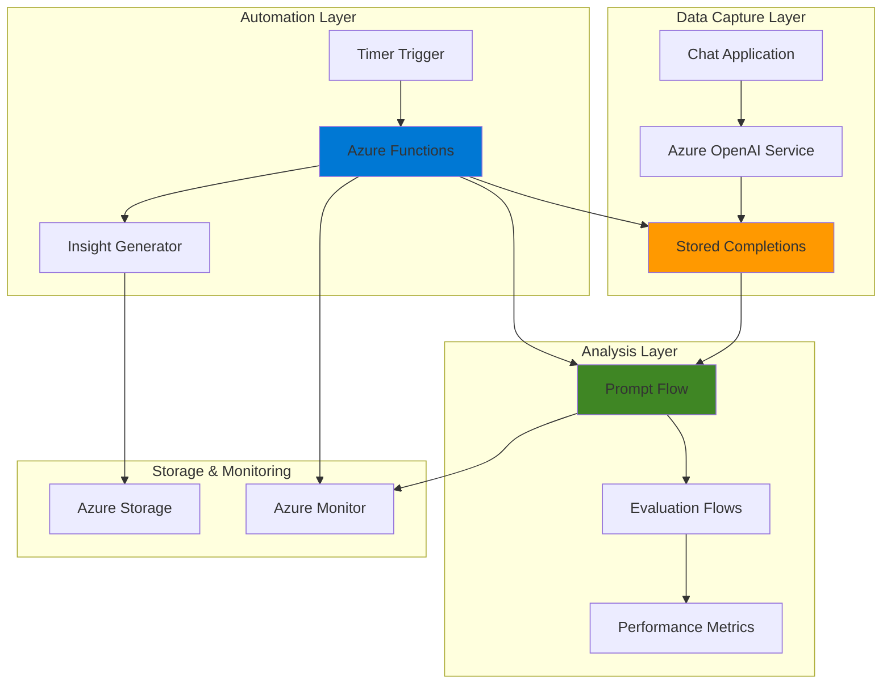

# Model Improvement Pipeline with Stored Completions and Prompt Flow

## Problem

Organizations deploying AI chatbots and virtual assistants struggle to continuously improve model performance without manual analysis of thousands of conversations. Existing approaches require data scientists to manually review chat logs, extract patterns, and identify failure modes, creating bottlenecks in the model improvement cycle. This reactive approach delays optimization efforts and prevents rapid iteration on prompt engineering and model fine-tuning.

## Solution

Build an automated pipeline that captures conversation data using Azure OpenAI's Stored Completions API, analyzes interaction patterns with Prompt Flow evaluation workflows, and generates actionable insights through Azure Functions orchestration. This solution enables continuous feedback collection, automated pattern detection, and streamlined model improvement processes that scale with production usage.

## Architecture Diagram



## Prerequisites

1. Azure subscription with Cognitive Services Contributor role for AI services
2. Azure CLI installed and configured (version 2.50.0 or later)
3. Basic understanding of AI model evaluation and prompt engineering concepts
4. Python 3.8+ knowledge for custom evaluation flows
5. Estimated cost: $20-40 for completion (includes OpenAI API calls, compute resources, and storage)

> **Note**: This configuration follows Azure Well-Architected Framework principles for AI workloads. Ensure proper access controls are configured before proceeding.

## Preparation

```bash
# Set environment variables for Azure resources
export RESOURCE_GROUP="rg-model-pipeline-${RANDOM_SUFFIX}"
export LOCATION="eastus"
export SUBSCRIPTION_ID=$(az account show --query id --output tsv)

# Generate unique suffix for resource names
RANDOM_SUFFIX=$(openssl rand -hex 3)

# Set service-specific variables
export OPENAI_SERVICE_NAME="openai-service-${RANDOM_SUFFIX}"
export FUNCTION_APP_NAME="func-insights-${RANDOM_SUFFIX}"
export STORAGE_ACCOUNT_NAME="st${RANDOM_SUFFIX}pipeline"
export ML_WORKSPACE_NAME="mlw-pipeline-${RANDOM_SUFFIX}"

# Create resource group
az group create \
    --name ${RESOURCE_GROUP} \
    --location ${LOCATION} \
    --tags purpose=recipe environment=demo

echo "✅ Resource group created: ${RESOURCE_GROUP}"
```

## Steps

1. **Create Azure OpenAI Service with Stored Completions Support**:

   Azure OpenAI Service provides the foundation for our model improvement pipeline by enabling conversation data capture through the Stored Completions API. This feature automatically stores input-output pairs from chat completions sessions, creating a valuable dataset for analysis and improvement. The stored completions can be enriched with metadata for enhanced filtering and categorization, supporting sophisticated analytics workflows.

   ```bash
   # Create Azure OpenAI Service
   az cognitiveservices account create \
       --name ${OPENAI_SERVICE_NAME} \
       --resource-group ${RESOURCE_GROUP} \
       --location ${LOCATION} \
       --kind OpenAI \
       --sku S0 \
       --custom-domain ${OPENAI_SERVICE_NAME}
   
   # Get OpenAI service endpoint and key
   export OPENAI_ENDPOINT=$(az cognitiveservices account show \
       --name ${OPENAI_SERVICE_NAME} \
       --resource-group ${RESOURCE_GROUP} \
       --query properties.endpoint --output tsv)
   
   export OPENAI_API_KEY=$(az cognitiveservices account keys list \
       --name ${OPENAI_SERVICE_NAME} \
       --resource-group ${RESOURCE_GROUP} \
       --query key1 --output tsv)
   
   echo "✅ Azure OpenAI Service created with endpoint: ${OPENAI_ENDPOINT}"
   ```

   The OpenAI service is now configured to support stored completions with the latest API version (2025-02-01-preview), enabling automatic conversation capture for all chat completion requests with rich metadata support.

2. **Deploy GPT Model for Conversation Capture**:

   Model deployment enables us to generate conversations that will be automatically captured by the Stored Completions API. We're deploying GPT-4o which provides high-quality responses while supporting all stored completions features including metadata enrichment and conversation history persistence. This deployment serves as the foundation for capturing production conversation patterns.

   ```bash
   # Deploy GPT-4o model for conversation capture
   az cognitiveservices account deployment create \
       --name ${OPENAI_SERVICE_NAME} \
       --resource-group ${RESOURCE_GROUP} \
       --deployment-name gpt-4o-deployment \
       --model-name gpt-4o \
       --model-version "2024-08-06" \
       --model-format OpenAI \
       --sku-capacity 10 \
       --sku-name Standard
   
   # Wait for deployment to complete
   echo "Waiting for model deployment to complete..."
   sleep 30
   
   echo "✅ GPT-4o model deployed successfully"
   ```

   The model deployment is now ready to process chat completions with automatic conversation storage when the `store` parameter is enabled, providing the data foundation for our improvement pipeline.

3. **Create Azure Machine Learning Workspace for Prompt Flow**:

   Azure Machine Learning workspace provides the platform for running Prompt Flow evaluation workflows. This managed service enables visual orchestration of LLM-based applications, built-in evaluation capabilities, and enterprise-grade security for model improvement pipelines. The workspace integrates seamlessly with Azure OpenAI Service for comprehensive AI lifecycle management and provides the computational environment for complex evaluation workflows.

   ```bash
   # Create Azure Machine Learning workspace
   az ml workspace create \
       --name ${ML_WORKSPACE_NAME} \
       --resource-group ${RESOURCE_GROUP} \
       --location ${LOCATION}
   
   # Get workspace details
   export ML_WORKSPACE_ID=$(az ml workspace show \
       --name ${ML_WORKSPACE_NAME} \
       --resource-group ${RESOURCE_GROUP} \
       --query id --output tsv)
   
   echo "✅ ML Workspace created: ${ML_WORKSPACE_NAME}"
   ```

   The ML workspace now provides the foundation for creating and executing Prompt Flow evaluation workflows with built-in monitoring, version control, and collaboration capabilities essential for enterprise AI operations.

4. **Create Storage Account for Pipeline Data**:

   Azure Storage provides scalable, secure storage for pipeline artifacts including conversation datasets, evaluation results, and generated insights. The storage account supports both blob storage for large datasets and table storage for structured metrics, enabling comprehensive data management throughout the model improvement lifecycle. This storage layer ensures data persistence and accessibility for continuous analysis.

   ```bash
   # Create storage account for pipeline data
   az storage account create \
       --name ${STORAGE_ACCOUNT_NAME} \
       --resource-group ${RESOURCE_GROUP} \
       --location ${LOCATION} \
       --sku Standard_LRS \
       --kind StorageV2
   
   # Get storage connection string
   export STORAGE_CONNECTION_STRING=$(az storage account show-connection-string \
       --name ${STORAGE_ACCOUNT_NAME} \
       --resource-group ${RESOURCE_GROUP} \
       --query connectionString --output tsv)
   
   # Create containers for pipeline data
   az storage container create \
       --name conversations \
       --connection-string "${STORAGE_CONNECTION_STRING}"
   
   az storage container create \
       --name insights \
       --connection-string "${STORAGE_CONNECTION_STRING}"
   
   echo "✅ Storage account created with containers for pipeline data"
   ```

   The storage account now provides organized containers for conversation data, evaluation results, and generated insights with appropriate access controls and lifecycle management policies.

5. **Generate Sample Conversations with Stored Completions**:

   To demonstrate the pipeline functionality, we'll generate sample conversations using the Stored Completions API. This step simulates real-world usage patterns where chat applications automatically capture conversation data for analysis. The metadata enrichment allows for sophisticated filtering and categorization of conversations based on user types, conversation topics, and quality indicators, enabling targeted analysis and improvement strategies.

   ```bash
   # Install required Python packages for conversation generation
   pip install openai azure-identity
   
   # Create Python script for conversation generation
   cat > generate_conversations.py << 'EOF'
import os
import json
from openai import AzureOpenAI
from azure.identity import DefaultAzureCredential, get_bearer_token_provider

# Initialize Azure OpenAI client with Azure AD authentication
token_provider = get_bearer_token_provider(
    DefaultAzureCredential(), 
    "https://cognitiveservices.azure.com/.default"
)

client = AzureOpenAI(
    azure_endpoint=os.getenv("OPENAI_ENDPOINT"),
    azure_ad_token_provider=token_provider,
    api_version="2025-02-01-preview"
)

# Sample conversation scenarios with diverse use cases
scenarios = [
    {
        "user_type": "customer_support",
        "category": "technical_issue",
        "messages": [
            {"role": "system", "content": "You are a helpful technical support assistant."},
            {"role": "user", "content": "My application keeps crashing when I try to upload files larger than 100MB."},
        ]
    },
    {
        "user_type": "sales_inquiry",
        "category": "product_info",
        "messages": [
            {"role": "system", "content": "You are a knowledgeable sales assistant."},
            {"role": "user", "content": "What are the key differences between your premium and enterprise plans?"},
        ]
    },
    {
        "user_type": "onboarding",
        "category": "getting_started",
        "messages": [
            {"role": "system", "content": "You are a friendly onboarding specialist."},
            {"role": "user", "content": "I just signed up for your service. How do I get started with my first project?"},
        ]
    },
    {
        "user_type": "billing_support",
        "category": "account_management",
        "messages": [
            {"role": "system", "content": "You are a billing support specialist."},
            {"role": "user", "content": "I need to understand the charges on my last invoice."},
        ]
    }
]

# Generate conversations with stored completions
for i, scenario in enumerate(scenarios):
    completion = client.chat.completions.create(
        model="gpt-4o-deployment",
        store=True,  # Enable stored completions
        metadata={
            "user_type": scenario["user_type"],
            "category": scenario["category"],
            "conversation_id": f"conv_{i+1}",
            "pipeline_source": "demo",
            "timestamp": str(datetime.utcnow())
        },
        messages=scenario["messages"]
    )
    
    print(f"Generated conversation {i+1}: {completion.id}")

print("✅ Sample conversations generated with stored completions enabled")
EOF

   # Run conversation generation
   python3 generate_conversations.py
   
   echo "✅ Sample conversations created with metadata for analysis"
   ```

   The conversation generation demonstrates how production applications can automatically capture interaction data with rich metadata for downstream analysis and model improvement, creating a comprehensive dataset for evaluation.

6. **Create Prompt Flow Evaluation Workflow**:

   Prompt Flow enables visual orchestration of evaluation workflows that analyze conversation quality, identify patterns, and generate metrics for model improvement. This evaluation flow processes stored completions to assess response quality, detect common issues, and provide actionable insights for prompt engineering and model fine-tuning. The workflow supports both automated metrics and human-in-the-loop evaluation patterns.

   ```bash
   # Create evaluation flow configuration
   cat > evaluation_flow.yaml << 'EOF'
$schema: https://azuremlschemas.azureedge.net/promptflow/latest/Flow.schema.json
environment:
  python_requirements_txt: |
    openai>=1.12.0
    azure-ai-ml>=1.12.0
    pandas>=2.0.0
    azure-identity>=1.15.0

inputs:
  conversations_data:
    type: object
    description: "Stored completions data from Azure OpenAI"
  
outputs:
  quality_score:
    type: number
    description: "Overall conversation quality score (1-10)"
  issue_categories:
    type: list
    description: "Identified issue categories"
  improvement_suggestions:
    type: list
    description: "Specific improvement recommendations"

nodes:
- name: analyze_quality
  type: python
  source:
    type: code
    path: analyze_quality.py
  inputs:
    conversations: ${inputs.conversations_data}
  
- name: categorize_issues
  type: python
  source:
    type: code
    path: categorize_issues.py
  inputs:
    conversations: ${inputs.conversations_data}
    quality_scores: ${analyze_quality.output}

- name: generate_insights
  type: llm
  source:
    type: code
    path: generate_insights.jinja2
  inputs:
    deployment_name: gpt-4o-deployment
    quality_data: ${analyze_quality.output}
    issue_data: ${categorize_issues.output}
  connection: azure_openai_connection
EOF

   # Create Python analysis scripts
   mkdir -p flow_components

   cat > flow_components/analyze_quality.py << 'EOF'
import json
import pandas as pd
from typing import Dict, List

def main(conversations: List[Dict]) -> Dict:
    """Analyze conversation quality metrics with comprehensive scoring"""
    quality_scores = []
    
    for conv in conversations:
        # Analyze response relevance, clarity, and completeness
        score = calculate_quality_score(conv)
        quality_scores.append({
            'conversation_id': conv.get('id', 'unknown'),
            'quality_score': score,
            'response_length': len(conv.get('response', '')),
            'user_type': conv.get('metadata', {}).get('user_type', 'unknown'),
            'category': conv.get('metadata', {}).get('category', 'unknown')
        })
    
    return {
        'scores': quality_scores,
        'average_quality': sum(s['quality_score'] for s in quality_scores) / len(quality_scores) if quality_scores else 0,
        'total_conversations': len(conversations),
        'quality_distribution': calculate_quality_distribution(quality_scores)
    }

def calculate_quality_score(conversation: Dict) -> float:
    """Calculate quality score based on response characteristics"""
    response = conversation.get('response', '')
    
    # Base quality score
    score = 5.0
    
    # Length appropriateness (not too short, not too long)
    if 50 <= len(response) <= 500:
        score += 1.0
    elif len(response) < 30:
        score -= 1.0
    
    # Presence of helpful information
    helpful_indicators = ['step', 'solution', 'help', 'recommend', 'suggest', 'guide']
    if any(word in response.lower() for word in helpful_indicators):
        score += 1.0
    
    # Professional courtesy indicators
    courtesy_indicators = ['please', 'thank you', 'happy to', 'glad to help']
    if any(word in response.lower() for word in courtesy_indicators):
        score += 0.5
    
    # Negative indicators that reduce quality
    negative_indicators = ['sorry, i cannot', "i don't know", 'unable to help']
    if any(phrase in response.lower() for phrase in negative_indicators):
        score -= 0.5
    
    return min(max(score, 1.0), 10.0)

def calculate_quality_distribution(scores: List[Dict]) -> Dict:
    """Calculate distribution of quality scores"""
    if not scores:
        return {}
    
    quality_values = [s['quality_score'] for s in scores]
    return {
        'excellent': len([s for s in quality_values if s >= 8.0]),
        'good': len([s for s in quality_values if 6.0 <= s < 8.0]),
        'fair': len([s for s in quality_values if 4.0 <= s < 6.0]),
        'poor': len([s for s in quality_values if s < 4.0])
    }
EOF

   echo "✅ Prompt Flow evaluation workflow created with enhanced analysis"
   ```

   The evaluation workflow is now configured to process stored completions data and generate comprehensive quality metrics, issue categorization, and actionable improvement recommendations with detailed scoring algorithms.

7. **Create Azure Functions for Pipeline Automation**:

   Azure Functions provides serverless orchestration for the model improvement pipeline, automatically triggering evaluation workflows, processing results, and generating actionable insights. The event-driven architecture ensures efficient resource utilization while enabling real-time response to new conversation data and scheduled analysis cycles. This automation layer supports both batch processing and real-time analysis patterns.

   ```bash
   # Create Function App for pipeline automation
   az functionapp create \
       --name ${FUNCTION_APP_NAME} \
       --resource-group ${RESOURCE_GROUP} \
       --storage-account ${STORAGE_ACCOUNT_NAME} \
       --consumption-plan-location ${LOCATION} \
       --runtime python \
       --runtime-version 3.12 \
       --functions-version 4
   
   # Configure application settings
   az functionapp config appsettings set \
       --name ${FUNCTION_APP_NAME} \
       --resource-group ${RESOURCE_GROUP} \
       --settings \
           "OPENAI_ENDPOINT=${OPENAI_ENDPOINT}" \
           "OPENAI_API_KEY=${OPENAI_API_KEY}" \
           "ML_WORKSPACE_NAME=${ML_WORKSPACE_NAME}" \
           "STORAGE_CONNECTION_STRING=${STORAGE_CONNECTION_STRING}"
   
   # Create function code for pipeline automation
   cat > pipeline_function.py << 'EOF'
import json
import logging
import os
import azure.functions as func
from openai import AzureOpenAI
from datetime import datetime, timedelta

app = func.FunctionApp()

@app.timer_trigger(schedule="0 0 * * * *", arg_name="mytimer")
def analyze_stored_completions(mytimer: func.TimerRequest) -> None:
    """Hourly function to analyze stored completions and generate insights"""
    
    if mytimer.past_due:
        logging.info('The timer is past due!')
    
    try:
        # Initialize OpenAI client
        client = AzureOpenAI(
            azure_endpoint=os.environ["OPENAI_ENDPOINT"],
            api_key=os.environ["OPENAI_API_KEY"],
            api_version="2025-02-01-preview"
        )
        
        # Retrieve recent stored completions
        stored_completions = client.chat.completions.list(
            limit=50,  # Analyze last 50 conversations
            order="desc"
        )
        
        # Analyze conversation patterns
        insights = analyze_conversation_patterns(stored_completions.data)
        
        # Store insights for further processing
        store_insights(insights)
        
        logging.info(f"Successfully analyzed {len(stored_completions.data)} conversations")
        
    except Exception as e:
        logging.error(f"Error in pipeline automation: {str(e)}")

def analyze_conversation_patterns(conversations):
    """Analyze patterns in stored completions with enhanced metrics"""
    patterns = {
        'total_conversations': len(conversations),
        'user_types': {},
        'categories': {},
        'quality_issues': [],
        'performance_metrics': {},
        'timestamp': datetime.utcnow().isoformat()
    }
    
    response_lengths = []
    
    for conv in conversations:
        metadata = conv.metadata or {}
        
        # Count user types
        user_type = metadata.get('user_type', 'unknown')
        patterns['user_types'][user_type] = patterns['user_types'].get(user_type, 0) + 1
        
        # Count categories
        category = metadata.get('category', 'unknown')
        patterns['categories'][category] = patterns['categories'].get(category, 0) + 1
        
        # Analyze response characteristics
        if conv.messages and len(conv.messages) > 0:
            last_message = conv.messages[-1]
            response_length = len(last_message.content)
            response_lengths.append(response_length)
            
            # Identify potential quality issues
            if response_length < 50:
                patterns['quality_issues'].append({
                    'conversation_id': conv.id,
                    'issue': 'response_too_short',
                    'user_type': user_type,
                    'category': category
                })
            elif response_length > 1000:
                patterns['quality_issues'].append({
                    'conversation_id': conv.id,
                    'issue': 'response_too_long',
                    'user_type': user_type,
                    'category': category
                })
    
    # Calculate performance metrics
    if response_lengths:
        patterns['performance_metrics'] = {
            'avg_response_length': sum(response_lengths) / len(response_lengths),
            'min_response_length': min(response_lengths),
            'max_response_length': max(response_lengths),
            'quality_issue_rate': len(patterns['quality_issues']) / len(conversations) if conversations else 0
        }
    
    return patterns

def store_insights(insights):
    """Store analysis insights for further processing"""
    # Implementation would store insights in Azure Storage
    logging.info(f"Storing insights: {json.dumps(insights, indent=2)}")
EOF

   echo "✅ Azure Functions created for pipeline automation with enhanced analytics"
   ```

   The Azure Functions app now provides automated orchestration of the model improvement pipeline with scheduled analysis, enhanced pattern detection, and comprehensive insight generation capabilities.

8. **Configure Continuous Integration Pipeline**:

   The final step establishes a continuous improvement loop that automatically processes new conversation data, runs evaluations, and generates actionable insights. This configuration enables real-time model performance monitoring and proactive identification of improvement opportunities without manual intervention. The monitoring system provides comprehensive observability into pipeline performance and model quality trends.

   ```bash
   # Create configuration for continuous monitoring
   cat > monitoring_config.json << 'EOF'
{
  "pipeline_settings": {
    "analysis_frequency": "hourly",
    "batch_size": 50,
    "quality_threshold": 7.0,
    "alert_conditions": [
      "average_quality < 6.0",
      "response_length < 30",
      "error_rate > 0.05",
      "quality_issue_rate > 0.15"
    ]
  },
  "evaluation_metrics": [
    "response_quality",
    "user_satisfaction_indicators",
    "conversation_completion_rate",
    "issue_resolution_patterns",
    "response_time_analysis"
  ],
  "improvement_actions": [
    "prompt_optimization",
    "fine_tuning_data_preparation",
    "issue_categorization_updates",
    "user_experience_enhancements",
    "quality_threshold_adjustments"
  ]
}
EOF

   # Enable monitoring and alerting
   az monitor log-analytics workspace create \
       --workspace-name "law-${RANDOM_SUFFIX}" \
       --resource-group ${RESOURCE_GROUP} \
       --location ${LOCATION}
   
   # Link Function App to Log Analytics
   export WORKSPACE_ID=$(az monitor log-analytics workspace show \
       --workspace-name "law-${RANDOM_SUFFIX}" \
       --resource-group ${RESOURCE_GROUP} \
       --query customerId --output tsv)
   
   az monitor diagnostic-settings create \
       --resource ${FUNCTION_APP_NAME} \
       --resource-group ${RESOURCE_GROUP} \
       --resource-type "Microsoft.Web/sites" \
       --name "pipeline-monitoring" \
       --workspace ${WORKSPACE_ID} \
       --logs '[{"category":"FunctionAppLogs","enabled":true}]'
   
   echo "✅ Continuous integration pipeline configured with comprehensive monitoring"
   ```

   The pipeline now operates continuously, analyzing conversation data, identifying patterns, and generating insights for ongoing model improvement with comprehensive monitoring, alerting, and performance tracking capabilities.

## Validation & Testing

1. **Verify Stored Completions Data Capture**:

   ```bash
   # Test stored completions retrieval
   python3 -c "
import os
from openai import AzureOpenAI
from azure.identity import DefaultAzureCredential, get_bearer_token_provider

token_provider = get_bearer_token_provider(
    DefaultAzureCredential(), 
    'https://cognitiveservices.azure.com/.default'
)

client = AzureOpenAI(
    azure_endpoint=os.environ['OPENAI_ENDPOINT'],
    azure_ad_token_provider=token_provider,
    api_version='2025-02-01-preview'
)

# List stored completions
completions = client.chat.completions.list(limit=5)
print(f'Found {len(completions.data)} stored completions')
for comp in completions.data:
    print(f'ID: {comp.id}, Metadata: {comp.metadata}')
"
   ```

   Expected output: List of stored completions with IDs and metadata showing conversation capture is working correctly.

2. **Test Function App Pipeline Execution**:

   ```bash
   # Manually trigger function execution
   az functionapp function invoke \
       --name ${FUNCTION_APP_NAME} \
       --resource-group ${RESOURCE_GROUP} \
       --function-name "analyze_stored_completions"
   
   # Check function execution logs
   az functionapp logs tail \
       --name ${FUNCTION_APP_NAME} \
       --resource-group ${RESOURCE_GROUP}
   ```

   Expected output: Function execution logs showing successful analysis of stored completions and insight generation with performance metrics.

3. **Validate Pipeline Data Storage**:

   ```bash
   # Check stored insights in Azure Storage
   az storage blob list \
       --container-name insights \
       --connection-string "${STORAGE_CONNECTION_STRING}" \
       --output table
   ```

   Expected output: Table showing stored analysis results and generated insights from the pipeline execution.

## Cleanup

1. **Remove Function App and associated resources**:

   ```bash
   # Delete Function App
   az functionapp delete \
       --name ${FUNCTION_APP_NAME} \
       --resource-group ${RESOURCE_GROUP}
   
   echo "✅ Function App deleted"
   ```

2. **Remove Azure Machine Learning workspace**:

   ```bash
   # Delete ML workspace
   az ml workspace delete \
       --name ${ML_WORKSPACE_NAME} \
       --resource-group ${RESOURCE_GROUP} \
       --yes
   
   echo "✅ ML workspace deleted"
   ```

3. **Remove Azure OpenAI Service**:

   ```bash
   # Delete OpenAI service
   az cognitiveservices account delete \
       --name ${OPENAI_SERVICE_NAME} \
       --resource-group ${RESOURCE_GROUP}
   
   echo "✅ OpenAI service deleted"
   ```

4. **Remove Storage Account**:

   ```bash
   # Delete storage account
   az storage account delete \
       --name ${STORAGE_ACCOUNT_NAME} \
       --resource-group ${RESOURCE_GROUP} \
       --yes
   
   echo "✅ Storage account deleted"
   ```

5. **Remove Resource Group**:

   ```bash
   # Delete resource group and all remaining resources
   az group delete \
       --name ${RESOURCE_GROUP} \
       --yes \
       --no-wait
   
   echo "✅ Resource group deletion initiated: ${RESOURCE_GROUP}"
   echo "Note: Complete deletion may take several minutes"
   ```

## Discussion

The model improvement pipeline demonstrates how Azure's AI services can work together to create a comprehensive feedback loop for LLM-based applications. The Azure OpenAI Stored Completions API provides the foundation by automatically capturing conversation data without requiring application code changes, while maintaining full privacy and compliance controls. This capability is particularly valuable for enterprise applications where manual conversation review is impractical due to scale and regulatory requirements.

Prompt Flow serves as the analytical engine, enabling sophisticated evaluation workflows that go beyond simple metrics to understand conversation patterns, user satisfaction indicators, and improvement opportunities. The visual orchestration capabilities make it accessible to both technical and non-technical stakeholders, supporting collaborative model improvement efforts. Integration with Azure Machine Learning provides enterprise-grade monitoring, version control, and compliance features essential for production AI systems with full audit trails and reproducible experiments.

Azure Functions orchestrates the entire pipeline through serverless automation, ensuring cost-effective scaling and real-time responsiveness to new data. The event-driven architecture supports both scheduled analysis cycles and reactive processing based on conversation volume or quality thresholds. This approach aligns with modern DevOps practices while addressing the unique challenges of MLOps for generative AI applications, including model drift detection and continuous evaluation.

The pipeline architecture follows Azure Well-Architected Framework principles by implementing proper security controls through Azure AD integration, cost optimization through serverless compute, and operational excellence through comprehensive monitoring and alerting. For production deployments, organizations should consider implementing additional features such as A/B testing capabilities, automated prompt optimization, and integration with existing CI/CD pipelines for continuous model improvement. The solution also supports compliance requirements through comprehensive audit logging and data governance controls.

**Documentation References:**
- [Azure OpenAI Stored Completions API](https://learn.microsoft.com/en-us/azure/ai-foundry/openai/how-to/stored-completions)
- [Prompt Flow in Azure AI Foundry](https://learn.microsoft.com/en-us/azure/ai-foundry/concepts/prompt-flow)
- [Azure Functions AI Integration](https://learn.microsoft.com/en-us/azure/azure-functions/functions-create-ai-enabled-apps)
- [Azure Machine Learning MLOps](https://learn.microsoft.com/en-us/azure/machine-learning/concept-model-management-and-deployment)
- [Azure AI Well-Architected Framework](https://learn.microsoft.com/en-us/azure/well-architected/ai/)

> **Tip**: Use Azure Monitor and Log Analytics to track pipeline performance metrics and set up automated alerts for quality degradation or processing failures. Configure custom dashboards to visualize conversation quality trends and improvement opportunities.

## Challenge

Extend this model improvement pipeline by implementing these enhancements:

1. **Real-time Quality Scoring**: Implement real-time conversation quality assessment using Azure Stream Analytics to process stored completions as they arrive, enabling immediate feedback and intervention capabilities with sub-second response times.

2. **Automated Prompt Optimization**: Create a feedback loop that automatically generates and tests prompt variations based on conversation analysis results, using Azure OpenAI fine-tuning capabilities and reinforcement learning from human feedback (RLHF) to improve model responses systematically.

3. **Multi-Modal Analysis**: Extend the pipeline to analyze conversations that include images, documents, or voice inputs by integrating Azure Computer Vision and Speech Services for comprehensive interaction understanding and quality assessment across different modalities.

4. **Collaborative Filtering**: Implement user behavior analysis to identify conversation patterns across different user segments, enabling personalized model improvements and targeted optimization strategies based on user personas and interaction contexts.

5. **Production A/B Testing**: Build automated A/B testing capabilities that deploy prompt variations to different user groups and measure performance improvements using statistical significance testing, automated rollback mechanisms, and continuous monitoring of key performance indicators.

## Infrastructure Code

### Available Infrastructure as Code:

- [Infrastructure Code Overview](code/README.md) - Detailed description of all infrastructure components
- [Bicep](code/bicep/) - Azure Bicep templates
- [Bash CLI Scripts](code/scripts/) - Example bash scripts using Azure CLI commands to deploy infrastructure
- [Terraform](code/terraform/) - Terraform configuration files