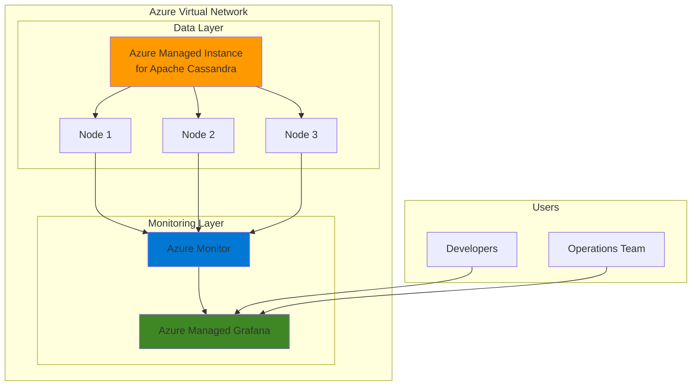

# Monitor Distributed Cassandra Databases with Managed Grafana

## Problem

Organizations managing distributed NoSQL databases face challenges in monitoring performance, tracking resource utilization, and identifying bottlenecks across multiple nodes. Traditional monitoring approaches often lack real-time visibility into Cassandra cluster health, making it difficult to proactively address performance issues and maintain optimal database operations. This results in increased downtime, degraded application performance, and difficulty in capacity planning for growing data workloads.

## Solution

Implement comprehensive monitoring for Azure Managed Instance for Apache Cassandra using Azure Managed Grafana's powerful visualization capabilities. This solution integrates Azure Monitor metrics with Grafana dashboards to provide real-time insights into cluster performance, node health, and query patterns. By leveraging managed services, organizations can focus on data analysis rather than infrastructure management while maintaining enterprise-grade monitoring capabilities.

## Architecture Diagram



## Prerequisites

1. Azure subscription with appropriate permissions (Contributor role)
2. Azure CLI v2.40+ installed and configured (or use Azure Cloud Shell)
3. Basic understanding of NoSQL databases and monitoring concepts
4. Familiarity with Grafana dashboards and visualization
5. Estimated cost: $300-500/month for a 3-node cluster with monitoring

> **Note**: This recipe deploys billable resources. Ensure you understand Azure pricing for Managed Instance for Apache Cassandra and Azure Managed Grafana before proceeding.

## Preparation

```bash
# Set environment variables for resource deployment
export RESOURCE_GROUP="rg-cassandra-monitoring"
export LOCATION="eastus"
export SUBSCRIPTION_ID=$(az account show --query id --output tsv)

# Generate unique suffix for resource names
RANDOM_SUFFIX=$(openssl rand -hex 3)
export CASSANDRA_CLUSTER_NAME="cassandra-${RANDOM_SUFFIX}"
export GRAFANA_NAME="grafana-${RANDOM_SUFFIX}"
export VNET_NAME="vnet-cassandra-${RANDOM_SUFFIX}"

# Create resource group
az group create \
    --name ${RESOURCE_GROUP} \
    --location ${LOCATION} \
    --tags purpose=monitoring environment=demo

echo "✅ Resource group created: ${RESOURCE_GROUP}"

# Create virtual network for Cassandra cluster
az network vnet create \
    --name ${VNET_NAME} \
    --resource-group ${RESOURCE_GROUP} \
    --location ${LOCATION} \
    --address-prefixes 10.0.0.0/16

# Create subnet for Cassandra nodes
az network vnet subnet create \
    --name cassandra-subnet \
    --resource-group ${RESOURCE_GROUP} \
    --vnet-name ${VNET_NAME} \
    --address-prefixes 10.0.1.0/24

echo "✅ Virtual network configured: ${VNET_NAME}"
```

## Steps

1. **Deploy Azure Managed Instance for Apache Cassandra**:

   Azure Managed Instance for Apache Cassandra provides a fully managed, enterprise-ready Apache Cassandra service that eliminates the operational overhead of managing distributed NoSQL databases. The service automatically handles node provisioning, patching, and scaling while maintaining high availability across availability zones. This managed approach ensures consistent performance and reliability for mission-critical applications requiring low-latency data access.

   ```bash
   # Create Cassandra cluster
   az managed-cassandra cluster create \
       --cluster-name ${CASSANDRA_CLUSTER_NAME} \
       --resource-group ${RESOURCE_GROUP} \
       --location ${LOCATION} \
       --delegated-management-subnet-id "/subscriptions/${SUBSCRIPTION_ID}/resourceGroups/${RESOURCE_GROUP}/providers/Microsoft.Network/virtualNetworks/${VNET_NAME}/subnets/cassandra-subnet" \
       --initial-cassandra-admin-password "P@ssw0rd123!" \
       --client-certificates \
       --cassandra-version "4.0"
   
   echo "✅ Cassandra cluster deployment initiated: ${CASSANDRA_CLUSTER_NAME}"
   
   # Wait for cluster creation (this may take 15-20 minutes)
   az managed-cassandra cluster wait \
       --name ${CASSANDRA_CLUSTER_NAME} \
       --resource-group ${RESOURCE_GROUP} \
       --created
   
   echo "✅ Cassandra cluster ready"
   ```

   The Cassandra cluster is now deployed with secure default configurations and integrated Azure Monitor metrics collection. This foundational infrastructure provides automatic backup, encryption at rest, and network isolation through the dedicated subnet, ensuring enterprise-grade security and compliance.

2. **Create Cassandra Data Center**:

   Data centers in Cassandra represent geographical or logical groupings of nodes that provide data replication and fault tolerance. Azure Managed Instance for Apache Cassandra uses data centers to distribute workloads and ensure high availability. By creating a properly sized data center, you establish the foundation for scalable performance and resilience against node failures.

   ```bash
   # Create data center with 3 nodes
   az managed-cassandra datacenter create \
       --cluster-name ${CASSANDRA_CLUSTER_NAME} \
       --data-center-name "dc1" \
       --resource-group ${RESOURCE_GROUP} \
       --data-center-location ${LOCATION} \
       --delegated-subnet-id "/subscriptions/${SUBSCRIPTION_ID}/resourceGroups/${RESOURCE_GROUP}/providers/Microsoft.Network/virtualNetworks/${VNET_NAME}/subnets/cassandra-subnet" \
       --node-count 3 \
       --sku "Standard_DS14_v2"
   
   echo "✅ Data center creation initiated with 3 nodes"
   
   # Wait for data center to be ready
   az managed-cassandra datacenter wait \
       --cluster-name ${CASSANDRA_CLUSTER_NAME} \
       --data-center-name "dc1" \
       --resource-group ${RESOURCE_GROUP} \
       --created
   
   echo "✅ Data center operational"
   ```

3. **Configure Azure Monitor Diagnostic Settings**:

   Azure Monitor diagnostic settings enable comprehensive logging and metrics collection for your Cassandra cluster. These settings capture critical operational data including query performance, audit logs, and system metrics. By configuring diagnostic settings, you establish the data pipeline that feeds into your monitoring dashboards and alerting systems.

   ```bash
   # Create Log Analytics workspace for diagnostics
   WORKSPACE_NAME="law-cassandra-${RANDOM_SUFFIX}"
   az monitor log-analytics workspace create \
       --workspace-name ${WORKSPACE_NAME} \
       --resource-group ${RESOURCE_GROUP} \
       --location ${LOCATION}
   
   WORKSPACE_ID=$(az monitor log-analytics workspace show \
       --workspace-name ${WORKSPACE_NAME} \
       --resource-group ${RESOURCE_GROUP} \
       --query id --output tsv)
   
   # Configure diagnostic settings for Cassandra cluster
   az monitor diagnostic-settings create \
       --name "cassandra-diagnostics" \
       --resource "/subscriptions/${SUBSCRIPTION_ID}/resourceGroups/${RESOURCE_GROUP}/providers/Microsoft.DocumentDB/cassandraClusters/${CASSANDRA_CLUSTER_NAME}" \
       --workspace ${WORKSPACE_ID} \
       --logs '[{"category":"CassandraLogs","enabled":true},{"category":"CassandraAudit","enabled":true}]' \
       --metrics '[{"category":"AllMetrics","enabled":true}]'
   
   echo "✅ Diagnostic settings configured"
   ```

4. **Deploy Azure Managed Grafana**:

   Azure Managed Grafana provides a fully managed visualization platform optimized for Azure workloads. The service includes built-in integration with Azure Monitor, automatic updates, and enterprise-grade security through Azure Active Directory. This managed approach eliminates the operational burden of maintaining Grafana infrastructure while providing powerful visualization capabilities for complex metrics.

   ```bash
   # Create Azure Managed Grafana instance
   az grafana create \
       --name ${GRAFANA_NAME} \
       --resource-group ${RESOURCE_GROUP} \
       --location ${LOCATION} \
       --sku-name "Standard"
   
   echo "✅ Azure Managed Grafana deployment initiated"
   
   # Wait for Grafana to be ready
   sleep 120
   
   # Get Grafana endpoint
   GRAFANA_ENDPOINT=$(az grafana show \
       --name ${GRAFANA_NAME} \
       --resource-group ${RESOURCE_GROUP} \
       --query properties.endpoint --output tsv)
   
   echo "✅ Grafana available at: ${GRAFANA_ENDPOINT}"
   ```

5. **Configure Grafana Data Source**:

   Connecting Azure Monitor as a data source in Grafana enables real-time visualization of Cassandra metrics and logs. This integration leverages managed identities for secure, passwordless authentication between services. By establishing this connection, you create a seamless pipeline from your database metrics to actionable visualizations.

   ```bash
   # Get Grafana managed identity
   GRAFANA_IDENTITY=$(az grafana show \
       --name ${GRAFANA_NAME} \
       --resource-group ${RESOURCE_GROUP} \
       --query identity.principalId --output tsv)
   
   # Assign Monitoring Reader role to Grafana identity
   az role assignment create \
       --assignee ${GRAFANA_IDENTITY} \
       --role "Monitoring Reader" \
       --scope "/subscriptions/${SUBSCRIPTION_ID}/resourceGroups/${RESOURCE_GROUP}"
   
   echo "✅ Grafana permissions configured"
   
   # Create data source configuration
   cat > datasource-config.json << EOF
   {
     "name": "Azure Monitor - Cassandra",
     "type": "grafana-azure-monitor-datasource",
     "access": "proxy",
     "jsonData": {
       "azureAuthType": "msi",
       "subscriptionId": "${SUBSCRIPTION_ID}"
     }
   }
   EOF
   
   echo "✅ Data source configuration prepared"
   ```

6. **Create Monitoring Dashboard**:

   Custom Grafana dashboards provide tailored visualizations for your specific monitoring requirements. By creating dashboards that focus on Cassandra-specific metrics like read/write latency, node health, and replication status, you enable proactive monitoring and rapid issue identification. These dashboards serve as the primary interface for both development and operations teams.

   ```bash
   # Create dashboard JSON configuration
   cat > cassandra-dashboard.json << EOF
   {
     "dashboard": {
       "title": "Cassandra Cluster Monitoring",
       "panels": [
         {
           "title": "Node CPU Usage",
           "targets": [
             {
               "azureMonitor": {
                 "resourceGroup": "${RESOURCE_GROUP}",
                 "metricName": "CPUUsage",
                 "aggregation": "Average",
                 "timeGrain": "PT1M"
               }
             }
           ],
           "gridPos": {"h": 8, "w": 12, "x": 0, "y": 0}
         },
         {
           "title": "Read/Write Latency",
           "targets": [
             {
               "azureMonitor": {
                 "resourceGroup": "${RESOURCE_GROUP}",
                 "metricName": "ReadLatency",
                 "aggregation": "Average",
                 "timeGrain": "PT1M"
               }
             }
           ],
           "gridPos": {"h": 8, "w": 12, "x": 12, "y": 0}
         }
       ],
       "time": {"from": "now-6h", "to": "now"},
       "refresh": "30s"
     }
   }
   EOF
   
   echo "✅ Dashboard configuration created"
   ```

7. **Configure Alerting Rules**:

   Proactive alerting ensures rapid response to performance degradation or system issues. Azure Managed Grafana's alerting capabilities integrate with Azure Monitor to provide threshold-based notifications for critical metrics. By establishing alerting rules for key performance indicators, you create an early warning system that prevents minor issues from escalating into major outages.

   ```bash
   # Create action group for alerts
   az monitor action-group create \
       --name "cassandra-alerts" \
       --resource-group ${RESOURCE_GROUP} \
       --short-name "CassAlert" \
       --email-receiver name="ops-team" email-address="ops@example.com"
   
   # Create metric alert for high CPU usage
   az monitor metrics alert create \
       --name "cassandra-high-cpu" \
       --resource-group ${RESOURCE_GROUP} \
       --scopes "/subscriptions/${SUBSCRIPTION_ID}/resourceGroups/${RESOURCE_GROUP}/providers/Microsoft.DocumentDB/cassandraClusters/${CASSANDRA_CLUSTER_NAME}" \
       --condition "avg CPUUsage > 80" \
       --window-size 5m \
       --evaluation-frequency 1m \
       --action "cassandra-alerts" \
       --description "Alert when Cassandra CPU usage exceeds 80%"
   
   echo "✅ Alerting rules configured"
   ```

> **Tip**: Use Azure Monitor Workbooks alongside Grafana for advanced analytics and reporting capabilities. Workbooks provide interactive reports that complement real-time Grafana dashboards.

## Validation & Testing

1. Verify Cassandra cluster health:

   ```bash
   # Check cluster status
   az managed-cassandra cluster show \
       --cluster-name ${CASSANDRA_CLUSTER_NAME} \
       --resource-group ${RESOURCE_GROUP} \
       --query "{Status:properties.provisioningState,Nodes:properties.seedNodes}" \
       --output table
   ```

   Expected output: Status should show "Succeeded" with 3 seed nodes listed

2. Test Grafana connectivity:

   ```bash
   # Verify Grafana is accessible
   curl -I ${GRAFANA_ENDPOINT}
   
   # Check data source connectivity via API
   echo "Access Grafana at: ${GRAFANA_ENDPOINT}"
   echo "Use your Azure AD credentials to log in"
   ```

3. Validate metrics collection:

   ```bash
   # Query recent metrics from Azure Monitor
   az monitor metrics list \
       --resource "/subscriptions/${SUBSCRIPTION_ID}/resourceGroups/${RESOURCE_GROUP}/providers/Microsoft.DocumentDB/cassandraClusters/${CASSANDRA_CLUSTER_NAME}" \
       --metric "CPUUsage" \
       --start-time $(date -u -d '1 hour ago' +%Y-%m-%dT%H:%M:%SZ) \
       --interval PT1M \
       --output table
   ```

4. Test alert functionality:

   ```bash
   # Generate test alert
   az monitor metrics alert show \
       --name "cassandra-high-cpu" \
       --resource-group ${RESOURCE_GROUP} \
       --query "{State:state,LastUpdated:lastUpdatedTime}" \
       --output table
   ```

## Cleanup

1. Remove monitoring resources:

   ```bash
   # Delete Grafana instance
   az grafana delete \
       --name ${GRAFANA_NAME} \
       --resource-group ${RESOURCE_GROUP} \
       --yes
   
   echo "✅ Grafana instance deleted"
   ```

2. Delete Cassandra cluster:

   ```bash
   # Remove data center first
   az managed-cassandra datacenter delete \
       --cluster-name ${CASSANDRA_CLUSTER_NAME} \
       --data-center-name "dc1" \
       --resource-group ${RESOURCE_GROUP} \
       --yes
   
   # Delete cluster
   az managed-cassandra cluster delete \
       --cluster-name ${CASSANDRA_CLUSTER_NAME} \
       --resource-group ${RESOURCE_GROUP} \
       --yes
   
   echo "✅ Cassandra cluster deletion initiated"
   ```

3. Remove supporting resources:

   ```bash
   # Delete Log Analytics workspace
   az monitor log-analytics workspace delete \
       --workspace-name ${WORKSPACE_NAME} \
       --resource-group ${RESOURCE_GROUP} \
       --yes
   
   # Delete resource group and all remaining resources
   az group delete \
       --name ${RESOURCE_GROUP} \
       --yes \
       --no-wait
   
   echo "✅ Resource group deletion initiated: ${RESOURCE_GROUP}"
   echo "Note: Complete deletion may take several minutes"
   ```

## Discussion

Azure Managed Instance for Apache Cassandra combined with Azure Managed Grafana creates a powerful monitoring solution that addresses the complexities of distributed NoSQL database operations. This architecture leverages Azure's native integration capabilities to provide seamless metric collection and visualization without the operational overhead of managing monitoring infrastructure. For detailed guidance on Cassandra best practices, refer to the [Azure Managed Instance for Apache Cassandra documentation](https://docs.microsoft.com/en-us/azure/managed-instance-apache-cassandra/introduction).

The integration between Azure Monitor and Grafana enables comprehensive observability across your Cassandra deployment. Metrics flow automatically from each node through Azure Monitor's collection pipeline, providing real-time insights into performance, resource utilization, and query patterns. This approach aligns with the [Azure Well-Architected Framework](https://docs.microsoft.com/en-us/azure/architecture/framework/) principles of operational excellence and reliability. The managed nature of both services ensures automatic updates, security patches, and high availability without manual intervention.

From a cost optimization perspective, the solution scales efficiently with your workload demands. Azure Managed Grafana's Standard tier provides enterprise features including alerting and reporting, while the consumption-based pricing of Azure Monitor ensures you only pay for the metrics and logs you collect. For comprehensive monitoring strategies, review the [Azure Monitor best practices](https://docs.microsoft.com/en-us/azure/azure-monitor/best-practices) and [Grafana visualization guide](https://docs.microsoft.com/en-us/azure/managed-grafana/how-to-create-dashboard).

> **Warning**: Monitor your Log Analytics workspace retention and ingestion rates to control costs. High-volume Cassandra deployments can generate significant log data, potentially impacting your monitoring budget.

## Challenge

Extend this monitoring solution with advanced capabilities:

1. Implement custom Grafana panels that visualize Cassandra-specific metrics like compaction statistics, repair progress, and tombstone ratios using Azure Monitor's custom metrics API
2. Create automated remediation workflows using Azure Logic Apps that respond to specific alert conditions, such as automatically scaling nodes when performance thresholds are exceeded
3. Integrate Azure Data Explorer for long-term metric retention and advanced analytics, enabling historical trend analysis and capacity planning across multiple Cassandra clusters
4. Develop a multi-cluster monitoring dashboard that aggregates metrics from Cassandra deployments across different regions, providing a global view of your distributed database infrastructure
5. Implement machine learning-based anomaly detection using Azure Monitor's built-in capabilities to identify unusual patterns in query performance or resource utilization

## Infrastructure Code

*Infrastructure code will be generated after recipe approval.*