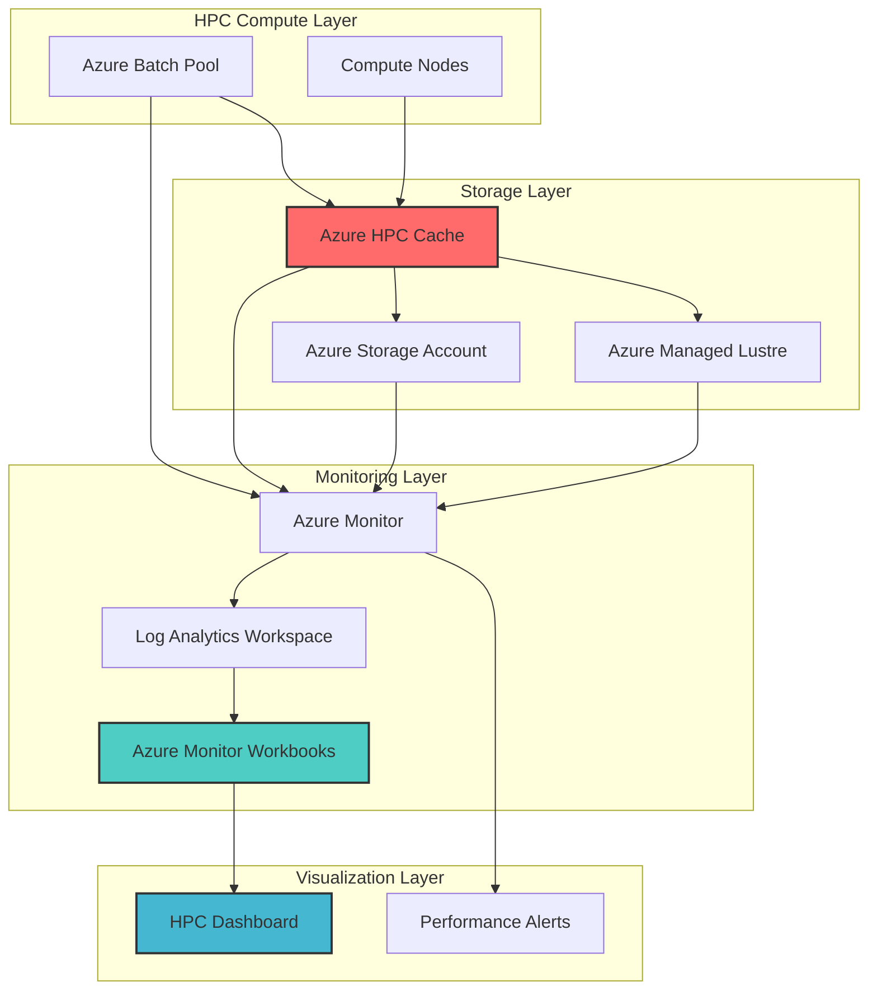

# Monitor High-Performance Computing with HPC Cache and Workbooks

## Problem

High-performance computing (HPC) workloads require sophisticated monitoring to track storage throughput, cache hit rates, and compute cluster performance across distributed systems. Organizations struggle with fragmented monitoring tools that don't provide unified visibility into their HPC infrastructure, leading to performance bottlenecks, inefficient resource utilization, and delayed issue detection. Traditional monitoring solutions often lack the specialized metrics needed for HPC workloads, making it difficult to optimize storage performance and compute resource allocation.

## Solution

Build comprehensive monitoring dashboards using Azure HPC Cache performance metrics and Azure Monitor Workbooks to visualize storage throughput, cache hit rates, and compute cluster performance in real-time. This solution integrates Azure Batch for compute workload monitoring with Azure Storage metrics, creating a unified monitoring platform that provides deep insights into HPC infrastructure performance and enables proactive optimization.

## Architecture Diagram



## Prerequisites

1. Azure subscription with appropriate permissions for creating HPC Cache, Monitor, and Batch resources
2. Azure CLI v2.60.0 or later installed and configured (or Azure CloudShell)
3. Basic understanding of HPC workloads and Azure storage concepts
4. Familiarity with Azure Monitor and Log Analytics query language (KQL)
5. Estimated cost: $50-200/day for HPC Cache, compute resources, and monitoring (varies by usage)

> **Warning**: Azure HPC Cache will be retired on September 30, 2025. This recipe includes migration guidance to Azure Managed Lustre as the recommended alternative for HPC storage acceleration.

## Preparation

```bash
# Set environment variables for Azure resources
export RESOURCE_GROUP="rg-hpc-monitoring-${RANDOM_SUFFIX}"
export LOCATION="eastus"
export SUBSCRIPTION_ID=$(az account show --query id --output tsv)

# Generate unique suffix for resource names
RANDOM_SUFFIX=$(openssl rand -hex 3)

# Set HPC-specific resource names
export HPC_CACHE_NAME="hpc-cache-${RANDOM_SUFFIX}"
export BATCH_ACCOUNT_NAME="batch${RANDOM_SUFFIX}"
export STORAGE_ACCOUNT_NAME="hpcstorage${RANDOM_SUFFIX}"
export WORKSPACE_NAME="hpc-workspace-${RANDOM_SUFFIX}"
export WORKBOOK_NAME="hpc-monitoring-workbook"

# Create resource group
az group create \
    --name ${RESOURCE_GROUP} \
    --location ${LOCATION} \
    --tags purpose=hpc-monitoring environment=demo

echo "✅ Resource group created: ${RESOURCE_GROUP}"

# Create Log Analytics workspace for monitoring
az monitor log-analytics workspace create \
    --resource-group ${RESOURCE_GROUP} \
    --workspace-name ${WORKSPACE_NAME} \
    --location ${LOCATION} \
    --sku PerGB2018

echo "✅ Log Analytics workspace created: ${WORKSPACE_NAME}"
```

## Steps

1. **Create Storage Account for HPC Workloads**:

   Azure Storage provides the foundation for HPC data storage with high-throughput capabilities essential for compute-intensive workloads. Creating a storage account with appropriate performance tiers enables efficient data access patterns required by HPC applications while supporting both hot and cool data access scenarios.

   ```bash
   # Create high-performance storage account
   az storage account create \
       --name ${STORAGE_ACCOUNT_NAME} \
       --resource-group ${RESOURCE_GROUP} \
       --location ${LOCATION} \
       --sku Standard_LRS \
       --kind StorageV2 \
       --access-tier Hot \
       --https-only true
   
   # Get storage account key for later use
   export STORAGE_KEY=$(az storage account keys list \
       --account-name ${STORAGE_ACCOUNT_NAME} \
       --resource-group ${RESOURCE_GROUP} \
       --query "[0].value" --output tsv)
   
   echo "✅ Storage account created: ${STORAGE_ACCOUNT_NAME}"
   ```

   The storage account now provides the backend storage layer for HPC workloads with optimized performance characteristics. This foundational component enables high-throughput data access while maintaining cost efficiency for large-scale compute operations.

2. **Create Azure HPC Cache for Storage Acceleration**:

   Azure HPC Cache acts as a high-performance storage accelerator that sits between compute nodes and backend storage systems. This caching layer significantly reduces latency and increases throughput for HPC workloads by keeping frequently accessed data closer to compute resources, improving overall application performance.

   ```bash
   # Create virtual network for HPC Cache
   az network vnet create \
       --resource-group ${RESOURCE_GROUP} \
       --name hpc-vnet \
       --address-prefix 10.0.0.0/16 \
       --subnet-name hpc-subnet \
       --subnet-prefix 10.0.1.0/24
   
   # Get subnet ID for HPC Cache
   export SUBNET_ID=$(az network vnet subnet show \
       --resource-group ${RESOURCE_GROUP} \
       --vnet-name hpc-vnet \
       --name hpc-subnet \
       --query id --output tsv)
   
   # Create HPC Cache
   az hpc-cache create \
       --resource-group ${RESOURCE_GROUP} \
       --name ${HPC_CACHE_NAME} \
       --location ${LOCATION} \
       --cache-size-gb 3072 \
       --subnet ${SUBNET_ID} \
       --sku-name Standard_2G
   
   echo "✅ HPC Cache created: ${HPC_CACHE_NAME}"
   ```

   The HPC Cache is now operational and ready to accelerate storage access for compute workloads. This caching layer provides significant performance improvements for read-heavy HPC applications while maintaining data consistency with backend storage systems.

3. **Configure Azure Batch for HPC Compute Workloads**:

   Azure Batch provides managed compute pools that automatically scale based on workload demands, making it ideal for HPC scenarios. Setting up Batch with appropriate virtual machine configurations ensures optimal compute resource allocation while enabling comprehensive monitoring of job execution and resource utilization.

   ```bash
   # Create Batch account
   az batch account create \
       --resource-group ${RESOURCE_GROUP} \
       --name ${BATCH_ACCOUNT_NAME} \
       --location ${LOCATION} \
       --storage-account ${STORAGE_ACCOUNT_NAME}
   
   # Get Batch account endpoint
   export BATCH_ENDPOINT=$(az batch account show \
       --resource-group ${RESOURCE_GROUP} \
       --name ${BATCH_ACCOUNT_NAME} \
       --query accountEndpoint --output tsv)
   
   # Login to Batch account
   az batch account login \
       --resource-group ${RESOURCE_GROUP} \
       --name ${BATCH_ACCOUNT_NAME}
   
   # Create a compute pool for HPC workloads
   az batch pool create \
       --id hpc-pool \
       --vm-size Standard_HC44rs \
       --target-dedicated-nodes 2 \
       --image "Canonical:0001-com-ubuntu-server-focal:20_04-lts-gen2" \
       --node-agent-sku-id "batch.node.ubuntu 20.04"
   
   echo "✅ Batch account and pool created: ${BATCH_ACCOUNT_NAME}"
   ```

   The Batch environment is now configured with high-performance compute nodes optimized for HPC workloads. This setup enables automatic scaling and comprehensive job monitoring while providing the computational power needed for demanding scientific and engineering applications.

4. **Enable Diagnostic Settings for HPC Cache Monitoring**:

   Diagnostic settings enable the collection of detailed performance metrics and operational logs from Azure HPC Cache. This configuration routes cache performance data to Log Analytics, providing the foundation for comprehensive monitoring and alerting on cache hit rates, throughput, and storage access patterns.

   ```bash
   # Get HPC Cache resource ID
   export CACHE_RESOURCE_ID=$(az hpc-cache show \
       --resource-group ${RESOURCE_GROUP} \
       --name ${HPC_CACHE_NAME} \
       --query id --output tsv)
   
   # Get Log Analytics workspace ID
   export WORKSPACE_ID=$(az monitor log-analytics workspace show \
       --resource-group ${RESOURCE_GROUP} \
       --workspace-name ${WORKSPACE_NAME} \
       --query id --output tsv)
   
   # Enable diagnostic settings for HPC Cache
   az monitor diagnostic-settings create \
       --resource ${CACHE_RESOURCE_ID} \
       --name "hpc-cache-diagnostics" \
       --workspace ${WORKSPACE_ID} \
       --logs '[
           {
               "category": "ServiceLog",
               "enabled": true
           }
       ]' \
       --metrics '[
           {
               "category": "AllMetrics",
               "enabled": true
           }
       ]'
   
   echo "✅ Diagnostic settings enabled for HPC Cache"
   ```

   The diagnostic settings now route comprehensive HPC Cache metrics and logs to Log Analytics, enabling detailed performance analysis and historical trend tracking. This monitoring foundation supports proactive optimization and troubleshooting of cache performance issues.

5. **Configure Batch Monitoring and Diagnostics**:

   Azure Batch monitoring provides insights into job execution, node utilization, and task performance across the compute cluster. Enabling comprehensive diagnostics allows tracking of resource consumption, job completion rates, and system performance metrics essential for HPC workload optimization.

   ```bash
   # Get Batch account resource ID
   export BATCH_RESOURCE_ID=$(az batch account show \
       --resource-group ${RESOURCE_GROUP} \
       --name ${BATCH_ACCOUNT_NAME} \
       --query id --output tsv)
   
   # Enable diagnostic settings for Batch
   az monitor diagnostic-settings create \
       --resource ${BATCH_RESOURCE_ID} \
       --name "batch-diagnostics" \
       --workspace ${WORKSPACE_ID} \
       --logs '[
           {
               "category": "ServiceLog",
               "enabled": true
           }
       ]' \
       --metrics '[
           {
               "category": "AllMetrics",
               "enabled": true
           }
       ]'
   
   echo "✅ Batch diagnostic settings configured"
   ```

   The Batch monitoring configuration now captures detailed execution metrics and performance data, providing comprehensive visibility into compute cluster utilization and job performance patterns critical for HPC workload management.

6. **Create Azure Monitor Workbook for HPC Monitoring**:

   Azure Monitor Workbooks provide interactive dashboards that combine multiple data sources into unified visualizations. Creating a specialized HPC monitoring workbook enables real-time tracking of cache performance, compute utilization, and storage throughput in a single, customizable interface.

   ```bash
   # Create workbook JSON configuration
   cat > hpc-workbook.json << 'EOF'
   {
       "version": "Notebook/1.0",
       "items": [
           {
               "type": 1,
               "content": {
                   "json": "## HPC Cache Performance Dashboard\n\nThis dashboard provides comprehensive monitoring for Azure HPC Cache, Batch compute clusters, and storage performance metrics."
               }
           },
           {
               "type": 3,
               "content": {
                   "version": "KqlItem/1.0",
                   "query": "AzureMetrics\n| where ResourceProvider == \"MICROSOFT.STORAGECACHE\"\n| where MetricName == \"CacheHitPercent\"\n| summarize avg(Average) by bin(TimeGenerated, 5m)\n| render timechart",
                   "size": 0,
                   "title": "Cache Hit Rate Over Time",
                   "timeContext": {
                       "durationMs": 3600000
                   }
               }
           },
           {
               "type": 3,
               "content": {
                   "version": "KqlItem/1.0",
                   "query": "AzureMetrics\n| where ResourceProvider == \"MICROSOFT.BATCH\"\n| where MetricName == \"RunningNodeCount\"\n| summarize avg(Average) by bin(TimeGenerated, 5m)\n| render timechart",
                   "size": 0,
                   "title": "Active Compute Nodes",
                   "timeContext": {
                       "durationMs": 3600000
                   }
               }
           }
       ]
   }
   EOF
   
   # Create the workbook using REST API call
   # Note: Azure CLI doesn't have native workbook create command
   export WORKBOOK_ID=$(uuidgen)
   az rest \
       --method PUT \
       --url "https://management.azure.com/subscriptions/${SUBSCRIPTION_ID}/resourceGroups/${RESOURCE_GROUP}/providers/Microsoft.Insights/workbooks/${WORKBOOK_ID}?api-version=2022-04-01" \
       --body '{
           "kind": "shared",
           "location": "'${LOCATION}'",
           "properties": {
               "displayName": "HPC Monitoring Dashboard",
               "description": "Comprehensive monitoring for HPC Cache and Batch workloads",
               "serializedData": "@hpc-workbook.json"
           }
       }'
   
   echo "✅ HPC monitoring workbook created"
   ```

   The Azure Monitor Workbook now provides a centralized dashboard for HPC infrastructure monitoring, combining cache performance metrics, compute utilization, and storage throughput into actionable visualizations that enable proactive performance optimization.

7. **Set Up Performance Alerts for HPC Infrastructure**:

   Performance alerts enable proactive monitoring by automatically notifying administrators when critical metrics exceed defined thresholds. Configuring alerts for cache hit rates, compute utilization, and storage throughput ensures rapid response to performance degradations and resource constraints.

   ```bash
   # Create action group for notifications
   az monitor action-group create \
       --resource-group ${RESOURCE_GROUP} \
       --name "hpc-alerts" \
       --short-name "hpc-alerts" \
       --email-receiver name=admin email=admin@example.com
   
   # Create alert rule for low cache hit rate
   az monitor metrics alert create \
       --resource-group ${RESOURCE_GROUP} \
       --name "low-cache-hit-rate" \
       --description "Alert when cache hit rate drops below 80%" \
       --scopes ${CACHE_RESOURCE_ID} \
       --condition "avg CacheHitPercent < 80" \
       --window-size 5m \
       --evaluation-frequency 1m \
       --action ${RESOURCE_GROUP} hpc-alerts
   
   # Create alert for high compute utilization
   az monitor metrics alert create \
       --resource-group ${RESOURCE_GROUP} \
       --name "high-compute-utilization" \
       --description "Alert when compute nodes exceed 90% utilization" \
       --scopes ${BATCH_RESOURCE_ID} \
       --condition "avg RunningNodeCount > 1.8" \
       --window-size 5m \
       --evaluation-frequency 1m \
       --action ${RESOURCE_GROUP} hpc-alerts
   
   echo "✅ Performance alerts configured"
   ```

   The alert system now actively monitors critical HPC performance metrics, providing automated notifications when performance thresholds are exceeded. This proactive monitoring enables rapid response to performance issues and resource constraints before they impact workload execution.

## Validation & Testing

1. **Verify HPC Cache Performance Metrics**:

   ```bash
   # Check cache status and performance
   az hpc-cache show \
       --resource-group ${RESOURCE_GROUP} \
       --name ${HPC_CACHE_NAME} \
       --query "{name:name,status:health.state,size:cacheSizeGb}"
   
   # Query cache hit rate metrics
   az monitor metrics list \
       --resource ${CACHE_RESOURCE_ID} \
       --metric CacheHitPercent \
       --interval 5m \
       --aggregation Average
   ```

   Expected output: Cache status showing "Healthy" state with performance metrics displaying cache hit rates and throughput statistics.

2. **Test Batch Workload Monitoring**:

   ```bash
   # Check Batch pool status
   az batch pool show --pool-id hpc-pool \
       --query "{state:state,nodes:currentDedicatedNodes,vmSize:vmSize}"
   
   # Submit a test job to generate monitoring data
   az batch job create \
       --id test-hpc-job \
       --pool-id hpc-pool
   
   # Add a simple task
   az batch task create \
       --job-id test-hpc-job \
       --task-id task1 \
       --command-line "echo 'HPC monitoring test'"
   ```

   Expected output: Batch pool showing active nodes with successful task execution generating monitoring data in Log Analytics.

3. **Validate Workbook Dashboard Functionality**:

   ```bash
   # Get workbook details
   az rest \
       --method GET \
       --url "https://management.azure.com/subscriptions/${SUBSCRIPTION_ID}/resourceGroups/${RESOURCE_GROUP}/providers/Microsoft.Insights/workbooks/${WORKBOOK_ID}?api-version=2022-04-01"
   
   # Check if metrics are flowing to Log Analytics
   az monitor log-analytics query \
       --workspace ${WORKSPACE_ID} \
       --analytics-query "AzureMetrics | where ResourceProvider == 'MICROSOFT.STORAGECACHE' | take 10"
   ```

   Expected output: Workbook details with successful metric queries showing HPC Cache performance data in Log Analytics.

## Cleanup

1. **Remove HPC Cache and associated resources**:

   ```bash
   # Delete HPC Cache
   az hpc-cache delete \
       --resource-group ${RESOURCE_GROUP} \
       --name ${HPC_CACHE_NAME} \
       --yes
   
   echo "✅ HPC Cache deleted"
   ```

2. **Clean up Batch resources**:

   ```bash
   # Delete Batch pool
   az batch pool delete --pool-id hpc-pool --yes
   
   # Delete Batch account
   az batch account delete \
       --resource-group ${RESOURCE_GROUP} \
       --name ${BATCH_ACCOUNT_NAME} \
       --yes
   
   echo "✅ Batch resources deleted"
   ```

3. **Remove monitoring and storage resources**:

   ```bash
   # Delete workbook
   az rest \
       --method DELETE \
       --url "https://management.azure.com/subscriptions/${SUBSCRIPTION_ID}/resourceGroups/${RESOURCE_GROUP}/providers/Microsoft.Insights/workbooks/${WORKBOOK_ID}?api-version=2022-04-01"
   
   # Delete storage account
   az storage account delete \
       --resource-group ${RESOURCE_GROUP} \
       --name ${STORAGE_ACCOUNT_NAME} \
       --yes
   
   echo "✅ Storage and monitoring resources deleted"
   ```

4. **Remove resource group and all remaining resources**:

   ```bash
   # Delete resource group
   az group delete \
       --name ${RESOURCE_GROUP} \
       --yes \
       --no-wait
   
   echo "✅ Resource group deletion initiated: ${RESOURCE_GROUP}"
   echo "Note: Complete deletion may take several minutes"
   ```

## Discussion

Azure HPC Cache and Azure Monitor Workbooks provide a powerful combination for monitoring high-performance computing workloads, enabling organizations to track storage throughput, cache hit rates, and compute cluster performance in unified dashboards. This monitoring approach is particularly effective for large-scale scientific computing, engineering simulations, and data-intensive analytics where storage performance directly impacts application execution times. The integration of cache-accelerated storage with comprehensive monitoring creates visibility into performance bottlenecks and optimization opportunities that would otherwise remain hidden in traditional monitoring approaches. For detailed guidance on HPC monitoring best practices, see the [Azure HPC documentation](https://learn.microsoft.com/en-us/azure/cloud-adoption-framework/scenarios/azure-hpc/storage) and [Azure Monitor Workbooks guide](https://learn.microsoft.com/en-us/azure/azure-monitor/visualize/workbooks-overview).

The event-driven monitoring pattern enables real-time alerting on critical performance metrics such as cache hit rates below 80%, compute node utilization exceeding capacity, and storage throughput degradation. Azure Monitor Workbooks support complex visualizations that combine multiple data sources, allowing administrators to correlate cache performance with compute utilization patterns and identify optimization opportunities. This unified monitoring approach follows the [Azure Well-Architected Framework](https://learn.microsoft.com/en-us/azure/architecture/framework/) principles of operational excellence and performance efficiency.

**Important Migration Notice**: Azure HPC Cache will be retired on September 30, 2025. Organizations should plan migration to [Azure Managed Lustre](https://learn.microsoft.com/en-us/azure/azure-managed-lustre/amlfs-overview) or [Azure NetApp Files](https://learn.microsoft.com/en-us/azure/azure-netapp-files/) as alternative high-performance storage solutions. Azure Managed Lustre provides superior performance for HPC workloads with throughput up to 375 GB/s and seamless integration with Azure Blob Storage for tiered storage architectures, making it the recommended successor for HPC caching scenarios.

From a cost perspective, monitoring HPC workloads requires balancing comprehensive visibility with storage and compute costs. Azure Monitor's pay-per-use model ensures cost efficiency while providing detailed insights into resource utilization patterns. Consider implementing data retention policies and metric sampling strategies to optimize monitoring costs while maintaining operational visibility. For comprehensive cost optimization guidance, review the [Azure HPC best practices guide](https://learn.microsoft.com/en-us/azure/high-performance-computing/performance-benchmarking/hpc-storage-options) and [Azure Monitor pricing documentation](https://azure.microsoft.com/en-us/pricing/details/monitor/).

> **Tip**: Use Azure Monitor Logs' KQL queries to create custom metrics that combine cache performance with application-specific indicators. The [Azure Monitor best practices guide](https://learn.microsoft.com/en-us/azure/azure-monitor/best-practices) provides comprehensive guidance on setting up effective alerting thresholds and dashboard configurations for HPC environments.

## Challenge

Extend this monitoring solution by implementing these advanced capabilities:

1. **Implement predictive analytics** using Azure Machine Learning to forecast cache performance degradation and automatically trigger scaling actions before performance impacts occur.

2. **Create multi-region monitoring** by deploying Azure Managed Lustre instances across multiple Azure regions with centralized monitoring dashboards that provide global visibility into distributed HPC workloads.

3. **Develop custom metrics collection** using Azure Monitor Agent to capture application-specific performance indicators from HPC workloads and correlate them with infrastructure metrics.

4. **Build automated remediation workflows** using Azure Logic Apps that automatically optimize cache configurations, adjust compute pool sizes, and rebalance workloads based on monitoring data.

5. **Integrate with third-party HPC schedulers** such as Slurm or PBS to create comprehensive job-level monitoring that tracks resource consumption from submission to completion.

## Infrastructure Code

### Available Infrastructure as Code:

- [Infrastructure Code Overview](code/README.md) - Detailed description of all infrastructure components
- [Bicep](code/bicep/) - Azure Bicep templates
- [Bash CLI Scripts](code/scripts/) - Example bash scripts using Azure CLI commands to deploy infrastructure
- [Terraform](code/terraform/) - Terraform configuration files