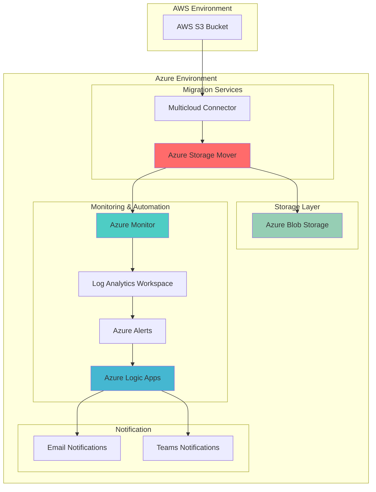

# Multi-Cloud Data Migration with Azure Storage Mover and Azure Monitor

## Problem

Organizations often need to migrate large volumes of data from AWS S3 to Azure Blob Storage as part of cloud consolidation or hybrid cloud strategies. Manual migration processes are time-consuming, error-prone, and lack comprehensive visibility into migration progress and success rates. Without proper monitoring and automation, failed migrations can go unnoticed, leading to data inconsistencies and potential business disruption.

## Solution

This solution implements an automated multi-cloud data migration pipeline using Azure Storage Mover for seamless AWS S3 to Azure Blob Storage transfers, integrated with Azure Monitor for comprehensive visibility and Azure Logic Apps for workflow automation. The architecture provides real-time monitoring, automated alerting, and self-healing capabilities to ensure reliable large-scale data migration.

## Architecture Diagram



## Prerequisites

1. Azure subscription with appropriate permissions for Storage Mover, Azure Monitor, and Logic Apps
2. AWS account with S3 bucket containing source data and appropriate access credentials
3. Azure CLI v2.50.0 or later installed and configured
4. AWS CLI configured with appropriate S3 permissions
5. Microsoft.StorageMover, Microsoft.HybridCompute, and Microsoft.Insights resource providers registered
6. Estimated cost: $50-200/month depending on data volume and monitoring frequency

> **Note**: Azure Storage Mover's cloud-to-cloud migration feature is currently in preview. Review the [latest service limitations](https://docs.microsoft.com/en-us/azure/storage-mover/cloud-to-cloud-migration) before proceeding with production workloads.

## Preparation

```bash
# Set environment variables for Azure resources
export RESOURCE_GROUP="rg-migration-${RANDOM_SUFFIX}"
export LOCATION="eastus"
export SUBSCRIPTION_ID=$(az account show --query id --output tsv)

# Generate unique suffix for resource names
RANDOM_SUFFIX=$(openssl rand -hex 3)

# Set resource names with unique suffix
export STORAGE_ACCOUNT_NAME="stmigration${RANDOM_SUFFIX}"
export STORAGE_MOVER_NAME="sm-migration-${RANDOM_SUFFIX}"
export LOG_WORKSPACE_NAME="log-migration-${RANDOM_SUFFIX}"
export LOGIC_APP_NAME="logic-migration-${RANDOM_SUFFIX}"
export MULTICLOUD_CONNECTOR_NAME="aws-connector-${RANDOM_SUFFIX}"

# AWS configuration (replace with your values)
export AWS_S3_BUCKET="your-source-s3-bucket"
export AWS_ACCOUNT_ID="your-aws-account-id"
export AWS_REGION="us-east-1"

# Create resource group
az group create \
    --name ${RESOURCE_GROUP} \
    --location ${LOCATION} \
    --tags purpose=migration environment=demo

# Register required resource providers
az provider register --namespace Microsoft.StorageMover
az provider register --namespace Microsoft.HybridCompute
az provider register --namespace Microsoft.Insights

echo "✅ Environment prepared successfully"
```

## Steps

1. **Create Azure Storage Account for Target Data**:

   Azure Blob Storage provides the scalable, secure destination for your migrated data. Creating a GPv2 storage account with appropriate performance tiers ensures optimal cost-performance balance for your migration workload. The storage account will serve as the primary target for all AWS S3 data transfers.

   ```bash
   # Create storage account with optimal settings for migration
   az storage account create \
       --name ${STORAGE_ACCOUNT_NAME} \
       --resource-group ${RESOURCE_GROUP} \
       --location ${LOCATION} \
       --sku Standard_LRS \
       --kind StorageV2 \
       --access-tier Hot \
       --enable-hierarchical-namespace false \
       --tags purpose=migration source=aws-s3
   
   # Get storage account key for later use
   STORAGE_ACCOUNT_KEY=$(az storage account keys list \
       --account-name ${STORAGE_ACCOUNT_NAME} \
       --resource-group ${RESOURCE_GROUP} \
       --query "[0].value" --output tsv)
   
   echo "✅ Storage account created: ${STORAGE_ACCOUNT_NAME}"
   ```

   The storage account is now ready to receive migrated data from AWS S3. The Hot access tier ensures fast access during migration and initial post-migration access patterns, while the Standard_LRS replication provides cost-effective local redundancy.

2. **Create Log Analytics Workspace for Monitoring**:

   Log Analytics provides centralized logging and monitoring capabilities for the migration process. This workspace will collect telemetry from Azure Storage Mover, enabling detailed tracking of migration progress, performance metrics, and error analysis through custom queries and dashboards.

   ```bash
   # Create Log Analytics workspace
   az monitor log-analytics workspace create \
       --resource-group ${RESOURCE_GROUP} \
       --workspace-name ${LOG_WORKSPACE_NAME} \
       --location ${LOCATION} \
       --sku pergb2018 \
       --retention-time 30
   
   # Get workspace ID for later use
   WORKSPACE_ID=$(az monitor log-analytics workspace show \
       --resource-group ${RESOURCE_GROUP} \
       --workspace-name ${LOG_WORKSPACE_NAME} \
       --query customerId --output tsv)
   
   echo "✅ Log Analytics workspace created: ${LOG_WORKSPACE_NAME}"
   ```

   The Log Analytics workspace is configured with 30-day retention to capture comprehensive migration telemetry while managing costs. The pergb2018 pricing tier provides flexible pay-as-you-go billing based on data ingestion volume.

3. **Create Azure Storage Mover Resource**:

   Azure Storage Mover orchestrates the migration process between AWS S3 and Azure Blob Storage. This managed service handles authentication, data transfer optimization, and progress tracking while providing integration points for monitoring and automation workflows.

   ```bash
   # Create Storage Mover resource
   az storage-mover create \
       --resource-group ${RESOURCE_GROUP} \
       --name ${STORAGE_MOVER_NAME} \
       --location ${LOCATION} \
       --description "Multi-cloud migration from AWS S3 to Azure Blob Storage" \
       --tags environment=demo migration-type=s3-to-blob
   
   echo "✅ Storage Mover resource created: ${STORAGE_MOVER_NAME}"
   ```

   The Storage Mover resource provides the foundation for managing multi-cloud data transfers. It maintains connection state, migration job history, and integration with Azure monitoring services for comprehensive visibility.

4. **Create Multicloud Connector for AWS Access**:

   The multicloud connector enables secure, authenticated access to AWS S3 resources from Azure services. This component establishes the trust relationship between Azure and AWS environments, facilitating seamless data transfer while maintaining security and compliance requirements.

   ```bash
   # Create multicloud connector for AWS S3 access
   az arc multicloud connector create \
       --resource-group ${RESOURCE_GROUP} \
       --name ${MULTICLOUD_CONNECTOR_NAME} \
       --location ${LOCATION} \
       --aws-cloud-provider accountId=${AWS_ACCOUNT_ID} \
       --public-cloud-connectors-enabled true \
       --tags purpose=migration cloud-provider=aws
   
   echo "✅ Multicloud connector created: ${MULTICLOUD_CONNECTOR_NAME}"
   
   # Wait for connector to be fully provisioned
   az arc multicloud connector wait \
       --resource-group ${RESOURCE_GROUP} \
       --name ${MULTICLOUD_CONNECTOR_NAME} \
       --created
   ```

   The multicloud connector establishes secure connectivity between Azure and AWS environments, enabling Storage Mover to access S3 buckets while maintaining proper authentication and authorization boundaries.

5. **Create Source and Target Endpoints**:

   Endpoints define the source and destination locations for data migration. The source endpoint connects to AWS S3 through the multicloud connector, while the target endpoint references the Azure Blob Storage account created earlier.

   ```bash
   # Create container in target storage account first
   az storage container create \
       --name "migrated-data" \
       --account-name ${STORAGE_ACCOUNT_NAME} \
       --account-key ${STORAGE_ACCOUNT_KEY} \
       --public-access off
   
   # Create AWS S3 source endpoint
   az storage-mover endpoint create \
       --resource-group ${RESOURCE_GROUP} \
       --storage-mover-name ${STORAGE_MOVER_NAME} \
       --name "aws-s3-source" \
       --properties '{
           "endpointType": "AmazonS3",
           "bucketName": "'${AWS_S3_BUCKET}'",
           "region": "'${AWS_REGION}'"
       }'
   
   # Create Azure Blob target endpoint
   az storage-mover endpoint create \
       --resource-group ${RESOURCE_GROUP} \
       --storage-mover-name ${STORAGE_MOVER_NAME} \
       --name "azure-blob-target" \
       --properties '{
           "endpointType": "AzureStorageBlobContainer",
           "containerName": "migrated-data",
           "storageAccountResourceId": "/subscriptions/'${SUBSCRIPTION_ID}'/resourceGroups/'${RESOURCE_GROUP}'/providers/Microsoft.Storage/storageAccounts/'${STORAGE_ACCOUNT_NAME}'"
       }'
   
   echo "✅ Source and target endpoints created"
   ```

   The endpoints establish the migration path from AWS S3 to Azure Blob Storage, with proper authentication and resource linking to ensure secure, efficient data transfer.

6. **Create Logic App Workflow Definition File**:

   Azure Logic Apps provides workflow automation capabilities for the migration process. We'll first create the workflow definition file that orchestrates migration jobs and coordinates with monitoring systems.

   ```bash
   # Create workflow definition file for Logic App
   cat > migration-workflow.json << 'EOF'
   {
       "$schema": "https://schema.management.azure.com/schemas/2016-06-01/Microsoft.Logic.json",
       "contentVersion": "1.0.0.0",
       "parameters": {},
       "triggers": {
           "manual": {
               "type": "Request",
               "kind": "Http",
               "inputs": {
                   "schema": {
                       "type": "object",
                       "properties": {
                           "action": {
                               "type": "string"
                           }
                       }
                   }
               }
           }
       },
       "actions": {
           "CheckMigrationStatus": {
               "type": "Http",
               "inputs": {
                   "method": "GET",
                   "uri": "https://management.azure.com/subscriptions/SUBSCRIPTION_ID/resourceGroups/RESOURCE_GROUP/providers/Microsoft.StorageMover/storageMovers/STORAGE_MOVER_NAME/projects/migration-project/jobDefinitions/initial-migration/jobRuns",
                   "headers": {
                       "Content-Type": "application/json"
                   },
                   "authentication": {
                       "type": "ManagedServiceIdentity"
                   }
               }
           },
           "SendNotification": {
               "type": "Http",
               "inputs": {
                   "method": "POST",
                   "uri": "https://hooks.slack.com/services/YOUR/WEBHOOK/URL",
                   "body": {
                       "text": "Migration status update: @{body('CheckMigrationStatus')}"
                   }
               },
               "runAfter": {
                   "CheckMigrationStatus": ["Succeeded"]
               }
           }
       }
   }
   EOF
   
   # Replace placeholders with actual values
   sed -i "s/SUBSCRIPTION_ID/${SUBSCRIPTION_ID}/g" migration-workflow.json
   sed -i "s/RESOURCE_GROUP/${RESOURCE_GROUP}/g" migration-workflow.json
   sed -i "s/STORAGE_MOVER_NAME/${STORAGE_MOVER_NAME}/g" migration-workflow.json
   
   echo "✅ Logic App workflow definition created"
   ```

   The workflow definition creates a simple HTTP-triggered Logic App that can check migration status and send notifications, providing the foundation for migration automation.

7. **Create Logic App for Migration Automation**:

   ```bash
   # Create Logic App with workflow definition
   az logic workflow create \
       --resource-group ${RESOURCE_GROUP} \
       --name ${LOGIC_APP_NAME} \
       --location ${LOCATION} \
       --definition @migration-workflow.json \
       --tags purpose=migration-automation
   
   echo "✅ Logic App created: ${LOGIC_APP_NAME}"
   ```

   The Logic App provides automated migration orchestration with HTTP triggers for manual or scheduled execution. It integrates with Storage Mover APIs to monitor and manage migration jobs programmatically.

8. **Configure Azure Monitor Alerts**:

   Azure Monitor alerts provide proactive notification of migration events, including job completion, failures, and performance anomalies. These alerts integrate with the Logic App to enable automated response to migration events.

   ```bash
   # Create action group for notifications
   az monitor action-group create \
       --resource-group ${RESOURCE_GROUP} \
       --name "migration-alerts" \
       --short-name "migration" \
       --email-receiver name="admin" email="admin@yourcompany.com"
   
   # Create alert for migration job failures
   az monitor metrics alert create \
       --resource-group ${RESOURCE_GROUP} \
       --name "migration-job-failure" \
       --description "Alert when migration job fails" \
       --scopes "/subscriptions/${SUBSCRIPTION_ID}/resourceGroups/${RESOURCE_GROUP}/providers/Microsoft.StorageMover/storageMovers/${STORAGE_MOVER_NAME}" \
       --condition "count 'Job Status' == 'Failed' > 0" \
       --action "migration-alerts" \
       --evaluation-frequency 5m \
       --window-size 5m
   
   # Create alert for migration job completion
   az monitor metrics alert create \
       --resource-group ${RESOURCE_GROUP} \
       --name "migration-job-success" \
       --description "Alert when migration job completes successfully" \
       --scopes "/subscriptions/${SUBSCRIPTION_ID}/resourceGroups/${RESOURCE_GROUP}/providers/Microsoft.StorageMover/storageMovers/${STORAGE_MOVER_NAME}" \
       --condition "count 'Job Status' == 'Succeeded' > 0" \
       --action "migration-alerts" \
       --evaluation-frequency 5m \
       --window-size 5m
   
   echo "✅ Azure Monitor alerts configured"
   ```

   The alert configuration provides real-time notification of migration events, enabling rapid response to both successful completions and failure scenarios. The 5-minute evaluation frequency ensures timely detection of migration state changes.

9. **Create Migration Project and Job Definition**:

   The migration project organizes related migration tasks, while the job definition specifies the exact source-to-target mapping and migration settings for the AWS S3 to Azure Blob Storage transfer.

   ```bash
   # Create migration project
   az storage-mover project create \
       --resource-group ${RESOURCE_GROUP} \
       --storage-mover-name ${STORAGE_MOVER_NAME} \
       --name "s3-to-blob-migration" \
       --description "Migration project for AWS S3 to Azure Blob Storage"
   
   # Create job definition
   az storage-mover job-definition create \
       --resource-group ${RESOURCE_GROUP} \
       --storage-mover-name ${STORAGE_MOVER_NAME} \
       --project-name "s3-to-blob-migration" \
       --name "initial-migration" \
       --source-endpoint "aws-s3-source" \
       --target-endpoint "azure-blob-target" \
       --copy-mode "Mirror" \
       --description "Initial migration from AWS S3 to Azure Blob Storage"
   
   echo "✅ Migration project and job definition created"
   ```

   The project structure provides organization for complex migrations while the job definition establishes the specific migration parameters and endpoints for data transfer.

10. **Start Migration Job**:

    The migration job executes the defined data transfer from AWS S3 to Azure Blob Storage using the configured endpoints and settings.

    ```bash
    # Start migration job
    az storage-mover job-run start \
        --resource-group ${RESOURCE_GROUP} \
        --storage-mover-name ${STORAGE_MOVER_NAME} \
        --project-name "s3-to-blob-migration" \
        --job-definition-name "initial-migration"
    
    echo "✅ Migration job started successfully"
    ```

    The migration job is now active and transferring data from AWS S3 to Azure Blob Storage. The Mirror copy mode ensures complete data synchronization, including metadata and access control information where applicable.

## Validation & Testing

1. **Verify Storage Mover Resource Status**:

   ```bash
   # Check Storage Mover resource status
   az storage-mover show \
       --resource-group ${RESOURCE_GROUP} \
       --name ${STORAGE_MOVER_NAME} \
       --query "provisioningState"
   ```

   Expected output: `"Succeeded"`

2. **Monitor Migration Job Progress**:

   ```bash
   # Check migration job status
   az storage-mover job-run list \
       --resource-group ${RESOURCE_GROUP} \
       --storage-mover-name ${STORAGE_MOVER_NAME} \
       --project-name "s3-to-blob-migration" \
       --job-definition-name "initial-migration" \
       --query "[0].{status:status,progress:progress,startTime:startTime}"
   ```

   Expected output: Migration status with progress percentage and start time

3. **Verify Data Transfer to Azure Blob Storage**:

   ```bash
   # List migrated data in Azure Blob Storage
   az storage blob list \
       --container-name "migrated-data" \
       --account-name ${STORAGE_ACCOUNT_NAME} \
       --account-key ${STORAGE_ACCOUNT_KEY} \
       --output table
   ```

   Expected output: List of migrated files with metadata

4. **Test Alert Functionality**:

   ```bash
   # Check alert rule status
   az monitor metrics alert show \
       --resource-group ${RESOURCE_GROUP} \
       --name "migration-job-failure" \
       --query "{enabled:enabled,condition:condition}"
   ```

   Expected output: Alert rule configuration with enabled status

5. **Validate Log Analytics Data Collection**:

   ```bash
   # Query migration logs in Log Analytics
   az monitor log-analytics query \
       --workspace ${WORKSPACE_ID} \
       --analytics-query "
           StorageMoverJobRuns_CL
           | where TimeGenerated > ago(1h)
           | where JobName_s == 'initial-migration'
           | project TimeGenerated, JobStatus_s, TransferredBytes_d, TotalFiles_d
           | order by TimeGenerated desc
           | take 10"
   ```

   Expected output: Migration telemetry data with transfer statistics

## Cleanup

1. **Stop and Remove Migration Jobs**:

   ```bash
   # Stop running migration job if still active
   az storage-mover job-run stop \
       --resource-group ${RESOURCE_GROUP} \
       --storage-mover-name ${STORAGE_MOVER_NAME} \
       --project-name "s3-to-blob-migration" \
       --job-definition-name "initial-migration" || true
   
   echo "✅ Migration job stopped"
   ```

2. **Remove Azure Monitor Alerts**:

   ```bash
   # Delete alert rules
   az monitor metrics alert delete \
       --resource-group ${RESOURCE_GROUP} \
       --name "migration-job-failure"
   
   az monitor metrics alert delete \
       --resource-group ${RESOURCE_GROUP} \
       --name "migration-job-success"
   
   # Delete action group
   az monitor action-group delete \
       --resource-group ${RESOURCE_GROUP} \
       --name "migration-alerts"
   
   echo "✅ Azure Monitor alerts removed"
   ```

3. **Remove Logic App and Storage Mover Resources**:

   ```bash
   # Delete Logic App
   az logic workflow delete \
       --resource-group ${RESOURCE_GROUP} \
       --name ${LOGIC_APP_NAME} \
       --yes
   
   # Delete Storage Mover resource
   az storage-mover delete \
       --resource-group ${RESOURCE_GROUP} \
       --name ${STORAGE_MOVER_NAME} \
       --yes
   
   # Delete multicloud connector
   az arc multicloud connector delete \
       --resource-group ${RESOURCE_GROUP} \
       --name ${MULTICLOUD_CONNECTOR_NAME} \
       --yes
   
   echo "✅ Logic App and Storage Mover resources removed"
   ```

4. **Remove Storage Account and Log Analytics Workspace**:

   ```bash
   # Delete storage account
   az storage account delete \
       --resource-group ${RESOURCE_GROUP} \
       --name ${STORAGE_ACCOUNT_NAME} \
       --yes
   
   # Delete Log Analytics workspace
   az monitor log-analytics workspace delete \
       --resource-group ${RESOURCE_GROUP} \
       --workspace-name ${LOG_WORKSPACE_NAME} \
       --yes
   
   echo "✅ Storage and monitoring resources removed"
   ```

5. **Remove Resource Group**:

   ```bash
   # Delete resource group and all remaining resources
   az group delete \
       --name ${RESOURCE_GROUP} \
       --yes \
       --no-wait
   
   # Clean up local files
   rm -f migration-workflow.json
   
   echo "✅ Resource group deletion initiated: ${RESOURCE_GROUP}"
   echo "Note: Deletion may take several minutes to complete"
   ```

## Discussion

Azure Storage Mover provides a comprehensive solution for multi-cloud data migration scenarios, particularly for organizations moving from AWS S3 to Azure Blob Storage. This managed service eliminates the complexity of building custom migration tools while providing enterprise-grade security, monitoring, and automation capabilities. The integration with Azure Monitor and Logic Apps creates a robust ecosystem for managing large-scale data migrations with minimal manual intervention.

The architecture leverages Azure Arc's multicloud capabilities to establish secure connectivity between AWS and Azure environments, ensuring that data transfers occur through authenticated, encrypted channels. This approach is particularly valuable for organizations with hybrid cloud strategies or those undergoing cloud consolidation initiatives. For detailed information about Azure Storage Mover capabilities, see the [Azure Storage Mover documentation](https://docs.microsoft.com/en-us/azure/storage-mover/service-overview).

From a monitoring perspective, the solution provides comprehensive visibility into migration progress, performance metrics, and error conditions through Azure Monitor and Log Analytics integration. This enables proactive management of migration workloads and rapid response to issues. The automated alerting system ensures that key stakeholders are notified of migration milestones and failures, reducing the risk of undetected migration problems. For monitoring best practices, review the [Azure Monitor alerts documentation](https://docs.microsoft.com/en-us/azure/azure-monitor/alerts/alerts-overview).

The Logic Apps integration provides powerful workflow automation capabilities, enabling organizations to build sophisticated migration orchestration systems. This includes scheduling migrations, handling retry logic, and integrating with existing operational workflows. The combination of Azure Storage Mover's managed migration capabilities with Logic Apps' workflow automation creates a highly scalable and maintainable migration platform suitable for enterprise environments.

> **Tip**: Use Azure Cost Management to monitor migration costs and optimize data transfer strategies. Consider implementing incremental migration patterns for large datasets to minimize disruption and enable easier rollback scenarios. The [Azure Well-Architected Framework](https://docs.microsoft.com/en-us/azure/architecture/framework/) provides additional guidance on cost optimization and operational excellence for migration workloads.

## Challenge

Extend this solution by implementing these enhancements:

1. **Implement incremental migration with change detection** - Add logic to detect and migrate only changed or new files from AWS S3, reducing transfer time and costs for subsequent migration runs.

2. **Create custom migration dashboard with Power BI** - Build a comprehensive dashboard that visualizes migration progress, performance metrics, and cost analytics using Power BI connected to Log Analytics workspace.

3. **Add automated data validation and integrity checks** - Implement post-migration validation that compares file checksums, metadata, and content between source and target locations to ensure data integrity.

4. **Enable multi-region migration with geo-replication** - Extend the solution to migrate data to multiple Azure regions simultaneously, with automatic failover capabilities and geo-redundant storage configuration.

5. **Integrate with Azure Purview for data governance** - Connect the migration pipeline to Azure Purview for automatic data cataloging, lineage tracking, and compliance monitoring throughout the migration process.

## Infrastructure Code

### Available Infrastructure as Code:

- [Infrastructure Code Overview](code/README.md) - Detailed description of all infrastructure components
- [Bicep](code/bicep/) - Azure Bicep templates
- [Bash CLI Scripts](code/scripts/) - Example bash scripts using Azure CLI commands to deploy infrastructure
- [Terraform](code/terraform/) - Terraform configuration files